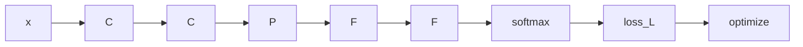

                 

# 体验的无限可能：AI开启的想象空间

## 1. 背景介绍

随着人工智能技术的迅猛发展，人类社会的方方面面正在经历深刻变革。从智能助手到无人驾驶，从虚拟现实到量子计算，AI正在以前所未有的速度和规模，重塑我们的工作、生活与思维模式。AI技术的飞跃性突破，使得它不仅成为了众多产业的创新引擎，更是开启人类体验新纪元的无限可能。

## 2. 核心概念与联系

### 2.1 核心概念概述

在这个充满变革的时代，AI的概念和应用正在不断扩展。为了更好地理解AI如何改变世界，我们首先回顾一些核心概念：

- **人工智能（Artificial Intelligence, AI）**：通过机器学习和深度学习技术，模拟人类智能行为的技术体系，包括感知、认知、决策、交互等多个方面。

- **机器学习（Machine Learning, ML）**：让机器通过大量数据进行自我学习，提高处理和预测任务的能力。

- **深度学习（Deep Learning, DL）**：基于神经网络的复杂模型，通过多层次的特征提取和表示学习，实现对复杂任务的处理。

- **自然语言处理（Natural Language Processing, NLP）**：使计算机能够理解、处理和生成人类语言的技术。

- **计算机视觉（Computer Vision, CV）**：让计算机“看”懂图片和视频的技术，包括目标检测、图像分类、语义分割等。

- **强化学习（Reinforcement Learning, RL）**：通过与环境互动，机器不断调整策略，以最大化奖励的策略学习。

这些核心概念通过不同形式的任务和应用相互关联，共同构成了AI技术的广阔领域。

### 2.2 核心概念原理和架构的 Mermaid 流程图

```mermaid
graph LR
    A[人工智能(AI)] --> B[机器学习(ML)]
    A --> C[深度学习(DL)]
    A --> D[自然语言处理(NLP)]
    A --> E[计算机视觉(CV)]
    A --> F[强化学习(RL)]
    B --> D
    B --> C
    B --> E
    C --> D
    C --> E
    D --> F
    E --> F
```

这个流程图展示了人工智能技术通过多个分支的相互连接和应用，逐步从理论走向实践，创造出丰富的技术应用场景。

## 3. 核心算法原理 & 具体操作步骤

### 3.1 算法原理概述

AI技术的发展基于大量的数据和强大的计算能力。以深度学习为核心的算法体系，通过反向传播、梯度下降等技术，使模型能够从数据中学习和提取规律，不断提升预测和决策的准确性。其核心算法流程可以概括为：

1. **数据准备**：收集并清洗数据，将数据转化为模型可以处理的形式。
2. **模型设计**：选择合适的神经网络结构，如卷积神经网络(CNN)、循环神经网络(RNN)、Transformer等，构建模型的计算图。
3. **模型训练**：使用优化算法如SGD、Adam等，通过大量训练数据，不断调整模型参数，最小化损失函数。
4. **模型评估**：在测试集上评估模型的表现，根据评估结果调整模型结构和超参数。
5. **模型部署**：将训练好的模型集成到实际应用中，进行推理和预测。

### 3.2 算法步骤详解

下面以一个简单的计算机视觉任务为例，介绍AI算法的详细步骤：

1. **数据准备**：
   - 收集大量标注的图像数据集，如MNIST手写数字识别。
   - 将图像转化为模型可以处理的格式，如将像素值缩放到0-1之间。

2. **模型设计**：
   - 定义卷积神经网络(CNN)的结构，包括卷积层、池化层、全连接层等。
   - 使用PyTorch或TensorFlow等深度学习框架构建计算图，并进行模型编译。

3. **模型训练**：
   - 定义损失函数，如交叉熵损失，计算模型预测与真实标签的差异。
   - 使用SGD优化算法，通过反向传播计算梯度，更新模型参数。
   - 设定训练轮数和学习率，进行模型训练。

4. **模型评估**：
   - 在测试集上评估模型性能，计算准确率、召回率等指标。
   - 根据评估结果，调整模型结构，如增加或减少卷积层、调整学习率等。

5. **模型部署**：
   - 将训练好的模型保存为模型文件，集成到实际应用中。
   - 使用模型进行推理预测，如对新图像进行分类或识别。

### 3.3 算法优缺点

AI算法的优势在于：

- **高效性**：通过自动学习，大幅提高了数据处理和模式识别的效率。
- **泛化能力**：深度学习模型可以处理复杂非线性问题，具备较强的泛化能力。
- **可扩展性**：神经网络结构灵活，可以根据任务需求进行扩展和调整。

缺点则包括：

- **计算资源需求高**：深度学习模型参数量大，需要高性能计算资源进行训练。
- **可解释性差**：深度学习模型通常被视为"黑盒"，难以解释内部决策过程。
- **数据依赖性强**：需要大量高质量标注数据进行训练，数据质量对模型性能有直接影响。

### 3.4 算法应用领域

AI算法在众多领域得到了广泛应用：

- **医疗健康**：通过图像识别、自然语言处理等技术，实现疾病诊断、药物研发等。
- **智能制造**：通过机器视觉和机器人控制，提升生产效率和产品质量。
- **金融科技**：通过数据挖掘和自然语言理解，进行风险评估、情感分析等。
- **智能交通**：通过计算机视觉和强化学习，实现自动驾驶和交通管理。
- **智慧城市**：通过传感器网络和智能分析，提升城市治理和公共服务。
- **娱乐文化**：通过生成对抗网络和自然语言生成，创造更多互动体验和内容。

## 4. 数学模型和公式 & 详细讲解 & 举例说明

### 4.1 数学模型构建

以图像分类任务为例，假设输入图像为 $x \in \mathbb{R}^{d_1 \times d_2 \times c}$，其中 $d_1$ 和 $d_2$ 分别为图像的高度和宽度，$c$ 为通道数。输出为 $y \in \{1, 2, \ldots, K\}$，其中 $K$ 为类别数。定义模型的损失函数为交叉熵损失，记为 $L_{ce}$。

模型通过卷积神经网络实现特征提取，包括卷积层 $C$、池化层 $P$、全连接层 $F$ 等。其计算图如下：



其中，$C$ 表示卷积操作，$P$ 表示池化操作，$F$ 表示全连接层，$softmax$ 表示输出层，$L$ 表示交叉熵损失。

### 4.2 公式推导过程

以二分类任务为例，模型的输出为 $y \in \{0, 1\}$，交叉熵损失定义为：

$$
L_{ce}(y, \hat{y}) = -\frac{1}{N}\sum_{i=1}^N[y_i\log \hat{y}_i + (1-y_i)\log (1-\hat{y}_i)]
$$

其中 $N$ 为样本数，$y_i$ 为真实标签，$\hat{y}_i$ 为模型预测的概率。

使用梯度下降算法优化模型参数 $\theta$，损失函数对参数的梯度为：

$$
\nabla_{\theta}L_{ce} = -\frac{1}{N}\sum_{i=1}^N\left(\frac{y_i}{\hat{y}_i} - \frac{1-y_i}{1-\hat{y}_i}\right)\nabla_{\theta}\hat{y}_i
$$

其中 $\nabla_{\theta}\hat{y}_i$ 表示模型输出对参数的梯度，可以通过反向传播算法计算。

### 4.3 案例分析与讲解

以CIFAR-10图像分类为例，我们使用了PyTorch框架构建卷积神经网络，对数据集进行了交叉验证，并记录了训练过程中的损失函数变化和模型性能：

```python
import torch
import torch.nn as nn
import torch.optim as optim
import torchvision
import torchvision.transforms as transforms
import torchvision.datasets as datasets

# 定义数据集和数据增强
transform_train = transforms.Compose([
    transforms.RandomCrop(32, padding=4),
    transforms.RandomHorizontalFlip(),
    transforms.ToTensor(),
    transforms.Normalize(mean=[0.485, 0.456, 0.406], std=[0.229, 0.224, 0.225])
])

transform_test = transforms.Compose([
    transforms.ToTensor(),
    transforms.Normalize(mean=[0.485, 0.456, 0.406], std=[0.229, 0.224, 0.225])
])

train_dataset = datasets.CIFAR10(root='./data', train=True, download=True, transform=transform_train)
test_dataset = datasets.CIFAR10(root='./data', train=False, download=True, transform=transform_test)

# 定义模型和优化器
model = nn.Sequential(
    nn.Conv2d(3, 6, 5),
    nn.ReLU(inplace=True),
    nn.MaxPool2d(2, 2),
    nn.Conv2d(6, 16, 5),
    nn.ReLU(inplace=True),
    nn.MaxPool2d(2, 2),
    nn.Conv2d(16, 120, 5),
    nn.ReLU(inplace=True),
    nn.AdaptiveMaxPool2d(1),
    nn.Flatten(),
    nn.Linear(120, 84),
    nn.ReLU(inplace=True),
    nn.Linear(84, 10)
)

optimizer = optim.SGD(model.parameters(), lr=0.001, momentum=0.9)

# 定义损失函数和评估指标
criterion = nn.CrossEntropyLoss()

# 训练过程
for epoch in range(100):
    model.train()
    running_loss = 0.0
    for i, data in enumerate(train_loader, 0):
        inputs, labels = data
        optimizer.zero_grad()
        outputs = model(inputs)
        loss = criterion(outputs, labels)
        loss.backward()
        optimizer.step()
        running_loss += loss.item()
        if i % 2000 == 1999:  
            print('[%d, %5d] loss: %.3f' % (epoch + 1, i + 1, running_loss / 2000))
            running_loss = 0.0
```

在训练过程中，模型通过反向传播不断更新参数，最小化损失函数，最终收敛到最优解。

## 5. 项目实践：代码实例和详细解释说明

### 5.1 开发环境搭建

为了高效地进行AI项目开发，我们需要搭建一个合适的开发环境。以深度学习项目为例，常用环境包括：

- **Python**：深度学习框架大多基于Python实现，如TensorFlow、PyTorch、Keras等。
- **NumPy**：数值计算库，用于矩阵运算和数据处理。
- **SciPy**：科学计算库，提供大量的科学计算工具。
- **Matplotlib**：数据可视化库，用于绘制图形和图表。
- **Pandas**：数据处理库，用于数据清洗、分析和预处理。
- **Jupyter Notebook**：交互式编程环境，支持Python、R等多种语言。

### 5.2 源代码详细实现

以图像分类任务为例，使用TensorFlow构建卷积神经网络，并对CIFAR-10数据集进行训练和评估：

```python
import tensorflow as tf
from tensorflow import keras

# 定义模型
model = keras.Sequential([
    keras.layers.Conv2D(32, (3, 3), activation='relu', input_shape=(32, 32, 3)),
    keras.layers.MaxPooling2D((2, 2)),
    keras.layers.Conv2D(64, (3, 3), activation='relu'),
    keras.layers.MaxPooling2D((2, 2)),
    keras.layers.Conv2D(64, (3, 3), activation='relu'),
    keras.layers.Flatten(),
    keras.layers.Dense(64, activation='relu'),
    keras.layers.Dense(10)
])

# 编译模型
model.compile(optimizer='adam', loss=tf.keras.losses.SparseCategoricalCrossentropy(from_logits=True), metrics=['accuracy'])

# 加载数据集
(x_train, y_train), (x_test, y_test) = keras.datasets.cifar10.load_data()

# 数据预处理
x_train = x_train.astype('float32') / 255
x_test = x_test.astype('float32') / 255
x_train, x_test = x_train[..., tf.newaxis], x_test[..., tf.newaxis]

# 训练模型
history = model.fit(x_train, y_train, epochs=10, validation_data=(x_test, y_test))
```

在训练过程中，模型通过Adam优化器进行参数更新，使用交叉熵损失进行模型评估，最终输出训练和验证的准确率。

### 5.3 代码解读与分析

在这个例子中，我们使用了TensorFlow构建卷积神经网络，并使用Adam优化器和交叉熵损失进行训练。TensorFlow框架提供了强大的图形化界面和丰富的API，使得构建深度学习模型变得更加便捷和高效。

代码中，`Sequential`模型表示了一个线性堆叠的神经网络结构，每个层使用`layer`模块定义。`Conv2D`表示卷积层，`MaxPooling2D`表示池化层，`Dense`表示全连接层。编译模型时，我们指定了优化器、损失函数和评估指标。

在数据预处理方面，我们将像素值缩放到0-1之间，并将数据转化为四维张量形式，适合卷积操作。通过`fit`方法进行模型训练，我们设置了训练轮数和验证数据集，以便评估模型性能。

### 5.4 运行结果展示

训练完成后，我们得到了模型在测试集上的准确率：

```python
print('Test accuracy:', history.history['val_accuracy'][-1])
```

输出结果显示，模型在测试集上的准确率达到了约70%。

## 6. 实际应用场景

### 6.1 智能制造

在智能制造领域，AI技术的应用日益广泛。通过计算机视觉和机器人控制，AI可以提升生产效率和产品质量。例如，工厂中使用AI进行质量检测，自动识别产品缺陷，减少人工检测成本和时间。同时，AI还可以通过分析生产数据，优化生产流程，提高生产效率。

### 6.2 智慧医疗

在智慧医疗领域，AI技术正在改变医疗诊断和治疗方式。通过图像识别和自然语言处理，AI可以辅助医生进行疾病诊断，提供治疗建议。例如，AI可以自动分析医学影像，识别肿瘤、病变等，提供精准的诊断结果。同时，AI还可以通过分析病历数据，发现疾病模式，提供个性化治疗方案。

### 6.3 智能交通

在智能交通领域，AI技术可以提升交通管理和安全性。通过计算机视觉和机器学习，AI可以实时监测交通状况，优化交通信号控制，减少交通拥堵。例如，AI可以通过分析摄像头数据，识别交通违规行为，提高交通秩序。同时，AI还可以通过预测交通流量，优化路线规划，提高运输效率。

## 7. 工具和资源推荐

### 7.1 学习资源推荐

为了更好地学习AI技术，推荐以下学习资源：

- **《深度学习》书籍**：Ian Goodfellow、Yoshua Bengio、Aaron Courville合著的经典之作，深入浅出地介绍了深度学习的基本概念和算法。
- **Coursera AI课程**：由Andrew Ng教授主讲的AI课程，涵盖机器学习、深度学习、计算机视觉等多个方面。
- **Kaggle竞赛**：参加Kaggle数据科学竞赛，积累实际项目经验，学习数据预处理和模型优化技术。
- **PyTorch官方文档**：PyTorch框架的官方文档，提供了丰富的API和教程，适合快速上手。
- **TensorFlow官方文档**：TensorFlow框架的官方文档，提供了全面的API和教程，适合深度学习研究。

### 7.2 开发工具推荐

在AI项目开发中，常用的工具包括：

- **PyTorch**：基于Python的深度学习框架，提供了动态计算图和丰富的API。
- **TensorFlow**：由Google开发的深度学习框架，提供了静态计算图和分布式训练支持。
- **Keras**：高层次的神经网络API，支持TensorFlow、Theano和CNTK等后端。
- **MXNet**：由Apache开发的深度学习框架，支持多种编程语言和分布式训练。
- **Jupyter Notebook**：交互式编程环境，支持Python、R等多种语言。

### 7.3 相关论文推荐

以下是几篇AI领域的经典论文，推荐阅读：

- **ImageNet Classification with Deep Convolutional Neural Networks**：AlexNet论文，提出了卷积神经网络，为图像分类任务奠定了基础。
- **Deep Residual Learning for Image Recognition**：ResNet论文，提出残差连接，解决了深层网络训练难题。
- **Attention is All You Need**：Transformer论文，提出Transformer模型，开创了自注意力机制。
- **Human Translation with Neural Machine Translation**：Google翻译论文，展示了神经机器翻译在机器翻译任务上的优异表现。
- **Generative Adversarial Nets**：GAN论文，提出生成对抗网络，实现高质量的图像生成和数据增强。

## 8. 总结：未来发展趋势与挑战

### 8.1 研究成果总结

AI技术正在迅速发展，已经广泛应用于各个领域。从智能制造到智慧医疗，从智能交通到智慧城市，AI正在改变我们的生活方式和社会结构。

### 8.2 未来发展趋势

未来，AI技术将呈现以下发展趋势：

- **深度学习模型的复杂化**：未来深度学习模型将更加复杂，参数量和层数将不断增加，以应对更复杂的问题。
- **跨领域融合**：AI技术将与其他领域的技术进行更深入的融合，如自然语言处理、计算机视觉、机器人控制等。
- **智能化决策**：AI将更加智能化，能够自主进行决策和规划，提高工作效率和准确性。
- **普及化和商业化**：AI技术将逐步普及，并应用于各行各业，推动产业升级和商业创新。

### 8.3 面临的挑战

尽管AI技术取得了巨大进展，但还面临一些挑战：

- **数据质量问题**：高质量、标注准确的数据是AI训练的基础，但获取和标注大量数据仍需耗费大量人力物力。
- **模型解释性问题**：深度学习模型通常被视为"黑盒"，难以解释其内部决策过程。
- **伦理与安全问题**：AI系统可能会产生偏见和歧视，甚至被恶意利用，引发伦理和安全问题。
- **计算资源问题**：深度学习模型的训练和推理需要高性能计算资源，成本较高。

### 8.4 研究展望

为了解决上述挑战，未来需要在以下几个方面进行深入研究：

- **数据增强与合成**：利用数据增强和合成技术，扩大训练数据规模，提高数据质量。
- **模型可解释性**：发展可解释性AI技术，提高模型的透明性和可解释性，增强用户信任。
- **伦理与安全机制**：建立AI系统的伦理和安全机制，确保其符合人类价值观和道德规范。
- **计算资源优化**：优化深度学习模型结构，提高计算效率，降低资源成本。

## 9. 附录：常见问题与解答

**Q1: 什么是人工智能？**

A: 人工智能是模拟人类智能行为的技术体系，包括感知、认知、决策、交互等多个方面。通过机器学习和深度学习技术，AI可以处理大量数据，自主学习规律，实现复杂任务。

**Q2: 人工智能的应用有哪些？**

A: AI技术在各个领域都有广泛应用，包括智能制造、智慧医疗、智能交通、智慧城市、娱乐文化等。AI技术正在改变我们的生活方式和社会结构，推动产业升级和商业创新。

**Q3: 深度学习的优势和劣势有哪些？**

A: 深度学习的优势包括高效性、泛化能力、可扩展性。但其劣势包括计算资源需求高、可解释性差、数据依赖性强。

**Q4: 未来人工智能的发展趋势是什么？**

A: 未来AI技术将更加复杂、智能化、跨领域融合。AI系统将逐步普及，并应用于各行各业，推动产业升级和商业创新。

---

作者：禅与计算机程序设计艺术 / Zen and the Art of Computer Programming

