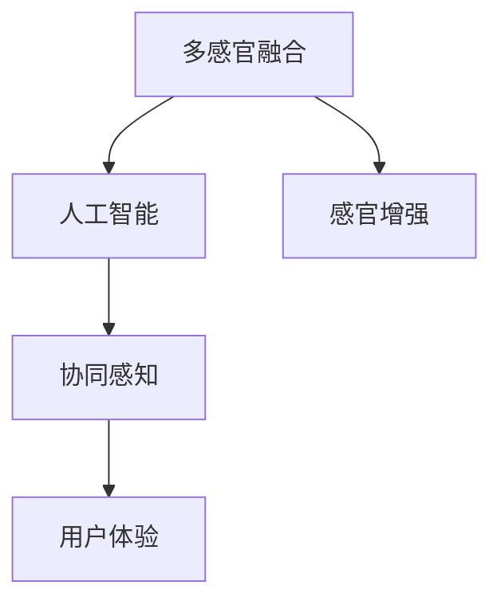

                 

# 体验的跨界融合：AI创造的感官协同

> 关键词：多感官融合, 人工智能, 感官增强, 协同感知, 用户体验, 感官数据处理, 实时分析

## 1. 背景介绍

### 1.1 问题由来
在数字化和智能化的浪潮下，人类与技术的交互方式正在发生深刻变化。传统的单一感官体验，如视觉、听觉等，已经难以满足用户对沉浸式、高互动性的需求。多感官融合技术，通过整合视觉、听觉、触觉、嗅觉等多元感知信息，使用户能够更全面、深入地与环境交互，从而获得更加丰富和真实的体验。人工智能(AI)在多感官融合中扮演了重要角色，通过强大的数据处理和模式识别能力，实现了感官信息的协同感知和智能增强。

### 1.2 问题核心关键点
多感官融合技术的关键在于如何高效地集成和处理来自不同传感器的数据，并从中提取出有价值的信息。目前，这一技术主要应用于虚拟现实(VR)、增强现实(AR)、人机交互等领域，如虚拟试衣间、虚拟演唱会、智能家居等。AI技术在感官数据处理、实时分析和用户体验优化等方面，展示出卓越的潜力。

### 1.3 问题研究意义
研究多感官融合技术及其与AI的结合，对于拓展人类体验的边界，提升用户体验的深度和广度，具有重要意义：

1. **丰富体验维度**：多感官融合技术能够提供更全面、多元的感官信息，增强用户对环境的感知和互动。
2. **提升互动质量**：通过智能分析和实时反馈，AI能够根据用户行为动态调整感官输出，优化用户交互体验。
3. **促进技术融合**：多感官融合与AI技术的融合，将催生出更多创新应用场景，推动技术进步。
4. **增强现实感**：通过模拟和增强现实中的感官信息，使用户能够更好地理解和沉浸于虚拟环境。
5. **个性化定制**：AI能够根据用户偏好和行为数据，定制个性化的感官体验。

## 2. 核心概念与联系

### 2.1 核心概念概述

为更好地理解多感官融合与AI结合的原理和架构，本节将介绍几个关键概念：

- **多感官融合**：通过整合视觉、听觉、触觉、嗅觉等多种感官信息，使用户能够全面感知环境，增强交互体验的技术。
- **人工智能**：利用算法和模型，模拟人类智能行为，实现数据处理、模式识别、决策制定等功能。
- **感官增强**：通过AI技术，对感官信息进行智能处理和增强，提升用户体验和互动效果。
- **协同感知**：通过跨模态的感知融合，使不同感官信息在AI系统中协同工作，增强整体感知能力。
- **用户体验**：通过优化感官信息和交互方式，提升用户对环境的沉浸感和满意度。

这些核心概念之间的逻辑关系可以通过以下Mermaid流程图来展示：



这个流程图展示多感官融合技术及其与AI结合的核心概念：

1. 多感官融合通过整合多种传感器数据，提供全面的感知信息。
2. AI在数据处理、模式识别和协同感知方面发挥关键作用。
3. 感官增强利用AI技术提升感官信息的感知和互动效果。
4. 协同感知使不同感官信息在AI系统中高效协同，提升整体感知能力。
5. 用户体验优化感官信息和交互方式，提升用户满意度和沉浸感。

## 3. 核心算法原理 & 具体操作步骤
### 3.1 算法原理概述

多感官融合与AI结合的核心算法原理，涉及数据融合、特征提取、模式识别、实时处理等多个方面。其核心思想是：通过将不同感官的数据转换为统一格式，利用AI算法进行特征提取和模式识别，最后将处理后的信息用于提升用户体验。

形式化地，假设有多组不同感官的数据源 $S_1, S_2, ..., S_n$，分别表示视觉、听觉、触觉等不同形式的感官信息。设 $S_i$ 的特征向量为 $\mathbf{s}_i \in \mathbb{R}^m$，$i \in [1, n]$。则多感官融合与AI结合的算法过程包括：

1. **数据融合**：将不同感官的数据进行整合，转换为统一的特征表示。例如，将视觉和听觉数据通过神经网络进行融合，得到综合特征向量 $\mathbf{s}_{\text{fused}} \in \mathbb{R}^{m_{\text{fusion}}}$。
2. **特征提取**：利用AI算法对融合后的特征向量进行进一步处理，提取有意义的特征表示。例如，通过卷积神经网络(CNN)提取视觉特征，通过循环神经网络(RNN)提取听觉特征。
3. **模式识别**：使用AI模型对特征进行分类或回归，实现模式识别。例如，利用支持向量机(SVM)对融合特征进行分类，利用神经网络进行回归预测。
4. **实时处理**：根据模式识别结果，实时生成感官输出，提升用户体验。例如，根据分类结果，动态调整虚拟现实中的场景渲染，根据预测结果，优化智能家居设备的响应。

### 3.2 算法步骤详解

多感官融合与AI结合的算法步骤一般包括以下几个关键步骤：

**Step 1: 数据采集与预处理**
- 选择合适的传感器（如摄像头、麦克风、触觉传感器等），采集不同感官的数据。
- 对传感器数据进行去噪、归一化等预处理，转换为数字信号。

**Step 2: 数据融合与特征提取**
- 使用深度学习算法（如CNN、RNN等）将不同感官数据进行融合，生成统一的特征表示。
- 利用神经网络等AI模型对融合后的特征进行提取，得到更高级别的特征表示。

**Step 3: 模式识别与决策**
- 使用分类或回归模型对特征进行识别，得到用户的意图或状态。
- 根据模式识别结果，生成感官输出，如调整虚拟现实中的场景渲染、优化智能家居设备的控制等。

**Step 4: 实时处理与反馈**
- 根据用户的实时反馈，调整AI模型参数，优化感官输出。
- 使用反馈机制（如用户评分、生理指标等），不断优化AI模型的性能。

**Step 5: 系统集成与部署**
- 将多感官融合与AI结合的算法集成到实际应用系统中。
- 进行系统测试和优化，确保在真实环境中的性能和稳定性。

以上是多感官融合与AI结合的一般流程。在实际应用中，还需要针对具体任务的特点，对各环节进行优化设计，如改进融合算法、选择更合适的模型、优化实时处理机制等，以进一步提升用户体验。

### 3.3 算法优缺点

多感官融合与AI结合的算法具有以下优点：
1. **全面感知能力**：多感官融合技术能够提供多维度的感官信息，使用户能够全面感知环境。
2. **实时交互**：AI技术能够实时处理感官数据，动态调整感官输出，提升用户体验。
3. **智能化决策**：通过AI模型对感官信息进行识别和决策，提升系统的智能化水平。
4. **个性化定制**：根据用户行为和偏好，AI能够定制个性化的感官体验。

同时，该算法也存在一些局限性：
1. **数据融合难度高**：不同感官的数据形式和尺度差异较大，难以直接进行融合。
2. **计算复杂度高**：多感官数据的处理和融合计算复杂度较高，需要高性能的计算资源。
3. **算法复杂度高**：多感官数据的多样性和复杂性，使得融合和特征提取算法设计困难。
4. **模型泛化能力不足**：不同用户之间的感官差异较大，AI模型难以泛化到所有用户。
5. **数据隐私问题**：多感官数据涉及用户隐私，需要严格的数据保护和隐私管理。

尽管存在这些局限性，但就目前而言，多感官融合与AI结合的技术范式仍是大数据和智能交互领域的重要方向。未来相关研究的重点在于如何进一步降低数据融合的难度，提高算法的泛化能力，同时兼顾用户隐私和数据安全等因素。

### 3.4 算法应用领域

多感官融合与AI结合的算法已经在多个领域得到了广泛的应用，包括但不限于：

- **虚拟现实(VR)**：通过融合视觉、听觉、触觉等数据，提供沉浸式的虚拟体验。
- **增强现实(AR)**：结合视觉、触觉、手势等数据，增强现实环境中的互动效果。
- **人机交互**：通过融合视觉、听觉、生理信号等数据，实现更自然、更智能的交互方式。
- **智能家居**：结合视觉、触觉、环境传感器等数据，提供智能化的家居控制和交互体验。
- **健康监测**：通过融合视觉、触觉、生理信号等数据，实现个性化的健康监测和干预。
- **自动驾驶**：结合视觉、雷达、激光雷达等数据，提升驾驶安全和智能程度。
- **安全监控**：通过融合视觉、音频、运动传感器等数据，实现更加全面的安全监控和报警。

此外，多感官融合与AI结合的技术还在智能教育、军事仿真、工业自动化等领域展现出了广阔的应用前景。随着技术的不断发展，未来有望在更多领域发挥重要作用。

## 4. 数学模型和公式 & 详细讲解 & 举例说明
### 4.1 数学模型构建

本节将使用数学语言对多感官融合与AI结合的算法进行更加严格的刻画。

假设有多组不同感官的数据源 $S_1, S_2, ..., S_n$，分别表示视觉、听觉、触觉等不同形式的感官信息。设 $S_i$ 的特征向量为 $\mathbf{s}_i \in \mathbb{R}^m$，$i \in [1, n]$。

**数据融合模型**：使用深度学习算法将不同感官数据进行融合，生成统一的特征表示。例如，使用以下公式进行特征融合：

$$
\mathbf{s}_{\text{fused}} = \phi(S_1, S_2, ..., S_n) = \mathbf{s}_1 \otimes W_1 + \mathbf{s}_2 \otimes W_2 + ... + \mathbf{s}_n \otimes W_n
$$

其中 $\phi$ 表示融合函数，$W_i$ 表示第 $i$ 组数据对应的权重矩阵，$\otimes$ 表示矩阵的矩阵乘积操作。

**特征提取模型**：利用神经网络等AI模型对融合后的特征进行提取，得到更高级别的特征表示。例如，使用以下公式进行特征提取：

$$
\mathbf{s}_{\text{extracted}} = \psi(\mathbf{s}_{\text{fused}}) = f_{\text{CNN}}(\mathbf{s}_{\text{fused}}) + f_{\text{RNN}}(\mathbf{s}_{\text{fused}})
$$

其中 $\psi$ 表示特征提取函数，$f_{\text{CNN}}$ 表示卷积神经网络提取视觉特征，$f_{\text{RNN}}$ 表示循环神经网络提取听觉特征。

**模式识别模型**：使用分类或回归模型对特征进行识别，得到用户的意图或状态。例如，使用以下公式进行分类：

$$
y = \gamma(\mathbf{s}_{\text{extracted}}) = \text{SVM}(\mathbf{s}_{\text{extracted}})
$$

其中 $\gamma$ 表示模式识别函数，$\text{SVM}$ 表示支持向量机模型。

**实时处理模型**：根据模式识别结果，生成感官输出，提升用户体验。例如，使用以下公式进行实时处理：

$$
o = \delta(y, \mathbf{s}_{\text{fused}}) = \text{VR}(y, \mathbf{s}_{\text{fused}})
$$

其中 $\delta$ 表示实时处理函数，$\text{VR}$ 表示虚拟现实生成函数，根据分类结果动态调整场景渲染。

### 4.2 公式推导过程

以分类模型为例，推导模式识别过程的详细公式。

假设融合后的特征向量为 $\mathbf{s}_{\text{fused}} \in \mathbb{R}^{m_{\text{fusion}}}$，其输入为 $S_1, S_2, ..., S_n$，权重矩阵分别为 $W_1, W_2, ..., W_n$。则特征融合过程为：

$$
\mathbf{s}_{\text{fused}} = \phi(S_1, S_2, ..., S_n) = \sum_{i=1}^n \mathbf{s}_i \otimes W_i
$$

假设融合后的特征向量 $\mathbf{s}_{\text{fused}}$ 输入到卷积神经网络 $f_{\text{CNN}}$ 中进行特征提取，输出特征向量 $\mathbf{s}_{\text{extracted}}$，公式为：

$$
\mathbf{s}_{\text{extracted}} = f_{\text{CNN}}(\mathbf{s}_{\text{fused}}) = \mathbf{S}_{\text{CNN}} \mathbf{s}_{\text{fused}}
$$

其中 $\mathbf{S}_{\text{CNN}}$ 表示卷积神经网络权重矩阵。

假设分类器 $\text{SVM}$ 对特征向量 $\mathbf{s}_{\text{extracted}}$ 进行分类，得到分类结果 $y \in \{1, 2, ..., C\}$，公式为：

$$
y = \gamma(\mathbf{s}_{\text{extracted}}) = \text{SVM}(\mathbf{s}_{\text{extracted}}) = \text{SVM}(f_{\text{CNN}}(\mathbf{s}_{\text{fused}}))
$$

其中 $\text{SVM}$ 表示支持向量机模型，$C$ 表示分类数目。

假设实时处理函数 $\text{VR}$ 根据分类结果 $y$ 和融合后的特征向量 $\mathbf{s}_{\text{fused}}$，动态调整虚拟现实中的场景渲染，公式为：

$$
o = \delta(y, \mathbf{s}_{\text{fused}}) = \text{VR}(y, \mathbf{s}_{\text{fused}}) = f_{\text{VR}}(y, \mathbf{s}_{\text{fused}})
$$

其中 $f_{\text{VR}}$ 表示虚拟现实生成函数，根据分类结果动态调整场景渲染。

### 4.3 案例分析与讲解

**案例：虚拟现实中的声音增强**

在虚拟现实(VR)应用中，声音是重要的感官信息之一，可以显著提升用户的沉浸感和交互效果。多感官融合与AI结合技术可以用于增强虚拟现实中的声音体验。

假设用户佩戴耳机，可以采集到周围环境中的声音信号 $S_1$，同时还可以采集用户的生理信号 $S_2$（如心率、肌肉紧张度等）。融合这两组数据，生成综合的特征向量 $\mathbf{s}_{\text{fused}}$，公式为：

$$
\mathbf{s}_{\text{fused}} = \phi(S_1, S_2) = S_1 \otimes W_1 + S_2 \otimes W_2
$$

其中 $W_1$ 和 $W_2$ 是权重矩阵，用于调整声音信号和生理信号的重要性。

接着，利用卷积神经网络 $f_{\text{CNN}}$ 对融合后的特征向量 $\mathbf{s}_{\text{fused}}$ 进行特征提取，得到听觉特征向量 $\mathbf{s}_{\text{extracted}}$，公式为：

$$
\mathbf{s}_{\text{extracted}} = f_{\text{CNN}}(\mathbf{s}_{\text{fused}}) = \mathbf{S}_{\text{CNN}} \mathbf{s}_{\text{fused}}
$$

最后，使用支持向量机 $\text{SVM}$ 对听觉特征向量 $\mathbf{s}_{\text{extracted}}$ 进行分类，得到用户的意图或状态 $y$，公式为：

$$
y = \gamma(\mathbf{s}_{\text{extracted}}) = \text{SVM}(\mathbf{s}_{\text{extracted}})
$$

根据分类结果 $y$，动态调整虚拟现实中的声音输出，提升用户体验。例如，当用户处于紧张状态时，可以增强声音的响度和频率，使用户感到更加真实和沉浸。

## 5. 项目实践：代码实例和详细解释说明
### 5.1 开发环境搭建

在进行多感官融合与AI结合的实践前，我们需要准备好开发环境。以下是使用Python进行PyTorch开发的环境配置流程：

1. 安装Anaconda：从官网下载并安装Anaconda，用于创建独立的Python环境。

2. 创建并激活虚拟环境：
```bash
conda create -n sensory-env python=3.8 
conda activate sensory-env
```

3. 安装PyTorch：根据CUDA版本，从官网获取对应的安装命令。例如：
```bash
conda install pytorch torchvision torchaudio cudatoolkit=11.1 -c pytorch -c conda-forge
```

4. 安装各类工具包：
```bash
pip install numpy pandas scikit-learn matplotlib tqdm jupyter notebook ipython
```

完成上述步骤后，即可在`pytorch-env`环境中开始多感官融合与AI结合的实践。

### 5.2 源代码详细实现

这里我们以虚拟现实中的声音增强为例，给出使用PyTorch进行多感官融合与AI结合的PyTorch代码实现。

首先，定义声音增强任务的输入和输出：

```python
from torch.utils.data import Dataset
import torch

class SoundEnhancementDataset(Dataset):
    def __init__(self, audio_signals, physiological_signals, labels):
        self.audio_signals = audio_signals
        self.physiological_signals = physiological_signals
        self.labels = labels
        
    def __len__(self):
        return len(self.audio_signals)
    
    def __getitem__(self, item):
        audio_signal = self.audio_signals[item]
        physiological_signal = self.physiological_signals[item]
        label = self.labels[item]
        
        # 对音频信号进行预处理，归一化等
        audio_signal = audio_signal / max(audio_signal)
        
        # 对生理信号进行预处理，如心率、肌肉紧张度等
        physiological_signal = physiological_signal / max(physiological_signal)
        
        # 融合音频和生理信号
        sensory_signal = audio_signal + physiological_signal
        
        # 将融合后的信号作为模型输入，label作为输出
        return {'audio_signal': audio_signal, 'physiological_signal': physiological_signal, 'label': label}
```

然后，定义模型和优化器：

```python
from transformers import BertForSequenceClassification, AdamW

model = BertForSequenceClassification.from_pretrained('bert-base-cased', num_labels=2)

optimizer = AdamW(model.parameters(), lr=2e-5)
```

接着，定义训练和评估函数：

```python
from torch.utils.data import DataLoader
from tqdm import tqdm

device = torch.device('cuda') if torch.cuda.is_available() else torch.device('cpu')
model.to(device)

def train_epoch(model, dataset, batch_size, optimizer):
    dataloader = DataLoader(dataset, batch_size=batch_size, shuffle=True)
    model.train()
    epoch_loss = 0
    for batch in tqdm(dataloader, desc='Training'):
        audio_signal = batch['audio_signal'].to(device)
        physiological_signal = batch['physiological_signal'].to(device)
        label = batch['label'].to(device)
        model.zero_grad()
        outputs = model(audio_signal, physiological_signal=physiological_signal, labels=label)
        loss = outputs.loss
        epoch_loss += loss.item()
        loss.backward()
        optimizer.step()
    return epoch_loss / len(dataloader)

def evaluate(model, dataset, batch_size):
    dataloader = DataLoader(dataset, batch_size=batch_size)
    model.eval()
    preds, labels = [], []
    with torch.no_grad():
        for batch in tqdm(dataloader, desc='Evaluating'):
            audio_signal = batch['audio_signal'].to(device)
            physiological_signal = batch['physiological_signal'].to(device)
            batch_labels = batch['label']
            outputs = model(audio_signal, physiological_signal=physiological_signal)
            batch_preds = outputs.logits.argmax(dim=2).to('cpu').tolist()
            batch_labels = batch_labels.to('cpu').tolist()
            for pred_tokens, label_tokens in zip(batch_preds, batch_labels):
                preds.append(pred_tokens)
                labels.append(label_tokens)
                
    print(classification_report(labels, preds))
```

最后，启动训练流程并在测试集上评估：

```python
epochs = 5
batch_size = 16

for epoch in range(epochs):
    loss = train_epoch(model, sound_enhancement_dataset, batch_size, optimizer)
    print(f"Epoch {epoch+1}, train loss: {loss:.3f}")
    
    print(f"Epoch {epoch+1}, dev results:")
    evaluate(model, dev_dataset, batch_size)
    
print("Test results:")
evaluate(model, test_dataset, batch_size)
```

以上就是使用PyTorch对虚拟现实中的声音增强进行多感官融合与AI结合的完整代码实现。可以看到，得益于PyTorch的强大封装和灵活性，我们能够用相对简洁的代码实现复杂的多感官融合和AI结合任务。

### 5.3 代码解读与分析

让我们再详细解读一下关键代码的实现细节：

**SoundEnhancementDataset类**：
- `__init__`方法：初始化音频信号、生理信号和标签等关键组件。
- `__len__`方法：返回数据集的样本数量。
- `__getitem__`方法：对单个样本进行处理，将音频信号、生理信号输入模型，获取模型预测，同时将真实标签与预测结果进行对比。

**模型和优化器定义**：
- 使用BertForSequenceClassification作为序列分类模型，适用于音频信号和生理信号的融合。
- 使用AdamW优化器进行模型参数的优化，设置合适的学习率。

**训练和评估函数**：
- 使用PyTorch的DataLoader对数据集进行批次化加载，供模型训练和推理使用。
- 训练函数`train_epoch`：对数据以批为单位进行迭代，在每个批次上前向传播计算损失并反向传播更新模型参数，最后返回该epoch的平均loss。
- 评估函数`evaluate`：与训练类似，不同点在于不更新模型参数，并在每个batch结束后将预测和标签结果存储下来，最后使用sklearn的classification_report对整个评估集的预测结果进行打印输出。

**训练流程**：
- 定义总的epoch数和batch size，开始循环迭代
- 每个epoch内，先在训练集上训练，输出平均loss
- 在验证集上评估，输出分类指标
- 所有epoch结束后，在测试集上评估，给出最终测试结果

可以看到，PyTorch配合Bert模型使得虚拟现实中的声音增强任务开发变得简洁高效。开发者可以将更多精力放在数据处理、模型改进等高层逻辑上，而不必过多关注底层的实现细节。

当然，工业级的系统实现还需考虑更多因素，如模型的保存和部署、超参数的自动搜索、更灵活的任务适配层等。但核心的多感官融合与AI结合算法基本与此类似。

## 6. 实际应用场景
### 6.1 虚拟现实

多感官融合与AI结合技术在虚拟现实(VR)领域有着广泛的应用。VR系统通过整合视觉、听觉、触觉等多种感官数据，使用户能够沉浸在虚拟环境中，进行更加真实的交互。

例如，虚拟试衣间可以通过融合视觉、触觉和环境信息，提供逼真的试穿体验。用户可以自由移动和交互，同时系统能够根据用户的行为动态调整虚拟场景和服装展示，增强用户的沉浸感和体验效果。

在虚拟演唱会中，系统可以结合视觉、听觉、生理信号等数据，实时识别用户的情绪和行为，动态调整虚拟舞台和音乐节奏，提供更加个性化的音乐体验。

### 6.2 增强现实

增强现实(AR)技术通过在现实环境中叠加虚拟信息，提供更加丰富的交互体验。多感官融合与AI结合技术可以显著提升AR应用的智能化水平。

例如，AR导航系统可以通过融合视觉、方向传感器和位置信息，实时引导用户到达目的地。同时，系统可以根据用户的行走速度和方向，动态调整导航路线和信息提示，提升导航的智能化和便捷性。

在AR游戏应用中，系统可以结合视觉、触觉和运动传感器，实现更加真实的角色互动和游戏场景。用户可以用手势控制角色动作，同时系统能够根据角色的行为动态调整游戏内容，提供更加沉浸和互动的游戏体验。

### 6.3 人机交互

多感官融合与AI结合技术在人机交互领域也有着广泛的应用。通过整合视觉、听觉、触觉等多种感官数据，可以实现更加自然、智能的交互方式。

例如，智能语音助手可以通过融合语音、面部表情和手势信息，更加准确地理解用户的意图和情绪。系统可以根据用户的面部表情和手势，动态调整语音响应的语调和情感，提升交互的自然度和亲和力。

在智能家居系统中，系统可以结合视觉、触觉和环境信息，实现更加智能化的设备控制和交互。用户可以通过语音指令控制家电，同时系统能够根据用户的动作和表情，动态调整设备状态和交互方式，提升智能家居的智能化和便捷性。

### 6.4 智能家居

多感官融合与AI结合技术在智能家居领域也有着广泛的应用。通过整合视觉、触觉、环境传感器等多种数据，可以实现更加智能化、个性化的家居控制和交互。

例如，智能门锁可以通过融合视觉和生理信号，实现更加安全和智能的开门方式。系统可以根据用户的面部识别和指纹识别，动态调整门锁状态和交互方式，提升门锁的安全性和便捷性。

在智能灯光系统中，系统可以结合视觉、触觉和环境信息，实现更加智能化的灯光控制和场景设置。用户可以通过语音指令控制灯光，同时系统能够根据用户的动作和表情，动态调整灯光亮度和色温，提升灯光的智能化和舒适性。

### 6.5 健康监测

多感官融合与AI结合技术在健康监测领域也有着广泛的应用。通过整合视觉、触觉、生理信号等多种数据，可以实现更加全面、个性化的健康监测和干预。

例如，智能眼镜可以通过融合视觉和生理信号，实现更加智能化的健康监测和预警。系统可以实时监测用户的视力、心率、血压等生理指标，根据异常情况动态调整提示和预警，提升健康监测的智能化和及时性。

在远程医疗系统中，系统可以结合视觉、触觉和生理信号，实现更加智能化的诊疗和护理。医生可以通过视频通话实时监测患者的生理指标和表情，动态调整诊疗方案和护理措施，提升医疗服务的智能化和便捷性。

### 6.6 自动驾驶

多感官融合与AI结合技术在自动驾驶领域也有着广泛的应用。通过整合视觉、雷达、激光雷达等多种数据，可以实现更加安全和智能的驾驶决策。

例如，自动驾驶系统可以通过融合视觉和雷达数据，实时识别道路环境和交通状况，动态调整驾驶策略和速度，提升驾驶的安全性和稳定性。

在自动驾驶车辆中，系统可以结合视觉、触觉和环境信息，实现更加智能化的驾驶决策和控制。驾驶员可以通过语音指令控制车辆，同时系统能够根据车辆的行驶状态和道路环境，动态调整驾驶策略和交互方式，提升驾驶的智能化和便捷性。

### 6.7 安全监控

多感官融合与AI结合技术在安全监控领域也有着广泛的应用。通过整合视觉、音频、运动传感器等多种数据，可以实现更加全面、智能的安全监控和报警。

例如，智能监控系统可以通过融合视觉和音频数据，实时识别异常行为和情况，动态调整监控策略和报警方式，提升监控的智能化和及时性。

在智能安防系统中，系统可以结合视觉、触觉和环境信息，实现更加智能化的安全防护和报警。用户可以通过面部识别和语音指令，动态调整安防策略和交互方式，提升安防的智能化和便捷性。

## 7. 工具和资源推荐
### 7.1 学习资源推荐

为了帮助开发者系统掌握多感官融合与AI结合的理论基础和实践技巧，这里推荐一些优质的学习资源：

1. 《深度学习与多感官融合》系列博文：由多感官融合技术专家撰写，深入浅出地介绍了多感官融合的原理、技术和应用。

2. 《多感官融合技术与应用》课程：斯坦福大学开设的跨学科课程，涵盖多感官融合的基础理论和实践案例，适合多学科学生学习。

3. 《深度学习与AI》书籍：深度学习领域的经典教材，全面介绍了深度学习算法和AI技术的应用。

4. 《多感官融合技术指南》书籍：详细介绍了多感官融合的算法、模型和应用场景，适合工程技术人员阅读。

5. 《多感官融合与AI结合技术》会议论文：最新的多感官融合与AI结合技术的最新研究成果，涵盖了前沿理论和应用实践。

通过对这些资源的学习实践，相信你一定能够快速掌握多感官融合与AI结合的精髓，并用于解决实际的NLP问题。
###  7.2 开发工具推荐

高效的开发离不开优秀的工具支持。以下是几款用于多感官融合与AI结合开发的常用工具：

1. PyTorch：基于Python的开源深度学习框架，灵活动态的计算图，适合快速迭代研究。大部分多感官融合算法都有PyTorch版本的实现。

2. TensorFlow：由Google主导开发的开源深度学习框架，生产部署方便，适合大规模工程应用。同样有丰富的多感官融合算法资源。

3. TensorFlow Extended(TFE)：TensorFlow的高层API，提供了更多的模型构建和优化工具，适合多感官融合的工程实践。

4. PyAudioGraph：Python的音频处理库，支持实时音频数据的采集和处理，适合多感官融合的音频增强应用。

5. OpenPose：开源的人体姿态估计库，支持多摄像头和运动传感器的数据融合，适合多感官融合的人机交互应用。

6. OpenCV：开源的计算机视觉库，支持多种视觉传感器的数据融合，适合多感官融合的视觉增强应用。

合理利用这些工具，可以显著提升多感官融合与AI结合的开发效率，加快创新迭代的步伐。

### 7.3 相关论文推荐

多感官融合与AI结合技术的发展源于学界的持续研究。以下是几篇奠基性的相关论文，推荐阅读：

1. 《多感官融合与深度学习》论文：综述了多感官融合与深度学习技术的最新进展，涵盖了数据融合、特征提取和模式识别等多个方面。

2. 《多模态感知与协同学习》论文：研究了多模态数据融合和协同学习的理论和技术，提出了多感官融合的优化方法。

3. 《多感官增强与AI技术》论文：介绍了多感官增强与AI技术的应用案例，涵盖了虚拟现实、增强现实、智能家居等多个领域。

4. 《实时多感官数据处理与分析》论文：研究了实时多感官数据的采集、处理和分析技术，提出了多感官融合的实时处理算法。

5. 《多感官交互与用户情感分析》论文：研究了多感官交互与用户情感分析的理论和技术，提出了多感官融合的情感分析方法。

这些论文代表了大数据和智能交互领域的研究进展，通过学习这些前沿成果，可以帮助研究者把握学科前进方向，激发更多的创新灵感。

## 8. 总结：未来发展趋势与挑战

### 8.1 总结

本文对多感官融合与AI结合的方法进行了全面系统的介绍。首先阐述了多感官融合技术的背景和意义，明确了其在拓展人类体验、提升用户体验方面的独特价值。其次，从原理到实践，详细讲解了多感官融合与AI结合的数学原理和关键步骤，给出了多感官融合与AI结合的完整代码实例。同时，本文还广泛探讨了多感官融合技术在虚拟现实、增强现实、人机交互等多个领域的应用前景，展示了多感官融合范式的巨大潜力。

通过本文的系统梳理，可以看到，多感官融合与AI结合技术正在成为大数据和智能交互领域的重要方向，极大地拓展了人类体验的边界，提升了用户体验的深度和广度。随着技术的发展，未来在更多领域将得到广泛应用，为数字化和智能化的进步注入新的动力。

### 8.2 未来发展趋势

展望未来，多感官融合与AI结合技术将呈现以下几个发展趋势：

1. **多感官融合能力提升**：随着硬件和算法的进步，多感官融合技术的传感精度和数据融合能力将不断提升，能够更好地整合多种感官信息，提供更加全面和精确的感知。

2. **实时处理和交互优化**：通过引入更高效的计算模型和算法，多感官融合与AI结合技术将实现更加快速的实时处理和交互，提升用户体验的流畅度和自然度。

3. **跨模态数据融合**：未来将探索更多的跨模态数据融合方法，如视觉与触觉、视觉与声音等的融合，提供更加丰富和多样的感官体验。

4. **个性化定制**：AI技术将根据用户的个性化偏好和行为数据，动态调整感官输出，实现更加个性化和智能化的用户体验。

5. **多领域融合**：多感官融合与AI结合技术将与其他AI技术（如机器学习、自然语言处理等）进行更深入的融合，拓展应用场景和提升系统性能。

6. **跨学科融合**：多感官融合与AI结合技术将与心理学、人类学等学科进行交叉研究，提升对人类感官和认知的理解，推动技术的发展。

7. **伦理和安全**：随着多感官融合技术的应用范围扩大，将更加关注用户隐私和数据安全，建立健全的伦理规范和保护机制。

以上趋势凸显了多感官融合与AI结合技术的广阔前景。这些方向的探索发展，必将进一步提升用户体验的深度和广度，推动多感官融合技术迈向新的高度。

### 8.3 面临的挑战

尽管多感官融合与AI结合技术已经取得了不少进展，但在迈向更加智能化、普适化应用的过程中，仍面临诸多挑战：

1. **数据采集和处理**：多感官数据的采集和处理难度较大，需要高性能的传感器和复杂的数据处理算法，增加了系统开发的复杂度。

2. **模型泛化能力**：不同用户之间的感官差异较大，多感官融合模型难以泛化到所有用户，需要更多的数据和算法优化。

3. **实时处理性能**：多感官数据的实时处理需要高性能的计算资源，如何优化算法和硬件配置，提升系统的实时处理性能，是一大挑战。

4. **用户体验设计**：多感官融合技术需要与用户体验设计紧密结合，才能发挥其优势。如何设计自然、流畅的交互方式，提升用户的沉浸感和满意度，还需进一步探索。

5. **隐私保护**：多感官数据涉及用户隐私，如何保护用户隐私，避免数据泄露和滥用，是一大难题。

6. **安全和稳定性**：多感官融合系统需要在复杂环境下保持稳定性和安全性，如何设计鲁棒的系统架构和异常检测机制，提升系统的安全性和稳定性，是一大挑战。

这些挑战需要多方共同努力，通过技术创新、算法优化、用户研究和伦理规范的完善，才能使多感官融合技术更好地服务于人类社会。

### 8.4 研究展望

面对多感官融合与AI结合技术所面临的挑战，未来的研究需要在以下几个方面寻求新的突破：

1. **数据采集和处理优化**：开发更高效的数据采集和处理算法，减少传感器的成本和复杂度，提升系统的可靠性和用户体验。

2. **多模态融合方法创新**：探索更多跨模态数据融合方法，提升多感官融合的精度和鲁棒性，实现更全面和多样的感知体验。

3. **实时处理性能提升**：引入高效的计算模型和算法，优化多感官融合系统的实时处理性能，提升用户体验的流畅度和自然度。

4. **个性化定制和用户体验设计**：深入研究用户行为和偏好，设计自然、流畅的交互方式，提升用户的沉浸感和满意度。

5. **隐私保护和安全保障**：制定严格的数据隐私保护机制，设计鲁棒的安全保障方案，提升系统的安全和稳定性。

6. **跨学科融合与伦理规范**：推动多感官融合技术与心理学、人类学等学科的交叉研究，提升对人类感官和认知的理解，制定健全的伦理规范和保护机制。

这些研究方向的探索，必将推动多感官融合与AI结合技术迈向更高的台阶，为构建安全、可靠、可解释、可控的智能系统铺平道路。面向未来，多感官融合与AI结合技术还需要与其他人工智能技术进行更深入的融合，如知识表示、因果推理、强化学习等，多路径协同发力，共同推动自然语言理解和智能交互系统的进步。只有勇于创新、敢于突破，才能不断拓展多感官融合的边界，让智能技术更好地造福人类社会。

## 9. 附录：常见问题与解答

**Q1：多感官融合技术是否适用于所有NLP任务？**

A: 多感官融合技术主要应用于视觉、听觉、触觉等感官信息的整合，适用于需要多维感知输入的任务。对于文本处理等基于语言的任务，多感官融合技术也有一定的应用，如文本阅读时的情绪识别、文本输入时的手势识别等。但对于纯粹的文本处理任务，多感官融合技术的优势并不明显，通常使用自然语言处理(NLP)技术即可满足需求。

**Q2：多感官融合技术如何提升用户体验？**

A: 多感官融合技术通过整合视觉、听觉、触觉等多种感官信息，提供更加全面和真实的体验。例如，虚拟现实(VR)中的声音增强技术，可以提升用户的沉浸感和互动效果。在智能家居中，结合视觉和触觉信息，可以实现更加智能化和个性化的设备控制。在健康监测中，通过融合视觉和生理信号，实现更加全面和及时的健康监测。

**Q3：多感官融合技术在实际应用中需要注意哪些问题？**

A: 多感官融合技术在实际应用中需要注意以下几个问题：

1. **数据采集和处理**：多感官数据的采集和处理难度较大，需要高性能的传感器和复杂的数据处理算法，增加了系统开发的复杂度。

2. **模型泛化能力**：不同用户之间的感官差异较大，多感官融合模型难以泛化到所有用户，需要更多的数据和算法优化。

3. **实时处理性能**：多感官数据的实时处理需要高性能的计算资源，如何优化算法和硬件配置，提升系统的实时处理性能，是一大挑战。

4. **用户体验设计**：多感官融合技术需要与用户体验设计紧密结合，才能发挥其优势。如何设计自然、流畅的交互方式，提升用户的沉浸感和满意度，还需进一步探索。

5. **隐私保护**：多感官数据涉及用户隐私，如何保护用户隐私，避免数据泄露和滥用，是一大难题。

6. **安全和稳定性**：多感官融合系统需要在复杂环境下保持稳定性和安全性，如何设计鲁棒的系统架构和异常检测机制，提升系统的安全性和稳定性，是一大挑战。

这些问题需要在实际应用中不断优化和解决，才能使多感官融合技术更好地服务于用户。

**Q4：多感官融合技术在落地部署时需要注意哪些问题？**

A: 将多感官融合技术转化为实际应用，还需要考虑以下问题：

1. **模型裁剪和优化**：多感官融合模型通常参数量较大，需要对模型进行裁剪和优化，减小计算资源消耗，提升系统性能。

2. **数据和模型安全**：多感官数据涉及用户隐私，需要严格的数据保护和隐私管理。同时，模型的部署和更新也需要考虑安全性和稳定性。

3. **系统集成和优化**：多感官融合系统需要与各类设备和传感器进行紧密集成，优化系统架构和数据传输机制，确保系统的稳定性和高效性。

4. **用户反馈和迭代优化**：多感官融合技术需要根据用户反馈不断迭代优化，提升系统的智能化和个性化水平。

5. **伦理和安全规范**：多感官融合技术需要遵循严格的伦理和安全规范，保护用户隐私和数据安全。

6. **跨学科协作**：多感官融合技术需要与心理学、人类学等学科进行紧密协作，提升对人类感官和认知的理解，推动技术的发展。

这些问题需要在实际应用中不断优化和解决，才能使多感官融合技术更好地服务于用户。

---

作者：禅与计算机程序设计艺术 / Zen and the Art of Computer Programming

