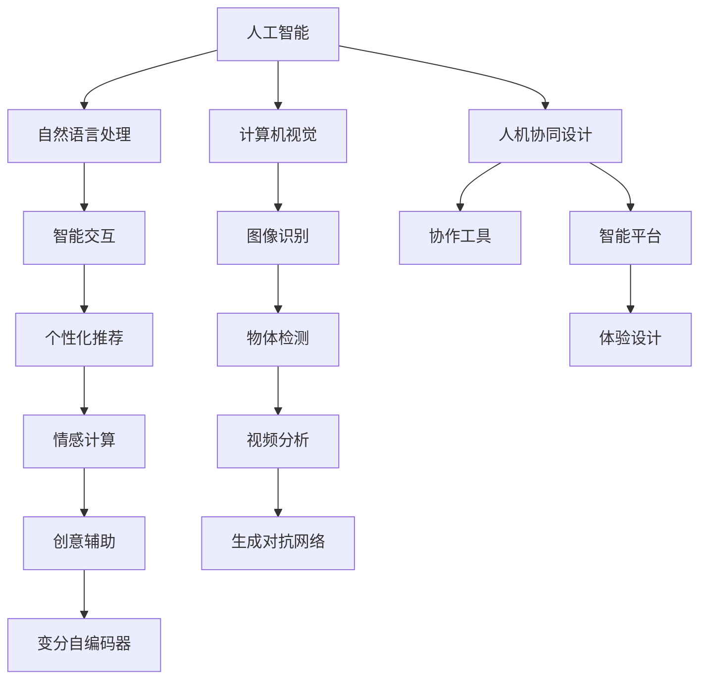

                 

## 1. 背景介绍

### 1.1 问题由来

在数字化浪潮的推动下，人工智能(AI)技术已经在各个领域取得了突破性进展。从智能客服到医疗诊断，从自动驾驶到语音识别，AI已经融入我们生活的方方面面。然而，在追求智能化的过程中，我们忽视了体验的重要性。当前的产品设计，往往只注重功能的实现，而忽略了用户的真实感受和情感体验。体验设计是连接产品与用户的桥梁，是提升用户体验的关键。

本文旨在探讨AI与人类创意如何协作，实现体验设计的未来。通过分析当前AI在体验设计中的应用，我们将详细介绍如何利用AI技术，提升用户体验，激发创意灵感，实现智能化与体验化的完美结合。

### 1.2 问题核心关键点

体验设计的未来，需要AI与人类创意的紧密协作。当前，AI在体验设计中的应用主要体现在以下几个方面：

- **智能交互**：利用自然语言处理(NLP)和计算机视觉(CV)技术，实现用户与产品的无缝交互。
- **个性化推荐**：通过大数据分析和机器学习技术，为用户提供个性化的内容和推荐，提升用户体验。
- **情感计算**：通过分析用户的行为和情感数据，优化产品设计和用户体验。
- **创意辅助**：利用生成对抗网络(GAN)、变分自编码器(VAE)等技术，生成创意设计原型和素材。
- **人机协同设计**：利用协作工具和智能平台，实现设计团队的无缝协作和创意共享。

这些AI技术的应用，将极大地提升体验设计的效率和质量，助力产品创新和用户体验优化。

## 2. 核心概念与联系

### 2.1 核心概念概述

要理解AI与体验设计的未来，我们需要掌握几个关键概念：

- **人工智能**：通过模拟人类智能行为，使机器能够自主地完成某些任务的技术。
- **自然语言处理**：使计算机能够理解、解释和生成人类语言的技术。
- **计算机视觉**：使计算机能够“看”的技术，包括图像识别、物体检测、视频分析等。
- **个性化推荐**：根据用户的行为和偏好，推荐最合适的产品或内容。
- **情感计算**：通过分析用户的行为和生理数据，理解用户的情感状态。
- **创意辅助**：利用生成式模型，生成创意设计素材和原型。
- **人机协同设计**：利用协作工具和智能平台，实现团队协作和创意共享。

这些概念之间相互作用，共同推动体验设计的未来发展。

### 2.2 核心概念原理和架构的 Mermaid 流程图



这个流程图展示了AI在体验设计中的应用框架：

1. 人工智能作为核心技术，驱动自然语言处理、计算机视觉等子技术。
2. 自然语言处理和计算机视觉分别用于实现智能交互和图像识别等。
3. 个性化推荐、情感计算、创意辅助等人机交互技术，共同提升用户体验。
4. 人机协同设计工具和平台，实现团队协作和创意共享。
5. 最终目标是通过这些技术的结合，实现体验设计的优化和创新。

## 3. 核心算法原理 & 具体操作步骤

### 3.1 算法原理概述

体验设计的未来，离不开AI技术的支持。AI在体验设计中的应用，主要依赖于机器学习、深度学习等算法。这些算法通过学习大量数据，提取其中的模式和规律，进而实现智能交互、个性化推荐、情感计算等功能。

具体来说，体验设计的AI算法包括以下几个步骤：

1. **数据收集**：通过传感器、日志等手段，收集用户行为和生理数据。
2. **特征提取**：将数据转化为机器可处理的特征向量。
3. **模型训练**：利用机器学习算法，训练出能够预测用户行为和情感的模型。
4. **模型评估**：通过交叉验证、A/B测试等方法，评估模型的性能和效果。
5. **模型应用**：将训练好的模型应用于实际场景，提升用户体验。

### 3.2 算法步骤详解

#### 3.2.1 数据收集

数据收集是AI在体验设计中的应用基础。目前常用的数据收集手段包括：

- **传感器数据**：通过加速度计、陀螺仪等传感器，收集用户的运动和位置数据。
- **日志数据**：记录用户的操作记录和系统日志。
- **生理数据**：通过心率监测、脑电波等设备，收集用户的生理状态数据。
- **行为数据**：通过用户在产品上的操作数据，收集其行为模式。

#### 3.2.2 特征提取

特征提取是将原始数据转化为机器可处理的特征向量的过程。常用的特征提取方法包括：

- **PCA（主成分分析）**：通过降维技术，提取数据的主要特征。
- **TF-IDF（词频-逆文档频率）**：用于文本数据处理，提取关键词和主题。
- **卷积神经网络（CNN）**：用于图像和视频数据的特征提取。
- **递归神经网络（RNN）**：用于序列数据的特征提取。
- **生成对抗网络（GAN）**：用于生成新的特征向量。

#### 3.2.3 模型训练

模型训练是AI在体验设计中的关键步骤。常用的机器学习算法包括：

- **决策树**：用于分类和回归任务。
- **支持向量机（SVM）**：用于分类和回归任务。
- **随机森林**：用于分类和回归任务。
- **神经网络**：用于复杂的分类和回归任务。
- **深度学习**：用于更加复杂的任务，如图像识别、自然语言处理等。

#### 3.2.4 模型评估

模型评估是检验AI模型效果的重要手段。常用的评估方法包括：

- **交叉验证**：将数据集分为训练集和验证集，通过交叉验证评估模型性能。
- **A/B测试**：通过对比两个版本的产品，评估模型对用户体验的影响。
- **ROC曲线**：用于二分类任务的评估。
- **混淆矩阵**：用于多分类任务的评估。

#### 3.2.5 模型应用

模型应用是将训练好的模型应用于实际场景，提升用户体验的过程。常用的模型应用方法包括：

- **智能推荐**：通过个性化推荐系统，为用户提供最适合的内容。
- **情感分析**：通过情感计算，优化产品设计，提升用户满意度。
- **交互设计**：通过自然语言处理和计算机视觉技术，实现智能交互。
- **创意生成**：通过生成式模型，生成创意设计原型和素材。
- **协同设计**：利用协作工具和智能平台，实现团队协作和创意共享。

### 3.3 算法优缺点

AI在体验设计中的应用，具有以下优点：

- **效率提升**：通过自动化处理大量数据，提升设计效率。
- **精度提高**：通过机器学习算法，提高设计精准度。
- **用户体验优化**：通过个性化推荐和情感计算，提升用户满意度。
- **创意激发**：通过创意辅助工具，激发设计灵感。
- **团队协作**：通过协同设计工具，实现团队协作和创意共享。

然而，AI在体验设计中的应用也存在以下缺点：

- **数据隐私**：数据收集和使用可能涉及用户隐私，需严格遵守法律法规。
- **算法偏见**：模型训练数据可能存在偏见，影响模型的公正性。
- **过度依赖**：过度依赖AI可能导致设计失去人性化。
- **资源消耗**：AI模型训练和应用需要大量计算资源，成本较高。

### 3.4 算法应用领域

AI在体验设计中的应用，广泛应用于以下几个领域：

- **智能客服**：通过自然语言处理和情感计算，提升客户服务质量。
- **医疗诊断**：通过图像识别和情感分析，辅助医生诊断和治疗。
- **智能家居**：通过计算机视觉和智能推荐，提升家居体验。
- **娱乐应用**：通过情感计算和创意生成，提升用户娱乐体验。
- **教育平台**：通过个性化推荐和协同设计，提升教育效果。

## 4. 数学模型和公式 & 详细讲解 & 举例说明

### 4.1 数学模型构建

AI在体验设计中的应用，离不开数学模型和算法。以下是一个简单的数学模型示例：

假设我们有一个二分类任务，输入为 $x$，输出为 $y$。我们将使用逻辑回归算法，训练一个模型 $f(x;\theta)$，其中 $\theta$ 为模型参数。模型的目标是最小化损失函数：

$$
L(y,f(x;\theta)) = -\frac{1}{N}\sum_{i=1}^N y_i\log f(x_i;\theta) + (1-y_i)\log(1-f(x_i;\theta))
$$

其中 $N$ 为样本数，$y_i$ 为第 $i$ 个样本的真实标签，$f(x_i;\theta)$ 为模型的预测概率。

### 4.2 公式推导过程

为了更好地理解逻辑回归算法，我们将推导其公式推导过程：

$$
f(x;\theta) = \frac{1}{1+\exp(-\theta^Tx)}
$$

其中 $\theta$ 为模型参数，$x$ 为输入特征，$y$ 为输出标签。

将 $f(x;\theta)$ 带入损失函数中，得到：

$$
L(y,f(x;\theta)) = -\frac{1}{N}\sum_{i=1}^N [y_i\log \frac{1}{1+\exp(-\theta^Tx_i)}+(1-y_i)\log(1-\frac{1}{1+\exp(-\theta^Tx_i)})
$$

对 $\theta$ 求导，得到：

$$
\frac{\partial L(y,f(x;\theta))}{\partial \theta} = -\frac{1}{N}\sum_{i=1}^N [\frac{y_i}{1+\exp(-\theta^Tx_i)}-\frac{1-y_i}{1-\exp(-\theta^Tx_i)}] x_i
$$

利用链式法则，得到梯度下降更新公式：

$$
\theta \leftarrow \theta - \eta \frac{\partial L(y,f(x;\theta))}{\partial \theta}
$$

其中 $\eta$ 为学习率。

### 4.3 案例分析与讲解

以智能推荐系统为例，我们将展示AI在体验设计中的应用。智能推荐系统通过学习用户行为和偏好，为用户推荐最合适的产品或内容。其数学模型可以表示为：

$$
R(y_i,u;\theta) = f(\phi_i,u;\theta) \cdot p(y_i|f(\phi_i,u;\theta))
$$

其中 $\phi_i$ 为用户的行为特征，$y_i$ 为推荐内容，$u$ 为用户属性，$f(\phi_i,u;\theta)$ 为推荐函数，$p(y_i|f(\phi_i,u;\theta))$ 为概率模型。

通过最大化用户满意度，训练模型参数 $\theta$，即可实现智能推荐。

## 5. 项目实践：代码实例和详细解释说明

### 5.1 开发环境搭建

开发体验设计的AI应用，需要搭建一个完整的开发环境。以下是常用的开发环境配置流程：

1. **安装Python**：从官网下载并安装Python 3.8。
2. **安装Pip**：从官网下载并安装Pip，用于安装第三方库。
3. **安装NumPy**：通过Pip安装NumPy库，用于数据处理和计算。
4. **安装Scikit-learn**：通过Pip安装Scikit-learn库，用于机器学习算法。
5. **安装TensorFlow**：通过Pip安装TensorFlow库，用于深度学习模型。
6. **安装Keras**：通过Pip安装Keras库，用于构建和训练深度学习模型。
7. **安装TensorBoard**：通过Pip安装TensorBoard库，用于模型训练和可视化。

### 5.2 源代码详细实现

以下是一个简单的智能推荐系统的源代码实现：

```python
import numpy as np
from sklearn.linear_model import LogisticRegression
from sklearn.model_selection import train_test_split
from sklearn.metrics import accuracy_score

# 准备数据
X = np.array([[1, 2], [3, 4], [5, 6], [7, 8]])
y = np.array([0, 1, 1, 0])

# 划分数据集
X_train, X_test, y_train, y_test = train_test_split(X, y, test_size=0.2)

# 构建模型
model = LogisticRegression()

# 训练模型
model.fit(X_train, y_train)

# 测试模型
y_pred = model.predict(X_test)
accuracy = accuracy_score(y_test, y_pred)
print("Accuracy:", accuracy)
```

### 5.3 代码解读与分析

上述代码展示了如何利用Scikit-learn库，实现一个简单的逻辑回归模型。具体步骤如下：

1. 准备数据：构造一个简单的二分类数据集。
2. 划分数据集：将数据集划分为训练集和测试集。
3. 构建模型：使用LogisticRegression类，构建逻辑回归模型。
4. 训练模型：使用fit方法，训练模型。
5. 测试模型：使用predict方法，预测测试集的标签，并计算准确率。

## 6. 实际应用场景

### 6.1 智能客服系统

智能客服系统通过自然语言处理和情感计算技术，提升客户服务质量。系统可以根据客户咨询的内容，自动匹配最合适的回答。通过情感分析，系统还可以识别客户的情绪状态，并提供相应的解决方案。例如，当客户情绪低落时，系统可以自动转接到人工客服，提供更专业的服务。

### 6.2 医疗诊断系统

医疗诊断系统通过图像识别和情感计算技术，辅助医生进行诊断和治疗。系统可以自动识别医学影像中的病变区域，提供诊断建议。通过情感计算，系统可以分析患者的情绪状态，判断其配合程度，从而提高治疗效果。

### 6.3 智能家居系统

智能家居系统通过计算机视觉和智能推荐技术，提升家居体验。系统可以自动识别房间的布局和物品，提供智能化的控制方案。通过情感计算，系统可以判断用户的情绪状态，提供相应的家居环境。例如，当用户情绪低落时，系统可以自动调整灯光和音乐，提升其心情。

### 6.4 未来应用展望

随着AI技术的不断进步，体验设计的未来将更加智能化和人性化。未来的体验设计，将更加注重用户情感和心理需求，实现真正的“以人为本”。以下是未来体验设计的几个趋势：

- **个性化定制**：通过AI技术，实现个性化定制和推荐，提升用户体验。
- **人机协同设计**：通过协作工具和智能平台，实现团队协作和创意共享。
- **情感计算**：通过情感分析，提升用户体验，优化产品设计。
- **创意辅助**：通过生成式模型，生成创意设计原型和素材。
- **自然交互**：通过自然语言处理和计算机视觉技术，实现自然交互和智能推荐。

## 7. 工具和资源推荐

### 7.1 学习资源推荐

为了帮助开发者系统掌握AI在体验设计中的应用，这里推荐一些优质的学习资源：

1. **《机器学习实战》**：是一本经典的机器学习入门书籍，详细介绍了机器学习算法的原理和实现。
2. **Coursera**：提供各种机器学习和深度学习课程，包括由斯坦福大学、麻省理工学院等名校教授授课的课程。
3. **Kaggle**：一个数据科学竞赛平台，提供各种开源数据集和竞赛任务，帮助开发者提升实战能力。
4. **Google AI**：Google的人工智能平台，提供各种AI工具和资源，包括TensorFlow、TensorBoard等。

通过学习这些资源，相信你一定能够系统掌握AI在体验设计中的应用，并在实际项目中灵活应用。

### 7.2 开发工具推荐

为了提高AI在体验设计中的开发效率，以下是几款常用的开发工具：

1. **PyTorch**：一个强大的深度学习框架，提供了丰富的机器学习工具。
2. **TensorFlow**：一个开源的机器学习框架，提供了各种深度学习模型。
3. **Keras**：一个简单易用的深度学习库，可以快速构建和训练深度学习模型。
4. **Jupyter Notebook**：一个交互式编程环境，方便开发者进行数据处理和模型训练。
5. **Tableau**：一个数据可视化工具，可以用于数据探索和结果展示。

这些工具将大大提高开发效率，加速体验设计的实现。

### 7.3 相关论文推荐

以下是几篇关于AI在体验设计中的应用的重要论文，推荐阅读：

1. **《智能客服系统：自然语言处理和情感计算的结合》**：探讨了自然语言处理和情感计算在智能客服系统中的应用。
2. **《医疗诊断系统的图像识别和情感分析》**：介绍了图像识别和情感分析在医疗诊断中的应用。
3. **《智能家居系统：计算机视觉和智能推荐》**：展示了计算机视觉和智能推荐在智能家居中的应用。
4. **《未来体验设计：个性化定制和人机协同设计》**：探讨了个性化定制和人机协同设计在体验设计中的应用。

这些论文将帮助你深入理解AI在体验设计中的应用，助力未来的项目开发。

## 8. 总结：未来发展趋势与挑战

### 8.1 研究成果总结

AI在体验设计中的应用，已经取得了初步的成果。通过自然语言处理和情感计算技术，智能客服、医疗诊断、智能家居等系统已经实现了智能化升级。AI技术的应用，显著提升了用户体验和产品性能。

### 8.2 未来发展趋势

体验设计的未来，将更加智能化和人性化。未来的体验设计，将更加注重用户情感和心理需求，实现真正的“以人为本”。以下是未来的几个发展趋势：

1. **个性化定制**：通过AI技术，实现个性化定制和推荐，提升用户体验。
2. **人机协同设计**：通过协作工具和智能平台，实现团队协作和创意共享。
3. **情感计算**：通过情感分析，提升用户体验，优化产品设计。
4. **创意辅助**：通过生成式模型，生成创意设计原型和素材。
5. **自然交互**：通过自然语言处理和计算机视觉技术，实现自然交互和智能推荐。

### 8.3 面临的挑战

虽然AI在体验设计中的应用已经取得了初步成果，但仍然面临一些挑战：

1. **数据隐私**：数据收集和使用可能涉及用户隐私，需严格遵守法律法规。
2. **算法偏见**：模型训练数据可能存在偏见，影响模型的公正性。
3. **过度依赖**：过度依赖AI可能导致设计失去人性化。
4. **资源消耗**：AI模型训练和应用需要大量计算资源，成本较高。

### 8.4 研究展望

未来的研究需要在以下几个方面寻求新的突破：

1. **数据隐私保护**：如何保护用户隐私，同时保证数据的高质量和高可用性，将是未来的重要研究方向。
2. **算法公正性**：如何消除模型偏见，保证算法的公正性和透明性，将是未来的重要研究方向。
3. **人机协作**：如何实现更加智能和人性化的设计，将AI与人类创意紧密结合，将是未来的重要研究方向。
4. **创意生成**：如何利用AI技术，生成更具创意和美感的作品，将是未来的重要研究方向。
5. **用户体验优化**：如何通过AI技术，提升用户体验和满意度，将是未来的重要研究方向。

总之，AI在体验设计中的应用前景广阔，未来的研究需要从数据、算法、应用等多个角度进行深入探索，才能实现更好的效果。

## 9. 附录：常见问题与解答

**Q1: 什么是体验设计？**

A: 体验设计是一种综合设计方法，旨在通过设计产品和服务，提升用户的情感体验和满意度。体验设计不仅关注功能实现，更注重用户体验的全面提升。

**Q2: 如何利用AI技术，提升用户体验？**

A: 利用AI技术，可以提升用户体验的多个方面：

1. **智能推荐**：通过个性化推荐系统，为用户提供最适合的内容。
2. **情感计算**：通过情感分析，优化产品设计，提升用户满意度。
3. **自然交互**：通过自然语言处理和计算机视觉技术，实现自然交互和智能推荐。
4. **创意生成**：通过生成式模型，生成创意设计原型和素材。

**Q3: AI在体验设计中，有哪些应用场景？**

A: AI在体验设计中的应用场景非常广泛，包括：

1. **智能客服**：通过自然语言处理和情感计算技术，提升客户服务质量。
2. **医疗诊断**：通过图像识别和情感计算技术，辅助医生进行诊断和治疗。
3. **智能家居**：通过计算机视觉和智能推荐技术，提升家居体验。
4. **娱乐应用**：通过情感计算和创意生成，提升用户娱乐体验。
5. **教育平台**：通过个性化推荐和协同设计，提升教育效果。

**Q4: AI在体验设计中的优势和劣势是什么？**

A: AI在体验设计中的优势包括：

1. **效率提升**：通过自动化处理大量数据，提升设计效率。
2. **精度提高**：通过机器学习算法，提高设计精准度。
3. **用户体验优化**：通过个性化推荐和情感计算，提升用户满意度。
4. **创意激发**：通过创意辅助工具，激发设计灵感。
5. **团队协作**：通过协同设计工具，实现团队协作和创意共享。

劣势包括：

1. **数据隐私**：数据收集和使用可能涉及用户隐私，需严格遵守法律法规。
2. **算法偏见**：模型训练数据可能存在偏见，影响模型的公正性。
3. **过度依赖**：过度依赖AI可能导致设计失去人性化。
4. **资源消耗**：AI模型训练和应用需要大量计算资源，成本较高。

**Q5: 如何保护用户体验的数据隐私？**

A: 保护用户体验的数据隐私，可以通过以下几种方式：

1. **匿名化处理**：将用户数据进行匿名化处理，去除敏感信息。
2. **加密存储**：对用户数据进行加密存储，保护数据安全。
3. **数据访问控制**：限制数据访问权限，确保数据只能被授权人员访问。
4. **隐私保护技术**：采用隐私保护技术，如差分隐私、联邦学习等，保护用户隐私。

通过这些方式，可以有效保护用户体验的数据隐私，确保用户数据的安全性和匿名性。

---

作者：禅与计算机程序设计艺术 / Zen and the Art of Computer Programming

