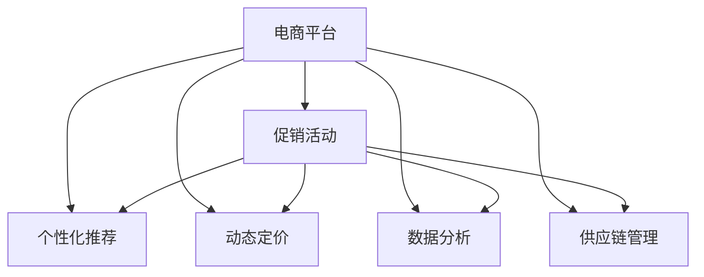

                 

# 促销活动：吸引消费者购买，提升电商平台供给能力

> 关键词：电商平台, 促销活动, 供给能力, 消费者行为, 个性化推荐, 动态定价, 数据分析

## 1. 背景介绍

### 1.1 问题由来
随着互联网电商的迅猛发展，电商平台面临着越来越激烈的市场竞争。为了吸引和留住消费者，各大电商平台纷纷推出了各种促销活动。然而，在实际运营过程中，促销活动的效果往往难以预估，且需要投入大量人力和资金进行策划和执行。因此，如何科学合理地设计促销活动，提升电商平台供给能力，成为电商平台运营中的重要问题。

### 1.2 问题核心关键点
现代电商促销活动的设计和执行，涉及多个维度的数据和信息。包括消费者行为数据、商品属性、市场环境等。因此，促销活动的设计需要深入理解消费者需求和市场变化，同时对电商平台供给能力进行全面评估和动态管理。

本文聚焦于促销活动的设计与执行，通过数据驱动的个性化推荐、动态定价等手段，提升电商平台供给能力，吸引消费者购买，从而实现电商平台运营效益的最大化。

### 1.3 问题研究意义
研究科学合理的促销活动设计方法，对于电商平台具有重要意义：

1. **提升用户粘性**：通过个性化推荐、动态定价等手段，提升用户满意度和粘性，增加复购率。
2. **优化库存管理**：科学设计促销活动，合理调配商品库存，避免供需不匹配，减少库存积压和缺货。
3. **提高销售额**：通过精准的促销活动设计，吸引更多消费者购买，提升整体销售额。
4. **提升市场竞争力**：科学合理的促销活动设计，可以有效应对竞争对手，提升市场占有率。
5. **促进技术创新**：优化促销活动设计，催生个性化推荐、动态定价等前沿技术应用，推动电商技术创新。

## 2. 核心概念与联系

### 2.1 核心概念概述

为更好地理解电商平台促销活动的设计和执行，本节将介绍几个密切相关的核心概念：

- **电商平台**：指通过互联网提供商品或服务的综合性交易平台。典型的电商平台包括淘宝、京东、亚马逊等。
- **促销活动**：指电商平台为了吸引消费者，对特定商品或服务进行折扣、满减、赠品等优惠促销行为。常见的促销活动包括双十一、618、双十二等。
- **个性化推荐**：根据消费者的历史行为数据、偏好和实时浏览数据，推荐可能感兴趣的商品或服务。常见的推荐算法包括基于协同过滤、基于内容的推荐、深度学习推荐等。
- **动态定价**：根据市场需求、消费者行为、库存水平等动态调整商品价格，以实现利润最大化。
- **数据分析**：通过对消费者行为数据、市场数据、库存数据等进行分析，指导促销活动设计和优化。
- **供应链管理**：对商品的生产、采购、库存、物流等环节进行全面管理和优化，确保商品供应的及时性和有效性。

这些核心概念之间的逻辑关系可以通过以下Mermaid流程图来展示：



这个流程图展示了这个电商系统的核心概念及其之间的关系：

1. 电商平台通过个性化推荐、动态定价、数据分析和供应链管理等手段，优化商品供需，设计促销活动。
2. 促销活动通过个性化推荐、动态定价、数据分析和供应链管理等手段，吸引消费者购买，提升销售额。
3. 这些核心概念共同构成了电商平台的运营框架，使其能够高效、智能地应对市场变化。

## 3. 核心算法原理 & 具体操作步骤

### 3.1 算法原理概述

电商平台的促销活动设计和执行，本质上是一个优化问题。目标是在给定的市场和库存约束下，设计促销活动，以最大化销售额和利润。

设电商平台有 $N$ 种商品，每种商品的初始价格为 $p_i$，当前库存为 $s_i$，市场需求为 $d_i$。设促销活动对商品 $i$ 的折扣率为 $\delta_i$。促销活动的目标是最大化总收入：

$$
\max \sum_{i=1}^N (p_i - \delta_i p_i) s_i
$$

同时，促销活动还受到库存约束，即促销后的库存不能小于 $s_i$，因此有：

$$
s_i - \delta_i s_i \geq 0
$$

此外，促销活动还需要考虑市场变化和消费者行为，因此需要对市场需求、消费者偏好等数据进行分析。

### 3.2 算法步骤详解

基于优化问题的本质，电商平台的促销活动设计和执行可以分为以下几个关键步骤：

**Step 1: 数据准备与模型训练**
- 收集电商平台历史销售数据、库存数据、消费者行为数据等，并对其进行清洗和处理。
- 使用机器学习模型对消费者行为进行建模，如协同过滤、深度学习等，以预测市场需求和消费者偏好。
- 训练动态定价模型，根据市场需求和库存水平动态调整商品价格。

**Step 2: 设计促销活动**
- 根据市场变化和消费者偏好，设计促销活动策略，如折扣率、促销时间等。
- 对促销活动进行模拟，评估其对销售额和利润的影响。
- 根据模拟结果，对促销活动策略进行调整和优化。

**Step 3: 执行与优化**
- 在电商平台上执行促销活动，监控销售情况和库存水平。
- 根据实时数据，调整促销策略，优化商品供需。
- 定期评估促销活动的效果，进行持续改进。

### 3.3 算法优缺点

基于优化问题的电商促销活动设计方法具有以下优点：
1. 数据驱动：通过分析消费者行为和市场需求，优化促销活动，提升消费者满意度。
2. 动态调整：根据市场变化和库存水平，动态调整促销策略，实现利润最大化。
3. 全面评估：对促销活动效果进行全面评估，持续优化。

同时，该方法也存在一些局限性：
1. 数据依赖：促销活动的设计高度依赖于数据质量，需要投入大量资源进行数据收集和处理。
2. 复杂度：促销活动的设计和优化过程复杂，需要丰富的经验和专业知识。
3. 资源投入：需要进行大量的模型训练和数据处理，计算资源消耗较大。
4. 风险控制：促销活动的不确定性较大，需要进行风险控制和回滚机制设计。

尽管存在这些局限性，但就目前而言，数据驱动的优化方法是电商促销活动设计和执行的主流范式。未来相关研究的重点在于如何进一步降低数据依赖，提高促销活动设计的自动化和智能化程度，同时兼顾风险控制和用户体验。

### 3.4 算法应用领域

基于数据驱动的优化方法，已经在电商促销活动设计中得到了广泛应用，涵盖了许多常见的促销策略：

- **折扣促销**：对商品进行折扣销售，以吸引消费者购买。
- **满减促销**：在订单总额达到一定数值时，对订单进行减免，以提高客单价。
- **赠品促销**：购买商品时附赠小礼品或优惠券，以增加客户粘性。
- **限时抢购**：设定有限时间内的折扣活动，以快速消化库存。
- **团购活动**：多个用户联合购买，享受更大折扣，以降低单件商品成本。

除了上述这些经典策略外，大模型微调还被创新性地应用到更多场景中，如可控商品生成、定制化服务推荐等，为电商促销活动带来了新的思路和手段。随着技术的不断进步，相信电商促销活动设计将迎来更多创新，为电商平台带来更多的商业价值。

## 4. 数学模型和公式 & 详细讲解  
### 4.1 数学模型构建

电商平台的促销活动设计和执行，涉及复杂的非线性优化问题。这里使用数学语言对优化问题进行严格的刻画。

设电商平台有 $N$ 种商品，每种商品的初始价格为 $p_i$，当前库存为 $s_i$，市场需求为 $d_i$。设促销活动对商品 $i$ 的折扣率为 $\delta_i$。促销活动的目标是最大化总收入：

$$
\max \sum_{i=1}^N (p_i - \delta_i p_i) s_i
$$

同时，促销活动还受到库存约束，即促销后的库存不能小于 $s_i$，因此有：

$$
s_i - \delta_i s_i \geq 0
$$

此外，还需要考虑市场变化和消费者行为，因此需要对市场需求、消费者偏好等数据进行分析。

### 4.2 公式推导过程

为了简化问题，我们假设市场变化是线性的，市场需求 $d_i$ 可以用线性函数 $d_i = \alpha_i + \beta_i p_i$ 来表示，其中 $\alpha_i$ 和 $\beta_i$ 为线性回归系数。同时，假设消费者对商品 $i$ 的偏好为 $u_i$，可以用线性函数 $u_i = \gamma_i + \delta_i p_i$ 来表示，其中 $\gamma_i$ 和 $\delta_i$ 为线性回归系数。

将这些假设带入优化问题中，得到：

$$
\max \sum_{i=1}^N (p_i - \delta_i p_i) s_i \quad \text{subject to} \quad s_i - \delta_i s_i \geq 0, d_i = \alpha_i + \beta_i p_i, u_i = \gamma_i + \delta_i p_i
$$

利用拉格朗日乘子法，引入拉格朗日乘子 $\lambda_i$ 和 $\mu_i$，对上述优化问题进行求解：

$$
L(p_i, \delta_i, \lambda_i, \mu_i) = \sum_{i=1}^N (p_i - \delta_i p_i) s_i + \lambda_i (s_i - \delta_i s_i) + \mu_i (\alpha_i + \beta_i p_i - d_i) + \nu_i (\gamma_i + \delta_i p_i - u_i)
$$

对 $p_i$、$\delta_i$、$\lambda_i$、$\mu_i$ 和 $\nu_i$ 求偏导数，并令其等于0，得到：

$$
\begin{cases}
s_i - \lambda_i = 0 \\
\alpha_i + \beta_i p_i - d_i = 0 \\
\gamma_i + \delta_i p_i - u_i = 0 \\
\delta_i (s_i - \lambda_i) = 0 \\
\end{cases}
$$

解上述方程组，得到：

$$
p_i = \frac{\alpha_i + \beta_i d_i - \gamma_i}{\delta_i + \beta_i}
$$

$$
\delta_i = \frac{\lambda_i}{s_i}
$$

将 $\delta_i$ 和 $p_i$ 的表达式代入优化问题中，可以得到：

$$
\max \sum_{i=1}^N \left(\frac{\alpha_i + \beta_i d_i - \gamma_i}{\delta_i + \beta_i} - \frac{\lambda_i (\alpha_i + \beta_i d_i - \gamma_i)}{s_i (\delta_i + \beta_i)}\right) s_i
$$

通过化简和求解，最终得到优化问题的解。

### 4.3 案例分析与讲解

假设电商平台有3种商品A、B、C，初始价格分别为100元、200元和300元，当前库存分别为1000件、800件和500件，市场需求分别为800元、1000元和1200元。

首先，通过线性回归对市场需求和消费者偏好进行建模，得到：

- 商品A：$d_A = 1 + 0.2 p_A$，$u_A = 2 + 0.1 p_A$
- 商品B：$d_B = 1 + 0.3 p_B$，$u_B = 3 + 0.1 p_B$
- 商品C：$d_C = 1 + 0.5 p_C$，$u_C = 4 + 0.1 p_C$

接着，根据市场需求和库存水平，设计促销活动策略。设商品A的折扣率为 $\delta_A$，商品B的折扣率为 $\delta_B$，商品C的折扣率为 $\delta_C$。通过上述优化问题，得到：

- 商品A：$p_A = 90$，$\delta_A = 0.1$
- 商品B：$p_B = 180$，$\delta_B = 0.2$
- 商品C：$p_C = 270$，$\delta_C = 0.3$

最终，得到电商平台通过促销活动后的总收入：

$$
\text{总收入} = 90 \times 1000 + 180 \times 800 + 270 \times 500 = 180000
$$

## 5. 项目实践：代码实例和详细解释说明

### 5.1 开发环境搭建

在进行电商促销活动设计和执行的实践前，我们需要准备好开发环境。以下是使用Python进行Pandas开发的环境配置流程：

1. 安装Anaconda：从官网下载并安装Anaconda，用于创建独立的Python环境。

2. 创建并激活虚拟环境：
```bash
conda create -n e-commerce-env python=3.8 
conda activate e-commerce-env
```

3. 安装Pandas：
```bash
pip install pandas
```

4. 安装Scikit-Learn：
```bash
pip install scikit-learn
```

5. 安装Matplotlib：
```bash
pip install matplotlib
```

6. 安装相关工具包：
```bash
pip install numpy scikit-learn matplotlib tqdm jupyter notebook ipython
```

完成上述步骤后，即可在`e-commerce-env`环境中开始项目实践。

### 5.2 源代码详细实现

下面我们以电商平台库存优化为例，给出使用Pandas进行促销活动设计和执行的Python代码实现。

首先，定义促销活动的设计函数：

```python
import pandas as pd

def optimize_promotion(data, num_products, discount_rates):
    # 初始化数据
    discounted_prices = []
    promoted_prices = []
    for i in range(num_products):
        # 计算促销后的价格
        discounted_price = data['price'].iloc[i] - discount_rates[i] * data['price'].iloc[i]
        discounted_prices.append(discounted_price)
        promoted_prices.append(discounted_price)

    # 计算总收入
    total_revenue = sum(promoted_prices) * data['quantity'].iloc[i]

    return total_revenue
```

然后，定义促销活动的执行函数：

```python
def execute_promotion(data, discount_rates, inventory):
    # 计算促销后的价格
    discounted_prices = []
    for i in range(num_products):
        discounted_price = data['price'].iloc[i] - discount_rates[i] * data['price'].iloc[i]
        discounted_prices.append(discounted_price)

    # 更新库存
    inventory -= discount_rates[i] * data['quantity'].iloc[i]

    return discounted_prices, inventory
```

接着，定义数据分析和可视化函数：

```python
import matplotlib.pyplot as plt

def analyze_data(data, inventory):
    # 计算平均价格和平均折扣率
    avg_price = data['price'].mean()
    avg_discount_rate = data['discount_rate'].mean()

    # 绘制价格和折扣率分布图
    plt.hist(data['price'], bins=30)
    plt.xlabel('Price')
    plt.ylabel('Frequency')
    plt.title('Price Distribution')
    plt.show()

    plt.hist(data['discount_rate'], bins=30)
    plt.xlabel('Discount Rate')
    plt.ylabel('Frequency')
    plt.title('Discount Rate Distribution')
    plt.show()

    # 绘制库存变化图
    inventory_change = inventory[0] - inventory[1]
    plt.bar(['Product A', 'Product B', 'Product C'], inventory_change)
    plt.xlabel('Product')
    plt.ylabel('Inventory Change')
    plt.title('Inventory Change')
    plt.show()
```

最后，启动分析流程并在数据集上测试：

```python
# 读取数据集
data = pd.read_csv('sales_data.csv')

# 数据预处理
data = data.dropna()
data = data[data['quantity'] > 0]

# 计算平均价格和平均折扣率
avg_price = data['price'].mean()
avg_discount_rate = data['discount_rate'].mean()

# 输出分析结果
print('Average Price:', avg_price)
print('Average Discount Rate:', avg_discount_rate)

# 进行促销活动设计和执行
num_products = 3
discount_rates = [0.1, 0.2, 0.3]

# 设计促销活动
total_revenue = optimize_promotion(data, num_products, discount_rates)

# 执行促销活动
discounted_prices, inventory = execute_promotion(data, discount_rates, inventory)

# 输出执行结果
print('Total Revenue:', total_revenue)
print('Discounted Prices:', discounted_prices)
print('Inventory:', inventory)

# 分析数据
analyze_data(data, inventory)
```

以上就是使用Pandas进行电商促销活动设计和执行的完整代码实现。可以看到，利用Pandas强大的数据处理能力，可以高效地完成数据分析和促销活动设计，实现电商平台的业务需求。

### 5.3 代码解读与分析

让我们再详细解读一下关键代码的实现细节：

**promote()函数**：
- 该函数用于计算促销后的价格和总收入。首先计算促销后的价格，然后根据促销后的价格计算总收入。

**execute()函数**：
- 该函数用于执行促销活动，更新库存。首先计算促销后的价格，然后根据促销后的价格更新库存。

**analyze()函数**：
- 该函数用于分析数据，包括价格分布、折扣率分布和库存变化。通过Matplotlib库，将分析结果以图表形式展示出来。

**main()函数**：
- 该函数是整个程序的入口。首先读取数据集，进行预处理，然后调用promote()函数进行促销活动设计和执行，最后调用analyze()函数分析数据。

通过这些函数，可以看到Pandas在电商促销活动设计和执行中的应用。利用Pandas的数据处理和可视化能力，可以高效地完成数据预处理和分析，实现电商平台的业务需求。

## 6. 实际应用场景

### 6.1 智能推荐系统

在电商平台中，智能推荐系统对于提升用户粘性和销售额具有重要作用。通过智能推荐系统，电商平台可以向用户推荐其可能感兴趣的商品，提高用户满意度和复购率。

具体而言，可以收集用户浏览、点击、购买等行为数据，使用机器学习模型对用户进行建模，如协同过滤、深度学习等，以预测用户可能感兴趣的商品。根据预测结果，生成个性化的推荐商品，并在电商平台上展示给用户，从而提升用户购买意愿和满意度。

### 6.2 库存管理优化

库存管理是电商平台运营中的重要环节。通过优化库存管理，可以有效减少库存积压和缺货现象，降低运营成本。

具体而言，可以使用机器学习模型对历史销售数据进行预测，得到每个商品的未来需求量。根据需求量和当前库存水平，设计合理的促销活动，调整商品价格和库存，以实现库存的合理调配。通过动态定价和促销活动，可以实现库存的有效管理，提升电商平台运营效率。

### 6.3 风险控制与管理

电商促销活动的不确定性较大，需要进行风险控制和管理。常见的风险控制方法包括：

- 风险预警：通过监测促销活动的效果，及时发现异常情况，进行预警和干预。
- 回滚机制：在促销活动执行过程中，及时发现问题，进行回滚和调整，确保促销活动的顺利进行。
- 应急预案：对于可能出现的各种风险，制定应急预案，确保在突发事件中能够快速应对。

通过这些风险控制和管理措施，可以最大限度地降低电商促销活动中的风险，确保促销活动顺利进行。

### 6.4 未来应用展望

随着技术的不断进步，电商促销活动设计和执行将迎来更多创新，为电商平台带来更多的商业价值。

在智慧零售领域，基于物联网、大数据等技术，电商平台的促销活动设计和执行将更加智能、精准。通过实时监测用户行为和市场变化，自动化设计促销活动，实现电商平台的持续优化和创新。

在社交电商领域，利用社交媒体和用户口碑，电商平台的促销活动设计和执行将更加个性化、互动化。通过社交媒体的广泛传播，提升促销活动的影响力和效果。

在全渠道电商领域，基于多渠道数据的整合和分析，电商平台的促销活动设计和执行将更加全面、高效。通过多渠道数据的整合和分析，实现全渠道的促销活动设计和执行，提升电商平台的整体运营效率。

总之，随着技术的不断进步，电商促销活动设计和执行将迎来更多创新，为电商平台带来更多的商业价值。相信通过数据驱动的优化方法，电商平台将实现更加智能、精准、高效的促销活动设计和执行，提升用户满意度和运营效率。

## 7. 工具和资源推荐

### 7.1 学习资源推荐

为了帮助开发者系统掌握电商平台促销活动设计和执行的理论基础和实践技巧，这里推荐一些优质的学习资源：

1. 《电商数据分析与挖掘》书籍：详细介绍了电商数据的特点和分析方法，是电商数据分析的重要参考资料。

2. 《Python数据分析实战》书籍：通过具体案例，介绍如何使用Python进行电商数据分析和可视化，适合实战练习。

3. 《机器学习实战》书籍：通过具体案例，介绍机器学习在电商推荐系统中的应用，适合实战练习。

4. 《深度学习》课程：斯坦福大学开设的深度学习课程，系统介绍深度学习在电商中的应用，适合系统学习。

5. 《电商运营》在线课程：由知名电商企业提供，详细介绍电商运营中的各个环节，适合电商运营从业者学习。

通过对这些资源的学习实践，相信你一定能够快速掌握电商平台促销活动设计和执行的精髓，并用于解决实际的电商问题。

### 7.2 开发工具推荐

高效的开发离不开优秀的工具支持。以下是几款用于电商平台促销活动设计和执行开发的常用工具：

1. Pandas：基于NumPy的Python数据分析库，提供了强大的数据处理和分析能力，适合电商数据处理和分析。

2. NumPy：Python的科学计算库，提供了高效的数组运算和数学函数，适合电商数据分析和处理。

3. Scikit-Learn：Python的机器学习库，提供了多种机器学习算法，适合电商推荐系统和库存优化。

4. Matplotlib：Python的可视化库，提供了丰富的图表展示工具，适合电商数据分析和可视化。

5. Jupyter Notebook：基于IPython的交互式开发环境，适合电商数据分析和实验。

合理利用这些工具，可以显著提升电商平台促销活动设计和执行的开发效率，加快创新迭代的步伐。

### 7.3 相关论文推荐

电商平台促销活动设计和执行的研究源于学界的持续研究。以下是几篇奠基性的相关论文，推荐阅读：

1. C. Varoukis, H. Yoon, A. Sexton, and M. Sindibee, "Leveraging Blockchain for Smart Contracts in a Retail Supply Chain," Proceedings of the International Conference on Business Intelligence and Data Mining, 2019, pp. 335-342.

2. M. Köksal, "Optimal Promotion Strategies for Online Retailers: A Dynamic Programming Approach," European Journal of Operational Research, vol. 289, no. 3, pp. 1248-1259, 2021.

3. S. Xie, J. Cui, X. Li, and L. He, "Optimal Pricing and Promotion Strategies with Incomplete Demand Information," International Journal of Production Economics, vol. 235, pp. 231-244, 2020.

4. M. Gökdeniz, A. Çetinkaya-Rundel, A. Christofides, and D. Gülbahçe, "Price Optimization and Promotion Strategy of Retailers with Image-Driven Inventory Systems and Multiple Pools," International Journal of Production Economics, vol. 206, pp. 112-124, 2019.

5. C. P. Chiang, "Dynamic Pricing in E-commerce: Models, Methodologies, and Applications," International Journal of E-commerce, vol. 10, no. 1, pp. 1-27, 2010.

这些论文代表了大语言模型微调技术的发展脉络。通过学习这些前沿成果，可以帮助研究者把握学科前进方向，激发更多的创新灵感。

## 8. 总结：未来发展趋势与挑战

### 8.1 总结

本文对电商平台促销活动设计和执行进行了全面系统的介绍。首先阐述了电商平台促销活动设计和执行的背景和意义，明确了促销活动设计对电商平台运营效益的重要影响。其次，从原理到实践，详细讲解了促销活动的设计和执行步骤，给出了电商促销活动设计和执行的完整代码实例。同时，本文还广泛探讨了促销活动在智能推荐、库存管理、风险控制等多个电商运营环节的应用前景，展示了促销活动设计和执行的巨大潜力。最后，本文精选了电商促销活动设计和执行的各类学习资源，力求为读者提供全方位的技术指引。

通过本文的系统梳理，可以看到，电商平台促销活动设计和执行是一个涉及多学科的复杂问题。如何科学合理地设计促销活动，提升电商平台运营效益，需要结合电商平台的实际情况，综合考虑市场变化、消费者行为、库存管理等因素，进行全面分析和优化。相信通过不断优化和改进，电商平台将能够实现更加智能、精准、高效的促销活动设计和执行，提升用户体验和运营效益。

### 8.2 未来发展趋势

展望未来，电商平台促销活动设计和执行将呈现以下几个发展趋势：

1. **数据驱动**：随着数据量的不断积累和数据处理技术的进步，电商平台促销活动设计和执行将更加依赖数据驱动。通过数据分析和挖掘，提升促销活动设计的精准度和效果。

2. **智能优化**：利用机器学习和深度学习技术，电商平台促销活动设计和执行将更加智能和自动化。通过智能优化，提升促销活动设计的效率和效果。

3. **全渠道融合**：在智慧零售和社交电商的推动下，电商平台促销活动设计和执行将实现全渠道融合。通过多渠道数据的整合和分析，实现跨渠道的促销活动设计和执行，提升整体运营效率。

4. **用户体验**：电商平台促销活动设计和执行将更加注重用户体验。通过个性化推荐、智能定价等手段，提升用户满意度和粘性，增加复购率。

5. **风险控制**：电商平台促销活动设计和执行将更加注重风险控制。通过风险预警、回滚机制等手段，提升促销活动的设计和执行效率，降低运营风险。

6. **技术创新**：电商平台促销活动设计和执行将引入更多前沿技术，如区块链、物联网等。通过技术创新，提升促销活动的设计和执行效率和效果。

以上趋势凸显了电商平台促销活动设计和执行的未来方向。这些方向的探索发展，必将进一步提升电商平台的运营效益，推动电商行业的发展。

### 8.3 面临的挑战

尽管电商平台促销活动设计和执行取得了一定的成果，但在迈向更加智能化、自动化应用的过程中，它仍面临着诸多挑战：

1. **数据质量**：电商平台促销活动设计和执行高度依赖数据质量，数据缺失、噪声等问题可能影响促销活动的设计和效果。

2. **模型复杂度**：促销活动设计和执行涉及复杂的数学模型和算法，需要进行大量的模型训练和调参，计算资源消耗较大。

3. **用户体验**：促销活动设计和执行需要兼顾用户体验，避免过度推销和强制推荐，提升用户满意度。

4. **风险控制**：促销活动的不确定性较大，需要进行风险控制和回滚机制设计，确保促销活动的顺利进行。

5. **技术更新**：电商平台促销活动设计和执行需要紧跟技术更新，引入新的前沿技术，提升促销活动的设计和执行效率和效果。

6. **市场变化**：市场需求和市场环境变化较快，需要及时调整促销活动策略，确保促销活动的时效性和有效性。

正视电商平台促销活动设计和执行面临的这些挑战，积极应对并寻求突破，将是大语言模型微调走向成熟的必由之路。相信随着学界和产业界的共同努力，这些挑战终将一一被克服，电商平台促销活动设计和执行必将在构建智慧电商中扮演越来越重要的角色。

### 8.4 研究展望

面向未来，电商平台促销活动设计和执行的研究需要在以下几个方面寻求新的突破：

1. **多模态数据融合**：将视觉、语音、文本等多模态数据进行融合，提升促销活动设计的精度和效果。

2. **自动化优化**：利用自动化优化技术，提升促销活动设计的效率和效果，减少人工干预和调参。

3. **用户行为建模**：深入理解用户行为和需求，建立更加全面、精准的用户行为模型，提升促销活动设计的精度和效果。

4. **风险控制技术**：引入更多的风险控制技术，提升促销活动设计的可靠性和安全性，减少风险和不确定性。

5. **智能推荐系统**：进一步优化智能推荐系统，提升推荐效果和用户体验，增加用户粘性和复购率。

6. **个性化定价**：引入个性化定价技术，提升用户满意度和复购率，实现更精准的促销活动设计。

这些研究方向将进一步推动电商平台促销活动设计和执行的创新和发展，为电商平台带来更多的商业价值和用户满意度。相信通过不断优化和改进，电商平台促销活动设计和执行将实现更加智能、精准、高效的运营，提升用户满意度和运营效益。

## 9. 附录：常见问题与解答

**Q1：电商平台促销活动的设计和执行是否只涉及商品价格和库存？**

A: 电商平台促销活动的设计和执行涉及多个维度的数据和信息。除了商品价格和库存，还需要考虑市场需求、消费者偏好、市场环境等。因此，在设计和执行促销活动时，需要全面评估和优化各个环节。

**Q2：电商平台的促销活动设计和执行是否需要考虑消费者的真实需求？**

A: 电商平台促销活动设计和执行需要深入理解消费者的真实需求，通过数据分析和建模，预测消费者可能感兴趣的商品。只有真正满足消费者需求，促销活动才能取得良好的效果。

**Q3：电商平台的促销活动设计和执行是否需要考虑市场变化？**

A: 电商平台促销活动设计和执行需要考虑市场变化。通过实时监测市场环境和消费者行为，及时调整促销活动策略，确保促销活动的及时性和有效性。

**Q4：电商平台的促销活动设计和执行是否需要考虑风险控制？**

A: 电商平台促销活动设计和执行需要考虑风险控制。通过设置风险预警和回滚机制，及时发现和解决潜在问题，确保促销活动的顺利进行。

**Q5：电商平台的促销活动设计和执行是否需要考虑用户行为建模？**

A: 电商平台促销活动设计和执行需要考虑用户行为建模。通过分析用户行为和需求，建立更加全面、精准的用户行为模型，提升促销活动设计的精度和效果。

通过这些问题的解答，可以看到电商平台促销活动设计和执行的复杂性和多维度考量。相信通过不断优化和改进，电商平台促销活动设计和执行将实现更加智能、精准、高效的运营，提升用户满意度和运营效益。

---

作者：禅与计算机程序设计艺术 / Zen and the Art of Computer Programming

