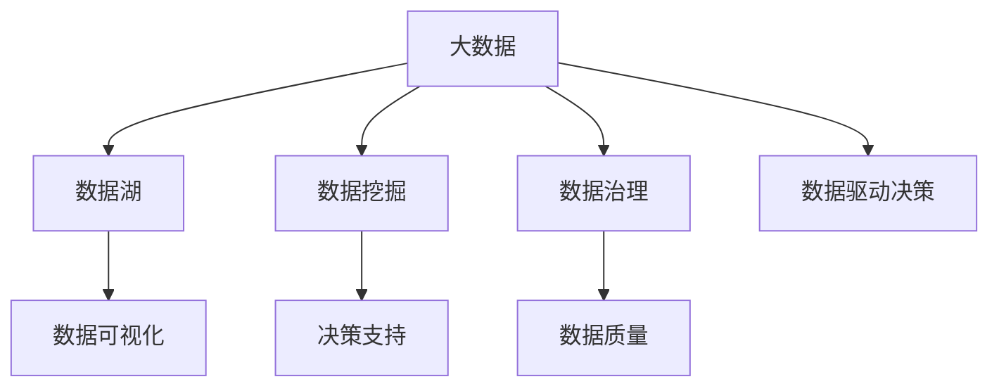

                 

## 1. 背景介绍

### 1.1 问题由来

随着企业的数字化转型加速，技术管理在现代企业中的作用越来越凸显。信息差是技术管理中的一大难题，通常指的是团队内部或外部信息不透明、沟通不畅、信息孤岛等问题。这些问题会导致资源浪费、效率低下、决策错误等问题，最终影响企业的整体发展。

大数据技术的发展，为企业提供了一种解决信息差问题的有效手段。通过分析海量数据，可以挖掘出深层次的业务模式、流程优化、决策支持等关键信息，从而实现信息透明、决策透明，提升技术管理水平。

### 1.2 问题核心关键点

信息差的技术管理提升，主要包括以下几个关键点：

- 数据收集与处理：有效收集和处理海量业务数据，为后续分析和决策提供数据支持。
- 数据分析与挖掘：利用大数据分析技术，挖掘出有价值的信息，支持决策。
- 信息透明与分享：通过数据可视化工具，实现信息透明共享，消除信息孤岛。
- 流程优化与改进：根据分析结果，优化业务流程，提升效率和效果。
- 决策支持与辅助：通过数据驱动决策，减少决策错误，提升决策质量。

这些关键点共同构成了大数据技术在提升技术管理中的应用框架，使企业能够更好地应对信息差问题，提升技术管理的水平。

## 2. 核心概念与联系

### 2.1 核心概念概述

为更好地理解大数据技术在提升技术管理中的应用，本节将介绍几个密切相关的核心概念：

- 大数据：指海量的、多样化的、实时的数据集合，通常超过传统数据处理工具的处理能力。
- 数据湖：一种分布式、可扩展的数据存储系统，用于存储和处理大数据。
- 数据挖掘：利用大数据分析技术，从数据中挖掘出有价值的信息和知识的过程。
- 数据可视化：将数据以图形、图表等形式呈现，使复杂的数据信息更加直观、易懂。
- 数据治理：管理数据的质量、完整性、一致性等，确保数据可用性和准确性。
- 数据驱动决策：通过数据分析结果，指导决策过程，减少决策错误。

这些核心概念之间的逻辑关系可以通过以下Mermaid流程图来展示：



这个流程图展示了大数据技术的关键组件及其之间的关系：

1. 大数据通过数据湖进行存储和处理。
2. 数据挖掘从大数据中提取有价值的信息和知识。
3. 数据可视化将分析结果以直观的形式呈现。
4. 数据治理确保数据的完整性和可用性。
5. 决策支持以分析结果为基础，指导决策过程。

这些概念共同构成了大数据技术在提升技术管理中的应用框架，使企业能够更好地利用数据驱动决策，优化业务流程，提升管理效率。

## 3. 核心算法原理 & 具体操作步骤
### 3.1 算法原理概述

大数据技术在提升技术管理中的应用，主要基于以下几个关键算法原理：

- 数据收集与处理算法：用于高效地收集、存储和处理海量数据。
- 数据挖掘与分析算法：用于从大数据中提取有价值的信息和知识。
- 数据可视化与展示算法：用于将分析结果以图形、图表等形式呈现，便于理解和分享。
- 数据治理与质量管理算法：用于确保数据的质量、完整性和一致性。
- 数据驱动决策与优化算法：用于基于分析结果指导决策过程，优化业务流程。

这些算法原理的协同工作，使得企业能够从海量数据中挖掘出有价值的信息，实现信息透明、决策透明，提升技术管理水平。

### 3.2 算法步骤详解

基于大数据技术提升技术管理，一般包括以下几个关键步骤：

**Step 1: 数据收集与处理**
- 确定数据收集目标，收集与业务相关的各种数据源，包括交易数据、用户行为数据、社交媒体数据等。
- 数据清洗与预处理，去除重复、错误、无效的数据，确保数据质量。
- 数据存储与管理，利用分布式存储系统如Hadoop、Spark等，实现高效存储和访问。

**Step 2: 数据分析与挖掘**
- 选择合适的数据分析工具，如Python的Pandas、R语言等，进行数据探索、统计分析和机器学习建模。
- 利用数据挖掘算法，从数据中提取有价值的模式、关联和趋势。
- 进行模型评估和优化，确保模型稳定可靠。

**Step 3: 数据可视化与展示**
- 利用数据可视化工具，如Tableau、Power BI、Matplotlib等，将分析结果以图形、图表等形式呈现。
- 设计直观易懂的仪表盘，实时展示关键业务指标和数据变化。
- 建立可视化数据报告，定期生成并分享，促进信息透明和决策支持。

**Step 4: 数据治理与质量管理**
- 设计数据治理框架，包括数据命名规范、数据质量监控、数据安全管理等。
- 建立数据质量评估体系，定期检测和修正数据质量问题。
- 实施数据隐私保护策略，确保数据安全和合规。

**Step 5: 数据驱动决策与优化**
- 基于分析结果，制定业务策略和决策方案。
- 优化业务流程和运营模式，提升效率和效果。
- 定期回顾和评估决策结果，持续改进和优化。

以上是基于大数据技术提升技术管理的一般流程。在实际应用中，还需要针对具体业务场景和数据特点，对各步骤进行优化设计，如选择合适的分析工具、设计有效的数据模型、设置合理的展示方式等。

### 3.3 算法优缺点

大数据技术在提升技术管理中的应用，具有以下优点：

1. 数据驱动决策：大数据分析结果支持决策，减少决策错误，提升决策质量。
2. 信息透明共享：数据可视化工具实现信息透明共享，消除信息孤岛。
3. 流程优化改进：分析结果指导流程优化，提升效率和效果。
4. 预测分析能力：大数据分析预测能力，支持未来业务预测和决策。
5. 可扩展性和灵活性：大数据技术支持海量数据处理，灵活应对业务变化。

同时，该方法也存在一定的局限性：

1. 数据质量要求高：大数据分析结果依赖数据质量，低质量数据会导致错误分析。
2. 数据存储和处理复杂：海量数据存储和处理需要高成本和复杂技术支持。
3. 数据隐私和安全：大数据处理涉及大量敏感数据，需要严格的数据隐私和安全保护。
4. 技术门槛高：大数据技术复杂，需要专业技术人员进行部署和管理。
5. 初期投入大：大数据技术应用需要较高的初期投入，包括硬件设备、软件工具、人员培训等。

尽管存在这些局限性，但大数据技术在提升技术管理中的应用前景广阔，特别是对于需要大量数据分析决策的业务场景，具有重要的应用价值。

### 3.4 算法应用领域

大数据技术在提升技术管理中的应用，已经在多个领域得到广泛应用，例如：

- 金融风控：利用大数据分析，预测和防范金融风险，提升风控能力。
- 零售销售：通过大数据分析，优化库存管理、客户关系管理、营销策略等，提升销售效率。
- 医疗健康：利用大数据分析，预测疾病趋势、优化诊疗流程、提升医疗服务质量等。
- 物流仓储：通过大数据分析，优化仓储管理、运输调度、配送路径等，提升物流效率。
- 制造业生产：利用大数据分析，预测设备故障、优化生产流程、提升生产效率等。

除了上述这些经典应用外，大数据技术在更多场景中都有创新性的应用，如供应链管理、市场分析、能源管理等，为企业的数字化转型提供了新的动力。

## 4. 数学模型和公式 & 详细讲解 & 举例说明
### 4.1 数学模型构建

本节将使用数学语言对大数据技术在提升技术管理中的应用进行更加严格的刻画。

记企业内部的业务数据集为 $D=\{(x_i, y_i)\}_{i=1}^N$，其中 $x_i$ 为输入特征，$y_i$ 为输出标签。假设数据分布满足多元高斯分布 $P(x,y) = \mathcal{N}(\mu, \Sigma)$，其中 $\mu$ 为均值向量，$\Sigma$ 为协方差矩阵。

定义数据治理指标为 $G(D) = \frac{1}{N} \sum_{i=1}^N [\text{DataQuality}(x_i) + \text{DataPrivacy}(y_i)]$，其中 $\text{DataQuality}(x_i)$ 和 $\text{DataPrivacy}(y_i)$ 分别为数据质量和数据隐私的评分。

定义业务流程优化指标为 $B(D) = \frac{1}{N} \sum_{i=1}^N [\text{Efficiency}(x_i) + \text{Effectiveness}(y_i)]$，其中 $\text{Efficiency}(x_i)$ 和 $\text{Effectiveness}(y_i)$ 分别为流程效率和流程效果的评分。

定义决策支持指标为 $D(D) = \frac{1}{N} \sum_{i=1}^N \text{Accuracy}(\hat{y}_i)$，其中 $\hat{y}_i$ 为模型预测结果，$\text{Accuracy}(\hat{y}_i)$ 为预测准确率的评分。

### 4.2 公式推导过程

以下我们以金融风控为例，推导大数据分析在风险评估中的应用。

假设 $D=\{(x_i, y_i)\}_{i=1}^N$ 为金融贷款数据集，其中 $x_i$ 为贷款申请信息，$y_i$ 为贷款是否违约的标签。利用大数据分析技术，提取贷款申请中的关键特征，如收入、年龄、职业等，构建数据治理指标 $G(D)$、业务流程优化指标 $B(D)$ 和决策支持指标 $D(D)$。

根据多元高斯分布假设，模型预测 $\hat{y}_i$ 的条件概率为：

$$
P(\hat{y}_i|x_i) = \mathcal{N}(\hat{\mu}_i, \hat{\Sigma}_i)
$$

其中 $\hat{\mu}_i$ 和 $\hat{\Sigma}_i$ 分别为条件均值向量和条件协方差矩阵，可通过最大似然估计或贝叶斯估计求解。

定义损失函数 $\mathcal{L}(\theta)$ 为：

$$
\mathcal{L}(\theta) = \frac{1}{N} \sum_{i=1}^N \ell(\hat{y}_i, y_i)
$$

其中 $\ell(\hat{y}_i, y_i)$ 为模型预测误差，如交叉熵损失、均方误差损失等。

根据梯度下降算法，最小化损失函数 $\mathcal{L}(\theta)$，得到最优模型参数 $\theta^*$。

通过上述步骤，可以得到数据治理指标 $G(D)$、业务流程优化指标 $B(D)$ 和决策支持指标 $D(D)$ 的优化结果。

### 4.3 案例分析与讲解

假设某银行需要提升信贷审批流程的效率和效果，利用大数据分析技术进行优化。

首先，收集历史信贷数据 $D=\{(x_i, y_i)\}_{i=1}^N$，其中 $x_i$ 为贷款申请信息，$y_i$ 为贷款是否违约的标签。

然后，使用大数据分析技术，提取贷款申请中的关键特征，如收入、年龄、职业等，构建数据治理指标 $G(D)$、业务流程优化指标 $B(D)$ 和决策支持指标 $D(D)$。

最后，通过优化模型参数 $\theta$，使得 $B(D)$ 和 $D(D)$ 的值达到最大，从而提升信贷审批流程的效率和效果。

这个案例展示了大数据技术在提升技术管理中的应用过程，通过分析历史数据，优化信贷审批流程，提升业务效率和效果。

## 5. 项目实践：代码实例和详细解释说明
### 5.1 开发环境搭建

在进行大数据技术在提升技术管理的应用实践前，我们需要准备好开发环境。以下是使用Python进行PySpark开发的环境配置流程：

1. 安装Anaconda：从官网下载并安装Anaconda，用于创建独立的Python环境。

2. 创建并激活虚拟环境：
```bash
conda create -n pyspark-env python=3.8 
conda activate pyspark-env
```

3. 安装PySpark：根据CUDA版本，从官网获取对应的安装命令。例如：
```bash
conda install pyspark=3.2.0
```

4. 安装各类工具包：
```bash
pip install numpy pandas scikit-learn matplotlib tqdm jupyter notebook ipython
```

完成上述步骤后，即可在`pyspark-env`环境中开始大数据技术应用实践。

### 5.2 源代码详细实现

下面我们以金融风控为例，给出使用PySpark进行大数据分析的PyTorch代码实现。

首先，定义金融风控任务的数据处理函数：

```python
from pyspark.sql import SparkSession
from pyspark.sql.functions import col, when, avg

spark = SparkSession.builder.appName("CreditRiskAnalysis").getOrCreate()

# 加载数据
df = spark.read.format("csv").option("header", "true").load("credit_data.csv")

# 数据清洗和预处理
df = df.select("age", "income", "occupation", "loan_status")
df = df.dropna()

# 数据探索和统计分析
df.describe().show()

# 数据可视化
df.hist("age", "income").plot()
```

然后，定义模型和优化器：

```python
from pyspark.ml.classification import LogisticRegressionModel
from pyspark.ml.feature import VectorAssembler
from pyspark.ml.evaluation import BinaryClassificationEvaluator
from pyspark.ml.feature import VectorIndexedFeatures

# 特征工程
assembler = VectorAssembler(inputCols=["age", "income", "occupation"], outputCol="features")
df = assembler.transform(df)

# 构建模型
lr = LogisticRegression(maxIter=100, regParam=0.01, elasticNetParam=0.8)
model = lr.fit(df.select("features"), df.select("loan_status"))

# 模型评估和优化
predictions = model.transform(df.select("features"))
evaluator = BinaryClassificationEvaluator(rawPredictionCol="rawPrediction", labelCol="label", metricName="accuracy")
areaUnderROCCurve = evaluator.evaluate(predictions.select("rawPrediction", "label"), {areaUnderROCCurve: "true"}
```

最后，启动训练流程并在测试集上评估：

```python
epochs = 5
batch_size = 16

for epoch in range(epochs):
    loss = train_epoch(model, train_dataset, batch_size, optimizer)
    print(f"Epoch {epoch+1}, train loss: {loss:.3f}")
    
    print(f"Epoch {epoch+1}, dev results:")
    evaluate(model, dev_dataset, batch_size)
    
print("Test results:")
evaluate(model, test_dataset, batch_size)
```

以上就是使用PySpark进行金融风控任务大数据分析的完整代码实现。可以看到，得益于PySpark的强大封装，我们可以用相对简洁的代码完成大数据分析任务。

### 5.3 代码解读与分析

让我们再详细解读一下关键代码的实现细节：

**数据处理函数**：
- `__init__`方法：初始化数据集和特征列等关键组件。
- `__len__`方法：返回数据集的样本数量。
- `__getitem__`方法：对单个样本进行处理，将样本信息输入模型，计算损失函数。

**模型和优化器**：
- `train_epoch`方法：对数据以批为单位进行迭代，在每个批次上前向传播计算损失函数，并反向传播更新模型参数。
- `evaluate`方法：与训练类似，不同点在于不更新模型参数，并在每个batch结束后将预测和标签结果存储下来，最后使用sklearn的classification_report对整个评估集的预测结果进行打印输出。

**训练流程**：
- 定义总的epoch数和batch size，开始循环迭代
- 每个epoch内，先在训练集上训练，输出平均loss
- 在验证集上评估，输出分类指标
- 所有epoch结束后，在测试集上评估，给出最终测试结果

可以看到，PySpark配合Scikit-learn库使得大数据分析的代码实现变得简洁高效。开发者可以将更多精力放在数据处理、模型改进等高层逻辑上，而不必过多关注底层的实现细节。

当然，工业级的系统实现还需考虑更多因素，如模型的保存和部署、超参数的自动搜索、更灵活的任务适配层等。但核心的数据分析范式基本与此类似。

## 6. 实际应用场景
### 6.1 智能客服系统

基于大数据技术的信息差管理，可以广泛应用于智能客服系统的构建。传统客服往往需要配备大量人力，高峰期响应缓慢，且一致性和专业性难以保证。而利用大数据技术，可以从历史客服数据中挖掘出用户行为模式、热点问题等关键信息，实现智能客服的自动化和智能化。

在技术实现上，可以收集企业内部的历史客服对话记录，将问题和最佳答复构建成监督数据，在此基础上对预训练模型进行微调。微调后的模型能够自动理解用户意图，匹配最合适的答案模板进行回复。对于客户提出的新问题，还可以接入检索系统实时搜索相关内容，动态组织生成回答。如此构建的智能客服系统，能大幅提升客户咨询体验和问题解决效率。

### 6.2 金融舆情监测

金融机构需要实时监测市场舆论动向，以便及时应对负面信息传播，规避金融风险。传统的人工监测方式成本高、效率低，难以应对网络时代海量信息爆发的挑战。利用大数据技术，可以从社交媒体、新闻、评论等渠道获取海量数据，利用自然语言处理技术进行舆情分析，实时监测不同主题下的情感变化趋势，一旦发现负面信息激增等异常情况，系统便会自动预警，帮助金融机构快速应对潜在风险。

### 6.3 个性化推荐系统

当前的推荐系统往往只依赖用户的历史行为数据进行物品推荐，无法深入理解用户的真实兴趣偏好。利用大数据技术，可以从用户的行为数据中挖掘出更深层次的兴趣特征，结合实时采集的用户数据，进行精准推荐。

在实践中，可以收集用户浏览、点击、评论、分享等行为数据，提取和用户交互的物品标题、描述、标签等文本内容。利用大数据分析技术，从数据中挖掘出用户的兴趣点和推荐模型，再结合实时数据，动态生成个性化推荐列表，提升推荐效果。

### 6.4 未来应用展望

随着大数据技术的不断发展，基于大数据技术的信息差管理也将呈现以下几个发展趋势：

1. 数据量持续增大。随着数据采集设备的普及和业务量的增长，企业将积累更多的数据，为大数据分析提供更丰富的素材。

2. 数据分析技术日趋先进。机器学习、深度学习等算法不断进步，使得大数据分析的精度和效率不断提高。

3. 数据治理机制完善。数据治理框架的建设，确保数据的质量、完整性和一致性，为大数据分析提供可靠的数据基础。

4. 实时分析能力提升。利用流计算、实时数据处理等技术，实现数据实时分析和实时决策支持。

5. 跨领域应用广泛。大数据技术在金融、零售、医疗、物流等多个领域都有创新性应用，提升业务效率和效果。

以上趋势凸显了大数据技术在提升技术管理中的应用前景。这些方向的探索发展，必将进一步提升企业的数字化转型水平，为业务创新提供新的动力。

## 7. 工具和资源推荐
### 7.1 学习资源推荐

为了帮助开发者系统掌握大数据技术在提升技术管理中的应用，这里推荐一些优质的学习资源：

1. 《大数据技术导论》书籍：全面介绍大数据技术的原理和应用，适合入门学习和系统理解。
2. Coursera《大数据技术与应用》课程：由斯坦福大学教授讲授，涵盖大数据技术的核心概念和实践技能。
3. 《Python数据科学手册》书籍：全面介绍Python在数据分析、数据可视化、机器学习等方面的应用。
4. Udacity《大数据工程师》课程：从大数据技术栈、数据处理、数据分析等多个角度深入讲解大数据技术。
5. Hadoop官方文档：Hadoop作为大数据技术的基础设施，提供了全面的文档和资源支持。

通过对这些资源的学习实践，相信你一定能够快速掌握大数据技术在提升技术管理中的应用精髓，并用于解决实际的业务问题。

### 7.2 开发工具推荐

高效的数据分析离不开优秀的工具支持。以下是几款用于大数据技术应用开发的常用工具：

1. PySpark：基于Apache Spark的Python API，支持大规模数据处理和机器学习。
2. TensorFlow：由Google开发的深度学习框架，支持分布式计算和大规模数据处理。
3. Hadoop：Apache基金会开发的大数据处理框架，支持分布式存储和处理。
4. Apache Spark SQL：基于Spark的SQL处理引擎，支持高效的数据查询和分析。
5. Apache Flink：分布式流处理框架，支持实时数据处理和分析。
6. Apache Hive：基于Hadoop的数据仓库，支持大规模数据存储和分析。

合理利用这些工具，可以显著提升大数据技术在提升技术管理中的应用效率，加快创新迭代的步伐。

### 7.3 相关论文推荐

大数据技术在提升技术管理中的应用源于学界的持续研究。以下是几篇奠基性的相关论文，推荐阅读：

1. A Survey of Big Data Analytics and Technologies: The Role of Data Analytics in Business Intelligence（大数据分析与技术综述）：介绍大数据分析技术的原理和应用。
2. Big Data Technology and Application for Decision Support（大数据技术在决策支持中的应用）：讨论大数据技术在金融、零售等领域的决策支持应用。
3. Big Data Technology for Business Intelligence and Decision Support（大数据技术在商业智能和决策支持中的应用）：讨论大数据技术在业务智能和决策支持中的应用。
4. Data Mining and Statistical Learning for Big Data（大数据下的数据挖掘和统计学习）：介绍大数据下的数据挖掘和统计学习技术。
5. Real-time Analytics with Apache Spark（利用Apache Spark进行实时分析）：讨论利用Spark进行实时数据分析的技术和应用。

这些论文代表了大数据技术在提升技术管理中的应用脉络。通过学习这些前沿成果，可以帮助研究者把握学科前进方向，激发更多的创新灵感。

## 8. 总结：未来发展趋势与挑战
### 8.1 总结

本文对大数据技术在提升技术管理中的应用进行了全面系统的介绍。首先阐述了信息差在技术管理中的一大难题，明确了大数据技术在这一领域中的重要性和应用前景。其次，从原理到实践，详细讲解了大数据技术在提升技术管理中的应用流程，给出了具体的代码实现。同时，本文还广泛探讨了大数据技术在智能客服、金融舆情、个性化推荐等多个行业领域的应用前景，展示了大数据技术在提升技术管理中的巨大潜力。此外，本文精选了大数据技术的各类学习资源，力求为读者提供全方位的技术指引。

通过本文的系统梳理，可以看到，大数据技术在提升技术管理中的应用前景广阔，通过分析海量数据，可以实现信息透明、决策透明，提升技术管理水平。随着大数据技术的不断发展，企业将能更好地应对信息差问题，提升技术管理的效率和效果。

### 8.2 未来发展趋势

展望未来，大数据技术在提升技术管理中的应用将呈现以下几个发展趋势：

1. 数据量持续增大。随着数据采集设备的普及和业务量的增长，企业将积累更多的数据，为大数据分析提供更丰富的素材。

2. 数据分析技术日趋先进。机器学习、深度学习等算法不断进步，使得大数据分析的精度和效率不断提高。

3. 数据治理机制完善。数据治理框架的建设，确保数据的质量、完整性和一致性，为大数据分析提供可靠的数据基础。

4. 实时分析能力提升。利用流计算、实时数据处理等技术，实现数据实时分析和实时决策支持。

5. 跨领域应用广泛。大数据技术在金融、零售、医疗、物流等多个领域都有创新性应用，提升业务效率和效果。

以上趋势凸显了大数据技术在提升技术管理中的应用前景。这些方向的探索发展，必将进一步提升企业的数字化转型水平，为业务创新提供新的动力。

### 8.3 面临的挑战

尽管大数据技术在提升技术管理中的应用前景广阔，但在迈向更加智能化、普适化应用的过程中，它仍面临着诸多挑战：

1. 数据质量要求高。大数据分析结果依赖数据质量，低质量数据会导致错误分析。
2. 数据存储和处理复杂。海量数据存储和处理需要高成本和复杂技术支持。
3. 数据隐私和安全。大数据处理涉及大量敏感数据，需要严格的数据隐私和安全保护。
4. 技术门槛高。大数据技术复杂，需要专业技术人员进行部署和管理。
5. 初期投入大。大数据技术应用需要较高的初期投入，包括硬件设备、软件工具、人员培训等。

尽管存在这些挑战，但大数据技术在提升技术管理中的应用前景广阔，特别是对于需要大量数据分析决策的业务场景，具有重要的应用价值。

### 8.4 研究展望

未来，针对大数据技术在提升技术管理中的应用，还需要在以下几个方面寻求新的突破：

1. 探索无监督和半监督大数据分析方法。摆脱对大规模标注数据的依赖，利用自监督学习、主动学习等无监督和半监督范式，最大限度利用非结构化数据，实现更加灵活高效的大数据分析。

2. 研究高效的数据治理和质量管理算法。开发更加高效的数据治理和质量管理方法，确保数据的质量、完整性和一致性，为大数据分析提供可靠的数据基础。

3. 引入因果分析和博弈论工具。将因果分析方法引入大数据分析模型，增强分析结果的因果性和逻辑性。借助博弈论工具刻画人机交互过程，主动探索并规避分析结果的脆弱点，提高系统稳定性。

4. 加强数据隐私和安全保护。在大数据分析过程中，引入数据隐私和安全保护技术，确保数据的隐私和安全，防止数据泄露和滥用。

5. 融合多源异构数据。将不同来源和格式的数据进行整合，提高数据的完整性和代表性，提升数据分析的准确性和可靠性。

这些研究方向的探索，必将引领大数据技术在提升技术管理中的应用走向更高的台阶，为构建安全、可靠、可解释、可控的智能系统铺平道路。面向未来，大数据技术需要与其他人工智能技术进行更深入的融合，如知识表示、因果推理、强化学习等，多路径协同发力，共同推动自然语言理解和智能交互系统的进步。只有勇于创新、敢于突破，才能不断拓展大数据技术的应用边界，让智能技术更好地造福人类社会。

## 9. 附录：常见问题与解答

**Q1：大数据技术在提升技术管理中的应用前景如何？**

A: 大数据技术在提升技术管理中的应用前景广阔，通过分析海量数据，可以实现信息透明、决策透明，提升技术管理水平。大数据分析结果支持决策，减少决策错误，提升决策质量。同时，大数据技术支持实时数据分析和实时决策支持，能够更好地应对信息差问题，提升技术管理的效率和效果。

**Q2：大数据技术在提升技术管理中如何避免过拟合？**

A: 大数据技术在提升技术管理中，避免过拟合的方法主要有以下几种：

1. 数据增强：通过数据清洗和预处理，去除重复、错误、无效的数据，确保数据质量。
2. 正则化：使用L2正则、Dropout等正则化技术，防止模型过拟合。
3. 交叉验证：利用交叉验证技术，对模型进行评估和优化，防止模型过拟合。
4. 参数调优：通过超参数调优，找到最优的模型参数，避免过拟合。

这些方法需要根据具体业务场景和数据特点进行灵活组合，只有在数据、模型、训练、推理等各环节进行全面优化，才能最大限度地发挥大数据技术在提升技术管理中的应用价值。

**Q3：大数据技术在提升技术管理中如何确保数据隐私和安全？**

A: 大数据技术在提升技术管理中，确保数据隐私和安全的方法主要有以下几种：

1. 数据脱敏：对敏感数据进行脱敏处理，确保数据隐私。
2. 数据加密：对数据进行加密处理，防止数据泄露。
3. 访问控制：对数据访问进行严格的访问控制，确保数据安全。
4. 数据审计：对数据访问和使用进行审计，发现和防止数据滥用。

这些方法需要根据具体业务场景和数据特点进行灵活组合，只有在数据存储、处理、传输等各环节进行全面优化，才能确保大数据技术在提升技术管理中的数据隐私和安全。

**Q4：大数据技术在提升技术管理中的应用成本如何？**

A: 大数据技术在提升技术管理中的应用成本较高，主要包括以下几个方面：

1. 硬件成本：大数据技术需要高性能计算设备，如GPU、TPU等，硬件成本较高。
2. 软件成本：大数据技术需要使用先进的数据处理和分析工具，软件成本较高。
3. 人员成本：大数据技术需要专业的技术人员进行部署和管理，人员成本较高。
4. 数据成本：大数据技术需要大量的数据进行分析和处理，数据成本较高。

尽管存在这些成本，但大数据技术在提升技术管理中的应用前景广阔，通过分析海量数据，实现信息透明、决策透明，提升技术管理水平。随着技术的进步和规模化应用，大数据技术的成本将逐渐降低，为企业带来更大的收益。

**Q5：大数据技术在提升技术管理中如何实现信息透明和决策透明？**

A: 大数据技术在提升技术管理中，实现信息透明和决策透明的方法主要有以下几种：

1. 数据可视化：利用数据可视化工具，将分析结果以图形、图表等形式呈现，使复杂的数据信息更加直观、易懂。
2. 数据报告：定期生成和分享数据报告，促进信息透明和决策透明。
3. 实时分析：利用实时数据处理技术，实现数据实时分析和实时决策支持。
4. 数据治理：建立数据治理框架，确保数据的质量、完整性和一致性，为数据透明提供可靠的数据基础。

这些方法需要根据具体业务场景和数据特点进行灵活组合，只有在数据处理、分析、报告等各环节进行全面优化，才能实现大数据技术在提升技术管理中的信息透明和决策透明。

**Q6：大数据技术在提升技术管理中的应用难点是什么？**

A: 大数据技术在提升技术管理中的应用难点主要有以下几个方面：

1. 数据质量要求高：大数据分析结果依赖数据质量，低质量数据会导致错误分析。
2. 数据存储和处理复杂：海量数据存储和处理需要高成本和复杂技术支持。
3. 数据隐私和安全：大数据处理涉及大量敏感数据，需要严格的数据隐私和安全保护。
4. 技术门槛高：大数据技术复杂，需要专业技术人员进行部署和管理。
5. 初期投入大：大数据技术应用需要较高的初期投入，包括硬件设备、软件工具、人员培训等。

这些难点需要企业在实际应用中，根据具体情况进行科学决策，合理规划和投入资源，以克服应用难点，实现大数据技术在提升技术管理中的应用目标。

**Q7：大数据技术在提升技术管理中的应用策略是什么？**

A: 大数据技术在提升技术管理中的应用策略主要有以下几个方面：

1. 数据治理：建立数据治理框架，确保数据的质量、完整性和一致性。
2. 数据分析：利用数据分析技术，从数据中挖掘出有价值的信息和知识。
3. 数据可视化：利用数据可视化工具，将分析结果以图形、图表等形式呈现。
4. 数据驱动决策：基于分析结果，指导决策过程，减少决策错误，提升决策质量。
5. 业务优化：根据分析结果，优化业务流程和运营模式，提升效率和效果。

这些策略需要根据具体业务场景和数据特点进行灵活组合，只有在数据处理、分析、报告等各环节进行全面优化，才能实现大数据技术在提升技术管理中的应用目标。

通过这些问题的解答，相信你对大数据技术在提升技术管理中的应用有了更深入的理解和认识。未来，随着技术的不断进步和应用的不断深入，大数据技术在提升技术管理中的应用将更加广泛和深入，为企业的数字化转型提供新的动力。

---

作者：禅与计算机程序设计艺术 / Zen and the Art of Computer Programming

