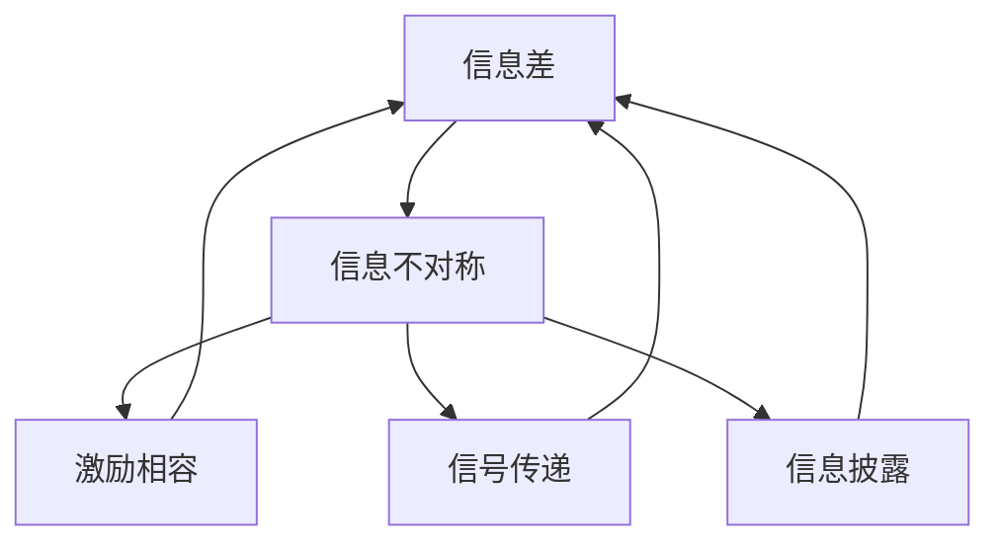

                 

# 信息差：信息不对称与商业模式创新

在数字化时代，信息技术的迅猛发展让信息的获取和传播变得前所未有的容易，然而，与此同时，信息的不对称问题也愈发凸显。信息差（Information Gap），即信息接收者与信息发送者之间的信息不对称，成为了制约商业创新和发展的关键因素。本文旨在探讨信息差现象及其在商业模式创新中的作用，通过理论分析、案例研究及实践建议，为解决信息不对称问题提供新的视角和方法。

## 1. 背景介绍

### 1.1 问题由来
信息差现象自古有之，但随着互联网的普及和智能技术的进步，信息不对称问题变得更加复杂和隐蔽。在商业领域，信息差导致消费者和商家之间的信任度降低，市场信息传递扭曲，最终影响了经济效率和公平。同时，信息差也为商业模式创新提供了新的机会，推动了信息不对称理论的进一步发展。

### 1.2 问题核心关键点
信息差问题的核心在于信息不对称，即一方拥有的信息比另一方更多。这种不对称可能源于市场地位、知识水平、技术能力等差异。在商业领域，信息差常表现为消费者对产品的了解程度远低于商家，或者商家对市场需求的认知不足。因此，如何通过信息不对称进行商业模式创新，成为业界关注的焦点。

## 2. 核心概念与联系

### 2.1 核心概念概述

为更好地理解信息差现象及其在商业模式创新中的作用，本节将介绍几个密切相关的核心概念：

- **信息差（Information Gap）**：指信息接收者与信息发送者之间信息量的不对称。在商业中，信息差可能导致市场失灵、交易成本增加等问题。
- **信息不对称（Information Asymmetry）**：指市场参与者之间关于交易对象的信息拥有量的差异。通常，信息较少的卖方（如消费者）和信息较多的买方（如商家）之间的信息差最为明显。
- **激励相容（Incentive Compatibility）**：指在信息不对称情况下，通过设计合适的激励机制，使参与者行为与最优策略一致，从而最大化系统效率。
- **信号传递（Signaling）**：指通过特定行为或信息传递，显示自身真实信息，降低信息差对市场的影响。
- **信息披露（Information Disclosure）**：指通过强制性或自愿性信息披露，使市场参与者获得更多的信息，缩小信息差。

这些概念之间的逻辑关系可以通过以下Mermaid流程图来展示：



这个流程图展示了一系列的因果关系：信息不对称导致了信息差，进而引发了激励相容、信号传递、信息披露等策略。这些策略共同作用，可以缓解信息差，提升市场效率和公平性。

## 3. 核心算法原理 & 具体操作步骤
### 3.1 算法原理概述

信息差问题的解决，通常依赖于有效的信息不对称策略。这些策略的核心思想是，通过设计机制和工具，使信息接收者能够获得尽可能多的真实信息，从而减少信息差对交易和市场的影响。在商业中，常见的信息不对称策略包括激励相容、信号传递、信息披露等。

### 3.2 算法步骤详解

以下是信息不对称策略的具体操作步骤：

**Step 1: 信息识别与评估**
- 识别信息差的存在和影响。通过调查问卷、市场研究等方式，了解不同市场参与者之间的信息差异。
- 评估信息差对商业决策、交易成本、市场效率等的影响。明确信息差的具体表现和后果，为后续策略设计提供依据。

**Step 2: 策略设计**
- 根据评估结果，设计合适的信息不对称策略。如激励相容机制、信号传递机制、信息披露机制等。
- 通过模型和仿真，评估策略的有效性和可行性。选择最优策略，并制定实施计划。

**Step 3: 策略实施**
- 在商业实践中，逐步实施信息不对称策略。如引入激励机制、改进信号传递渠道、加强信息披露等。
- 监控策略效果，根据反馈调整策略。确保信息不对称策略能够在实际应用中发挥最大效能。

### 3.3 算法优缺点

信息不对称策略在缓解信息差、提升市场效率方面具有以下优点：
1. 提高交易效率。通过设计合理的激励机制，使市场参与者行为一致，减少交易成本。
2. 增强市场公平。通过信息披露和信号传递，提高市场透明度，减少信息不对称带来的不公平现象。
3. 促进商业创新。信息不对称策略为商业模式创新提供了新的思路和方法，推动了商业模式的进化。

同时，这些策略也存在一定的局限性：
1. 成本高昂。设计和实施信息不对称策略需要投入大量的人力、财力和技术资源，成本较高。
2. 效果有限。信息不对称策略的实施效果取决于市场环境、参与者行为等因素，存在不确定性。
3. 技术依赖。部分信息不对称策略依赖于先进的技术手段，如区块链、大数据等，对技术要求较高。

尽管如此，信息不对称策略仍是大数据和互联网时代的重要手段，有助于解决信息差问题，推动商业创新。

### 3.4 算法应用领域

信息不对称策略在多个领域都有广泛应用，以下是几个典型的应用场景：

- **电子商务**：通过引入评价体系、推荐系统等激励相容机制，提高交易信任度，降低信息不对称对消费者和商家的影响。
- **金融行业**：通过加强信息披露、改进风险评估模型，提高金融市场的透明度，减少信息不对称带来的金融风险。
- **医疗健康**：通过建立患者档案、改进医患沟通，提高医疗信息的透明度，减少医患之间的信息不对称。
- **房地产**：通过改善信息披露机制，如建立透明交易平台，减少房地产市场中信息不对称带来的欺诈和误导现象。
- **物流运输**：通过建立透明物流系统、优化供应链管理，减少物流信息不对称带来的效率损失。

## 4. 数学模型和公式 & 详细讲解 & 举例说明

### 4.1 数学模型构建

为了更严谨地分析和解决信息差问题，我们可以构建一个简单的数学模型。假设市场上有N个消费者和M个商家，每个消费者对商品的真实价值vi和一个私有信息si，其中si只知消费者而未知商家。商家的真实成本为ci，公开的成本为pi，消费者和商家的效用分别为Uc和Up。模型目标是最小化信息不对称带来的市场失灵，最大化社会福利。

令p为商品价格，由市场均衡条件得：

$$
p = v_i + \alpha \cdot c_i
$$

其中 $\alpha$ 为消费者的信息权重，反映信息差对市场均衡的影响。信息不对称导致的市场失灵可以表示为：

$$
L = (v_i - p)^2
$$

社会福利函数W为消费者和商家效用的和：

$$
W = \sum_{i=1}^N U_c(v_i) + \sum_{j=1}^M U_p(p - \alpha \cdot c_j)
$$

目标函数为：

$$
\min_{p, c_j} \sum_{i=1}^N L + \sum_{j=1}^M \left[U_p(p - \alpha \cdot c_j) - U_p(c_j)\right]
$$

### 4.2 公式推导过程

根据上述模型，我们可以通过求解以下优化问题得到最优解：

$$
\min_{p, c_j} \sum_{i=1}^N (v_i - p)^2 + \sum_{j=1}^M \left[U_p(p - \alpha \cdot c_j) - U_p(c_j)\right]
$$

根据第一优化问题，可以得出市场均衡价格p和商品成本c_j的表达式。再将其代入第二优化问题，求解得到最优的效用函数U_p(p, c_j)。通过对比市场均衡价格和最优效用函数，可以发现信息不对称策略的效果。

### 4.3 案例分析与讲解

以电商平台为例，假设某商品的真实价值为100元，商家的成本为70元，公开的成本为80元，消费者的信息权重为0.5。如果商家对商品的真实价值和成本不公开，消费者只能根据公开成本80元来评估商品价值，从而做出购买决策。此时，消费者对商品的评价可能高于实际价值，导致价格偏高。如果商家公开商品的真实价值和成本，消费者可以更准确地评估商品价值，从而降低价格偏差。

通过信息不对称策略，电商平台可以提升市场透明度，减少信息差带来的市场失灵，从而提高交易效率和市场公平性。

## 5. 项目实践：代码实例和详细解释说明
### 5.1 开发环境搭建

在进行信息不对称策略的实践前，我们需要准备好开发环境。以下是使用Python进行信息不对称策略分析的环境配置流程：

1. 安装Anaconda：从官网下载并安装Anaconda，用于创建独立的Python环境。

2. 创建并激活虚拟环境：
```bash
conda create -n info-gap python=3.8 
conda activate info-gap
```

3. 安装相关库：
```bash
conda install sympy scipy pandas matplotlib
```

4. 安装Jupyter Notebook：
```bash
pip install jupyterlab
```

完成上述步骤后，即可在`info-gap`环境中开始信息不对称策略的实践。

### 5.2 源代码详细实现

以下是一个简单的Python代码实现，用于计算信息不对称对市场均衡价格的影响：

```python
from sympy import symbols, solve, Rational

# 定义变量
v, p, c, alpha = symbols('v p c alpha')
N, M = symbols('N M')

# 构建模型
p_expr = v + alpha * c
L = (v - p_expr)**2
W = sum((v - p_expr)**2 for i in range(N)) + sum((p_expr - alpha * c)**2 - (c)**2 for j in range(M))

# 求解目标函数
opt_res = solve(W.diff(p_expr), p_expr)

# 输出结果
opt_p = opt_res[0]
opt_c = opt_res[1]
opt_W = W.subs(p_expr, opt_p)

print("最优价格 p:", opt_p)
print("最优成本 c:", opt_c)
print("最优社会福利 W:", opt_W)
```

### 5.3 代码解读与分析

让我们再详细解读一下关键代码的实现细节：

**变量定义**：
- `v`：商品的真实价值
- `p`：商品的市场均衡价格
- `c`：商家的成本
- `alpha`：消费者的信息权重

**模型构建**：
- 根据市场均衡条件，构建商品价格表达式 `p_expr`
- 计算市场失灵损失 `L`
- 计算社会福利函数 `W`

**求解目标函数**：
- 使用Sympy求解目标函数的最优解，得到最优价格 `opt_p` 和最优成本 `opt_c`
- 将最优价格代入社会福利函数，计算最优社会福利 `opt_W`

可以看到，通过简单的数学模型和编程实现，我们可以对信息不对称问题进行初步分析和预测。然而，实际应用中，信息不对称问题往往更为复杂，需要更细致的数据分析和模型设计。

## 6. 实际应用场景
### 6.1 智能合约

智能合约是区块链领域的重要应用，通过代码实现自动化的合约执行，具有高效、透明、不可篡改等优点。然而，智能合约的执行依赖于信息的正确性和完整性，一旦信息不对称问题出现，可能导致合约执行失败或产生欺诈行为。

通过引入信息不对称策略，可以增强智能合约的透明度和可靠性。例如，在房地产交易的智能合约中，可以设计一个公开的房产信息数据库，供买卖双方查询房产的真实情况和历史交易记录，从而减少信息不对称带来的风险。

### 6.2 供应链管理

供应链管理是企业经营中的重要环节，涉及上下游企业的协同和信息共享。然而，信息不对称可能导致供应链效率低下，库存积压，甚至供应链断裂。

通过信息不对称策略，企业可以建立透明的供应链信息系统，共享上下游企业的生产、库存、物流等信息，减少信息差带来的误解和纠纷。例如，通过区块链技术，可以确保供应链各环节的数据真实可靠，提高供应链的透明度和协作效率。

### 6.3 金融风险管理

金融风险管理是金融机构的重要任务，涉及对市场数据的分析和风险评估。然而，信息不对称可能导致金融市场的误导和风险放大。

通过信息不对称策略，金融机构可以加强对市场数据的披露和分析，提高市场透明度，减少信息不对称带来的风险。例如，银行可以建立公开的市场数据平台，供投资者查询金融产品的风险信息和市场动态，从而提高金融市场的透明度和公平性。

### 6.4 未来应用展望

随着信息技术的不断进步，信息不对称问题的解决将迎来新的机遇。未来的信息不对称策略将更加灵活和多样化，涵盖更多的应用场景和技术手段。

- **大数据与人工智能**：通过大数据分析和机器学习，可以对市场数据进行更深入的挖掘和分析，提高信息的准确性和及时性。
- **区块链与分布式账本**：区块链技术可以实现信息的透明和不可篡改，增强市场信任度。
- **物联网与传感器技术**：通过物联网和传感器技术，可以实现对市场数据的实时监测和采集，提高信息的实时性和全面性。
- **自然语言处理**：通过自然语言处理技术，可以实现对市场信息的自动分析和理解，提高信息的处理效率。

## 7. 工具和资源推荐
### 7.1 学习资源推荐

为了帮助开发者系统掌握信息不对称问题的分析和解决，这里推荐一些优质的学习资源：

1. 《信息不对称理论》系列书籍：全面介绍了信息不对称理论的基本概念、模型和应用，是信息不对称研究的重要入门教材。
2. 《博弈论与经济模型》课程：通过实际案例，讲解博弈论在信息不对称问题中的应用，帮助你深入理解信息不对称现象。
3. 《区块链技术与应用》课程：通过区块链技术的讲解，了解信息不对称在区块链中的应用，如智能合约、去中心化金融等。
4. 《数据科学导论》课程：通过数据科学和机器学习的方法，提高市场信息的处理和分析能力，缩小信息差带来的影响。
5. 《自然语言处理》课程：通过自然语言处理技术，实现对市场信息的自动化分析和理解，提高信息处理的效率和准确性。

通过对这些资源的学习实践，相信你一定能够快速掌握信息不对称问题的精髓，并用于解决实际的商业问题。

### 7.2 开发工具推荐

高效的开发离不开优秀的工具支持。以下是几款用于信息不对称策略开发的常用工具：

1. Python：作为编程语言中的佼佼者，Python的简洁高效使其成为数据分析和算法实现的首选。
2. Sympy：用于符号计算和数学建模，支持复杂数学表达和求解。
3. Jupyter Notebook：用于编写和运行Python代码，支持代码块、数学公式和注释。
4. Microsoft Excel：用于数据处理和可视化，支持复杂的数据分析和建模。
5. R语言：主要用于统计分析和数据可视化，支持丰富的统计方法和图形展示。
6. Tableau：用于数据可视化和探索性分析，支持多种数据源和图表展示。

合理利用这些工具，可以显著提升信息不对称策略的开发效率，加快创新迭代的步伐。

### 7.3 相关论文推荐

信息不对称问题的研究源于学界的持续努力。以下是几篇奠基性的相关论文，推荐阅读：

1. A Theory of the Firm, Imperfect Information and Investment（米尔格罗姆和罗伯茨的《公司理论、信息不对称与投资》）：提出了信息不对称理论的基本框架，为后续研究奠定了基础。
2. Signaling in Job Markets（斯彭斯的《劳动市场信号发送》）：通过劳动力市场的例子，说明了信息不对称下的信号传递机制。
3. Information Asymmetry in Financial Markets（斯蒂格利茨的《金融市场的信息不对称》）：讨论了金融市场中的信息不对称问题及其影响。
4. Blockchain and Financial Services（李志军和吴伟的《区块链与金融服务》）：介绍了区块链技术在金融信息不对称中的应用，如智能合约、去中心化金融等。
5. Data Science for Business（吴恩达的《商业数据科学》）：通过实际案例，讲解了数据科学在商业决策中的应用，包括信息不对称的分析和解决。

这些论文代表了大数据和区块链时代的信息不对称研究进展，通过学习这些前沿成果，可以帮助研究者把握学科前进方向，激发更多的创新灵感。

## 8. 总结：未来发展趋势与挑战
### 8.1 总结

本文对信息不对称问题及其在商业模式创新中的作用进行了全面系统的介绍。首先阐述了信息差现象及其在商业模式创新中的作用，明确了信息不对称策略的设计原则和实施步骤。通过理论分析、案例研究及实践建议，为解决信息不对称问题提供新的视角和方法。

通过本文的系统梳理，可以看到，信息不对称策略在缓解信息差、提升市场效率方面具有重要价值。这些策略为商业模式创新提供了新的思路和方法，推动了商业模式的进化。然而，在实际应用中，信息不对称策略也面临着诸多挑战，需要不断优化和改进。

### 8.2 未来发展趋势

展望未来，信息不对称策略将呈现以下几个发展趋势：

1. 数据驱动的决策支持。通过大数据和人工智能技术，可以对市场数据进行深入分析，提高信息的准确性和及时性，为决策提供更好的支持。
2. 区块链技术的普及应用。区块链技术的透明和不可篡改特性，可以增强市场信任度，减少信息不对称带来的风险。
3. 物联网技术的广泛应用。物联网技术可以实现市场数据的实时监测和采集，提高信息的实时性和全面性。
4. 自然语言处理技术的进步。自然语言处理技术可以自动化分析市场信息，提高信息处理的效率和准确性。
5. 跨学科融合的趋势。信息不对称问题的解决需要跨学科合作，涵盖经济学、计算机科学、数学等多个领域，未来将更加注重跨学科的融合与创新。

以上趋势凸显了信息不对称策略的发展潜力和应用前景，将推动商业模式的不断创新和进化。

### 8.3 面临的挑战

尽管信息不对称策略已经取得了一定的进展，但在迈向更加智能化、普适化应用的过程中，它仍面临着诸多挑战：

1. 数据质量问题。信息不对称策略依赖于高质量的市场数据，然而数据质量常常受到多方因素的影响，如数据采集难度、数据处理成本等。
2. 技术依赖性。信息不对称策略的实施需要依赖先进的技术手段，如大数据、人工智能、区块链等，对技术要求较高。
3. 隐私和安全问题。市场数据的公开和共享可能带来隐私和安全风险，需要加强数据保护和隐私保护。
4. 市场接受度。信息不对称策略的推广需要市场参与者的认可和接受，如消费者对智能合约的信任度、商家对区块链技术的接受度等。
5. 实施成本。信息不对称策略的实施需要投入大量的人力、财力和技术资源，成本较高。

尽管如此，信息不对称策略仍是大数据和互联网时代的重要手段，有助于解决信息差问题，推动商业创新。

### 8.4 研究展望

面对信息不对称策略所面临的挑战，未来的研究需要在以下几个方面寻求新的突破：

1. 数据质量提升。通过改进数据采集和处理技术，提高市场数据的质量和完整性，为信息不对称策略提供更好的数据基础。
2. 技术手段优化。开发更加高效和可靠的技术手段，如大数据、人工智能、区块链等，降低技术实施成本，提高信息不对称策略的可行性。
3. 隐私和安全保障。建立完善的数据保护机制和隐私保护体系，确保市场数据的隐私和安全，增强信息不对称策略的市场接受度。
4. 跨学科合作。加强跨学科合作，整合经济学、计算机科学、数学等多个领域的知识和方法，提高信息不对称策略的科学性和系统性。
5. 普适性研究。研究信息不对称策略在不同行业和市场中的应用，推广其普适性，提升信息不对称策略的广泛应用。

这些研究方向将推动信息不对称策略的不断改进和完善，为构建更加公平、高效、透明的市场环境提供新的方法和思路。

## 9. 附录：常见问题与解答
### 9.1 Q1：信息不对称现象在商业中具体表现为什么？

A: 在商业中，信息不对称现象主要表现为以下几种形式：
1. 消费者对商品的真实价值、质量、来源等信息不完全了解，容易受到虚假宣传的影响。
2. 商家对市场需求、竞争情况、客户偏好等信息掌握不足，难以制定合理的定价和营销策略。
3. 金融机构对借款人的信用记录、财务状况等信息缺乏完整了解，导致贷款风险增加。
4. 供应链中上下游企业之间对生产、库存、物流等信息掌握不均衡，导致协同效率低下。

### 9.2 Q2：如何设计合适的信息不对称策略？

A: 设计合适的信息不对称策略需要遵循以下步骤：
1. 识别信息不对称问题的来源和影响，明确需要解决的问题。
2. 分析市场参与者的行为特征和信息需求，设计激励相容机制、信号传递机制、信息披露机制等。
3. 通过仿真和实验验证策略的效果，调整和优化策略设计。
4. 实施信息不对称策略，并持续监控和评估效果，根据反馈进行调整。

### 9.3 Q3：信息不对称策略在实际应用中面临哪些挑战？

A: 信息不对称策略在实际应用中面临以下挑战：
1. 数据质量问题。高质量的数据采集和处理难度大，成本高。
2. 技术依赖性。信息不对称策略的实施需要依赖先进的技术手段，如大数据、人工智能、区块链等。
3. 隐私和安全问题。市场数据的公开和共享可能带来隐私和安全风险。
4. 市场接受度。信息不对称策略的推广需要市场参与者的认可和接受。
5. 实施成本。信息不对称策略的实施需要投入大量的人力、财力和技术资源。

### 9.4 Q4：信息不对称策略的未来发展趋势是什么？

A: 信息不对称策略的未来发展趋势包括：
1. 数据驱动的决策支持。通过大数据和人工智能技术，提高信息的准确性和及时性。
2. 区块链技术的普及应用。增强市场信任度，减少信息不对称带来的风险。
3. 物联网技术的广泛应用。实现市场数据的实时监测和采集。
4. 自然语言处理技术的进步。自动化分析市场信息，提高信息处理的效率和准确性。
5. 跨学科融合的趋势。整合经济学、计算机科学、数学等多个领域的知识和方法。

### 9.5 Q5：如何评估信息不对称策略的效果？

A: 评估信息不对称策略的效果可以从以下几个方面进行：
1. 数据质量和完整性。检查策略实施前后的数据质量变化，确保市场数据的准确性和全面性。
2. 交易效率和公平性。通过市场交易数据，评估信息不对称策略对交易效率和公平性的影响。
3. 参与者满意度。通过调查问卷、反馈数据等，评估市场参与者对信息不对称策略的接受度和满意度。
4. 风险控制和合规性。通过风险评估和合规检查，确保信息不对称策略的合法性和安全性。
5. 长期效果评估。通过长期跟踪和分析，评估信息不对称策略的持续性和改进空间。

通过对这些问题的深入解答，相信你一定能够全面掌握信息不对称策略的精髓，并用于解决实际的商业问题。

---

作者：禅与计算机程序设计艺术 / Zen and the Art of Computer Programming

