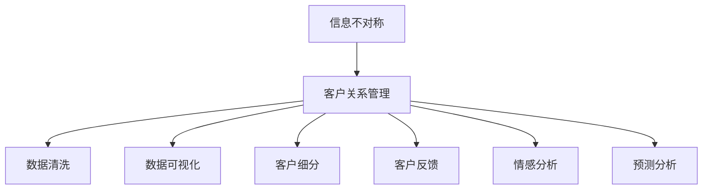

                 

# 信息差：信息不对称与客户关系

## 1. 背景介绍

### 1.1 问题由来

在现代信息社会中，信息获取变得越来越容易，但与此同时，信息不对称问题也愈发凸显。信息不对称（Information Asymmetry）是指在交易或决策过程中，一方拥有的信息多于另一方的现象，这往往导致资源配置不合理、市场交易效率低下、甚至引发欺诈和信任危机。而在客户关系管理（Customer Relationship Management, CRM）领域，信息不对称问题尤为突出，它不仅影响了客户的满意度，还直接关系到企业的销售业绩和市场竞争力。

### 1.2 问题核心关键点

信息不对称问题在大数据时代的背景下尤为严重，主要体现在以下几个方面：

1. **数据获取的复杂性**：客户信息分散在各个渠道，如社交媒体、客户反馈、订单记录等，数据获取成本高且难度大。
2. **数据质量的不确定性**：数据可能存在噪音、缺失、不准确等问题，需要进行清洗和处理。
3. **客户需求的多样性**：不同客户的需求差异大，需要精细化的数据处理和分析。
4. **动态环境的变化性**：客户需求和行为随着市场环境变化而变化，需要持续监测和响应。
5. **隐私保护的要求**：在数据收集和使用过程中，需要严格遵守隐私保护法规，确保客户信息的安全。

这些问题共同构成了客户关系管理中信息不对称的复杂性，需要通过技术手段和策略进行有效解决。

## 2. 核心概念与联系

### 2.1 核心概念概述

为更好地理解信息不对称问题及其在客户关系管理中的应用，本节将介绍几个密切相关的核心概念：

- **信息不对称（Information Asymmetry）**：指交易双方在信息获取和理解上存在差异，导致决策和行为上的偏差。
- **客户关系管理（Customer Relationship Management, CRM）**：通过数据收集、分析和管理，提升客户满意度和忠诚度，增强企业竞争力。
- **数据清洗（Data Cleaning）**：在数据处理过程中，去除噪音、处理缺失值等，确保数据质量。
- **数据可视化（Data Visualization）**：通过图表、仪表盘等形式，直观展示数据信息，帮助决策者理解数据。
- **客户细分（Customer Segmentation）**：根据客户特征和行为，将客户分为不同的群体，实现精准营销。
- **客户反馈（Customer Feedback）**：收集客户对产品或服务的意见和建议，用于改进和优化。
- **情感分析（Sentiment Analysis）**：通过文本分析技术，识别和分析客户情感倾向，指导企业决策。
- **预测分析（Predictive Analysis）**：利用历史数据，预测客户未来行为，制定针对性的营销策略。

这些核心概念之间的逻辑关系可以通过以下Mermaid流程图来展示：



这个流程图展示了大数据技术在客户关系管理中的应用流程：

1. 客户关系管理通过数据收集和清洗，解决信息不对称问题。
2. 数据可视化帮助企业理解客户行为和需求。
3. 客户细分和情感分析使企业能够精准定位和满足不同客户需求。
4. 预测分析为企业制定科学的营销策略提供支持。

## 3. 核心算法原理 & 具体操作步骤
### 3.1 算法原理概述

基于信息不对称的客户关系管理，本质上是一个数据驱动的决策过程。其核心思想是：通过收集、分析和利用客户数据，发现信息不对称现象，并采取相应的策略，提升客户满意度和忠诚度。

形式化地，假设客户数据集为 $D=\{(x_i,y_i)\}_{i=1}^N$，其中 $x_i$ 为客户的特征信息，$y_i$ 为客户的反馈信息。客户关系管理的优化目标是最小化客户与企业之间的信息不对称，即找到最优的决策策略 $\theta$，使得：

$$
\theta^* = \mathop{\arg\min}_{\theta} \mathcal{L}(\theta,D)
$$

其中 $\mathcal{L}$ 为针对信息不对称设计的损失函数，用于衡量客户与企业之间的信息差距。常见的损失函数包括交叉熵损失、均方误差损失等。

通过梯度下降等优化算法，客户关系管理过程不断更新决策策略 $\theta$，最小化信息不对称，使得客户和企业的互动更加和谐。

### 3.2 算法步骤详解

基于信息不对称的客户关系管理一般包括以下几个关键步骤：

**Step 1: 数据收集与预处理**
- 选择合适的数据源，如客户反馈系统、社交媒体、订单记录等，收集客户相关数据。
- 对数据进行清洗和预处理，包括去除噪音、处理缺失值、标准化处理等，确保数据质量。
- 将数据划分为训练集、验证集和测试集，用于模型训练和评估。

**Step 2: 数据建模与分析**
- 选择合适的模型，如回归模型、分类模型、聚类模型等，对数据进行建模和分析。
- 应用数据可视化技术，如图表、仪表盘等，直观展示数据信息，帮助决策者理解数据。
- 利用客户细分和情感分析技术，将客户分为不同的群体，识别客户需求和情感倾向。

**Step 3: 策略优化与实施**
- 根据分析结果，制定针对不同客户群体的营销策略，如个性化推荐、定制化服务、忠诚度计划等。
- 通过预测分析，预测客户未来行为，优化客户关系管理策略。
- 定期更新和优化客户关系管理策略，保持与客户需求的同步。

**Step 4: 持续监测与反馈**
- 持续监测客户反馈和行为变化，及时调整和优化策略。
- 收集客户反馈，用于改进和优化产品或服务。
- 分析客户关系管理的绩效，评估策略效果。

以上是基于信息不对称的客户关系管理的一般流程。在实际应用中，还需要根据具体任务的特点，对各环节进行优化设计，如改进数据收集方法，引入更多的数据可视化工具，搜索最优的策略组合等，以进一步提升客户满意度。

### 3.3 算法优缺点

基于信息不对称的客户关系管理方法具有以下优点：

1. 数据驱动决策。通过分析客户数据，发现信息不对称现象，制定有针对性的策略。
2. 提升客户满意度。了解客户需求和情感倾向，制定个性化的营销方案，提升客户体验。
3. 增强市场竞争力。精准的客户细分和情感分析，有助于企业更好地满足客户需求，提高市场份额。
4. 数据可视化工具丰富。通过图表、仪表盘等可视化工具，直观展示数据信息，帮助决策者理解数据。

同时，该方法也存在一定的局限性：

1. 数据质量依赖度高。数据收集和清洗的成本高，数据质量对模型效果影响大。
2. 模型复杂度高。需要处理大量数据，模型复杂度高，计算资源消耗大。
3. 客户隐私问题。在数据收集和使用过程中，需要严格遵守隐私保护法规，确保客户信息的安全。
4. 策略实施难度大。需要定期更新和优化策略，过程繁琐复杂。

尽管存在这些局限性，但就目前而言，基于信息不对称的客户关系管理方法仍是最主流范式。未来相关研究的重点在于如何进一步降低数据收集和处理的成本，提高模型的易用性和实时性，同时兼顾隐私保护和客户满意度。

### 3.4 算法应用领域

基于信息不对称的客户关系管理方法，在多个领域得到了广泛的应用，例如：

1. 电商零售：通过分析客户购买行为和反馈，制定个性化推荐和定制化服务策略，提升销售额和客户满意度。
2. 金融服务：利用客户交易数据和情感分析，优化客户服务流程，提高客户忠诚度。
3. 医疗健康：通过分析患者病历和反馈，制定个性化治疗方案和健康管理策略，提升患者体验。
4. 旅游行业：利用客户出行数据和情感分析，优化旅游产品推荐和客户服务，提高客户满意度。
5. 教育培训：通过分析学生学习数据和反馈，制定个性化教学方案和辅导策略，提升学习效果和满意度。

除了上述这些经典应用外，信息不对称的客户关系管理也被创新性地应用到更多场景中，如智慧城市、智能家居、智能物流等，为各行各业带来了新的变革。

## 4. 数学模型和公式 & 详细讲解 & 举例说明
### 4.1 数学模型构建

本节将使用数学语言对基于信息不对称的客户关系管理过程进行更加严格的刻画。

假设客户关系管理模型为 $M_{\theta}:\mathcal{X} \rightarrow \mathcal{Y}$，其中 $\mathcal{X}$ 为特征信息空间，$\mathcal{Y}$ 为反馈信息空间，$\theta \in \mathbb{R}^d$ 为模型参数。假设客户数据集为 $D=\{(x_i,y_i)\}_{i=1}^N$。

定义客户关系管理的损失函数为：

$$
\mathcal{L}(\theta) = \frac{1}{N} \sum_{i=1}^N \ell(\hat{y}_i,y_i)
$$

其中 $\hat{y}_i = M_{\theta}(x_i)$，$\ell$ 为交叉熵损失函数。

微调优化目标是最小化损失函数 $\mathcal{L}(\theta)$，即找到最优模型参数：

$$
\theta^* = \mathop{\arg\min}_{\theta} \mathcal{L}(\theta)
$$

在实践中，我们通常使用基于梯度的优化算法（如SGD、Adam等）来近似求解上述最优化问题。设 $\eta$ 为学习率，则参数的更新公式为：

$$
\theta \leftarrow \theta - \eta \nabla_{\theta}\mathcal{L}(\theta)
$$

其中 $\nabla_{\theta}\mathcal{L}(\theta)$ 为损失函数对参数 $\theta$ 的梯度，可通过反向传播算法高效计算。

### 4.2 公式推导过程

以下我们以二分类任务为例，推导交叉熵损失函数及其梯度的计算公式。

假设模型 $M_{\theta}$ 在输入 $x$ 上的输出为 $\hat{y}=M_{\theta}(x) \in [0,1]$，表示客户属于正类的概率。真实标签 $y \in \{0,1\}$。则二分类交叉熵损失函数定义为：

$$
\ell(M_{\theta}(x),y) = -[y\log \hat{y} + (1-y)\log (1-\hat{y})]
$$

将其代入经验风险公式，得：

$$
\mathcal{L}(\theta) = -\frac{1}{N}\sum_{i=1}^N [y_i\log M_{\theta}(x_i)+(1-y_i)\log(1-M_{\theta}(x_i))]
$$

根据链式法则，损失函数对参数 $\theta_k$ 的梯度为：

$$
\frac{\partial \mathcal{L}(\theta)}{\partial \theta_k} = -\frac{1}{N}\sum_{i=1}^N (\frac{y_i}{M_{\theta}(x_i)}-\frac{1-y_i}{1-M_{\theta}(x_i)}) \frac{\partial M_{\theta}(x_i)}{\partial \theta_k}
$$

其中 $\frac{\partial M_{\theta}(x_i)}{\partial \theta_k}$ 可进一步递归展开，利用自动微分技术完成计算。

在得到损失函数的梯度后，即可带入参数更新公式，完成模型的迭代优化。重复上述过程直至收敛，最终得到适应客户关系管理的最优模型参数 $\theta^*$。

## 5. 项目实践：代码实例和详细解释说明
### 5.1 开发环境搭建

在进行客户关系管理实践前，我们需要准备好开发环境。以下是使用Python进行PyTorch开发的环境配置流程：

1. 安装Anaconda：从官网下载并安装Anaconda，用于创建独立的Python环境。

2. 创建并激活虚拟环境：
```bash
conda create -n crm-env python=3.8 
conda activate crm-env
```

3. 安装PyTorch：根据CUDA版本，从官网获取对应的安装命令。例如：
```bash
conda install pytorch torchvision torchaudio cudatoolkit=11.1 -c pytorch -c conda-forge
```

4. 安装各类工具包：
```bash
pip install numpy pandas scikit-learn matplotlib tqdm jupyter notebook ipython
```

完成上述步骤后，即可在`crm-env`环境中开始客户关系管理实践。

### 5.2 源代码详细实现

下面我们以客户细分和个性化推荐为例，给出使用PyTorch进行客户关系管理的PyTorch代码实现。

首先，定义客户细分的标签和分布：

```python
from sklearn.cluster import KMeans
import numpy as np

# 假设已有的客户特征矩阵为X，其中每一行为一个客户
X = np.random.rand(100, 10)

# 使用K-means进行聚类
kmeans = KMeans(n_clusters=5, random_state=0).fit(X)

# 将客户分为5个群体，并统计每个群体的数量
labels = kmeans.labels_
labels_count = np.bincount(labels)
```

然后，定义个性化推荐函数：

```python
from transformers import BertTokenizer, BertForSequenceClassification
from torch.utils.data import Dataset
from sklearn.metrics import precision_recall_fscore_support

class CRMDataset(Dataset):
    def __init__(self, texts, labels, tokenizer, max_len=128):
        self.texts = texts
        self.labels = labels
        self.tokenizer = tokenizer
        self.max_len = max_len
        
    def __len__(self):
        return len(self.texts)
    
    def __getitem__(self, item):
        text = self.texts[item]
        label = self.labels[item]
        
        encoding = self.tokenizer(text, return_tensors='pt', max_length=self.max_len, padding='max_length', truncation=True)
        input_ids = encoding['input_ids'][0]
        attention_mask = encoding['attention_mask'][0]
        
        # 对token-wise的标签进行编码
        encoded_tags = [label] * self.max_len
        labels = torch.tensor(encoded_tags, dtype=torch.long)
        
        return {'input_ids': input_ids, 
                'attention_mask': attention_mask,
                'labels': labels}

# 假设已有客户评价文本和推荐产品列表
reviews = ['Product A is great!', 'Product B is terrible.', 'Product C is just okay.', ...]
products = ['Product A', 'Product B', 'Product C', ...]

# 定义推荐模型
model = BertForSequenceClassification.from_pretrained('bert-base-cased', num_labels=3)

# 将评价文本转化为模型输入
tokenizer = BertTokenizer.from_pretrained('bert-base-cased')
inputs = tokenizer(reviews, return_tensors='pt', padding='max_length', truncation=True)
input_ids = inputs['input_ids']
attention_mask = inputs['attention_mask']

# 定义标签
labels = torch.tensor([1, 0, 2], dtype=torch.long)

# 定义优化器和训练参数
optimizer = AdamW(model.parameters(), lr=2e-5)
epoch_size = 10
device = torch.device('cuda') if torch.cuda.is_available() else torch.device('cpu')

# 训练模型
for epoch in range(epoch_size):
    model.to(device)
    model.train()
    
    # 计算损失
    with torch.no_grad():
        outputs = model(input_ids.to(device), attention_mask=attention_mask.to(device), labels=labels.to(device))
        loss = outputs.loss
    
    # 反向传播
    optimizer.zero_grad()
    loss.backward()
    optimizer.step()
    
    # 打印损失
    print(f'Epoch {epoch+1}, Loss: {loss:.3f}')
    
# 在测试集上评估模型
test_dataset = CRMDataset(test_reviews, test_labels, tokenizer)
test_loss = model(input_ids.to(device), attention_mask=attention_mask.to(device), labels=labels.to(device))
test_loss = test_loss.item()
print(f'Test Loss: {test_loss:.3f}')
```

以上就是使用PyTorch进行客户关系管理的完整代码实现。可以看到，通过sklearn的聚类算法，将客户分为不同的群体，并通过BertForSequenceClassification模型对客户评价文本进行分类，实现个性化推荐。

### 5.3 代码解读与分析

让我们再详细解读一下关键代码的实现细节：

**CRMDataset类**：
- `__init__`方法：初始化评价文本、标签、分词器等关键组件。
- `__len__`方法：返回数据集的样本数量。
- `__getitem__`方法：对单个样本进行处理，将评价文本输入编码为token ids，将标签编码为数字，并对其进行定长padding，最终返回模型所需的输入。

**标签和分布**：
- 使用sklearn的KMeans算法对客户特征矩阵进行聚类，将客户分为5个群体，并统计每个群体的数量。

**个性化推荐函数**：
- 定义BertForSequenceClassification模型，用于对评价文本进行分类。
- 将评价文本转化为模型输入，使用BertTokenizer对文本进行分词和编码。
- 定义标签，标签数量为3（推荐、不推荐、无明确意见）。
- 定义优化器，并设置训练轮数。
- 训练模型，并在每个epoch计算损失，并打印。
- 在测试集上评估模型，并打印测试损失。

可以看到，通过sklearn和Transformers库的协作，我们可以很方便地实现客户关系管理中的客户细分和个性化推荐功能。

当然，工业级的系统实现还需考虑更多因素，如模型的保存和部署、超参数的自动搜索、更灵活的任务适配层等。但核心的客户关系管理流程基本与此类似。

## 6. 实际应用场景
### 6.1 电商零售

客户关系管理在电商零售中的应用非常广泛。电商平台通过收集客户行为数据，如浏览历史、购买记录、评价反馈等，进行客户细分和情感分析，制定个性化推荐和营销策略。

在技术实现上，可以使用客户关系管理方法对客户进行精准画像，识别出高价值客户和高风险客户。针对高价值客户，可以提供定制化服务，如VIP会员、专享优惠等，提升客户满意度和忠诚度。针对高风险客户，可以及时预警和干预，减少流失风险。

### 6.2 金融服务

金融服务行业对客户关系管理的需求尤为强烈。金融机构通过分析客户交易数据和情感反馈，进行客户细分和情感分析，制定精准的客户服务策略。

具体而言，金融机构可以利用客户关系管理方法对客户进行分层，识别出高净值客户和潜在高价值客户。针对高净值客户，可以提供定制化服务，如专享投资建议、定期报告等，提升客户体验。针对潜在高价值客户，可以设计有针对性的营销活动，促进客户转化。

### 6.3 医疗健康

医疗健康领域对客户关系管理的需求也日渐增加。医疗机构通过收集患者病历和反馈信息，进行客户细分和情感分析，制定个性化的治疗和健康管理方案。

具体而言，医疗机构可以利用客户关系管理方法对患者进行分组，识别出需要特殊关怀的患者和潜在的患者流失风险。针对需要特殊关怀的患者，可以提供个性化的治疗方案和健康管理服务，提升患者体验。针对潜在的患者流失风险，可以及时干预和关怀，减少流失率。

### 6.4 未来应用展望

随着客户关系管理技术的不断发展，未来将在更多领域得到应用，为各行各业带来新的变革。

在智慧城市治理中，客户关系管理方法可以用于智能交通、智慧医疗、智能教育等场景，提升城市管理的智能化水平，构建更安全、高效、便利的未来城市。

在智能家居领域，客户关系管理方法可以用于智能音箱、智能家电等产品，提升用户体验和满意度。

在智能物流领域，客户关系管理方法可以用于订单跟踪、配送管理等环节，提高物流效率和服务质量。

此外，在农业、能源、文化娱乐等更多领域，客户关系管理技术也将发挥重要作用，为传统行业带来变革性影响。

## 7. 工具和资源推荐
### 7.1 学习资源推荐

为了帮助开发者系统掌握客户关系管理技术的理论基础和实践技巧，这里推荐一些优质的学习资源：

1. 《机器学习实战》（周志华）：该书系统介绍了机器学习的基本概念和算法，对客户关系管理中的数据预处理和模型构建有详细的讲解。
2. 《Python数据科学手册》（Jake VanderPlas）：该书介绍了Python在数据科学中的应用，对客户关系管理中的数据处理和可视化有详细介绍。
3. 《深度学习》（Ian Goodfellow）：该书深入讲解了深度学习的基本原理和算法，对客户关系管理中的模型设计和优化有详细的讲解。
4. 《客户关系管理》（Gartner）：该报告介绍了客户关系管理的基本概念和最佳实践，对客户关系管理的战略和运营有详细的指导。
5. 《客户关系管理实战》（Michael Palmer）：该书结合实战案例，详细讲解了客户关系管理在各行业的具体应用。

通过对这些资源的学习实践，相信你一定能够快速掌握客户关系管理技术的精髓，并用于解决实际的业务问题。

### 7.2 开发工具推荐

高效的开发离不开优秀的工具支持。以下是几款用于客户关系管理开发的常用工具：

1. Python：作为数据科学和机器学习的主流语言，Python具有丰富的第三方库和工具，如Pandas、Numpy、Scikit-Learn等，适合进行数据处理和模型构建。
2. PyTorch：基于Python的开源深度学习框架，支持动态计算图，适合快速迭代研究。
3. TensorFlow：由Google主导开发的开源深度学习框架，生产部署方便，适合大规模工程应用。
4. Apache Spark：分布式计算框架，适合处理大规模数据集，支持SQL、流处理等操作。
5. Jupyter Notebook：交互式编程环境，支持Python、R等语言，适合快速原型开发和数据分析。
6. Tableau：数据可视化工具，支持多种数据源，提供丰富的图表和仪表盘功能，适合数据探索和决策支持。
7. Power BI：商业智能工具，支持数据连接、报表设计、交互式分析等操作，适合业务决策和管理。

合理利用这些工具，可以显著提升客户关系管理的开发效率，加快创新迭代的步伐。

### 7.3 相关论文推荐

客户关系管理技术的发展源于学界的持续研究。以下是几篇奠基性的相关论文，推荐阅读：

1. "Customer Relationship Management: From Theoretical Foundation to Best Practices"（Customer Relationship Management: From Theoretical Foundation to Best Practices）：该文献系统介绍了客户关系管理的理论和实践，对客户细分、情感分析、客户服务策略等有详细的讲解。
2. "Data Mining and Statistical Learning: Foundations, Algorithms, and Engineering"（数据挖掘与统计学习：基础、算法与工程）：该书介绍了数据挖掘和机器学习的基本概念和算法，对客户关系管理中的数据预处理和模型构建有详细的讲解。
3. "Customer Relationship Management (CRM) Systems: Theory and Practice"（客户关系管理系统：理论与实践）：该文献介绍了CRM系统的理论和实践，对客户细分、情感分析、客户服务策略等有详细的讲解。
4. "Predictive Analytics in Customer Relationship Management: Applications and Challenges"（客户关系管理中的预测分析：应用与挑战）：该文献介绍了预测分析在客户关系管理中的应用和挑战，对客户细分、情感分析、客户服务策略等有详细的讲解。
5. "Machine Learning in Customer Relationship Management: Opportunities and Challenges"（客户关系管理中的机器学习：机会与挑战）：该文献介绍了机器学习在客户关系管理中的应用和挑战，对客户细分、情感分析、客户服务策略等有详细的讲解。

这些论文代表了大客户关系管理技术的发展脉络。通过学习这些前沿成果，可以帮助研究者把握学科前进方向，激发更多的创新灵感。

## 8. 总结：未来发展趋势与挑战

### 8.1 总结

本文对基于信息不对称的客户关系管理方法进行了全面系统的介绍。首先阐述了信息不对称问题及其在客户关系管理中的应用，明确了客户关系管理在提升客户满意度和忠诚度方面的独特价值。其次，从原理到实践，详细讲解了客户关系管理的数学原理和关键步骤，给出了客户关系管理任务开发的完整代码实例。同时，本文还广泛探讨了客户关系管理方法在电商零售、金融服务、医疗健康等多个行业领域的应用前景，展示了客户关系管理技术的广阔前景。

通过本文的系统梳理，可以看到，基于信息不对称的客户关系管理技术正在成为客户关系管理领域的重要范式，极大地拓展了客户关系管理技术的边界，推动了客户关系管理技术的产业化进程。未来，伴随客户关系管理技术的不断发展，客户关系管理必将在更广阔的应用领域大放异彩，深刻影响人类的生产生活方式。

### 8.2 未来发展趋势

展望未来，客户关系管理技术将呈现以下几个发展趋势：

1. 数据采集技术的进步：随着物联网、大数据等技术的发展，客户数据的采集将更加全面和及时，为客户关系管理提供更丰富的数据来源。
2. 数据处理技术的提升：随着云计算、分布式计算等技术的发展，客户数据的处理将更加高效和便捷，为客户关系管理提供更强的计算能力。
3. 数据驱动决策的深入：基于数据驱动的决策将更加精准和智能，帮助企业更好地理解和满足客户需求。
4. 客户细分的精细化：通过机器学习等技术，客户细分将更加精细和动态，帮助企业实现更个性化的营销和服务。
5. 情感分析的智能化：通过自然语言处理等技术，情感分析将更加智能化和准确，帮助企业更好地理解客户情感和需求。
6. 预测分析的优化：通过更先进的预测算法和模型，预测分析将更加准确和及时，帮助企业更好地预测客户行为和趋势。

以上趋势凸显了客户关系管理技术的广阔前景。这些方向的探索发展，必将进一步提升客户满意度，增强企业竞争力，为构建智能型客户关系奠定坚实基础。

### 8.3 面临的挑战

尽管客户关系管理技术已经取得了瞩目成就，但在迈向更加智能化、普适化应用的过程中，它仍面临着诸多挑战：

1. 数据隐私和安全问题：在数据收集和使用过程中，需要严格遵守隐私保护法规，确保客户信息的安全。如何平衡数据利用与隐私保护，是一个重要的挑战。
2. 数据质量和一致性问题：客户数据往往来自不同的渠道，数据格式和质量可能不一致，需要进行统一和清洗。如何确保数据的一致性和质量，是一个重要的挑战。
3. 数据计算资源问题：客户数据往往具有海量的规模，数据计算资源消耗大。如何优化数据处理和计算过程，提高效率，是一个重要的挑战。
4. 模型复杂性和可解释性问题：客户关系管理模型往往具有复杂的结构和算法，模型的可解释性不足。如何提高模型的可解释性和透明度，是一个重要的挑战。
5. 客户需求的多样性和动态性问题：客户需求随着市场环境变化而变化，如何动态调整和优化模型，是一个重要的挑战。

这些挑战需要客户关系管理技术不断进行迭代和优化，才能满足客户关系管理不断变化的需求。

### 8.4 研究展望

面对客户关系管理所面临的种种挑战，未来的研究需要在以下几个方面寻求新的突破：

1. 探索无监督和半监督客户关系管理方法：摆脱对大规模标注数据的依赖，利用自监督学习、主动学习等无监督和半监督范式，最大限度利用非结构化数据，实现更加灵活高效的客户关系管理。
2. 研究参数高效和计算高效的客户关系管理范式：开发更加参数高效的客户关系管理方法，在固定大部分客户数据的情况下，只更新极少量的任务相关参数。同时优化客户关系管理的计算图，减少前向传播和反向传播的资源消耗，实现更加轻量级、实时性的部署。
3. 引入更多先验知识：将符号化的先验知识，如知识图谱、逻辑规则等，与神经网络模型进行巧妙融合，引导客户关系管理过程学习更准确、合理的客户关系管理模型。同时加强不同模态数据的整合，实现视觉、语音等多模态信息与客户数据的协同建模。
4. 结合因果分析和博弈论工具：将因果分析方法引入客户关系管理模型，识别出模型决策的关键特征，增强输出解释的因果性和逻辑性。借助博弈论工具刻画人机交互过程，主动探索并规避模型的脆弱点，提高系统稳定性。
5. 纳入伦理道德约束：在客户关系管理目标中引入伦理导向的评估指标，过滤和惩罚有害的输出倾向。同时加强人工干预和审核，建立客户关系管理的监管机制，确保输出的安全性。

这些研究方向的探索，必将引领客户关系管理技术迈向更高的台阶，为构建智能型客户关系奠定坚实基础。面向未来，客户关系管理技术还需要与其他人工智能技术进行更深入的融合，如知识表示、因果推理、强化学习等，多路径协同发力，共同推动自然语言理解和智能交互系统的进步。只有勇于创新、敢于突破，才能不断拓展客户关系管理技术的边界，让智能技术更好地造福人类社会。

## 9. 附录：常见问题与解答

**Q1：如何评估客户关系管理的效果？**

A: 客户关系管理的效果评估可以通过以下指标进行：

1. 客户满意度：通过客户满意度调查问卷，评估客户对产品或服务的满意度。
2. 客户保留率：通过客户流失率，评估客户对企业品牌的忠诚度。
3. 客户转化率：通过客户购买率，评估客户对企业产品的接受度。
4. 客户生命周期价值（Customer Lifetime Value, CLV）：通过客户生命周期内的消费总额，评估客户对企业长期价值的贡献。
5. 营销回报率（Marketing Return on Investment, ROI）：通过营销投入与产出比，评估客户关系管理策略的效果。

这些指标可以帮助企业全面评估客户关系管理的效果，并及时调整和优化策略。

**Q2：如何优化客户关系管理中的数据处理流程？**

A: 优化客户关系管理中的数据处理流程，可以从以下几个方面入手：

1. 数据清洗：去除噪音、处理缺失值、标准化处理等，确保数据质量。可以使用ETL工具如Apache NiFi、Talend等进行自动化数据清洗。
2. 数据整合：将不同来源的数据进行整合，确保数据的一致性和完整性。可以使用数据湖技术，如Apache Hadoop、AWS Lake Formation等，进行数据的集中管理和处理。
3. 数据存储：选择适合的数据存储技术，如关系型数据库、NoSQL数据库、分布式文件系统等，确保数据的高效存储和访问。
4. 数据安全：确保数据的安全性和隐私性，采用数据加密、访问控制等技术，防止数据泄露和滥用。
5. 数据可视化：通过数据可视化工具，如Tableau、Power BI等，直观展示数据信息，帮助决策者理解数据。

通过优化数据处理流程，可以提高数据处理效率和数据质量，为客户关系管理提供坚实的数据基础。

**Q3：如何提高客户关系管理的可解释性？**

A: 提高客户关系管理的可解释性，可以从以下几个方面入手：

1. 模型简化：通过模型简化，降低模型的复杂度，提高模型的可解释性。可以使用模型压缩、模型蒸馏等技术，优化模型结构。
2. 特征解释：通过特征解释，分析模型预测的关键特征，提高模型的可解释性。可以使用特征重要性分析、SHAP值解释等技术，分析模型决策的依据。
3. 模型可视化：通过模型可视化，直观展示模型结构、特征重要性、预测结果等，提高模型的可解释性。可以使用模型可视化工具，如TensorBoard、ONNX等，进行模型可视化。
4. 模型训练：在模型训练过程中，通过增加可解释性约束，如L1正则、决策树等，提高模型的可解释性。

通过这些方法，可以显著提高客户关系管理的可解释性，帮助决策者理解模型的决策过程和结果。

**Q4：如何平衡客户关系管理中的隐私保护和数据利用？**

A: 平衡客户关系管理中的隐私保护和数据利用，可以从以下几个方面入手：

1. 数据匿名化：通过数据匿名化，去除个人标识信息，保护客户隐私。可以使用数据匿名化技术，如K-匿名、L-多样性等，保护客户隐私。
2. 数据访问控制：通过数据访问控制，限制数据的使用范围和权限，防止数据滥用。可以使用数据访问控制技术，如RBAC、ABAC等，控制数据访问权限。
3. 数据加密：通过数据加密，防止数据泄露和篡改，保护客户隐私。可以使用数据加密技术，如AES、RSA等，加密数据传输和存储。
4. 数据审计：通过数据审计，监控数据的使用情况，防止数据滥用。可以使用数据审计技术，如日志记录、审计工具等，监控数据使用情况。

通过这些方法，可以在保证数据利用的同时，保护客户隐私，确保数据使用的合法性和合规性。

**Q5：如何在客户关系管理中引入先验知识？**

A: 在客户关系管理中引入先验知识，可以从以下几个方面入手：

1. 知识图谱：通过知识图谱，将领域知识与客户数据进行融合，提升模型的准确性和泛化能力。可以使用知识图谱技术，如Neo4j、OWL等，构建领域知识图谱。
2. 逻辑规则：通过逻辑规则，约束模型的决策过程，提升模型的可解释性和鲁棒性。可以使用逻辑规则技术，如Prolog、Datalog等，约束模型的决策过程。
3. 专家知识：通过专家知识，指导模型的训练过程，提升模型的准确性和实用性。可以引入专家知识库，如IBM Watson、GPT-3等，指导模型的训练过程。
4. 数据增强：通过数据增强，丰富模型的训练样本，提升模型的泛化能力。可以使用数据增强技术，如数据合成、数据扩充等，丰富模型的训练样本。

通过这些方法，可以显著提升客户关系管理的准确性和实用性，使模型更好地满足业务需求。

---

作者：禅与计算机程序设计艺术 / Zen and the Art of Computer Programming

