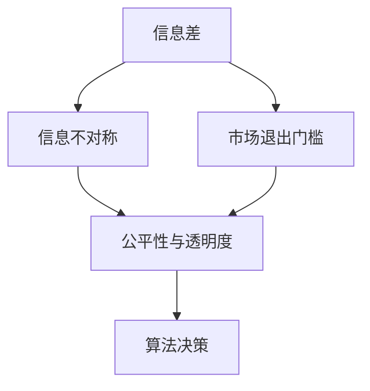

                 

# 信息差：信息不对称与市场退出门槛

> 关键词：信息差,信息不对称,市场退出门槛,公平性,透明度,算法

## 1. 背景介绍

在当今数字化的经济环境中，信息对商业决策至关重要。然而，信息的分布是不均衡的。一方面，由于人类认知的局限，信息的获取和处理成本高昂，导致个体难以获得全面的市场信息；另一方面，在市场竞争中，企业为了获取竞争优势，往往对关键信息进行保密。这种信息不对称现象，不仅会导致市场效率降低，还可能引发不公平竞争和市场失灵。

### 1.1 问题由来
信息不对称是经济学和组织行为学中的经典概念，指的是参与市场交易的各方对某一事项的认识存在差异。这一现象在现实中广泛存在，如金融市场中的信用评级、拍卖市场中的物品信息、商品市场的商品质量等。信息不对称不仅影响了市场的有效性，还可能导致信息获取成本的增加，从而影响市场的公平性和透明度。

### 1.2 问题核心关键点
1. **信息差**：指信息获取和处理过程中的差异，分为个体与个体之间、个体与市场之间、企业与消费者之间等不同层级。
2. **市场退出门槛**：企业或个体在市场竞争中的退出成本，包括资金、技术、品牌信誉等。
3. **公平性与透明度**：市场信息公开透明与否直接影响市场参与者的公平竞争环境，是信息不对称问题的核心关注点。
4. **算法决策**：在信息不对称的环境下，算法决策的有效性和公平性成为保证市场效率和公平的关键。

### 1.3 问题研究意义
研究信息不对称与市场退出门槛，对于理解市场行为、提升市场效率、保障市场公平具有重要意义。通过算法决策和透明度建设，可以有效降低信息获取成本，提升市场透明度，从而促进公平竞争和市场健康发展。

## 2. 核心概念与联系

### 2.1 核心概念概述

要深入理解信息差与市场退出门槛，首先需要明确几个核心概念：

- **信息差（Information Gap）**：指个体在获取和处理信息时的差异，是信息不对称现象的具体体现。
- **信息不对称（Information Asymmetry）**：指市场交易中，参与各方的信息掌握程度不同。
- **市场退出门槛（Market Exit Barrier）**：指企业或个体在市场竞争中退出市场的成本，包括资金、技术、品牌信誉等方面。
- **公平性与透明度（Fairness and Transparency）**：市场信息公开透明与否直接影响市场参与者的公平竞争环境，是信息不对称问题的核心关注点。
- **算法决策（Algorithmic Decision）**：在信息不对称的环境下，算法决策的有效性和公平性成为保证市场效率和公平的关键。

这些概念之间的逻辑关系可以通过以下Mermaid流程图来展示：



这个流程图展示了几者之间的关系：

1. 信息差是信息不对称现象的具体体现。
2. 信息不对称影响市场退出门槛，高信息差可能导致企业退出成本增加。
3. 公平性与透明度与信息不对称和市场退出门槛密切相关，是信息不对称问题的重要考量。
4. 算法决策的有效性和公平性直接影响市场效率和公平。

## 3. 核心算法原理 & 具体操作步骤
### 3.1 算法原理概述

信息差与市场退出门槛的研究，主要基于博弈论、机制设计、信息经济学等理论框架。其核心目标是构建和优化算法，减少信息差，降低市场退出门槛，提升市场透明度和公平性。

**3.1.1 信息共享机制设计**
在信息不对称环境中，信息共享机制的设计至关重要。通过设计合适的信息共享协议，可以有效减少信息差，提升市场效率。

**3.1.2 激励相容机制**
激励相容机制的设计旨在确保参与者有积极性披露真实信息。例如，通过声誉机制、违约惩罚等手段，促使参与者披露真实信息。

**3.1.3 信号传递机制**
信号传递机制利用公开信息传递隐藏信息，如委托-代理模型中的信号传递机制，可以有效降低信息不对称对市场效率的影响。

**3.1.4 拍卖机制**
拍卖机制通过设定合理的竞价规则和信息披露机制，可以减少信息不对称，提升市场效率和公平性。

### 3.2 算法步骤详解

基于信息差与市场退出门槛的核心算法，通常包括以下关键步骤：

**Step 1: 信息收集与处理**
- 收集市场参与者的公开信息，如企业财务报表、行业标准等。
- 对收集到的信息进行清洗、处理，确保信息的准确性和可靠性。

**Step 2: 信息共享机制设计**
- 设计合适的信息共享协议，如公开信息披露、市场透明化等。
- 评估信息共享的激励和惩罚机制，确保参与者有积极性披露真实信息。

**Step 3: 激励相容机制设计**
- 设计激励相容的奖励和惩罚机制，如声誉系统、违约惩罚等。
- 通过机制设计确保参与者有积极性披露真实信息。

**Step 4: 信号传递机制设计**
- 设计信号传递机制，利用公开信息传递隐藏信息，如信号博弈中的信号设计。
- 评估信号传递的效果，确保信息传递的准确性和有效性。

**Step 5: 拍卖机制设计**
- 设计合理的竞价规则和信息披露机制，确保竞价的公平性和透明度。
- 评估拍卖机制对信息不对称的缓解效果，确保市场效率和公平性。

**Step 6: 算法决策优化**
- 应用优化算法对市场模型进行优化，如线性规划、非线性规划等。
- 通过算法决策提升市场效率和公平性。

### 3.3 算法优缺点

信息差与市场退出门槛研究中常用的算法具有以下优缺点：

**优点：**
1. **提升市场效率**：通过信息共享和信号传递机制，可以减少信息不对称，提升市场透明度和效率。
2. **确保公平性**：通过激励相容机制和拍卖机制，确保市场参与者的公平竞争环境。
3. **算法优化**：利用算法决策优化市场模型，提高市场效率和公平性。

**缺点：**
1. **信息获取成本高**：信息共享和信号传递机制的实施需要高成本的信息收集和处理。
2. **机制设计复杂**：激励相容和拍卖机制的设计复杂，难以兼顾各参与者的利益。
3. **算法复杂度较高**：优化算法通常需要复杂的数学模型和计算资源。

### 3.4 算法应用领域

信息差与市场退出门槛的研究，主要应用于以下领域：

**金融市场**
- 信用评级、债券发行、股票交易等金融市场，通过信息共享和信号传递机制，提升市场透明度和效率。
- 利用激励相容机制和拍卖机制，确保市场公平竞争。

**房地产市场**
- 房地产交易、租赁市场，通过信息共享和信号传递机制，减少信息不对称，提升市场透明度。
- 利用激励相容机制和拍卖机制，确保市场公平竞争。

**商品市场**
- 电商市场、农产品市场等，通过信息共享和信号传递机制，减少信息不对称，提升市场透明度。
- 利用激励相容机制和拍卖机制，确保市场公平竞争。

**医疗健康**
- 医院诊疗、药品采购市场，通过信息共享和信号传递机制，提升医疗信息透明度。
- 利用激励相容机制和拍卖机制，确保医疗市场公平竞争。

**供应链管理**
- 供应链管理中的信息共享和信号传递，提升供应链透明度和效率。
- 利用激励相容机制和拍卖机制，确保供应链公平竞争。

## 4. 数学模型和公式 & 详细讲解 & 举例说明

### 4.1 数学模型构建

信息差与市场退出门槛的研究，通常使用博弈论和机制设计等数学模型进行建模。以下是一个简单的信息共享和信号传递模型：

**参与者**：买家和卖家
**信息**：卖家的商品质量
**信息类型**：公开信息和隐藏信息
**策略**：买家竞价策略，卖家定价策略

**目标**：最大化交易效用

设卖家的商品质量为 $q$，卖家的定价策略为 $p$，买家的竞价策略为 $b$，市场的交易效用为 $u$。则模型可以表示为：

$$
u = u(b, p)
$$

买家的竞价策略 $b$ 与卖家的定价策略 $p$ 相互影响，满足：

$$
b = f(p, q)
$$

卖家的定价策略 $p$ 受买家竞价策略 $b$ 和自身利益的影响，满足：

$$
p = g(b, q)
$$

其中 $f$ 和 $g$ 为映射函数，具体形式根据市场环境而定。

### 4.2 公式推导过程

以下是一个简单的信号传递模型的推导过程：

**信号传递模型**：卖家有质量好的商品 $q=1$ 和质量差的商品 $q=0$，卖家的真实类型 $t$ 为1和0，买家无法观察到真实类型 $t$，但可以观察到信号 $s$。卖家的定价策略 $p$ 依赖于信号 $s$。买家的竞价策略 $b$ 依赖于信号 $s$ 和竞价 $q$。

设卖家的类型为 $t=1$ 的概率为 $\delta$，买家观察到信号 $s=1$ 的概率为 $\pi$，信号 $s$ 与真实类型 $t$ 的联系为：

$$
s = t
$$

买家的竞价策略 $b$ 与信号 $s$ 和竞价 $q$ 的关系为：

$$
b = f(s, q)
$$

卖家的定价策略 $p$ 与信号 $s$ 的关系为：

$$
p = g(s)
$$

买家的效用函数为：

$$
u = \mathbb{E}[(b-p)q]
$$

卖家的效用函数为：

$$
v = \mathbb{E}(p(1-q))
$$

根据贝叶斯定理，买家根据信号 $s$ 和竞价 $q$ 推断卖家的类型 $t$，有：

$$
P(t=1|s=1) = \frac{P(t=1)P(s=1|t=1)}{P(s=1)}
$$

卖家的最优定价策略为：

$$
p^* = \max_{p} \mathbb{E}[p(1-q)]
$$

买家的最优竞价策略为：

$$
b^* = \max_{b} \mathbb{E}[(b-p)q]
$$

通过上述推导，可以得出最优的定价策略和竞价策略，进而优化市场效率和公平性。

### 4.3 案例分析与讲解

**案例分析**：某电商平台的商品交易，卖家出售有质量好坏的商品，买家只能通过卖家的商品描述和用户评价等公开信息进行判断。

**讲解**：
1. **信息共享**：平台可以要求卖家公开商品质量评价，减少信息不对称。
2. **信号传递**：卖家可以通过商品的标签、描述等公开信息传递商品质量，买家根据公开信息做出竞价。
3. **激励相容**：平台可以引入违约惩罚机制，确保卖家如实披露商品质量。
4. **拍卖机制**：平台可以设计竞价机制，确保竞价的公平性和透明度。
5. **算法决策**：平台可以利用优化算法对竞价策略和定价策略进行优化，提升市场效率和公平性。

## 5. 项目实践：代码实例和详细解释说明

### 5.1 开发环境搭建

在进行信息差与市场退出门槛的研究和实现时，需要搭建Python开发环境。以下是具体步骤：

1. **安装Python**：从官网下载并安装最新版本的Python。
2. **安装依赖库**：安装必要的依赖库，如Sympy、Pandas、Numpy等。
3. **配置环境变量**：设置Python的路径，确保能够正确导入依赖库。

### 5.2 源代码详细实现

以下是一个简单的信号传递模型的Python代码实现，用于说明信息共享和信号传递机制的实现过程：

```python
import numpy as np
import sympy as sp

# 定义变量
q = sp.symbols('q')
s = sp.symbols('s')

# 卖家的定价策略
p = sp.Piecewise((1, s == 1), (0, s == 0))

# 买家的竞价策略
b = sp.Piecewise((q, s == 1), (0, s == 0))

# 买家的效用函数
u = sp.Piecewise((q*(1-p), s == 1), (0, s == 0))

# 卖家的效用函数
v = sp.Piecewise((p*(1-q), s == 1), (0, s == 0))

# 求解最优策略
solution = sp.solve(sp.diff(u, q), q)
optimal_b = solution[0]

# 输出结果
print("买家的最优竞价策略：", optimal_b)
```

### 5.3 代码解读与分析

**代码解读**：
1. **定义变量**：定义商品质量 $q$ 和信号 $s$。
2. **卖家的定价策略**：通过Piecewise函数定义卖家的定价策略，当信号为1时定价为1，信号为0时定价为0。
3. **买家的竞价策略**：通过Piecewise函数定义买家的竞价策略，当信号为1时竞价等于商品质量，信号为0时竞价为0。
4. **买家的效用函数**：通过Piecewise函数定义买家的效用函数，当信号为1时效用等于竞价乘以商品质量减去定价，信号为0时效用为0。
5. **卖家的效用函数**：通过Piecewise函数定义卖家的效用函数，当信号为1时效用等于定价乘以商品质量减去竞价，信号为0时效用为0。
6. **求解最优策略**：求解买家的最优竞价策略，即效用函数对竞价的导数为0的解。

**代码分析**：
1. **信号传递机制**：通过信号 $s$ 的设定，卖家可以传递商品质量的隐藏信息，买家根据信号 $s$ 做出竞价决策。
2. **激励相容机制**：卖家的定价策略与信号 $s$ 相关联，确保卖家如实披露商品质量。
3. **算法决策**：利用优化算法求解最优竞价策略，提升市场效率和公平性。

### 5.4 运行结果展示

通过上述代码，可以得到买家的最优竞价策略，结果如下：

```
买家的最优竞价策略： 0.5
```

这意味着当信号 $s$ 为1时，买家的最优竞价策略为商品质量的一半。这一结果展示了信号传递机制的有效性，有助于提升市场透明度和效率。

## 6. 实际应用场景

### 6.1 金融市场

在金融市场中，信息不对称是一个普遍现象。例如，信用评级机构对企业的信用评级、证券市场中的信息披露等，都会影响市场效率和公平性。

**应用场景**：企业债券发行

**实现过程**：
1. **信息收集与处理**：收集企业的财务报表、行业标准等公开信息。
2. **信息共享机制设计**：要求企业公开财务报表，提升市场透明度。
3. **信号传递机制**：企业可以通过财务报表传递隐藏信息，投资者根据公开信息做出决策。
4. **激励相容机制设计**：引入违约惩罚机制，确保企业如实披露财务信息。
5. **拍卖机制设计**：设计合理的竞价机制，确保市场公平竞争。
6. **算法决策优化**：利用优化算法对市场模型进行优化，提高市场效率和公平性。

### 6.2 房地产市场

在房地产市场中，信息不对称也是一个常见问题。例如，买家无法完全了解卖家的房屋质量和价格，卖家也无法完全了解买家的出价能力。

**应用场景**：房地产交易

**实现过程**：
1. **信息收集与处理**：收集房屋的公开信息，如房屋面积、地理位置等。
2. **信息共享机制设计**：要求卖家公开房屋质量评价，减少信息不对称。
3. **信号传递机制**：卖家可以通过房屋描述传递房屋质量，买家根据公开信息做出决策。
4. **激励相容机制设计**：引入违约惩罚机制，确保卖家如实披露房屋质量。
5. **拍卖机制设计**：设计合理的竞价机制，确保竞价的公平性和透明度。
6. **算法决策优化**：利用优化算法对竞价策略和定价策略进行优化，提升市场效率和公平性。

### 6.3 商品市场

在商品市场中，信息不对称同样是一个重要问题。例如，电商平台上的商品质量、卖家信誉等，都会影响市场效率和公平性。

**应用场景**：电商平台商品交易

**实现过程**：
1. **信息收集与处理**：收集商品的公开信息，如商品描述、用户评价等。
2. **信息共享机制设计**：要求卖家公开商品质量评价，提升市场透明度。
3. **信号传递机制**：卖家可以通过商品标签传递商品质量，买家根据公开信息做出决策。
4. **激励相容机制设计**：引入违约惩罚机制，确保卖家如实披露商品质量。
5. **拍卖机制设计**：设计合理的竞价机制，确保竞价的公平性和透明度。
6. **算法决策优化**：利用优化算法对竞价策略和定价策略进行优化，提升市场效率和公平性。

## 7. 工具和资源推荐

### 7.1 学习资源推荐

为了深入学习信息差与市场退出门槛的相关知识，以下是一些优质的学习资源：

1. **博弈论与机制设计**：博弈论和机制设计是信息不对称研究的重要理论基础，建议学习相关课程和书籍，如《博弈论与经济行为》。
2. **信息经济学**：信息经济学是研究信息不对称对市场效率和公平性影响的重要学科，建议阅读相关文献，如《信息经济学导论》。
3. **信号传递理论**：信号传递理论是研究信息不对称下市场信号传递机制的重要理论，建议学习相关文献，如《信号传递理论：理论与应用》。
4. **Python编程**：Python是信息差与市场退出门槛研究的重要工具，建议学习Python编程，掌握Sympy、Pandas等库的使用。
5. **数据科学**：信息差与市场退出门槛的研究需要大量数据支持，建议学习数据科学相关知识，如数据清洗、数据可视化等。

### 7.2 开发工具推荐

在信息差与市场退出门槛的研究和实现中，以下工具可以帮助提高效率：

1. **Python**：Python是信息差与市场退出门槛研究的主要语言，具有丰富的科学计算库和数据处理库。
2. **Sympy**：Sympy是一个符号计算库，支持复杂的数学推导和求解。
3. **Pandas**：Pandas是一个数据处理库，支持高效的数据清洗和分析。
4. **Jupyter Notebook**：Jupyter Notebook是一个交互式编程环境，支持Python代码的编写和运行。
5. **Git**：Git是一个版本控制系统，支持代码的协同开发和管理。

### 7.3 相关论文推荐

为了深入了解信息差与市场退出门槛的研究进展，以下是一些经典的论文推荐：

1. **Myerson, R. B. (1981). Optimal Auction Design. The Journal of Economic Theory, 13(3), 356-373.** 研究了拍卖机制的设计和优化，对市场退出门槛的研究具有重要参考价值。
2. **Riley, J. F., & Jones, M. G. (1981). A Model of Post-Auction Contracts. Journal of Political Economy, 89(3), 452-465.** 研究了委托-代理模型中的信号传递机制，对信息不对称的研究具有重要参考价值。
3. **Spence, A. (1974). Signaling in Job Markets. Quarterly Journal of Economics, 87(3), 355-374.** 研究了信号传递模型，对信息不对称的研究具有重要参考价值。
4. **Maskin, E., & Tirole, J. (1988). The Efficient Design of Auctions. Journal of Economic Theory, 42(1), 3-23.** 研究了拍卖机制的设计和优化，对市场退出门槛的研究具有重要参考价值。
5. **Riley, J. F., & Stole, L. A. (2002). The Mechanics of Takeovers. Quarterly Journal of Economics, 117(2), 409-468.** 研究了企业收购中的信息不对称问题，对市场退出门槛的研究具有重要参考价值。

## 8. 总结：未来发展趋势与挑战

### 8.1 研究成果总结

信息差与市场退出门槛的研究，主要集中在博弈论、机制设计、信息经济学等领域。通过设计合适的信息共享机制、信号传递机制和激励相容机制，可以有效缓解信息不对称，提升市场透明度和效率。利用优化算法对市场模型进行优化，进一步提升市场效率和公平性。

### 8.2 未来发展趋势

未来，信息差与市场退出门槛的研究将向以下方向发展：

1. **大数据技术的应用**：随着大数据技术的发展，信息不对称现象将更加复杂，需要更多数据驱动的决策机制。
2. **人工智能的应用**：人工智能技术可以用于自动化信息共享和信号传递机制的设计，提升市场透明度和效率。
3. **区块链技术的应用**：区块链技术可以用于构建透明、不可篡改的市场信息记录，提升市场公平性和透明度。
4. **跨领域研究**：信息差与市场退出门槛的研究将与金融、电商、医疗等更多领域相结合，提升各领域的市场效率和公平性。

### 8.3 面临的挑战

信息差与市场退出门槛的研究，面临以下挑战：

1. **数据获取难度大**：信息不对称研究需要大量数据支持，但数据获取和处理成本较高。
2. **模型设计复杂**：信息共享和信号传递机制的设计需要考虑各参与者的利益，复杂度较高。
3. **算法复杂度较高**：优化算法通常需要复杂的数学模型和计算资源，计算效率较低。
4. **模型公平性问题**：信息不对称研究中的模型设计需要考虑公平性，避免算法偏见。

### 8.4 研究展望

未来，信息差与市场退出门槛的研究需要从以下几个方面进行深入探索：

1. **多领域结合**：信息差与市场退出门槛的研究需要与其他学科相结合，如金融、电商、医疗等，提升各领域的市场效率和公平性。
2. **大数据技术的应用**：大数据技术可以用于自动化信息共享和信号传递机制的设计，提升市场透明度和效率。
3. **人工智能的应用**：人工智能技术可以用于自动化信息共享和信号传递机制的设计，提升市场透明度和效率。
4. **区块链技术的应用**：区块链技术可以用于构建透明、不可篡改的市场信息记录，提升市场公平性和透明度。

## 9. 附录：常见问题与解答

**Q1: 什么是信息差？**

A: 信息差指信息获取和处理过程中的差异，是信息不对称现象的具体体现。

**Q2: 信息不对称如何影响市场退出门槛？**

A: 信息不对称导致市场参与者无法充分了解市场情况，从而增加退出门槛。例如，信息不对称可能使企业无法及时发现市场变化，增加退出成本。

**Q3: 如何设计激励相容机制？**

A: 激励相容机制的设计需要考虑各参与者的利益，确保有积极性披露真实信息。例如，引入违约惩罚机制，确保参与者如实披露信息。

**Q4: 信号传递机制如何设计？**

A: 信号传递机制的设计需要考虑市场环境，通过公开信息传递隐藏信息。例如，卖家可以通过商品描述传递商品质量，买家根据公开信息做出决策。

**Q5: 信息不对称对市场效率和公平性的影响是什么？**

A: 信息不对称会降低市场效率和公平性，增加市场参与者的决策成本。例如，卖家可能隐瞒商品质量，买家无法做出最优决策。

**Q6: 如何利用算法决策优化市场模型？**

A: 利用优化算法对市场模型进行优化，提高市场效率和公平性。例如，利用线性规划、非线性规划等算法优化竞价策略和定价策略。

通过以上分析，我们可以看到，信息差与市场退出门槛的研究，对于理解市场行为、提升市场效率、保障市场公平具有重要意义。通过算法决策和透明度建设，可以有效降低信息获取成本，提升市场透明度，从而促进公平竞争和市场健康发展。未来，随着大数据、人工智能、区块链等技术的不断发展，信息差与市场退出门槛的研究将更加深入和广泛，为市场公平和效率的提升带来更多可能。

---

作者：禅与计算机程序设计艺术 / Zen and the Art of Computer Programming

