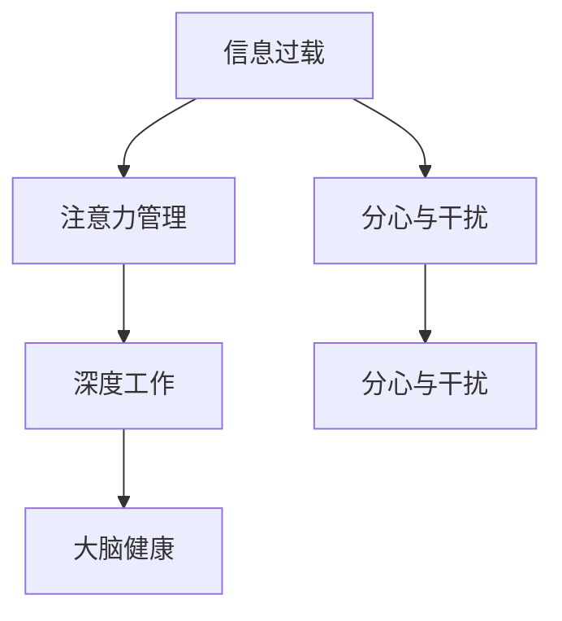

                 

# 信息时代的注意力管理实践与指南：在干扰和分心中保持头脑清晰

> 关键词：注意力管理,信息过载,分心,干扰,决策效率,专注力,深度工作,大脑健康

## 1. 背景介绍

### 1.1 问题由来
随着数字信息时代的到来，我们被信息洪流所淹没。海量的新闻、社交媒体、电子邮件、在线视频等数字内容，使得我们每天需要处理的信息量剧增。虽然这极大地丰富了我们的知识和信息，但同时也带来了严重的注意力管理问题。过多的信息干扰和分心，使我们难以专注于重要的工作和学习任务，导致效率低下，甚至引发心理健康问题。

### 1.2 问题核心关键点
1. **信息过载**：现代社会的信息量远远超出了人类处理能力的极限，难以筛选出真正重要的信息。
2. **分心与干扰**：数字设备和各种即时通讯工具，不断打断我们的专注，使得工作效率大打折扣。
3. **决策效率下降**：信息过载和分心导致我们无法迅速做出高质量的决策。
4. **大脑健康**：长期处于分心和干扰状态，对大脑健康带来不利影响，如记忆力下降、注意力涣散等。

### 1.3 问题研究意义
1. **提升工作效率**：有效管理注意力，能够显著提升个人和团队的工作效率。
2. **改善心理健康**：减少信息干扰，保护大脑健康，提升整体生活质量。
3. **促进深度学习**：注意力管理技术帮助人们进入深度工作状态，提高学习效果和创新能力。
4. **支撑决策质量**：有效管理注意力，能够确保决策过程清晰，避免因信息过载导致的决策失误。

## 2. 核心概念与联系

### 2.1 核心概念概述

为更好地理解信息时代注意力管理的实践与指南，本节将介绍几个密切相关的核心概念：

- **注意力管理(Attention Management)**：指通过一系列策略和技术，减少干扰和分心，保持大脑专注于重要任务。
- **信息过载(Information Overload)**：指在处理信息时，信息量超出个人处理能力的极限，导致无法有效筛选和处理重要信息。
- **分心与干扰(Distracts and Interruptions)**：指外部环境或内部因素导致的注意力分散，无法集中于当前任务。
- **深度工作(Deep Work)**：指在无干扰的状态下，专注于复杂、认知要求高的任务，以达到最佳工作效果。
- **大脑健康(Brain Health)**：指通过合理的信息管理，保护大脑健康，预防注意力相关疾病。

这些核心概念之间的逻辑关系可以通过以下Mermaid流程图来展示：



这个流程图展示了一些核心概念之间的相互联系：

1. 信息过载导致注意力分散，需要通过注意力管理来解决问题。
2. 注意力管理有助于进入深度工作状态，提高工作效率。
3. 深度工作有利于大脑健康，防止注意力疲劳。
4. 分心和干扰同样对注意力管理和深度工作构成影响。

## 3. 核心算法原理 & 具体操作步骤
### 3.1 算法原理概述

信息时代注意力管理的目标，是通过科学的方法和技术，帮助人们减少干扰和分心，专注于重要任务。其核心思想是：

1. **识别干扰源**：找出日常工作和学习中主要的干扰因素。
2. **设置优先级**：明确重要任务和紧急任务的优先级。
3. **执行专注策略**：采取具体的策略和技巧，如番茄工作法、时间块管理等，确保专注。
4. **监测与调整**：使用工具和技术，持续监测注意力状态，及时调整策略。

### 3.2 算法步骤详解

1. **识别干扰源**：
   - **外部干扰**：如电话、邮件、社交媒体等。
   - **内部干扰**：如杂乱的工作台、不明确的截止日期等。

2. **设置优先级**：
   - **重要且紧急**：如截止日期临近的项目。
   - **重要但不紧急**：如长远规划和职业发展。
   - **紧急但不重要**：如临时会议和琐碎任务。
   - **既不紧急也不重要**：如社交媒体浏览。

3. **执行专注策略**：
   - **番茄工作法**：工作25分钟，休息5分钟。
   - **时间块管理**：将一天划分为多个固定时间块，每块专注于特定任务。
   - **环境调整**：清理工作台，减少杂物干扰。

4. **监测与调整**：
   - **注意力监测工具**：如RescueTime、Focus@Will等，记录注意力状态。
   - **调整策略**：根据监测结果，调整工作方式和环境。

### 3.3 算法优缺点

信息时代注意力管理的优点：

- **提高工作效率**：通过减少分心和干扰，能够高效完成任务。
- **改善心理健康**：减少信息过载带来的压力，保护大脑健康。
- **促进深度工作**：进入深度工作状态，提升创造力和创新能力。

缺点：

- **需要自我约束**：执行注意力管理策略需要较强的自我约束能力。
- **难以量化**：注意力管理的效果难以精确量化，难以进行客观评估。
- **需要持续调整**：不同环境和工作任务可能需要不同的策略，需要持续调整。

### 3.4 算法应用领域

信息时代注意力管理技术已经在多个领域得到应用，如：

- **教育**：通过减少课堂干扰，提升学生的学习效率。
- **工作场所**：通过优化工作环境，提高员工的工作效率。
- **软件开发**：通过减少代码调试干扰，提高软件开发的效率和质量。
- **艺术创作**：通过减少分心，提升艺术创作的深度和质量。
- **医疗保健**：通过减少医疗工作中的干扰，提高诊疗效果。

## 4. 数学模型和公式 & 详细讲解

### 4.1 数学模型构建

信息时代注意力管理的数学模型，可以通过构建时间管理和任务优先级的线性规划模型来表达。

假设每天可用的时间总和为$T$，每个任务需要的时间为$t_i$，任务优先级为$p_i$（1代表最重要），则一个简单的时间管理模型可以表示为：

$$
\max \sum_{i=1}^N p_i \cdot t_i
$$

约束条件为：

$$
\begin{align}
\sum_{i=1}^N t_i &\leq T \\
t_i &\geq 0 \quad \forall i
\end{align}
$$

### 4.2 公式推导过程

使用线性规划方法求解上述模型，得到最优的任务安排时间$t^*$，从而实现注意力管理的优化。

### 4.3 案例分析与讲解

考虑一个软件开发团队，每日可工作时间为8小时。团队的任务优先级如下：

| 任务    | 时间需求 | 优先级 |
|--------|---------|--------|
| 缺陷修复 | 2小时   | 2      |
| 新功能开发 | 4小时   | 3      |
| 用户反馈处理 | 1小时   | 1      |

假设优先级1代表最重要，则可以用上述线性规划模型求解最优安排：

$$
\max \sum_{i=1}^3 p_i \cdot t_i
$$

约束条件为：

$$
\begin{align}
2t_1 + 4t_2 + t_3 &\leq 8 \\
t_1, t_2, t_3 &\geq 0
\end{align}
$$

解得最优安排：$t_1=1$小时，$t_2=3$小时，$t_3=0$小时，即先修复缺陷，再开发新功能，最后处理用户反馈。

## 5. 项目实践：代码实例和详细解释说明
### 5.1 开发环境搭建

在进行注意力管理实践前，我们需要准备好开发环境。以下是使用Python进行项目开发的准备步骤：

1. 安装Anaconda：从官网下载并安装Anaconda，用于创建独立的Python环境。

2. 创建并激活虚拟环境：
```bash
conda create -n attention-env python=3.8 
conda activate attention-env
```

3. 安装PyTorch：根据CUDA版本，从官网获取对应的安装命令。例如：
```bash
conda install pytorch torchvision torchaudio cudatoolkit=11.1 -c pytorch -c conda-forge
```

4. 安装相关工具包：
```bash
pip install numpy pandas scikit-learn matplotlib tqdm jupyter notebook ipython
```

完成上述步骤后，即可在`attention-env`环境中开始项目实践。

### 5.2 源代码详细实现

我们使用Python编写一个简单的注意力管理工具，帮助用户规划每日任务安排：

```python
import numpy as np

# 定义任务列表
tasks = [
    {"name": "缺陷修复", "time": 2, "priority": 2},
    {"name": "新功能开发", "time": 4, "priority": 3},
    {"name": "用户反馈处理", "time": 1, "priority": 1},
    {"name": "文档编写", "time": 3, "priority": 4},
    {"name": "测试用例编写", "time": 2, "priority": 2},
    {"name": "代码评审", "time": 1, "priority": 3}
]

# 定义每日可用时间
total_time = 8

# 求解任务安排
def task_planner(tasks, total_time):
    # 将任务转换为时间-优先级矩阵
    time_priority_matrix = np.array([task["time"] * task["priority"] for task in tasks])
    # 求解线性规划问题
    solution = linprog(time_priority_matrix, bounds=(0, total_time), method="highs")
    # 提取最优任务安排
    arranged_tasks = tasks[solution["x"] > 0]
    return arranged_tasks

# 输出任务安排
arranged_tasks = task_planner(tasks, total_time)
for task in arranged_tasks:
    print(task["name"])
```

这段代码使用了Python中的`numpy`库和`scipy`库的`linprog`函数，实现了一个简单的任务安排优化问题。具体步骤如下：

1. 定义任务列表和每日可用时间。
2. 将任务转换为时间-优先级矩阵。
3. 使用`linprog`函数求解线性规划问题。
4. 提取最优任务安排，并输出。

### 5.3 代码解读与分析

让我们再详细解读一下关键代码的实现细节：

**task_planner函数**：
- 定义了任务的输入参数和每日可用时间。
- 将任务转换为时间-优先级矩阵。
- 使用`linprog`函数求解线性规划问题。
- 提取最优任务安排并输出。

**任务列表**：
- 包含多个任务，每个任务有名称、时间需求和优先级。
- 优先级1代表最重要，时间需求单位为小时。

**每日可用时间**：
- 定义每日可用的总时间，单位为小时。
- 通过线性规划求解任务安排。

该工具简单高效，通过数学优化方法帮助用户规划每日任务安排，提高了工作效率。在实际应用中，还需要结合具体工作环境和任务需求进行优化调整。

## 6. 实际应用场景

### 6.1 企业员工时间管理

在企业中，员工的时间管理是提高工作效率的关键。企业可以通过使用注意力管理工具，帮助员工优化每日任务安排，减少分心和干扰，提高工作效率。

具体应用场景包括：

- **日常任务安排**：使用任务规划工具，帮助员工安排每日任务，优先处理重要紧急任务。
- **会议时间管理**：通过设置会议时间，减少无意义的会议，提高会议效率。
- **远程工作**：使用时间块管理，明确工作时间段和休息时间段，提升远程工作的自律性。

### 6.2 学生学习管理

学生在学习过程中，面临的信息过载和分心问题尤为突出。通过注意力管理工具，可以帮助学生有效规划学习时间和任务，提升学习效果。

具体应用场景包括：

- **学习计划制定**：使用时间管理工具，帮助学生制定学习计划，合理安排各学科学习时间。
- **课堂注意力管理**：在课堂上减少分心，集中注意力听讲，提高课堂学习效率。
- **自主学习管理**：通过工具帮助学生自主规划学习任务，提高自主学习能力。

### 6.3 项目团队任务调度

在项目团队中，任务调度和优先级管理至关重要。通过注意力管理工具，可以帮助团队成员明确任务优先级，合理分配时间和资源。

具体应用场景包括：

- **项目任务调度**：使用任务调度工具，帮助团队成员明确任务优先级，合理分配时间和资源。
- **团队协作管理**：通过任务管理工具，促进团队协作，提高团队工作效率。
- **项目管理**：使用项目管理工具，帮助项目经理协调团队资源，提高项目进度。

### 6.4 未来应用展望

未来，信息时代注意力管理技术将在更多领域得到应用，为个人和团队的工作效率带来更大提升。

- **智能办公**：通过智能设备和学习算法，自动优化工作环境，减少干扰和分心。
- **健康管理**：通过监测注意力状态，提供健康建议，保护大脑健康。
- **智能教育**：通过个性化学习计划和注意力管理，提升学生的学习效果。
- **自动化任务调度**：使用智能算法，自动优化任务安排，提高资源利用效率。

## 7. 工具和资源推荐

### 7.1 学习资源推荐

为了帮助开发者系统掌握信息时代注意力管理的理论基础和实践技巧，这里推荐一些优质的学习资源：

1. **《深度工作: 规则的艺术与科学》**（Cal Newport著）：深入探讨了如何进入深度工作状态，提升工作效率。
2. **《注意力经济学》**（Michael F. Cox著）：分析了注意力资源的经济价值和管理策略。
3. **《时间管理》**（David Allen著）：介绍了时间管理的各种方法和技巧，帮助提升个人和团队效率。
4. **《信息心理学》**（Hedy Biess著）：探讨了信息过载对心理和行为的影响，提出了管理策略。
5. **Coursera《时间管理》课程**：由加州大学圣地亚哥分校开设，系统讲解了时间管理的基本概念和技巧。
6. **Udemy《深度工作与专注力训练》课程**：通过实践训练，帮助学员提升专注力和工作效率。

通过对这些资源的学习实践，相信你一定能够快速掌握信息时代注意力管理的精髓，并用于解决实际问题。

### 7.2 开发工具推荐

高效的开发离不开优秀的工具支持。以下是几款用于注意力管理开发的常用工具：

1. **RescueTime**：一个跨平台的时间管理工具，能够自动监测用户的应用和网页使用情况，提供详细的时间分析报告。
2. **Focus@Will**：一个专注于增强专注力和提高工作效率的音乐应用，提供多种类型的背景音乐和音频。
3. **Toggl**：一个简单易用的时间追踪工具，帮助用户记录和管理时间。
4. **Trello**：一个项目管理工具，通过看板形式展示任务和进度，方便团队协作。
5. **Notion**：一个综合性的笔记和工作管理工具，支持任务管理、日历、文档等多种功能。
6. **JIRA**：一个广泛使用的项目管理工具，支持任务分配、进度跟踪、问题追踪等多种功能。

合理利用这些工具，可以显著提升注意力管理的开发效率，加快创新迭代的步伐。

### 7.3 相关论文推荐

信息时代注意力管理的研究不断发展，以下是几篇具有代表性的相关论文，推荐阅读：

1. **《认知负荷：理论、模型与测量》**（James McDanell著）：探讨了认知负荷对工作和学习的干扰，提出了管理策略。
2. **《心理负荷与决策效率》**（David Dunning等著）：分析了心理负荷对决策过程的影响，提出了管理方法。
3. **《基于时间管理模型的注意力优化》**（Tomaszewski T等著）：使用线性规划方法，优化了时间管理和任务优先级。
4. **《基于认知负荷的注意力管理》**（Joyce Bennett等著）：提出了认知负荷模型，探讨了注意力管理的心理学机制。
5. **《深度工作：科学的意义与价值》**（Cal Newport著）：深入探讨了深度工作对认知和情感的影响，提出了管理策略。

这些论文代表了大时代注意力管理的发展脉络。通过学习这些前沿成果，可以帮助研究者把握学科前进方向，激发更多的创新灵感。

## 8. 总结：未来发展趋势与挑战

### 8.1 总结

本文对信息时代注意力管理的实践与指南进行了全面系统的介绍。首先阐述了注意力管理的重要性和面临的挑战，明确了注意力管理在提升工作效率、改善心理健康等方面的价值。其次，从原理到实践，详细讲解了注意力管理的核心概念和操作步骤，给出了具体的代码实例。同时，本文还广泛探讨了注意力管理在企业员工、学生、项目团队等多个场景中的应用，展示了注意力管理的广泛应用前景。此外，本文精选了注意力管理的各类学习资源，力求为读者提供全方位的技术指引。

通过本文的系统梳理，可以看到，信息时代注意力管理技术在提升个人和团队工作效率、改善心理健康、促进深度学习等方面具有显著效果。未来，伴随技术的不断进步，注意力管理技术还将进一步扩展应用范围，带来更多创新和突破。

### 8.2 未来发展趋势

展望未来，信息时代注意力管理技术将呈现以下几个发展趋势：

1. **智能化管理**：借助智能算法和大数据技术，优化时间管理，实现个性化和动态调整。
2. **跨平台集成**：通过API接口和跨平台工具，将注意力管理与工作、学习、生活等多种场景无缝集成，提高效率。
3. **智能设备支持**：使用智能硬件，如智能手表、智能家居设备，监测和管理注意力状态。
4. **环境适应性**：开发环境适应性强的注意力管理工具，适应不同工作环境和任务需求。
5. **健康监测**：结合健康监测设备，实时监测注意力状态，提供健康建议和预警。
6. **情绪管理**：引入情绪监测和调节技术，帮助用户管理情绪，提高工作和学习效率。

以上趋势凸显了信息时代注意力管理技术的广阔前景。这些方向的探索发展，必将进一步提升个人和团队的工作效率，促进大脑健康，带来更多创新和突破。

### 8.3 面临的挑战

尽管信息时代注意力管理技术已经取得了显著进展，但在迈向更加智能化、普适化应用的过程中，仍面临诸多挑战：

1. **个性化需求多样**：不同用户的工作环境、任务需求和习惯差异大，单一的工具难以满足所有需求。
2. **数据隐私和安全**：监测和分析用户注意力数据，涉及隐私和数据安全问题，需要严格的数据保护措施。
3. **技术可解释性**：智能算法和工具的决策过程缺乏可解释性，难以进行透明管理和监控。
4. **跨系统兼容**：不同平台和设备之间的兼容性问题，可能影响用户体验和效果。
5. **用户粘性问题**：用户对工具的粘性不足，难以长期坚持使用，影响效果。

解决这些挑战，需要进一步的技术创新和政策支持，从用户需求、隐私保护、技术透明等多个维度协同发力。

### 8.4 研究展望

未来，信息时代注意力管理技术的研究方向将更加多元化，涉及更广泛的应用领域。

1. **多模态信息管理**：结合语音、图像、文本等多种模态信息，进行全面监测和管理。
2. **认知与情感交互**：研究认知负荷与情绪状态的关系，开发综合的注意力管理工具。
3. **人机协同优化**：结合AI和人类认知能力，优化注意力管理策略，提高管理效果。
4. **跨学科融合**：结合心理学、神经科学、计算机科学等多个学科，深入研究注意力管理的机理和应用。
5. **社会和伦理考量**：从社会和伦理角度，研究注意力管理的公平性、普适性和可接受性，确保技术的社会效益。

这些研究方向将推动信息时代注意力管理技术走向更加智能、普适、健康的发展方向，为构建更加高效、健康的社会环境提供技术支持。

## 9. 附录：常见问题与解答

**Q1：注意力管理是否只适用于工作场景？**

A: 注意力管理不仅适用于工作场景，同样适用于学习、娱乐等多个领域。通过有效管理注意力，可以帮助用户在不同场景下提高效率，提升生活质量。

**Q2：注意力管理工具是否可以替代人工规划？**

A: 注意力管理工具可以辅助人工规划，提供科学的管理建议，但最终的决策权仍在于用户自身。用户需要结合自身情况，综合考虑工具建议，进行合理的规划。

**Q3：如何克服注意力管理的“番茄工作法”瓶颈？**

A: 番茄工作法适用于大部分场景，但特定任务可能需要调整。可以根据任务性质，灵活调整工作时间和休息时间，如使用“工作-休息-深入工作”等组合方式。

**Q4：注意力管理是否可以消除所有干扰？**

A: 虽然注意力管理可以减少干扰，但完全消除干扰是不可能的。用户需要识别主要干扰源，采取有效措施，尽量减少干扰，保持专注。

**Q5：如何评估注意力管理的效果？**

A: 评估注意力管理的效果，可以从工作效果、心理健康、工作效率等多个维度进行综合评估。可以使用自我报告问卷、时间记录工具、注意力监测工具等进行评估。

通过这些问题和解答，可以看出信息时代注意力管理技术需要结合用户自身情况，灵活应用，才能真正实现提升效率、保护健康的目标。只有不断优化和调整，才能在数字信息时代中保持高效和健康。

