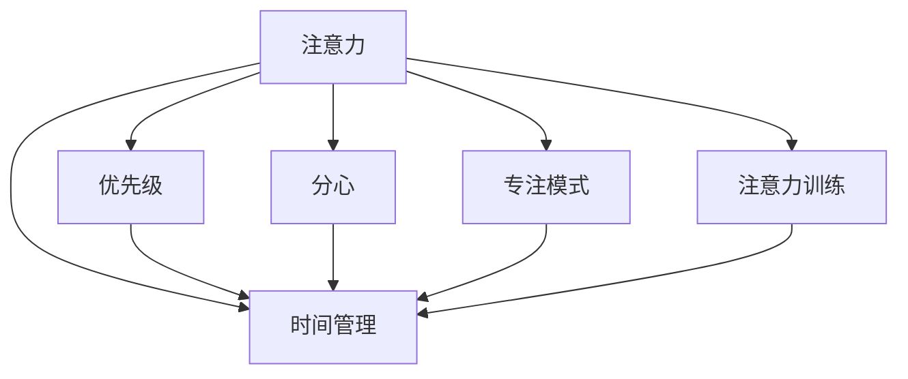

                 

# 信息时代的注意力管理技能：如何在干扰中保持头脑清晰

在当今信息爆炸的时代，我们每天都在面对各种干扰和诱惑，从社交媒体到工作邮件，从新闻推送到家庭琐事，每件事似乎都试图占据我们的注意力，让我们难以专注。为了在这片喧嚣的世界中保持头脑清晰，我们必须掌握信息时代的注意力管理技能。本文将从核心概念、算法原理、具体操作步骤、数学模型等多个角度深入探讨如何在干扰中保持头脑清晰。

## 1. 背景介绍

### 1.1 问题由来
现代社会的信息量巨大，我们每天都在接受海量的信息。这种信息的泛滥不仅让我们的生活更加丰富多彩，同时也给我们带来了诸多挑战。在面对这些信息时，我们常常会被干扰分心，导致工作效率降低，甚至产生焦虑和压力。因此，学会如何管理注意力，在干扰中保持头脑清晰，成为每个信息时代工作者必备的技能。

### 1.2 问题核心关键点
注意力管理技能的核心在于如何在信息泛滥的环境中，主动筛选和分配注意力资源，提升工作和学习的效率。常见的注意力管理技能包括：
- **时间管理**：合理规划时间，避免拖延。
- **任务优先级**：明确优先级，高效处理重要任务。
- **专注模式**：设定专注时间，减少干扰。
- **注意力分散**：识别和规避分散注意力的因素，如社交媒体、手机通知等。

### 1.3 问题研究意义
掌握注意力管理技能，不仅能够提高工作效率和生活质量，还能减少因注意力分散导致的错误和焦虑。特别是在信息时代，有效地管理注意力，有助于我们在高速发展的社会中保持竞争力，实现个人和职业的全面发展。

## 2. 核心概念与联系

### 2.1 核心概念概述

注意力管理技能的核心概念包括：

- **注意力（Attention）**：指集中注意力的能力，能够帮助我们聚焦于当前任务，减少分心。
- **分心（Distraction）**：指导致注意力分散的外部干扰因素，如噪音、社交媒体等。
- **优先级（Priority）**：指根据任务重要性和紧急程度，决定注意力分配的顺序。
- **时间管理（Time Management）**：指通过合理安排时间，提高工作效率。
- **专注模式（Focus Mode）**：指通过设定专注时间，提高任务处理能力。
- **注意力训练（Attention Training）**：指通过特定的训练方法，提升注意力集中和分散控制的能力。

这些概念之间的逻辑关系可以通过以下Mermaid流程图来展示：



这个流程图展示了大语言模型的核心概念及其之间的关系：

1. 注意力是管理技能的基础，帮助我们集中和分散注意力。
2. 分心是注意力的对立面，需要通过注意力管理技能进行规避。
3. 优先级、时间管理和专注模式都是为了更好地管理注意力，提高工作效率。
4. 注意力训练是提升注意力管理技能的重要手段，能够有效减少分心。

## 3. 核心算法原理 & 具体操作步骤

### 3.1 算法原理概述

注意力管理技能的原理在于通过科学的方法，识别和规避干扰，优化注意力分配。其核心思想是：

1. **注意力测量与评估**：通过量化和评估当前注意力水平，确定需要提升或控制的重点。
2. **分心识别与分类**：识别导致分心的主要因素，分类不同的分心源。
3. **优先级排序**：根据任务的重要性和紧急程度，排序需要处理的事项。
4. **时间规划**：合理规划时间，避免时间浪费和拖延。
5. **专注模式设定**：设定专注时间，提高工作效率。
6. **注意力训练**：通过特定的训练方法，提升注意力集中和分散控制的能力。

### 3.2 算法步骤详解

注意力管理技能的具体操作步骤如下：

**Step 1: 注意力测量与评估**

1. 使用注意力测量工具（如RescueTime、Focus@Will等）记录和分析日常工作中的注意力分配情况。
2. 根据记录结果，评估当前注意力的集中度和分散情况。

**Step 2: 分心识别与分类**

1. 识别日常工作中的分心因素，如社交媒体、手机通知等。
2. 分类不同的分心源，如外界干扰、内部心理干扰等。

**Step 3: 优先级排序**

1. 根据任务的重要性和紧急程度，列出需要处理的任务清单。
2. 使用优先级排序方法（如Eisenhower矩阵、ABC分析法等），对任务进行排序。

**Step 4: 时间规划**

1. 根据优先级排序结果，制定每日或每周的时间规划表。
2. 设定专注时间段，避免被干扰打断。

**Step 5: 专注模式设定**

1. 设定专注模式，使用专注应用程序（如Forest、Focus Booster等）帮助自己保持专注。
2. 定期评估专注模式的效果，根据需要进行调整。

**Step 6: 注意力训练**

1. 使用注意力训练工具（如Brain.fm、Headspace等）进行训练。
2. 定期进行注意力测量和评估，记录训练效果，逐步提升注意力管理技能。

### 3.3 算法优缺点

注意力管理技能具有以下优点：

1. **提高效率**：通过科学的时间管理和任务优先级排序，可以有效提升工作效率。
2. **减少干扰**：通过识别和规避分心因素，减少因干扰导致的错误和低效。
3. **增强专注**：通过专注模式和注意力训练，提升长时间集中注意力的能力。

同时，该方法也存在一定的局限性：

1. **依赖工具和应用**：注意力管理技能需要借助工具和应用程序辅助，难以完全摆脱对工具的依赖。
2. **需要自律**：工具和应用程序的作用有限，真正提升效率还需要个人的自律和坚持。
3. **效果因人而异**：不同的分心因素和任务优先级对不同的人可能有不同的影响，需要个性化调整。

尽管存在这些局限性，但注意力管理技能仍是提升工作效率和生活质量的重要方法。

### 3.4 算法应用领域

注意力管理技能的应用领域广泛，涵盖日常工作、学习、生活等多个方面。例如：

- **项目管理**：在项目管理中，通过优先级排序和时间规划，确保重要任务优先处理。
- **教育培训**：在学校教育中，通过注意力训练和专注模式设定，提升学生的学习效率。
- **个人生活**：在日常生活中，通过时间管理和注意力测量，提高生活品质。

## 4. 数学模型和公式 & 详细讲解 & 举例说明

### 4.1 数学模型构建

假设我们有一个任务列表 $T=\{t_i\}_{i=1}^N$，每个任务 $t_i$ 的重要性和紧急程度由 $P_i$ 和 $E_i$ 表示，注意力管理技能的目标是最大化任务完成率 $C$。

定义注意力分配函数 $A(t_i)$，表示在处理任务 $t_i$ 时所投入的注意力比例。假设注意力总和为 $A$，则：

$$
A = \sum_{i=1}^N A(t_i)
$$

任务完成率 $C$ 定义为：

$$
C = \frac{\sum_{i=1}^N P_i A(t_i)}{A}
$$

其中 $P_i$ 为任务 $t_i$ 的重要性权重。

### 4.2 公式推导过程

通过上述定义，我们可以推导出注意力管理技能的目标函数：

$$
\max \frac{\sum_{i=1}^N P_i A(t_i)}{A}
$$

约束条件为：

$$
\sum_{i=1}^N A(t_i) = A
$$

即注意力总和为1。

### 4.3 案例分析与讲解

假设我们有三个任务 $t_1, t_2, t_3$，其中 $t_1$ 和 $t_3$ 的优先级高于 $t_2$，且 $t_1$ 的重要性和紧急程度最高。如果我们的注意力总和为1，则最优的注意力分配策略为 $A(t_1)=0.6, A(t_2)=0.2, A(t_3)=0.2$。

通过这个简单的例子，我们可以看到，注意力管理技能通过优化任务优先级和时间规划，可以显著提升工作效率。

## 5. 项目实践：代码实例和详细解释说明

### 5.1 开发环境搭建

在进行注意力管理技能实践前，我们需要准备好开发环境。以下是使用Python进行PyTorch开发的环境配置流程：

1. 安装Anaconda：从官网下载并安装Anaconda，用于创建独立的Python环境。

2. 创建并激活虚拟环境：
```bash
conda create -n pytorch-env python=3.8 
conda activate pytorch-env
```

3. 安装PyTorch：根据CUDA版本，从官网获取对应的安装命令。例如：
```bash
conda install pytorch torchvision torchaudio cudatoolkit=11.1 -c pytorch -c conda-forge
```

4. 安装各类工具包：
```bash
pip install numpy pandas scikit-learn matplotlib tqdm jupyter notebook ipython
```

完成上述步骤后，即可在`pytorch-env`环境中开始注意力管理技能的实践。

### 5.2 源代码详细实现

下面以使用RescueTime进行注意力测量和评估为例，给出Python代码实现。

```python
import RescueTime
from collections import defaultdict

# 初始化RescueTime分析器
analyzer = RescueTime.DesktopAnalyzer()

# 获取过去一周的注意力数据
attention_data = analyzer.aggregate_duration_data()

# 定义注意力记录字典
attention_records = defaultdict(float)

# 累计注意力数据
for time_range in attention_data:
    for activity in attention_data[time_range]:
        if activity.name == "Focus":
            attention_records[activity.description] += activity.duration

# 计算各活动注意力比例
attention_proportions = {key: value / sum(attention_records.values()) for key, value in attention_records.items()}

# 输出注意力分布结果
for activity, proportion in attention_proportions.items():
    print(f"{activity}: {proportion:.2f}")
```

在这个代码中，我们通过RescueTime工具获取过去一周的注意力数据，并计算各种活动的注意力比例。通过这个简单的例子，可以看到如何使用Python进行注意力测量和评估。

### 5.3 代码解读与分析

让我们再详细解读一下关键代码的实现细节：

**RescueTime库**：
- `DesktopAnalyzer`类：用于初始化RescueTime分析器，记录和分析过去一段时间内的注意力数据。
- `aggregate_duration_data`方法：获取过去一段时间内的注意力数据。
- `duration`属性：记录活动的持续时间。

**注意力记录字典**：
- `defaultdict`：用于记录各种活动的注意力持续时间。

**注意力比例计算**：
- `sum(attention_records.values())`：计算所有活动的总注意力持续时间。
- `key: value / sum(attention_records.values())`：计算各活动的注意力比例。

**输出注意力分布结果**：
- `print(f"{activity}: {proportion:.2f}")`：输出各活动的注意力比例。

可以看到，通过使用RescueTime库，我们可以方便地记录和分析注意力数据，进而评估注意力水平。这些代码和分析工具的结合，使得注意力管理技能的实践变得简单高效。

当然，工业级的系统实现还需考虑更多因素，如数据收集的自动化、分析结果的可视化等。但核心的注意力测量和评估思路基本与此类似。

## 6. 实际应用场景

### 6.1 智能办公系统

基于注意力管理技能的人工智能系统，可以广泛应用于智能办公系统的构建。传统的办公软件往往需要用户手动记录任务和注意力分配，效率低下。而使用注意力管理技能的人工智能系统，可以自动记录和分析用户的工作行为，提供优化建议，帮助用户提高工作效率。

在技术实现上，可以收集用户的工作日志数据，使用注意力测量工具记录和分析日常工作中的注意力分配情况。系统根据分析结果，给出合理的任务优先级和时间规划建议，自动调整工作流程，提高任务完成率。

### 6.2 教育培训

注意力管理技能的教育应用，可以帮助学生更好地掌握学习方法和提高学习效率。传统的教学方式往往忽视了学生的注意力管理，导致学习效果不佳。而使用注意力管理技能，可以针对学生的注意力水平，提供个性化的学习建议。

在实践中，可以开发基于注意力管理技能的学习管理系统，记录和分析学生的学习行为，评估其注意力集中情况。系统根据分析结果，提供注意力训练和专注模式设定，帮助学生提升学习效率。

### 6.3 远程办公

远程办公环境下，注意力管理技能显得尤为重要。由于缺乏面对面交流，远程工作者更容易分心。基于注意力管理技能的远程办公系统，可以提供集中注意力和规避分心的方法，帮助工作者提高远程办公效率。

在技术实现上，可以开发集中注意力和规避分心的应用程序，如集中注意力的番茄工作法应用、规避分心的电话和消息屏蔽功能。系统根据工作者的注意力测量数据，提供优化建议，帮助其提升远程办公效率。

### 6.4 未来应用展望

随着人工智能技术的不断发展，基于注意力管理技能的系统将进一步提升其智能化水平。未来的智能办公系统、教育培训系统和远程办公系统，将通过更深入地理解人类行为和心理，提供更加个性化的优化建议，帮助用户提升效率。

在教育培训方面，未来的系统将能够根据学生的注意力水平和学习习惯，提供更加精准的学习方案，帮助学生更好地掌握知识。

在远程办公方面，未来的系统将能够识别和规避分心因素，提供集中注意力的建议和方法，帮助工作者在远程环境下保持高效。

## 7. 工具和资源推荐

### 7.1 学习资源推荐

为了帮助开发者系统掌握注意力管理技能的理论基础和实践技巧，这里推荐一些优质的学习资源：

1. 《注意力经济学》（Attention Economy）系列博文：由注意力管理技能专家撰写，深入浅出地介绍了注意力经济学原理、注意力测量方法和注意力管理技巧。

2. Coursera《注意力管理技能》课程：耶鲁大学开设的注意力管理技能明星课程，有Lecture视频和配套作业，带你入门注意力管理技能的基本概念和经典模型。

3. 《注意力：心理学与技术的交叉》书籍：详细介绍了注意力心理学原理和注意力管理技术，适用于专业人士和普通学习者。

4. RescueTime官方文档：注意力测量工具的官方文档，提供了海量注意力测量和分析样例代码，是注意力管理技能实践的必备资料。

5. Focus@Will官方文档：专注音乐应用官方文档，提供了如何通过音乐提高专注力的实践指南和科学依据。

通过对这些资源的学习实践，相信你一定能够快速掌握注意力管理技能的精髓，并用于解决实际的注意力分散问题。

### 7.2 开发工具推荐

高效的开发离不开优秀的工具支持。以下是几款用于注意力管理技能开发的常用工具：

1. RescueTime：注意力测量和分析工具，可以记录和分析日常工作中的注意力分配情况。
2. Focus@Will：专注音乐应用，通过特定频率的音乐帮助提高专注力。
3. Brain.fm：注意力训练应用，提供各种不同类型的音乐和声音帮助提高注意力。
4. Focus Booster：专注应用程序，帮助设定专注时间和休息时间，提高工作效率。
5. Pomodoro Timer：番茄工作法应用，通过设定番茄时间（25分钟专注+5分钟休息）帮助提升注意力集中度。

合理利用这些工具，可以显著提升注意力管理技能的开发效率，加快创新迭代的步伐。

### 7.3 相关论文推荐

注意力管理技能的发展源于学界的持续研究。以下是几篇奠基性的相关论文，推荐阅读：

1. 《注意力经济学：从心理学到技术的融合》：提出了注意力经济学的概念，探讨了注意力在商业和生活中的作用。
2. 《提高注意力：注意力管理技巧与心理学》：详细介绍了注意力管理的心理学原理和实践方法。
3. 《注意力训练与神经可塑性》：讨论了注意力训练对神经可塑性的影响，提供了科学依据。
4. 《番茄工作法：提高工作效率的科学方法》：介绍了一种基于时间管理的工作方法，通过设定专注时间提升工作效率。
5. 《注意力测量与评估的最新进展》：综述了注意力测量和评估的最新技术进展，提供了应用案例和实验结果。

这些论文代表了大语言模型微调技术的发展脉络。通过学习这些前沿成果，可以帮助研究者把握学科前进方向，激发更多的创新灵感。

## 8. 总结：未来发展趋势与挑战

### 8.1 总结

本文对基于注意力管理技能的系统进行了全面系统的介绍。首先阐述了注意力管理技能的研究背景和意义，明确了注意力管理技能在提升工作效率和生活质量方面的独特价值。其次，从原理到实践，详细讲解了注意力管理技能的数学模型和操作步骤，给出了注意力管理技能的完整代码实现。同时，本文还广泛探讨了注意力管理技能在智能办公、教育培训、远程办公等多个行业领域的应用前景，展示了注意力管理技能的巨大潜力。此外，本文精选了注意力管理技能的学习资源，力求为读者提供全方位的技术指引。

通过本文的系统梳理，可以看到，注意力管理技能在信息时代具有广阔的应用前景。这些方向的探索发展，必将进一步提升工作和学习效率，改善生活质量，为社会带来深远影响。

### 8.2 未来发展趋势

展望未来，注意力管理技能将呈现以下几个发展趋势：

1. **智能系统普及**：随着人工智能技术的不断发展，基于注意力管理技能的智能系统将更加普及，帮助用户提高工作效率和生活质量。
2. **个性化优化**：未来的系统将能够根据用户的行为和心理特征，提供更加个性化的优化建议，帮助用户更好地管理注意力。
3. **多模态融合**：未来的系统将能够融合视觉、听觉、触觉等多模态信息，提供更加全面的注意力管理方案。
4. **实时反馈**：未来的系统将能够实时监测和反馈用户的工作状态，提供及时的优化建议，帮助用户保持高效。
5. **伦理与安全**：随着注意力管理技能的应用范围扩大，如何在保护用户隐私和数据安全的前提下，提升系统效果，将是一大挑战。

以上趋势凸显了注意力管理技能的发展方向。这些方向的探索发展，必将进一步提升注意力管理技能的智能化水平，为人类认知智能的进化带来深远影响。

### 8.3 面临的挑战

尽管注意力管理技能已经取得了瞩目成就，但在迈向更加智能化、普适化应用的过程中，它仍面临诸多挑战：

1. **隐私保护**：注意力测量和分析需要获取用户的详细行为数据，如何在保护用户隐私的前提下，提供准确的信息，是一大难题。
2. **用户接受度**：注意力管理技能需要用户主动配合和支持，如何提高用户接受度和使用频率，需要更多技术和心理上的探索。
3. **普适性**：不同用户的工作和生活习惯各不相同，如何设计通用的注意力管理方案，适用于不同背景和需求的用户，是一大挑战。
4. **效率与效果**：如何通过注意力管理技能，在提升效率的同时，保证系统的准确性和可靠性，是一个复杂的平衡问题。
5. **跨平台兼容性**：注意力管理技能的系统需要在不同平台和设备上运行，如何保证跨平台兼容性，提供一致的用户体验，需要更多技术支持。

这些挑战需要未来在技术、伦理、用户行为等多个方面进行深入研究，才能推动注意力管理技能的发展。

### 8.4 研究展望

面向未来，注意力管理技能的研究需要在以下几个方面寻求新的突破：

1. **隐私保护技术**：开发更加高效和安全的隐私保护技术，确保用户行为数据的安全和匿名性。
2. **个性化优化算法**：探索基于用户行为和心理特征的个性化优化算法，提升系统的普适性和效果。
3. **多模态融合方法**：研究融合视觉、听觉、触觉等多模态信息的注意力管理方法，提升系统的综合感知能力。
4. **实时反馈机制**：开发实时监测和反馈机制，提供及时的优化建议，帮助用户保持高效。
5. **伦理与安全约束**：引入伦理与安全约束机制，确保系统的透明性、可解释性和安全性。

这些研究方向的探索，必将引领注意力管理技能的发展，为构建安全、可靠、可解释、可控的智能系统铺平道路。面向未来，注意力管理技能还需要与其他人工智能技术进行更深入的融合，如知识表示、因果推理、强化学习等，多路径协同发力，共同推动自然语言理解和智能交互系统的进步。只有勇于创新、敢于突破，才能不断拓展注意力管理技能的边界，让智能技术更好地造福人类社会。

## 9. 附录：常见问题与解答

**Q1：注意力管理技能是否适用于所有用户？**

A: 注意力管理技能对大部分用户都有提升效果，但每个人的注意力水平和工作习惯各不相同，需要根据实际情况进行个性化调整。对于特殊用户，如注意力障碍患者，可能需要额外的心理和医疗支持。

**Q2：注意力管理技能如何与其他技术结合？**

A: 注意力管理技能可以与时间管理、任务管理、项目管理等多种技术结合，提供更加全面的优化方案。例如，将注意力管理技能与Pomodoro时间管理法结合，可以提高工作和学习效率。

**Q3：注意力管理技能是否需要持续调整？**

A: 注意力管理技能需要根据用户的变化和任务的变化进行持续调整。用户的工作习惯和任务优先级都在不断变化，因此需要定期评估和优化注意力管理策略。

**Q4：注意力管理技能是否需要专业指导？**

A: 对于部分用户，特别是注意力障碍患者或需要高度专业化的用户，可能需要专业的注意力管理指导。专业的心理咨询和治疗可以帮助用户更好地掌握注意力管理技能。

**Q5：注意力管理技能是否适用于远程工作？**

A: 注意力管理技能特别适合远程工作环境，可以帮助用户克服远程办公中的分心问题，提高远程工作效率。通过智能办公系统，远程工作者可以更方便地记录和分析自己的注意力分布，提供优化建议。

**Q6：注意力管理技能是否适用于教育培训？**

A: 注意力管理技能在教育培训中具有广泛应用前景，可以帮助学生更好地掌握学习方法和提高学习效率。通过教育管理系统，可以记录和分析学生的注意力集中情况，提供个性化的学习建议。

---

作者：禅与计算机程序设计艺术 / Zen and the Art of Computer Programming

