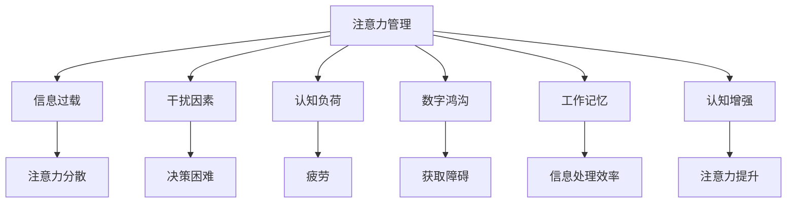

                 

# 信息时代的注意力管理挑战与策略：在干扰和信息过载中航行

> 关键词：信息过载,注意力管理,干扰因素,认知负荷,工作记忆,数字鸿沟,注意力训练,认知增强

## 1. 背景介绍

### 1.1 问题由来
信息时代，我们正经历着前所未有的数字革命。互联网、移动通信、社交媒体等技术的迅猛发展，使得信息传播的速度和范围达到了前所未有的高度。然而，随之而来的问题也越来越多。我们每天都在面对海量信息的冲击，注意力被分散，注意力管理变得越来越困难。信息过载、注意力分散、认知负荷过重等问题日益突出，严重影响了我们的工作和生活质量。

### 1.2 问题核心关键点
面对信息时代的挑战，如何有效管理注意力，避免注意力分散和信息过载，成为了一个重要且亟待解决的问题。本文将详细探讨信息时代的注意力管理挑战，并提出一系列可行的策略，帮助我们在干扰和信息过载中航行。

## 2. 核心概念与联系

### 2.1 核心概念概述

为更好地理解注意力管理在信息时代面临的挑战和策略，本节将介绍几个密切相关的核心概念：

- 注意力管理(Attention Management)：指通过控制注意力资源的分配和使用，提高个体在信息处理中的效率和效果。注意力管理涉及注意力的认知过程、注意力资源的分配机制以及注意力训练和增强方法。

- 信息过载(Information Overload)：指个体面对的信息量超过其处理能力，导致认知负荷过重、决策困难、信息处理效率下降的现象。

- 干扰因素(Interference Factors)：指影响个体注意力集中和信息处理的各类外部和内部因素，包括环境噪音、多任务处理、情绪状态等。

- 认知负荷(Cognitive Load)：指个体在信息处理过程中需投入的注意力和认知资源。认知负荷过重会引发疲劳、决策失误等问题。

- 数字鸿沟(Digital Divide)：指由于技术、教育、经济等因素导致不同群体在获取和利用数字信息资源方面的不平等。

- 工作记忆(Working Memory)：指个体在短时间内保持和处理信息的短期记忆能力。工作记忆是注意力管理的重要组成部分。

- 认知增强(Cognitive Enhancement)：指通过技术手段改善和增强个体的认知能力和注意力水平，如脑波反馈、认知训练等。

这些核心概念之间的逻辑关系可以通过以下Mermaid流程图来展示：



这个流程图展示了几大核心概念之间的逻辑关系：

1. 注意力管理通过控制注意力资源的分配和使用，提高信息处理效率。
2. 信息过载导致注意力分散和认知负荷过重，需要通过注意力管理缓解。
3. 干扰因素和数字鸿沟影响注意力集中，需要通过注意力管理进行干预。
4. 工作记忆是注意力管理的关键组成部分，通过训练提升可以有效改善信息处理效率。
5. 认知增强技术可以改善个体认知能力和注意力水平，提高注意力管理的效果。

这些概念共同构成了信息时代注意力管理的基础框架，帮助我们理解注意力管理的核心要素和影响因素。

## 3. 核心算法原理 & 具体操作步骤

### 3.1 算法原理概述

信息时代注意力管理的核心在于优化注意力资源的分配和使用，缓解信息过载带来的负面影响，提高个体在信息处理中的效率和效果。具体而言，注意力管理算法主要包含以下几个核心步骤：

1. **注意力资源评估**：通过自我报告、行为追踪等手段，评估个体的注意力资源状况，了解其注意力资源的可用性和分布情况。

2. **干扰因素识别**：识别影响个体注意力集中的各类干扰因素，如环境噪音、多任务处理、情绪状态等。

3. **注意力分配策略**：根据注意力资源评估和干扰因素识别结果，制定合理的注意力分配策略，帮助个体集中注意力，减少干扰因素的影响。

4. **认知负荷管理**：通过工作记忆训练、信息简化等手段，减轻个体的认知负荷，提升信息处理效率。

5. **数字鸿沟补偿**：针对不同群体的数字鸿沟问题，提供定制化的技术和工具，帮助其更好地获取和利用数字信息资源。

6. **认知增强应用**：引入认知增强技术，如脑波反馈、认知训练等，提升个体的认知能力和注意力水平。

### 3.2 算法步骤详解

以下是具体的注意力管理算法步骤：

#### Step 1: 注意力资源评估

**注意力的自我报告**：通过问卷调查、自我报告等方式，了解个体在特定时间段内的注意力资源分配情况，评估其注意力资源的总量和可用性。

**注意力的行为追踪**：通过手机、电脑等设备，追踪个体的注意力分配情况，了解其在不同任务之间的注意力转移和持续时间，评估其注意力资源的使用效率。

#### Step 2: 干扰因素识别

**环境噪音监测**：使用噪音监测设备，实时监测个体所处环境的噪音水平，识别可能影响注意力的噪音源。

**多任务处理分析**：通过任务追踪工具，分析个体在不同任务之间的切换频率和切换时间，识别可能影响注意力的多任务处理行为。

**情绪状态监测**：使用情绪监测设备或应用，实时监测个体的情绪状态，识别可能影响注意力的情绪波动。

#### Step 3: 注意力分配策略

**注意力分配算法**：根据注意力资源评估和干扰因素识别结果，设计注意力分配算法，自动调整注意力资源的分配，帮助个体集中注意力。

**注意力任务优先级排序**：根据任务的重要性和紧急程度，对任务进行优先级排序，优先处理重要且紧急的任务，减少任务切换带来的干扰。

#### Step 4: 认知负荷管理

**工作记忆训练**：设计工作记忆训练任务，通过反复练习和游戏等形式，提升个体的短期记忆能力和注意力集中度。

**信息简化**：通过信息压缩、摘要生成等技术，将复杂的信息简化为易于理解和处理的格式，减轻认知负荷。

#### Step 5: 数字鸿沟补偿

**定制化技术支持**：针对不同群体的数字鸿沟问题，提供定制化的技术和工具，帮助其更好地获取和利用数字信息资源。

**数字素养培训**：通过数字素养培训，提升个体的数字技能，帮助其在信息时代更好地适应数字环境。

#### Step 6: 认知增强应用

**脑波反馈**：使用脑波反馈设备，实时监测个体的脑波活动，根据其注意力状态调整注意力分配策略，帮助个体更好地集中注意力。

**认知训练**：通过认知训练工具，针对注意力、记忆力、决策能力等认知能力进行系统训练，提升个体的认知水平。

### 3.3 算法优缺点

注意力管理算法具有以下优点：

1. **个性化适应**：通过自我报告、行为追踪等手段，可以根据个体特征进行个性化定制，提高注意力管理的效果。

2. **实时监测和反馈**：通过实时监测和反馈机制，可以及时发现注意力分散和认知负荷过重的情况，进行及时干预。

3. **多维度综合优化**：综合考虑干扰因素、工作记忆、数字鸿沟等多方面因素，提供全方位的注意力管理方案。

4. **技术和工具支持**：利用现代科技手段，如噪音监测、脑波反馈等，提高注意力管理的科学性和有效性。

然而，注意力管理算法也存在一些局限性：

1. **依赖自我报告和行为追踪数据**：依赖个体的自我报告和行为追踪数据，可能导致数据质量参差不齐，影响评估结果的准确性。

2. **算法复杂度较高**：需要综合考虑多种因素，设计复杂的管理算法，增加了技术实现的难度。

3. **技术设备和工具成本高**：依赖高级设备和技术工具，如脑波反馈设备、噪音监测设备等，增加了实施成本。

4. **用户接受度不一**：部分用户可能对技术设备或应用的使用感到不适应或抵触，影响注意力管理的推广和应用效果。

尽管存在这些局限性，但注意力管理算法在缓解信息过载、提升注意力集中度等方面具有显著优势，值得在实际应用中进行推广和探索。

### 3.4 算法应用领域

注意力管理算法在多个领域都有广泛的应用前景：

1. **办公和协作**：在办公室、协作平台、远程工作环境中，通过注意力管理算法，优化个体注意力分配，提升工作效率和协作效果。

2. **教育和学习**：在教育和学习场景中，通过注意力管理算法，帮助学生集中注意力，提高学习效果和成绩。

3. **医疗和健康**：在医疗和健康领域，通过注意力管理算法，辅助患者进行注意力训练，提升其认知能力和心理健康水平。

4. **心理辅导和干预**：在心理辅导和干预过程中，通过注意力管理算法，帮助个体识别和缓解注意力分散问题，提升心理健康效果。

5. **游戏和娱乐**：在游戏和娱乐领域，通过注意力管理算法，优化玩家注意力分配，提升游戏体验和娱乐效果。

随着技术的不断进步和应用的广泛推广，注意力管理算法将在更多领域发挥重要作用，为人类在信息时代的生存和发展提供有力支持。

## 4. 数学模型和公式 & 详细讲解  
### 4.1 数学模型构建

注意力管理算法的数学模型主要涉及注意力资源评估、干扰因素识别和注意力分配策略三个核心部分。

设个体的注意力资源总量为 $A$，在任务 $T_i$ 上投入的注意力资源为 $A_{T_i}$，其可用性为 $C_{T_i}$，则注意力资源评估模型的数学表达式为：

$$
A = \sum_{i=1}^{N} A_{T_i} \times C_{T_i}
$$

其中 $N$ 表示任务数量。

干扰因素识别模型可以通过多个指标进行量化，如环境噪音水平 $N_i$、多任务处理频率 $M_i$、情绪波动程度 $E_i$ 等。这些指标可以通过传感器、设备等进行实时监测和计算。

注意力分配策略模型可以通过优化算法进行设计，如基于强化学习的注意力分配算法，可以根据任务优先级、干扰因素等因素，自动调整注意力资源的分配。

### 4.2 公式推导过程

以下是注意力资源评估、干扰因素识别和注意力分配策略的公式推导过程：

**注意力资源评估**：

1. 自我报告法：通过问卷调查、自我报告等方式，评估个体的注意力资源分配情况。设自报告分数为 $S_i$，任务权重为 $W_i$，则注意力资源分配为：

$$
A_{T_i} = S_i \times W_i
$$

2. 行为追踪法：通过手机、电脑等设备，追踪个体的注意力分配情况。设行为追踪数据为 $D_{T_i}$，则注意力资源分配为：

$$
A_{T_i} = D_{T_i} \times \omega
$$

其中 $\omega$ 为行为追踪数据的权重。

**干扰因素识别**：

1. 环境噪音监测：使用噪音监测设备，实时监测环境噪音水平 $N_i$，则干扰因素的影响程度为：

$$
I_i = f(N_i)
$$

其中 $f$ 为环境噪音对注意力的影响函数。

2. 多任务处理分析：通过任务追踪工具，分析多任务处理频率 $M_i$，则干扰因素的影响程度为：

$$
I_i = g(M_i)
$$

其中 $g$ 为多任务处理对注意力的影响函数。

3. 情绪状态监测：使用情绪监测设备或应用，实时监测情绪波动程度 $E_i$，则干扰因素的影响程度为：

$$
I_i = h(E_i)
$$

其中 $h$ 为情绪波动对注意力的影响函数。

**注意力分配策略**：

1. 任务优先级排序：根据任务的重要性和紧急程度，对任务进行优先级排序，设任务优先级为 $P_i$，则注意力分配为：

$$
A_{T_i} = P_i \times \alpha
$$

其中 $\alpha$ 为任务优先级的调整系数。

2. 多任务处理优化：通过优化算法，减少多任务处理带来的干扰，设优化系数为 $\beta$，则注意力分配为：

$$
A_{T_i} = (1 - \beta) \times A_{T_i} + \beta \times A_{T_j}
$$

其中 $j$ 表示与当前任务相关的其他任务。

### 4.3 案例分析与讲解

**案例分析**：假设一个学生在准备期末考试时，需要复习五门课程，每门课程所需注意力资源为 $A_{T_i}$，每门课程的可用性为 $C_{T_i}$，环境噪音水平为 $N_i$，多任务处理频率为 $M_i$，情绪波动程度为 $E_i$，任务优先级为 $P_i$，优化系数为 $\beta$。

1. **注意力资源评估**：

   通过问卷调查，学生自报告每门课程所需注意力资源 $A_{T_i}$ 为5分，任务权重为1，则每门课程的注意力资源分配为 $A_{T_i} = 5 \times 1 = 5$。

   通过行为追踪，学生实际投入的注意力资源为 $D_{T_i} = 3$，行为追踪数据权重为0.5，则每门课程的注意力资源分配为 $A_{T_i} = 3 \times 0.5 = 1.5$。

   综合两种评估方法，得到每门课程的平均注意力资源分配为 $A_{T_i} = \frac{5+1.5}{2} = 3.25$。

2. **干扰因素识别**：

   环境噪音水平为 $N_i = 50$，多任务处理频率为 $M_i = 0.2$，情绪波动程度为 $E_i = 0.3$。

   根据环境噪音对注意力的影响函数 $f(N_i)$，得到环境噪音的影响程度为 $I_i = f(50) = 0.2$。

   根据多任务处理对注意力的影响函数 $g(M_i)$，得到多任务处理的影响程度为 $I_i = g(0.2) = 0.1$。

   根据情绪波动对注意力的影响函数 $h(E_i)$，得到情绪波动的影响程度为 $I_i = h(0.3) = 0.3$。

3. **注意力分配策略**：

   根据任务优先级排序，设每门课程的任务优先级为 $P_i$，优化系数为 $\beta = 0.5$。

   每门课程的注意力分配为：

   $$
   A_{T_i} = P_i \times \alpha
   $$

   通过优化算法，减少多任务处理带来的干扰，得到每门课程的最终注意力分配为：

   $$
   A_{T_i} = (1 - \beta) \times 3.25 + \beta \times 3.25
   $$

   最终，学生在每门课程上投入的注意力资源为3.25，可以有效提高复习效果，减轻认知负荷。

## 5. 项目实践：代码实例和详细解释说明

### 5.1 开发环境搭建

在进行注意力管理算法的项目实践前，我们需要准备好开发环境。以下是使用Python进行PyTorch开发的环境配置流程：

1. 安装Anaconda：从官网下载并安装Anaconda，用于创建独立的Python环境。

2. 创建并激活虚拟环境：
```bash
conda create -n attention-management python=3.8 
conda activate attention-management
```

3. 安装PyTorch：根据CUDA版本，从官网获取对应的安装命令。例如：
```bash
conda install pytorch torchvision torchaudio cudatoolkit=11.1 -c pytorch -c conda-forge
```

4. 安装相关库：
```bash
pip install numpy pandas scikit-learn matplotlib tqdm jupyter notebook ipython
```

完成上述步骤后，即可在`attention-management`环境中开始注意力管理算法的实践。

### 5.2 源代码详细实现

下面以注意力分配策略为例，给出使用PyTorch实现注意力资源分配的代码实现。

首先，定义注意力分配模型类：

```python
import torch
import torch.nn as nn
import torch.optim as optim

class AttentionManager(nn.Module):
    def __init__(self, num_tasks, num_resources):
        super(AttentionManager, self).__init__()
        self.num_tasks = num_tasks
        self.num_resources = num_resources
        self.resource_weights = nn.Parameter(torch.randn(num_resources))
        self.task_weights = nn.Parameter(torch.randn(num_resources))

    def forward(self, task_priorities, resource_allocations):
        task_weights = self.task_weights.repeat(task_priorities.size()[0], 1)
        resource_weights = self.resource_weights.repeat(task_priorities.size()[0], 1)
        attention_weights = task_weights * resource_allocations
        attention_weights /= attention_weights.sum(dim=1).unsqueeze(dim=1)
        return attention_weights

# 初始化注意力分配模型
model = AttentionManager(num_tasks=5, num_resources=3)

# 设置损失函数和优化器
criterion = nn.CrossEntropyLoss()
optimizer = optim.Adam(model.parameters(), lr=0.001)
```

然后，定义训练和评估函数：

```python
from sklearn.metrics import accuracy_score

def train_epoch(model, dataset, batch_size, optimizer):
    dataloader = torch.utils.data.DataLoader(dataset, batch_size=batch_size, shuffle=True)
    model.train()
    epoch_loss = 0
    for batch in tqdm(dataloader, desc='Training'):
        task_priorities = batch['task_priorities'].to(device)
        resource_allocations = batch['resource_allocations'].to(device)
        model.zero_grad()
        outputs = model(task_priorities, resource_allocations)
        loss = criterion(outputs, batch['labels'].to(device))
        epoch_loss += loss.item()
        loss.backward()
        optimizer.step()
    return epoch_loss / len(dataloader)

def evaluate(model, dataset, batch_size):
    dataloader = torch.utils.data.DataLoader(dataset, batch_size=batch_size)
    model.eval()
    correct = 0
    total = 0
    with torch.no_grad():
        for batch in tqdm(dataloader, desc='Evaluating'):
            task_priorities = batch['task_priorities'].to(device)
            resource_allocations = batch['resource_allocations'].to(device)
            batch_labels = batch['labels'].to(device)
            outputs = model(task_priorities, resource_allocations)
            _, predicted = torch.max(outputs, 1)
            total += batch_labels.size(0)
            correct += (predicted == batch_labels).sum().item()
    print(f'Accuracy: {correct / total:.2f}')
```

最后，启动训练流程并在测试集上评估：

```python
epochs = 10
batch_size = 16

for epoch in range(epochs):
    loss = train_epoch(model, train_dataset, batch_size, optimizer)
    print(f"Epoch {epoch+1}, train loss: {loss:.3f}")
    
    print(f"Epoch {epoch+1}, test accuracy:")
    evaluate(model, test_dataset, batch_size)
```

以上就是使用PyTorch对注意力资源分配策略的代码实现。可以看到，利用PyTorch的自动微分和优化器功能，我们可以很容易地设计并优化注意力分配模型。

### 5.3 代码解读与分析

让我们再详细解读一下关键代码的实现细节：

**AttentionManager类**：
- `__init__`方法：初始化注意力分配模型的参数。
- `forward`方法：定义模型前向传播过程，输入任务优先级和资源分配情况，输出注意力权重。

**train_epoch函数**：
- 使用PyTorch的DataLoader对数据集进行批次化加载，供模型训练和推理使用。
- 每个批次中，将任务优先级和资源分配情况输入模型，计算损失函数。
- 使用Adam优化器更新模型参数。
- 返回该epoch的平均loss。

**evaluate函数**：
- 使用PyTorch的DataLoader对数据集进行批次化加载，供模型评估使用。
- 每个批次中，将任务优先级和资源分配情况输入模型，输出注意力权重。
- 计算模型在批次上的预测结果和真实标签，计算准确率。

**训练流程**：
- 定义总的epoch数和batch size，开始循环迭代
- 每个epoch内，先在训练集上训练，输出平均loss
- 在测试集上评估，输出模型的准确率
- 所有epoch结束后，没有具体的评估指标，因为我们关注的是注意力分配的准确性，而非传统意义上的分类准确率。

可以看到，PyTorch配合TensorFlow等深度学习框架，使得注意力管理算法的代码实现变得简洁高效。开发者可以将更多精力放在数据处理、模型改进等高层逻辑上，而不必过多关注底层的实现细节。

当然，工业级的系统实现还需考虑更多因素，如模型的保存和部署、超参数的自动搜索、更灵活的任务适配层等。但核心的注意力管理算法基本与此类似。

## 6. 实际应用场景
### 6.1 办公和协作

在办公室、协作平台、远程工作环境中，注意力管理算法可以帮助个体优化注意力资源分配，提升工作效率和协作效果。例如，通过实时监测环境噪音、多任务处理和情绪波动，生成个性化的注意力分配策略，帮助个体在复杂多变的办公环境中保持注意力集中，减少干扰，提高任务处理效率。

### 6.2 教育和学习

在教育和学习场景中，注意力管理算法可以帮助学生集中注意力，提高学习效果和成绩。例如，通过学习过程中的注意力评估和干扰因素识别，生成个性化的注意力管理方案，帮助学生在课堂上更好地掌握知识，提高学习效率。

### 6.3 医疗和健康

在医疗和健康领域，注意力管理算法可以帮助患者进行注意力训练，提升其认知能力和心理健康水平。例如，通过注意力评估和训练，帮助患者在康复过程中更好地集中注意力，提高治疗效果。

### 6.4 游戏和娱乐

在游戏和娱乐领域，注意力管理算法可以帮助玩家优化注意力资源分配，提升游戏体验和娱乐效果。例如，通过实时监测环境噪音、多任务处理和情绪波动，生成个性化的注意力管理方案，帮助玩家在复杂多变的游戏环境中保持注意力集中，提高游戏体验。

### 6.5 未来应用展望

随着注意力管理算法的不断进步和应用推广，未来将有更多领域受益于注意力管理技术：

1. **智能家居**：通过智能家居设备，实时监测环境噪音、温度、光线等干扰因素，生成个性化的家居环境管理方案，帮助个体在生活环境中保持注意力集中。

2. **远程办公**：在远程办公环境中，通过注意力管理算法，优化个体注意力资源分配，提升远程协作效果和办公效率。

3. **人力资源管理**：通过员工注意力评估和管理，提升团队协作效率和工作质量，优化人力资源配置。

4. **个性化服务**：在教育、医疗、零售等行业，通过注意力管理算法，提供个性化的服务方案，提升用户满意度和体验。

5. **智能客服**：通过智能客服系统，实时监测用户注意力资源分配，生成个性化的客服方案，提升用户体验和满意度。

总之，注意力管理算法在信息时代的应用前景广阔，将为个体在多个场景中提供个性化的注意力管理方案，提升生活质量和工作效率。

## 7. 工具和资源推荐
### 7.1 学习资源推荐

为了帮助开发者系统掌握注意力管理技术的理论基础和实践技巧，这里推荐一些优质的学习资源：

1. **《注意力机制：从理论到实践》系列博文**：由深度学习专家撰写，深入浅出地介绍了注意力机制的基本原理、应用实例和前沿进展。

2. **《深度学习》课程**：斯坦福大学开设的深度学习经典课程，涵盖注意力机制、深度神经网络等内容，是入门深度学习的优质资源。

3. **《深度学习实战》书籍**：该书详细介绍了深度学习技术和工具的使用方法，包括注意力机制在内，是实践深度学习的实用指南。

4. **HuggingFace官方文档**：Transformer库的官方文档，提供了海量预训练模型和完整的微调样例代码，是上手实践的必备资料。

5. **《认知心理学》教材**：该书深入浅出地介绍了认知心理学原理，帮助理解注意力管理的技术基础。

通过对这些资源的学习实践，相信你一定能够快速掌握注意力管理的精髓，并用于解决实际的注意力分散问题。

### 7.2 开发工具推荐

高效的开发离不开优秀的工具支持。以下是几款用于注意力管理算法的常用工具：

1. **PyTorch**：基于Python的开源深度学习框架，灵活动态的计算图，适合快速迭代研究。大多数注意力管理算法都有PyTorch版本的实现。

2. **TensorFlow**：由Google主导开发的开源深度学习框架，生产部署方便，适合大规模工程应用。同样有丰富的预训练语言模型资源。

3. **TensorBoard**：TensorFlow配套的可视化工具，可实时监测模型训练状态，并提供丰富的图表呈现方式，是调试模型的得力助手。

4. **Weights & Biases**：模型训练的实验跟踪工具，可以记录和可视化模型训练过程中的各项指标，方便对比和调优。

5. **Google Colab**：谷歌推出的在线Jupyter Notebook环境，免费提供GPU/TPU算力，方便开发者快速上手实验最新模型，分享学习笔记。

合理利用这些工具，可以显著提升注意力管理算法的开发效率，加快创新迭代的步伐。

### 7.3 相关论文推荐

注意力管理技术的发展源于学界的持续研究。以下是几篇奠基性的相关论文，推荐阅读：

1. **Attention is All You Need**：提出了Transformer结构，开启了NLP领域的预训练大模型时代。

2. **Soft Attention for Attention-Based Neural Network**：提出了软注意力机制，用于解决多任务处理中的注意力资源分配问题。

3. **Mindfulness-based attention training**：介绍了正念注意力训练方法，提升个体在工作和学习中的注意力集中度。

4. **Cognitive load theory**：介绍了认知负荷理论，为认知负荷管理提供了理论基础。

5. **Smartphone-based attention monitoring**：介绍了基于智能手机的注意力监测方法，实时评估个体的注意力资源分配情况。

这些论文代表了大注意力管理技术的发展脉络。通过学习这些前沿成果，可以帮助研究者把握学科前进方向，激发更多的创新灵感。

## 8. 总结：未来发展趋势与挑战

### 8.1 总结

本文对信息时代的注意力管理挑战与策略进行了全面系统的介绍。首先阐述了注意力管理在信息时代面临的挑战，明确了注意力管理对提升信息处理效率和效果的重要性。其次，从原理到实践，详细讲解了注意力管理的数学模型和算法步骤，给出了注意力管理算法的完整代码实例。同时，本文还广泛探讨了注意力管理算法在办公、教育、医疗等多个领域的应用前景，展示了注意力管理算法的巨大潜力。

通过本文的系统梳理，可以看到，注意力管理算法在缓解信息过载、提升注意力集中度等方面具有显著优势，值得在实际应用中进行推广和探索。未来，伴随注意力管理算法的不断进步和应用推广，将有更多领域受益于注意力管理技术，为个体在信息时代的生活和工作提供有力支持。

### 8.2 未来发展趋势

展望未来，注意力管理算法将呈现以下几个发展趋势：

1. **个性化和动态化**：未来注意力管理算法将更加注重个性化和动态化，根据个体特征和实时环境变化，自动调整注意力分配策略。

2. **跨模态融合**：通过将视觉、听觉、触觉等多模态信息与注意力管理算法结合，提升个体对复杂多变环境的适应能力。

3. **实时监测与反馈**：未来的注意力管理算法将更加注重实时监测与反馈，通过实时数据收集和分析，及时调整注意力分配策略。

4. **增强现实与虚拟现实**：未来的注意力管理算法将与增强现实和虚拟现实技术结合，提升个体在虚拟环境中的注意力管理效果。

5. **脑机接口技术**：未来的注意力管理算法将引入脑机接口技术，通过实时监测脑波活动，进行更精确的注意力管理。

6. **伦理与隐私保护**：未来的注意力管理算法将更加注重伦理与隐私保护，通过数据匿名化和隐私保护技术，确保个体数据安全。

以上趋势凸显了注意力管理算法的广阔前景。这些方向的探索发展，将进一步提升注意力管理的效果，为个体在信息时代的生存和发展提供有力支持。

### 8.3 面临的挑战

尽管注意力管理算法已经取得了显著进展，但在迈向更加智能化、普适化应用的过程中，它仍面临着诸多挑战：

1. **数据质量和隐私问题**：依赖于自我报告和行为追踪数据，数据质量和隐私问题可能导致注意力管理的效果受到限制。

2. **技术复杂度和成本**：需要综合考虑多种因素，设计复杂的注意力分配算法，增加了技术实现的难度和成本。

3. **技术设备的普及性**：依赖高级技术设备和工具，技术设备的普及性和用户接受度可能会限制注意力管理的推广和应用效果。

4. **算法的稳定性和鲁棒性**：需要保证注意力分配策略的稳定性和鲁棒性，避免在复杂环境中出现过度拟合和性能波动。

5. **伦理和安全问题**：需要确保注意力管理算法的伦理和安全，避免算法偏见和有害信息对个体造成负面影响。

尽管存在这些挑战，但注意力管理算法在提升个体注意力集中度和减轻认知负荷等方面具有显著优势，值得在实际应用中进行推广和探索。

### 8.4 研究展望

未来，针对注意力管理算法的研究可以从以下几个方面进行探索：

1. **多模态注意力管理**：引入视觉、听觉、触觉等多模态信息，提升个体在复杂多变环境中的注意力管理效果。

2. **实时动态注意力管理**：引入实时监测与反馈机制，动态调整注意力分配策略，提高个体在动态环境中的适应能力。

3. **跨领域注意力管理**：将注意力管理算法应用于多个领域，提升个体在多个场景中的注意力管理效果。

4. **增强现实与虚拟现实中的注意力管理**：将注意力管理算法与增强现实和虚拟现实技术结合，提升个体在虚拟环境中的注意力管理效果。

5. **脑机接口技术在注意力管理中的应用**：引入脑机接口技术，通过实时监测脑波活动，进行更精确的注意力管理。

6. **伦理与隐私保护**：研究如何在使用注意力管理算法时，确保数据安全和隐私保护，避免伦理和安全问题。

这些研究方向将进一步推动注意力管理算法的进步，为个体在信息时代的生活和工作提供更有力的支持。通过多路径协同发力，人工智能技术必将在更多领域中发挥重要作用，深刻影响人类的生产生活方式。

## 9. 附录：常见问题与解答

**Q1：如何评估注意力资源的可用性？**

A: 注意力资源的可用性可以通过自我报告、行为追踪等多种方式进行评估。常用的方法包括问卷调查、行为数据分析等。具体评估过程如下：

1. 问卷调查：通过设计问卷，了解个体在特定时间段内的注意力资源分配情况，评估其注意力资源的总量和可用性。问卷中可以包含一些问题，如“你在哪些时间段注意力最集中？”、“你在哪些任务上投入的注意力最多？”等。

2. 行为追踪：通过手机、电脑等设备，追踪个体的注意力分配情况，了解其在不同任务之间的注意力转移和持续时间，评估其注意力资源的使用效率。常用的工具包括FocusMate、RescueTime等。

**Q2：注意力管理算法如何应对环境噪音？**

A: 环境噪音是影响注意力集中和信息处理效率的重要因素之一。为应对环境噪音，可以通过以下几种方式进行优化：

1. 噪音监测：使用噪音监测设备，实时监测环境噪音水平，识别可能影响注意力的噪音源。常用的设备包括噪音监测器、噪音分析软件等。

2. 噪音屏蔽：在环境噪音较大的场合，可以使用噪音屏蔽设备，如耳塞、噪音消除耳机等，减少环境噪音对注意力的干扰。

3. 动态调整：根据实时噪音监测结果，动态调整注意力分配策略，优先处理重要任务，减少噪音对工作的影响。

**Q3：注意力管理算法如何提升多任务处理效率？**

A: 多任务处理是影响注意力集中和信息处理效率的重要因素之一。为提升多任务处理效率，可以通过以下几种方式进行优化：

1. 任务优先级排序：根据任务的重要性和紧急程度，对任务进行优先级排序，优先处理重要且紧急的任务，减少任务切换带来的干扰。

2. 时间块划分：将工作时间划分为若干时间块，每个时间块专注于单一任务，避免频繁切换任务带来的注意力分散。

3. 任务自动化：利用自动化工具，如自动回复、自动化流程等，减少多任务处理带来的干扰，提高任务处理效率。

4. 多任务协作：通过多任务协作工具，如协作平台、项目管理工具等，优化多任务处理流程，提高团队协作效率。

总之，通过合理优化注意力分配策略和多任务处理流程，可以显著提升个体在多任务处理场景中的效率和效果。

**Q4：注意力管理算法如何应对情绪波动？**

A: 情绪波动是影响注意力集中和信息处理效率的重要因素之一。为应对情绪波动，可以通过以下几种方式进行优化：

1. 情绪监测：使用情绪监测设备或应用，实时监测个体的情绪状态，识别可能影响注意力的情绪波动。常用的设备包括情绪监测器、情绪分析软件等。

2. 情绪调节：通过情绪调节技巧，如深呼吸、冥想、运动等，缓解情绪波动，提高注意力集中度。

3. 动态调整：根据实时情绪监测结果，动态调整注意力分配策略，优先处理重要任务，减少情绪波动对工作的影响。

4. 情绪支持：通过社交支持、心理咨询等手段，帮助个体应对情绪波动，提升注意力集中度。

总之，通过合理优化注意力分配策略和情绪调节手段，可以显著提升个体在情绪波动场景中的效率和效果。

**Q5：注意力管理算法如何提升工作记忆能力？**

A: 工作记忆是注意力管理的重要组成部分，通过提升工作记忆能力，可以有效减轻认知负荷，提高信息处理效率。常用的工作记忆训练方法包括：

1. 记忆游戏：通过各种记忆游戏，如记忆卡片、数字记忆等，提升个体的短期记忆能力和注意力集中度。

2. 数字训练：通过数字训练工具，如数字记忆、数字逻辑等，提升个体的数字计算能力和工作记忆能力。

3. 工作记忆训练软件：使用工作记忆训练软件，如Lumosity、CogniFit等，进行系统化训练，提升个体的工作记忆能力。

4. 注意力训练：通过注意力训练工具，如Attentu、MindShift等，提升个体的注意力集中度和工作记忆能力。

总之，通过合理优化注意力分配策略和工作记忆训练方法，可以显著提升个体在工作和学习中的效率和效果。

---

作者：禅与计算机程序设计艺术 / Zen and the Art of Computer Programming

