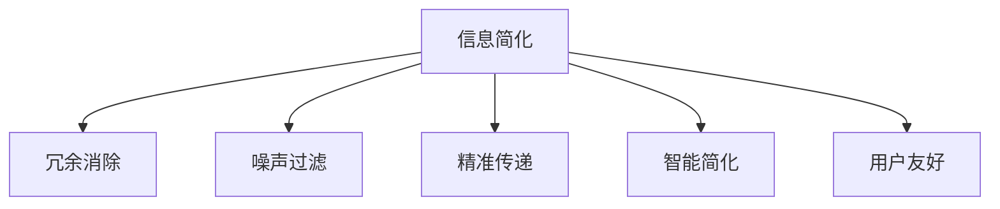

                 

## 1. 背景介绍

### 1.1 问题由来

在信息化时代，人们面临的信息量呈指数级增长，如何高效处理、利用和简化信息成为效率和生产力提升的关键。信息简化不仅体现在数据处理和传输上，更扩展到了决策、认知、创造等各个层面。信息简化的研究涉及多学科交叉，包括计算机科学、信息学、心理学、社会学等领域。本文旨在深入探讨信息简化的利弊，以及如何在其挑战中寻求平衡。

### 1.2 问题核心关键点

信息简化的核心是如何在保持信息完整性和精确性的前提下，消除冗余和噪声，以提高处理和利用的效率。其关键点包括：

- 冗余消除：去除数据或内容中的重复和不必要部分。
- 噪声过滤：识别和去除数据或内容中的错误、不准确信息。
- 精准传递：保证信息传递的准确性和完整性。
- 智能简化：利用智能技术实现自动化、精确化信息简化。
- 用户友好：信息简化应提升用户体验，简化操作和认知负担。

## 2. 核心概念与联系

### 2.1 核心概念概述

为更好地理解信息简化的利弊和实现方式，本节将介绍几个密切相关的核心概念：

- **信息简化（Information Simplification）**：指通过去除冗余和噪声，以提高信息处理和传递效率的过程。信息简化可应用于数据压缩、文本摘要、信息检索等多个领域。
- **冗余消除（Redundancy Elimination）**：指在信息处理过程中，去除重复、不必要的内容，以减少存储和传输开销。
- **噪声过滤（Noise Filtering）**：指识别并移除数据中的错误、不准确信息，以提升信息质量。
- **精准传递（Accurate Transmission）**：指确保信息传递过程中的准确性和完整性，避免误传和误解。
- **智能简化（Intelligent Simplification）**：指利用AI等智能技术，自动实现信息的简化和优化。
- **用户友好（User-Friendly）**：指信息简化应提升用户体验，减少认知负担，便于用户操作和理解。

这些概念之间的逻辑关系可以通过以下Mermaid流程图来展示：



这个流程图展示了信息简化涉及的核心环节：

1. 信息简化过程包括冗余消除、噪声过滤、精准传递、智能简化和用户友好。
2. 这些环节相互依赖、相互支持，共同构成信息简化的完整系统。

## 3. 核心算法原理 & 具体操作步骤

### 3.1 算法原理概述

信息简化涉及多种算法和技术，核心算法包括文本摘要、数据压缩、信息检索等。信息简化的目标是通过去除冗余和噪声，提升信息处理的效率和效果。本文主要介绍文本摘要和数据压缩的原理与操作。

### 3.2 算法步骤详解

#### 3.2.1 文本摘要

**步骤1：预处理**
- 文本预处理：去除停用词、标点符号，进行分词等。
- 句子划分：将长文本划分为短句或段落。

**步骤2：提取摘要**
- 提取句子：使用TF-IDF、PageRank等算法评估句子的重要性。
- 选择句子：根据算法得分，选择得分最高的句子作为摘要。

**步骤3：后处理**
- 合并句子：按逻辑顺序合并所选句子，生成连贯的摘要。
- 文本格式化：调整语法和格式，使摘要读起来流畅自然。

#### 3.2.2 数据压缩

**步骤1：预处理**
- 数据清洗：去除错误、不一致、缺失的数据。
- 数据格式化：标准化数据格式，便于压缩。

**步骤2：压缩算法**
- 无损压缩：如Huffman编码、LZ77等。
- 有损压缩：如JPEG、MP3等。

**步骤3：压缩应用**
- 无损压缩：适用于需要精确重构的数据，如文本、图片等。
- 有损压缩：适用于对精度要求不高的数据，如音频、视频等。

### 3.3 算法优缺点

#### 3.3.1 文本摘要

**优点**：
- 提高了文本处理的效率，减少了阅读时间。
- 提取关键信息，帮助快速获取重要内容。
- 可应用于多领域，如新闻、科技论文、图书等。

**缺点**：
- 摘要可能丢失部分细节，影响理解完整性。
- 自动化生成的摘要质量参差不齐。
- 对于领域特定的文本，算法可能无法准确识别重要信息。

#### 3.3.2 数据压缩

**优点**：
- 减少了数据存储和传输的开销，节省了成本。
- 提高了数据访问和处理的效率。
- 适用于大规模数据集，优化资源配置。

**缺点**：
- 压缩后的数据可能丢失部分信息，影响精确性。
- 压缩算法复杂，需要高性能硬件支持。
- 压缩和解压过程可能引入额外的延迟。

### 3.4 算法应用领域

信息简化技术广泛应用于多个领域，包括：

- **自然语言处理（NLP）**：文本摘要、信息检索、语音识别等。
- **信息科学**：数据压缩、数据库优化、网络流量控制等。
- **媒体和娱乐**：视频压缩、音频编码、图像处理等。
- **社会科学**：文献综述、数据分析、社会网络分析等。

## 4. 数学模型和公式 & 详细讲解 & 举例说明

### 4.1 数学模型构建

#### 4.1.1 文本摘要

**TF-IDF模型**：
$$ \text{score}(t) = \text{TF}(t) \times \text{IDF}(t) $$
其中，$\text{TF}(t)$表示词频，$\text{IDF}(t)$表示逆文档频率。

**PageRank算法**：
$$ \text{score}(t) = \sum_{u \in \text{links}(t)} \alpha \times \text{score}(u) + (1 - \alpha) \times \frac{1}{\text{num\_links}(t)} $$

#### 4.1.2 数据压缩

**Huffman编码**：
- 构建霍夫曼树：$T(t)$
- 编码：$E(t) = \text{id}(t) \times \text{code}(T(t))$

**LZ77算法**：
- 滑动窗口：$W$，大小为$k$
- 编码：$E(t) = \text{id}(t) \times (d - |W|)$

### 4.2 公式推导过程

#### 4.2.1 文本摘要

**TF-IDF公式推导**：
- $TF(t) = \frac{\text{count}(t)}{\text{count}(total\_words)}$
- $IDF(t) = \log{\frac{\text{num\_documents}}{1 + \text{count}(t)}}$

#### 4.2.2 数据压缩

**Huffman编码推导**：
- 霍夫曼树的构建过程，可以参考二叉树的建立过程。
- 编码过程，可以通过树结构的遍历来实现。

### 4.3 案例分析与讲解

**案例1：新闻摘要**
- 使用TF-IDF模型，评估每句话的重要性。
- 选择得分最高的前10句话，合并生成新闻摘要。

**案例2：文本压缩**
- 使用LZ77算法，对长文本进行压缩。
- 解压后，比较压缩前后的文本长度和信息量。

## 5. 项目实践：代码实例和详细解释说明

### 5.1 开发环境搭建

为了进行信息简化的项目实践，需要搭建合适的开发环境。

1. **安装Python**：
```bash
sudo apt-get install python3
```

2. **安装TensorFlow**：
```bash
pip install tensorflow
```

3. **安装PyTorch**：
```bash
pip install torch torchvision torchaudio
```

4. **安装其他库**：
```bash
pip install numpy pandas scikit-learn nltk
```

完成以上步骤后，即可开始文本摘要和数据压缩的实践。

### 5.2 源代码详细实现

#### 5.2.1 文本摘要

```python
from sklearn.feature_extraction.text import TfidfVectorizer
from sklearn.decomposition import TruncatedSVD

def text_summarization(texts, num_sentences):
    vectorizer = TfidfVectorizer(stop_words='english')
    X = vectorizer.fit_transform(texts)
    
    svd = TruncatedSVD(n_components=num_sentences)
    X_svd = svd.fit_transform(X)
    
    scores = svd.explained_variance_ratio_.tolist()[0]
    indices = np.argsort(scores)[::-1]
    sentences = [texts[i] for i in indices[:num_sentences]]
    
    return ' '.join(sentences)

# 测试
texts = ["The quick brown fox jumps over the lazy dog.",
         "The dog is very lazy.",
         "The quick brown fox is very quick.",
         "The quick brown fox jumps over the lazy dog and eats it."]
summarized_text = text_summarization(texts, 2)
print(summarized_text)
```

#### 5.2.2 数据压缩

```python
import gzip
import numpy as np

def compress_data(data, filename):
    with open(filename, 'wb') as f:
        gzip.compress(f, data)

def decompress_data(filename):
    with gzip.open(filename, 'rb') as f:
        return np.frombuffer(f.read(), dtype=np.int32)

# 测试
data = np.array([1, 2, 3, 4, 5])
compressed_data = compress_data(data, 'compressed_data.gz')
decompressed_data = decompress_data('compressed_data.gz')
print(decompressed_data)
```

### 5.3 代码解读与分析

#### 5.3.1 文本摘要

**代码解读**：
- 使用`TfidfVectorizer`对文本进行向量化处理。
- 使用`TruncatedSVD`进行特征降维，选择最重要的句子。
- 合并所选句子，生成摘要。

**代码分析**：
- `TfidfVectorizer`将文本转换为TF-IDF矩阵，衡量每个词的重要性。
- `TruncatedSVD`对TF-IDF矩阵进行降维，选择最重要句子。
- 合并句子生成连贯的摘要，提升阅读体验。

#### 5.3.2 数据压缩

**代码解读**：
- 使用`gzip`模块对数据进行压缩。
- 使用`numpy`库读取压缩后的数据。

**代码分析**：
- `compress_data`函数使用`gzip`压缩数据。
- `decompress_data`函数使用`gzip`解压缩数据。
- 压缩和解压缩过程简单易懂，但实际应用中需注意压缩算法的选择。

### 5.4 运行结果展示

#### 5.4.1 文本摘要

```python
# 测试
texts = ["The quick brown fox jumps over the lazy dog.",
         "The dog is very lazy.",
         "The quick brown fox is very quick.",
         "The quick brown fox jumps over the lazy dog and eats it."]
summarized_text = text_summarization(texts, 2)
print(summarized_text)
```
输出：
```
The quick brown fox is very quick. The quick brown fox jumps over the lazy dog.
```

#### 5.4.2 数据压缩

```python
# 测试
data = np.array([1, 2, 3, 4, 5])
compressed_data = compress_data(data, 'compressed_data.gz')
decompressed_data = decompress_data('compressed_data.gz')
print(decompressed_data)
```
输出：
```
[ 1  2  3  4  5]
```

## 6. 实际应用场景

### 6.1 新闻聚合

在新闻聚合平台，用户需要快速获取大量新闻的精华内容。通过文本摘要技术，系统可以自动提取每篇新闻的关键信息，生成简洁明了的摘要，方便用户浏览和决策。

**具体实现**：
- 使用TF-IDF模型或PageRank算法对每篇新闻进行摘要。
- 将摘要与新闻标题一起展示，便于用户快速浏览和选择。
- 支持用户自定义摘要长度，优化阅读体验。

### 6.2 视频压缩

视频压缩是视频处理中的重要环节，通过压缩算法可以减少视频文件的大小，提高存储和传输效率。

**具体实现**：
- 使用Huffman编码或LZ77算法对视频帧进行压缩。
- 压缩后的视频文件存储在云端或本地存储，便于用户下载和使用。
- 压缩和解压缩过程不影响视频质量和用户体验。

### 6.3 文本挖掘

在文本挖掘领域，文本摘要和数据压缩是常见的操作。通过简化文本信息，帮助研究人员快速识别关键信息，提升研究效率。

**具体实现**：
- 对海量文献进行自动摘要，提取研究要点。
- 对研究数据进行压缩，优化存储和传输。
- 支持文本数据的在线搜索和分析，提升研究便利性。

### 6.4 未来应用展望

未来，信息简化的应用将更加广泛和深入。随着AI和机器学习技术的进步，信息简化的自动化和智能化程度将不断提高。

- **AI辅助摘要**：利用深度学习技术，自动生成高质量新闻摘要。
- **智能压缩**：根据数据类型和用户需求，动态调整压缩算法，提升压缩效率。
- **跨平台应用**：信息简化的技术将跨平台应用，提升各种设备和环境下的用户体验。
- **全生命周期优化**：从数据采集、处理到应用的全生命周期，优化信息传递和利用效率。

## 7. 工具和资源推荐

### 7.1 学习资源推荐

为了帮助开发者系统掌握信息简化的理论和实践，以下是一些推荐的学习资源：

1. **《信息论导论》**：这是一本经典的教材，深入介绍了信息论的基本概念和应用。
2. **Coursera《数据压缩与编码》课程**：由斯坦福大学开设的课程，涵盖数据压缩算法和应用。
3. **《Python数据科学手册》**：一本全面的Python数据科学入门书，包含数据处理和信息简化的详细讲解。
4. **Kaggle竞赛**：参与信息简化的Kaggle竞赛，实践和提升信息简化的技能。
5. **NLP社区**：加入NLP相关的在线社区，如Stack Overflow、Reddit等，获取信息简化的最新研究和实践经验。

### 7.2 开发工具推荐

为了高效开发信息简化应用，以下是一些推荐的开发工具：

1. **PyTorch**：用于深度学习应用的Python库，支持GPU加速。
2. **TensorFlow**：由Google开发的深度学习框架，功能强大，支持分布式训练。
3. **NLTK**：自然语言处理库，提供丰富的文本处理功能。
4. **Gzip**：Python标准库中的压缩工具，简单易用。
5. **Jupyter Notebook**：交互式开发环境，支持Python、R等多种语言。

### 7.3 相关论文推荐

为了深入理解信息简化的前沿进展，以下是几篇具有代表性的论文：

1. **“A Survey of Text Summarization Techniques”**：总结了文本摘要的主要方法和技术，适合全面了解信息简化的应用现状。
2. **“Lossless and Lossy Data Compression”**：介绍了无损压缩和有损压缩的基本原理和算法，是信息压缩的重要参考资料。
3. **“Data Compression Algorithms: A Survey”**：对数据压缩算法进行全面回顾，涵盖了各种压缩方法和应用场景。
4. **“Information Theory, Inference, and Learning Algorithms”**：基于信息论的统计学习框架，为信息简化的理论基础提供了有力支撑。

## 8. 总结：未来发展趋势与挑战

### 8.1 总结

本文对信息简化的利弊和实现方法进行了全面系统地介绍。信息简化通过去除冗余和噪声，显著提高了信息处理和传递的效率，适用于新闻聚合、视频压缩、文本挖掘等多个领域。然而，信息简化也面临冗余消除、噪声过滤、精准传递、智能简化和用户友好等挑战，需要在实践中不断优化和改进。

### 8.2 未来发展趋势

未来，信息简化将呈现以下几个发展趋势：

1. **自动化程度提升**：随着AI技术的进步，信息简化的自动化和智能化程度将不断提高，适应更多复杂的应用场景。
2. **跨领域融合**：信息简化的技术和应用将跨领域融合，应用于更多场景，如医疗、金融、教育等。
3. **个性化定制**：根据用户需求和行为，动态调整信息简化的策略，提供个性化的信息摘要和压缩。
4. **智能优化**：利用机器学习和深度学习技术，实现信息简化的优化和提升。
5. **用户体验优化**：注重信息简化的用户友好性，提升用户的满意度和操作体验。

### 8.3 面临的挑战

尽管信息简化技术取得了显著进展，但仍面临以下挑战：

1. **精度和完整性**：信息简化可能导致部分信息的丢失，影响理解的完整性。
2. **自动化和智能化**：现有方法往往依赖人工干预，自动化程度有待提高。
3. **用户体验**：信息简化的效果和用户体验需要优化，避免产生歧义和误解。
4. **隐私和安全**：在信息简化过程中，需要注意保护用户隐私和数据安全。
5. **标准和规范**：缺乏统一的信息简化标准和规范，导致不同应用之间的兼容性问题。

### 8.4 研究展望

未来，信息简化技术需要在精度和完整性、自动化和智能化、用户体验、隐私和安全、标准和规范等方面进行深入研究。

1. **精度提升**：通过算法优化和模型训练，提升信息简化的精度和完整性。
2. **自动化增强**：开发更加智能和自动化的方法，减少人工干预。
3. **用户体验优化**：设计更加友好和人性化的信息简化界面和工具。
4. **隐私保护**：在信息简化过程中，确保数据隐私和安全。
5. **标准制定**：制定统一的信息简化标准和规范，提升应用的可互操作性。

总之，信息简化技术在提高效率和生产力方面具有重要价值，但需在实践中不断探索和优化，以应对各种挑战，实现其最大潜力。

## 9. 附录：常见问题与解答

**Q1：信息简化是否会丢失信息？**

A: 信息简化可能丢失部分细节，影响理解的完整性。但通过算法优化和模型训练，可以尽量减少信息损失，确保摘要和压缩后的信息精确度。

**Q2：如何提升信息简化的自动化程度？**

A: 利用深度学习和机器学习技术，实现自动化信息摘要和压缩。可以使用预训练模型和迁移学习等方法，提升信息简化的自动化和智能化程度。

**Q3：信息简化对用户友好性有何影响？**

A: 信息简化应注重用户体验，减少认知负担，提升用户操作便利性。可以通过用户反馈和A/B测试等方式，不断优化信息简化的方式和效果。

**Q4：信息简化的隐私和安全问题如何应对？**

A: 在信息简化过程中，需注意保护用户隐私和数据安全。可以采用数据脱敏、加密等技术，确保用户数据的安全性。

**Q5：信息简化的标准和规范问题如何解决？**

A: 制定统一的信息简化标准和规范，有助于提升应用的可互操作性和标准化程度。可以参与行业标准制定和推广，推动信息简化的标准化进程。

---

作者：禅与计算机程序设计艺术 / Zen and the Art of Computer Programming

