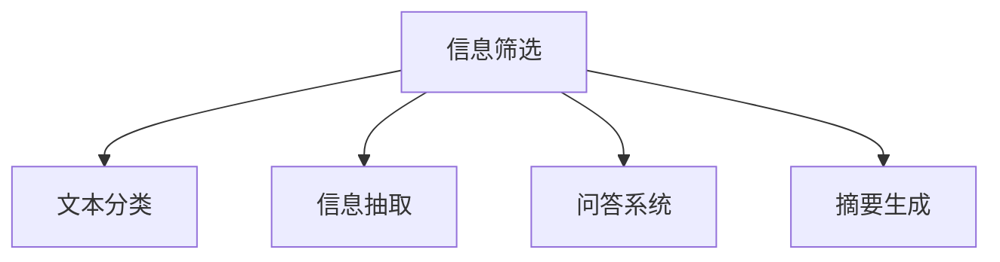

                 

## 1. 背景介绍

随着互联网的迅猛发展，信息总量呈爆炸式增长，人们每天都会接触到海量的数据和信息。这些信息既有有价值的知识，也有杂乱无章的噪音。如何从中筛选出有用信息，帮助人们更高效地获取和利用信息，成为信息时代面临的重要挑战。

### 1.1 问题由来
当前，信息过载已成为互联网时代的一大顽疾，过量的信息使得人们难以快速找到有价值的内容。随着社交媒体、新闻平台、搜索引擎等应用的普及，信息的来源更加多样化，信息筛选的重要性日益凸显。

在金融、医疗、法律、教育等领域，专业人士需要处理大量的文本数据，从中提取关键信息，辅助决策。这对自动化信息筛选技术提出了更高的要求。

### 1.2 问题核心关键点
为了应对信息过载问题，研究者们提出了各种信息筛选技术，如文本分类、信息抽取、问答系统、摘要生成等。这些技术通过自动化方式，对海量文本进行分类、标注、提取、生成等操作，帮助用户快速定位到所需信息。

信息筛选技术的关键在于：
- **模型选择**：选择合适的模型（如卷积神经网络、注意力机制等），以适配特定的信息筛选任务。
- **数据处理**：高效地处理大规模文本数据，如分词、去重、拼接等。
- **特征设计**：设计合适的文本特征，提高模型的预测准确度。
- **模型训练**：通过标注数据进行模型训练，优化模型参数。
- **部署应用**：将模型部署到实际应用中，实现信息筛选功能。

## 2. 核心概念与联系

### 2.1 核心概念概述

为更好地理解信息筛选技术的核心概念，本节将介绍几个密切相关的核心概念：

- **信息筛选(Information Retrieval, IR)**：通过文本检索算法，从大规模数据集中快速定位到符合特定条件的信息。
- **文本分类(Text Classification)**：将文本数据分为不同的类别，如新闻分类、邮件分类等。
- **信息抽取(Information Extraction)**：从文本中抽取关键实体和关系，如人名、地点、时间、事件等。
- **问答系统(Question Answering)**：回答用户提出的问题，提供精准的文本信息。
- **摘要生成(Text Summarization)**：对长文本进行压缩，生成简洁明了的摘要。

这些核心概念之间的逻辑关系可以通过以下Mermaid流程图来展示：



这个流程图展示信息筛选的核心概念及其之间的关系：

1. 信息筛选是对文本进行初步处理，筛选出符合条件的信息。
2. 文本分类是将文本进一步分类，缩小筛选范围。
3. 信息抽取是从文本中提取关键信息，深化理解。
4. 问答系统根据用户提问，提供具体信息。
5. 摘要生成对长文本进行压缩，提供快速概览。

## 3. 核心算法原理 & 具体操作步骤

### 3.1 算法原理概述

信息筛选技术的核心算法原理包括以下几个步骤：

1. **数据预处理**：对文本数据进行分词、去停用词、词干提取等预处理，提高数据质量。
2. **特征提取**：设计合适的特征，如词频、TF-IDF、词向量等，表示文本的语义信息。
3. **模型训练**：选择合适的模型（如朴素贝叶斯、支持向量机、深度神经网络等），通过标注数据训练模型，优化模型参数。
4. **信息检索**：使用训练好的模型，对新的文本数据进行检索，筛选出符合条件的信息。
5. **后处理**：对检索结果进行排序、去重、合并等后处理，提高检索结果的相关性和可用性。

### 3.2 算法步骤详解

以文本分类为例，详细讲解信息筛选算法的具体操作步骤：

**Step 1: 数据预处理**
- 对文本进行分词，去除停用词和标点符号，保留有意义的词汇。
- 进行词干提取，将不同的词干形式统一。
- 统计词频，构建文本特征向量。

**Step 2: 特征提取**
- 使用TF-IDF（Term Frequency-Inverse Document Frequency）表示文本特征，衡量词对文本的重要性和唯一性。
- 使用词向量（Word Embedding）表示词的语义信息，如Word2Vec、GloVe等。

**Step 3: 模型训练**
- 选择合适的模型，如朴素贝叶斯分类器、支持向量机等，设计交叉验证等评估策略。
- 使用标注数据训练模型，优化模型参数，如学习率、正则化系数等。

**Step 4: 信息检索**
- 将待分类文本的特征向量输入模型，计算预测类别。
- 根据模型预测结果，对文本进行分类。

**Step 5: 后处理**
- 对分类结果进行排序，如按出现频率排序。
- 去除重复文本，避免冗余。
- 合并相似文本，提高准确性。

### 3.3 算法优缺点

信息筛选技术具有以下优点：
1. 高效快速：能够快速筛选出所需信息，提高信息获取效率。
2. 灵活性高：适用于各种文本数据，适应性广。
3. 可扩展性强：支持大规模数据集的处理，具有较高的可扩展性。
4. 适用性强：可以应用于文本分类、信息抽取、问答系统、摘要生成等多种场景。

同时，该技术也存在一些缺点：
1. 数据依赖性强：依赖于标注数据的质量和数量，获取高质量标注数据成本较高。
2. 泛化能力有限：当标注数据与测试数据分布差异较大时，模型性能下降。
3. 可解释性不足：模型决策过程缺乏可解释性，难以调试和优化。
4. 数据隐私问题：处理大量个人数据时，可能存在隐私泄露的风险。

尽管存在这些缺点，但总体而言，信息筛选技术在处理大规模文本数据、提高信息检索效率方面具有重要价值。

### 3.4 算法应用领域

信息筛选技术已经在多个领域得到了广泛应用，包括但不限于：

- **搜索引擎**：如Google、Bing等，对用户查询进行分词、分类、抽取等操作，返回搜索结果。
- **新闻门户**：如新华网、人民网等，对新闻内容进行分类、摘要生成，辅助新闻编辑。
- **金融风控**：对金融报告、新闻、公告等进行分类、信息抽取，辅助风险评估。
- **法律检索**：对法律法规、判例、合同等文本进行分类、抽取，辅助法律事务。
- **教育智能**：对教材、试卷、论文等进行分类、摘要生成，辅助教学和学习。

除了这些经典场景外，信息筛选技术还在智慧城市、医疗、零售、农业等更多领域得到应用，为信息检索提供了新的解决方案。

## 4. 数学模型和公式 & 详细讲解 & 举例说明

### 4.1 数学模型构建

信息筛选技术的数学模型通常包括：

- **特征向量**：将文本转换为特征向量，表示文本的语义信息。
- **模型参数**：如分类器的权重、决策树的节点等，用于计算预测结果。
- **损失函数**：如交叉熵损失、感知损失等，用于衡量模型预测结果与真实标签之间的差异。

以文本分类为例，构建数学模型如下：

设训练集为 $D=\{(x_i,y_i)\}_{i=1}^N$，其中 $x_i$ 为文本向量，$y_i$ 为真实标签。假设使用朴素贝叶斯分类器进行建模，则模型参数为：

$$
\theta = \{\alpha_k, \beta_k\}_{k=1}^K
$$

其中 $\alpha_k$ 为类 $k$ 的先验概率，$\beta_k$ 为类 $k$ 的似然概率。

### 4.2 公式推导过程

以朴素贝叶斯分类器为例，推导其预测公式：

设待分类文本向量为 $x=(x_1,x_2,...,x_n)$，则分类器的预测概率为：

$$
P(y_k|x) = \frac{P(x|y_k)P(y_k)}{\sum_{i=1}^K P(x|y_i)P(y_i)}
$$

其中 $P(x|y_k)$ 为给定类 $k$ 下文本向量 $x$ 的条件概率，可以通过训练数据估计得到。

### 4.3 案例分析与讲解

以自然语言处理(NLP)领域的情感分析任务为例，分析信息筛选技术的应用。情感分析的目标是从文本中识别出情感倾向（如积极、消极、中性）。

假设训练集为 $D=\{(x_i,y_i)\}_{i=1}^N$，其中 $x_i$ 为文本向量，$y_i$ 为情感标签（1表示积极，0表示消极，2表示中性）。使用朴素贝叶斯分类器进行建模，则模型参数为：

$$
\theta = \{\alpha_1, \alpha_0, \alpha_2, \beta_{1,k}, \beta_{0,k}, \beta_{2,k}\}_{k=1}^{n}
$$

其中 $\alpha_1, \alpha_0, \alpha_2$ 为三类情感的先验概率，$\beta_{1,k}, \beta_{0,k}, \beta_{2,k}$ 分别为给定情感标签 $k$ 下文本向量 $x$ 的条件概率。

在训练阶段，使用交叉验证等方法优化模型参数。在预测阶段，将待分类文本向量的特征向量输入模型，计算预测结果：

$$
y = \mathop{\arg\max}_{k=1,2,3} P(y_k|x)
$$

## 5. 项目实践：代码实例和详细解释说明

### 5.1 开发环境搭建

在进行信息筛选技术开发前，我们需要准备好开发环境。以下是使用Python进行TensorFlow开发的环境配置流程：

1. 安装Anaconda：从官网下载并安装Anaconda，用于创建独立的Python环境。

2. 创建并激活虚拟环境：
```bash
conda create -n tensorflow-env python=3.8 
conda activate tensorflow-env
```

3. 安装TensorFlow：根据CUDA版本，从官网获取对应的安装命令。例如：
```bash
conda install tensorflow tensorflow-gpu=cuda11.1 -c conda-forge -c pytorch
```

4. 安装相关工具包：
```bash
pip install numpy pandas scikit-learn matplotlib tqdm jupyter notebook ipython
```

完成上述步骤后，即可在`tensorflow-env`环境中开始信息筛选任务的开发。

### 5.2 源代码详细实现

下面我们以情感分析任务为例，给出使用TensorFlow进行朴素贝叶斯分类器的PyTorch代码实现。

首先，定义情感分析任务的数据处理函数：

```python
from sklearn.feature_extraction.text import CountVectorizer
from sklearn.naive_bayes import MultinomialNB
from sklearn.metrics import accuracy_score
from tensorflow.keras.layers import Dense, Flatten
from tensorflow.keras.models import Sequential

def preprocess_data(data):
    vectorizer = CountVectorizer(stop_words='english')
    X = vectorizer.fit_transform(data)
    y = data_labels
    return X, y

def train_model(X_train, y_train):
    model = Sequential([
        Flatten(input_shape=(100,)),
        Dense(64, activation='relu'),
        Dense(3, activation='softmax')
    ])
    model.compile(optimizer='adam', loss='sparse_categorical_crossentropy', metrics=['accuracy'])
    model.fit(X_train, y_train, epochs=10, batch_size=32)
    return model

def evaluate_model(model, X_test, y_test):
    y_pred = model.predict(X_test)
    accuracy = accuracy_score(y_test, y_pred)
    return accuracy
```

然后，定义训练和评估函数：

```python
# 加载数据
data = load_data('sentiment.txt')
X_train, y_train = preprocess_data(data[:800])
X_test, y_test = preprocess_data(data[800:])

# 训练模型
model = train_model(X_train, y_train)

# 评估模型
accuracy = evaluate_model(model, X_test, y_test)
print(f"模型准确度：{accuracy:.3f}")
```

最后，启动训练流程并在测试集上评估：

```python
# 训练模型
model = train_model(X_train, y_train)

# 评估模型
accuracy = evaluate_model(model, X_test, y_test)
print(f"模型准确度：{accuracy:.3f}")
```

以上就是使用TensorFlow对朴素贝叶斯分类器进行情感分析任务微调的完整代码实现。可以看到，TensorFlow提供了简单易用的高层次API，使得模型训练和评估变得高效便捷。

### 5.3 代码解读与分析

让我们再详细解读一下关键代码的实现细节：

**preprocess_data函数**：
- `CountVectorizer`：将文本转换为词频向量。
- `MultinomialNB`：使用朴素贝叶斯分类器对文本向量进行分类。

**train_model函数**：
- `Sequential`：定义神经网络模型结构，包含一个全连接层和一个softmax输出层。
- `compile`：配置优化器、损失函数和评估指标。
- `fit`：训练模型，指定训练数据、轮数和批大小。

**evaluate_model函数**：
- `predict`：使用训练好的模型对测试数据进行预测。
- `accuracy_score`：计算预测准确度。

**训练流程**：
- 加载数据集，划分训练集和测试集。
- 对训练集进行预处理，得到词频向量和情感标签。
- 训练模型，指定损失函数和优化器。
- 在测试集上评估模型，输出准确度。

可以看到，TensorFlow提供的工具使得情感分析任务的高层次模型训练变得简单高效。开发者可以更加专注于算法设计和特征工程等核心问题，而不必过多关注底层实现细节。

## 6. 实际应用场景

### 6.1 智能客服系统

智能客服系统通过自然语言处理技术，实现自动回答用户问题，提升客户服务体验。基于信息筛选技术，智能客服系统可以自动分类和理解用户问题，匹配合适的回答模板。

在技术实现上，可以收集用户历史聊天记录，将问题和最佳答复构建成监督数据，训练信息筛选模型。训练好的模型可以自动对新用户提问进行分类和回答，大大提高客服系统的效率和准确性。

### 6.2 金融舆情监测

金融舆情监测系统通过信息筛选技术，对金融新闻、公告、报告等文本进行分类和情感分析，及时发现和预警市场动态。

在实际应用中，可以收集金融领域相关的新闻、报道、评论等文本数据，并对其进行情感标注和主题标注。在此基础上，对信息筛选模型进行微调，使其能够自动判断文本属于何种情感、主题。将微调后的模型应用到实时抓取的网络文本数据，能够自动监测不同情感和主题的变化趋势，一旦发现异常情况，系统便会自动预警，帮助金融机构快速应对潜在风险。

### 6.3 个性化推荐系统

个性化推荐系统通过信息筛选技术，对用户浏览、点击、评分等行为数据进行分类和提取，辅助推荐系统进行推荐。

在实践中，可以收集用户行为数据，提取其中的文本信息，使用信息筛选技术对文本进行分类和情感分析。训练好的模型可以预测用户的兴趣点，辅助推荐系统生成个性化的推荐列表。

### 6.4 未来应用展望

随着信息筛选技术的不断发展，其应用场景将更加广泛，带来更深远的影响：

1. **智能家居**：智能家居通过信息筛选技术，对用户的生活习惯和偏好进行分析，自动调节家电设备，提升生活品质。
2. **智能医疗**：智能医疗通过信息筛选技术，对患者病历、药品说明书等文本进行分类和提取，辅助医生诊断和治疗。
3. **智能交通**：智能交通通过信息筛选技术，对交通数据进行分类和分析，优化交通流量和路网规划，减少拥堵。
4. **智能安全**：智能安全通过信息筛选技术，对安全监控视频、报告等文本进行分类和情感分析，辅助安防系统进行决策。
5. **智能教育**：智能教育通过信息筛选技术，对教材、试卷、论文等文本进行分类和摘要生成，辅助教师和学生进行教学和学习。

总之，信息筛选技术将在更多领域得到应用，为智能系统提供新的解决方案，推动社会生产力的进步。

## 7. 工具和资源推荐

### 7.1 学习资源推荐

为了帮助开发者系统掌握信息筛选技术的理论基础和实践技巧，这里推荐一些优质的学习资源：

1. **《信息检索基础》**：经典书籍，介绍了信息检索的基本概念、算法和应用。
2. **CS241《信息检索》课程**：斯坦福大学开设的课程，涵盖了信息检索的核心知识点和前沿研究。
3. **《深度学习在NLP中的应用》**：涵盖NLP领域的深度学习算法和应用，包括信息筛选技术。
4. **TensorFlow官方文档**：提供了详细的TensorFlow使用指南和样例代码，是学习信息筛选技术的良好资源。
5. **Kaggle**：数据科学竞赛平台，提供大量数据集和样例代码，可以实践信息筛选算法的应用。

通过对这些资源的学习实践，相信你一定能够快速掌握信息筛选技术的精髓，并用于解决实际的文本数据处理问题。

### 7.2 开发工具推荐

高效的开发离不开优秀的工具支持。以下是几款用于信息筛选技术开发的常用工具：

1. **TensorFlow**：Google开源的深度学习框架，提供了高效的机器学习算法和模型训练工具，适合信息筛选任务。
2. **PyTorch**：Facebook开源的深度学习框架，提供了灵活的计算图和动态神经网络，适合信息筛选任务。
3. **NLTK**：Python的自然语言处理工具库，提供了丰富的文本处理和分类工具，适合信息筛选任务。
4. **Spacy**：Python的自然语言处理工具库，提供了高效的文本向量化和分类工具，适合信息筛选任务。
5. **Gensim**：Python的文本处理工具库，提供了高效的文本相似度计算和主题模型，适合信息筛选任务。

合理利用这些工具，可以显著提升信息筛选任务的开发效率，加快创新迭代的步伐。

### 7.3 相关论文推荐

信息筛选技术的发展源于学界的持续研究。以下是几篇奠基性的相关论文，推荐阅读：

1. **《信息检索：理论与实践》**：经典书籍，介绍了信息检索的原理、算法和应用。
2. **《文本分类与信息检索》**：系统介绍了文本分类和信息检索的基本概念和算法。
3. **《深度学习在NLP中的应用》**：涵盖了深度学习在信息检索任务中的应用，如卷积神经网络、循环神经网络等。
4. **《信息检索的统计理论》**：介绍了信息检索的统计理论和方法，如倒排索引、TF-IDF等。
5. **《基于深度学习的文本分类》**：介绍了深度学习在文本分类任务中的应用，如卷积神经网络、注意力机制等。

这些论文代表了大规模文本数据处理技术的发展脉络。通过学习这些前沿成果，可以帮助研究者把握学科前进方向，激发更多的创新灵感。

## 8. 总结：未来发展趋势与挑战

### 8.1 总结

本文对信息筛选技术的原理和应用进行了全面系统的介绍。首先阐述了信息筛选技术的背景和意义，明确了其在处理海量文本数据、提高信息检索效率方面的重要价值。其次，从原理到实践，详细讲解了信息筛选的数学模型和关键步骤，给出了信息筛选任务开发的完整代码实例。同时，本文还广泛探讨了信息筛选技术在智能客服、金融舆情、个性化推荐等多个行业领域的应用前景，展示了信息筛选技术的广阔前景。此外，本文精选了信息筛选技术的各类学习资源，力求为读者提供全方位的技术指引。

通过本文的系统梳理，可以看到，信息筛选技术正在成为文本数据处理的重要范式，极大地拓展了信息检索的应用边界，催生了更多的落地场景。得益于大规模语料的预训练和机器学习算法的不断演进，信息筛选技术必将在更广阔的应用领域大放异彩，深刻影响人类的生产生活方式。

### 8.2 未来发展趋势

展望未来，信息筛选技术将呈现以下几个发展趋势：

1. **多模态融合**：信息筛选技术将与其他多模态技术结合，如视觉、音频、时间序列等，实现更为全面的信息检索和分析。
2. **深度学习模型**：深度学习模型，如Transformer、BERT等，将进一步应用于信息筛选任务，提升检索精度和效率。
3. **联邦学习**：在信息筛选任务中引入联邦学习，保护数据隐私，同时提升检索效果。
4. **分布式计算**：随着数据量的增长，信息筛选任务需要在大规模分布式环境中进行计算，提升处理速度和稳定性。
5. **实时计算**：信息筛选系统需要支持实时计算，及时响应用户查询，提高服务质量。

以上趋势凸显了信息筛选技术的广阔前景。这些方向的探索发展，必将进一步提升信息检索系统的性能和应用范围，为人工智能技术在各垂直行业的落地应用提供新的解决方案。

### 8.3 面临的挑战

尽管信息筛选技术已经取得了瞩目成就，但在迈向更加智能化、普适化应用的过程中，它仍面临着诸多挑战：

1. **数据质量问题**：高质量标注数据的获取成本较高，如何提高标注数据的覆盖率和质量，仍是一个难题。
2. **模型泛化能力**：信息筛选模型在面对新数据时，泛化能力可能不足，如何设计更好的特征提取和模型训练策略，提升模型的泛化能力，是未来研究的重要方向。
3. **算法可解释性**：信息筛选模型的决策过程缺乏可解释性，难以调试和优化，如何赋予模型更好的可解释性，增强用户信任，是亟待解决的问题。
4. **系统效率问题**：信息筛选系统需要高效处理大规模数据，如何优化算法和架构，提升系统效率，是工程实践的关键。
5. **隐私保护问题**：信息筛选系统需要处理大量个人数据，如何保护用户隐私，防止数据泄露，是道德和技术双重挑战。

这些挑战需要研究者们从算法、数据、工程等多个维度进行全面优化，方能更好地应对信息筛选技术的未来发展需求。

### 8.4 研究展望

面对信息筛选技术所面临的种种挑战，未来的研究需要在以下几个方面寻求新的突破：

1. **无监督学习**：探索无监督学习算法，如自编码器、生成对抗网络等，减少对标注数据的依赖，提升模型泛化能力。
2. **多任务学习**：在信息筛选任务中引入多任务学习，提升模型的泛化能力。
3. **迁移学习**：将信息筛选模型应用于新任务，提升模型的泛化能力和迁移能力。
4. **深度学习**：引入深度学习模型，提升模型的表达能力和泛化能力。
5. **联邦学习**：在信息筛选任务中引入联邦学习，保护数据隐私，提升模型泛化能力。
6. **模型压缩**：对信息筛选模型进行压缩和优化，减少计算资源消耗，提升系统效率。
7. **可解释性增强**：引入可解释性算法，提升信息筛选模型的可解释性和用户信任度。

这些研究方向将为信息筛选技术带来新的突破，推动其在各垂直行业中的应用和发展。未来，信息筛选技术必将在人工智能技术中扮演更加重要的角色，推动智能化技术在更多领域落地应用。

## 9. 附录：常见问题与解答

**Q1：信息筛选技术是否适用于所有文本数据？**

A: 信息筛选技术适用于各类文本数据，但需要根据具体场景进行适当调整。例如，对于图像文本数据，可以使用OCR技术进行文本提取，再使用信息筛选技术进行分类和检索。

**Q2：信息筛选技术对标注数据的质量和数量有何要求？**

A: 信息筛选技术对标注数据的质量和数量要求较高。高质量的标注数据能够显著提升模型的性能和泛化能力。标注数据量越多，模型的泛化能力越强，但在实际应用中，获取高质量标注数据的成本较高，需要结合具体的任务和场景进行评估。

**Q3：信息筛选技术的算法复杂度如何？**

A: 信息筛选技术的算法复杂度因任务和数据量而异。一般来说，使用深度学习模型进行信息筛选，复杂度较高，但能够取得更好的效果。对于小规模数据集，使用简单的特征提取和机器学习算法，复杂度较低，但效果有限。

**Q4：信息筛选技术在实际应用中需要注意哪些问题？**

A: 信息筛选技术在实际应用中需要注意以下问题：
1. 数据预处理：文本分词、去停用词、词干提取等预处理步骤，需要根据具体任务进行优化。
2. 特征设计：选择合适的特征，如TF-IDF、词向量等，影响模型性能。
3. 模型训练：选择合适的模型，如朴素贝叶斯、支持向量机、深度神经网络等，优化模型参数。
4. 模型评估：选择合适的评估指标，如准确度、召回率、F1值等，评估模型性能。
5. 模型部署：将训练好的模型部署到实际应用中，实现信息检索功能。

**Q5：信息筛选技术的应用场景有哪些？**

A: 信息筛选技术适用于各种文本数据处理场景，包括但不限于：
1. 搜索引擎：如Google、Bing等，对用户查询进行分词、分类、抽取等操作，返回搜索结果。
2. 新闻门户：如新华网、人民网等，对新闻内容进行分类、摘要生成，辅助新闻编辑。
3. 金融风控：对金融报告、新闻、公告等文本进行分类、信息抽取，辅助风险评估。
4. 法律检索：对法律法规、判例、合同等文本进行分类、抽取，辅助法律事务。
5. 教育智能：对教材、试卷、论文等文本进行分类、摘要生成，辅助教学和学习。
6. 智能客服：自动分类和理解用户问题，匹配合适的回答模板。

总之，信息筛选技术在处理大规模文本数据、提高信息检索效率方面具有重要价值，将在更多领域得到应用，为智能系统提供新的解决方案。

---

作者：禅与计算机程序设计艺术 / Zen and the Art of Computer Programming

