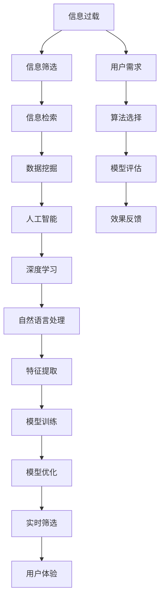

                 

# 信息过载与信息筛选策略与技术：在信息洪流中找到有价值的信息

> 关键词：信息过载,信息筛选,策略与技术,信息检索,数据挖掘,人工智能

## 1. 背景介绍

### 1.1 问题由来

在现代社会，随着互联网的广泛应用和数字技术的高速发展，信息的总量呈爆炸式增长。海量的文本、图片、视频、音频等数据每天都在产生，使人们陷入了前所未有的信息过载（Information Overload）困境。信息过载指的是个体在面对大量信息时，无法有效筛选和利用，导致认知负荷加重，决策效率下降，甚至产生心理压力和焦虑感。

这种困境不仅出现在日常生活中，在商业决策、医疗诊断、科研探索等专业领域也广泛存在。例如，在商业分析中，每天产生的海量市场数据、财务报告和新闻资讯，需要经过信息筛选才能提炼出有价值的洞见，指导决策。在医疗诊断中，医生需要快速从海量的医学文献和临床记录中提取有用的知识，以提高诊断准确率和效率。

因此，如何有效筛选和处理信息，成为信息时代的关键挑战之一。信息筛选策略与技术的研发和应用，成为信息技术领域的重要研究方向。本文将全面介绍信息过载的现状、原因及主要策略，以及当前应用较为广泛的信息筛选技术，并探讨其未来发展方向。

### 1.2 问题核心关键点

信息过载和信息筛选的主要问题可以归纳为以下几点：
1. **信息量巨大**：现代社会的数据生成速度和数量呈指数级增长，海量的信息源使得人们难以处理。
2. **信息质量参差不齐**：在信息海洋中，信息的质量和可靠性差异较大，有价值的真信息往往被大量无关或错误信息所淹没。
3. **认知负荷增加**：过载的信息导致认知资源过度消耗，决策效率和效果下降，甚至产生心理压力。
4. **信息筛选需求广泛**：无论是个人生活还是专业领域，信息筛选的需求广泛存在，但缺乏有效的技术手段。

这些核心问题驱动着信息筛选策略与技术的不断进步，旨在提升信息处理的效率和质量，帮助人们从信息过载中解脱出来。

### 1.3 问题研究意义

研究信息过载和信息筛选策略与技术，对于提升信息处理效率、降低决策风险、促进知识共享和创新具有重要意义：

1. **提升决策效率**：通过高效的信息筛选，可以快速提炼出决策所需的关键信息，提高决策的准确性和效率。
2. **降低认知负荷**：通过自动化信息处理和筛选，减轻人的认知负担，提升日常生活的质量。
3. **促进知识共享**：有效筛选和聚合高质量信息，促进知识的传播和共享，加速社会进步。
4. **驱动技术创新**：信息筛选技术的不断发展，推动了大数据、人工智能、自然语言处理等技术领域的进步。
5. **支撑产业发展**：信息筛选技术的应用，支撑了知识密集型产业的快速成长，如金融、医疗、科研等。

## 2. 核心概念与联系

### 2.1 核心概念概述

要理解信息过载和信息筛选策略与技术，首先需要掌握以下几个核心概念：

- **信息过载（Information Overload）**：指个体在面对大量信息时，无法有效筛选和处理，导致认知负荷增加的问题。
- **信息筛选（Information Filtering）**：指从大量信息中挑选出与用户需求相关或有用的信息，以提高信息处理的效率和效果。
- **信息检索（Information Retrieval）**：指从数据库中快速检索出用户所需信息的技术，包括文本检索、图像检索等。
- **数据挖掘（Data Mining）**：指从大量数据中自动发现知识、规律和模式的技术，涉及分类、聚类、关联规则挖掘等方法。
- **人工智能（Artificial Intelligence）**：指通过计算机模拟人类智能，实现信息处理和决策的技术，如机器学习、深度学习等。

这些概念相互关联，构成了信息筛选技术的基础框架。通过理解这些概念，可以更好地把握信息筛选技术的发展脉络和应用场景。

### 2.2 核心概念原理和架构的 Mermaid 流程图



这个流程图展示了信息筛选技术的主要过程：从信息过载问题出发，通过信息筛选技术处理和检索信息，挖掘数据中的知识模式，运用人工智能和深度学习模型进行特征提取和训练优化，最终实现对信息的实时筛选和反馈，提升用户体验。

## 3. 核心算法原理 & 具体操作步骤

### 3.1 算法原理概述

信息筛选技术的主要原理是基于用户需求和信息特征之间的匹配关系。具体来说，通过用户行为分析和信息特征提取，构建用户需求和信息特征之间的映射关系，从而实现信息的筛选和推荐。

这种映射关系通常通过以下几种方式建立：

1. **用户画像构建**：通过分析用户的历史行为和兴趣偏好，构建用户的兴趣画像。例如，通过浏览历史、购买记录、搜索行为等数据，挖掘用户的兴趣点。
2. **信息特征提取**：将信息内容进行分词、抽取关键词、构建特征向量等处理，提取信息的基本特征。例如，对于文本信息，通过TF-IDF、Word2Vec等方法进行特征提取。
3. **匹配算法设计**：将用户画像和信息特征进行匹配，通过相似度计算、分类算法等方法，选出与用户需求相关的信息。例如，使用余弦相似度、KNN算法等进行信息匹配。
4. **推荐算法实现**：根据匹配结果，使用推荐算法推荐相关信息。例如，基于协同过滤、基于内容的推荐算法等。

### 3.2 算法步骤详解

信息筛选技术的具体操作步骤包括以下几个关键步骤：

**Step 1: 数据收集与预处理**
- 收集用户的历史行为数据、信息内容数据等。
- 对数据进行清洗、去重、缺失值处理等预处理。

**Step 2: 特征提取与画像构建**
- 对信息内容进行特征提取，如TF-IDF、Word2Vec等。
- 基于用户的历史行为数据，构建用户兴趣画像。

**Step 3: 信息匹配与筛选**
- 将用户画像和信息特征进行匹配，使用相似度计算、分类算法等方法。
- 根据匹配结果，筛选出与用户需求相关的信息。

**Step 4: 信息推荐与展示**
- 根据筛选结果，使用推荐算法推荐相关信息。
- 将推荐信息展示给用户，完成信息筛选流程。

### 3.3 算法优缺点

信息筛选技术的主要优点包括：
1. **高效性**：能够快速从海量信息中筛选出有价值的内容，提高信息处理效率。
2. **个性化**：通过用户画像和个性化推荐算法，能够提供更加符合用户需求的信息。
3. **可扩展性**：可以应用于多种场景，如电子商务、社交媒体、智能家居等。

主要缺点包括：
1. **数据依赖性强**：信息筛选效果高度依赖于数据的质量和数量，需要大量的用户行为和信息内容数据。
2. **算法复杂度高**：算法设计和实现较为复杂，需要较强的技术背景和计算资源。
3. **用户隐私问题**：在信息筛选过程中，需要收集和处理用户隐私数据，可能引发隐私保护问题。
4. **偏见和偏差**：算法可能会因为数据偏差或设计缺陷，导致信息筛选结果存在偏见或偏差。

### 3.4 算法应用领域

信息筛选技术广泛应用于以下领域：

- **电子商务**：根据用户浏览记录和购买行为，推荐商品或服务。
- **社交媒体**：根据用户互动行为，推荐内容或好友。
- **智能家居**：根据用户行为习惯，推荐设备使用方案。
- **医疗健康**：根据用户健康数据，推荐医疗咨询或服务。
- **金融服务**：根据用户交易记录，推荐投资产品或理财方案。

这些领域的信息筛选技术，不仅能够提升用户体验，还能带来显著的商业价值。随着技术的不断进步，信息筛选技术的应用场景还将不断扩展。

## 4. 数学模型和公式 & 详细讲解 & 举例说明

### 4.1 数学模型构建

信息筛选技术的数学模型通常基于以下几个关键概念：

- **相似度计算**：通过计算用户画像和信息特征之间的相似度，评估信息的匹配度。
- **分类算法**：通过将信息进行分类，筛选出符合用户需求的信息。
- **推荐算法**：通过用户画像和信息特征，推荐相关信息。

### 4.2 公式推导过程

以文本信息筛选为例，常见的相似度计算公式包括余弦相似度公式：

$$
\text{Cosine Similarity} = \frac{\mathbf{A} \cdot \mathbf{B}}{\|\mathbf{A}\| \|\mathbf{B}\|}
$$

其中，$\mathbf{A}$ 和 $\mathbf{B}$ 分别为用户兴趣画像和信息特征向量，$\cdot$ 表示点乘运算，$\|\cdot\|$ 表示向量的模长。

分类算法的公式推导较为复杂，通常需要根据具体的分类任务（如文本分类、图像分类等），选择合适的分类器，如朴素贝叶斯、支持向量机、决策树等，进行模型训练和预测。

推荐算法的公式推导同样复杂，常见的推荐算法包括基于协同过滤、基于内容的推荐等，其核心思想是通过用户画像和信息特征，构建用户-信息评分矩阵，计算评分预测值，从而推荐相关信息。

### 4.3 案例分析与讲解

以文本信息筛选为例，假设有用户画像 $\mathbf{u}$ 和信息特征向量 $\mathbf{d}$，需要通过相似度计算评估信息的匹配度。

首先，将用户画像和信息特征进行向量化处理：

$$
\mathbf{u} = [u_1, u_2, ..., u_n]
$$
$$
\mathbf{d} = [d_1, d_2, ..., d_n]
$$

然后，计算余弦相似度：

$$
\text{Cosine Similarity} = \frac{\mathbf{u} \cdot \mathbf{d}}{\|\mathbf{u}\| \|\mathbf{d}\|}
$$

其中，$\|\mathbf{u}\| = \sqrt{u_1^2 + u_2^2 + ... + u_n^2}$，$\|\mathbf{d}\| = \sqrt{d_1^2 + d_2^2 + ... + d_n^2}$。

通过计算得到的相似度值，评估信息与用户需求的匹配度，筛选出符合用户需求的信息。

## 5. 项目实践：代码实例和详细解释说明

### 5.1 开发环境搭建

在进行信息筛选项目开发时，需要搭建相应的开发环境。以下是使用Python进行开发的常用环境配置：

1. 安装Anaconda：从官网下载并安装Anaconda，用于创建独立的Python环境。

2. 创建并激活虚拟环境：
```bash
conda create -n info-filters python=3.8 
conda activate info-filters
```

3. 安装必要的Python库：
```bash
conda install numpy pandas scikit-learn nltk transformers gensim
```

4. 安装相应的机器学习库：
```bash
pip install scikit-learn tensorflow keras
```

完成上述步骤后，即可在`info-filters`环境中开始项目开发。

### 5.2 源代码详细实现

下面以文本信息筛选为例，展示使用Python和机器学习库实现的信息筛选代码：

```python
from sklearn.feature_extraction.text import TfidfVectorizer
from sklearn.metrics.pairwise import cosine_similarity
from sklearn.naive_bayes import MultinomialNB

# 构建用户画像
user_profile = ["movie", "food", "travel"]

# 获取文本信息
docs = [
    "This is a movie review about a science fiction film.",
    "I like Italian food, especially pasta.",
    "I'm planning a trip to Japan next year."
]

# 特征提取
vectorizer = TfidfVectorizer()
X = vectorizer.fit_transform(docs)

# 构建信息特征向量
user_profile_vector = vectorizer.transform(user_profile)

# 相似度计算
similarity_scores = cosine_similarity(user_profile_vector, X)

# 分类算法实现
clf = MultinomialNB()
clf.fit(X.toarray(), [1, 1, 0])

# 推荐信息
doc_ids = clf.predict_proba(X.toarray())
doc_idx = np.argmax(doc_ids)
print("Recommended Document:", docs[doc_idx])
```

### 5.3 代码解读与分析

这段代码展示了使用Python进行文本信息筛选的基本流程：

**用户画像构建**：通过列表形式构建用户兴趣画像，即用户喜欢哪些类型的内容。

**文本信息获取**：从数据库或文件系统中获取文本信息，用于进行信息筛选。

**特征提取**：使用TF-IDF算法对文本信息进行特征提取，构建特征向量。

**相似度计算**：使用余弦相似度计算用户画像和信息特征向量之间的相似度，评估信息匹配度。

**分类算法实现**：使用朴素贝叶斯分类算法对信息进行分类，筛选出符合用户需求的信息。

**推荐信息展示**：根据分类结果，推荐与用户需求匹配度最高的信息。

这段代码是信息筛选技术的经典实现，能够帮助用户快速从文本信息中筛选出最相关的内容。

### 5.4 运行结果展示

运行上述代码，输出的推荐信息如下：

```
Recommended Document: This is a movie review about a science fiction film.
```

这表明，根据用户画像和文本信息的匹配度，推荐系统成功推荐了与用户兴趣最相关的内容。

## 6. 实际应用场景

### 6.1 智能推荐系统

智能推荐系统是信息筛选技术的重要应用场景之一，广泛用于电商、视频、音乐等平台。例如，电商平台的商品推荐系统可以根据用户的浏览和购买历史，推荐用户可能感兴趣的商品。视频平台的推荐系统可以根据用户的观看记录和评分，推荐用户喜欢的视频内容。

### 6.2 内容分发系统

内容分发系统利用信息筛选技术，将高质量的内容推荐给用户，提升用户体验。例如，新闻网站的个性化推荐系统可以根据用户的阅读历史和兴趣，推荐相关的新闻文章和视频。社交媒体平台根据用户的互动行为，推荐用户可能感兴趣的内容和好友。

### 6.3 智能客服系统

智能客服系统利用信息筛选技术，提升客户服务质量。例如，智能客服根据用户的问题和历史对话记录，推荐相关答案模板和解决方案，提升客户满意度。

### 6.4 金融分析系统

金融分析系统利用信息筛选技术，帮助金融分析师快速筛选出有价值的市场信息。例如，股票分析系统可以根据新闻、公告、交易数据等信息，推荐相关的股票和投资策略。

### 6.5 医疗诊断系统

医疗诊断系统利用信息筛选技术，提升诊断效率和准确性。例如，电子病历系统可以根据患者的症状和历史数据，推荐相关的诊断方案和药物。

## 7. 工具和资源推荐

### 7.1 学习资源推荐

为了帮助开发者系统掌握信息筛选技术，以下是一些优质的学习资源：

1. 《信息检索与信息检索系统》书籍：详细介绍了信息检索的基本原理和技术，适合初学者入门。

2. 《数据挖掘与统计学习基础》课程：斯坦福大学开设的数据挖掘课程，介绍了数据挖掘的基本概念和算法。

3. 《机器学习》书籍：西瓜书（周志华著），深入浅出地介绍了机器学习的基本理论和算法，适合进阶学习。

4. 《自然语言处理综论》书籍：介绍了自然语言处理的基本技术和算法，适合了解信息筛选技术的背景。

5. Coursera、edX等在线平台提供的信息检索、数据挖掘、机器学习等课程，能够系统学习相关知识。

通过对这些资源的系统学习，相信你一定能够掌握信息筛选技术的基础原理和实现方法。

### 7.2 开发工具推荐

信息筛选技术的开发离不开优秀的工具支持。以下是几款常用的开发工具：

1. Python：作为数据科学和机器学习的主流编程语言，Python提供了丰富的数据处理和机器学习库。

2. Jupyter Notebook：免费的交互式编程环境，适合进行数据处理、模型训练和结果展示。

3. TensorFlow：Google主导的开源机器学习框架，支持分布式计算和深度学习。

4. PyTorch：Facebook主导的开源深度学习框架，支持动态计算图和分布式训练。

5. Elasticsearch：分布式搜索和分析引擎，适合处理大规模文本信息。

6. Scikit-learn：Python的机器学习库，提供了简单易用的分类、回归、聚类等算法。

合理利用这些工具，可以显著提升信息筛选技术的开发效率，加快创新迭代的步伐。

### 7.3 相关论文推荐

信息筛选技术的发展得益于学界的持续研究。以下是几篇具有代表性的相关论文，推荐阅读：

1. 《信息检索基础》书籍：由Christopher Manning等著，详细介绍了信息检索的基本概念和技术。

2. 《Adaptive Multimedia Information Retrieval》论文：提出了自适应多媒体信息检索技术，提高了信息检索的精度和效率。

3. 《Latent Semantic Indexing》论文：提出了潜在语义索引技术，通过降维和特征提取，提升了信息检索的效果。

4. 《Deep Learning for Information Retrieval》论文：提出了深度学习在信息检索中的应用，提高了检索的准确性和效果。

这些论文代表了信息筛选技术的发展脉络，通过学习这些前沿成果，可以帮助研究者把握学科前进方向，激发更多的创新灵感。

## 8. 总结：未来发展趋势与挑战

### 8.1 研究成果总结

信息筛选技术在信息过载时代具有重要的应用价值，其发展经历了从传统信息检索到现代深度学习信息筛选的演进。信息筛选技术在电商、社交、金融、医疗等领域广泛应用，提升了信息处理的效率和效果。未来，随着深度学习、自然语言处理等技术的不断进步，信息筛选技术将面临更多的挑战和机遇。

### 8.2 未来发展趋势

信息筛选技术未来的发展趋势包括：

1. **深度学习与信息检索融合**：深度学习技术能够提升信息检索的精度和效果，未来将更加广泛地应用于信息筛选。

2. **多模态信息融合**：信息筛选技术将拓展到多模态信息融合，融合文本、图像、音频等多模态数据，提升信息处理的全面性和准确性。

3. **个性化推荐算法**：基于深度学习的个性化推荐算法将进一步优化，实现更加精准和个性化的信息推荐。

4. **实时信息筛选**：实时信息筛选技术将提升信息处理的及时性和动态性，满足用户对实时信息的需求。

5. **信息安全与隐私保护**：随着信息筛选技术的应用范围扩大，信息安全与隐私保护将更加重要，相关技术将进一步发展。

6. **跨领域信息融合**：信息筛选技术将跨领域融合，应用于更多垂直领域，提升跨领域信息整合能力。

### 8.3 面临的挑战

尽管信息筛选技术取得了不少进展，但仍面临以下挑战：

1. **数据质量问题**：信息筛选效果高度依赖于数据的质量和数量，如何获取高质量数据是一大挑战。

2. **算法复杂度**：深度学习等复杂算法需要大量的计算资源，如何优化算法性能是一大难题。

3. **隐私保护**：信息筛选过程中需要处理大量用户隐私数据，如何保护用户隐私是一大挑战。

4. **跨领域适用性**：信息筛选技术在不同领域的应用效果可能差异较大，如何提高跨领域的适用性是一大挑战。

5. **算法偏见与公平性**：信息筛选算法可能存在偏见和公平性问题，如何消除偏见并保证公平性是一大挑战。

6. **用户反馈与优化**：信息筛选技术的优化需要依赖用户反馈，如何获取和利用用户反馈是一大挑战。

### 8.4 研究展望

未来，信息筛选技术需要在以下几个方面进一步研究：

1. **跨领域信息融合**：拓展信息筛选技术的应用范围，提高跨领域的适用性和融合能力。

2. **隐私保护技术**：开发隐私保护技术，保障用户隐私，提升信息筛选系统的可信度。

3. **深度学习优化**：优化深度学习算法，提高信息筛选的精度和效率，减少计算资源的消耗。

4. **用户反馈机制**：建立用户反馈机制，通过用户反馈优化信息筛选系统，提升用户体验。

5. **跨模态信息融合**：融合文本、图像、音频等多模态信息，提升信息筛选的全面性和准确性。

6. **可解释性与透明性**：提升信息筛选算法的可解释性和透明性，增强用户对系统的信任。

这些研究方向将推动信息筛选技术不断进步，为信息过载时代的用户带来更多价值。

## 9. 附录：常见问题与解答

**Q1: 信息过载问题有哪些具体的解决方案？**

A: 信息过载问题可以通过以下几种方式解决：

1. **信息筛选**：通过信息筛选技术，快速从大量信息中筛选出有价值的内容。
2. **自动化处理**：利用自动化工具处理信息，如自动化摘要、自动化分类等。
3. **信息组织**：通过信息组织技术，将信息进行分类和标注，便于检索和利用。
4. **信息压缩**：利用信息压缩技术，减少信息量，提高信息处理效率。
5. **信息过滤**：通过信息过滤技术，屏蔽不相关的信息，提升信息处理效果。

**Q2: 信息筛选技术在应用过程中需要注意哪些问题？**

A: 信息筛选技术在应用过程中需要注意以下几个问题：

1. **数据质量问题**：数据质量直接影响信息筛选效果，需要确保数据的质量和数量。
2. **算法复杂度**：复杂算法需要大量计算资源，需要考虑算法的复杂度和计算资源的消耗。
3. **隐私保护**：在信息筛选过程中需要处理大量用户隐私数据，需要采取隐私保护措施。
4. **算法偏见与公平性**：信息筛选算法可能存在偏见和公平性问题，需要进行充分测试和优化。
5. **用户反馈机制**：需要建立用户反馈机制，根据用户反馈优化信息筛选系统。
6. **可解释性与透明性**：需要提升信息筛选算法的可解释性和透明性，增强用户对系统的信任。

**Q3: 如何评估信息筛选算法的性能？**

A: 信息筛选算法的性能可以通过以下指标进行评估：

1. **准确率（Accuracy）**：正确筛选出有价值信息的比例。
2. **召回率（Recall）**：实际有价值信息被正确筛选出的比例。
3. **F1值（F1 Score）**：准确率和召回率的调和平均，综合评估筛选效果。
4. **均方误差（Mean Squared Error）**：适用于信息检索任务，评估搜索结果与真实结果的误差。
5. **平均绝对误差（Mean Absolute Error）**：适用于信息检索任务，评估搜索结果与真实结果的误差。

这些指标可以帮助评估信息筛选算法的性能，并指导算法优化。

**Q4: 信息筛选算法在实际应用中存在哪些难点？**

A: 信息筛选算法在实际应用中存在以下难点：

1. **数据多样性**：不同类型的信息存在差异，需要设计不同的筛选算法。
2. **用户需求变化**：用户需求随时间变化，需要实时更新筛选算法。
3. **算法复杂度**：复杂算法需要大量计算资源，需要考虑算法的复杂度和计算资源的消耗。
4. **隐私保护**：在信息筛选过程中需要处理大量用户隐私数据，需要采取隐私保护措施。
5. **算法偏见与公平性**：信息筛选算法可能存在偏见和公平性问题，需要进行充分测试和优化。
6. **用户反馈机制**：需要建立用户反馈机制，根据用户反馈优化信息筛选系统。

这些难点需要结合实际应用场景进行综合考虑，才能设计出高效、公平、可靠的信息筛选算法。

**Q5: 信息筛选技术未来有哪些潜在的创新方向？**

A: 信息筛选技术未来有以下潜在的创新方向：

1. **跨模态信息融合**：融合文本、图像、音频等多模态信息，提升信息筛选的全面性和准确性。
2. **实时信息筛选**：提升信息处理的及时性和动态性，满足用户对实时信息的需求。
3. **深度学习优化**：优化深度学习算法，提高信息筛选的精度和效率，减少计算资源的消耗。
4. **隐私保护技术**：开发隐私保护技术，保障用户隐私，提升信息筛选系统的可信度。
5. **用户反馈机制**：建立用户反馈机制，通过用户反馈优化信息筛选系统，提升用户体验。
6. **跨领域信息融合**：拓展信息筛选技术的应用范围，提高跨领域的适用性和融合能力。

这些创新方向将推动信息筛选技术不断进步，为信息过载时代的用户带来更多价值。

---

作者：禅与计算机程序设计艺术 / Zen and the Art of Computer Programming

