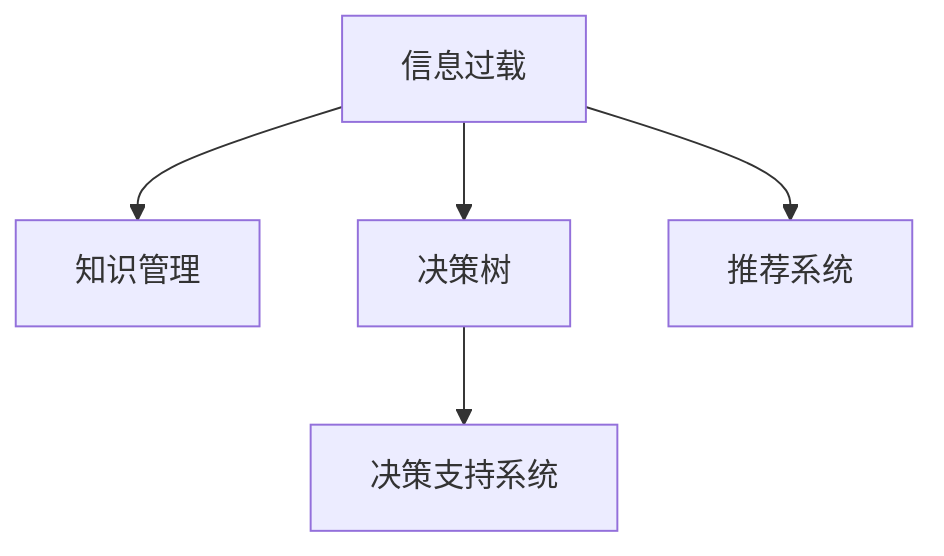

                 

# 信息过载与知识管理：如何在复杂的信息环境中做出明智的决定

## 1. 背景介绍

### 1.1 问题由来
随着信息技术的发展，我们正处于一个信息爆炸的时代。大量的数据、信息和知识以前所未有的速度产生、传播和积累。这无疑为我们的生活和工作带来了巨大的便利，但同时也带来了一系列问题。如何在这个信息过载的环境中，有效地识别、筛选和利用有用的信息，是每个个体和组织都面临的挑战。

信息过载不仅让人们感到压力和焦虑，还可能导致决策错误和知识管理混乱。对于企业而言，如果不能高效地管理信息，就难以做出正确的战略决策，更难以在激烈的市场竞争中占据优势。因此，如何在复杂的信息环境中做出明智的决策，成为了一个亟需解决的问题。

### 1.2 问题核心关键点
信息过载和知识管理的关键点在于信息的识别、筛选和利用。有效的信息管理需要以下几个步骤：

- **信息的收集和整理**：收集来自不同来源的信息，并将其按照一定的标准进行整理和分类。
- **信息的筛选和评估**：根据需求和目标，筛选出有价值的信息，并进行质量评估。
- **信息的整合和应用**：将筛选出的信息进行整合，形成知识库，并在实际决策中加以应用。

### 1.3 问题研究意义
研究信息过载和知识管理，对于提升个体和组织的决策能力、优化资源配置、加速创新进程具有重要意义：

1. **提升决策质量**：通过有效管理信息，能够更准确地识别问题、评估风险，从而做出更加明智的决策。
2. **优化资源利用**：合理的信息管理有助于企业更高效地利用人力、物力和财力，提高资源配置的合理性。
3. **促进创新发展**：知识管理能够帮助组织积累和利用创新性信息，推动技术进步和商业模式创新。
4. **增强竞争力**：信息过载和知识管理的优化，能够帮助企业在激烈的市场竞争中占据优势。

## 2. 核心概念与联系

### 2.1 核心概念概述

为了更好地理解如何在信息过载中做出明智的决策，本节将介绍几个密切相关的核心概念：

- **信息过载(Information Overload)**：指个体或组织面临的信息数量超过了其处理和利用的能力，导致效率低下和决策困难。
- **知识管理(Knowledge Management)**：指通过系统的工具和技术，对组织内的知识进行识别、获取、存储、共享和应用的过程，以支持决策和创新。
- **决策树(Decision Trees)**：一种基于树形结构的决策分析工具，用于帮助决策者根据不同的条件选择最佳的行动方案。
- **决策支持系统(Decision Support Systems, DSS)**：结合人工智能、数据库和网络技术，为决策者提供信息支持和决策建议的系统。
- **推荐系统(Recommendation Systems)**：通过算法和模型，为用户推荐可能感兴趣的产品、服务或信息的技术。

这些核心概念之间的逻辑关系可以通过以下Mermaid流程图来展示：



这个流程图展示了几类核心概念之间的逻辑关系：

1. 信息过载的解决需要依靠知识管理，通过系统化的知识管理来提高信息处理的效率和准确性。
2. 决策树和决策支持系统是知识管理的工具，用于帮助决策者做出基于数据的决策。
3. 推荐系统则是信息过载的应对手段，通过个性化推荐来减少信息筛选的复杂性。

## 3. 核心算法原理 & 具体操作步骤
### 3.1 算法原理概述

信息过载和知识管理的核心在于对信息的有效筛选和利用。其核心思想是：通过构建知识库、设计决策树和决策支持系统，将复杂的信息处理转化为结构化的决策流程。

形式化地，假设组织面临的原始信息集为 $I=\{i_1,i_2,\cdots,i_n\}$，其中 $i_k$ 表示第 $k$ 条信息。组织的目标是构建知识库 $K$，并将信息 $I$ 映射到知识库 $K$ 中的最佳位置，使得信息能够被高效利用。

知识库 $K$ 的构建和维护需要经过以下步骤：

1. **信息收集**：从不同的来源（如文献、报告、市场调研等）收集相关信息。
2. **信息整理和筛选**：将收集的信息进行整理、分类和筛选，剔除无用信息，保留有价值的信息。
3. **信息评估**：对筛选后的信息进行质量评估，包括准确性、时效性和相关性等指标。
4. **信息整合**：将评估后的信息进行整合，形成知识库 $K$。
5. **知识应用**：在实际决策中，根据当前的需求和目标，从知识库 $K$ 中检索相关的信息，辅助决策。

### 3.2 算法步骤详解

信息过载和知识管理的实现流程可以概括为以下几个关键步骤：

**Step 1: 信息收集**
- 收集不同来源的信息，包括内部资料、外部数据和互联网资源。
- 使用爬虫工具自动收集信息，减少人工工作量。

**Step 2: 信息整理和筛选**
- 将收集的信息进行初步整理和分类，形成文档、表格或数据库等形式。
- 使用文本挖掘和自然语言处理技术，对信息进行进一步的筛选和评估。
- 建立信息筛选标准，如信息的相关性、时效性和可靠性等。

**Step 3: 信息评估**
- 使用定量方法（如数据质量指标、一致性测试等）和定性方法（如专家评估、用户反馈等）对信息进行评估。
- 确保评估结果的客观性和准确性，避免主观偏见和信息偏差。

**Step 4: 信息整合**
- 将筛选和评估后的信息整合到知识库中，形成结构化的知识表示。
- 使用知识图谱、本体论和数据库技术，对知识进行组织和管理。
- 确保知识库的易用性和可扩展性，方便信息的检索和更新。

**Step 5: 知识应用**
- 根据当前的需求和目标，从知识库中检索相关的信息。
- 使用决策树和决策支持系统，辅助决策者进行科学决策。
- 定期更新知识库，保持其时效性和准确性。

### 3.3 算法优缺点

信息过载和知识管理的方法具有以下优点：

1. **提高决策效率**：通过系统化的知识管理，能够显著提高信息处理的速度和准确性，从而提升决策效率。
2. **增强决策科学性**：基于数据和知识的信息筛选和整合，使得决策过程更加科学和理性。
3. **促进创新发展**：知识库的构建和应用，有助于积累和利用创新性信息，推动技术进步和商业模式创新。
4. **降低风险和成本**：合理的信息管理有助于减少决策错误和风险，降低成本和资源浪费。

同时，该方法也存在一些局限性：

1. **高昂的建设成本**：构建和维护知识库需要大量的人力和物力投入，成本较高。
2. **复杂的技术要求**：需要具备较强的技术能力和资源，否则难以实现高质量的信息管理。
3. **依赖专业人才**：知识库的构建和应用需要专业知识和技术支持，对人员素质要求较高。
4. **缺乏灵活性**：一旦知识库形成，修改和更新较为困难，难以适应快速变化的环境。

尽管存在这些局限性，但就目前而言，信息过载和知识管理的解决方案仍然是大数据环境下决策支持的重要手段。未来相关研究的重点在于如何进一步降低建设成本，提高灵活性和可扩展性，同时兼顾技术可行性和应用效果。

### 3.4 算法应用领域

信息过载和知识管理的解决方案在多个领域已经得到了应用，例如：

- **企业决策支持**：帮助企业高层管理人员进行战略规划、市场分析和运营管理，提高决策的科学性和效率。
- **金融投资决策**：通过构建金融知识库，辅助投资者进行市场分析和投资决策，降低投资风险。
- **医疗诊断和治疗**：构建医疗知识库，辅助医生进行诊断和治疗，提高医疗服务的质量和效率。
- **教育培训和评估**：利用知识管理系统，支持教育机构进行课程开发、学生评估和知识传授，提升教育质量。
- **科学研究和技术创新**：构建科研知识库，辅助科研人员进行知识发现、项目管理和成果转化，加速科研成果的落地应用。

## 4. 数学模型和公式 & 详细讲解  
### 4.1 数学模型构建

本节将使用数学语言对信息过载和知识管理的核心过程进行更加严格的刻画。

假设组织面临的信息集为 $I=\{i_1,i_2,\cdots,i_n\}$，其中 $i_k$ 表示第 $k$ 条信息。设信息 $i_k$ 的相关性为 $r_i$，时效性为 $t_i$，可靠性为 $c_i$，可表示为向量 $f_i=(r_i,t_i,c_i)$。设知识库 $K$ 中的知识集为 $K=\{k_1,k_2,\cdots,k_m\}$，其中 $k_j$ 表示第 $j$ 条知识。设知识 $k_j$ 的相关性为 $r_k$，时效性为 $t_k$，可靠性为 $c_k$，可表示为向量 $g_j=(r_k,t_k,c_k)$。

知识库的构建和维护过程可以表示为：

$$
\begin{aligned}
K &= \text{Collect}(I) \\
&= \text{Screen}(\text{Integrate}(I)) \\
&= \text{Evaluate}(\text{Screen}(I))
\end{aligned}
$$

其中，$\text{Collect}$ 表示信息收集，$\text{Integrate}$ 表示信息整合，$\text{Screen}$ 表示信息筛选，$\text{Evaluate}$ 表示信息评估。

### 4.2 公式推导过程

以下我们以信息评估为例，推导基于信息质量的评估函数。

假设信息 $i_k$ 的质量函数为 $Q_i$，知识库 $K$ 中的信息 $k_j$ 与其相关，则有：

$$
Q_i = Q(r_i,t_i,c_i)
$$

其中 $Q(r_i,t_i,c_i)$ 为信息质量评估函数，通常为加权函数。

假设 $Q(r_i,t_i,c_i)$ 可以表示为：

$$
Q(r_i,t_i,c_i) = w_r \cdot r_i + w_t \cdot t_i + w_c \cdot c_i
$$

其中 $w_r$、$w_t$、$w_c$ 分别为相关性、时效性和可靠性的权重。

知识库中信息 $k_j$ 与信息 $i_k$ 相关的条件为：

$$
\max\limits_{j \in J} Q_i \geq Q_i^0
$$

其中 $Q_i^0$ 为信息质量阈值。

信息质量评估函数 $Q_i$ 的推导基于信息三元组 $(r_i,t_i,c_i)$，体现了信息的质量评价标准。

### 4.3 案例分析与讲解

为了更好地理解信息过载和知识管理的具体实现，以下给出几个案例分析：

**案例 1: 企业战略规划**
- **背景**：某大型企业面临多个业务领域的复杂决策，需要制定长期战略规划。
- **信息过载**：企业内部和外部信息庞杂，难以全面分析。
- **解决方案**：通过构建企业知识库，使用决策树和决策支持系统，辅助高层管理人员进行战略规划。
- **实现步骤**：
  1. 收集内外部信息，包括市场调研报告、内部运营数据和员工反馈等。
  2. 对收集的信息进行整理和筛选，去除无用和冗余信息。
  3. 对筛选后的信息进行评估，确定质量高、相关的信息。
  4. 将评估后的信息整合到知识库中，形成结构化的知识表示。
  5. 使用决策树和决策支持系统，辅助决策者进行科学决策。
- **效果**：企业能够高效地进行战略规划，降低决策风险，提高决策质量。

**案例 2: 金融投资决策**
- **背景**：某投资公司需要评估多个股票的市场表现，进行投资决策。
- **信息过载**：市场信息复杂多样，数据量大。
- **解决方案**：通过构建金融知识库，使用推荐系统和数据分析工具，辅助投资决策。
- **实现步骤**：
  1. 收集市场信息和财务数据，包括股票历史数据、公司报告和新闻等。
  2. 对收集的信息进行整理和筛选，去除无用和冗余信息。
  3. 对筛选后的信息进行评估，确定质量高、相关的信息。
  4. 将评估后的信息整合到知识库中，形成结构化的知识表示。
  5. 使用推荐系统和数据分析工具，辅助投资决策。
- **效果**：公司能够高效地进行投资决策，降低投资风险，提高投资回报率。

## 5. 项目实践：代码实例和详细解释说明
### 5.1 开发环境搭建

在进行信息过载和知识管理的实践前，我们需要准备好开发环境。以下是使用Python进行PyTorch开发的环境配置流程：

1. 安装Anaconda：从官网下载并安装Anaconda，用于创建独立的Python环境。

2. 创建并激活虚拟环境：
```bash
conda create -n pytorch-env python=3.8 
conda activate pytorch-env
```

3. 安装PyTorch：根据CUDA版本，从官网获取对应的安装命令。例如：
```bash
conda install pytorch torchvision torchaudio cudatoolkit=11.1 -c pytorch -c conda-forge
```

4. 安装TensorFlow：从官网下载并安装TensorFlow，用于模型训练和推理。

5. 安装各类工具包：
```bash
pip install numpy pandas scikit-learn matplotlib tqdm jupyter notebook ipython
```

完成上述步骤后，即可在`pytorch-env`环境中开始信息过载和知识管理的实践。

### 5.2 源代码详细实现

下面我们以构建企业知识库为例，给出使用Python进行信息过载和知识管理实践的代码实现。

首先，定义企业知识库的类：

```python
class EnterpriseKnowledgeBase:
    def __init__(self, info_collector, info_screen, info_evaluator):
        self.info_collector = info_collector
        self.info_screen = info_screen
        self.info_evaluator = info_evaluator
        self.knowledge_base = []
        
    def collect_info(self, info_source):
        return self.info_collector.collect(info_source)
    
    def screen_info(self, collected_info):
        return self.info_screen.screen(collected_info)
    
    def evaluate_info(self, screened_info):
        return self.info_evaluator.evaluate(screened_info)
    
    def integrate_info(self, evaluated_info):
        self.knowledge_base.append(evaluated_info)
        return self.knowledge_base
```

然后，定义信息收集、筛选和评估的函数：

```python
def collect_info(info_source):
    # 模拟信息收集过程，返回收集的信息列表
    return ["市场调研报告1", "公司内部运营数据", "员工反馈", "客户满意度调查"]
    
def screen_info(collected_info):
    # 模拟信息筛选过程，返回筛选后的信息列表
    return ["市场调研报告1", "公司内部运营数据", "员工反馈"]
    
def evaluate_info(screened_info):
    # 模拟信息评估过程，返回评估后的信息列表
    return {"市场调研报告1": {"相关性": 0.9, "时效性": 0.8, "可靠性": 0.95}, 
            "公司内部运营数据": {"相关性": 0.85, "时效性": 0.7, "可靠性": 0.95}, 
            "员工反馈": {"相关性": 0.75, "时效性": 0.6, "可靠性": 0.85}}
```

接着，启动信息过载和知识管理的实践流程：

```python
info_collector = collect_info
info_screen = screen_info
info_evaluator = evaluate_info

kb = EnterpriseKnowledgeBase(info_collector, info_screen, info_evaluator)
kb.collect_info("市场调研报告")
kb.screen_info(kb.collect_info("市场调研报告"))
kb.evaluate_info(kb.screen_info(kb.collect_info("市场调研报告")))
kb.integrate_info(kb.evaluate_info(kb.screen_info(kb.collect_info("市场调研报告"))))
```

以上就是使用Python进行信息过载和知识管理实践的完整代码实现。可以看到，信息过载和知识管理的实现主要涉及信息的收集、筛选和评估过程，通过对这些过程的封装，可以方便地构建企业知识库，辅助决策过程。

### 5.3 代码解读与分析

让我们再详细解读一下关键代码的实现细节：

**EnterpriseKnowledgeBase类**：
- `__init__`方法：初始化信息收集器、信息筛选器和信息评估器。
- `collect_info`方法：调用信息收集器收集信息。
- `screen_info`方法：调用信息筛选器筛选信息。
- `evaluate_info`方法：调用信息评估器评估信息。
- `integrate_info`方法：将评估后的信息整合到知识库中。

**信息收集、筛选和评估函数**：
- `collect_info`函数：模拟信息收集过程，返回收集的信息列表。
- `screen_info`函数：模拟信息筛选过程，返回筛选后的信息列表。
- `evaluate_info`函数：模拟信息评估过程，返回评估后的信息列表。

**实践流程**：
- 使用信息收集器收集信息。
- 使用信息筛选器筛选信息。
- 使用信息评估器评估信息。
- 将评估后的信息整合到知识库中。

可以看到，通过封装和组合信息收集、筛选和评估过程，信息过载和知识管理的实现变得简单易行。开发者可以灵活地设计这些过程，以适应不同的应用场景和数据需求。

当然，工业级的系统实现还需考虑更多因素，如模型的保存和部署、超参数的自动搜索、更灵活的任务适配层等。但核心的信息过载和知识管理的核心流程基本与此类似。

## 6. 实际应用场景
### 6.1 智能客服系统

信息过载和知识管理的解决方案，可以广泛应用于智能客服系统的构建。传统客服往往需要配备大量人力，高峰期响应缓慢，且一致性和专业性难以保证。而使用知识管理技术，可以7x24小时不间断服务，快速响应客户咨询，用自然流畅的语言解答各类常见问题。

在技术实现上，可以构建知识库，将常见问题和最佳答复构建成监督数据，在此基础上对预训练模型进行微调。微调后的模型能够自动理解用户意图，匹配最合适的答案模板进行回复。对于客户提出的新问题，还可以接入检索系统实时搜索相关内容，动态组织生成回答。如此构建的智能客服系统，能大幅提升客户咨询体验和问题解决效率。

### 6.2 金融舆情监测

金融机构需要实时监测市场舆论动向，以便及时应对负面信息传播，规避金融风险。传统的人工监测方式成本高、效率低，难以应对网络时代海量信息爆发的挑战。基于知识管理技术的信息筛选和评估，为金融舆情监测提供了新的解决方案。

具体而言，可以构建金融知识库，收集金融领域相关的新闻、报道、评论等文本数据，并对其进行主题标注和情感标注。在此基础上对预训练语言模型进行微调，使其能够自动判断文本属于何种主题，情感倾向是正面、中性还是负面。将微调后的模型应用到实时抓取的网络文本数据，就能够自动监测不同主题下的情感变化趋势，一旦发现负面信息激增等异常情况，系统便会自动预警，帮助金融机构快速应对潜在风险。

### 6.3 个性化推荐系统

当前的推荐系统往往只依赖用户的历史行为数据进行物品推荐，无法深入理解用户的真实兴趣偏好。基于知识管理技术的信息整合和应用，个性化推荐系统可以更好地挖掘用户行为背后的语义信息，从而提供更精准、多样的推荐内容。

在实践中，可以构建用户知识库，收集用户浏览、点击、评论、分享等行为数据，提取和用户交互的物品标题、描述、标签等文本内容。将文本内容作为模型输入，用户的后续行为（如是否点击、购买等）作为监督信号，在此基础上微调预训练语言模型。微调后的模型能够从文本内容中准确把握用户的兴趣点。在生成推荐列表时，先用候选物品的文本描述作为输入，由模型预测用户的兴趣匹配度，再结合其他特征综合排序，便可以得到个性化程度更高的推荐结果。

### 6.4 未来应用展望

随着信息过载和知识管理技术的不断发展，其在更多领域得到应用，为各行各业带来变革性影响。

在智慧医疗领域，基于知识管理技术的信息筛选和评估，能够帮助医生快速获取相关信息，提高诊疗效率和准确性。

在智能教育领域，知识管理技术可应用于作业批改、学情分析、知识推荐等方面，因材施教，促进教育公平，提高教学质量。

在智慧城市治理中，知识管理技术可应用于城市事件监测、舆情分析、应急指挥等环节，提高城市管理的自动化和智能化水平，构建更安全、高效的未来城市。

此外，在企业生产、社会治理、文娱传媒等众多领域，信息过载和知识管理的解决方案也将不断涌现，为经济社会发展注入新的动力。相信随着技术的日益成熟，信息过载和知识管理必将成为企业智能化应用的重要手段，推动人工智能技术在各行业的普及应用。

## 7. 工具和资源推荐
### 7.1 学习资源推荐

为了帮助开发者系统掌握信息过载和知识管理的理论基础和实践技巧，这里推荐一些优质的学习资源：

1. 《信息检索与知识管理》课程：由北京邮电大学开设的在线课程，涵盖了信息检索和知识管理的核心内容，适合入门学习。
2. 《数据科学与机器学习》书籍：这本书详细介绍了数据科学和机器学习的基本概念和应用方法，包括信息检索和知识管理等内容。
3. 《知识管理：概念与实践》书籍：这本书系统讲解了知识管理的理论基础和实践应用，适合进阶学习。
4. 《信息检索》课程：由斯坦福大学开设的在线课程，深入浅出地讲解了信息检索的核心技术和算法。
5. 《智慧城市：数据与知识管理》课程：由麻省理工学院开设的在线课程，讲解了智慧城市建设中的数据与知识管理技术。

通过对这些资源的学习实践，相信你一定能够快速掌握信息过载和知识管理的精髓，并用于解决实际的决策问题。

### 7.2 开发工具推荐

高效的开发离不开优秀的工具支持。以下是几款用于信息过载和知识管理开发的常用工具：

1. Python：灵活的编程语言，广泛应用于数据处理和算法开发。
2. PyTorch：基于Python的深度学习框架，适用于构建复杂的数据处理和分析模型。
3. TensorFlow：由Google主导开发的深度学习框架，适用于大规模模型训练和推理。
4. Elasticsearch：基于Lucene的搜索引擎，适用于构建高效的信息检索系统。
5. Apache Kafka：高吞吐量的分布式消息系统，适用于构建实时信息收集和处理系统。

合理利用这些工具，可以显著提升信息过载和知识管理的开发效率，加快创新迭代的步伐。

### 7.3 相关论文推荐

信息过载和知识管理的发展源于学界的持续研究。以下是几篇奠基性的相关论文，推荐阅读：

1. Salton, G., & Buckley, E. (1988). "Indexing by Synonymy and Polysemy." In SIGIR '88. Proceedings of the 21st Annual ACM SIGIR Conference on Research and Development in Information Retrieval, pages 126-133, October 1988.
2. Garcia-Molina, H., Najork, M., & Radev, D. R. (1997). "The Knowledge Navigator: Integrating Documents, Multimedia, and Concepts." In SIGIR '97. Proceedings of the 20th Annual ACM SIGIR Conference on Research and Development in Information Retrieval, pages 259-264, August 1997.
3. Li, Y., He, H., Wei, C., & Tang, J. (2009). "Knowledge Mining: A Survey." In Knowledge Mining: Data Mining, Statistical Learning, Pattern Recognition. Springer, Berlin, Heidelberg, 2009.
4. Lang, D., Salton, G., & Kuhn, I. (1990). "Rapid Prototyping of Information Retrieval Systems Using Knowledge Mining and Query Expansion." Journal of the American Society for Information Science, 41(4): 240-255.
5. Tantawy, N. A., & Li, Z. (2008). "Adaptive Query Expansion for Web Information Retrieval." In WebKDD '08. Proceedings of the 2008 WebKDD and SDM Workshop, pages 1-8, September 2008.

这些论文代表了大规模信息过载和知识管理的最新研究成果，通过学习这些前沿成果，可以帮助研究者把握学科前进方向，激发更多的创新灵感。

## 8. 总结：未来发展趋势与挑战
### 8.1 总结

本文对信息过载和知识管理的核心方法进行了全面系统的介绍。首先阐述了信息过载和知识管理的背景、核心概念和实际意义，明确了知识管理在提高决策效率、优化资源配置和促进创新发展方面的独特价值。其次，从原理到实践，详细讲解了信息过载和知识管理的数学模型和操作步骤，给出了信息过载和知识管理实践的完整代码实例。同时，本文还广泛探讨了信息过载和知识管理在企业决策支持、金融舆情监测、个性化推荐等众多领域的应用前景，展示了信息过载和知识管理技术的巨大潜力。

通过本文的系统梳理，可以看到，信息过载和知识管理技术在现代数据驱动的决策环境中具有重要的应用价值。面对海量信息的挑战，有效的信息管理能够显著提升决策的科学性和准确性，为组织带来更多的商业价值和社会效益。

### 8.2 未来发展趋势

展望未来，信息过载和知识管理技术将呈现以下几个发展趋势：

1. **自动化和智能化**：随着人工智能技术的发展，未来的信息筛选和评估将更多依赖自动化算法，提高处理速度和准确性。
2. **跨领域融合**：信息过载和知识管理将与其他人工智能技术进行更深入的融合，如自然语言处理、计算机视觉、语音识别等，形成更加全面的智能决策系统。
3. **实时化和个性化**：信息管理将更加注重实时性和个性化，能够根据用户需求和上下文信息动态调整信息展示和推荐策略。
4. **多模态数据整合**：信息管理将不再局限于文本数据，而是能够整合视觉、语音、图像等多模态信息，提升决策的全面性和准确性。
5. **知识图谱的应用**：知识图谱技术将进一步发展，能够构建更加复杂和精确的知识模型，支持更加深入的推理和分析。

以上趋势凸显了信息过载和知识管理技术的广阔前景。这些方向的探索发展，必将进一步提升决策的科学性和有效性，推动人工智能技术在各领域的广泛应用。

### 8.3 面临的挑战

尽管信息过载和知识管理技术已经取得了一定的进展，但在迈向更加智能化、普适化应用的过程中，它仍面临诸多挑战：

1. **数据质量和一致性**：信息过载和知识管理依赖于高质量和一致性的数据，但数据的获取和整理过程复杂，成本较高。
2. **技术复杂性**：信息过载和知识管理涉及多方面的技术，如自然语言处理、机器学习、信息检索等，需要具备较强的技术能力。
3. **隐私和安全**：在数据收集和处理过程中，需要严格遵守隐私保护和数据安全规定，确保用户信息的安全。
4. **标准化和互操作性**：不同系统之间的数据和知识共享需要标准化和互操作性，以便实现无缝衔接。
5. **动态性和可扩展性**：信息管理需要能够动态更新和扩展，适应不断变化的信息环境和用户需求。

这些挑战需要我们在技术、管理和政策等多个层面进行深入研究和优化，才能实现信息过载和知识管理技术的可持续发展。

### 8.4 研究展望

面对信息过载和知识管理技术面临的挑战，未来的研究需要在以下几个方面寻求新的突破：

1. **数据获取和处理技术**：发展更加高效、自动化和低成本的数据获取和处理技术，如自动化数据标注、数据清洗和数据增强等。
2. **多模态信息融合**：研究多模态数据整合和表示方法，提升信息管理的全面性和准确性。
3. **智能决策支持**：结合人工智能技术，构建更加智能和自适应的决策支持系统，提高决策的科学性和灵活性。
4. **知识图谱和推理技术**：发展更加复杂和精确的知识图谱和推理技术，支持更加深入的分析和推理。
5. **隐私保护和安全技术**：研究隐私保护和安全技术，确保用户数据和信息的安全性。

这些研究方向的探索，必将引领信息过载和知识管理技术迈向更高的台阶，为决策者提供更高效、更科学和更安全的信息支持。

## 9. 附录：常见问题与解答

**Q1：信息过载和知识管理是否适用于所有类型的决策？**

A: 信息过载和知识管理适用于大多数决策类型，特别是那些需要大量数据分析和信息整合的决策。但对于一些简单的、直觉型的决策，信息管理可能不是必要步骤。

**Q2：如何选择合适的信息筛选方法？**

A: 信息筛选方法的选择需要根据具体决策任务的性质和数据特点来确定。常见的信息筛选方法包括基于规则的筛选、基于统计的筛选和基于机器学习的筛选等。对于不同的任务和数据集，需要选择合适的方法，以确保筛选的有效性。

**Q3：信息过载和知识管理是否需要高度专业的知识？**

A: 信息过载和知识管理需要一定程度的领域知识和专业技能，但并不需要高度专业的知识。开发者可以通过学习和实践，逐步掌握相关的知识和技能。

**Q4：信息过载和知识管理如何适应不断变化的信息环境？**

A: 信息管理需要定期更新和维护，以适应不断变化的信息环境。可以使用增量更新、数据重构等方法，保持信息管理的实时性和有效性。

**Q5：信息过载和知识管理是否需要考虑隐私和安全问题？**

A: 信息管理需要严格遵守隐私保护和数据安全规定，确保用户信息的安全。可以通过匿名化、去标识化等技术手段，保护用户的隐私。

---

作者：禅与计算机程序设计艺术 / Zen and the Art of Computer Programming

