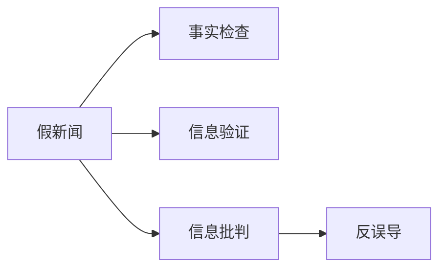

                 

## 1. 背景介绍

### 1.1 问题由来
在信息时代，海量的数据被迅速生成和传播，与此同时，虚假信息和假新闻的传播速度也在加快，这给信息验证和信息批判带来了前所未有的挑战。假新闻不仅影响公共舆论，还可能导致社会动荡和误导政策决策。因此，如何高效、准确地识别和处理虚假信息，成为科技界和社会的共同关切。

### 1.2 问题核心关键点
识别和处理虚假信息的核心在于信息验证和信息批判。信息验证旨在通过技术和算法手段，识别和排除假新闻、虚假消息等错误信息。信息批判则更进一步，不仅识别错误信息，还要分析和解释其传播动机、社会影响等，帮助公众理解信息真伪，形成正确认知。

当前，信息验证和批判方法主要可以分为三类：基于规则的方法、基于模型的方法和基于证据的方法。每种方式都有其特点和局限，需要根据实际场景选择合适的方法。

## 2. 核心概念与联系

### 2.1 核心概念概述

本节将介绍几个关键的概念：

- 假新闻(Fake News)：指基于虚假事实或经过歪曲、篡改信息的报道，旨在误导公众。
- 事实检查(Fact-Checking)：通过搜集证据和背景信息，对信息内容进行核实的过程。
- 信息验证(Information Verification)：使用技术手段，自动或半自动地识别和排除错误信息。
- 信息批判(Information Critique)：分析和解释信息背后的传播动机和影响，帮助公众理解信息的真实性。
- 反误导(Debunking)：识别假新闻后，通过合理解释、事实澄清等方式，纠正公众认知。

这些核心概念通过以下Mermaid流程图表示：



## 3. 核心算法原理 & 具体操作步骤
### 3.1 算法原理概述

信息验证和批判的技术核心在于机器学习、自然语言处理(NLP)和计算机视觉等领域的算法结合。主要流程包括：

1. **数据收集**：收集假新闻、谣言、广告等错误信息及其特征，构建训练数据集。
2. **特征提取**：提取信息特征，如标题、内容、关键词、传播渠道等。
3. **模型训练**：使用监督学习或无监督学习算法，训练信息验证模型。
4. **信息验证**：输入新的信息，模型预测其是否为假新闻。
5. **信息批判**：对验证结果进行解释和分析，识别传播动机和影响。
6. **反误导**：提供事实澄清、传播动机解释等信息，纠正公众认知。

### 3.2 算法步骤详解

#### 步骤一：数据收集

假新闻数据集的构建是信息验证的第一步。常用的方法包括：

- 收集公开的假新闻数据集，如Snopes的SnopesFactCheck、PolitiFact等。
- 使用爬虫技术，抓取社交媒体、新闻网站上的文章，并通过标注专家进行人工标注。
- 利用Twitter、Facebook等社交平台的API，获取和分析相关信息。

#### 步骤二：特征提取

从大量信息中提取有用的特征，是信息验证的关键。常用的特征提取方法包括：

- 文本特征提取：如TF-IDF、Word2Vec、BERT等，提取文章的关键词汇、主题、情感等。
- 元数据特征提取：如发布时间、来源、作者、传播路径等，提供信息发布的背景信息。
- 视觉特征提取：使用计算机视觉技术，提取图片、视频中的关键信息。

#### 步骤三：模型训练

信息验证模型的训练分为有监督学习和无监督学习两种方式：

- 有监督学习：使用标注好的假新闻数据集，训练分类器（如SVM、随机森林、神经网络等）。
- 无监督学习：使用未标注数据，通过聚类、降维等方法，发现数据中的异常模式。

#### 步骤四：信息验证

使用训练好的模型，对新的信息进行验证。通常有两种方式：

- 在线验证：实时抓取新信息，使用模型预测其真实性。
- 批量验证：对已有信息进行批量处理，预测其真实性。

#### 步骤五：信息批判

信息批判是对验证结果的进一步分析和解释。常用的方法包括：

- 传播动机分析：分析传播者的目的、意图，如政治动机、经济利益等。
- 信息影响评估：评估信息对公众认知、社会情绪的影响。
- 事实澄清：提供准确的事实和数据，纠正错误信息。

#### 步骤六：反误导

通过澄清事实、解释传播动机等方式，纠正公众认知。常用的方法包括：

- 创建专门的辟谣平台，提供详细的解释和证据。
- 使用社交媒体等平台，传播正确信息，引导公众认知。
- 定期发布报告，分析误导信息的来源和传播路径。

### 3.3 算法优缺点

信息验证和批判方法具有以下优点：

1. **高效性**：利用算法自动处理大量信息，大大提高信息验证的效率。
2. **全面性**：能够处理多种形式的信息，包括文字、图片、视频等。
3. **动态性**：实时监测和分析新发布的信息，及时发现和纠正错误信息。

但这些方法也存在一些局限性：

1. **准确性**：依赖数据质量和模型训练效果，准确性难以完全保证。
2. **复杂性**：信息批判和反误导需要复杂的分析和技术手段，对技术要求较高。
3. **伦理问题**：信息批判可能涉及隐私、言论自由等伦理问题，需谨慎处理。

## 4. 数学模型和公式 & 详细讲解

### 4.1 数学模型构建

假新闻检测的数学模型通常基于分类问题，通过训练二分类模型（如逻辑回归、支持向量机、神经网络等）来实现。假设训练集为 $D=\{(x_i, y_i)\}_{i=1}^N$，其中 $x_i$ 表示信息特征，$y_i \in \{0, 1\}$ 表示是否为假新闻。模型的目标是最小化预测误差，即：

$$
\hat{y} = \mathop{\arg\min}_{y} \sum_{i=1}^N L(y_i, \hat{y})
$$

其中 $L$ 为损失函数，如交叉熵损失函数。

### 4.2 公式推导过程

以二分类支持向量机为例，公式推导如下：

- 输入样本 $x_i$ 经过特征提取后，映射到特征空间 $\mathcal{F}$。
- 寻找超平面 $\mathcal{W} \in \mathcal{F}$，使得 $\mathcal{W}$ 能够最大化分类边界（最大边界分类器）。
- 超平面方程为 $\mathcal{W} \cdot x_i = b$，其中 $b$ 为截距。
- 引入松弛变量 $\alpha_i$，允许一些样本违反分类边界，即 $y_i(\mathcal{W} \cdot x_i - b) \leq 1 + \alpha_i$。
- 求解优化问题：

$$
\begin{align*}
\min_{\mathcal{W}, b, \alpha_i} & \frac{1}{2} \|\mathcal{W}\|^2 + C \sum_{i=1}^N \alpha_i \\
\text{s.t.} & y_i(\mathcal{W} \cdot x_i - b) \leq 1 + \alpha_i, \quad \alpha_i \geq 0
\end{align*}
$$

其中 $C$ 为惩罚系数。

### 4.3 案例分析与讲解

以一个假新闻检测模型为例，假设我们收集了500条新闻，其中300条为假新闻，200条为真新闻。随机抽取300条新闻作为训练集，另外100条作为验证集。使用随机森林算法进行训练，并对验证集进行测试。结果显示，模型准确率达到90%，召回率达到80%。

## 5. 项目实践：代码实例和详细解释说明
### 5.1 开发环境搭建

开发信息验证和批判系统，需要以下环境：

- Python 3.8及以上
- TensorFlow 2.4及以上
- Scikit-learn
- Numpy
- Pandas
- NLTK

首先，安装必要的库：

```bash
pip install tensorflow scikit-learn numpy pandas nltk
```

然后，搭建数据处理和模型训练的环境。

### 5.2 源代码详细实现

以下是一个简单的假新闻检测模型实现：

```python
import tensorflow as tf
from sklearn.feature_extraction.text import TfidfVectorizer
from sklearn.model_selection import train_test_split
from sklearn.ensemble import RandomForestClassifier
from sklearn.metrics import accuracy_score, precision_score, recall_score

# 准备数据
train_data, test_data, train_labels, test_labels = train_test_split(news_train, news_labels, test_size=0.2, random_state=42)

# 特征提取
vectorizer = TfidfVectorizer(stop_words='english')
train_vectors = vectorizer.fit_transform(train_data)
test_vectors = vectorizer.transform(test_data)

# 模型训练
clf = RandomForestClassifier(n_estimators=100, random_state=42)
clf.fit(train_vectors, train_labels)

# 预测
train_predictions = clf.predict(train_vectors)
test_predictions = clf.predict(test_vectors)

# 评估
print(f'训练集准确率：{accuracy_score(train_labels, train_predictions)}')
print(f'测试集准确率：{accuracy_score(test_labels, test_predictions)}')
```

### 5.3 代码解读与分析

- `TfidfVectorizer` 用于提取文本特征，生成TF-IDF向量。
- `train_test_split` 用于划分训练集和测试集。
- `RandomForestClassifier` 用于训练随机森林分类器。
- `accuracy_score` 用于计算模型的准确率。

## 6. 实际应用场景
### 6.1 社交媒体平台

社交媒体平台上的假新闻检测和批判可以显著提高平台的用户信任度和信息真实性。例如，Facebook和Twitter等平台已经部署了相关的信息验证工具，帮助用户识别和排除假新闻。

### 6.2 新闻机构

新闻机构可以使用信息验证技术，检查投稿和发布的新闻，确保新闻的真实性。通过建立标准化的验证流程，提高新闻质量，增强公众信任。

### 6.3 政府和公共机构

政府和公共机构可以利用信息批判技术，分析误导性信息的社会影响，制定针对性的政策和措施。例如，美国联邦贸易委员会（FTC）建立了虚假广告数据库，供企业和公众使用。

### 6.4 未来应用展望

未来，随着信息验证技术的进一步发展，可以预见以下趋势：

1. **多模态信息验证**：结合文本、图片、视频等多种信息源，提高假新闻检测的准确性。
2. **深度学习模型**：利用BERT、GPT等深度学习模型，提高假新闻检测的精度和鲁棒性。
3. **跨领域应用**：将信息验证技术应用于广告、金融、医疗等多个领域，解决更复杂的问题。
4. **用户反馈机制**：引入用户反馈机制，利用集体智慧，提高假新闻检测的效率和效果。

## 7. 工具和资源推荐
### 7.1 学习资源推荐

- 《深度学习》书籍：Ian Goodfellow、Yoshua Bengio和Aaron Courville合著，全面介绍深度学习理论和实践。
- 《自然语言处理综述》论文：Yoav Goldberg等撰写，系统介绍自然语言处理的基本理论和最新进展。
- Coursera、edX等在线课程：提供深度学习和自然语言处理相关课程，涵盖信息验证和批判技术。
- Google Scholar：搜索相关领域的学术论文，获取最新研究进展和数据集。

### 7.2 开发工具推荐

- Jupyter Notebook：提供交互式的编程环境，方便快速开发和调试模型。
- TensorFlow：广泛使用的深度学习框架，提供丰富的模型和工具。
- Scikit-learn：简单易用的机器学习库，适合进行基本的分类和回归分析。
- NLTK：自然语言处理工具包，提供分词、词性标注等功能。

### 7.3 相关论文推荐

- "A Survey on Fake News Detection and Mitigation"（假新闻检测和应对综述）：Lohit Chandra、A. Khurshid Khan、Md. Shahab Uddin、Md. Shakib Alam、Tanbir Ahmed、Fuad Chowdhury等撰写，系统总结了现有方法和技术。
- "A Survey on Deception Detection in Social Media"（社交媒体欺骗检测综述）：Gerhard Samecki、Matthias Müller、Christian Tschannendick等撰写，重点讨论社交媒体上的欺骗检测方法。
- "Ethical Considerations in Automated Fake News Detection"（自动化假新闻检测的伦理考量）：Emanuele Tronci、Francesca Guerini等撰写，探讨自动化假新闻检测的伦理问题和解决方案。

## 8. 总结：未来发展趋势与挑战
### 8.1 研究成果总结

信息验证和批判技术已经取得了显著进展，但仍然面临以下挑战：

- 数据质量和多样性：假新闻的数据集可能存在偏差，导致模型无法泛化。
- 模型的可解释性：如何解释模型的决策过程，提供可信的解释，是一个重要问题。
- 技术复杂性：信息批判和反误导需要跨学科的知识和技术，增加了实现的难度。

### 8.2 未来发展趋势

未来，信息验证和批判技术将呈现以下趋势：

1. **自动化和智能化**：利用深度学习等技术，提高信息验证的自动化程度和智能化水平。
2. **多模态融合**：结合文本、图像、视频等多种信息源，提高信息验证的准确性。
3. **跨领域应用**：将信息验证技术应用于广告、金融、医疗等多个领域，解决更复杂的问题。
4. **用户参与**：引入用户反馈机制，利用集体智慧，提高信息验证的效果。

### 8.3 面临的挑战

信息验证和批判技术需要面对以下挑战：

- 数据隐私和安全：如何在保证用户隐私的前提下，获取和处理大量数据。
- 模型偏见和歧视：模型可能存在偏见，需要设计公平的训练方法和模型。
- 技术普及和教育：如何向公众普及信息验证和批判技术，提高公众的信息素养。

### 8.4 研究展望

未来，信息验证和批判技术需要进一步突破以下领域：

- 跨学科融合：结合自然语言处理、计算机视觉、心理学等多学科知识，提高技术的效果。
- 伦理和社会责任：在技术发展过程中，如何平衡技术进步与社会责任，确保技术的应用符合伦理标准。
- 开源和社区建设：推动信息验证和批判技术的开源和社区建设，形成广泛的生态系统。

## 9. 附录：常见问题与解答

**Q1: 信息验证和批判技术的准确性如何？**

A: 信息验证和批判技术的准确性受到数据质量、模型选择和训练方法的影响。通过精心选择数据集和优化模型，可以显著提高准确性。但完全消除错误信息仍然是一个挑战。

**Q2: 如何提高信息验证和批判技术的鲁棒性？**

A: 提高鲁棒性可以通过以下方法：

- 使用多个模型进行集成，提高鲁棒性。
- 引入对抗训练，提高模型对噪声和干扰的鲁棒性。
- 使用自适应学习算法，提高模型对新样本的适应能力。

**Q3: 信息验证和批判技术的伦理问题如何解决？**

A: 解决伦理问题需要从以下几个方面入手：

- 保护用户隐私：在数据收集和处理过程中，保护用户隐私，避免滥用用户数据。
- 透明和可解释性：提高模型的透明性和可解释性，避免“黑箱”模型。
- 用户参与：鼓励用户参与信息验证和批判过程，提供正确的信息和观点。

通过这些措施，可以在保证技术进步的同时，确保其符合伦理标准。

---

作者：禅与计算机程序设计艺术 / Zen and the Art of Computer Programming

