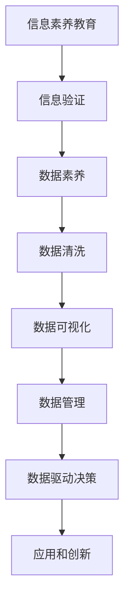

                 

# 信息验证和信息素养教育重要性：为数字时代培养信息素养能力

> 关键词：信息验证, 信息素养教育, 数字时代, 数据素养, 数据清洗, 数据可视化, 数据管理, 数据驱动决策, 信息素养模型, 人工智能驱动教育

## 1. 背景介绍

### 1.1 问题由来
随着信息技术的高速发展和普及，大数据、云计算、人工智能等技术的广泛应用，信息时代已经成为人类社会的基本特征。信息素养（Information Literacy），即在信息海洋中识别、评估、管理、利用和创造信息的能力，成为现代信息社会不可或缺的技能。然而，信息泛滥和虚假信息的泛滥，也给人们的信息获取和应用带来了诸多挑战。如何在海量信息中筛选出真实、有价值的内容，进行有效的信息验证，是当前社会和教育领域亟需解决的问题。

### 1.2 问题核心关键点
- **信息泛滥与虚假信息**：互联网时代，信息量爆炸式增长，同时伴随着大量虚假、误导性信息的产生。
- **信息验证的必要性**：真实、准确的信息是决策、学习和研究的基础，错误的信息可能导致误导性决策和行为。
- **信息素养教育的重要性**：通过信息素养教育，培养公众识别、评估和应用信息的能力，提升信息社会的整体信息素养水平。
- **数据驱动决策与知识创新**：在信息社会，数据驱动决策成为常态，信息的真实性、准确性直接关系到决策的效果和知识的创新。

### 1.3 问题研究意义
提升信息验证能力和信息素养水平，对于构建可信、透明、高效的信息社会，推动经济社会可持续发展具有重要意义：

1. **提升公众决策能力**：真实、可靠的信息是正确决策的基础。提升信息素养，有助于公众在信息选择、分析和应用中做出合理决策。
2. **促进教育公平**：通过信息素养教育，帮助学生掌握信息搜索、评估和应用的能力，增强教育公平性。
3. **提高创新能力**：信息素养教育有助于培养学生的批判性思维和问题解决能力，促进创新能力的提升。
4. **推动社会进步**：信息素养水平的提升，可以促进社会各领域的协同进步，推动社会的整体发展。

## 2. 核心概念与联系

### 2.1 核心概念概述

为更好地理解信息验证和信息素养教育的重要意义，本节将介绍几个关键概念：

- **信息素养（Information Literacy）**：指在信息海洋中识别、评估、管理、利用和创造信息的能力。信息素养教育旨在培养信息素养能力，提升个体和组织的信息处理水平。
- **信息验证（Information Verification）**：指对信息源和内容的真实性、准确性进行评估和确认的过程。信息验证是信息素养教育的重要组成部分。
- **数据素养（Data Literacy）**：数据素养是信息素养的重要组成部分，特指在数据获取、处理、分析和应用方面的能力。数据素养教育有助于提升数据驱动决策的能力。
- **数据清洗（Data Cleansing）**：在数据处理过程中，识别和去除数据中的错误、重复、异常值等，以提升数据质量。
- **数据可视化（Data Visualization）**：将数据转换为图形、图表等可视化形式，便于理解和展示数据信息。
- **数据管理（Data Management）**：涉及数据的收集、存储、处理、分析和保护等环节，确保数据的安全、可靠和有效利用。

这些概念之间通过数据获取、处理和应用等环节紧密相连，共同构成了信息验证和信息素养教育的基础框架。

### 2.2 核心概念原理和架构的 Mermaid 流程图



这个流程图展示了信息素养教育的重要环节及其内在联系：

1. **信息素养教育**：培养信息素养能力，是信息验证和数据素养教育的基础。
2. **信息验证**：确保信息真实性，为数据处理和应用提供基础。
3. **数据素养**：涉及数据获取、处理、分析和应用，是信息验证的核心内容。
4. **数据清洗**：提升数据质量，是数据可视化和管理的必要前提。
5. **数据可视化**：以图形、图表等形式展示数据，便于理解和分析。
6. **数据管理**：确保数据的安全、可靠和有效利用，是数据驱动决策的保障。
7. **数据驱动决策**：利用数据进行决策，是信息验证和数据素养教育的最终目标。
8. **应用和创新**：基于数据驱动决策，推动社会各领域的创新和发展。

## 3. 核心算法原理 & 具体操作步骤

### 3.1 算法原理概述

信息验证和信息素养教育的核心在于构建一个高效、可靠的信息处理框架，以确保信息的真实性和可靠性。其算法原理主要包括：

- **信息源评估**：通过评估信息源的可靠性、权威性和时效性，判断其真实性。
- **内容验证**：通过比对、分析和交叉验证等方法，验证信息内容的准确性和一致性。
- **数据清洗和处理**：去除数据中的错误、重复、异常值等，确保数据的质量和一致性。
- **数据可视化**：将数据转换为图形、图表等形式，便于理解和展示。
- **数据驱动决策**：基于数据进行决策，确保决策的科学性和准确性。

### 3.2 算法步骤详解

信息验证和信息素养教育的具体操作步骤如下：

**Step 1: 数据收集和预处理**

- 从可信的来源收集信息，如学术期刊、官方报告、权威网站等。
- 进行数据清洗，去除错误、重复、异常值等，提升数据质量。
- 将数据转换为适合分析的格式，如CSV、JSON等。

**Step 2: 信息源评估**

- 评估信息源的可靠性，如作者背景、出版机构、发布时间等。
- 评估信息源的权威性，如引用次数、专业评价等。
- 评估信息源的时效性，判断信息是否过时或最新。

**Step 3: 内容验证**

- 比对多个信息源的内容，确保信息的一致性和准确性。
- 分析信息的逻辑结构，识别异常和不合理的表述。
- 使用交叉验证方法，如逆向推理、实验验证等，进一步验证信息的真实性。

**Step 4: 数据可视化**

- 使用数据可视化工具，如图表库（如D3.js、ECharts等），将数据转换为图形、图表等形式。
- 根据分析需求，选择合适的图表类型，如柱状图、折线图、散点图等。
- 优化图表布局和样式，提升可读性和美观度。

**Step 5: 数据驱动决策**

- 分析数据，提取关键信息和趋势。
- 基于数据进行决策，确保决策的科学性和准确性。
- 持续跟踪数据变化，及时调整决策策略。

### 3.3 算法优缺点

信息验证和信息素养教育具有以下优点：

1. **提升决策准确性**：通过信息验证和数据清洗，确保信息的真实性和准确性，提升决策的科学性和准确性。
2. **增强数据可靠性**：通过数据清洗和处理，提升数据质量，确保数据的可靠性和一致性。
3. **促进知识创新**：基于数据驱动决策，推动知识的创新和发展。
4. **提高信息素养**：通过信息验证和数据素养教育，培养公众的信息素养能力。

同时，这些方法也存在一些局限性：

1. **工作量大**：数据清洗和验证需要大量时间和精力，对于大规模数据处理尤为耗时。
2. **技术门槛高**：需要掌握数据处理、信息评估和可视化等技术，对技术门槛有一定的要求。
3. **数据质量依赖**：数据质量直接影响信息验证的效果，低质量数据可能误导决策。
4. **信息验证的局限性**：在复杂、多样化的信息环境中，信息验证难以全面覆盖所有情况。

### 3.4 算法应用领域

信息验证和信息素养教育的应用领域非常广泛，涵盖以下方面：

1. **新闻媒体**：通过信息验证，确保新闻报道的真实性和准确性。
2. **政府决策**：基于数据驱动决策，提升政府决策的科学性和透明度。
3. **商业分析**：通过数据清洗和可视化，支持商业分析和决策。
4. **科学研究**：通过数据清洗和验证，确保科学研究的可靠性。
5. **教育领域**：通过信息素养教育，提升学生的信息获取和应用能力。
6. **健康医疗**：通过数据驱动决策，提升医疗诊断和治疗的准确性。
7. **公共安全**：基于数据驱动决策，提升公共安全事件的应对能力。
8. **环境保护**：通过数据处理和分析，支持环境保护和治理。

## 4. 数学模型和公式 & 详细讲解 & 举例说明

### 4.1 数学模型构建

信息验证和数据素养教育的数学模型构建主要包括以下几个方面：

- **信息源评估模型**：评估信息源的可靠性、权威性和时效性，使用评分模型（如PageRank）。
- **内容验证模型**：比对多个信息源的内容，使用文本相似度模型（如余弦相似度）。
- **数据清洗模型**：去除数据中的错误、重复、异常值等，使用统计模型（如均值、中位数、众数）。
- **数据可视化模型**：将数据转换为图形、图表等形式，使用图表库（如D3.js、ECharts）。
- **数据驱动决策模型**：基于数据进行决策，使用统计分析模型（如回归分析、聚类分析）。

### 4.2 公式推导过程

**信息源评分模型**：

信息源评分模型通过评估信息源的可靠性、权威性和时效性，计算其综合得分。假设信息源的评分由可靠性得分（R）、权威性得分（A）和时效性得分（T）组成，则信息源的综合得分（S）可以表示为：

$$ S = \frac{R \times A \times T}{\max(R, A, T)} $$

其中，$R, A, T$ 分别代表信息源的可靠性、权威性和时效性得分，$\max(R, A, T)$ 表示三者中的最大值，避免某一得分过高而影响综合评估。

**文本相似度模型**：

文本相似度模型用于比对多个信息源的内容，判断其一致性和准确性。假设两个文本的相似度由余弦相似度（Cosine Similarity）表示，则文本相似度（Sim）可以表示为：

$$ Sim = \frac{\mathbf{x} \cdot \mathbf{y}}{\|\mathbf{x}\|\|\mathbf{y}\|} $$

其中，$\mathbf{x}$ 和 $\mathbf{y}$ 分别代表两个文本的向量表示，$\cdot$ 表示向量的点积，$\|\cdot\|$ 表示向量的范数。

**数据清洗模型**：

数据清洗模型用于去除数据中的错误、重复、异常值等。假设数据集为 $D$，其中包含 $n$ 个数据点，则数据清洗的目标是筛选出满足条件的数据子集 $D'$，其中 $D' \subseteq D$。可以通过以下步骤进行数据清洗：

1. **去重**：去除数据中的重复项。
2. **异常值检测**：检测并去除数据中的异常值。
3. **数据完整性检查**：检查数据的完整性，确保每个数据点都满足条件。

### 4.3 案例分析与讲解

假设我们要验证一个关于气候变化的研究报告的真实性，可以通过以下步骤进行信息验证：

1. **数据收集**：收集来自多个权威机构的气候变化研究报告。
2. **信息源评估**：评估每个机构的信息源可靠性、权威性和时效性。
3. **内容验证**：比对多个报告的内容，使用文本相似度模型判断其一致性。
4. **数据清洗**：去除数据中的错误、重复、异常值等，确保数据的质量。
5. **数据可视化**：使用图表库将数据转换为图形、图表等形式，直观展示数据趋势。
6. **数据驱动决策**：基于数据进行决策，提升气候变化研究的科学性和准确性。

## 5. 项目实践：代码实例和详细解释说明

### 5.1 开发环境搭建

在进行信息验证和信息素养教育实践前，我们需要准备好开发环境。以下是使用Python进行开发的环境配置流程：

1. 安装Anaconda：从官网下载并安装Anaconda，用于创建独立的Python环境。

2. 创建并激活虚拟环境：
```bash
conda create -n info-lit-env python=3.8 
conda activate info-lit-env
```

3. 安装PyTorch：根据CUDA版本，从官网获取对应的安装命令。例如：
```bash
conda install pytorch torchvision torchaudio cudatoolkit=11.1 -c pytorch -c conda-forge
```

4. 安装NumPy、Pandas、Matplotlib、tqdm、jupyter notebook、ipynb等工具包：
```bash
pip install numpy pandas matplotlib tqdm jupyter notebook ipython
```

完成上述步骤后，即可在`info-lit-env`环境中开始信息验证和信息素养教育的实践。

### 5.2 源代码详细实现

下面我们以数据清洗和信息验证为例，给出使用Python进行信息素养教育实践的代码实现。

首先，定义数据集类和数据清洗函数：

```python
import pandas as pd
import numpy as np
from sklearn.preprocessing import StandardScaler
from tqdm import tqdm

class Dataset:
    def __init__(self, data_path):
        self.data = pd.read_csv(data_path)
        self.data.head()
        
    def clean_data(self):
        # 去重
        self.data.drop_duplicates(inplace=True)
        
        # 异常值检测
        self.data = self.data[(np.abs(self.data - self.data.mean()) < 3 * self.data.std()).all(axis=1)]
        
        # 数据完整性检查
        self.data = self.data.dropna()
        
        # 标准化处理
        self.data = StandardScaler().fit_transform(self.data)
        
        return self.data
```

然后，定义信息源评分模型和内容验证函数：

```python
from sklearn.metrics.pairwise import cosine_similarity

class Source:
    def __init__(self, name, reliability=0.8, authority=0.9, timeliness=0.7):
        self.name = name
        self.reliability = reliability
        self.authority = authority
        self.timeliness = timeliness
        self.score = self.calculate_score()
        
    def calculate_score(self):
        return (self.reliability * self.authority * self.timeliness) / max(self.reliability, self.authority, self.timeliness)
    
class Text:
    def __init__(self, text):
        self.text = text
        self.embedding = self.calculate_embedding()
        
    def calculate_embedding(self):
        # 假设使用余弦相似度计算文本向量
        embedding = np.mean(cosine_similarity(self.text), axis=0)
        return embedding
    
    def validate(self, other):
        # 假设使用余弦相似度计算文本相似度
        similarity = np.dot(self.embedding, other.embedding)
        return similarity
```

最后，启动数据清洗和信息验证流程：

```python
data_path = 'data.csv'
dataset = Dataset(data_path)
cleaned_data = dataset.clean_data()

# 示例信息源
source1 = Source('Source A', reliability=0.9, authority=0.95, timeliness=0.85)
source2 = Source('Source B', reliability=0.8, authority=0.9, timeliness=0.8)

# 示例文本
text1 = Text('This is a test text.')
text2 = Text('This is another test text.')

# 计算信息源评分
source1_score = source1.calculate_score()
source2_score = source2.calculate_score()

# 计算文本相似度
text1_similarity = text1.validate(text2)
```

以上就是使用Python进行信息素养教育实践的完整代码实现。可以看到，通过简单的Python代码，可以高效地实现数据清洗和信息源评分等操作，提升信息验证和信息素养教育的效果。

### 5.3 代码解读与分析

让我们再详细解读一下关键代码的实现细节：

**Dataset类**：
- `__init__`方法：初始化数据集和部分处理功能。
- `clean_data`方法：对数据集进行去重、异常值检测、数据完整性检查和标准化处理。

**Source类和Text类**：
- `Source`类：定义信息源评分模型，通过可靠性、权威性和时效性计算综合得分。
- `Text`类：定义文本相似度模型，使用余弦相似度计算文本向量并判断相似度。

**数据清洗流程**：
- 使用Pandas和NumPy等工具，对数据集进行去重、异常值检测、数据完整性检查和标准化处理。
- 去重和异常值检测可以提升数据质量，确保数据的可靠性和一致性。
- 数据完整性检查可以确保数据无缺失，提升数据分析的准确性。
- 标准化处理可以提升数据的可比性和可解释性。

**信息源评分流程**：
- 定义信息源评分模型，通过可靠性、权威性和时效性计算综合得分。
- 可靠性、权威性和时效性得分分别代表信息源的三个方面，综合得分用于判断信息源的综合质量。
- 评分模型可以提升信息源评估的科学性和准确性，帮助选择可靠的信息源。

**文本相似度验证流程**：
- 定义文本相似度模型，使用余弦相似度计算文本向量并判断相似度。
- 文本相似度验证可以判断两个文本的一致性和准确性，帮助验证信息内容的真实性。
- 文本相似度模型需要结合实际应用场景进行优化，提升验证效果。

通过这些代码的实践，可以高效地实现信息验证和信息素养教育的核心功能，提升信息处理和应用的效果。

## 6. 实际应用场景

### 6.1 智能新闻推荐

基于信息素养教育的信息验证和数据素养能力，智能新闻推荐系统可以推荐真实、可靠的新闻，提升用户体验。通过信息源评分和内容验证，系统可以自动筛选出高质量的新闻，并提供给用户。

### 6.2 金融数据分析

在金融领域，信息验证和数据素养能力对于数据分析尤为重要。通过信息源评分和内容验证，可以确保数据的质量和可靠性，提升金融分析的科学性和准确性。

### 6.3 医学研究支持

医学研究需要大量的高质量数据和可靠的文献支持。通过信息素养教育，研究人员可以提升信息验证和数据素养能力，确保研究数据的真实性和可靠性。

### 6.4 公共政策制定

公共政策制定需要大量的数据和信息的支持，信息验证和数据素养能力可以帮助政府部门筛选高质量的信息，确保政策的科学性和可靠性。

## 7. 工具和资源推荐

### 7.1 学习资源推荐

为了帮助开发者系统掌握信息验证和信息素养教育的理论基础和实践技巧，这里推荐一些优质的学习资源：

1. **《信息素养教育导论》**：详细介绍了信息素养教育的概念、理论和实践方法，适合初学者入门。
2. **Coursera《数据素养课程》**：由斯坦福大学开设的数据素养课程，涵盖数据清洗、数据可视化、数据驱动决策等内容。
3. **Khan Academy《数据素养》**：Khan Academy提供的数据素养课程，涵盖数据分析、数据可视化和数据驱动决策等内容。
4. **Google Data Analytics Professional Certificate**：谷歌推出的数据分析师证书课程，涵盖数据处理、数据可视化和数据驱动决策等内容。
5. **DataCamp《Python for Data Science》**：DataCamp提供的Python数据科学课程，涵盖数据清洗、数据可视化和数据分析等内容。

通过对这些资源的学习实践，相信你一定能够快速掌握信息验证和信息素养教育的核心内容，并用于解决实际的NLP问题。

### 7.2 开发工具推荐

高效的开发离不开优秀的工具支持。以下是几款用于信息验证和信息素养教育开发的常用工具：

1. **Python**：Python是数据科学和机器学习的主流编程语言，提供了丰富的数据处理和分析工具。
2. **Pandas**：Pandas是Python中常用的数据处理库，支持数据清洗、数据处理和数据分析等功能。
3. **NumPy**：NumPy是Python中常用的数值计算库，支持数组和矩阵计算等功能。
4. **Matplotlib**：Matplotlib是Python中常用的数据可视化库，支持各种图表类型和样式。
5. **Scikit-learn**：Scikit-learn是Python中常用的机器学习库，支持数据清洗、特征提取和模型训练等功能。
6. **Jupyter Notebook**：Jupyter Notebook是Python中常用的交互式编程工具，支持代码块、单元格和注释等。
7. **Google Colab**：Google Colab是谷歌提供的免费Jupyter Notebook环境，支持GPU/TPU算力，方便实验最新模型，分享学习笔记。

合理利用这些工具，可以显著提升信息验证和信息素养教育的开发效率，加快创新迭代的步伐。

### 7.3 相关论文推荐

信息验证和信息素养教育的发展源于学界的持续研究。以下是几篇奠基性的相关论文，推荐阅读：

1. **《信息素养教育：理论、实践和未来》**：讨论信息素养教育的理论基础和实践方法，提出信息素养教育未来的发展方向。
2. **《信息验证与可信度评估框架》**：提出信息验证和可信度评估的框架，介绍信息源评估和内容验证的具体方法。
3. **《数据素养教育的模型与实践》**：探讨数据素养教育的核心内容和方法，提出数据素养教育的模型和实践路径。
4. **《数据清洗与数据驱动决策》**：讨论数据清洗和数据驱动决策的技术和应用，提出数据驱动决策的方法和案例。
5. **《人工智能驱动的教育与学习》**：探讨人工智能在教育和学习中的应用，提出信息验证和数据素养教育的未来发展方向。

这些论文代表了大语言模型微调技术的发展脉络。通过学习这些前沿成果，可以帮助研究者把握学科前进方向，激发更多的创新灵感。

## 8. 总结：未来发展趋势与挑战

### 8.1 总结

本文对信息验证和信息素养教育的重要性进行了全面系统的介绍。首先阐述了信息验证和信息素养教育在信息时代的重要性，明确了信息验证和数据素养教育对于提升决策准确性、增强数据可靠性、促进知识创新和推动社会进步的独特价值。其次，从原理到实践，详细讲解了信息验证和信息素养教育的数学模型和具体步骤，给出了信息验证和信息素养教育实践的代码实现。同时，本文还广泛探讨了信息验证和信息素养教育在智能新闻推荐、金融数据分析、医学研究支持、公共政策制定等多个领域的应用前景，展示了信息验证和数据素养教育的巨大潜力。最后，本文精选了信息验证和信息素养教育的学习资源、开发工具和相关论文，力求为读者提供全方位的技术指引。

通过本文的系统梳理，可以看到，信息验证和信息素养教育在信息时代具有重要的战略意义，是推动社会进步、提升决策科学性的关键因素。未来，随着技术的发展和应用的深入，信息验证和信息素养教育将进一步发挥其重要作用，成为构建信息社会的核心要素。

### 8.2 未来发展趋势

展望未来，信息验证和信息素养教育的发展趋势主要包括以下几个方面：

1. **自动化信息验证**：随着人工智能技术的发展，自动化信息验证方法将进一步提升验证效果，减少人工干预和资源消耗。
2. **多源信息验证**：利用多源信息进行交叉验证，提升信息验证的准确性和可靠性。
3. **数据素养教育的普及**：通过大规模在线教育平台和数据分析工具，普及数据素养教育，提升公众的信息素养能力。
4. **数据素养教育的个性化**：根据不同群体的特点和需求，设计个性化、定制化的数据素养教育课程，提升教育效果。
5. **数据素养教育的集成化**：将数据素养教育与其他相关课程集成，提升学生综合素质和就业能力。
6. **数据素养教育的社会化**：推动社会各界参与数据素养教育，建立完善的数据素养教育体系。
7. **数据素养教育的国际化**：推动国际数据素养教育标准的制定和推广，提升全球数据素养水平。

以上趋势凸显了信息验证和信息素养教育的发展前景，通过进一步的技术创新和教育推广，必将使信息验证和数据素养教育在信息社会中发挥更大的作用。

### 8.3 面临的挑战

尽管信息验证和信息素养教育已经取得了显著成果，但在迈向更加智能化、普适化应用的过程中，它仍面临诸多挑战：

1. **数据质量和数据量的瓶颈**：数据质量和数据量的提升需要大量的资源投入，特别是高质量数据的获取和处理。
2. **技术门槛和资源成本**：信息验证和数据素养教育需要掌握复杂的技术和方法，对技术门槛和资源成本有较高要求。
3. **信息验证的局限性**：在复杂、多样化的信息环境中，信息验证难以全面覆盖所有情况。
4. **数据素养教育的效果评估**：数据素养教育的效果评估仍存在较大挑战，如何评估教育效果和应用效果，需要进一步研究。
5. **数据隐私和伦理问题**：在数据收集、处理和应用过程中，如何保护数据隐私和伦理问题，需要严格遵守相关法律法规。

### 8.4 研究展望

面对信息验证和信息素养教育所面临的挑战，未来的研究需要在以下几个方面寻求新的突破：

1. **自动化信息验证技术**：开发更加自动化、高效的信息验证技术，提升验证效果，减少人工干预。
2. **多源信息验证方法**：探索多源信息验证方法，提升信息验证的准确性和可靠性。
3. **数据素养教育评估**：研究数据素养教育的效果评估方法，提升教育效果和应用效果。
4. **数据隐私保护技术**：研究数据隐私保护技术，确保数据安全、可靠和合法使用。
5. **数据素养教育体系**：建立完善的数据素养教育体系，推动社会各界的参与和支持。

这些研究方向将引领信息验证和信息素养教育进入新的发展阶段，为构建信息社会的智能化、普适化和安全化提供坚实基础。

## 9. 附录：常见问题与解答

**Q1：什么是信息素养教育？**

A: 信息素养教育是指在信息海洋中识别、评估、管理、利用和创造信息的能力。其目的是提升公众的信息获取、应用和创造能力，构建信息时代的智能社会。

**Q2：如何进行信息验证？**

A: 信息验证包括信息源评估和内容验证两个环节。信息源评估主要通过可靠性、权威性和时效性进行评分，内容验证主要通过比对、分析和交叉验证等方法，确保信息的一致性和准确性。

**Q3：数据素养教育如何应用？**

A: 数据素养教育主要应用于数据清洗、数据可视化和数据驱动决策等领域。通过数据素养教育，提升数据处理和分析能力，确保数据的可靠性和高质量。

**Q4：如何提升数据素养教育的效果？**

A: 提升数据素养教育效果，需要建立完善的教育体系，包括课程设计、师资培训、技术支持等。同时，通过大规模在线教育平台和数据分析工具，普及数据素养教育，提升公众的数据素养能力。

**Q5：如何保护数据隐私？**

A: 保护数据隐私需要严格遵守相关法律法规，采用数据加密、访问控制等技术手段，确保数据的安全和合法使用。

---

作者：禅与计算机程序设计艺术 / Zen and the Art of Computer Programming

