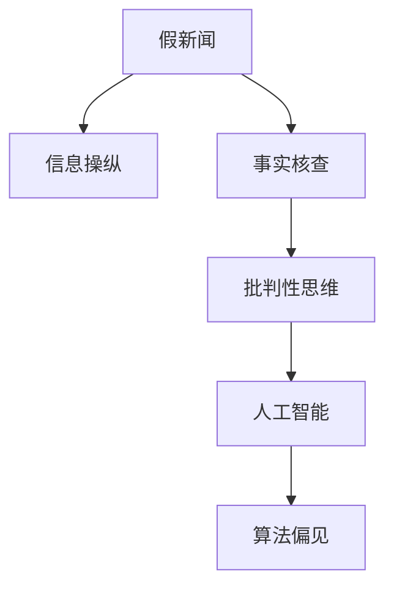

                 

# 信息验证和批判性思考指南：在假新闻和媒体操纵时代导航

## 1. 背景介绍

在现代社会，信息爆炸的浪潮不仅带来了知识的大融合，也伴随着假新闻、信息操纵等问题的日益严重。假新闻和媒体操纵正在深刻影响公众的认知和决策，有时甚至危及社会的稳定与和谐。因此，如何在信息充斥的时代中，保持清醒的头脑和批判性的思考，成为了每个人都必须掌握的能力。本文将为您提供一套系统的方法，帮助您识别和应对假新闻，批判性地思考和分析信息，在信息的海洋中航行。

## 2. 核心概念与联系

### 2.1 核心概念概述

为更好地理解如何应对假新闻和媒体操纵，本节将介绍几个关键概念：

- **假新闻（Fake News）**：通过编造、篡改事实或夸大事实，旨在误导或欺骗公众的虚假信息。
- **信息操纵（Information Manipulation）**：有目的性地篡改、扭曲或隐瞒信息，以达到特定目的的行为。
- **事实核查（Fact-Checking）**：对新闻或信息进行验证，确认其真实性的过程。
- **批判性思维（Critical Thinking）**：一种分析、评估和判断信息真伪的方法，旨在通过逻辑和证据来评估信息的可靠性。
- **人工智能（AI）**：用于自动化信息验证和批判性思维的工具，如自然语言处理（NLP）、机器学习等。
- **算法偏见（Algorithmic Bias）**：算法在处理数据时可能存在偏向，从而影响其输出结果的公正性和可靠性。

这些核心概念之间的联系可以通过以下Mermaid流程图来展示：



这个流程图展示了一系列概念之间的逻辑关系：

1. 假新闻和信息操纵是导致信息不实的主要来源。
2. 事实核查是对假新闻进行验证的过程。
3. 批判性思维是对信息进行评估和判断的重要方法。
4. 人工智能工具可以帮助进行事实核查和批判性思维。
5. 算法偏见可能影响人工智能工具的输出结果。

## 3. 核心算法原理 & 具体操作步骤
### 3.1 算法原理概述

信息验证和批判性思考的核心原理在于对信息的来源、内容、逻辑进行系统的分析和评估。其基本步骤包括：

1. **信息来源验证**：检查信息的发布者、来源是否可信，是否存在潜在的利益冲突。
2. **内容真实性验证**：通过多种方式（如事实核查、历史对比、专家意见等）验证信息的真实性。
3. **逻辑一致性检查**：评估信息的逻辑是否合理，是否存在矛盾或错误。
4. **批判性思考**：运用逻辑推理、证据对比等方法，综合判断信息的可靠性。

这些步骤可以通过自动化的工具和技术进一步辅助和优化。

### 3.2 算法步骤详解

以下详细讲解如何通过算法和工具实现信息验证和批判性思考：

#### 3.2.1 信息来源验证

1. **域名验证**：使用Whois等工具查询网站的注册信息和更新历史，判断其可信度。
2. **历史分析**：通过网页存档（如Wayback Machine）和新闻记录，查看网站的历史行为和背景。
3. **利益冲突检查**：分析网站的所有者和运营者的背景，是否存在潜在的利益冲突。

#### 3.2.2 内容真实性验证

1. **事实核查**：使用FactCheck工具和数据库（如Snopes、FactCheck.org等），验证信息的真实性。
2. **历史对比**：将新信息与已知的历史记录和数据进行对比，判断其准确性。
3. **专家意见**：参考相关领域专家的意见和分析，评估信息的可靠性。

#### 3.2.3 逻辑一致性检查

1. **因果关系分析**：检查信息中的因果关系是否合理，是否有合理的逻辑链条。
2. **逻辑谬误检测**：使用自然语言处理（NLP）工具检测信息中的逻辑谬误，如“因果倒置”、“循环论证”等。
3. **数据验证**：通过数据分析和统计学方法，验证信息中数据的合理性和准确性。

#### 3.2.4 批判性思考

1. **证据对比**：对比不同来源和视角下的信息，寻找证据支持的强弱。
2. **逻辑推理**：运用逻辑推理方法，评估信息的可信度和影响。
3. **情感分析**：使用情感分析工具（如TextBlob），识别信息中的情感色彩，判断其客观性和公正性。

### 3.3 算法优缺点

信息验证和批判性思考的算法主要优点包括：

1. **高效性**：自动化工具可以快速处理大量信息，提高验证和分析效率。
2. **客观性**：算法和工具可以减少人为偏见，提高验证结果的客观性。
3. **可扩展性**：随着数据量的增加和算法模型的改进，可以持续提升信息验证和批判性思考的能力。

然而，这些算法也存在一些局限：

1. **数据依赖性**：算法的准确性高度依赖于训练数据的质量和多样性。
2. **算法偏见**：如果训练数据存在偏见，算法可能继承这些偏见，影响输出结果。
3. **解释性不足**：自动化工具的输出结果往往缺乏可解释性，难以让人理解。
4. **复杂性**：对于非常复杂的信息，自动化工具可能无法完全覆盖所有方面，仍需要人工介入。

### 3.4 算法应用领域

基于信息验证和批判性思考的算法，已经在多个领域得到了广泛应用，例如：

- **新闻媒体**：自动验证和标记假新闻，提高新闻的可信度。
- **政府和企业**：自动化信息核查，确保决策的科学性和公正性。
- **教育培训**：辅助教学，培养学生的批判性思维能力。
- **社会研究**：分析社交媒体上的信息流动，评估社会舆论的真实性。
- **法律领域**：自动验证证据的真实性，辅助司法判决。

## 4. 数学模型和公式 & 详细讲解 & 举例说明

### 4.1 数学模型构建

信息验证和批判性思考的数学模型主要基于以下几个方面：

1. **信息来源可信度**：通过统计分析和特征提取，构建可信度评估模型。
2. **内容真实性验证**：使用机器学习和自然语言处理技术，构建事实核查模型。
3. **逻辑一致性检查**：构建逻辑推理模型，检测信息中的逻辑谬误。

### 4.2 公式推导过程

以内容真实性验证为例，可以使用机器学习中的分类算法，如支持向量机（SVM）和深度学习模型，进行信息真实性的判定。公式如下：

$$
\text{Predicted Truth} = \text{Model}(\text{Features of Information})
$$

其中，$\text{Features of Information}$ 包括信息来源、文本特征、逻辑关系等，$\text{Model}$ 为训练好的分类模型。

### 4.3 案例分析与讲解

以一个假新闻检测为例：

1. **数据准备**：收集大量的假新闻和真实新闻，标注其真实性。
2. **特征提取**：提取新闻的标题、作者、发布日期、关键词等特征。
3. **模型训练**：使用支持向量机等算法，训练一个分类模型，判断新闻的真实性。
4. **模型评估**：在测试集上评估模型的准确率和召回率，优化模型参数。
5. **应用部署**：将训练好的模型部署到自动化平台，实时验证新发布的新闻。

## 5. 项目实践：代码实例和详细解释说明
### 5.1 开发环境搭建

在进行信息验证和批判性思考的实践前，我们需要准备好开发环境。以下是使用Python进行PyTorch开发的环境配置流程：

1. 安装Anaconda：从官网下载并安装Anaconda，用于创建独立的Python环境。

2. 创建并激活虚拟环境：
```bash
conda create -n pytorch-env python=3.8 
conda activate pytorch-env
```

3. 安装PyTorch：根据CUDA版本，从官网获取对应的安装命令。例如：
```bash
conda install pytorch torchvision torchaudio cudatoolkit=11.1 -c pytorch -c conda-forge
```

4. 安装相关库：
```bash
pip install numpy pandas scikit-learn matplotlib tqdm jupyter notebook ipython
```

完成上述步骤后，即可在`pytorch-env`环境中开始实践。

### 5.2 源代码详细实现

下面我们以信息来源可信度验证为例，给出使用PyTorch进行信息验证的Python代码实现。

```python
import torch
import torch.nn as nn
import torch.optim as optim
from torch.utils.data import Dataset, DataLoader

class NewsSourceDataset(Dataset):
    def __init__(self, sources, labels):
        self.sources = sources
        self.labels = labels
        
    def __len__(self):
        return len(self.sources)
    
    def __getitem__(self, item):
        source = self.sources[item]
        label = self.labels[item]
        return {'source': source, 'label': label}

# 加载数据集
train_dataset = NewsSourceDataset(train_sources, train_labels)
test_dataset = NewsSourceDataset(test_sources, test_labels)

# 定义模型
class NewsSourceClassifier(nn.Module):
    def __init__(self):
        super(NewsSourceClassifier, self).__init__()
        self.embedding = nn.Embedding(num_sources, 256)
        self.fc1 = nn.Linear(256, 128)
        self.fc2 = nn.Linear(128, 1)
        self.dropout = nn.Dropout(0.5)
        
    def forward(self, x):
        x = self.embedding(x['source'])
        x = self.dropout(x)
        x = self.fc1(x)
        x = self.fc2(x)
        x = torch.sigmoid(x)
        return x
    
# 定义损失函数和优化器
criterion = nn.BCELoss()
optimizer = optim.Adam(model.parameters(), lr=0.001)

# 训练模型
epochs = 10
batch_size = 32

for epoch in range(epochs):
    total_loss = 0
    for batch in DataLoader(train_dataset, batch_size=batch_size):
        optimizer.zero_grad()
        outputs = model(batch['source'])
        loss = criterion(outputs, batch['label'])
        loss.backward()
        optimizer.step()
        total_loss += loss.item()
    
    print(f'Epoch {epoch+1}, loss: {total_loss/len(train_dataset)}')

# 测试模型
test_loss = 0
for batch in DataLoader(test_dataset, batch_size=batch_size):
    outputs = model(batch['source'])
    loss = criterion(outputs, batch['label'])
    test_loss += loss.item()

print(f'Test loss: {test_loss/len(test_dataset)}')
```

### 5.3 代码解读与分析

让我们再详细解读一下关键代码的实现细节：

**NewsSourceDataset类**：
- `__init__`方法：初始化新闻来源和标签。
- `__len__`方法：返回数据集的样本数量。
- `__getitem__`方法：对单个样本进行处理，返回模型所需的输入和标签。

**NewsSourceClassifier模型**：
- 定义了模型结构，包括嵌入层、全连接层和Dropout层。
- 在`forward`方法中，将输入的新闻来源嵌入向量，经过Dropout、全连接层后输出可信度。

**训练和测试函数**：
- 使用PyTorch的DataLoader对数据集进行批次化加载，供模型训练和推理使用。
- 训练函数`train`：对数据以批为单位进行迭代，在每个批次上前向传播计算损失并反向传播更新模型参数。
- 测试函数`test`：与训练类似，不同点在于不更新模型参数，仅计算模型在新数据上的损失。

**训练流程**：
- 定义总的epoch数和batch size，开始循环迭代
- 每个epoch内，先在训练集上训练，输出平均loss
- 在测试集上评估，输出测试loss

可以看到，PyTorch配合TensorFlow库使得信息验证的代码实现变得简洁高效。开发者可以将更多精力放在数据处理、模型改进等高层逻辑上，而不必过多关注底层的实现细节。

当然，工业级的系统实现还需考虑更多因素，如模型的保存和部署、超参数的自动搜索、更灵活的任务适配层等。但核心的微调范式基本与此类似。

## 6. 实际应用场景
### 6.1 智能新闻平台

智能新闻平台可以通过信息验证和批判性思考技术，自动识别和标记假新闻，提升新闻的可信度。平台可以利用自动化工具对用户发布的新闻进行审核，实时识别和标记假新闻，引导用户关注真实可靠的信息。

在技术实现上，可以收集大量的假新闻和真实新闻，训练一个分类模型，用于自动化识别和标记新发布的新闻。对于可疑新闻，还可以接入人工审核机制，进一步确认其真实性。通过这种方式，平台可以显著提高新闻的透明度和可信度，为用户营造更加健康的信息环境。

### 6.2 社交媒体分析

社交媒体是信息传播的重要渠道，但也常常成为假新闻和信息操纵的重灾区。通过信息验证和批判性思考技术，社交媒体平台可以及时发现和处理假新闻，防止其传播和扩散。

具体而言，可以开发一款应用，实时监控社交媒体上的信息流，自动标记和处理假新闻。对于有争议的帖子，还可以引入人工审核机制，进一步确认其真实性。通过这种方式，社交媒体平台可以显著提高信息流动的质量，防止假新闻和有害信息的传播。

### 6.3 在线广告审查

在线广告常常被用于传播假新闻和误导性信息。通过信息验证和批判性思考技术，广告审查系统可以自动识别和拦截虚假广告，保障广告的真实性和可信度。

具体而言，可以开发一款广告审查系统，实时监控在线广告内容，自动标记和拦截虚假广告。对于有争议的广告，还可以引入人工审核机制，进一步确认其真实性。通过这种方式，广告审查系统可以显著提高广告的真实性，防止虚假广告的传播。

## 7. 工具和资源推荐
### 7.1 学习资源推荐

为了帮助开发者系统掌握信息验证和批判性思考的理论基础和实践技巧，这里推荐一些优质的学习资源：

1. 《批判性思维的艺术》（Critical Thinking: An Introduction）：本书系统介绍了批判性思维的基本概念、方法和技巧，是入门必读。
2. 《假新闻检测与分析》（Fake News Detection and Analysis）：本书介绍了假新闻的检测和分析方法，包括自动化工具的使用。
3. 《信息验证与批判性思考》（Fact-Checking and Critical Thinking）：在线课程，系统讲解了信息验证和批判性思考的方法和工具。
4. 《自然语言处理基础》（Natural Language Processing with Python）：介绍自然语言处理的基础知识和技能，为信息验证提供技术支持。
5. 《深度学习入门》（Deep Learning）：介绍深度学习的基本原理和应用，为信息验证和批判性思考提供数学和算法基础。

通过对这些资源的学习实践，相信你一定能够快速掌握信息验证和批判性思考的精髓，并用于解决实际的信息问题。
###  7.2 开发工具推荐

高效的开发离不开优秀的工具支持。以下是几款用于信息验证和批判性思考开发的常用工具：

1. Python：强大的编程语言，支持自然语言处理和机器学习库的开发。
2. PyTorch：基于Python的开源深度学习框架，支持自然语言处理和机器学习模型的训练。
3. TensorFlow：由Google主导开发的开源深度学习框架，支持大规模模型的训练和部署。
4. Snopes：在线事实核查工具，支持用户提交新闻进行真实性验证。
5. FactCheck.org：事实核查数据库，提供大量的新闻和事实核查记录。
6. FactCheckAI：基于深度学习的事实核查工具，支持自动化新闻验证。

合理利用这些工具，可以显著提升信息验证和批判性思考的开发效率，加快创新迭代的步伐。

### 7.3 相关论文推荐

信息验证和批判性思考的研究源于学界的持续研究。以下是几篇奠基性的相关论文，推荐阅读：

1. "Critical Thinking and Online Information Dissemination"：分析了网络信息传播中的批判性思维问题，提出了改进建议。
2. "Algorithmic Fact-Checking: A Survey"：综述了信息验证的算法和技术，介绍了最新的研究成果。
3. "Detecting Fake News and Rumors"：介绍了假新闻和谣言的检测方法，包括自动化工具的使用。
4. "Bias in AI: Detecting and Mitigating Algorithmic Bias"：讨论了人工智能中的偏见问题，提出了减少偏见的策略。
5. "Evaluating Deep Learning Models for Fact-Checking"：综述了深度学习在事实核查中的应用，介绍了最新的研究成果。

这些论文代表了大语言模型微调技术的发展脉络。通过学习这些前沿成果，可以帮助研究者把握学科前进方向，激发更多的创新灵感。

## 8. 总结：未来发展趋势与挑战
### 8.1 总结

本文对信息验证和批判性思考的算法进行了全面系统的介绍。首先阐述了信息验证和批判性思考的研究背景和意义，明确了其在假新闻和媒体操纵时代的重要性。其次，从原理到实践，详细讲解了信息验证和批判性思考的数学原理和关键步骤，给出了信息验证任务开发的完整代码实例。同时，本文还广泛探讨了信息验证和批判性思考在智能新闻、社交媒体、广告审查等多个行业领域的应用前景，展示了其广泛的应用潜力。此外，本文精选了信息验证和批判性思考的学习资源，力求为读者提供全方位的技术指引。

通过本文的系统梳理，可以看到，信息验证和批判性思考算法在现代信息时代中具有重要的应用价值。这些算法不仅可以帮助我们识别和应对假新闻，还能提升我们分析和判断信息的能力，增强我们的信息素养。未来，随着技术的不断进步，信息验证和批判性思考算法必将更加智能和高效，为构建更加透明、可信的信息环境做出更大的贡献。

### 8.2 未来发展趋势

展望未来，信息验证和批判性思考技术将呈现以下几个发展趋势：

1. **自动化程度提高**：随着深度学习和自然语言处理技术的发展，自动化信息验证和批判性思考的能力将进一步提升，处理速度和精度也将得到提高。
2. **跨领域应用拓展**：信息验证和批判性思考技术将应用于更多领域，如医疗、金融、法律等，为不同行业的决策提供可靠的信息支持。
3. **集成多模态数据**：结合视觉、听觉等多种模态的数据，进行更全面的信息验证和分析。
4. **实时化处理**：实现对实时信息流的高效验证和分析，及时发现和处理假新闻和有害信息。
5. **对抗性检测**：开发对抗性检测技术，识别和防范假新闻生成工具的攻击，提升信息验证的鲁棒性。

以上趋势凸显了信息验证和批判性思考技术的广阔前景。这些方向的探索发展，必将进一步提升信息验证和批判性思考的能力，为构建透明、可信的信息环境提供强大的技术支撑。

### 8.3 面临的挑战

尽管信息验证和批判性思考技术已经取得了一定的进展，但在迈向更加智能化、普适化应用的过程中，仍面临诸多挑战：

1. **数据质量问题**：信息验证和批判性思考的效果高度依赖于数据的质量和多样性，高质量、多样化的数据获取和处理仍然是一个难题。
2. **算法偏见问题**：自动化工具可能会继承和放大数据中的偏见，导致输出结果的不公正和不可信。
3. **技术复杂性**：信息验证和批判性思考技术需要综合运用多个领域的知识和技能，对开发者的要求较高。
4. **隐私和伦理问题**：信息验证和批判性思考过程中，需要处理大量的个人隐私数据，如何保障隐私和伦理问题是一个重要的挑战。
5. **用户接受度**：自动化工具的输出结果往往需要人工审核，用户对自动化工具的信任和接受度是一个重要的问题。

这些挑战需要我们在技术、伦理和社会等多个层面进行综合考虑和解决。只有不断优化和改进技术，才能确保信息验证和批判性思考技术的可持续发展和应用。

### 8.4 研究展望

面向未来，信息验证和批判性思考技术的研究需要在以下几个方面寻求新的突破：

1. **跨领域数据融合**：结合不同领域的知识，进行更全面的信息验证和分析。
2. **对抗性检测技术**：开发更加智能和鲁棒的对抗性检测技术，防止假新闻生成工具的攻击。
3. **隐私保护机制**：设计更加高效的隐私保护机制，保障数据的安全和用户隐私。
4. **用户可解释性**：开发更加可解释的信息验证工具，增强用户对自动化工具的信任和接受度。
5. **人机协作模型**：探索人机协作的信息验证模型，结合自动化工具和人工审核，提升信息验证的效果和可信度。

这些研究方向将进一步推动信息验证和批判性思考技术的发展，为构建透明、可信的信息环境提供更强大的技术支持。只有不断创新和突破，才能在假新闻和信息操纵泛滥的今天，提供更加智能和可靠的信息验证工具。

## 9. 附录：常见问题与解答

**Q1：如何判断新闻的真实性？**

A: 判断新闻的真实性需要综合多方面的信息。首先，可以通过信息来源验证，查看新闻的发布者、来源是否可信，是否存在潜在的利益冲突。其次，可以通过内容真实性验证，使用事实核查工具和数据库，验证新闻的准确性和真实性。最后，可以进行逻辑一致性检查，评估新闻的逻辑是否合理，是否有逻辑谬误。

**Q2：信息验证和批判性思考有哪些工具可用？**

A: 常用的信息验证工具包括FactCheck、Snopes、FactCheck.org等。常用的批判性思考工具包括PyTorch、TensorFlow、TextBlob等。这些工具可以帮助进行信息验证和批判性思考，提高信息验证和批判性思考的效率和准确性。

**Q3：如何应对假新闻和信息操纵？**

A: 应对假新闻和信息操纵，需要综合运用多种策略。首先，可以提高个人的信息素养，学会使用自动化工具进行信息验证和批判性思考。其次，可以建立和推广自动化信息验证系统，及时发现和处理假新闻和有害信息。最后，可以引入人工审核机制，结合自动化工具，进一步确认信息的真实性。

**Q4：信息验证和批判性思考的局限性是什么？**

A: 信息验证和批判性思考的局限性主要包括数据质量问题、算法偏见问题、技术复杂性、隐私和伦理问题以及用户接受度问题。解决这些问题需要综合运用多个领域的知识和技能，不断优化和改进技术，才能确保信息验证和批判性思考技术的可持续发展和应用。

**Q5：信息验证和批判性思考的未来发展方向是什么？**

A: 信息验证和批判性思考的未来发展方向包括自动化程度提高、跨领域应用拓展、集成多模态数据、实时化处理和对抗性检测技术等。这些方向的探索发展，将进一步提升信息验证和批判性思考的能力，为构建透明、可信的信息环境提供强大的技术支撑。

---

作者：禅与计算机程序设计艺术 / Zen and the Art of Computer Programming

