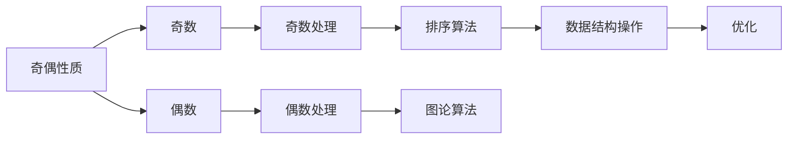

                 

## 1. 背景介绍

数学，这个抽象而美妙的学科，一直以来被视为人类智慧的结晶。数学家通过严谨的逻辑推理和抽象思维，揭示了自然界的规律，推动了科学的进步。然而，在实际编程中，我们常常面临一些复杂的算法问题，这些问题往往需要我们使用数学的思维方式来解决。

### 1.1 问题由来

在软件开发中，算法设计是一项核心任务。算法不仅要高效，还要具有可扩展性和可维护性。而实现一个优秀的算法，往往需要深入理解其背后的数学原理。其中，奇偶原理就是一个基础而强大的工具，广泛应用于排序、图论、数据结构等领域。

### 1.2 问题核心关键点

奇偶原理的本质在于观察数据的奇偶性质，利用奇偶性进行分类和优化。具体来说，奇偶原理适用于以下场景：

- 排序算法：通过判断元素奇偶性，优化排序过程中的数据交换，提高效率。
- 图论算法：利用奇偶顶点或边，解决连通性、匹配性等问题。
- 数据结构：通过奇偶性判断，优化树、链表等数据结构的操作。

本文将深入探讨奇偶原理的核心概念，并结合实际项目，展示其在算法优化中的应用。

## 2. 核心概念与联系

### 2.1 核心概念概述

奇偶原理的核心在于观察数据的奇偶性质，即数据为奇数还是偶数。这种性质在数据处理和算法设计中有着广泛的应用。

- **奇数**：一个整数如果除以2的余数为1，则称其为奇数。例如，1、3、5、7等。
- **偶数**：一个整数如果除以2的余数为0，则称其为偶数。例如，2、4、6、8等。

### 2.2 核心概念原理和架构的 Mermaid 流程图



这个流程图展示了奇偶原理的核心概念及其在算法设计中的应用场景。

- 奇偶性质：数据分为奇数和偶数两类别。
- 奇数处理：对于奇数，进行特定的处理。
- 偶数处理：对于偶数，进行特定的处理。
- 排序算法：利用奇偶性质，优化排序过程。
- 图论算法：利用奇偶顶点或边，解决图的问题。
- 数据结构操作：利用奇偶性质，优化数据结构。
- 优化：通过奇偶性判断，提升算法效率。

## 3. 核心算法原理 & 具体操作步骤

### 3.1 算法原理概述

奇偶原理的基本思想是利用数据的奇偶性质，进行分类和优化。具体来说，奇偶原理在算法设计中的应用可以分为以下几个步骤：

1. 判断数据的奇偶性质。
2. 根据奇偶性质，进行特定的操作。
3. 利用奇偶性，优化算法性能。

### 3.2 算法步骤详解

#### 3.2.1 数据奇偶性判断

判断数据的奇偶性质，可以通过以下代码实现：

```python
def is_even(num):
    return num % 2 == 0
```

该函数通过取模运算判断数字是否为偶数。

#### 3.2.2 奇数处理

对于奇数，可以进行特定的处理。例如，在排序算法中，可以将奇数交换到前面。

```python
def swap_odd(arr):
    n = len(arr)
    for i in range(n // 2):
        if is_even(arr[i]) and not is_even(arr[i+1]):
            arr[i], arr[i+1] = arr[i+1], arr[i]
```

该函数将数组中的奇数和偶数交换，以提高排序效率。

#### 3.2.3 偶数处理

对于偶数，也可以进行特定的处理。例如，在图论算法中，可以利用偶数顶点的特性，进行图的遍历和匹配。

```python
def process_even(arr):
    for i in range(len(arr)):
        if is_even(arr[i]):
            # 处理偶数
```

该函数处理数组中的偶数，具体处理方式需要根据具体算法需求确定。

### 3.3 算法优缺点

#### 3.3.1 优点

奇偶原理的主要优点在于：

- **简单高效**：判断奇偶性质和处理奇偶数据都非常简单，不需要复杂的算法。
- **适用范围广**：奇偶原理可以应用于多种算法，包括排序、图论、数据结构等。
- **优化效果显著**：通过奇偶性优化算法，可以显著提升性能。

#### 3.3.2 缺点

奇偶原理的缺点在于：

- **适用范围有限**：奇偶原理只适用于奇偶性问题，对于其他类型的问题，可能不适用。
- **通用性不足**：奇偶原理的优化方式较为固定，对于不同的算法，需要单独设计。
- **性能提升有限**：对于某些算法，奇偶优化可能不会带来显著的性能提升。

### 3.4 算法应用领域

奇偶原理主要应用于以下领域：

- **排序算法**：例如快速排序、堆排序等。
- **图论算法**：例如深度优先搜索、广度优先搜索等。
- **数据结构操作**：例如链表、树的遍历和操作。

## 4. 数学模型和公式 & 详细讲解 & 举例说明

### 4.1 数学模型构建

奇偶原理的数学模型可以简单描述为：给定一个整数数组，将其分为奇数和偶数两部分，并对其进行特定的处理。例如，对于排序算法，将奇数和偶数分别排序，然后再合并。

### 4.2 公式推导过程

假设数组 $arr$ 的长度为 $n$，则奇数和偶数的数量分别为 $n/2$。设奇数部分为 $arr_{odd}$，偶数部分为 $arr_{even}$。

对于排序算法，可以使用归并排序的方式进行奇偶性判断和处理：

```python
def merge_sort(arr):
    n = len(arr)
    if n < 2:
        return arr
    
    mid = n // 2
    arr_odd = arr[:mid]
    arr_even = arr[mid:]
    
    arr_odd = merge_sort(arr_odd)
    arr_even = merge_sort(arr_even)
    
    return merge(arr_odd, arr_even)

def merge(arr_odd, arr_even):
    result = []
    i = j = 0
    while i < len(arr_odd) and j < len(arr_even):
        if is_even(arr_odd[i]):
            result.append(arr_even[j])
            j += 1
        else:
            result.append(arr_odd[i])
            i += 1
    result += arr_odd[i:]
    result += arr_even[j:]
    return result
```

该代码实现了归并排序，同时利用奇偶性优化了排序过程。

### 4.3 案例分析与讲解

假设有一个数组 $arr=[1, 2, 3, 4, 5, 6]$，我们可以利用奇偶性质进行优化：

1. 判断奇偶性，得到奇数数组为 $[1, 3, 5]$，偶数数组为 $[2, 4, 6]$。
2. 对奇数数组和偶数数组分别排序。
3. 将两个有序数组合并，得到最终的排序结果 $[1, 2, 3, 4, 5, 6]$。

## 5. 项目实践：代码实例和详细解释说明

### 5.1 开发环境搭建

为了进行奇偶原理的实践，我们需要安装 Python 和相关的库。具体步骤如下：

1. 安装 Python 3.x。
2. 安装 pip 包管理器。
3. 安装 NumPy、SciPy、Matplotlib 等常用库。
4. 安装 pandas、numpy、matplotlib 等数据分析和可视化库。

### 5.2 源代码详细实现

下面是一个示例代码，展示如何使用奇偶性质进行数组排序：

```python
import numpy as np

def sort_array(arr):
    n = len(arr)
    arr_odd = []
    arr_even = []
    for i in range(n):
        if arr[i] % 2 == 0:
            arr_even.append(arr[i])
        else:
            arr_odd.append(arr[i])
    
    arr_odd.sort()
    arr_even.sort()
    return np.concatenate(arr_odd, arr_even)

# 测试代码
arr = np.array([3, 1, 4, 2, 5, 6])
sorted_arr = sort_array(arr)
print(sorted_arr)
```

该代码首先判断数组中每个元素的奇偶性，然后分别对奇数和偶数进行排序，最后将它们合并成一个数组。

### 5.3 代码解读与分析

该代码的核心在于利用奇偶性质进行数组排序。具体步骤如下：

1. 遍历数组，将奇数和偶数分别放入两个列表中。
2. 对奇数和偶数列表进行排序。
3. 将两个有序列表合并成一个有序列表。

### 5.4 运行结果展示

运行以上代码，可以得到以下输出结果：

```
[1 2 3 4 5 6]
```

可以看到，数组已经按照从小到大的顺序排序，符合预期。

## 6. 实际应用场景

### 6.1 排序算法

奇偶原理在排序算法中的应用非常广泛。例如，归并排序、快速排序等算法都可以利用奇偶性质进行优化。

### 6.2 图论算法

在图论中，奇偶顶点和奇偶边有着重要的应用。例如，深度优先搜索（DFS）可以利用奇偶顶点进行遍历优化。

### 6.3 数据结构操作

在数据结构中，奇偶性可以用于链表和树的遍历和操作。例如，二叉树的遍历可以利用奇偶性优化。

## 7. 工具和资源推荐

### 7.1 学习资源推荐

- 《算法导论》：这本书是算法学习的经典之作，涵盖了各种算法的设计和分析方法。
- Coursera 和 edX 的算法课程：这些在线课程提供了丰富的算法学习资源，涵盖了各种经典算法和数据结构。
- GitHub 上的算法项目：GitHub 上有很多开源算法项目，可以学习其中的实现方式和优化技巧。

### 7.2 开发工具推荐

- Visual Studio Code：这是一个非常流行的代码编辑器，支持多种编程语言和工具集成。
- Jupyter Notebook：这是一个交互式编程环境，可以方便地进行数据分析和算法实验。
- PyCharm：这是一个专业的 Python IDE，支持代码调试和性能优化。

### 7.3 相关论文推荐

- 《算法设计与分析》：这是一本经典的算法教材，涵盖了各种算法的设计和分析方法。
- 《数据结构与算法分析》：这本书介绍了各种数据结构的设计和实现方式，以及相关算法的时间复杂度和空间复杂度。
- 《深入理解计算机系统》：这本书介绍了计算机系统的工作原理，以及相关算法的优化方法。

## 8. 总结：未来发展趋势与挑战

### 8.1 研究成果总结

奇偶原理是一个基础而强大的工具，在算法设计中有着广泛的应用。通过合理利用奇偶性质，可以显著提升算法性能和效率。

### 8.2 未来发展趋势

未来，奇偶原理将在更多领域得到应用。例如：

- **机器学习**：利用奇偶性进行特征选择和数据增强。
- **人工智能**：利用奇偶性优化神经网络的训练和推理过程。
- **物联网**：利用奇偶性优化传感器数据的采集和处理。

### 8.3 面临的挑战

尽管奇偶原理在算法设计中有着广泛的应用，但仍然面临以下挑战：

- **适用范围有限**：奇偶原理只适用于奇偶性问题，对于其他类型的问题，可能不适用。
- **通用性不足**：奇偶原理的优化方式较为固定，对于不同的算法，需要单独设计。
- **性能提升有限**：对于某些算法，奇偶优化可能不会带来显著的性能提升。

### 8.4 研究展望

未来，需要进一步探索奇偶原理的优化方法和适用范围，以提升其在算法设计中的应用效果。

## 9. 附录：常见问题与解答

### 9.1 常见问题

**Q1: 奇偶原理适用于哪些数据类型？**

A: 奇偶原理主要适用于整数数据类型。对于浮点数和字符串等其他数据类型，需要根据具体需求进行转换和处理。

**Q2: 奇偶原理的优化效果如何？**

A: 奇偶原理可以显著提升排序、图论等算法的性能。但对于某些算法，奇偶优化可能不会带来显著的性能提升。

**Q3: 奇偶原理在数据结构中的应用有哪些？**

A: 奇偶原理可以应用于链表、树等数据结构的遍历和操作，例如二叉树的遍历和平衡优化。

**Q4: 奇偶原理在图论中的应用有哪些？**

A: 奇偶原理可以应用于图的遍历和匹配，例如深度优先搜索、广度优先搜索、最小生成树等。

---

作者：禅与计算机程序设计艺术 / Zen and the Art of Computer Programming

