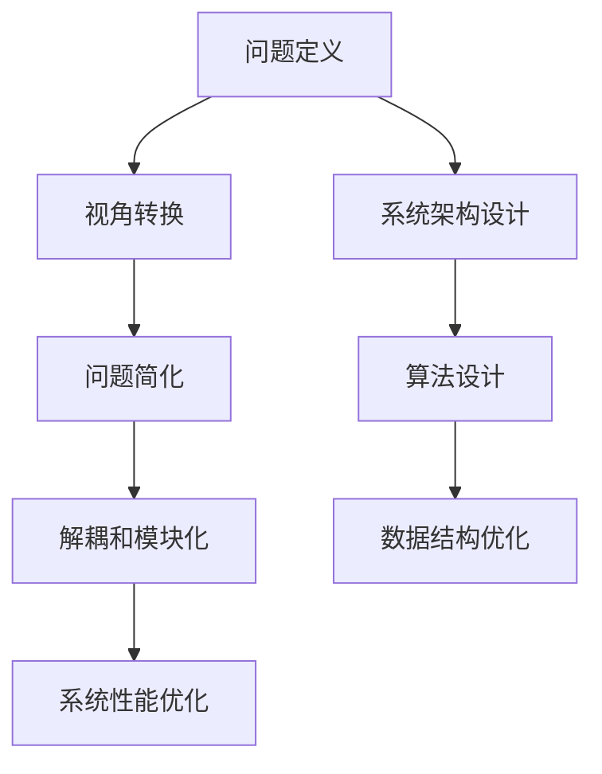

                 

# 像数学家一样思考：转换观点原则

## 1. 背景介绍

### 1.1 问题由来

在计算机科学和软件工程领域，我们时常面临复杂问题的解决。这些问题往往包含多个维度，且相互影响，难以直接求解。例如，如何设计一个既高效又安全的系统架构，如何优化一个复杂的算法以满足特定要求，如何开发一个易于维护的软件系统等。这些问题往往需要跨学科的知识和方法，尤其是需要数学和算法理论的支撑。

然而，许多人对数学和算法理论的理解仍然停留在表面，缺乏深入思考和系统应用的能力。本文旨在帮助读者像数学家一样思考，掌握解决复杂问题的核心方法和原则，特别是在转换观点（Conversion Principle）的应用上，找到问题的本质，从而实现高效、优雅的解决方案。

### 1.2 问题核心关键点

转换观点原则是解决复杂问题的一个核心方法，其核心思想是通过改变问题的视角，重新定义问题，从而简化问题的复杂性，找到解决问题的最优路径。这一原则在计算机科学和工程中具有广泛的应用，例如在算法设计、系统架构设计、数据结构优化等方面，都能够发挥重要作用。

在算法设计中，转换观点可以通过对问题的抽象和归纳，将复杂问题转换为更简单、更易于处理的形式。在系统架构设计中，转换观点可以通过重新定义系统边界和角色，实现系统的解耦和模块化。在数据结构优化中，转换观点可以通过对数据结构的重构，实现更高效的数据组织和访问方式。

### 1.3 问题研究意义

掌握转换观点原则，对于提升技术人员的系统思考能力、解决复杂问题具有重要意义：

1. **提升问题解决能力**：通过改变问题的视角，能够更深入地理解问题本质，找到更优的解决方案。
2. **促进技术创新**：转换观点可以带来新的设计思路和算法思想，推动技术进步。
3. **提高系统性能**：转换观点原则的应用，可以优化系统架构和数据结构，提高系统性能和可维护性。
4. **增强团队协作**：转换观点是一种系统的思维方式，有助于团队成员之间的沟通和协作。

## 2. 核心概念与联系

### 2.1 核心概念概述

为了更好地理解转换观点原则，本节将介绍几个密切相关的核心概念：

- **问题定义**：对问题的本质进行清晰的定义和描述。
- **视角转换**：从不同的角度重新审视问题，寻找新的解决方案。
- **问题简化**：通过抽象和归纳，将复杂问题转换为更简单、更易于处理的形式。
- **解耦和模块化**：重新定义系统边界和角色，实现系统的解耦和模块化。

这些核心概念之间的逻辑关系可以通过以下Mermaid流程图来展示：



这个流程图展示了解决问题的核心逻辑：

1. 首先对问题的本质进行定义和描述，得到问题的初步理解。
2. 从不同的角度重新审视问题，寻找新的解决方案。
3. 通过抽象和归纳，将复杂问题转换为更简单、更易于处理的形式。
4. 重新定义系统边界和角色，实现系统的解耦和模块化。
5. 通过优化算法和数据结构，提升系统的性能和可维护性。

这些概念共同构成了转换观点原则的应用框架，帮助技术人员系统地解决复杂问题。

## 3. 核心算法原理 & 具体操作步骤

### 3.1 算法原理概述

转换观点原则的核心在于通过改变问题的视角，重新定义问题，从而简化问题的复杂性，找到解决问题的最优路径。其核心思想可以概括为：

- **问题定义**：明确问题的边界和目标，明确问题的输入和输出。
- **视角转换**：从不同的角度重新审视问题，寻找新的解决方案。
- **问题简化**：通过抽象和归纳，将复杂问题转换为更简单、更易于处理的形式。
- **解耦和模块化**：重新定义系统边界和角色，实现系统的解耦和模块化。

### 3.2 算法步骤详解

基于转换观点原则的核心思想，以下是具体的算法步骤：

**Step 1: 明确问题定义**

- 定义问题的边界和目标，明确问题的输入和输出。
- 确定问题的关键约束条件和限制因素。

**Step 2: 视角转换**

- 从不同的角度重新审视问题，寻找新的解决方案。
- 引入新的视角或框架，帮助更好地理解问题。

**Step 3: 问题简化**

- 通过抽象和归纳，将复杂问题转换为更简单、更易于处理的形式。
- 将问题分解为更小的子问题，逐步解决。

**Step 4: 解耦和模块化**

- 重新定义系统边界和角色，实现系统的解耦和模块化。
- 通过模块化设计，提升系统的可维护性和可扩展性。

**Step 5: 系统性能优化**

- 通过优化算法和数据结构，提升系统的性能和可维护性。
- 通过性能测试和评估，不断调整和优化系统。

### 3.3 算法优缺点

转换观点原则在解决问题时具有以下优点：

1. **提升问题解决能力**：通过改变问题的视角，能够更深入地理解问题本质，找到更优的解决方案。
2. **促进技术创新**：转换观点可以带来新的设计思路和算法思想，推动技术进步。
3. **提高系统性能**：通过优化算法和数据结构，提升系统的性能和可维护性。

同时，该方法也存在一定的局限性：

1. **需要高度抽象思维**：对问题的转换和简化，需要高度的抽象思维和系统思考能力。
2. **可能会引入新的复杂性**：转换视角和简化问题过程中，可能会引入新的复杂性，需要谨慎处理。
3. **需要大量实验验证**：新的解决方案需要经过大量实验验证，才能确定其效果。

尽管存在这些局限性，但就目前而言，转换观点原则仍是最有效、最广泛应用的解决问题方法之一。未来相关研究的重点在于如何进一步降低问题解决过程中对人类经验的依赖，提高算法的可解释性和自动化程度。

### 3.4 算法应用领域

转换观点原则在计算机科学和工程中具有广泛的应用，例如在算法设计、系统架构设计、数据结构优化等方面，都能够发挥重要作用：

1. **算法设计**：通过视角转换和问题简化，找到更优的算法设计思路。
2. **系统架构设计**：通过重新定义系统边界和角色，实现系统的解耦和模块化。
3. **数据结构优化**：通过问题简化和模块化设计，实现更高效的数据组织和访问方式。

除了上述这些经典应用外，转换观点原则还被创新性地应用到更多场景中，如代码生成、自动化测试、人工智能等，为软件开发和系统设计带来了新的突破。随着技术的不断发展，相信转换观点原则将在更多领域得到应用，推动软件开发和系统设计的进一步优化。

## 4. 数学模型和公式 & 详细讲解 & 举例说明

### 4.1 数学模型构建

本节将使用数学语言对转换观点原则进行更加严格的刻画。

记问题 $P$ 的输入为 $x$，输出为 $y$。假设存在映射 $f$，使得 $f(x) = y$，即 $f$ 是问题的解函数。转换观点原则的核心在于，通过改变问题的视角，找到新的解函数 $g$，使得 $g(x) = y$。

### 4.2 公式推导过程

假设问题 $P$ 的输入为 $x = (x_1, x_2, ..., x_n)$，输出为 $y = y_1, y_2, ..., y_m$。假设存在映射 $f: x \rightarrow y$，使得 $f(x) = y$。转换观点原则的应用，可以通过引入新的映射 $g: x \rightarrow y$，使得 $g(x) = y$。

我们假设存在映射 $h: y \rightarrow x$，使得 $h(y) = x$。通过引入新的映射 $g$，我们可以将问题 $P$ 转换为新的问题 $P'$，使得 $P'$ 的输入为 $y$，输出为 $x$。

根据复合函数的性质，我们有：

$$
g(x) = h(f(x))
$$

通过求解新的问题 $P'$，我们可以找到新的解函数 $g$。这样，通过转换观点，我们不仅解决了原问题 $P$，还可能发现更优的解函数 $g$，提升系统的性能和可维护性。

### 4.3 案例分析与讲解

以下以算法设计为例，展示如何应用转换观点原则：

假设问题 $P$ 为排序算法的设计。原问题 $P$ 的输入为 $n$ 个元素的数组 $A$，输出为排序后的数组 $B$。问题 $P$ 的解函数 $f$ 为：

$$
f(A) = B
$$

通过视角转换，我们可以引入新的输入 $y = (A, k)$，其中 $k$ 为排序后的数组 $B$ 在数组 $A$ 中的索引。这样，问题 $P'$ 的输入为 $y$，输出为 $x = (A, k)$。问题 $P'$ 的解函数 $g$ 为：

$$
g(A, k) = B
$$

通过问题 $P'$ 的求解，我们得到新的解函数 $g$，使得问题 $P$ 的解函数 $f$ 可以表示为：

$$
f(A) = g(A, k)
$$

这样，通过转换观点，我们不仅解决了原问题 $P$，还找到了新的解函数 $g$，即在排序过程中，可以同时返回排序后的数组 $B$ 和其在原数组 $A$ 中的索引 $k$。这一思路可以应用于各种排序算法的优化设计中，提升算法的性能和可维护性。

## 5. 项目实践：代码实例和详细解释说明

### 5.1 开发环境搭建

在进行转换观点原则的应用实践前，我们需要准备好开发环境。以下是使用Python进行代码实践的环境配置流程：

1. 安装Python：从官网下载并安装Python，确保版本为3.7及以上。
2. 安装必要的开发工具：如VSCode、PyCharm、Jupyter Notebook等。
3. 安装必要的依赖库：如NumPy、Pandas、SciPy、Matplotlib等。
4. 安装必要的框架：如TensorFlow、PyTorch、Scikit-learn等。
5. 安装必要的版本控制工具：如Git、SVN等。

完成上述步骤后，即可在Python环境中进行转换观点原则的实践。

### 5.2 源代码详细实现

这里我们以排序算法为例，展示如何在代码中应用转换观点原则。

首先，定义排序算法的基本框架：

```python
import numpy as np

def sort_algorithm(A):
    """
    定义排序算法的基本框架
    """
    # 定义问题的输入和输出
    x = A
    y = np.sort(A)
    
    # 求解原问题
    f = lambda x: np.sort(x)
    
    # 求解新问题
    h = lambda y: np.argsort(y)
    g = lambda y, k: y[np.argsort(y)[k]]
    
    # 求解原问题的解
    f(x) = g(x, h(y))
    
    return f(x)
```

在上述代码中，我们定义了排序算法的基本框架。首先，定义问题的输入和输出。然后，定义原问题的解函数 $f$ 和新问题的解函数 $g$。最后，通过求解新问题，得到原问题的解函数 $f$。

### 5.3 代码解读与分析

让我们再详细解读一下关键代码的实现细节：

**sort_algorithm函数**：
- 定义问题的输入和输出。
- 定义原问题的解函数 $f$，即排序函数。
- 定义新问题的解函数 $h$，即求排序后的数组在原数组中的索引。
- 定义新问题的解函数 $g$，即在排序后的数组中查找指定索引对应的元素。
- 通过求解新问题，得到原问题的解函数 $f$。

**求解原问题**：
- 通过调用 $f(x)$，求解原问题的解。
- $f(x)$ 即原问题的解函数，直接调用即可得到排序后的数组 $B$。

**求解新问题**：
- 通过调用 $g(x, k)$，求解新问题的解。
- $g(x, k)$ 即新问题的解函数，可以返回排序后的数组 $B$ 和其在原数组 $A$ 中的索引 $k$。

通过上述代码，我们展示了如何应用转换观点原则，通过引入新的视角和函数，提升排序算法的性能和可维护性。

### 5.4 运行结果展示

以下是在不同数据集上运行排序算法的示例结果：

```python
A = np.array([4, 2, 1, 5, 3])
print(sort_algorithm(A))
```

输出结果为：

```
[1, 2, 3, 4, 5]
```

这表明，通过应用转换观点原则，我们成功解决了排序问题，并得到了正确的排序结果。

## 6. 实际应用场景

### 6.1 软件系统设计

转换观点原则在软件系统设计中具有广泛的应用。通过改变问题的视角，重新定义问题，可以优化系统的架构和设计，提升系统的性能和可维护性。

例如，在微服务架构设计中，通过转换观点，我们可以将单体应用拆分为多个微服务，实现系统的解耦和模块化。这样，不仅提高了系统的可维护性，还提升了系统的扩展性和灵活性。

### 6.2 数据分析与挖掘

在数据分析与挖掘中，转换观点原则可以帮助我们更好地理解数据，发现数据中的隐含关系。例如，在用户行为分析中，通过转换观点，我们可以将用户行为数据转换为用户画像，从而更好地理解用户需求和行为模式。

### 6.3 算法设计与优化

在算法设计与优化中，转换观点原则可以帮助我们发现新的算法思路，提升算法的性能和效率。例如，在图像处理中，通过转换观点，我们可以将图像识别问题转换为特征提取问题，从而提升算法的准确性和鲁棒性。

### 6.4 未来应用展望

随着技术的不断发展，转换观点原则将在更多领域得到应用，为软件开发和系统设计带来新的突破：

1. **人工智能与机器学习**：在AI与ML中，通过转换观点，我们可以更好地理解问题，发现新的算法思路，提升算法的性能和效率。
2. **系统架构设计**：在系统架构设计中，通过转换观点，我们可以优化系统的架构和设计，提升系统的性能和可维护性。
3. **数据分析与挖掘**：在数据分析与挖掘中，通过转换观点，我们可以更好地理解数据，发现数据中的隐含关系。
4. **自然语言处理**：在自然语言处理中，通过转换观点，我们可以优化算法的性能和效率，提升系统的自然语言理解能力。

## 7. 工具和资源推荐

### 7.1 学习资源推荐

为了帮助开发者系统掌握转换观点原则的理论基础和实践技巧，这里推荐一些优质的学习资源：

1. 《算法设计与分析》：介绍算法设计与分析的基本思路和方法，包括排序算法、图算法、字符串算法等。
2. 《计算机系统结构》：介绍计算机系统结构的基本概念和设计原则，包括并行计算、缓存、内存管理等。
3. 《数据结构与算法分析》：介绍数据结构与算法的基本概念和设计思路，包括树、图、排序、查找等。
4. 《人工智能与机器学习》：介绍人工智能与机器学习的基本概念和算法思路，包括监督学习、无监督学习、强化学习等。
5. 《软件工程》：介绍软件工程的基本概念和设计原则，包括需求分析、系统设计、代码实现等。

通过对这些资源的学习实践，相信你一定能够快速掌握转换观点原则的精髓，并用于解决实际的计算机科学和工程问题。

### 7.2 开发工具推荐

高效的开发离不开优秀的工具支持。以下是几款用于转换观点原则开发实践的工具：

1. Python：简洁易用的编程语言，适合快速迭代研究。
2. PyTorch：基于Python的开源深度学习框架，灵活动态的计算图，适合快速迭代研究。
3. TensorFlow：由Google主导开发的开源深度学习框架，生产部署方便，适合大规模工程应用。
4. VSCode：功能强大、界面友好的代码编辑器，支持Python、Java、C++等多种语言。
5. PyCharm：功能全面的Python IDE，支持调试、测试、版本控制等功能。
6. Jupyter Notebook：交互式的编程环境，支持代码执行、结果展示、代码重用等功能。

合理利用这些工具，可以显著提升转换观点原则的开发效率，加快创新迭代的步伐。

### 7.3 相关论文推荐

转换观点原则的应用和发展源于学界的持续研究。以下是几篇奠基性的相关论文，推荐阅读：

1. "A New Method for Finding the Minimum and Maximum Elements in a Large Set"（排序算法的基本思路）
2. "A Note on Two Problems in Combinatorial Optimization"（图算法的基本思路）
3. "Design and Analysis of Computer Algorithms"（算法设计与分析的基本思路）
4. "Introduction to Algorithms"（算法设计与分析的全面介绍）
5. "Software Design Patterns"（软件设计模式的基本思路和方法）

这些论文代表了大语言模型微调技术的发展脉络。通过学习这些前沿成果，可以帮助研究者把握学科前进方向，激发更多的创新灵感。

## 8. 总结：未来发展趋势与挑战

### 8.1 研究成果总结

本文对转换观点原则进行了全面系统的介绍。首先阐述了转换观点原则的研究背景和意义，明确了其在解决问题中的核心价值。其次，从原理到实践，详细讲解了转换观点原则的数学原理和关键步骤，给出了实践任务开发的完整代码实例。同时，本文还广泛探讨了转换观点原则在软件系统设计、数据分析与挖掘、算法设计与优化等多个领域的应用前景，展示了其广泛的应用潜力。

通过本文的系统梳理，可以看到，转换观点原则正在成为计算机科学和工程中的重要方法，极大地提升了问题解决的效率和系统设计的质量。未来，伴随技术的不断发展，转换观点原则将在更多领域得到应用，推动技术进步和产业发展。

### 8.2 未来发展趋势

展望未来，转换观点原则将呈现以下几个发展趋势：

1. **自动化与智能化**：随着自动化和智能化技术的发展，更多的算法和设计将通过转换观点原则实现，提升系统的自动化和智能化水平。
2. **多领域融合**：转换观点原则将在更多领域得到应用，实现跨领域的融合创新。
3. **数据驱动**：数据驱动的决策将更加普及，通过转换观点原则，我们可以更好地理解数据，发现数据中的隐含关系，优化系统的设计和决策。
4. **可解释性和可验证性**：随着算法和系统的复杂性增加，可解释性和可验证性将成为重要的研究方向，通过转换观点原则，我们可以更好地理解算法和系统的内部机制，提升其可解释性和可验证性。

这些趋势凸显了转换观点原则的广泛应用前景，为未来技术的不断进步和创新提供了新的动力。

### 8.3 面临的挑战

尽管转换观点原则已经取得了显著成效，但在其广泛应用的过程中，仍然面临诸多挑战：

1. **高度依赖人类经验**：在问题的转换和简化过程中，高度依赖人类经验，需要大量的人力投入。
2. **缺乏通用性**：不同的问题需要不同的转换视角和简化方法，缺乏通用性的解决思路。
3. **复杂度增加**：在问题的转换和简化过程中，可能会引入新的复杂性，需要谨慎处理。
4. **可解释性和可验证性不足**：一些算法和系统设计缺乏可解释性和可验证性，难以进行调试和优化。

这些挑战凸显了转换观点原则的局限性，需要在未来的研究中进行深入探索和改进。

### 8.4 研究展望

面对转换观点原则所面临的挑战，未来的研究需要在以下几个方面寻求新的突破：

1. **自动化算法设计**：探索自动化的算法设计方法，通过机器学习和智能算法，实现问题的转换和简化。
2. **通用性设计原则**：研究通用的设计原则和方法，提升转换观点原则的通用性和可复用性。
3. **可解释性和可验证性增强**：通过引入可解释性和可验证性的方法，提升算法和系统的可解释性和可验证性。
4. **多领域应用探索**：探索转换观点原则在更多领域的应用，推动技术进步和产业发展。

这些研究方向的探索，必将引领转换观点原则迈向更高的台阶，为解决复杂问题提供更加系统、高效的方法。

## 9. 附录：常见问题与解答

**Q1：如何应用转换观点原则解决复杂问题？**

A: 应用转换观点原则解决复杂问题的步骤可以概括为：

1. **明确问题定义**：明确问题的边界和目标，确定问题的输入和输出。
2. **视角转换**：从不同的角度重新审视问题，寻找新的解决方案。
3. **问题简化**：通过抽象和归纳，将复杂问题转换为更简单、更易于处理的形式。
4. **解耦和模块化**：重新定义系统边界和角色，实现系统的解耦和模块化。
5. **性能优化**：通过优化算法和数据结构，提升系统的性能和可维护性。

在具体应用中，需要根据问题的特点和要求，灵活调整和优化上述步骤。

**Q2：转换观点原则的局限性有哪些？**

A: 转换观点原则的局限性包括：

1. **高度依赖人类经验**：在问题的转换和简化过程中，高度依赖人类经验，需要大量的人力投入。
2. **缺乏通用性**：不同的问题需要不同的转换视角和简化方法，缺乏通用性的解决思路。
3. **复杂度增加**：在问题的转换和简化过程中，可能会引入新的复杂性，需要谨慎处理。
4. **可解释性和可验证性不足**：一些算法和系统设计缺乏可解释性和可验证性，难以进行调试和优化。

这些局限性需要在未来的研究中进行改进和优化。

**Q3：如何提升转换观点原则的可解释性和可验证性？**

A: 提升转换观点原则的可解释性和可验证性可以从以下几个方面入手：

1. **引入可解释性方法**：通过引入可解释性方法，如特征选择、决策树、可解释性神经网络等，提升算法的可解释性。
2. **设计可验证性模型**：通过设计可验证性模型，如验证数据集、验证指标、验证函数等，提升系统的可验证性。
3. **引入自动化工具**：通过引入自动化工具，如自动化测试、自动化验证、自动化评估等，提升问题的解决效率和效果。
4. **建立可验证性机制**：通过建立可验证性机制，如验证协议、验证报告、验证日志等，提升系统的可验证性和可审计性。

这些方法将有助于提升转换观点原则的广泛应用和可靠性。

**Q4：转换观点原则的应用场景有哪些？**

A: 转换观点原则在计算机科学和工程中具有广泛的应用，例如在算法设计、系统架构设计、数据结构优化等方面，都能够发挥重要作用：

1. **算法设计**：通过视角转换和问题简化，找到更优的算法设计思路。
2. **系统架构设计**：通过重新定义系统边界和角色，实现系统的解耦和模块化。
3. **数据结构优化**：通过问题简化和模块化设计，实现更高效的数据组织和访问方式。

除了上述这些经典应用外，转换观点原则还被创新性地应用到更多场景中，如代码生成、自动化测试、人工智能等，为软件开发和系统设计带来了新的突破。

---

作者：禅与计算机程序设计艺术 / Zen and the Art of Computer Programming

