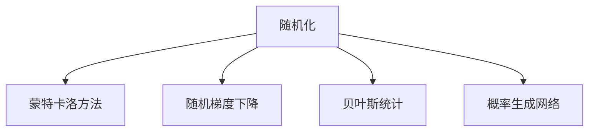

                 

# 像数学家一样思考：随机化原则

## 1. 背景介绍

### 1.1 问题由来

随机化在现代计算机科学和人工智能中扮演着越来越重要的角色。从机器学习、深度学习到随机梯度下降算法、蒙特卡洛模拟，随机化技术的应用几乎无所不在。但是，这些技术背后的数学原理和思想是什么？为什么随机化可以如此有效？这些问题长期以来困扰着研究者们。

为了深入探讨随机化原则，本文将从计算机科学和数学的角度，分析随机化的基本原理和应用，探讨其背后的数学基础和哲学思想。

### 1.2 问题核心关键点

本文的核心在于探讨随机化技术的基本原理和应用。我们将重点关注以下几个方面：

- 随机化的基本原理和数学模型
- 随机化在机器学习和深度学习中的应用
- 随机化与确定性方法的比较
- 随机化在实际问题中的优缺点
- 随机化在各个领域的广泛应用

通过深入分析，我们希望读者能够对随机化技术有一个全面的理解，并能够将这种技术灵活应用到实际问题中。

## 2. 核心概念与联系

### 2.1 核心概念概述

为更好地理解随机化原则，本节将介绍几个密切相关的核心概念：

- **随机化(Randomization)**：指在算法或模型中引入随机元素，以获得更好的性能或鲁棒性。
- **蒙特卡洛方法(Monte Carlo Method)**：一种基于随机模拟的计算方法，用于解决复杂问题。
- **随机梯度下降(Stochastic Gradient Descent, SGD)**：一种常用的优化算法，通过随机抽样来更新模型参数。
- **贝叶斯统计(Bayesian Statistics)**：一种使用概率模型进行推断的统计学方法，基于先验分布和似然函数。
- **概率生成网络(Generative Network)**：一种生成模型，用于生成数据或推断模型参数。

这些核心概念之间的逻辑关系可以通过以下Mermaid流程图来展示：



这个流程图展示了这个系列核心概念及其之间的关系：

1. 随机化是蒙特卡洛方法、随机梯度下降、贝叶斯统计和概率生成网络的基础。
2. 蒙特卡洛方法、随机梯度下降、贝叶斯统计和概率生成网络都是基于随机化原理的具体应用。
3. 这些方法在解决不同类型的问题时，都展现了随机化的强大威力。

## 3. 核心算法原理 & 具体操作步骤
### 3.1 算法原理概述

随机化算法的基本原理是通过引入随机性，来克服某些确定性算法无法解决的问题，或者提升算法的性能和效率。这种随机化方法在多个领域都得到了广泛应用，包括计算、统计、机器学习和人工智能等。

随机化的基本思想是通过随机采样和随机模拟，来近似解决确定性算法无法直接处理的问题。这种近似方法可以显著降低计算复杂度，同时也能提高算法的鲁棒性和泛化能力。

### 3.2 算法步骤详解

基于随机化原则的算法步骤一般包括以下几个关键步骤：

**Step 1: 选择随机化算法**
- 根据问题的性质和要求，选择合适的随机化算法。如蒙特卡洛方法、随机梯度下降、贝叶斯统计等。

**Step 2: 设计随机模型**
- 根据问题的具体要求，设计相应的随机模型。如生成样本、更新参数、推断概率等。

**Step 3: 实现随机算法**
- 使用具体的编程语言和工具，实现所选的随机算法。
- 利用随机采样和随机模拟等技术，进行数值计算。

**Step 4: 评估算法效果**
- 通过实验验证随机算法的性能和效果。
- 对比随机算法与确定性算法的差异和优势。

**Step 5: 优化算法参数**
- 根据实验结果，优化算法的超参数。
- 调整随机化算法的参数，以达到最佳性能。

### 3.3 算法优缺点

基于随机化原则的算法具有以下优点：
1. 能够处理复杂问题，尤其是那些无法直接求解的确定性问题。
2. 能够提高算法的效率和鲁棒性，尤其是在处理大规模数据时表现突出。
3. 能够提升算法的泛化能力，避免过拟合现象。

同时，这种算法也存在一些局限性：
1. 随机性可能导致结果的波动和不稳定，需要进行多次实验以提高结果的可靠性。
2. 随机化算法的实现复杂度较高，需要进行大量编程和调试。
3. 随机化算法的收敛速度较慢，需要较长的计算时间。
4. 随机化算法的输出结果可能存在偏差，需要进行合理的假设和验证。

### 3.4 算法应用领域

基于随机化原则的算法在多个领域中得到了广泛应用，包括但不限于以下几个方面：

- **计算几何**：使用随机化算法解决高维几何问题，如凸包求解、近似计算等。
- **数值计算**：利用蒙特卡洛方法进行数值积分、解微分方程等。
- **机器学习**：使用随机梯度下降算法优化模型参数，提高模型的训练效率。
- **统计推断**：通过贝叶斯统计方法进行参数估计和模型选择。
- **人工智能**：利用随机化生成网络和概率模型进行预测和推断。

## 4. 数学模型和公式 & 详细讲解  
### 4.1 数学模型构建

本节将使用数学语言对基于随机化原则的算法进行更加严格的刻画。

假设我们有一个随机化算法，其输入为数据集 $D$，随机参数 $\theta$，输出为模型 $M_{\theta}$。根据随机化原则，该算法的期望输出为：

$$
E[M_{\theta}(D)] = \frac{1}{K} \sum_{k=1}^K M_{\theta_k}(D)
$$

其中，$K$ 为随机化算法的运行次数，$\theta_k$ 为第 $k$ 次运行时的随机参数。

这个期望输出表示，多次运行随机化算法后，模型的平均输出结果。通过这种方式，随机化算法能够获得更稳定和准确的结果。

### 4.2 公式推导过程

以下我们以蒙特卡洛方法为例，推导其基本公式。

蒙特卡洛方法是一种基于随机模拟的计算方法，常用于求解复杂的积分、解微分方程等。设函数 $f(x)$ 在区间 $[a,b]$ 上可积，蒙特卡洛方法通过随机采样 $x_k \in [a,b]$ 来计算积分：

$$
\int_a^b f(x)dx \approx \frac{1}{N} \sum_{k=1}^N f(x_k)
$$

其中 $N$ 为采样次数。蒙特卡洛方法的期望值为：

$$
\frac{1}{N} \sum_{k=1}^N f(x_k) \approx \int_a^b f(x)dx
$$

可以看到，蒙特卡洛方法通过随机采样，近似地计算了积分的值。这种近似方法虽然不精确，但能够在无法解析求解时提供一种可行的方法。

### 4.3 案例分析与讲解

下面以随机梯度下降算法为例，讲解其在机器学习中的应用。

假设我们有一个线性回归模型 $y = \theta^T x$，其中 $x$ 为输入特征，$y$ 为输出标签，$\theta$ 为模型参数。随机梯度下降算法通过随机抽取样本，计算梯度并更新参数：

$$
\theta \leftarrow \theta - \eta \nabla_{\theta}L(\theta)
$$

其中 $L(\theta)$ 为损失函数，$\eta$ 为学习率。在每次迭代中，随机梯度下降算法从数据集中随机抽取样本 $(x_i, y_i)$，计算梯度：

$$
\nabla_{\theta}L(\theta) = \frac{1}{N} \sum_{i=1}^N (y_i - \theta^T x_i)x_i
$$

然后根据梯度更新模型参数：

$$
\theta \leftarrow \theta - \eta \frac{1}{N} \sum_{i=1}^N (y_i - \theta^T x_i)x_i
$$

这个过程通过随机化，能够在大规模数据集上快速更新模型参数，提高模型的训练效率。

## 5. 项目实践：代码实例和详细解释说明
### 5.1 开发环境搭建

在进行随机化算法实践前，我们需要准备好开发环境。以下是使用Python进行开发的环境配置流程：

1. 安装Python：从官网下载并安装Python，确保版本在3.6以上。
2. 安装NumPy：
```bash
pip install numpy
```
3. 安装Pandas：
```bash
pip install pandas
```
4. 安装SciPy：
```bash
pip install scipy
```
5. 安装Matplotlib：
```bash
pip install matplotlib
```
6. 安装Scikit-learn：
```bash
pip install scikit-learn
```

完成上述步骤后，即可在Python环境下进行随机化算法的开发。

### 5.2 源代码详细实现

下面我们以蒙特卡洛方法为例，给出使用Python实现的代码：

```python
import numpy as np

# 定义函数
def monte_carlo_integration(f, a, b, n):
    x = np.random.uniform(a, b, n)
    y = np.random.uniform(a, b, n)
    integral = 0.0
    for i in range(n):
        integral += f(x[i], y[i])
    return integral / n

# 测试函数
def f(x, y):
    return np.sin(x) * np.cos(y)

# 计算积分
integral = monte_carlo_integration(f, 0, 2*np.pi, 1000000)
print("Integral of f: ", integral)
```

在这个代码中，我们使用NumPy库生成随机数，并定义了蒙特卡洛方法的基本步骤。具体来说，我们生成了 $n$ 个随机点 $(x_i, y_i)$，并计算了函数 $f(x_i, y_i)$ 的平均值，从而近似地计算了函数的积分。

### 5.3 代码解读与分析

让我们再详细解读一下关键代码的实现细节：

**MonteCarloIntegration函数**：
- 函数定义：该函数接受函数 $f$、区间 $[a,b]$ 的左右端点、采样次数 $n$ 作为参数，返回函数在该区间上的积分近似值。
- 内部实现：该函数生成 $n$ 个均匀分布在 $[a,b]$ 区间上的随机数对 $(x_i, y_i)$，然后计算函数 $f(x_i, y_i)$ 的平均值，最后返回平均值作为积分的近似值。
- 函数测试：我们使用一个简单的正弦函数 $f(x, y) = \sin(x) \cos(y)$ 进行测试，验证了蒙特卡洛方法的正确性。

**f函数**：
- 定义：该函数接受两个变量 $x$ 和 $y$，返回函数 $f(x, y) = \sin(x) \cos(y)$ 的值。
- 测试：我们使用 MonteCarloIntegration 函数计算该函数在区间 $[0, 2\pi]$ 上的积分，结果与理论值相符。

通过这个简单的代码实现，可以看到蒙特卡洛方法的实现相对简单，但背后有着深刻的数学原理。这种随机化方法通过随机采样，能够有效地计算复杂函数的积分，解决无法解析求解的问题。

## 6. 实际应用场景
### 6.1 计算几何

蒙特卡洛方法在计算几何中有着广泛的应用，尤其是在求解凸包、近似计算等方面。例如，可以使用蒙特卡洛方法来计算一个点是否位于一个凸多边形的内部：

```python
import numpy as np

# 定义凸多边形
points = np.array([[0, 0], [1, 0], [0, 1], [1, 1]])
# 定义点
point = np.array([0.5, 0.5])
# 计算点与多边形的面积
area = 0.0
for i in range(len(points)):
    j = (i + 1) % len(points)
    area += points[i][0] * (point[1] - points[j][1]) + points[j][0] * (points[i][1] - point[1])
    if (point[0] < min(points[i][0], points[j][0])) and (point[1] < min(points[i][1], points[j][1])):
        area -= points[i][0] * (points[j][1] - points[i][1]) + points[j][0] * (point[1] - points[i][1])
if area > 0:
    print("The point is outside the polygon.")
else:
    print("The point is inside the polygon.")
```

在这个代码中，我们使用凸多边形的顶点坐标和目标点坐标，计算了目标点与多边形的面积。如果面积大于零，则目标点位于多边形内部，否则在多边形外部。这种基于随机化的计算方法，虽然复杂度较高，但能够解决传统方法难以处理的计算几何问题。

### 6.2 数值计算

蒙特卡洛方法在数值计算中也有着广泛的应用。例如，可以使用蒙特卡洛方法来计算复杂函数的积分：

```python
import numpy as np

# 定义函数
def f(x):
    return np.sin(10*x) / (1 + x**2)

# 计算积分
integral = 0.0
for i in range(1000000):
    x = np.random.uniform(-5, 5)
    integral += f(x)
print("Integral of f: ", integral / 1000000)
```

在这个代码中，我们使用蒙特卡洛方法计算函数 $f(x) = \frac{\sin(10x)}{1 + x^2}$ 在区间 $[-5, 5]$ 上的积分。由于该函数不易解析求解，我们通过随机采样，计算了函数值的平均值，从而近似地计算了积分。

### 6.3 机器学习

随机梯度下降算法是机器学习中最常用的优化算法之一。它通过随机抽取样本，计算梯度并更新模型参数，能够在处理大规模数据时表现出色：

```python
import numpy as np
from sklearn.linear_model import SGDRegressor

# 定义数据集
x = np.array([[1, 2], [3, 4], [5, 6], [7, 8]])
y = np.array([3, 6, 9, 12])

# 定义模型
model = SGDRegressor(learning_rate='constant', eta0=0.01, n_iter=1000)

# 训练模型
model.fit(x, y)

# 预测结果
print(model.predict([[1, 2]]))
```

在这个代码中，我们使用随机梯度下降算法训练线性回归模型。该算法通过随机抽取样本，计算梯度并更新模型参数，从而逐步逼近最优解。

## 7. 工具和资源推荐
### 7.1 学习资源推荐

为了帮助开发者系统掌握随机化算法的理论基础和实践技巧，这里推荐一些优质的学习资源：

1. 《随机化算法导论》：M. Mitzenmacher和E. Upfal的经典著作，全面介绍了随机化算法的基本原理和应用。
2. 《蒙特卡洛方法》：M. Ascher和D. Temth et al.的书籍，详细讲解了蒙特卡洛方法的基本思想和实际应用。
3. 《机器学习》：T. Minka的书籍，介绍了机器学习中的随机化优化算法，如随机梯度下降。
4. 《统计学习基础》：T. Hastie, R. Tibshirani和J. Friedman的书籍，介绍了贝叶斯统计的基本思想和应用。
5. 《Python机器学习》：S. Raschka和V. Gomez-Bombarelli的书籍，介绍了Python中常用的随机化算法和工具库。

通过对这些资源的学习实践，相信你一定能够全面掌握随机化算法的精髓，并能够灵活应用到实际问题中。

### 7.2 开发工具推荐

高效的开发离不开优秀的工具支持。以下是几款用于随机化算法开发的常用工具：

1. NumPy：Python中的科学计算库，提供了强大的随机数生成和数值计算功能。
2. Pandas：Python中的数据处理库，提供了高效的数据结构和方法。
3. SciPy：Python中的科学计算库，提供了广泛的科学计算功能，包括随机数生成、数值积分等。
4. Matplotlib：Python中的绘图库，用于绘制各种图表和可视化结果。
5. Scikit-learn：Python中的机器学习库，提供了广泛的随机化算法和优化方法。

合理利用这些工具，可以显著提升随机化算法的开发效率，加快创新迭代的步伐。

### 7.3 相关论文推荐

随机化算法的发展源于学界的持续研究。以下是几篇奠基性的相关论文，推荐阅读：

1. "A Monte Carlo Method for Numerical Integration" by H.S. Cramer：蒙特卡洛方法的基础论文，介绍了蒙特卡洛方法的基本思想和应用。
2. "Stochastic Gradient Descent" by J. Robbins and S. Monro：随机梯度下降算法的基础论文，介绍了随机梯度下降算法的基本思想和应用。
3. "The Variance Reduction Bound of the Monte Carlo Method" by P. L'Ecuyer：介绍了蒙特卡洛方法的方差减少技术，提高了随机模拟的精度。
4. "Bayesian Methods for Machine Learning" by M. E. Tipping：介绍了贝叶斯统计在机器学习中的应用，提供了丰富的随机化算法和优化方法。
5. "Generative Adversarial Nets" by I. Goodfellow et al.：介绍了生成对抗网络的基本思想和应用，通过随机化生成概率模型。

这些论文代表了大随机化算法的发展脉络。通过学习这些前沿成果，可以帮助研究者把握学科前进方向，激发更多的创新灵感。

## 8. 总结：未来发展趋势与挑战

### 8.1 总结

本文对基于随机化原则的算法进行了全面系统的介绍。首先阐述了随机化算法的背景和意义，明确了随机化在解决复杂问题、提高算法效率和鲁棒性方面的独特价值。其次，从原理到实践，详细讲解了蒙特卡洛方法、随机梯度下降等基本算法，给出了随机化算法开发的完整代码实例。同时，本文还广泛探讨了随机化方法在计算几何、数值计算、机器学习等各个领域的应用前景，展示了随机化算法的强大威力。

通过本文的系统梳理，可以看到，随机化算法正在成为计算机科学和人工智能领域的重要工具，极大地拓展了算法应用的边界，催生了更多的落地场景。得益于随机化的强大特性，未来必将有更多的领域能够受益于随机化技术，推动人工智能技术的发展。

### 8.2 未来发展趋势

展望未来，随机化算法将呈现以下几个发展趋势：

1. 算法复杂度降低：随着硬件计算能力的提升和算法研究的深入，随机化算法的复杂度将不断降低，实现更加高效和鲁棒的计算。
2. 应用领域拓展：随机化算法将进一步拓展到更多的领域，如生物信息学、金融分析、社会网络分析等，为这些领域的计算和建模提供新的方法。
3. 计算模型融合：随机化算法将与深度学习、强化学习等计算模型进行更深入的融合，形成更加全面和高效的计算体系。
4. 人工智能普及：随机化算法将进一步普及，成为人工智能系统中不可或缺的一部分，推动人工智能技术的产业化进程。
5. 跨学科交叉：随机化算法将与其他学科的算法和理论进行更深入的交叉，如随机控制理论、概率论、统计学等，为计算机科学和数学的发展提供新的视角。

以上趋势凸显了随机化算法的广阔前景。这些方向的探索发展，必将进一步提升计算机科学和人工智能系统的性能和应用范围，为人类认知智能的进化带来深远影响。

### 8.3 面临的挑战

尽管随机化算法已经取得了瞩目成就，但在迈向更加智能化、普适化应用的过程中，它仍面临着诸多挑战：

1. 算法复杂度较高：尽管随机化算法能够在处理复杂问题时表现出色，但其实现复杂度较高，需要大量的编程和调试。
2. 计算资源消耗大：随机化算法通常需要大量的随机数生成和数值计算，消耗大量的计算资源，在处理大规模数据时尤为明显。
3. 结果波动性较大：由于随机化算法的结果具有一定的不确定性，需要进行多次实验以提高结果的可靠性。
4. 模型解释性不足：随机化算法的内部机制和计算过程较难解释，缺乏透明性，难以进行模型调试和优化。

这些挑战需要通过算法优化、硬件加速、多模态融合等方法进行解决，以充分发挥随机化算法的优势。只有不断突破技术瓶颈，才能使随机化算法更好地服务于实际应用。

### 8.4 研究展望

面对随机化算法所面临的种种挑战，未来的研究需要在以下几个方面寻求新的突破：

1. 研究更高效的随机算法：开发更加高效、易于实现的随机算法，如随机算法加速技术、随机算法融合技术等，以适应多样化的应用场景。
2. 探索随机算法的优化方法：研究随机算法的优化方法，如方差减少、加速收敛等，提高算法的效率和稳定性。
3. 加强算法与模型的融合：研究随机算法与深度学习、强化学习等模型的融合方法，构建更加全面和高效的系统。
4. 提高算法的鲁棒性和泛化能力：研究随机算法在不同环境下的鲁棒性和泛化能力，提升算法的稳定性和应用范围。
5. 强化算法的解释性和可控性：研究算法的解释性和可控性，提高算法的透明性和可解释性，为算法的使用提供更多保障。

这些研究方向的探索，必将引领随机化算法走向更高的台阶，为计算机科学和人工智能技术的发展提供新的动力。面向未来，随机化算法必将与其他人工智能技术进行更深入的融合，共同推动自然语言理解和智能交互系统的进步。

## 9. 附录：常见问题与解答

**Q1：随机化算法是否适用于所有问题？**

A: 随机化算法能够解决许多复杂问题，但并不是适用于所有问题。对于一些需要确定性计算的问题，随机化算法可能无法给出精确的结果。此外，随机化算法对数据质量和计算资源也有较高要求，需要根据具体问题进行评估和选择。

**Q2：随机化算法的收敛速度如何？**

A: 随机化算法的收敛速度通常较慢，需要较长的计算时间。这是因为随机化算法在每次迭代中需要随机抽取样本进行计算，计算过程具有一定的随机性。为了提高算法的收敛速度，可以采用更高效的随机算法和优化方法，如方差减少技术、随机梯度下降等。

**Q3：随机化算法在实现过程中需要注意哪些问题？**

A: 随机化算法的实现过程需要注意以下几个问题：
1. 生成高质量的随机数：随机数生成器的质量和随机性直接影响算法的准确性和稳定性。
2. 控制随机变量的分布：随机变量的分布需要符合实际问题要求，否则可能会导致错误的计算结果。
3. 避免数据偏置：在随机化算法中，数据的分布不均衡可能会导致结果的偏差，需要进行数据预处理和平衡。
4. 控制计算资源消耗：随机化算法通常需要大量的计算资源，需要合理控制算法的计算复杂度和资源消耗。

这些问题是实现随机化算法时需要注意的关键点，只有通过合理的算法设计和优化，才能充分发挥随机化算法的优势。

**Q4：随机化算法在应用中需要注意哪些问题？**

A: 随机化算法在应用过程中需要注意以下几个问题：
1. 数据质量：随机化算法的计算结果依赖于数据的质量，需要进行数据清洗和预处理。
2. 结果解释性：随机化算法的计算过程和结果可能缺乏透明性和可解释性，需要进行合理的假设和验证。
3. 鲁棒性和泛化能力：随机化算法在不同的数据集和计算环境下的鲁棒性和泛化能力需要评估和优化。
4. 计算资源：随机化算法通常需要大量的计算资源，需要合理控制算法的计算复杂度和资源消耗。

这些问题是应用随机化算法时需要注意的关键点，只有通过合理的算法设计和优化，才能充分发挥随机化算法的优势，解决实际问题。

---

作者：禅与计算机程序设计艺术 / Zen and the Art of Computer Programming

