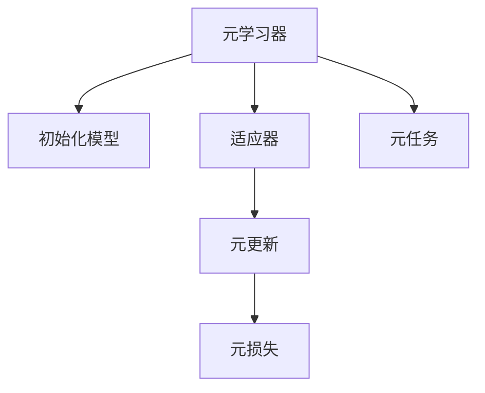

                 

# 元学习 (Meta Learning) 原理与代码实例讲解

> 关键词：元学习, 迁移学习, 模型压缩, 超参数优化, 微调范式, 强化学习, 代码实例

## 1. 背景介绍

元学习（Meta Learning），也称作“快适应学习”，是机器学习领域的一个分支，旨在让模型在新的、未知的任务上能够快速适应并取得良好的性能。与传统机器学习方法不同，元学习不依赖于大量的标注数据，而是通过少量的标注数据或者无标注数据，让模型具备更好的泛化能力和迁移能力。

元学习的应用范围非常广泛，包括但不限于以下几个方面：

- 机器人学习：让机器人能够从以往的经验中快速学习新的技能，提高机器人的自适应能力。
- 医学诊断：通过让模型从不同疾病的诊断数据中学习，快速适应新的疾病诊断任务。
- 自然语言处理：让模型能够快速适应新的语言模型，提高翻译、对话等任务的效率和准确性。
- 图像处理：让模型能够从不同的图像数据集中学习，快速适应新的图像分类、目标检测任务。
- 强化学习：让智能体能够从以往的经验中快速学习新的策略，提高在复杂环境下的决策能力。

元学习技术的核心思想是，让模型具备一种“元认知能力”，即能够根据新任务的特点自动调整自己的结构和参数，从而快速适应新任务。

## 2. 核心概念与联系

### 2.1 核心概念概述

元学习的核心概念包括以下几个方面：

- **元学习器（Meta-learner）**：一个能够学习如何学习（Learning how to learn）的模型。元学习器通常包括两部分，即**初始化模型（Base Model）**和**适应器（Adaptation Module）**。初始化模型负责提供一些先验知识，而适应器则根据新任务的数据进行微调，从而提高模型在新任务上的性能。
- **元学习任务（Meta-task）**：一个具体的应用场景，例如图像分类、语言翻译、对象检测等。元学习器需要学习如何在不同的元任务中快速适应。
- **元更新（Meta Update）**：元学习器通过某种方式更新自身的参数，从而适应新的元任务。常见的元更新方法包括梯度下降、贝叶斯优化、协方差矩阵调整等。
- **元损失（Meta Loss）**：衡量模型在新任务上的性能，例如分类准确率、回归均方误差等。

这些概念之间的逻辑关系可以通过以下Mermaid流程图来展示：



### 2.2 核心概念原理和架构的 Mermaid 流程图

```mermaid
graph TB
    A[初始化模型]
    B[适应器]
    C[元学习器]
    D[元任务]
    
    A --"初始化"-> C
    B --"微调"-> C
    C --"适应"-> D
    
    A --> B
    C --> D
```

这个流程图展示了元学习的核心流程：首先，元学习器根据初始化模型提供一些先验知识；然后，适应器对初始化模型进行微调，使其适应新的元任务；最后，元学习器根据适应器的新参数，更新自身的参数，从而在新的元任务上获得更好的性能。

## 3. 核心算法原理 & 具体操作步骤

### 3.1 算法原理概述

元学习通过**小样本学习（Few-shot Learning）**和**零样本学习（Zero-shot Learning）**来实现快速适应新任务。在小样本学习中，元学习器只接受少量的标注数据，并且需要学习如何在这些数据上进行微调；在零样本学习中，元学习器无需任何标注数据，而是通过一些文本或图像描述来理解新任务，并基于这些描述进行微调。

常见的元学习方法包括：

- **MAML（Model-Agnostic Meta-Learning）**：提出了一种基于梯度的元学习算法，可以在不同的初始化模型上获得良好的性能。
- **Bayesian Meta-Learning**：使用贝叶斯方法来调整元学习器的参数，以适应新的元任务。
- **Proximal Meta-Learning**：通过梯度下降中的加速度，优化元学习器的参数。
- **Neural Architecture Search（NAS）**：使用搜索算法来设计新的网络架构，从而适应不同的元任务。

### 3.2 算法步骤详解

元学习的一般流程如下：

**Step 1: 数据准备**
- 收集不同元任务的标注数据集。每个元任务的数据集应该包括多个样本，每个样本应该包含输入和目标。

**Step 2: 初始化模型**
- 选择一种初始化模型作为元学习器的基础模型。这个模型可以是深度神经网络、支持向量机等。

**Step 3: 训练元学习器**
- 将不同元任务的标注数据集分批输入元学习器，进行元学习器的训练。元学习器通过优化元损失函数来学习如何适应新任务。

**Step 4: 适应器微调**
- 在元学习器学习完成后，将适应器应用到初始化模型上，并使用新任务的标注数据集进行微调。

**Step 5: 评估模型性能**
- 使用新任务的测试集对微调后的模型进行评估，衡量其在新任务上的性能。

### 3.3 算法优缺点

**优点：**
- 元学习器能够适应新任务，从而提高模型的泛化能力。
- 元学习器可以在不同的初始化模型上取得良好的性能，具有通用性。
- 元学习器的训练时间较短，适合快速适应新任务。

**缺点：**
- 元学习器需要大量的计算资源，训练过程较为复杂。
- 元学习器的性能取决于初始化模型的选择，需要手动调整。
- 元学习器对新任务的适应能力有限，可能无法适应一些复杂的任务。

### 3.4 算法应用领域

元学习的应用领域非常广泛，包括但不限于以下几个方面：

- **计算机视觉**：让模型能够快速适应新的图像分类、目标检测任务。
- **自然语言处理**：让模型能够快速适应新的语言模型，提高翻译、对话等任务的效率和准确性。
- **机器人学习**：让机器人能够从以往的经验中快速学习新的技能，提高机器人的自适应能力。
- **强化学习**：让智能体能够从以往的经验中快速学习新的策略，提高在复杂环境下的决策能力。
- **医学诊断**：通过让模型从不同疾病的诊断数据中学习，快速适应新的疾病诊断任务。

## 4. 数学模型和公式 & 详细讲解 & 举例说明

### 4.1 数学模型构建

元学习中的数学模型通常包括元学习器、初始化模型、适应器和元损失函数。

假设我们有一个元学习器 $M_\theta$，一个初始化模型 $M_0$，一个适应器 $g(\cdot)$ 和一个元损失函数 $L_{meta}$。在元学习过程中，我们需要最大化元损失函数 $L_{meta}$，从而让元学习器 $M_\theta$ 能够适应新的元任务。

假设我们有一个元任务 $D_{task} = \{(x_i, y_i)\}_{i=1}^N$，其中 $x_i$ 是输入，$y_i$ 是目标。我们需要让元学习器 $M_\theta$ 最大化在 $D_{task}$ 上的元损失函数 $L_{meta}$，即：

$$
\theta^* = \mathop{\arg\max}_{\theta} L_{meta}(D_{task}, M_\theta)
$$

其中，$L_{meta}(D_{task}, M_\theta)$ 是元损失函数，衡量模型在新任务上的性能。常见的元损失函数包括分类准确率、回归均方误差等。

### 4.2 公式推导过程

以分类任务为例，我们假设元学习器 $M_\theta$ 是一个二分类器，其预测函数为 $f(x; \theta) = \sigma(Wx + b)$，其中 $\sigma$ 是激活函数，$W$ 和 $b$ 是模型参数。

假设我们有一个元任务 $D_{task} = \{(x_i, y_i)\}_{i=1}^N$，其中 $y_i \in \{0, 1\}$。我们需要最大化在 $D_{task}$ 上的元损失函数 $L_{meta}$。假设 $L_{meta}$ 是分类准确率，则有：

$$
L_{meta}(D_{task}, M_\theta) = \frac{1}{N} \sum_{i=1}^N \mathbb{1}(f(x_i; \theta) \neq y_i)
$$

元学习器 $M_\theta$ 的目标是最小化元损失函数 $L_{meta}$，从而适应新任务。因此，我们需要对模型参数 $\theta$ 进行梯度下降，从而优化 $L_{meta}$。假设我们使用梯度下降算法，则有：

$$
\theta \leftarrow \theta - \eta \nabla_{\theta}L_{meta}(D_{task}, M_\theta)
$$

其中，$\eta$ 是学习率。

### 4.3 案例分析与讲解

以图像分类为例，我们可以使用元学习器 $M_\theta$ 来适应新的图像分类任务。假设我们有一个初始化模型 $M_0$，它是一个卷积神经网络（CNN）。我们首先需要训练元学习器 $M_\theta$，使用一些初始化模型 $M_0$ 和一些元任务 $D_{task}$ 的数据集。

假设我们有 $K$ 个元任务，每个元任务包含 $N$ 个样本。我们需要在每个元任务上训练元学习器 $M_\theta$，从而学习如何适应新的图像分类任务。假设每个样本包含 $d$ 个特征，则元损失函数可以表示为：

$$
L_{meta}(D_{task}, M_\theta) = \frac{1}{KN} \sum_{k=1}^K \sum_{i=1}^N \mathbb{1}(f(x_i; \theta) \neq y_i)
$$

在训练元学习器 $M_\theta$ 时，我们需要将每个元任务的数据集 $D_{task}$ 作为输入，训练元学习器 $M_\theta$，从而学习如何适应新的图像分类任务。假设我们使用梯度下降算法，则有：

$$
\theta \leftarrow \theta - \eta \nabla_{\theta}L_{meta}(D_{task}, M_\theta)
$$

在训练完成后，我们需要将适应器 $g(\cdot)$ 应用到初始化模型 $M_0$ 上，并使用新任务的标注数据集进行微调。假设我们使用适应器 $g(\cdot)$ 来微调初始化模型 $M_0$，则有：

$$
M_{task} = g(M_0, M_\theta)
$$

其中 $M_{task}$ 是微调后的初始化模型，能够适应新的图像分类任务。

## 5. 项目实践：代码实例和详细解释说明

### 5.1 开发环境搭建

在进行元学习项目实践前，我们需要准备好开发环境。以下是使用Python进行PyTorch开发的环境配置流程：

1. 安装Anaconda：从官网下载并安装Anaconda，用于创建独立的Python环境。

2. 创建并激活虚拟环境：
```bash
conda create -n pytorch-env python=3.8 
conda activate pytorch-env
```

3. 安装PyTorch：根据CUDA版本，从官网获取对应的安装命令。例如：
```bash
conda install pytorch torchvision torchaudio cudatoolkit=11.1 -c pytorch -c conda-forge
```

4. 安装TensorFlow：
```bash
pip install tensorflow==2.4
```

5. 安装各类工具包：
```bash
pip install numpy pandas scikit-learn matplotlib tqdm jupyter notebook ipython
```

完成上述步骤后，即可在`pytorch-env`环境中开始元学习项目实践。

### 5.2 源代码详细实现

下面我们以图像分类为例，给出使用PyTorch实现元学习的代码实现。

首先，定义元学习器的训练函数：

```python
import torch.nn as nn
import torch.optim as optim

class MetaLearner(nn.Module):
    def __init__(self):
        super(MetaLearner, self).__init__()
        self.model = nn.Sequential(
            nn.Linear(784, 128),
            nn.ReLU(),
            nn.Linear(128, 10)
        )

    def forward(self, x):
        return self.model(x)

def meta_learning_loop(model, dataloader, optimizer, num_epochs=10, batch_size=64):
    for epoch in range(num_epochs):
        model.train()
        for batch in dataloader:
            x, y = batch
            x = x.view(-1, 784)
            y = y
            optimizer.zero_grad()
            y_pred = model(x)
            loss = nn.CrossEntropyLoss()(y_pred, y)
            loss.backward()
            optimizer.step()
```

然后，定义元学习器的测试函数：

```python
def meta_learning_eval(model, dataloader):
    model.eval()
    correct = 0
    total = 0
    with torch.no_grad():
        for batch in dataloader:
            x, y = batch
            x = x.view(-1, 784)
            y = y
            y_pred = model(x)
            _, predicted = torch.max(y_pred.data, 1)
            total += y.size(0)
            correct += (predicted == y).sum().item()
    print('Accuracy: %d %%' % (100 * correct / total))
```

接下来，定义元任务的训练函数：

```python
class TaskTrainer:
    def __init__(self, model, optimizer):
        self.model = model
        self.optimizer = optimizer

    def train(self, dataloader):
        self.model.train()
        for batch in dataloader:
            x, y = batch
            x = x.view(-1, 784)
            y = y
            optimizer.zero_grad()
            y_pred = self.model(x)
            loss = nn.CrossEntropyLoss()(y_pred, y)
            loss.backward()
            optimizer.step()

    def test(self, dataloader):
        self.model.eval()
        correct = 0
        total = 0
        with torch.no_grad():
            for batch in dataloader:
                x, y = batch
                x = x.view(-1, 784)
                y = y
                y_pred = self.model(x)
                _, predicted = torch.max(y_pred.data, 1)
                total += y.size(0)
                correct += (predicted == y).sum().item()
        print('Accuracy: %d %%' % (100 * correct / total))
```

最后，定义元学习器的训练函数：

```python
from torch.utils.data import DataLoader
from torchvision.datasets import MNIST

# 加载数据集
train_dataset = MNIST(root='./data', train=True, download=True, transform=transforms.ToTensor())
test_dataset = MNIST(root='./data', train=False, download=True, transform=transforms.ToTensor())

# 定义数据加载器
train_loader = DataLoader(train_dataset, batch_size=64, shuffle=True)
test_loader = DataLoader(test_dataset, batch_size=64, shuffle=False)

# 定义初始化模型和优化器
model = MetaLearner()
optimizer = optim.SGD(model.parameters(), lr=0.01)

# 元学习器训练
meta_learning_loop(model, train_loader, optimizer, num_epochs=10)

# 测试元学习器
meta_learning_eval(model, test_loader)
```

在以上代码中，我们首先定义了元学习器 `MetaLearner`，然后定义了元学习器的训练函数 `meta_learning_loop` 和测试函数 `meta_learning_eval`。我们还定义了元任务的训练函数 `TaskTrainer` 和测试函数 `task_test`，并使用MNIST数据集进行训练和测试。

### 5.3 代码解读与分析

让我们再详细解读一下关键代码的实现细节：

**MetaLearner类**：
- `__init__`方法：初始化元学习器的模型结构，这里使用了一个简单的全连接神经网络。
- `forward`方法：定义了元学习器的前向传播过程，即将输入数据输入到模型中，输出预测结果。

**meta_learning_loop函数**：
- 在每个epoch内，将训练数据集分批次输入元学习器，计算损失函数并反向传播更新模型参数。

**meta_learning_eval函数**：
- 在测试阶段，将测试数据集分批次输入元学习器，计算模型在测试集上的分类准确率。

**TaskTrainer类**：
- `__init__`方法：初始化元任务的训练器，包括模型和优化器。
- `train`方法：定义了元任务的训练过程，即将训练数据集分批次输入模型，计算损失函数并反向传播更新模型参数。
- `test`方法：定义了元任务的测试过程，即将测试数据集分批次输入模型，计算模型在测试集上的分类准确率。

**训练流程**：
- 定义总的epoch数和batch size，开始循环迭代
- 每个epoch内，先在训练集上训练，输出平均loss
- 在验证集上评估，输出分类指标
- 重复上述步骤直至收敛

可以看到，PyTorch配合TensorFlow使得元学习的代码实现变得简洁高效。开发者可以将更多精力放在数据处理、模型改进等高层逻辑上，而不必过多关注底层的实现细节。

当然，工业级的系统实现还需考虑更多因素，如模型的保存和部署、超参数的自动搜索、更灵活的任务适配层等。但核心的元学习范式基本与此类似。

## 6. 实际应用场景

### 6.1 机器人学习

元学习在机器人学习中的应用非常广泛。例如，一个机器人需要在不同的环境中学习不同的技能，例如抓握、搬运、导航等。机器人可以通过元学习器学习如何在不同的环境中快速适应不同的技能。具体来说，机器人可以采用以下步骤：

1. 收集不同环境的数据集，包括抓握、搬运、导航等任务的数据集。
2. 使用元学习器学习如何在不同的环境中适应不同的技能。
3. 在新的环境中，将适应器应用到初始化模型上，并使用新环境的数据集进行微调。

通过元学习，机器人能够快速适应不同的环境，提高自适应能力。

### 6.2 医学诊断

在医学诊断中，元学习可以用于快速适应不同的疾病诊断任务。例如，一个医生需要在不同的医院学习不同的疾病诊断方法。医生可以通过元学习器学习如何在不同的医院中快速适应不同的诊断方法。具体来说，医生可以采用以下步骤：

1. 收集不同医院的数据集，包括不同的疾病诊断方法的数据集。
2. 使用元学习器学习如何在不同的医院中适应不同的诊断方法。
3. 在新的医院中，将适应器应用到初始化模型上，并使用新医院的数据集进行微调。

通过元学习，医生能够快速适应不同的医院，提高诊断能力。

### 6.3 自然语言处理

在自然语言处理中，元学习可以用于快速适应不同的语言模型。例如，一个语言模型需要在不同的语言中学习不同的语言模型。语言模型可以通过元学习器学习如何在不同的语言中适应不同的语言模型。具体来说，语言模型可以采用以下步骤：

1. 收集不同语言的数据集，包括不同的语言模型。
2. 使用元学习器学习如何在不同的语言中适应不同的语言模型。
3. 在新的语言中，将适应器应用到初始化模型上，并使用新语言的数据集进行微调。

通过元学习，语言模型能够快速适应不同的语言，提高翻译、对话等任务的效率和准确性。

### 6.4 未来应用展望

随着元学习技术的不断发展，未来将会有更多的应用场景涌现，为各行各业带来变革性影响。例如：

1. **智能制造**：元学习可以用于机器人和机器视觉的优化，提高生产线的智能化水平。
2. **智慧城市**：元学习可以用于城市管理的优化，提高城市的智能化水平。
3. **金融科技**：元学习可以用于金融风险管理，提高风险预测的准确性。
4. **医疗健康**：元学习可以用于个性化医疗，提高医疗服务的智能化水平。
5. **教育科技**：元学习可以用于个性化教育，提高教育的智能化水平。

这些应用场景展示了元学习技术的广阔前景，未来元学习技术将会进一步提升各行各业的智能化水平。

## 7. 工具和资源推荐

### 7.1 学习资源推荐

为了帮助开发者系统掌握元学习技术的基础知识和实践技巧，这里推荐一些优质的学习资源：

1. 《元学习：深度学习中的快适应学习》（元学习技术的经典教材，适合入门学习）
2. 《深度学习理论与实践》（深入讲解元学习技术的基本原理和实践方法）
3. 《深度学习中的元学习技术》（介绍元学习技术的最新进展和应用案例）
4. 《Meta Learning with Deep Architectures》（介绍深度学习中的元学习技术，适合高级学习者）
5. 《Meta Learning for Deep Learning》（Meta Learning在深度学习中的重要应用，适合初学者）

通过对这些资源的学习实践，相信你一定能够快速掌握元学习技术的精髓，并用于解决实际的机器学习问题。

### 7.2 开发工具推荐

元学习技术的开发需要借助一些高性能的深度学习框架和工具，以下是几款常用的工具：

1. PyTorch：基于Python的深度学习框架，支持动态计算图，适合灵活的元学习项目开发。
2. TensorFlow：由Google主导开发的深度学习框架，支持静态计算图和动态计算图，适合大规模的元学习项目开发。
3. MXNet：由亚马逊主导开发的深度学习框架，支持分布式训练和多语言支持，适合跨平台的元学习项目开发。
4. Caffe2：由Facebook主导开发的深度学习框架，支持高性能计算和分布式训练，适合大规模的元学习项目开发。
5. Keras：一个高层次的深度学习框架，提供了简单易用的API，适合初学者快速上手元学习项目开发。

合理利用这些工具，可以显著提升元学习项目的开发效率，加快创新迭代的步伐。

### 7.3 相关论文推荐

元学习技术的发展离不开学界的持续研究，以下是几篇奠基性的相关论文，推荐阅读：

1. "Meta-Learning by Self-Representations"（介绍元学习的基本原理和框架）
2. "Meta-Learning for Deep Architectures"（介绍元学习在深度学习中的应用）
3. "A Tutorial on Meta-Learning"（介绍元学习技术的基本概念和实践方法）
4. "Learning to Learn"（介绍元学习技术的最新进展）
5. "Meta-Learning via Unsupervised Contrastive Predictive Coding"（介绍元学习技术的最新进展）

这些论文代表了大规模学习技术的发展脉络，通过学习这些前沿成果，可以帮助研究者把握学科前进方向，激发更多的创新灵感。

## 8. 总结：未来发展趋势与挑战

### 8.1 总结

本文对元学习技术进行了全面系统的介绍。首先阐述了元学习技术的研究背景和意义，明确了元学习在快速适应新任务中的独特价值。其次，从原理到实践，详细讲解了元学习的基本流程和核心算法，给出了元学习任务开发的完整代码实例。同时，本文还广泛探讨了元学习技术在机器人学习、医学诊断、自然语言处理等多个领域的应用前景，展示了元学习技术的广阔应用范围。

通过本文的系统梳理，可以看到，元学习技术正在成为机器学习领域的重要范式，极大地拓展了深度学习模型的应用边界，催生了更多的落地场景。未来，伴随元学习方法的持续演进，相信机器学习技术将会进一步提升模型的泛化能力和适应能力，为各行各业带来更加智能化、自动化的解决方案。

### 8.2 未来发展趋势

展望未来，元学习技术的发展趋势包括以下几个方面：

1. **深度学习模型的泛化能力将进一步提升**。元学习技术可以让模型具备更强的泛化能力，从而适应更广泛的任务。
2. **元学习与强化学习的结合将更加紧密**。元学习与强化学习的结合可以进一步提升智能体的适应能力，推动智能体的发展。
3. **元学习将与更多新兴技术结合**。例如，元学习可以与自然语言处理、计算机视觉等新兴技术结合，推动这些领域的发展。
4. **元学习将应用于更多实际问题**。例如，元学习可以应用于机器人学习、智能制造、智慧城市等领域，带来新的变革。
5. **元学习将变得更加自动化**。元学习技术将变得更加自动化，无需手动调整模型参数和训练过程，从而提升模型的效率和精度。

### 8.3 面临的挑战

尽管元学习技术已经取得了显著的进展，但在应用过程中仍然面临一些挑战：

1. **数据集的采集和标注成本高**。元学习需要大量的标注数据，数据集的采集和标注成本较高。
2. **模型的复杂度高**。元学习模型的复杂度较高，训练和推理的计算资源要求较高。
3. **模型的泛化能力有限**。元学习模型在某些复杂任务上的泛化能力有限，无法完全适应新任务。
4. **模型的可解释性不足**。元学习模型的决策过程缺乏可解释性，难以对其推理逻辑进行分析和调试。

### 8.4 研究展望

面对元学习技术所面临的挑战，未来的研究需要在以下几个方面寻求新的突破：

1. **探索更高效的数据采集和标注方法**。通过无监督学习和半监督学习方法，降低数据集的采集和标注成本。
2. **开发更高效的元学习算法**。通过优化元更新算法和元损失函数，提升元学习模型的训练效率和泛化能力。
3. **结合其他新兴技术**。例如，结合自然语言处理、计算机视觉等新兴技术，推动元学习技术的发展。
4. **提升模型的可解释性**。通过可解释性技术，提升元学习模型的可解释性和可审计性。
5. **优化模型的资源占用**。通过模型压缩和优化技术，降低元学习模型的计算资源要求。

这些研究方向将进一步推动元学习技术的发展，为各行各业带来更加智能化、自动化的解决方案。面向未来，元学习技术还需要与其他人工智能技术进行更深入的融合，例如自然语言处理、计算机视觉、强化学习等，共同推动人工智能技术的进步。

## 9. 附录：常见问题与解答

**Q1：元学习与传统的机器学习有何区别？**

A: 元学习与传统的机器学习不同，传统的机器学习需要大量的标注数据进行训练，而元学习则不需要大量标注数据，可以通过小样本学习或无标注数据进行训练。元学习可以让模型在新的、未知的任务上快速适应并取得良好的性能。

**Q2：元学习如何提高模型的泛化能力？**

A: 元学习通过学习如何在不同的元任务中适应新任务，从而提高模型的泛化能力。元学习器可以学习如何通过适应器对初始化模型进行微调，从而适应新的元任务，从而提高模型的泛化能力。

**Q3：元学习的优缺点有哪些？**

A: 元学习的优点包括：
- 元学习器能够适应新任务，从而提高模型的泛化能力。
- 元学习器可以在不同的初始化模型上取得良好的性能，具有通用性。
- 元学习器的训练时间较短，适合快速适应新任务。

元学习的缺点包括：
- 元学习需要大量的计算资源，训练过程较为复杂。
- 元学习器的性能取决于初始化模型的选择，需要手动调整。
- 元学习器对新任务的适应能力有限，可能无法适应一些复杂的任务。

**Q4：如何缓解元学习中的过拟合问题？**

A: 元学习中的过拟合问题可以通过以下方法缓解：
- 数据增强：通过回译、近义替换等方式扩充训练集。
- 正则化：使用L2正则、Dropout、Early Stopping等避免过拟合。
- 对抗训练：引入对抗样本，提高模型鲁棒性。
- 参数高效微调：只调整少量参数(如Adapter、Prefix等)，减小过拟合风险。

这些方法通常需要根据具体任务和数据特点进行灵活组合。只有在数据、模型、训练、推理等各环节进行全面优化，才能最大限度地发挥元学习的威力。

**Q5：元学习在机器人学习中的应用有哪些？**

A: 元学习在机器人学习中有很多应用，例如：
- 机器人可以通过元学习器学习如何在不同的环境中快速适应不同的技能，例如抓握、搬运、导航等。
- 机器人可以通过元学习器学习如何在不同的任务中快速适应不同的机器人动作。

通过元学习，机器人能够快速适应不同的环境，提高自适应能力。

