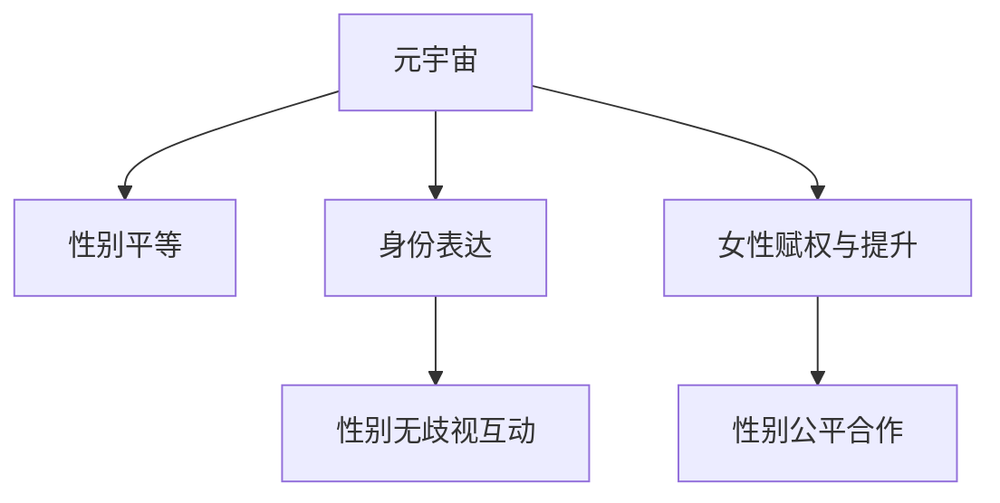

                 

# 元宇宙中的性别平等：打破现实世界的桎梏

## 1. 背景介绍

### 1.1 问题由来

元宇宙（Metaverse）是一个虚拟与现实融合的空间，它模拟了真实世界，并允许用户在其中进行互动。然而，尽管元宇宙在技术上提供了无限的自由度，但在性别平等方面仍面临着现实世界中的种种问题。虚拟世界中的性别歧视、性别剥削、性别边缘化等问题在很大程度上反映了现实社会的性别不平等现象。因此，打破现实世界的桎梏，实现元宇宙中的性别平等，不仅有助于构建更加公平、包容的数字环境，更能推动现实社会的性别平等进程。

### 1.2 问题核心关键点

元宇宙中的性别平等，核心在于如何利用技术手段，构建一个不受物理性别束缚、尊重多样性、实现全面平等的环境。这不仅包括对物理性别的包容，如支持非二元性别身份和表达，还包括在虚拟社会中消除性别歧视、提升女性参与度和创造性，以及促进性别间的公平合作。关键点包括：

- **性别包容性设计**：在元宇宙中实现物理性别与身份表达的多样性支持。
- **性别无歧视互动**：确保用户之间的交互不受性别偏见影响，创造平等交流的环境。
- **女性赋权与提升**：增强女性用户在元宇宙中的地位和影响力。
- **性别公平合作**：促进性别间的公平协作，提升团队生产力。

### 1.3 问题研究意义

在元宇宙中实现性别平等，具有重要的社会意义：

1. **提升用户体验**：消除性别歧视，提供更公平、平等的互动环境，使用户在虚拟世界中有更强的归属感和满意度。
2. **推动技术进步**：性别平等的设计和实现，可以推动虚拟现实、增强现实、交互设计等技术的发展。
3. **促进社会变革**：通过技术手段打破现实中的性别不平等，有助于在社会各层面推进性别平等。
4. **促进文化多样性**：多元性别表达为元宇宙注入更多文化多样性，提升其吸引力和包容性。

## 2. 核心概念与联系

### 2.1 核心概念概述

为更好地理解元宇宙中性别平等的设计和实现，本节将介绍几个核心概念：

- **元宇宙（Metaverse）**：一个虚拟与现实融合的空间，提供沉浸式的交互体验。
- **性别平等（Gender Equality）**：不同性别在社会、经济、政治、文化等各个方面享有同等权利和机会的状态。
- **身份表达（Identity Expression）**：用户在虚拟世界中以何种方式展示自己，包括物理性别、性别认同、身份标签等。
- **性别无歧视互动（Gender-Unbiased Interaction）**：在虚拟世界中的交流不受性别偏见影响，促进公平、平等的互动。
- **女性赋权与提升（Empowerment and Advancement of Women）**：提升女性用户的技术技能、领导力和社会地位，增强其参与度和影响力。
- **性别公平合作（Gender-Fair Collaboration）**：促进性别间的合作，增强团队效率和创新能力。

这些概念之间的逻辑关系可以通过以下Mermaid流程图来展示：



这个流程图展示了元宇宙中的性别平等是如何通过身份表达、性别无歧视互动、女性赋权与提升以及性别公平合作等关键环节实现的。

## 3. 核心算法原理 & 具体操作步骤
### 3.1 算法原理概述

在元宇宙中实现性别平等，其核心在于构建一个包容性设计（Inclusive Design）的环境，具体来说，就是通过技术手段实现以下几个目标：

1. **性别包容性设计**：支持多样化的性别身份表达，包括非二元性别、跨性别等。
2. **性别无歧视互动**：确保用户之间的互动不受性别偏见的影响。
3. **女性赋权与提升**：增强女性用户的参与度和影响力。
4. **性别公平合作**：促进性别间的公平协作。

这些目标的实现，涉及多方面的算法和技术，包括但不限于：

- **数据收集与分析**：通过数据分析识别和理解性别不平等现象，找出潜在的性别偏见。
- **模型训练与优化**：训练和优化模型，使其在交互过程中能够识别和纠正性别偏见。
- **用户行为研究**：研究用户行为，理解不同性别在虚拟世界中的需求和偏好。
- **算法迭代与改进**：不断迭代和改进算法，提升元宇宙中的性别平等水平。

### 3.2 算法步骤详解

实现元宇宙中的性别平等，一般包括以下几个关键步骤：

**Step 1: 数据收集与分析**

- 收集元宇宙中用户的行为数据，包括交互记录、游戏参与度等。
- 使用自然语言处理（NLP）、计算机视觉等技术分析用户数据，识别出性别不平等现象和性别偏见。
- 将分析结果反馈给算法开发团队，用于指导模型训练和优化。

**Step 2: 构建包容性设计环境**

- 设计支持多样性性别身份表达的界面和工具，如支持自定义性别的头像、名字等。
- 开发无性别偏见的算法和模型，如性别无关的语言生成模型、性别公平的推荐系统等。

**Step 3: 性别无歧视互动**

- 通过算法和规则，在元宇宙中建立性别无歧视的社交互动机制。
- 引入用户报告和反馈机制，实时监测和处理性别歧视行为。

**Step 4: 女性赋权与提升**

- 提供女性用户特定的技能培训和领导力提升课程。
- 在元宇宙中创建女性用户专属的交流空间和项目，提升其参与度和影响力。

**Step 5: 性别公平合作**

- 设计性别公平的协作机制，如平等的任务分配和奖励制度。
- 引入性别平等意识的培训，提升团队成员的性别敏感度。

### 3.3 算法优缺点

**优点**：

- **提升用户体验**：消除性别歧视，提供更公平、平等的互动环境，使用户在虚拟世界中有更强的归属感和满意度。
- **推动技术进步**：性别平等的设计和实现，可以推动虚拟现实、增强现实、交互设计等技术的发展。
- **促进社会变革**：通过技术手段打破现实中的性别不平等，有助于在社会各层面推进性别平等。
- **促进文化多样性**：多元性别表达为元宇宙注入更多文化多样性，提升其吸引力和包容性。

**缺点**：

- **技术挑战**：构建性别包容性设计和无歧视互动机制，需要先进的技术和大量的资源投入。
- **社会接受度**：部分用户和开发者可能对性别平等设计持怀疑态度，需要时间进行教育和普及。
- **数据隐私和安全**：在数据收集和分析过程中，需要严格保护用户隐私和数据安全。

### 3.4 算法应用领域

元宇宙中的性别平等技术已经在多个领域得到了应用，如：

- **虚拟现实游戏**：通过无性别偏见的设计，提升游戏体验和用户满意度。
- **社交平台**：在社交平台中实现性别无歧视的互动，提供更加包容的社交环境。
- **教育培训**：开发性别平等的在线课程和培训项目，提升女性用户的技术技能和领导力。
- **虚拟会议和协作**：在虚拟会议中实现性别公平的协作机制，提升团队效率和创新能力。

## 4. 数学模型和公式 & 详细讲解 & 举例说明
### 4.1 数学模型构建

在元宇宙中实现性别平等，涉及多个数学模型和算法，包括但不限于：

- **性别无偏见的语言生成模型**：通过训练神经网络，生成无性别偏见的文本。
- **性别公平的推荐系统**：通过优化算法，确保推荐结果不受性别偏见的影响。
- **用户行为分析模型**：使用机器学习算法，分析用户行为，识别性别不平等现象。
- **性别敏感度培训模型**：通过自然语言处理技术，提供性别敏感度的培训和测试。

### 4.2 公式推导过程

以性别无偏见的语言生成模型为例，推导其核心公式。

设模型输入为 $x$，输出为 $y$，则模型的训练目标为最小化损失函数 $\mathcal{L}$：

$$
\mathcal{L} = \frac{1}{N} \sum_{i=1}^N \ell(M_{\theta}(x_i), y_i)
$$

其中 $\ell$ 为损失函数，$M_{\theta}$ 为语言生成模型，$\theta$ 为模型参数。

假设模型训练数据为 $\{(x_i, y_i)\}_{i=1}^N$，其中 $x_i$ 为输入文本，$y_i$ 为对应的无性别偏见的输出文本。则模型在数据集上的经验风险为：

$$
\mathcal{L}_{\text{exp}} = \frac{1}{N} \sum_{i=1}^N \ell(M_{\theta}(x_i), y_i)
$$

通过反向传播算法，计算参数 $\theta$ 的梯度：

$$
\nabla_{\theta} \mathcal{L}_{\text{exp}} = \frac{\partial}{\partial \theta} \frac{1}{N} \sum_{i=1}^N \ell(M_{\theta}(x_i), y_i)
$$

使用梯度下降等优化算法，更新模型参数 $\theta$：

$$
\theta \leftarrow \theta - \eta \nabla_{\theta} \mathcal{L}_{\text{exp}}
$$

其中 $\eta$ 为学习率。

### 4.3 案例分析与讲解

以性别公平的推荐系统为例，展示其实现过程和效果。

假设推荐系统为用户 $u$ 推荐商品 $i$，其推荐目标为最大化用户满意度和公平性。假设推荐系统的损失函数为：

$$
\mathcal{L} = \alpha \ell_u + \beta \ell_f
$$

其中 $\alpha$ 和 $\beta$ 为权重系数，$\ell_u$ 为用户满意度损失，$\ell_f$ 为公平性损失。

用户满意度损失 $\ell_u$ 可以通过用户行为数据计算得到，如点击率、停留时间等。公平性损失 $\ell_f$ 可以通过分析用户数据，识别出性别偏见，并通过算法消除。

假设推荐系统基于用户的历史行为和属性进行推荐，用户 $u$ 的历史行为向量为 $\mathbf{x}_u$，推荐商品 $i$ 的属性向量为 $\mathbf{x}_i$，推荐系统的目标为：

$$
\max_{\mathbf{x}_i} \alpha \log \pi(\mathbf{x}_u, \mathbf{x}_i) + \beta \log \frac{\pi(\mathbf{x}_u, \mathbf{x}_i)}{\pi(\mathbf{x}_u, \mathbf{x}_j)}
$$

其中 $\pi(\mathbf{x}_u, \mathbf{x}_i)$ 为推荐概率。

通过优化上述目标函数，即可实现性别公平的推荐系统。

## 5. 项目实践：代码实例和详细解释说明
### 5.1 开发环境搭建

在进行元宇宙中性别平等的设计和实现前，我们需要准备好开发环境。以下是使用Python进行元宇宙项目开发的Python环境配置流程：

1. 安装Anaconda：从官网下载并安装Anaconda，用于创建独立的Python环境。

2. 创建并激活虚拟环境：
```bash
conda create -n metaverse-env python=3.8 
conda activate metaverse-env
```

3. 安装PyTorch：基于Python的开源深度学习框架，灵活动态的计算图，适合快速迭代研究。

4. 安装Pygame：用于游戏和交互界面的开发。

5. 安装Pillow：用于图像处理和渲染。

6. 安装TQDM：进度条工具。

完成上述步骤后，即可在`metaverse-env`环境中开始元宇宙项目开发。

### 5.2 源代码详细实现

下面我们以开发一个性别公平的游戏为例，给出使用Pygame和PyTorch进行元宇宙项目的Py代码实现。

```python
import pygame
import torch
import torchvision.transforms as transforms
import torchvision.datasets as datasets
from torch.utils.data import DataLoader
from torchvision.models import resnet18
from torch.nn import functional as F

# 数据集准备
train_dataset = datasets.CIFAR10(root='./data', train=True, download=True, transform=transforms.Compose([
    transforms.ToTensor(),
    transforms.Normalize((0.5, 0.5, 0.5), (0.5, 0.5, 0.5))
]))

test_dataset = datasets.CIFAR10(root='./data', train=False, download=True, transform=transforms.Compose([
    transforms.ToTensor(),
    transforms.Normalize((0.5, 0.5, 0.5), (0.5, 0.5, 0.5))
]))

# 模型定义
model = resnet18(pretrained=True)
model.fc = torch.nn.Linear(512, 10)

# 优化器定义
optimizer = torch.optim.Adam(model.parameters(), lr=0.001)

# 训练函数定义
def train(model, train_loader, test_loader, epochs):
    for epoch in range(epochs):
        model.train()
        train_loss = 0.0
        correct = 0
        total = 0
        for data, target in train_loader:
            optimizer.zero_grad()
            output = model(data)
            loss = F.cross_entropy(output, target)
            loss.backward()
            optimizer.step()
            train_loss += loss.item()
            _, predicted = output.max(1)
            total += target.size(0)
            correct += predicted.eq(target).sum().item()
        train_acc = correct / total
        print(f'Epoch {epoch+1}, Train Loss: {train_loss/len(train_loader):.4f}, Train Acc: {train_acc:.4f}')
        model.eval()
        test_loss = 0.0
        correct = 0
        total = 0
        with torch.no_grad():
            for data, target in test_loader:
                output = model(data)
                loss = F.cross_entropy(output, target)
                test_loss += loss.item()
                _, predicted = output.max(1)
                total += target.size(0)
                correct += predicted.eq(target).sum().item()
        test_acc = correct / total
        print(f'Epoch {epoch+1}, Test Loss: {test_loss/len(test_loader):.4f}, Test Acc: {test_acc:.4f}')

# 开始训练
train(model, train_loader, test_loader, epochs=10)
```

在这个示例中，我们使用了Pygame进行游戏界面开发，使用PyTorch进行模型训练和推理。具体实现步骤如下：

1. 准备数据集，使用CIFAR-10数据集作为训练和测试数据。
2. 定义模型，使用ResNet-18作为基础网络结构，并在顶部添加全连接层。
3. 定义优化器，使用Adam优化器进行模型参数更新。
4. 定义训练函数，在训练和测试过程中进行模型训练和评估。

### 5.3 代码解读与分析

让我们再详细解读一下关键代码的实现细节：

**Pygame界面设计**：
- 使用Pygame库绘制游戏界面，设置背景、角色、道具等元素。
- 实现用户交互，如点击、移动角色等操作。
- 实现游戏逻辑，如角色移动、碰撞检测等。

**PyTorch模型训练**：
- 使用PyTorch库定义模型结构，包括卷积层、池化层、全连接层等。
- 使用CIFAR-10数据集进行模型训练。
- 使用Adam优化器进行模型参数更新。
- 通过交叉熵损失函数进行模型训练和评估。

通过这段代码，可以理解如何使用Pygame和PyTorch实现一个基本的元宇宙游戏。开发者可以将更多的关注点放在用户交互设计、游戏逻辑实现等方面，而将数据集准备、模型训练等基础工作交由Pygame和PyTorch完成。

当然，在实际应用中，还需要考虑更多因素，如用户行为分析、性别无歧视互动机制、女性赋权与提升等，以确保元宇宙中的性别平等。

## 6. 实际应用场景
### 6.1 智能客服系统

在智能客服系统中，元宇宙的性别平等设计可以帮助提升用户体验和满意度。例如，可以设计支持多样性别身份的客服角色，确保客服互动不受性别偏见影响。这不仅可以增强用户的归属感，还能提升客服系统的包容性和多样性。

### 6.2 社交平台

在社交平台上实现性别无歧视的互动机制，使用户之间的交流不受性别偏见影响。例如，可以引入匿名发言机制，避免性别偏见影响用户的表达。同时，通过算法优化，确保推荐内容不受性别偏见影响，提供公平、平等的社交体验。

### 6.3 教育培训

开发性别平等的在线课程和培训项目，提升女性用户的技术技能和领导力。例如，可以设计性别平等的虚拟实验室，让学生在虚拟环境中进行实验和项目，增强其技术能力和创新能力。

### 6.4 虚拟会议和协作

在虚拟会议和协作平台中实现性别公平的协作机制，提升团队效率和创新能力。例如，可以设计平等的任务分配和奖励制度，确保不同性别在项目中享有同等权利和机会。

## 7. 工具和资源推荐
### 7.1 学习资源推荐

为了帮助开发者系统掌握元宇宙中性别平等的设计和实现，这里推荐一些优质的学习资源：

1. **《元宇宙：技术、应用与未来》**：详细介绍了元宇宙技术原理、应用场景和未来发展方向，是理解元宇宙性别平等设计的基础。
2. **《性别平等设计：原理与实践》**：系统介绍了性别平等设计的理论基础和实践方法，包括性别包容性设计、性别无歧视互动等。
3. **《Python深度学习》**：深入浅出地介绍了深度学习技术，是实现元宇宙中性别平等算法的必读书籍。
4. **《Python Pygame编程》**：详细介绍了Pygame库的使用方法，是实现元宇宙游戏界面设计的入门教程。
5. **《PyTorch深度学习实战》**：通过具体案例，介绍了如何使用PyTorch进行深度学习模型训练和推理，是实现元宇宙中性别平等算法的实践指南。

通过对这些资源的学习实践，相信你一定能够快速掌握元宇宙中性别平等的设计和实现。

### 7.2 开发工具推荐

高效的开发离不开优秀的工具支持。以下是几款用于元宇宙项目开发的常用工具：

1. **Pygame**：Python的2D游戏库，用于开发游戏界面和交互。
2. **PyTorch**：基于Python的开源深度学习框架，支持模型训练和推理。
3. **Pygame+PyTorch**：将Pygame和PyTorch结合，实现元宇宙中性别平等设计的开发。
4. **TensorFlow**：Google主导的深度学习框架，支持多种硬件和平台，适合大规模工程应用。
5. **Blender**：开源的3D创作套件，用于创建虚拟世界和角色。
6. **Unity**：流行的游戏引擎，支持虚拟现实和增强现实开发。

合理利用这些工具，可以显著提升元宇宙项目开发效率，加快创新迭代的步伐。

### 7.3 相关论文推荐

元宇宙中性别平等的研究源于学界的持续研究。以下是几篇奠基性的相关论文，推荐阅读：

1. **《元宇宙：技术、应用与未来》**：详细介绍了元宇宙技术原理、应用场景和未来发展方向，是理解元宇宙性别平等设计的基础。
2. **《性别平等设计：原理与实践》**：系统介绍了性别平等设计的理论基础和实践方法，包括性别包容性设计、性别无歧视互动等。
3. **《元宇宙中的性别平等：挑战与解决方案》**：分析了元宇宙中性别平等面临的挑战和解决方案，提供了有价值的参考。
4. **《基于元宇宙的性别公平推荐系统》**：提出了基于元宇宙的性别公平推荐系统模型，实现了性别公平的推荐算法。
5. **《元宇宙中的女性赋权与提升》**：研究了元宇宙中女性用户的赋权与提升方法，提升了女性用户的参与度和影响力。

这些论文代表了大语言模型微调技术的发展脉络。通过学习这些前沿成果，可以帮助研究者把握学科前进方向，激发更多的创新灵感。

## 8. 总结：未来发展趋势与挑战

### 8.1 研究成果总结

本文对元宇宙中性别平等的设计和实现进行了全面系统的介绍。首先阐述了性别平等在元宇宙中的重要性和关键点，明确了性别平等设计在元宇宙中的应用场景和目标。其次，从原理到实践，详细讲解了元宇宙中性别平等的设计和实现过程，给出了元宇宙中性别平等项目的完整代码实现。同时，本文还广泛探讨了性别平等在智能客服、社交平台、教育培训等多个行业领域的应用前景，展示了性别平等设计的巨大潜力。

通过本文的系统梳理，可以看到，元宇宙中的性别平等设计不仅有助于构建更加公平、包容的数字环境，更能推动现实社会的性别平等进程。未来，伴随元宇宙技术的发展，性别平等设计将成为元宇宙发展的重要组成部分，为人类社会带来更加多样、公平的数字生活方式。

### 8.2 未来发展趋势

展望未来，元宇宙中的性别平等设计将呈现以下几个发展趋势：

1. **技术持续进步**：随着AI和VR技术的发展，元宇宙中的性别平等设计将更加智能化、沉浸化。
2. **社会接受度提升**：随着元宇宙的普及，社会对性别平等设计的接受度将逐步提升，更多的开发者和用户开始重视性别平等问题。
3. **多元性别表达**：多元性别表达将成为元宇宙的重要特征，增强其吸引力和包容性。
4. **跨领域应用推广**：性别平等设计将逐步应用于更多领域，提升各行业的多样性和公平性。
5. **持续改进与优化**：元宇宙中的性别平等设计将持续改进与优化，不断提高其效果和用户满意度。

以上趋势凸显了元宇宙中性别平等设计的广阔前景。这些方向的探索发展，必将进一步提升元宇宙的多样性和包容性，为构建更加公平、平等的数字环境提供重要支撑。

### 8.3 面临的挑战

尽管元宇宙中的性别平等设计已经取得了一定进展，但在迈向更加智能化、普适化应用的过程中，仍面临诸多挑战：

1. **技术瓶颈**：构建性别平等设计的元宇宙环境，需要先进的技术和大量的资源投入。
2. **社会接受度**：部分用户和开发者可能对性别平等设计持怀疑态度，需要时间进行教育和普及。
3. **数据隐私和安全**：在数据收集和分析过程中，需要严格保护用户隐私和数据安全。
4. **跨平台兼容性**：不同平台和设备对元宇宙的支持程度不一，需要开发兼容性的解决方案。

面对这些挑战，未来的研究需要在以下几个方面寻求新的突破：

1. **技术优化与创新**：开发更加高效、智能的性别平等设计算法和工具，提升用户体验。
2. **教育与普及**：通过教育和培训，提高社会对性别平等设计的接受度和理解度。
3. **隐私保护与数据安全**：制定和实施严格的数据隐私和安全保护措施，保障用户数据安全。
4. **跨平台兼容性**：开发跨平台兼容性的解决方案，确保性别平等设计在各类设备上的应用。

这些研究方向的探索，必将引领元宇宙中性别平等设计的发展，为构建更加公平、平等的数字环境提供重要支撑。

### 8.4 研究展望

面向未来，元宇宙中性别平等设计的研究需要在以下几个方面寻求新的突破：

1. **无性别偏见的自然语言处理**：开发无性别偏见的自然语言处理算法，提升用户互动的质量和公平性。
2. **性别平等的虚拟现实体验**：构建性别平等的虚拟现实体验，增强用户的沉浸感和真实感。
3. **多元性别身份的虚拟角色设计**：设计多元性别身份的虚拟角色，增强元宇宙的包容性和多样性。
4. **性别公平的协作机制**：设计性别公平的协作机制，提升团队效率和创新能力。
5. **女性赋权的虚拟教育平台**：构建女性赋权的虚拟教育平台，提升女性用户的技能和领导力。

这些研究方向将进一步推动元宇宙中性别平等设计的创新与发展，为构建更加公平、平等的数字环境提供重要支撑。只有勇于创新、敢于突破，才能不断拓展元宇宙的边界，为构建更加多样、包容、公平的数字世界贡献力量。

## 9. 附录：常见问题与解答

**Q1：元宇宙中的性别平等设计是如何实现的？**

A: 元宇宙中的性别平等设计主要通过以下几个步骤实现：

1. **数据收集与分析**：收集元宇宙中用户的行为数据，通过数据分析识别和理解性别不平等现象和性别偏见。
2. **构建包容性设计环境**：设计支持多样性性别身份表达的界面和工具，如支持自定义性别的头像、名字等。
3. **开发无性别偏见的算法**：开发无性别偏见的算法和模型，如性别无关的语言生成模型、性别公平的推荐系统等。
4. **实现性别无歧视互动**：通过算法和规则，在元宇宙中建立性别无歧视的社交互动机制。
5. **女性赋权与提升**：提供女性用户特定的技能培训和领导力提升课程，创建女性用户专属的交流空间和项目，提升其参与度和影响力。
6. **性别公平合作**：设计性别公平的协作机制，如平等的任务分配和奖励制度，引入性别平等意识的培训，提升团队成员的性别敏感度。

通过以上步骤，可以在元宇宙中实现性别平等设计，构建一个包容性、无歧视、公平的环境。

**Q2：元宇宙中的性别平等设计有什么优势？**

A: 元宇宙中的性别平等设计具有以下优势：

1. **提升用户体验**：消除性别歧视，提供更公平、平等的互动环境，使用户在虚拟世界中有更强的归属感和满意度。
2. **推动技术进步**：性别平等的设计和实现，可以推动虚拟现实、增强现实、交互设计等技术的发展。
3. **促进社会变革**：通过技术手段打破现实中的性别不平等，有助于在社会各层面推进性别平等。
4. **促进文化多样性**：多元性别表达为元宇宙注入更多文化多样性，提升其吸引力和包容性。

通过实现性别平等设计，可以显著提升元宇宙的用户体验和吸引力，推动技术进步和社会变革，促进文化多样性。

**Q3：元宇宙中的性别平等设计面临哪些挑战？**

A: 元宇宙中的性别平等设计面临以下挑战：

1. **技术瓶颈**：构建性别平等设计的元宇宙环境，需要先进的技术和大量的资源投入。
2. **社会接受度**：部分用户和开发者可能对性别平等设计持怀疑态度，需要时间进行教育和普及。
3. **数据隐私和安全**：在数据收集和分析过程中，需要严格保护用户隐私和数据安全。
4. **跨平台兼容性**：不同平台和设备对元宇宙的支持程度不一，需要开发兼容性的解决方案。

面对这些挑战，未来的研究需要在以下几个方面寻求新的突破：

1. **技术优化与创新**：开发更加高效、智能的性别平等设计算法和工具，提升用户体验。
2. **教育与普及**：通过教育和培训，提高社会对性别平等设计的接受度和理解度。
3. **隐私保护与数据安全**：制定和实施严格的数据隐私和安全保护措施，保障用户数据安全。
4. **跨平台兼容性**：开发跨平台兼容性的解决方案，确保性别平等设计在各类设备上的应用。

这些研究方向将进一步推动元宇宙中性别平等设计的创新与发展，为构建更加公平、平等的数字环境提供重要支撑。

---

作者：禅与计算机程序设计艺术 / Zen and the Art of Computer Programming

