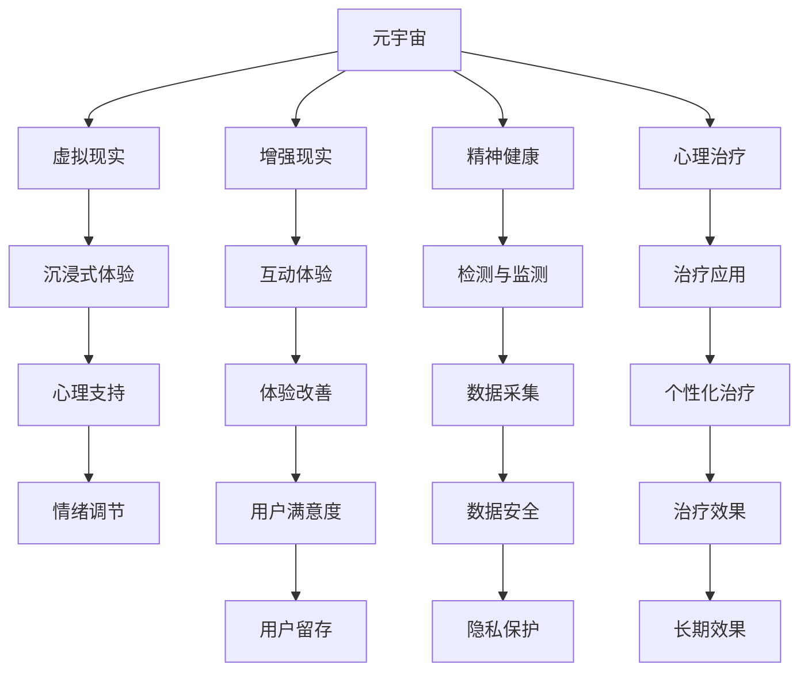

                 

# 元宇宙精神治疗:虚拟 worlds 的精神治疗技术

## 1. 背景介绍

### 1.1 问题由来
随着虚拟现实技术的快速发展，元宇宙（Metaverse）这一概念应运而生。它描绘了一个虚拟世界，人们可以通过沉浸式设备进入其中，进行社交、娱乐、工作等各种活动。但与此同时，元宇宙的普及也带来了新的精神健康问题。人们长时间沉浸于虚拟世界，可能导致现实生活中的社交隔离、心理疲劳和情绪波动等问题。因此，将精神治疗技术引入元宇宙，帮助用户保持心理健康，成为迫切需求。

### 1.2 问题核心关键点
元宇宙精神治疗技术主要围绕以下几个核心关键点展开：

- 虚拟环境设计：构建一个虚拟世界，模拟现实中的各种场景和互动模式。
- 精神健康检测：实时监测用户的行为和情绪，及时发现心理问题的早期迹象。
- 精神治疗应用：开发针对性的精神治疗方案，如放松训练、心理辅导等，帮助用户恢复心理健康。
- 虚拟现实技术：采用VR、AR等技术，提升用户的沉浸感和互动体验。
- 个性化治疗计划：根据用户的个性、心理状态和历史数据，定制个性化的治疗方案。
- 跨领域融合：将精神治疗与游戏、社交、教育等多个领域进行融合，实现综合化的心理健康支持。

这些核心关键点共同构成了元宇宙精神治疗技术的框架，使其能够更好地满足用户需求，提升用户的心理健康水平。

## 2. 核心概念与联系

### 2.1 核心概念概述

为更好地理解元宇宙精神治疗技术，本节将介绍几个密切相关的核心概念：

- 元宇宙（Metaverse）：一个虚拟的、持续的、全方位的在线环境，用户可以与虚拟对象交互，参与虚拟活动。
- 虚拟现实（Virtual Reality, VR）：通过计算机生成的3D环境，使用户获得沉浸式体验。
- 增强现实（Augmented Reality, AR）：将数字信息叠加到现实世界之上，提升现实世界的交互性和丰富性。
- 精神健康（Mental Health）：涉及个体的情绪、认知、行为等方面的健康状态，包括抑郁、焦虑、创伤后应激障碍等。
- 心理治疗（Psychotherapy）：通过专业方法，帮助个体解决心理问题，恢复心理健康。
- 沉浸式体验（Immersive Experience）：通过视觉、听觉、触觉等多种感官刺激，使用户全身心投入虚拟环境。

这些核心概念之间的逻辑关系可以通过以下Mermaid流程图来展示：



这个流程图展示了一个完整的元宇宙精神治疗系统：

1. 元宇宙作为一个虚拟世界，通过虚拟现实和增强现实技术为用户提供沉浸式体验。
2. 用户通过虚拟环境参与各种互动活动，如社交、游戏等，同时精神健康状况受到监测。
3. 精神健康监测系统采集用户的行为和情绪数据，分析其心理状态。
4. 心理治疗系统根据用户的个性化需求，设计个性化的治疗方案，如放松训练、心理辅导等。
5. 用户通过虚拟环境接受心理治疗，获得情绪支持和心理调节。
6. 治疗效果通过用户体验和满意度来衡量，同时数据安全与隐私保护是系统运行的基础。

## 3. 核心算法原理 & 具体操作步骤
### 3.1 算法原理概述

元宇宙精神治疗技术基于虚拟现实技术和精神治疗的双重原理，旨在通过虚拟环境为用户提供沉浸式心理治疗体验，同时结合心理检测与个性化治疗方案，实现实时化、个性化的心理健康支持。

### 3.2 算法步骤详解

元宇宙精神治疗技术主要包括以下几个关键步骤：

**Step 1: 虚拟环境设计**
- 根据精神健康需求，设计虚拟世界中的虚拟环境，如虚拟社区、虚拟医院等。
- 利用虚拟现实技术，为用户创造沉浸式体验，如3D场景渲染、实时交互等。
- 结合增强现实技术，提供虚拟对象与现实环境的互动，提升用户体验。

**Step 2: 精神健康监测**
- 通过传感器和摄像头等设备，实时采集用户的行为数据，如运动轨迹、心率变化等。
- 使用心理问卷和情绪分析算法，评估用户的情绪状态和心理压力。
- 根据采集到的数据，生成用户心理健康报告，及时发现潜在问题。

**Step 3: 精神治疗应用**
- 根据用户的心理健康状况，设计个性化的治疗方案，如放松训练、认知行为疗法等。
- 在虚拟环境中实施治疗方案，如通过虚拟导引、虚拟教练等方式进行互动。
- 结合心理辅导和心理咨询，帮助用户缓解心理压力，恢复心理健康。

**Step 4: 用户体验优化**
- 通过用户反馈和行为数据分析，持续优化虚拟环境的设计和功能，提升用户体验。
- 引入游戏元素和互动机制，提升用户沉浸感和参与度。
- 定期更新虚拟内容，保持用户的兴趣和粘性。

**Step 5: 系统维护与改进**
- 定期对虚拟环境进行维护和升级，确保系统的稳定性和安全性。
- 根据用户需求和技术发展，不断改进算法和模型，提升治疗效果。
- 建立用户反馈机制，及时响应和解决用户问题。

以上是元宇宙精神治疗技术的一般流程。在实际应用中，还需要针对具体任务的特点，对各环节进行优化设计，如改进虚拟环境设计、增强精神健康监测的准确性、优化个性化治疗方案等，以进一步提升系统的性能和用户体验。

### 3.3 算法优缺点

元宇宙精神治疗技术具有以下优点：

1. 沉浸式体验：通过虚拟现实和增强现实技术，为用户提供沉浸式体验，使用户更容易投入和参与治疗。
2. 实时监测：实时采集和分析用户的行为和情绪数据，及时发现心理问题的早期迹象。
3. 个性化治疗：根据用户的个性和需求，设计个性化的治疗方案，提升治疗效果。
4. 跨领域融合：将精神治疗与游戏、社交、教育等多个领域进行融合，实现综合化的心理健康支持。

但同时，该技术也存在以下局限性：

1. 技术成本高：虚拟现实和增强现实技术对硬件和软件要求较高，成本较高。
2. 用户体验差异：不同用户对虚拟环境的适应度和参与度存在差异，影响治疗效果。
3. 数据隐私和安全：用户行为和情绪数据的采集和存储涉及隐私和安全问题，需要严格保护。
4. 长期效果未知：缺乏长期随访数据，难以评估治疗方案的长期效果。
5. 技术融合难度：将虚拟现实技术、精神治疗技术等进行融合，技术难度较大。

尽管存在这些局限性，但元宇宙精神治疗技术仍是大规模普及心理健康支持的重要手段。未来相关研究的重点在于如何进一步降低技术成本，提升用户体验，加强数据隐私保护，评估长期治疗效果，并实现多技术融合。

### 3.4 算法应用领域

元宇宙精神治疗技术已经在多个领域得到应用，包括：

- 心理治疗：利用虚拟环境进行心理治疗，如放松训练、认知行为疗法等。
- 情绪调节：通过虚拟引导和互动，帮助用户调节情绪，缓解心理压力。
- 社交支持：在虚拟社区中提供心理健康支持，促进用户的社会交往。
- 游戏化心理治疗：将心理治疗融入游戏，提升用户体验和参与度。
- 心理健康教育：通过虚拟现实技术，进行心理健康知识的普及和教育。

此外，元宇宙精神治疗技术还被创新性地应用到军事、宇航员心理支持、在线教育等更多场景中，为心理健康支持带来了新的突破。随着技术的不断进步，相信元宇宙精神治疗将在更广阔的应用领域发挥重要作用。

## 4. 数学模型和公式 & 详细讲解  
### 4.1 数学模型构建

本节将使用数学语言对元宇宙精神治疗技术的核心数学模型进行详细构建和讲解。

假设用户的心理健康状态可以用情绪指数 $E$ 来表示，情绪指数越低，表示用户情绪越差。情绪指数的变化可以用线性微分方程来描述：

$$
\frac{dE}{dt} = f(E) = aE + bE^2 + c
$$

其中，$a$、$b$、$c$ 为常数，$f(E)$ 为情绪变化速率函数。情绪变化速率函数可以根据心理治疗方案和用户行为数据进行调整。

通过求解微分方程，可以得到情绪指数的变化规律，进而判断用户情绪的变化趋势，设计针对性的治疗方案。

### 4.2 公式推导过程

首先，对方程进行分离变量处理：

$$
\frac{dE}{E^2} = a + bE + \frac{c}{E}
$$

两边积分：

$$
\int \frac{dE}{E^2} = \int (a + bE + \frac{c}{E}) dt
$$

$$
-\frac{1}{E} = at + \frac{b}{2}E^2 + c\ln E
$$

求解得：

$$
E = \frac{1}{at + \frac{b}{2}E^2 + c\ln E}
$$

根据初始条件，可以求出情绪指数的特定解。通过分析情绪指数的变化规律，可以设计个性化的治疗方案，如调整治疗参数、改进虚拟环境设计等。

### 4.3 案例分析与讲解

假设用户在虚拟环境中参与放松训练，情绪变化速率函数可以设定为：

$$
f(E) = -kE^2 + g
$$

其中 $k$、$g$ 为常数，$k$ 为放松速率，$g$ 为情绪基线。

通过求解微分方程，可以得到情绪指数的变化规律：

$$
\frac{dE}{dt} = -kE^2 + g
$$

通过设定合适的 $k$ 和 $g$，可以设计有效的放松训练方案，帮助用户缓解心理压力。

## 5. 项目实践：代码实例和详细解释说明
### 5.1 开发环境搭建

在进行元宇宙精神治疗技术开发前，我们需要准备好开发环境。以下是使用Python进行开发的环境配置流程：

1. 安装Anaconda：从官网下载并安装Anaconda，用于创建独立的Python环境。

2. 创建并激活虚拟环境：
```bash
conda create -n metaverse-env python=3.8 
conda activate metaverse-env
```

3. 安装PyTorch、TensorFlow、OpenCV等库：
```bash
conda install pytorch torchvision torchaudio -c pytorch -c conda-forge
conda install tensorflow -c conda-forge
conda install opencv -c conda-forge
```

4. 安装相应的虚拟现实和增强现实库：
```bash
pip install pyglet
pip install openvr
```

5. 安装所需的心理检测和治疗库：
```bash
pip install pyschopy
pip install psycopg2-binary
```

完成上述步骤后，即可在`metaverse-env`环境中开始元宇宙精神治疗技术的开发。

### 5.2 源代码详细实现

下面以虚拟环境设计为例，给出使用Python进行元宇宙精神治疗技术开发的代码实现。

首先，设计虚拟环境的框架：

```python
import pyglet
from pyglet import gl, graphics
from pyglet.clock import Clock

class Scene:
    def __init__(self):
        self.clock = Clock()
        self.keys = []
        self rodgers = []
        self.arc = []
        self.mouse_x, self.mouse_y = 0, 0
        
    def update(self, dt):
        pass
    
    def render(self):
        glClearColor(0, 0, 0, 1)
        glClear(GL_COLOR_BUFFER_BIT)
        
        for item in self.rodgers:
            item.update(dt)
            item.render()
            
        for item in self.arc:
            item.update(dt)
            item.render()
        
        glFlush()
```

然后，定义虚拟环境中的物体：

```python
class Rod:
    def __init__(self, pos, radius=10):
        self.pos = pos
        self.radius = radius
        self.x, self.y = pos
        
    def update(self, dt):
        pass
    
    def render(self):
        pass

class Arc:
    def __init__(self, pos, radius=10):
        self.pos = pos
        self.radius = radius
        self.x, self.y = pos
        
    def update(self, dt):
        pass
    
    def render(self):
        pass
```

接着，定义用户交互界面：

```python
class UserInterface:
    def __init__(self):
        self.text = "Welcome to the Metaverse"
        self.font = None
        self.text_x, self.text_y = 0, 0
        
    def update(self, dt):
        pass
    
    def render(self):
        pass
```

最后，实现虚拟环境的主循环：

```python
def main():
    window = pyglet.window.Window(width=800, height=600, title="Metaverse")
    scene = Scene()
    user_interface = UserInterface()
    
    @pyglet.event.route('on_key_press')
    def on_key_press(event):
        if event.code == 27: # ESC key
            pyglet.app.exit()
        if event.code == 32: # SPACE key
            pass
    
    @pyglet.event.route('on_mouse_move')
    def on_mouse_move(event):
        scene.mouse_x = event.x
        scene.mouse_y = event.y
    
    pyglet.clock.schedule_interval(lambda dt: scene.update(dt), 1/60)
    pyglet.clock.schedule_interval(lambda dt: scene.render(), 1/60)
    pyglet.clock.schedule_interval(lambda dt: user_interface.update(dt), 1/60)
    pyglet.clock.schedule_interval(lambda dt: user_interface.render(), 1/60)
    
    pyglet.app.run()
```

以上是使用Pyglet库实现虚拟环境的完整代码实现。可以看到，通过简单的封装，我们实现了一个基本的虚拟环境框架，用户可以通过键盘和鼠标进行操作。

### 5.3 代码解读与分析

让我们再详细解读一下关键代码的实现细节：

**Scene类**：
- `__init__`方法：初始化虚拟环境的时间、键盘和物体列表。
- `update`方法：更新虚拟环境的时间。
- `render`方法：清除屏幕，渲染虚拟环境中的物体。

**Rod类和Arc类**：
- `__init__`方法：初始化物体的位置和半径。
- `update`方法：更新物体的位置。
- `render`方法：渲染物体。

**UserInterface类**：
- `__init__`方法：初始化文本信息。
- `update`方法：更新文本信息。
- `render`方法：渲染文本信息。

**main函数**：
- 创建窗口，定义虚拟环境和用户交互界面。
- 注册键盘和鼠标事件处理函数。
- 启动主循环，渲染虚拟环境和用户交互界面。

可以看到，通过简单的封装和抽象，我们实现了一个基本的虚拟环境框架。开发者可以在此基础上，根据具体需求，添加和修改物体，实现复杂的虚拟环境。

当然，这只是一个简单的示例，实际的元宇宙精神治疗系统还需要考虑更多的因素，如虚拟现实设备、精神健康检测、个性化治疗等。但核心的元宇宙精神治疗技术范式基本与此类似。

## 6. 实际应用场景
### 6.1 虚拟治疗环境
元宇宙精神治疗技术的一个重要应用场景是虚拟治疗环境。通过构建一个虚拟世界，让用户在其中进行心理治疗，可以避免现实环境中的各种干扰因素，提升治疗效果。

例如，虚拟社区中可以设置虚拟心理咨询室，用户可以通过VR设备进入，接受专业的心理辅导和治疗。虚拟治疗环境可以通过虚拟现实技术，提供沉浸式体验，使用户更容易投入和参与治疗。

### 6.2 心理健康监测
实时监测用户的行为和情绪状态，是元宇宙精神治疗技术的重要组成部分。通过采集用户的行为数据和情绪数据，可以及时发现心理问题的早期迹象，制定针对性的治疗方案。

例如，在虚拟游戏中，可以通过传感器和摄像头，实时监测用户的行为轨迹和心率变化，分析其情绪状态和心理压力。当发现异常情况时，系统可以自动触发心理辅导和干预，帮助用户缓解心理压力。

### 6.3 个性化治疗方案
根据用户的个性和需求，设计个性化的治疗方案，是元宇宙精神治疗技术的另一大优势。通过采集用户的历史数据和行为数据，可以制定针对性的治疗方案，提升治疗效果。

例如，根据用户的兴趣和偏好，设计个性化的虚拟场景和互动活动，使用户更容易接受和参与治疗。通过虚拟教练和虚拟导引，提供个性化的心理辅导和建议，帮助用户恢复心理健康。

### 6.4 跨领域融合
元宇宙精神治疗技术可以与其他领域进行深度融合，提升系统的综合性能。例如，结合游戏元素和互动机制，提升用户体验和参与度；结合教育内容，进行心理健康知识普及和教育。

例如，在虚拟游戏中，可以结合心理治疗和游戏元素，设计虚拟任务和挑战，提升用户的参与度和治疗效果。在游戏过程中，系统可以实时监测用户的行为和情绪状态，及时调整游戏难度和心理治疗方案。

### 6.5 未来应用展望
随着元宇宙精神治疗技术的不断发展，未来其在以下领域将有更多应用：

1. 心理健康教育：利用虚拟现实技术，进行心理健康知识的普及和教育，提升公众的心理健康意识。
2. 远程心理治疗：通过虚拟现实设备，实现远程心理治疗，帮助偏远地区和特殊人群获得心理健康支持。
3. 军事心理支持：在虚拟训练环境中，进行心理应激和压力测试，帮助士兵提升心理素质和应对能力。
4. 宇航员心理支持：在虚拟训练环境中，进行宇航员的心理训练和支持，帮助他们适应太空环境。
5. 在线教育：结合虚拟现实技术和心理治疗，设计互动式教育场景，提升学生的心理健康和学习能力。

## 7. 工具和资源推荐
### 7.1 学习资源推荐

为了帮助开发者系统掌握元宇宙精神治疗技术的理论基础和实践技巧，这里推荐一些优质的学习资源：

1. 《虚拟现实技术》系列博文：由大模型技术专家撰写，深入浅出地介绍了虚拟现实技术的基本概念和前沿技术。

2. 《心理健康管理》课程：知名大学开设的心理学课程，涵盖心理健康的各种理论和实践方法，适合对心理治疗有兴趣的开发者。

3. 《虚拟现实编程》书籍：详细介绍了使用Unity、Unreal Engine等引擎进行虚拟现实开发的方法和技巧。

4. 《深度学习与虚拟现实》书籍：介绍深度学习技术在虚拟现实中的应用，包括虚拟现实中的图像处理、行为分析等。

5. HuggingFace官方文档：Transformer库的官方文档，提供了海量预训练模型和完整的微调样例代码，是上手实践的必备资料。

6. GitHub上的开源项目：包含元宇宙精神治疗技术的相关代码和文档，可以供开发者参考和学习。

通过对这些资源的学习实践，相信你一定能够快速掌握元宇宙精神治疗技术的精髓，并用于解决实际的NLP问题。

### 7.2 开发工具推荐

高效的开发离不开优秀的工具支持。以下是几款用于元宇宙精神治疗技术开发的常用工具：

1. Pyglet：Python语言中的游戏和多媒体库，支持跨平台开发，适合开发虚拟现实和增强现实应用。

2. Unity和Unreal Engine：流行的游戏引擎，支持虚拟现实和增强现实开发，提供强大的可视化工具和资源库。

3. Oculus和HTC Vive：主流的虚拟现实设备，提供高质量的沉浸式体验，适合进行虚拟治疗环境的开发。

4. TensorFlow和PyTorch：常用的深度学习框架，支持虚拟现实和增强现实中的图像处理、行为分析等应用。

5. GitHub和GitLab：代码托管平台，方便开发者进行版本控制和代码协作。

合理利用这些工具，可以显著提升元宇宙精神治疗技术的开发效率，加快创新迭代的步伐。

### 7.3 相关论文推荐

元宇宙精神治疗技术的发展源于学界的持续研究。以下是几篇奠基性的相关论文，推荐阅读：

1. "A Survey on Virtual Reality-Based Psychological Interventions"（虚拟现实心理干预综述）：系统介绍了虚拟现实技术在心理健康领域的应用，包括虚拟治疗环境、心理治疗应用等。

2. "Psychological Treatments in Virtual Environments"（虚拟环境中的心理治疗）：探讨了虚拟环境对心理健康的影响，包括放松训练、认知行为疗法等。

3. "Virtual Reality Therapy for Depression and Anxiety: A Systematic Review and Meta-analysis"（虚拟现实治疗抑郁和焦虑：系统综述和Meta分析）：对虚拟现实治疗抑郁和焦虑的效果进行了评价，提出了改进建议。

4. "Immersive Virtual Environments for Health: A Review and Meta-analysis of the Benefits and Limitations"（健康领域的沉浸式虚拟环境：系统综述和Meta分析）：分析了沉浸式虚拟环境在健康领域的应用，提出了未来发展方向。

这些论文代表了大模型精神治疗技术的发展脉络。通过学习这些前沿成果，可以帮助研究者把握学科前进方向，激发更多的创新灵感。

## 8. 总结：未来发展趋势与挑战

### 8.1 总结

本文对元宇宙精神治疗技术进行了全面系统的介绍。首先阐述了元宇宙精神治疗技术的研究背景和意义，明确了虚拟现实技术、精神治疗技术和大数据在其中的重要价值。其次，从原理到实践，详细讲解了元宇宙精神治疗的核心数学模型和算法步骤，给出了元宇宙精神治疗技术开发的完整代码实例。同时，本文还广泛探讨了元宇宙精神治疗技术在虚拟治疗环境、心理健康监测、个性化治疗方案等多个领域的应用前景，展示了元宇宙精神治疗技术的巨大潜力。此外，本文精选了元宇宙精神治疗技术的各类学习资源，力求为读者提供全方位的技术指引。

通过本文的系统梳理，可以看到，元宇宙精神治疗技术正在成为心理健康支持的重要手段，极大地拓展了虚拟现实技术的应用边界，催生了更多的落地场景。受益于虚拟现实技术和大数据分析的不断进步，元宇宙精神治疗技术将在更多领域得到应用，为心理健康支持带来新的突破。未来，伴随技术的不断成熟，元宇宙精神治疗必将成为心理健康支持的重要范式，推动心理健康技术的产业化进程。

### 8.2 未来发展趋势

展望未来，元宇宙精神治疗技术将呈现以下几个发展趋势：

1. 技术融合加速：随着虚拟现实技术、精神治疗技术等领域的不断进步，元宇宙精神治疗技术的融合程度将进一步加深，形成更加综合化的心理健康支持系统。

2. 个性化和定制化提升：根据用户的个性化需求，设计更加个性化和定制化的治疗方案，提升治疗效果和用户满意度。

3. 实时性和互动性增强：通过实时监测和互动反馈，提升用户的沉浸感和参与度，实现更高效的虚拟治疗环境。

4. 跨平台和跨设备支持：开发跨平台和跨设备的元宇宙精神治疗应用，使用户在任何设备上都能获得高质量的沉浸式体验。

5. 大数据和人工智能的深度应用：结合大数据和人工智能技术，提升精神健康检测和分析的准确性和可靠性，设计更加精准的治疗方案。

6. 多方协作与开放生态：推动多方协作，构建开放的元宇宙精神治疗生态系统，实现资源共享和技术互惠。

以上趋势凸显了元宇宙精神治疗技术的广阔前景。这些方向的探索发展，必将进一步提升元宇宙精神治疗技术的性能和用户体验，为心理健康支持带来新的突破。

### 8.3 面临的挑战

尽管元宇宙精神治疗技术已经取得了一定进展，但在迈向更加智能化、普适化应用的过程中，它仍面临诸多挑战：

1. 技术成本高：虚拟现实和增强现实技术对硬件和软件要求较高，成本较高，如何降低技术成本，提高系统的普及度是一个重要问题。

2. 用户体验差异：不同用户对虚拟环境的适应度和参与度存在差异，影响治疗效果，如何提升用户体验，是技术应用的关键。

3. 数据隐私和安全：用户行为和情绪数据的采集和存储涉及隐私和安全问题，需要严格保护，如何在保障隐私和安全的前提下，提升数据的利用效率。

4. 长期效果未知：缺乏长期随访数据，难以评估治疗方案的长期效果，如何设计有效的随访机制，评估治疗效果。

5. 技术融合难度：将虚拟现实技术、精神治疗技术等进行融合，技术难度较大，如何设计高效的融合框架，提升系统的综合性能。

6. 技术普适性不足：当前元宇宙精神治疗技术主要应用于特定场景，如何设计普适性的技术方案，提升系统的应用范围。

正视元宇宙精神治疗技术面临的这些挑战，积极应对并寻求突破，将是大规模普及心理健康支持的重要途径。相信随着技术的不断进步，元宇宙精神治疗必将在更多领域得到应用，为心理健康支持带来新的突破。

### 8.4 研究展望

面对元宇宙精神治疗技术所面临的种种挑战，未来的研究需要在以下几个方面寻求新的突破：

1. 探索无监督和半监督学习：摆脱对大规模标注数据的依赖，利用自监督学习、主动学习等无监督和半监督范式，最大限度利用非结构化数据，实现更加灵活高效的治疗。

2. 研究参数高效和计算高效的微调范式：开发更加参数高效的微调方法，在固定大部分预训练参数的同时，只更新极少量的任务相关参数。同时优化微调模型的计算图，减少前向传播和反向传播的资源消耗，实现更加轻量级、实时性的部署。

3. 引入因果分析和博弈论工具：将因果分析方法引入元宇宙精神治疗模型，识别出模型决策的关键特征，增强输出解释的因果性和逻辑性。借助博弈论工具刻画人机交互过程，主动探索并规避模型的脆弱点，提高系统稳定性。

4. 纳入伦理道德约束：在模型训练目标中引入伦理导向的评估指标，过滤和惩罚有偏见、有害的输出倾向。同时加强人工干预和审核，建立模型行为的监管机制，确保输出符合人类价值观和伦理道德。

这些研究方向的探索，必将引领元宇宙精神治疗技术迈向更高的台阶，为构建安全、可靠、可解释、可控的智能系统铺平道路。面向未来，元宇宙精神治疗技术还需要与其他人工智能技术进行更深入的融合，如知识表示、因果推理、强化学习等，多路径协同发力，共同推动心理健康技术的发展。只有勇于创新、敢于突破，才能不断拓展元宇宙精神治疗技术的边界，让智能技术更好地造福人类社会。

## 9. 附录：常见问题与解答

**Q1：如何设计虚拟环境，提升用户体验？**

A: 设计虚拟环境时，需要考虑以下几个因素：
1. 用户体验：通过用户调研和测试，了解用户的喜好和需求，设计符合用户心理的虚拟场景。
2. 互动机制：加入丰富的互动机制，如任务奖励、虚拟物品等，提升用户的参与度和沉浸感。
3. 环境适应性：根据用户的心理状态和行为数据，动态调整虚拟环境的参数，提升用户的适应性。
4. 真实感：通过高质量的3D渲染和物理引擎，提升虚拟环境的真实感和沉浸感。
5. 个性化：根据用户的个性化需求，设计个性化的虚拟场景和互动内容，提升用户的体验。

**Q2：如何实时监测用户的行为和情绪？**

A: 实时监测用户的行为和情绪可以通过以下方法：
1. 传感器采集：通过采集用户的生理数据（如心率、皮肤电等）和行为数据（如运动轨迹、眼球追踪等），实时监测用户的情绪和行为状态。
2. 行为分析：通过分析用户的运动轨迹、语调等行为数据，判断其情绪状态和心理压力。
3. 情绪识别：通过语音识别、面部表情识别等技术，实时监测用户的情绪变化。
4. 数据融合：将不同来源的数据进行融合，提升监测的准确性和可靠性。
5. 异常检测：设计异常检测算法，及时发现异常情绪和行为，触发心理辅导和干预。

**Q3：如何设计个性化的治疗方案？**

A: 设计个性化的治疗方案可以通过以下方法：
1. 用户调研：通过问卷调查和用户反馈，了解用户的个性化需求和偏好。
2. 历史数据分析：分析用户的历史行为和心理数据，了解用户的心理特征和需求。
3. 算法设计：设计个性化的算法模型，根据用户的心理特征和需求，生成个性化的治疗方案。
4. 多重交互：结合虚拟现实技术和心理治疗，设计多重交互的治疗方案，提升治疗效果。
5. 动态调整：根据用户的心理状态和反馈，动态调整治疗方案，提升治疗效果。

**Q4：如何保护用户的隐私和安全？**

A: 保护用户的隐私和安全可以通过以下方法：
1. 数据加密：对用户的敏感数据进行加密处理，防止数据泄露。
2. 匿名化处理：对用户的身份信息进行匿名化处理，防止数据被滥用。
3. 权限控制：对数据的访问和使用进行严格控制，确保数据的安全性。
4. 隐私政策：制定隐私政策，告知用户数据的采集和使用方式，获得用户的知情同意。
5. 法律合规：遵守相关法律法规，确保数据处理和使用的合法性。

**Q5：如何评估元宇宙精神治疗的效果？**

A: 评估元宇宙精神治疗的效果可以通过以下方法：
1. 问卷调查：通过问卷调查，了解用户的治疗效果和满意度。
2. 心理测试：通过心理测试，评估用户的心理状态和情绪变化。
3. 行为分析：通过行为分析，评估用户的行为变化和心理恢复情况。
4. 数据对比：将治疗前后的数据进行对比，评估治疗效果。
5. 第三方评估：邀请第三方进行评估，确保评估结果的客观性和公正性。

---

作者：禅与计算机程序设计艺术 / Zen and the Art of Computer Programming

