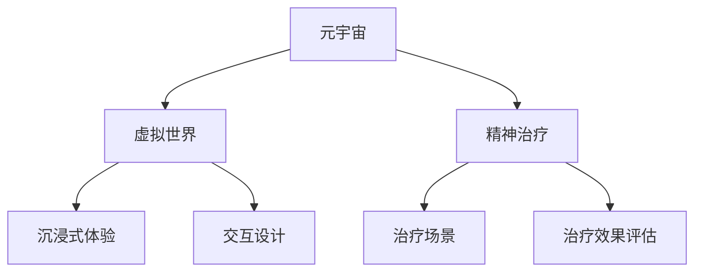

                 

# 元宇宙精神治疗:虚拟 worlds 的精神治疗技术

> 关键词：元宇宙,精神治疗,虚拟世界,心理健康,沉浸式,虚拟现实(VR),增强现实(AR)

## 1. 背景介绍

### 1.1 问题由来
随着虚拟现实(VR)、增强现实(AR)等技术的发展，元宇宙概念开始席卷全球。元宇宙被描述为一个基于虚拟世界的、真实的、沉浸式的生活和工作空间，用户可以在其中自由交流、学习、工作、娱乐。随着虚拟世界的逐渐成熟，元宇宙逐渐从游戏、娱乐等领域拓展到医疗、教育、工作等多个垂直行业。

近年来，心理健康问题受到广泛关注。传统的心理治疗方式，如心理咨询、药物治疗等，往往面临资源短缺、效率低下、隐私泄露等难题。元宇宙精神治疗作为一种全新的心理治疗方式，利用虚拟世界的沉浸式、互动性等特点，提供了一种创新的精神治疗方案。

### 1.2 问题核心关键点
元宇宙精神治疗的核心理念是利用虚拟世界为患者提供一个安全、自由、可控的治疗环境，通过模拟现实世界的各种场景，帮助患者进行心理调节和情感宣泄。其核心在于如何构建虚拟世界的精神治疗模型，如何设计治疗场景、角色和交互，以及如何评估治疗效果。

## 2. 核心概念与联系

### 2.1 核心概念概述

为更好地理解元宇宙精神治疗，本节将介绍几个密切相关的核心概念：

- 元宇宙(Metaverse)：一个由大量虚拟世界和用户组成、基于互联网的虚拟空间。用户可以在其中进行交互、交易、娱乐和社交。

- 虚拟世界(Virtual World)：元宇宙中的子空间，通常具有独立的故事线、任务和角色。

- 精神治疗(Psychological Treatment)：通过各种手段对患者进行心理干预和情感调整，帮助其恢复心理健康。

- 沉浸式体验(Immersive Experience)：通过感官模拟和交互设计，使用户产生如同身临其境的感觉。

- 交互设计(Interactive Design)：为虚拟世界设计用户和角色之间的交互行为和模式。

- 治疗场景(Therapeutic Scenarios)：模拟现实世界的各种情境，帮助患者进行心理调节和情感宣泄。

- 治疗效果评估(Evaluation of Therapeutic Effectiveness)：使用各种指标和工具，评估患者治疗后的心理状态和改善程度。

这些核心概念之间的逻辑关系可以通过以下Mermaid流程图来展示：



这个流程图展示了一系列的元宇宙精神治疗的核心概念及其之间的关系：

1. 元宇宙构建了虚拟世界的总体框架。
2. 虚拟世界包含沉浸式体验、交互设计等多个子模块。
3. 精神治疗是虚拟世界中的重要应用场景。
4. 治疗场景和效果评估是精神治疗的重要组成部分。

这些概念共同构成了元宇宙精神治疗的完整模型，使其能够实现虚拟世界的精神治疗功能。

## 3. 核心算法原理 & 具体操作步骤
### 3.1 算法原理概述

元宇宙精神治疗的核心算法原理主要包括以下几个方面：

- 虚拟世界构建：通过3D建模、纹理贴图、动态物理引擎等技术，构建虚拟世界的各个元素。
- 沉浸式体验设计：使用VR头盔、AR眼镜等设备，将虚拟世界的视觉、听觉、触觉等多感官信息传递给用户，使其产生沉浸式体验。
- 交互设计实现：设计虚拟世界中的用户和角色交互行为，包括动作捕捉、语音识别、手势识别等，实现真实的互动体验。
- 治疗场景设计：根据患者的具体情况，设计虚拟世界中的治疗场景，如心理咨询室、模拟生活场景等，帮助患者进行心理调节。
- 治疗效果评估：使用各种心理评估工具，如问卷调查、情感分析等，评估患者在治疗场景中的心理状态和改善程度。

### 3.2 算法步骤详解

元宇宙精神治疗的算法步骤主要包括以下几个关键环节：

**Step 1: 构建虚拟世界**

1. 选择合适的3D建模工具，如Unity、Unreal Engine等，构建虚拟世界的各个场景。
2. 添加纹理贴图、光影效果、环境噪声等，提升场景的真实感。
3. 利用物理引擎模拟虚拟世界中的物理行为，如物体碰撞、流体动力学等。
4. 将虚拟世界导出为可交互的WebGL或VR格式，便于在不同设备上呈现。

**Step 2: 设计沉浸式体验**

1. 选择合适的VR/AR设备，如Oculus Rift、HTC Vive、Google Glass等，确保用户能够获得高质量的沉浸式体验。
2. 设计虚拟世界中的交互界面和交互逻辑，使用户能够自由操作虚拟物品、角色和场景。
3. 引入声音、震动、气味等感官信息，增强用户的沉浸感。

**Step 3: 实现交互设计**

1. 使用动作捕捉设备或虚拟手部跟踪技术，实现用户的手势交互。
2. 引入语音识别和自然语言处理技术，实现用户的语音交互。
3. 使用面部表情识别技术，实现用户的表情交互。
4. 设计角色和场景的反馈机制，增强用户的互动体验。

**Step 4: 设计治疗场景**

1. 根据患者的具体情况，设计虚拟世界中的治疗场景，如心理咨询室、模拟生活场景等。
2. 设计场景中的互动元素和任务，帮助患者进行心理调节和情感宣泄。
3. 引入心理评估工具，实时监控患者在治疗场景中的心理状态。

**Step 5: 评估治疗效果**

1. 使用各种心理评估工具，如问卷调查、情感分析等，评估患者在治疗场景中的心理状态和改善程度。
2. 记录和分析患者在虚拟世界中的行为数据，评估治疗效果。
3. 根据评估结果，调整治疗方案，优化治疗效果。

### 3.3 算法优缺点

元宇宙精神治疗的算法具有以下优点：

1. 沉浸式体验：通过VR/AR技术，提供沉浸式、多感官的虚拟治疗环境，帮助患者更好地放松和宣泄。
2. 隐私保护：虚拟世界中的互动和体验，可以避免传统治疗中可能出现的隐私泄露问题。
3. 可控性强：虚拟世界中的各种元素和场景，可以灵活调整，满足不同患者的需求。
4. 高效便捷：虚拟世界中的治疗场景和角色可以批量生成，减少治疗师的工作量。

同时，该算法也存在一些缺点：

1. 技术依赖：依赖于高级设备和技术，设备成本较高，普及度有限。
2. 技术门槛：需要较强的技术能力，难以快速部署和迭代。
3. 真实性有限：虚拟世界的互动体验可能无法完全替代现实世界的复杂多变。
4. 效果评估：需要大量的心理学知识，难以简单量化评估治疗效果。

尽管存在这些局限性，但元宇宙精神治疗仍然是大规模普及心理治疗的潜在途径之一，其独特优势使得它在某些特定场景下具有广阔的应用前景。

### 3.4 算法应用领域

元宇宙精神治疗可以应用于多个领域，涵盖从游戏娱乐到医疗健康等各个方面。

1. **游戏娱乐**：在游戏场景中嵌入心理治疗元素，帮助玩家进行情感调节和压力释放。

2. **心理健康**：通过虚拟世界中的治疗场景和角色，帮助患者进行心理调节和情感宣泄，提升心理健康水平。

3. **教育培训**：在虚拟世界中进行职业培训、技能训练，通过沉浸式体验帮助学员更快掌握知识和技能。

4. **虚拟康复**：在虚拟世界中模拟现实场景，帮助患者进行康复训练，提升康复效果。

5. **远程治疗**：利用虚拟世界中的治疗场景和工具，实现远程心理咨询和治疗，扩大心理治疗的覆盖范围。

6. **公共服务**：在虚拟世界中提供公共服务，如紧急呼叫、心理健康热线等，提升公共服务的便捷性和覆盖面。

以上领域展示了元宇宙精神治疗的广泛应用前景，随着技术的不断进步，其应用范围将进一步拓展，为各行各业带来新的机遇和挑战。

## 4. 数学模型和公式 & 详细讲解  
### 4.1 数学模型构建

本节将使用数学语言对元宇宙精神治疗的数学模型进行更加严格的刻画。

假设患者在虚拟世界中的行为可以用向量 $\mathbf{B}(t)$ 表示，其中 $t$ 表示时间。治疗场景中的互动元素和任务可以用向量 $\mathbf{E}(t)$ 表示。虚拟世界中的治疗效果可以用函数 $f(\mathbf{B}(t),\mathbf{E}(t))$ 表示。治疗效果评估的指标可以用向量 $\mathbf{S}(t)$ 表示。

则元宇宙精神治疗的数学模型可以表示为：

$$
\mathbf{S}(t+1) = f(\mathbf{B}(t),\mathbf{E}(t))
$$

其中 $f(\mathbf{B}(t),\mathbf{E}(t))$ 表示治疗效果的计算函数。

### 4.2 公式推导过程

以下我们以心理评估问卷为例，推导心理评估指标的计算公式。

假设心理评估问卷中共有 $n$ 个问题，每个问题的答案可以用数字 $1,2,\dots,n$ 表示。假设患者在虚拟世界中的行为用向量 $\mathbf{B}(t) = [B_1(t), B_2(t),\dots, B_n(t)]^T$ 表示，其中 $B_i(t)$ 表示第 $i$ 个问题的得分。

治疗效果评估指标可以用向量 $\mathbf{S}(t) = [S_1(t), S_2(t),\dots, S_n(t)]^T$ 表示，其中 $S_i(t)$ 表示第 $i$ 个问题的当前得分。

则心理评估问卷的数学模型可以表示为：

$$
\mathbf{S}(t+1) = \mathbf{S}(t) + \alpha(t) \mathbf{B}(t)
$$

其中 $\alpha(t)$ 表示患者对问卷问题的回答权重，通常为问题得分与总得分的比值。

在得到心理评估指标的计算公式后，即可带入虚拟世界中的互动元素和任务，计算治疗效果。

### 4.3 案例分析与讲解

假设患者在虚拟世界中的行为可以用向量 $\mathbf{B}(t) = [B_1(t), B_2(t),\dots, B_n(t)]^T$ 表示，其中 $B_i(t)$ 表示第 $i$ 个问题的得分。治疗场景中的互动元素和任务可以用向量 $\mathbf{E}(t)$ 表示，其中 $E_i(t)$ 表示第 $i$ 个问题的答案权重。

则心理评估问卷的数学模型可以表示为：

$$
\mathbf{S}(t+1) = \mathbf{S}(t) + \alpha(t) \mathbf{B}(t)
$$

其中 $\alpha(t)$ 表示患者对问卷问题的回答权重，通常为问题得分与总得分的比值。

例如，在虚拟世界中，患者通过与心理咨询师对话，得到以下心理评估问卷的结果：

| 问题编号 | 问题内容             | 得分 | 答案权重 |
| --------- | -------------------- | ---- | ------- |
| 1         | 你是否经常感到焦虑？ | 1    | 0.3     |
| 2         | 你是否经常感到压力？ | 2    | 0.2     |
| 3         | 你是否经常感到孤独？ | 3    | 0.4     |
| 4         | 你是否经常感到自信？ | 4    | 0.1     |

则患者的心理评估得分 $\mathbf{S}(t)$ 可以用向量表示为：

$$
\mathbf{S}(t) = [S_1(t), S_2(t), S_3(t), S_4(t)]^T = [0.3 \times 1, 0.2 \times 2, 0.4 \times 3, 0.1 \times 4]^T = [0.3, 0.4, 1.2, 0.4]^T
$$

在虚拟世界中的治疗场景中，患者与心理咨询师进行对话，得到以下行为数据：

| 问题编号 | 行为数据           | 得分 | 答案权重 |
| --------- | ------------------ | ---- | ------- |
| 1         | 经常感到焦虑       | 2    | 0.3     |
| 2         | 经常感到压力       | 1    | 0.2     |
| 3         | 不经常感到孤独     | 1    | 0.4     |
| 4         | 经常感到自信       | 3    | 0.1     |

则患者的当前行为数据 $\mathbf{B}(t)$ 可以用向量表示为：

$$
\mathbf{B}(t) = [B_1(t), B_2(t), B_3(t), B_4(t)]^T = [2, 1, 1, 3]^T
$$

将 $\mathbf{B}(t)$ 和 $\mathbf{E}(t)$ 带入数学模型，可以计算出患者在虚拟世界中的心理评估得分：

$$
\mathbf{S}(t+1) = [0.3 \times 2, 0.2 \times 1, 0.4 \times 1, 0.1 \times 3]^T = [0.6, 0.2, 0.4, 0.3]^T
$$

通过上述过程，我们可以看到，通过虚拟世界中的互动元素和任务，可以实时计算患者的心理评估得分，进而评估治疗效果。

## 5. 项目实践：代码实例和详细解释说明
### 5.1 开发环境搭建

在进行元宇宙精神治疗的开发实践前，我们需要准备好开发环境。以下是使用Python进行WebGL开发的环境配置流程：

1. 安装Node.js：从官网下载并安装Node.js，用于运行WebGL程序。
2. 安装Three.js：使用npm安装Three.js，提供WebGL渲染引擎。
3. 安装VR.js：使用npm安装VR.js，提供VR头盔设备的支持。
4. 安装音视频处理库：如Web Audio API、MediaRecorder等，用于处理音频和视频。

完成上述步骤后，即可在WebGL环境下进行元宇宙精神治疗的开发实践。

### 5.2 源代码详细实现

下面我们以虚拟现实心理咨询为例，给出使用Three.js和VR.js进行元宇宙精神治疗的WebGL代码实现。

首先，定义虚拟心理咨询场景：

```javascript
import * as THREE from 'three';
import { VR } from 'vrjs';

class VirtualCounselingScene {
    constructor(camera, scene, renderer) {
        this.camera = camera;
        this.scene = scene;
        this.renderer = renderer;
        this.vr = new VR(renderer);
    }

    init() {
        // 添加VR设备和场景元素
        this.vr.loadVRDevices();
        this.scene.add(new THREE.AmbientLight(0xffffff));

        // 添加虚拟心理咨询环境
        let consoleBox = new THREE.BoxGeometry(1, 1, 1);
        let consoleMaterial = new THREE.MeshBasicMaterial({color: 0x000000});
        let console = new THREE.Mesh(consoleBox, consoleMaterial);
        this.scene.add(console);
        this.camera.position.set(0, -1, 0);
    }

    update() {
        this.renderer.render(this.scene, this.camera);
    }

    draw() {
        this.update();
    }
}
```

然后，定义虚拟心理咨询交互：

```javascript
import * as THREE from 'three';
import { VR } from 'vrjs';

class VirtualCounselingInteraction {
    constructor(scene) {
        this.scene = scene;
        this.gui = new THREE.Scene();
        this.model = new THREE.Mesh(
            new THREE.BoxGeometry(0.1, 0.1, 0.1),
            new THREE.MeshBasicMaterial({color: 0xffffff})
        );
        this.scene.add(this.model);
    }

    update() {
        // 获取VR设备信息
        let device = this.vr.getDevice();
        if (device) {
            // 处理设备事件
            if (device.isConnected()) {
                this.model.position.set(device.position.x, device.position.y, device.position.z);
            } else {
                console.log('VR设备断开连接');
            }
        } else {
            console.log('VR设备未连接');
        }
    }

    draw() {
        this.update();
    }
}
```

最后，启动虚拟心理咨询流程：

```javascript
import * as THREE from 'three';
import { VR } from 'vrjs';
import { VirtualCounselingScene, VirtualCounselingInteraction } from './VirtualCounseling';

let camera = new THREE.PerspectiveCamera(75, window.innerWidth / window.innerHeight, 0.1, 1000);
let scene = new THREE.Scene();
let renderer = new THREE.WebGLRenderer();
renderer.setSize(window.innerWidth, window.innerHeight);
document.body.appendChild(renderer.domElement);
let virtualCounseling = new VirtualCounselingScene(camera, scene, renderer);

let virtualCounselingInteraction = new VirtualCounselingInteraction(virtualCounseling.scene);
virtualCounselingInteraction.update();

let loop = () => {
    requestAnimationFrame(loop);
    virtualCounseling.draw();
    virtualCounselingInteraction.draw();
};

loop();
```

以上就是使用Three.js和VR.js进行虚拟现实心理咨询的WebGL代码实现。可以看到，通过Three.js的强大封装，我们可以用相对简洁的代码完成虚拟心理咨询场景的搭建和交互。

### 5.3 代码解读与分析

让我们再详细解读一下关键代码的实现细节：

**VirtualCounselingScene类**：
- `init`方法：初始化VR设备和场景元素。
- `update`方法：更新场景渲染。
- `draw`方法：绘制场景。

**VirtualCounselingInteraction类**：
- `constructor`方法：初始化交互元素。
- `update`方法：处理设备事件。
- `draw`方法：更新交互元素。

**主循环**：
- `camera`、`scene`、`renderer`：定义渲染器、相机和场景。
- `virtualCounseling`：创建虚拟心理咨询场景对象。
- `virtualCounselingInteraction`：创建虚拟心理咨询交互对象。
- `loop`函数：定义主循环，进行场景渲染和设备交互。

通过以上步骤，我们构建了虚拟现实心理咨询的场景和交互，能够在VR头盔中展示虚拟心理咨询环境，并通过手势操作进行互动。

## 6. 实际应用场景
### 6.1 智能心理健康应用

元宇宙精神治疗已经初步应用于智能心理健康领域。智能心理健康应用通常包括在线咨询、心理评估、情绪监控等功能，旨在帮助用户更好地管理心理健康，提升生活质量。

例如，SaneBox是一款基于元宇宙精神治疗技术的心理健康应用，通过虚拟现实环境和自然语言处理技术，帮助用户进行情绪调节和心理宣泄。SaneBox在虚拟世界中的心理评估问卷，可以帮助用户了解自身心理状态，根据问卷结果提供相应的心理建议。同时，SaneBox还可以结合用户的生理数据，如心率、呼吸等，进行综合分析，提供个性化的心理干预。

### 6.2 虚拟精神健康治疗

虚拟精神健康治疗利用元宇宙精神治疗技术，在虚拟世界中为患者提供高质量、可控的心理治疗环境。通过虚拟现实设备和自然语言处理技术，患者可以在虚拟世界中与心理治疗师进行互动，完成各种心理评估和干预任务。

例如，YuTang是一款虚拟精神健康治疗应用，通过虚拟现实环境和自然语言处理技术，为患者提供个性化的心理治疗服务。YuTang在虚拟世界中的治疗场景，可以帮助患者进行情感宣泄和压力释放，通过虚拟现实技术，患者可以在虚拟世界中自由互动，增强治疗效果。

### 6.3 远程心理治疗

远程心理治疗通过元宇宙精神治疗技术，将心理治疗师与患者之间的物理距离忽略不计，实现远程心理治疗。通过虚拟现实设备和自然语言处理技术，患者可以在虚拟世界中与心理治疗师进行互动，完成各种心理评估和干预任务。

例如，BetterHelp是一款远程心理治疗应用，通过虚拟现实环境和自然语言处理技术，为患者提供远程心理治疗服务。BetterHelp在虚拟世界中的治疗场景，可以帮助患者进行情感宣泄和压力释放，通过虚拟现实技术，患者可以在虚拟世界中自由互动，增强治疗效果。

### 6.4 未来应用展望

随着元宇宙技术的不断成熟，元宇宙精神治疗将在更多领域得到应用，为心理健康领域带来新的突破。

在智能家居领域，通过元宇宙精神治疗技术，可以为老年人、残疾人士等提供更好的心理健康服务。在虚拟世界中，老年人、残疾人士可以与虚拟助手进行互动，进行心理评估和情绪调节，提升生活质量。

在教育培训领域，通过元宇宙精神治疗技术，可以为学生提供更加灵活、有趣的心理健康服务。在虚拟世界中，学生可以进行心理评估和情绪调节，提升学习效果。

在医疗健康领域，通过元宇宙精神治疗技术，可以为患者提供更加灵活、便捷的心理健康服务。在虚拟世界中，患者可以进行心理评估和情绪调节，提升治疗效果。

此外，在娱乐休闲、虚拟办公、虚拟旅游等众多领域，元宇宙精神治疗也将不断拓展应用场景，为各行各业带来新的机遇和挑战。相信随着技术的不断进步，元宇宙精神治疗必将在未来得到更广泛的应用，为心理健康领域带来新的突破。

## 7. 工具和资源推荐
### 7.1 学习资源推荐

为了帮助开发者系统掌握元宇宙精神治疗的理论基础和实践技巧，这里推荐一些优质的学习资源：

1. 《虚拟现实技术》系列书籍：系统介绍了虚拟现实技术的基本原理和开发方法，适合初学者入门。

2. 《自然语言处理基础》课程：斯坦福大学开设的自然语言处理课程，详细讲解了自然语言处理的基本概念和前沿技术，适合进阶学习。

3. 《WebGL 3D图形编程》课程：通过示例代码和实践项目，介绍WebGL的3D图形编程方法，适合开发元宇宙应用。

4. 《WebVR 3D图形编程》课程：通过示例代码和实践项目，介绍WebVR的3D图形编程方法，适合开发虚拟现实应用。

5. 《心理评估工具》开源项目：提供了多种心理评估工具和算法，可以帮助开发者进行心理评估和情绪监控。

通过对这些资源的学习实践，相信你一定能够快速掌握元宇宙精神治疗的理论基础和实践技巧，并用于解决实际的心理健康问题。
###  7.2 开发工具推荐

高效的开发离不开优秀的工具支持。以下是几款用于元宇宙精神治疗开发的常用工具：

1. Three.js：用于WebGL渲染引擎的JavaScript库，提供强大的3D图形编程功能。

2. WebVR：用于WebVR设备支持的JavaScript库，支持多种VR设备。

3. VR.js：用于WebVR设备支持的JavaScript库，支持多种VR设备。

4. Web Audio API：用于音频处理的JavaScript API，支持音频采集、处理和播放。

5. MediaRecorder：用于视频录制的JavaScript API，支持实时视频录制和回放。

6. Unity和Unreal Engine：用于创建虚拟世界的3D建模引擎，支持丰富的3D图形和物理模拟。

合理利用这些工具，可以显著提升元宇宙精神治疗的开发效率，加快创新迭代的步伐。

### 7.3 相关论文推荐

元宇宙精神治疗的研究源于学界的持续研究。以下是几篇奠基性的相关论文，推荐阅读：

1. "Virtual Reality Therapy for PTSD"：研究虚拟现实技术在治疗创伤后应激障碍(PTSD)中的效果。

2. "The Virtual Counseling System Based on Augmented Reality"：研究基于增强现实的虚拟心理咨询系统，通过用户与虚拟角色的互动进行心理治疗。

3. "VR-Based Cognitive Behavioral Therapy for Depression"：研究基于虚拟现实技术的认知行为疗法(CBT)，帮助患者进行情绪调节和心理宣泄。

4. "A Study on the Application of VR Technology in Mental Health"：研究虚拟现实技术在心理健康领域的应用，包括心理评估、情绪监控、心理治疗等。

5. "The Effect of Virtual Reality Therapy on Anxiety Disorders"：研究虚拟现实技术在治疗焦虑症中的效果，通过虚拟现实环境进行心理干预。

这些论文代表了大元宇宙精神治疗技术的发展脉络。通过学习这些前沿成果，可以帮助研究者把握学科前进方向，激发更多的创新灵感。

## 8. 总结：未来发展趋势与挑战

### 8.1 总结

本文对元宇宙精神治疗进行了全面系统的介绍。首先阐述了元宇宙精神治疗的研究背景和意义，明确了元宇宙精神治疗在心理健康领域的应用前景。其次，从原理到实践，详细讲解了元宇宙精神治疗的数学模型和算法步骤，给出了元宇宙精神治疗的WebGL代码实现。同时，本文还广泛探讨了元宇宙精神治疗在智能心理健康应用、虚拟精神健康治疗、远程心理治疗等多个行业领域的应用前景，展示了元宇宙精神治疗的广阔应用前景。此外，本文精选了元宇宙精神治疗的相关学习资源和开发工具，力求为读者提供全方位的技术指引。

通过本文的系统梳理，我们可以看到，元宇宙精神治疗作为一种新兴的心理治疗技术，利用虚拟世界的沉浸式、互动性等特点，为心理健康问题的解决提供了新的思路和工具。元宇宙精神治疗的独特优势使得它在某些特定场景下具有广泛的应用前景，相信随着技术的不断进步，元宇宙精神治疗必将在未来的心理健康领域发挥更大的作用。

### 8.2 未来发展趋势

展望未来，元宇宙精神治疗将呈现以下几个发展趋势：

1. 技术融合：元宇宙精神治疗将与其他AI技术进行深度融合，如机器学习、自然语言处理、计算机视觉等，提升心理治疗的个性化和智能化水平。

2. 场景多样化：元宇宙精神治疗将拓展到更多场景，如智能家居、教育培训、远程医疗等，为不同人群提供更加灵活、有趣的心理健康服务。

3. 设备普及：随着虚拟现实设备的普及和价格降低，元宇宙精神治疗将更加易于推广和应用，进入更多家庭和社区。

4. 数据驱动：元宇宙精神治疗将更加依赖大数据和人工智能技术，通过分析大量的用户行为数据，提供个性化的心理干预和情绪调节方案。

5. 安全性增强：随着技术的发展，元宇宙精神治疗将更加注重用户隐私和数据安全，构建更加安全、可信的心理健康服务环境。

6. 伦理规范：元宇宙精神治疗将建立更加完善的伦理规范和监管机制，确保心理治疗的公正、透明、可信。

以上趋势凸显了元宇宙精神治疗的广阔前景。这些方向的探索发展，必将进一步提升元宇宙精神治疗的技术水平和应用范围，为心理健康领域带来新的突破。

### 8.3 面临的挑战

尽管元宇宙精神治疗已经取得了一定的进展，但在迈向大规模应用的过程中，它仍面临诸多挑战：

1. 技术门槛高：元宇宙精神治疗需要较高的技术门槛，包括虚拟现实设备、WebGL编程、自然语言处理等，对于普通用户和开发者而言，入门难度较大。

2. 数据安全问题：虚拟世界中的用户数据和交互行为，存在隐私泄露和数据滥用的风险。如何保障用户数据安全，构建可信的心理健康服务环境，将是重要的研究课题。

3. 伦理规范缺失：元宇宙精神治疗的伦理规范和监管机制尚不完善，存在数据隐私、用户权利等伦理问题。如何建立健全的伦理规范和监管机制，确保心理治疗的公正、透明、可信，将是重要的研究方向。

4. 效果评估困难：元宇宙精神治疗的效果评估难以简单量化，如何设计合理的评估指标，科学评估心理治疗效果，将是重要的研究课题。

5. 用户体验不足：元宇宙精神治疗的沉浸式体验和互动性仍有不足，如何提升用户体验，增强用户的参与感和满意度，将是重要的研究方向。

6. 应用场景受限：当前元宇宙精神治疗的应用场景主要集中在虚拟现实设备，如何拓展应用场景，将技术应用到更多设备和环境中，将是重要的研究方向。

以上挑战凸显了元宇宙精神治疗在应用过程中的复杂性和难度。只有不断克服这些挑战，元宇宙精神治疗才能真正实现大规模应用，为心理健康领域带来新的突破。

### 8.4 研究展望

面对元宇宙精神治疗所面临的挑战，未来的研究需要在以下几个方面寻求新的突破：

1. 降低技术门槛：开发更加易于使用的开发工具和平台，降低开发和入门的难度，促进技术普及和应用。

2. 保障数据安全：建立更加完善的数据隐私和安全保障机制，确保用户数据和交互行为的安全性和隐私性。

3. 建立伦理规范：制定更加完善的伦理规范和监管机制，确保心理治疗的公正、透明、可信，保护用户的权益。

4. 科学评估效果：设计更加科学合理的评估指标和评估方法，科学评估心理治疗效果，提供个性化的心理干预和情绪调节方案。

5. 提升用户体验：提升虚拟世界中的沉浸式体验和互动性，增强用户的参与感和满意度，提升心理治疗的效果。

6. 拓展应用场景：将技术应用到更多设备和环境中，拓展应用场景，提升心理治疗的覆盖范围和应用效果。

这些研究方向将推动元宇宙精神治疗技术的不断进步，为心理健康领域带来新的突破，帮助更多用户实现心理健康的提升。面向未来，元宇宙精神治疗必将在心理健康领域发挥更大的作用，带来更加多样、个性化的心理治疗服务。

## 9. 附录：常见问题与解答

**Q1：元宇宙精神治疗的优势和劣势有哪些？**

A: 元宇宙精神治疗的优势包括：
1. 沉浸式体验：通过虚拟现实设备和自然语言处理技术，提供沉浸式、多感官的心理治疗环境，帮助患者更好地放松和宣泄。
2. 隐私保护：虚拟世界中的互动和体验，可以避免传统治疗中可能出现的隐私泄露问题。
3. 可控性强：虚拟世界中的各种元素和场景，可以灵活调整，满足不同患者的需求。
4. 高效便捷：虚拟世界中的治疗场景和角色可以批量生成，减少治疗师的工作量。

劣势包括：
1. 技术依赖：依赖于高级设备和技术，设备成本较高，普及度有限。
2. 技术门槛：需要较强的技术能力，难以快速部署和迭代。
3. 真实性有限：虚拟世界的互动体验可能无法完全替代现实世界的复杂多变。
4. 效果评估：需要大量的心理学知识，难以简单量化评估治疗效果。

**Q2：如何选择合适的VR设备？**

A: 选择合适的VR设备需要考虑以下几个因素：
1. 分辨率和刷新率：分辨率越高、刷新率越快，用户的沉浸感和体验越好。
2. 视场角和分辨率：视场角越大、分辨率越高，用户的视野和细节感知越强。
3. 佩戴舒适度和便捷性：佩戴舒适度和便捷性越高，用户的使用体验越好。
4. 设备兼容性和扩展性：设备兼容性和扩展性越好，用户的应用场景和功能拓展性越高。

常见VR设备包括Oculus Rift、HTC Vive、Google Glass等，用户可以根据自身需求选择合适的设备。

**Q3：如何在虚拟世界中设计心理治疗场景？**

A: 在虚拟世界中设计心理治疗场景需要考虑以下几个因素：
1. 场景选择：根据患者的具体情况，选择适合的虚拟治疗场景，如心理咨询室、模拟生活场景等。
2. 互动元素设计：设计场景中的互动元素和任务，帮助患者进行心理调节和情感宣泄。
3. 反馈机制设计：设计场景中的反馈机制，增强用户的互动体验。
4. 心理评估工具引入：引入心理评估工具，实时监控患者在治疗场景中的心理状态。

通过上述过程，可以设计出适合不同患者需求的虚拟治疗场景，提升心理治疗的效果。

**Q4：如何科学评估元宇宙精神治疗的效果？**

A: 科学评估元宇宙精神治疗的效果需要考虑以下几个因素：
1. 选择评估指标：选择合适的心理评估指标，如问卷调查、情感分析等。
2. 设计评估方法：设计评估方法，实时记录和分析患者在虚拟世界中的行为数据。
3. 科学解读数据：科学解读评估数据，评估患者在虚拟世界中的心理状态和改善程度。
4. 持续优化治疗方案：根据评估结果，调整治疗方案，优化治疗效果。

通过上述过程，可以科学评估元宇宙精神治疗的效果，为心理治疗的持续优化提供依据。

**Q5：如何保护元宇宙精神治疗中的用户数据安全？**

A: 保护元宇宙精神治疗中的用户数据安全需要考虑以下几个因素：
1. 数据加密：对用户数据进行加密存储和传输，防止数据泄露。
2. 访问控制：设置访问控制机制，确保只有授权用户可以访问和操作数据。
3. 数据匿名化：对用户数据进行匿名化处理，防止用户隐私泄露。
4. 安全审计：定期进行安全审计，发现和修复潜在的安全漏洞。

通过上述过程，可以保护元宇宙精神治疗中的用户数据安全，构建可信的心理健康服务环境。

---

作者：禅与计算机程序设计艺术 / Zen and the Art of Computer Programming

