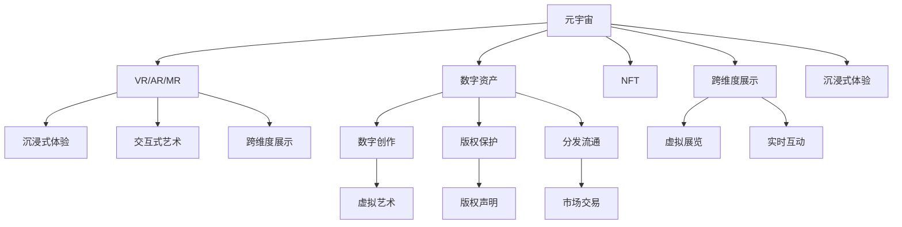

                 

# 元宇宙艺术策展:跨维度艺术展览的新形式

## 1. 背景介绍

### 1.1 问题由来
随着虚拟现实（VR）、增强现实（AR）、混合现实（MR）等技术的不断发展，元宇宙（Metaverse）的概念逐渐兴起。元宇宙是一个由多个虚拟世界和现实世界相互连接、交互、融合而成的数字世界，它为艺术、娱乐、教育、社交等领域提供了全新的展示与互动形式。

在元宇宙中，艺术展览不仅限于物理空间，更跨越了时间和空间维度，成为一种全新的艺术形式。艺术家们通过VR/AR/MR等技术手段，将传统艺术作品数字化、虚拟化，使观众能够身临其境地体验艺术创作。然而，这种跨维度的艺术展览需要解决一系列技术挑战，如数据传输、沉浸式体验、用户交互等，以实现理想的艺术展示效果。

### 1.2 问题核心关键点
元宇宙艺术策展的核心问题在于如何通过技术手段，将现实世界中的艺术作品转化为虚拟世界中的沉浸式艺术体验，同时保证展览的多样性、互动性和沉浸感，使其能够被广大用户接受并参与。

### 1.3 问题研究意义
元宇宙艺术策展的兴起，为艺术创作和展示带来了新的可能性。通过VR/AR/MR等技术，艺术家和策展人能够突破物理空间的限制，创造出更为丰富、互动的艺术体验，推动艺术与科技的融合发展。同时，这种新的艺术形式也为元宇宙用户提供了全新的沉浸式体验，促进了数字文化的繁荣。

## 2. 核心概念与联系

### 2.1 核心概念概述

元宇宙艺术策展涉及多个核心概念：

- **元宇宙（Metaverse）**：由多个虚拟世界和现实世界相互连接、交互、融合而成的数字世界。
- **VR/AR/MR技术**：虚拟现实（Virtual Reality）、增强现实（Augmented Reality）、混合现实（Mixed Reality）等技术，用于实现沉浸式艺术展示。
- **数字资产（Digital Asset）**：艺术作品数字化后，以数字文件形式存在的艺术创作。
- **NFT（Non-Fungible Token）**：非同质化代币，用于记录数字艺术品的版权和所有权，确保数字资产的唯一性和不可复制性。
- **沉浸式体验（Immersive Experience）**：通过VR/AR/MR等技术，使观众能够身临其境地感受艺术作品。
- **交互式艺术（Interactive Art）**：观众可以与艺术作品进行互动，影响艺术作品的表现形式和内容。
- **跨维度展示（Cross-Dimensional Exhibition）**：艺术作品在虚拟世界中进行展示，突破物理空间和时间限制。

这些概念之间的逻辑关系可以通过以下Mermaid流程图来展示：



这个流程图展示了元宇宙艺术策展的核心概念及其之间的关系：

1. 元宇宙作为平台，利用VR/AR/MR技术，展示数字资产。
2. NFT确保数字资产的唯一性和不可复制性。
3. 数字资产由艺术创作者创作，版权得到保护。
4. 数字资产可进行市场交易。
5. 虚拟展览和实时互动实现跨维度展示和沉浸式体验。

这些概念共同构成了元宇宙艺术策展的基本框架，使其能够在各种场景下提供丰富的艺术体验。

## 3. 核心算法原理 & 具体操作步骤

### 3.1 算法原理概述

元宇宙艺术策展的核心算法原理在于通过VR/AR/MR等技术，将数字资产转换为虚拟世界中的沉浸式艺术体验，实现跨维度的艺术展示。

其基本流程包括：

1. 数字资产的创建：艺术家使用数字创作工具，将现实世界中的艺术作品转化为数字文件。
2. 数字资产的数字化处理：将数字资产进行格式转换和优化，确保其在虚拟环境中的展示效果。
3. 元宇宙平台搭建：利用VR/AR/MR技术，构建虚拟展览空间，提供沉浸式体验。
4. 数字资产的虚拟展示：将处理后的数字资产导入虚拟展览空间，进行实时展示。
5. 交互式体验设计：设计观众与艺术作品的交互方式，增强展览的互动性。

### 3.2 算法步骤详解

以下是元宇宙艺术策展的具体操作步骤：

**Step 1: 数字资产创作与处理**

1. **艺术创作**：艺术家使用数字创作软件（如Blender、Maya等）创作艺术作品。
2. **格式转换**：将艺术作品转换为虚拟现实兼容的格式，如OBJ、FBX等。
3. **纹理贴图**：为艺术作品添加纹理贴图，提升展示效果。
4. **优化处理**：使用工具（如TexturePaint）进行纹理优化，减少渲染资源消耗。

**Step 2: 元宇宙平台搭建**

1. **虚拟空间搭建**：使用VR开发引擎（如Unity、Unreal Engine等）构建虚拟展览空间，设定场景、光照、环境等。
2. **用户交互设计**：设计用户与艺术作品的交互方式，如手势控制、虚拟现实头显等。
3. **网络通信优化**：优化网络传输协议，减少数据包丢失和延迟。

**Step 3: 数字资产虚拟展示**

1. **模型导入**：将处理后的数字资产导入虚拟展览空间。
2. **渲染处理**：使用渲染引擎进行实时渲染，确保艺术作品的展示效果。
3. **交互实现**：实现用户与艺术作品的交互，如点击、拖动、旋转等。

**Step 4: 交互式体验设计**

1. **互动设计**：设计用户与艺术作品的互动场景，如触觉反馈、虚拟舞蹈等。
2. **情感计算**：利用情感计算技术，识别用户情绪变化，调整艺术作品的展示方式。
3. **交互反馈**：设计交互反馈机制，让用户能够实时感知其行为对艺术作品的影响。

### 3.3 算法优缺点

元宇宙艺术策展的算法具有以下优点：

1. **沉浸式体验**：通过VR/AR/MR技术，使观众能够身临其境地感受艺术作品。
2. **交互性强**：观众可以与艺术作品进行互动，影响艺术作品的表现形式和内容。
3. **跨维度展示**：艺术作品在虚拟世界中进行展示，突破物理空间和时间限制。
4. **市场潜力大**：数字资产可以通过NFT技术进行市场交易，带来新的商业模式。

同时，该算法也存在以下缺点：

1. **技术门槛高**：需要较高的技术水平和设备支持，可能导致设备成本较高。
2. **渲染资源消耗大**：高分辨率的虚拟现实展示需要大量的计算资源，可能导致性能瓶颈。
3. **交互复杂**：交互设计需要考虑用户的多种行为，可能面临复杂度增加的问题。
4. **用户接受度未知**：观众对虚拟艺术和技术的接受度未知，可能会影响其市场推广效果。

### 3.4 算法应用领域

元宇宙艺术策展的应用领域非常广泛，涵盖了艺术、娱乐、教育、社交等多个领域：

- **艺术展览**：通过VR/AR/MR技术，展示数字艺术品，提供沉浸式艺术体验。
- **虚拟博物馆**：构建虚拟博物馆，展示历史文物和艺术品，打破地域限制。
- **虚拟画廊**：设立虚拟画廊，定期举办虚拟艺术展览，吸引全球观众。
- **教育培训**：利用虚拟现实技术，提供虚拟艺术课程，提升艺术教育质量。
- **社交互动**：在虚拟空间中进行艺术创作和展示，增强用户之间的互动。

## 4. 数学模型和公式 & 详细讲解 & 举例说明

### 4.1 数学模型构建

元宇宙艺术策展涉及多个数学模型，以下以艺术作品渲染为例，展示其数学模型构建过程。

**艺术作品渲染模型**：

1. **空间坐标转换**：将现实世界中的三维坐标转换为虚拟空间中的坐标。
2. **光照模型**：根据光源位置和强度，计算艺术作品表面各点的光照值。
3. **材质模型**：根据艺术作品的材料属性，计算其表面颜色和反射率。
4. **渲染方程**：根据上述模型计算艺术作品的渲染结果。

**渲染方程**：

$$
L(x,v) = L_e(x) \cdot f_r(x,v) \cdot \frac{\partial \Omega(x,v)}{\partial n(x)}
$$

其中，$L(x,v)$表示渲染点 $x$ 在视角方向 $v$ 上的光强，$L_e(x)$表示环境光，$f_r(x,v)$表示表面反射函数，$\frac{\partial \Omega(x,v)}{\partial n(x)}$表示表面法线微分量。

### 4.2 公式推导过程

**光照模型推导**：

假设光源位置为 $S$，方向为 $v_s$，强度为 $I_s$。光源在点 $x$ 上的光强为：

$$
L_s(x) = \frac{I_s}{\pi} \cdot \left( \frac{\text{cos}\theta_s(x)}{d_s(x)} \right)^2
$$

其中，$\theta_s(x)$表示光源方向与表面法线方向的角度，$d_s(x)$表示光源到点 $x$ 的距离。

**材质模型推导**：

假设材质属性为 $M(x)$，包括漫反射系数 $a$、镜面反射系数 $b$、折射系数 $c$。点 $x$ 在视角方向 $v$ 上的表面反射光强为：

$$
L_r(x,v) = f_r(x,v) \cdot \frac{a}{\pi} \cdot \frac{M(x)}{\max(1,\text{cos}\theta(x))}
$$

其中，$f_r(x,v)$表示表面反射函数，$\text{cos}\theta(x)$表示表面法线与视角方向的夹角。

### 4.3 案例分析与讲解

**案例：虚拟画廊中的艺术作品渲染**

1. **场景搭建**：搭建虚拟画廊空间，设置光源、背景、墙面等。
2. **艺术作品导入**：导入数字艺术品模型，并根据材质模型计算表面属性。
3. **光照计算**：计算光源在艺术作品上的光强，并进行表面反射计算。
4. **渲染输出**：将渲染结果输出到虚拟画廊中的特定位置，形成虚拟展览。

## 5. 项目实践：代码实例和详细解释说明

### 5.1 开发环境搭建

在进行元宇宙艺术策展的开发前，我们需要准备好开发环境。以下是使用Python进行Unity开发的环境配置流程：

1. **安装Unity Hub**：从官网下载并安装Unity Hub，用于创建和管理Unity项目。
2. **创建新项目**：在Unity Hub中创建新的Unity项目，选择VR/AR开发模式。
3. **安装插件**：安装必要的插件，如VR虚拟现实插件、AR增强现实插件等。
4. **安装SDK**：安装相应的VR/AR SDK，如Oculus SDK、Magic Leap SDK等。
5. **配置环境**：配置项目环境，包括纹理贴图、光源、光照等。

完成上述步骤后，即可在Unity中开始元宇宙艺术策展的开发。

### 5.2 源代码详细实现

这里我们以虚拟画廊为例，展示使用Unity开发元宇宙艺术策展的具体实现。

首先，创建虚拟画廊的VR场景：

```python
using UnityEngine;
using UnityEngine.UI;

public class GalleryScene : MonoBehaviour
{
    public GameObject[] artworks;
    public GameObject artPanelPrefab;
    public Transform canvas;

    void Start()
    {
        for (int i = 0; i < artworks.Length; i++)
        {
            var artPanel = Instantiate(artPanelPrefab, canvas);
            artPanel.GetComponent<Canvas>()缩放比例 = 0.1f;
            var artModel = artworks[i].GetComponent<MeshFilter>();
            var artMaterial = artworks[i].GetComponent<MeshRenderer>().material;
            // 初始化艺术作品渲染和交互
            // ...
        }
    }
}
```

然后，实现艺术作品的渲染和交互：

```python
using UnityEngine;
using UnityEngine.UI;

public class ArtPanel : MonoBehaviour
{
    public GameObject artModel;
    public Material artMaterial;

    void Update()
    {
        // 渲染艺术作品
        artModel.GetComponent<MeshRenderer>().material = artMaterial;
        // 实现交互逻辑
        // ...
    }
}
```

最后，实现虚拟画廊的用户交互和体验：

```python
using UnityEngine;
using UnityEngine.UI;

public class UserInteraction : MonoBehaviour
{
    public GameObject[] artPanels;
    public GameObject selectPanelPrefab;

    void Update()
    {
        for (int i = 0; i < artPanels.Length; i++)
        {
            var artPanel = artPanels[i].transform;
            if (CheckCollision(artPanel))
            {
                var selectPanel = Instantiate(selectPanelPrefab, artPanel.position);
                selectPanel.GetComponent<Canvas>()缩放比例 = 0.1f;
                // 设置交互效果
                // ...
            }
        }
    }

    bool CheckCollision(Transform panel)
    {
        Ray ray = Camera.main.ScreenPointToRay(Input.mousePosition);
        return Physics.Raycast(ray, out RaycastHit hit, 100f) && hit.transform == panel.transform;
    }
}
```

以上就是使用Unity进行元宇宙艺术策展开发的完整代码实现。可以看到，通过Unity的强大功能和可视化编程特性，元宇宙艺术策展的开发变得简洁高效。

### 5.3 代码解读与分析

让我们再详细解读一下关键代码的实现细节：

**GalleryScene类**：
- `Start`方法：遍历所有艺术作品，创建艺术面板，并进行初始化。
- `artworks`数组：存储所有导入的艺术作品模型。
- `artPanelPrefab`对象：艺术面板的预制体。
- `canvas`对象：场景中的画布。

**ArtPanel类**：
- `Update`方法：在每一帧更新艺术作品的渲染和交互逻辑。
- `artModel`对象：艺术作品模型。
- `artMaterial`对象：艺术作品材质。

**UserInteraction类**：
- `Update`方法：遍历所有艺术面板，检测用户是否与其交互，并进行相应的交互效果展示。
- `artPanels`数组：存储所有艺术面板对象。
- `selectPanelPrefab`对象：交互选择面板的预制体。
- `CheckCollision`方法：检测用户是否与艺术面板碰撞。

**Unity开发环境**：
- **Unity Hub**：用于创建和管理Unity项目。
- **VR虚拟现实插件**：提供VR相关的功能，如VR控制器、VR相机等。
- **AR增强现实插件**：提供AR相关的功能，如AR相机、AR环境渲染等。
- **SDK**：如Oculus SDK、Magic Leap SDK，用于接入VR/AR设备。

这些工具和库的灵活使用，使得元宇宙艺术策展的开发变得高效便捷。

### 5.4 运行结果展示

运行Unity项目后，可以看到虚拟画廊中艺术作品的实时渲染和用户交互效果。观众可以通过头显设备，沉浸式地体验艺术作品，并通过手势或点击与作品互动，感受艺术的独特魅力。

## 6. 实际应用场景

### 6.1 智能博物馆

智能博物馆利用元宇宙艺术策展技术，将历史文物和艺术品数字化，提供虚拟展览服务。观众可以通过VR头显设备，自由浏览虚拟博物馆，近距离观察展品，了解其历史背景和艺术价值。同时，博物馆还可以通过虚拟展览，吸引更多观众，提升教育普及效果。

### 6.2 虚拟画廊

虚拟画廊设立在元宇宙空间中，定期举办虚拟艺术展览，展示当代艺术家的作品。观众可以在虚拟画廊中自由参观，与作品互动，获得沉浸式艺术体验。这种新型画廊模式，不仅能够突破物理空间限制，还能提供更加丰富多样的艺术展示形式。

### 6.3 社交互动平台

元宇宙艺术策展还可以应用于社交互动平台，如Facebook Horizon、Microsoft Mixed Reality等。用户可以在虚拟世界中组建艺术俱乐部，举办虚拟艺术展览，与其他用户互动。这种新型的社交方式，能够增强用户之间的情感联系，提升社交体验。

### 6.4 未来应用展望

随着VR/AR/MR技术的不断进步，元宇宙艺术策展的应用场景将更加广泛，带来更多创新可能：

- **全息艺术展览**：利用全息技术，在虚拟空间中展示三维艺术作品，提供更加逼真的沉浸式体验。
- **实时交互艺术**：开发实时交互的艺术作品，如虚拟舞蹈、音乐会等，增强观众的参与感和体验感。
- **虚拟文化节**：在元宇宙中举办虚拟艺术和文化节，吸引全球用户参与，推动数字文化的繁荣。
- **个性化艺术创作**：用户可以利用VR/AR/MR工具，在虚拟世界中自由创作艺术作品，实现个性化的艺术表达。

## 7. 工具和资源推荐

### 7.1 学习资源推荐

为了帮助开发者系统掌握元宇宙艺术策展的技术基础和实践技巧，这里推荐一些优质的学习资源：

1. **Unity官方文档**：Unity官方提供的详细文档，涵盖VR/AR开发的所有知识点和实用技巧。
2. **VR/AR开发教程**：如《VR游戏开发教程》《AR增强现实开发教程》等，提供系统化的VR/AR开发步骤和案例分析。
3. **《虚拟现实与增强现实技术基础》**：吴恩达教授的Coursera课程，介绍VR/AR技术的基本原理和应用场景。
4. **《Unity VR/AR开发实战》**：一本详细的Unity开发指南，涵盖VR/AR开发的各个方面，包括工具、技术、项目实践等。

通过对这些资源的学习实践，相信你一定能够快速掌握元宇宙艺术策展的技术精髓，并用于解决实际的VR/AR应用问题。

### 7.2 开发工具推荐

高效的开发离不开优秀的工具支持。以下是几款用于元宇宙艺术策展开发的常用工具：

1. **Unity Hub**：用于创建和管理Unity项目，提供一站式的开发环境。
2. **Unreal Engine**：一款功能强大的游戏引擎，支持VR/AR开发，提供丰富的渲染和交互功能。
3. **Blender**：一款免费的3D创作软件，支持数字艺术创作和模型渲染。
4. **Vuforia**：一款增强现实开发平台，提供丰富的AR开发工具和SDK。
5. **Amazon S3**：提供大规模数据存储和传输服务，支持VR/AR内容的云端分发。
6. **Google Cloud**：提供云渲染、云计算等基础设施，支持大规模VR/AR项目。

合理利用这些工具，可以显著提升元宇宙艺术策展的开发效率，加快创新迭代的步伐。

### 7.3 相关论文推荐

元宇宙艺术策展的技术发展源于学界的持续研究。以下是几篇奠基性的相关论文，推荐阅读：

1. **《虚拟现实：从理论到实践》**：介绍VR技术的基本原理和应用场景，提供系统化的VR开发思路。
2. **《增强现实：现状、趋势与未来》**：介绍AR技术的发展历程和最新趋势，探讨AR在教育、医疗、商业等领域的应用前景。
3. **《跨维度的虚拟艺术展览》**：探索虚拟艺术展览的多种形式和互动方式，提供具体的技术实现方案。
4. **《基于增强现实的交互式艺术》**：研究AR技术在艺术创作和展示中的应用，提出多种交互式艺术作品的设计思路。
5. **《全息技术的艺术展示》**：介绍全息技术的基本原理和应用，探讨其在虚拟艺术展览中的应用潜力。

这些论文代表了大语言模型微调技术的发展脉络。通过学习这些前沿成果，可以帮助研究者把握学科前进方向，激发更多的创新灵感。

## 8. 总结：未来发展趋势与挑战

### 8.1 总结

本文对元宇宙艺术策展的原理和实践进行了全面系统的介绍。首先阐述了元宇宙艺术策展的研究背景和意义，明确了跨维度艺术展览的独特价值。其次，从原理到实践，详细讲解了元宇宙艺术策展的数学模型和操作步骤，给出了具体的代码实例和详细解读。同时，本文还探讨了元宇宙艺术策展在多个领域的实际应用场景，展示了其广阔的发展前景。最后，本文精选了元宇宙艺术策展的相关学习资源、开发工具和论文推荐，力求为读者提供全方位的技术指引。

通过本文的系统梳理，可以看到，元宇宙艺术策展技术正在引领艺术展示形式的新变革，为艺术创作和展示带来了新的可能性。随着VR/AR/MR技术的不断进步，未来的艺术展览将更加丰富多样，为人类提供全新的文化体验。

### 8.2 未来发展趋势

展望未来，元宇宙艺术策展技术将呈现以下几个发展趋势：

1. **技术融合**：元宇宙艺术策展将与其他前沿技术（如AI、云计算、区块链等）进行深度融合，实现更加智能化、个性化的艺术展示。
2. **用户参与**：元宇宙艺术策展将更加注重用户参与和互动，提供更加沉浸式、交互式的艺术体验。
3. **跨文化交流**：元宇宙艺术策展将打破地域和文化的限制，实现全球范围的艺术展示和交流。
4. **数字资产价值化**：NFT等数字资产技术将进一步推广，推动数字艺术的市场化和商业化。
5. **全息艺术**：利用全息技术，提供更加逼真的沉浸式艺术展示形式。
6. **实时交互**：开发实时交互的艺术作品，增强观众的参与感和体验感。
7. **虚拟艺术节**：在元宇宙中举办虚拟艺术和文化节，吸引全球用户参与，推动数字文化的繁荣。

### 8.3 面临的挑战

尽管元宇宙艺术策展技术已经取得了一定的进展，但在迈向更加智能化、普适化应用的过程中，仍面临诸多挑战：

1. **设备成本高**：VR/AR/MR设备成本较高，推广普及需要时间和资金投入。
2. **渲染资源消耗大**：高分辨率的虚拟现实展示需要大量的计算资源，可能导致性能瓶颈。
3. **交互设计复杂**：交互设计需要考虑用户的多种行为，可能面临复杂度增加的问题。
4. **用户接受度未知**：观众对虚拟艺术和技术的接受度未知，可能会影响其市场推广效果。
5. **安全防护**：虚拟空间中的用户行为可能存在安全隐患，需要加强安全防护机制。

### 8.4 研究展望

面对元宇宙艺术策展面临的挑战，未来的研究需要在以下几个方面寻求新的突破：

1. **设备优化**：开发轻量级、低成本的VR/AR设备，降低用户门槛。
2. **渲染优化**：采用高效的渲染算法，减少渲染资源消耗，提高性能。
3. **交互简化**：简化交互设计，提高用户体验，减少复杂度。
4. **用户教育**：通过宣传推广，提升用户对虚拟艺术和技术的接受度。
5. **安全防护**：建立虚拟空间的安全防护机制，保障用户隐私和数据安全。

这些研究方向将引领元宇宙艺术策展技术迈向成熟，为构建更加丰富多样、安全可靠的数字艺术展示环境提供有力支持。

## 9. 附录：常见问题与解答

**Q1：元宇宙艺术策展需要哪些技术支持？**

A: 元宇宙艺术策展需要VR/AR/MR技术、数字资产技术、NFT技术、全息技术、实时渲染技术、用户交互设计等多项技术支持。

**Q2：元宇宙艺术策展的开发流程是怎样的？**

A: 元宇宙艺术策展的开发流程包括数字资产创作与处理、元宇宙平台搭建、数字资产虚拟展示、交互式体验设计等步骤。

**Q3：元宇宙艺术策展的市场前景如何？**

A: 元宇宙艺术策展的市场前景广阔，未来将广泛应用于智能博物馆、虚拟画廊、社交互动平台等领域，推动数字艺术的发展。

**Q4：如何保证元宇宙艺术策展的安全性和隐私保护？**

A: 元宇宙艺术策展需要建立安全防护机制，保障用户隐私和数据安全。同时，利用区块链技术，确保数字资产的唯一性和不可篡改性。

**Q5：元宇宙艺术策展的技术难点是什么？**

A: 元宇宙艺术策展的技术难点在于设备的成本和性能、渲染资源的消耗、交互设计的复杂度、用户接受度的提升等。

---

作者：禅与计算机程序设计艺术 / Zen and the Art of Computer Programming

