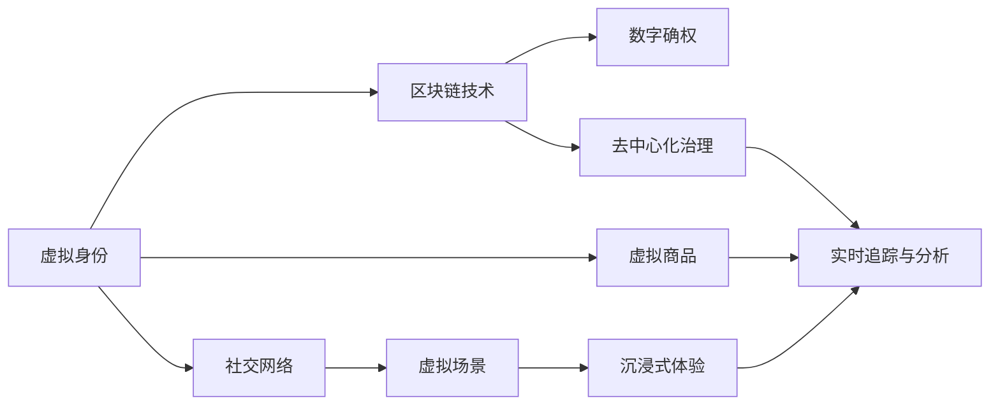

                 

# 元宇宙营销：数字化品牌建设的新阵地

## 1. 背景介绍

### 1.1 问题由来

随着技术的进步和市场的成熟，传统的营销方式正在逐步失效。许多企业陷入了高成本、低效率、转化率低的营销困境，对市场的触达和互动逐渐变弱。特别是新冠疫情爆发以来，传统的线下活动受到严重冲击，迫使企业积极拥抱线上化转型。

元宇宙技术的诞生，为数字化品牌建设提供了新的方向。元宇宙（Metaverse），即通过虚拟现实（VR）、增强现实（AR）、区块链、云计算等技术构建的数字化虚拟空间。消费者可以通过该空间与品牌、产品进行深度互动，体验更加沉浸式和交互式的消费场景。

### 1.2 问题核心关键点

元宇宙营销的核心在于如何通过虚拟空间创造新的消费体验，从而提升品牌影响力和用户黏性。具体包括以下几个关键点：

- **虚拟身份与社交网络**：建立元宇宙中消费者的虚拟身份，并构建元宇宙社交网络，促进用户间互动。
- **虚拟商品与场景**：设计元宇宙中的虚拟商品和场景，使其具有真实感与互动性。
- **数据追踪与分析**：实时追踪用户在元宇宙中的行为数据，提供精确的消费者洞察。
- **沉浸式体验**：创造沉浸式消费体验，让用户深度参与和体验品牌。
- **去中心化治理**：采用去中心化的治理模式，提升用户参与度和信任度。

## 2. 核心概念与联系

### 2.1 核心概念概述

元宇宙营销涉及到众多概念，包括虚拟身份、社交网络、虚拟商品、沉浸式体验、数据追踪、去中心化治理等。为更好地理解元宇宙营销，本文将介绍一些关键概念及其联系：

- **虚拟身份（Virtual Identity）**：用户在元宇宙中的数字身份，通过NFT（非同质化代币）技术实现身份认证和数据确权。

- **虚拟商品（Virtual Goods）**：元宇宙中可交易的数字资产，如虚拟土地、家具、服饰等。

- **社交网络（Social Network）**：基于区块链技术的去中心化社交平台，如Decentraland、Sandbox等。

- **虚拟场景（Virtual Environment）**：用户在元宇宙中活动的虚拟空间，包括虚拟城市、博物馆、咖啡馆等。

- **沉浸式体验（Immersive Experience）**：通过VR、AR技术实现的全方位感官体验，如虚拟试穿、虚拟旅游、虚拟演唱会等。

- **去中心化治理（Decentralized Governance）**：通过智能合约和治理代币，实现用户自治和平台公平。

### 2.2 核心概念原理和架构的 Mermaid 流程图

以下是Mermaid流程图，展示了元宇宙营销中各个关键概念之间的联系：



这个流程图展示了一个元宇宙营销系统的基本架构。

## 3. 核心算法原理 & 具体操作步骤

### 3.1 算法原理概述

元宇宙营销的核心算法原理主要涉及以下几个方面：

- **虚拟身份与区块链技术**：利用区块链的去中心化、透明性和不可篡改性，确保虚拟身份的真实性和不可伪造性。
- **虚拟商品与数字确权**：通过NFT技术，将虚拟商品的所有权和使用权记录在区块链上，实现数字确权。
- **沉浸式体验与虚拟场景**：利用VR、AR技术，构建高仿真度、互动性强的虚拟场景，增强用户体验。
- **实时追踪与数据分析**：利用大数据和机器学习技术，实时追踪用户行为，进行精确的消费者洞察和个性化推荐。
- **去中心化治理与智能合约**：通过智能合约实现去中心化治理，确保平台规则透明和用户参与。

### 3.2 算法步骤详解

元宇宙营销的具体操作步骤包括以下几个关键环节：

1. **虚拟身份构建**：
    - **用户注册**：用户通过区块链钱包进行身份注册，并生成独一无二的虚拟身份。
    - **身份认证**：利用公私钥加密技术，确保身份信息的真实性和安全性。

2. **虚拟商品设计**：
    - **商品创意**：设计师创建虚拟商品，如虚拟土地、家具、服饰等。
    - **NFT发行**：通过NFT平台发行虚拟商品，记录商品信息和使用权。

3. **虚拟场景构建**：
    - **虚拟城市规划**：构建虚拟城市或社区，包含商业区、住宅区、公共设施等。
    - **虚拟场景部署**：使用VR、AR技术将虚拟场景部署到用户的设备上。

4. **沉浸式体验设计**：
    - **用户交互设计**：设计用户与虚拟商品和场景的交互方式，如虚拟试穿、虚拟购物、虚拟社交等。
    - **感官模拟**：利用声光技术，模拟真实世界的感官体验，增强沉浸感。

5. **数据追踪与分析**：
    - **行为数据收集**：使用传感器和数据追踪技术，实时收集用户行为数据。
    - **数据分析建模**：利用大数据和机器学习技术，构建用户画像和行为模型。

6. **去中心化治理与智能合约**：
    - **规则制定**：用户参与制定虚拟社区的规则和治理机制。
    - **智能合约执行**：通过智能合约，自动执行治理决策和交易处理。

### 3.3 算法优缺点

元宇宙营销的算法原理和操作步骤具有以下优缺点：

**优点：**

- **用户参与度高**：通过虚拟身份和沉浸式体验，增强用户粘性和参与感。
- **数据安全性高**：基于区块链技术，保证数据确权和透明性。
- **互动性强**：利用VR、AR技术，实现用户与虚拟商品的深度互动。

**缺点：**

- **技术门槛高**：需要高水平的VR、AR和区块链技术支持。
- **开发成本高**：前期开发和部署需要大量人力和资金投入。
- **监管难度大**：去中心化治理可能存在监管难题，如假冒伪劣、侵权盗版等问题。

### 3.4 算法应用领域

元宇宙营销的核心算法广泛应用于以下领域：

- **虚拟商品销售**：虚拟房地产、虚拟艺术品、虚拟服装等。
- **虚拟旅游体验**：虚拟旅游景点、虚拟旅游线路等。
- **虚拟社交互动**：虚拟演唱会、虚拟社交俱乐部、虚拟展会等。
- **虚拟教育培训**：虚拟教室、虚拟实验、虚拟模拟等。
- **虚拟健康医疗**：虚拟手术、虚拟康复、虚拟健康顾问等。

## 4. 数学模型和公式 & 详细讲解

### 4.1 数学模型构建

元宇宙营销涉及的数学模型主要包括以下几个方面：

- **虚拟身份生成模型**：基于公私钥加密技术，生成虚拟身份的公钥和私钥，确保身份认证和数据确权。
- **虚拟商品定价模型**：基于市场供需关系和商品稀缺性，计算虚拟商品的定价和交易规则。
- **用户行为预测模型**：基于大数据和机器学习，预测用户行为，进行个性化推荐。
- **虚拟场景仿真模型**：基于VR、AR技术，实现高仿真度、沉浸式的虚拟场景模拟。

### 4.2 公式推导过程

**虚拟身份生成模型**：

$$
\text{公钥} = \text{私钥}^{e} \bmod n
$$

其中，$e$ 和 $n$ 为加密参数，$n$ 为质因数乘积。

**虚拟商品定价模型**：

$$
P = \frac{S}{D}
$$

其中，$P$ 为虚拟商品价格，$S$ 为商品稀缺性参数，$D$ 为市场需求参数。

**用户行为预测模型**：

$$
\hat{y} = f(x) = \sum_{i=1}^{k}w_i f_i(x)
$$

其中，$y$ 为用户行为预测结果，$x$ 为用户行为特征，$f_i$ 为基函数，$w_i$ 为权重系数。

**虚拟场景仿真模型**：

$$
\text{渲染图像} = \text{几何模型} + \text{光照模型} + \text{纹理模型} + \text{视差效果}
$$

其中，几何模型描述虚拟场景的几何结构，光照模型模拟光线效果，纹理模型提供场景细节，视差效果增强场景真实感。

### 4.3 案例分析与讲解

以虚拟商品销售为例，利用数学模型进行详细分析：

假设虚拟土地市场上有$N$块土地，每块土地的稀缺性为$s_i$，单位为平方米。用户对土地的需求参数为$d_j$，单位为平方米。土地的定价公式为：

$$
P_i = \frac{s_i}{d_j}
$$

其中，$i$ 为土地编号，$j$ 为用户编号。

例如，某用户想要购买面积为$5$平方米的土地，市场上有两块土地，分别为$S_1=10$平方米和$S_2=5$平方米。根据定价公式，可得：

$$
P_1 = \frac{S_1}{d_j} = \frac{10}{5} = 2
$$

$$
P_2 = \frac{S_2}{d_j} = \frac{5}{5} = 1
$$

用户最终选择了价格更低的$P_2=1$进行购买。

## 5. 项目实践：代码实例和详细解释说明

### 5.1 开发环境搭建

在项目实践之前，需要准备好开发环境。以下是使用Python进行Web3.js开发的环境配置流程：

1. 安装Node.js和npm：Node.js是Web3.js的基础环境，可以通过官网下载安装。
2. 安装Web3.js：通过npm安装Web3.js库，用于与区块链交互。
3. 安装Truffle和Ganache：Truffle是智能合约开发框架，Ganache是本地区块链测试环境，方便快速测试智能合约。
4. 安装Etherscan：Etherscan是一个基于以太坊的区块链浏览器，用于查询智能合约的部署状态和交易信息。

### 5.2 源代码详细实现

下面以虚拟身份生成为例，给出使用Web3.js进行身份注册的代码实现。

```javascript
// 引入Web3.js库
const Web3 = require('web3');
const fs = require('fs');
const web3 = new Web3(new Web3.providers.HttpProvider('https://mainnet.infura.io/v3/your-project-id'));

// 读取私钥文件
const privateKey = fs.readFileSync('private.key');

// 创建身份注册合约
const identityContract = new web3.eth.Contract(
    ABI,
    contractAddress
);

// 调用身份注册方法
const { tx, options } = identityContract.methods.createIdentity('Alice').setOptions();
const signed = web3.eth.accounts.signTransaction(tx, privateKey);
web3.eth.sendSignedTransaction(signed.rawTransaction, (err, receipt) => {
    console.log('Identity registered:', receipt);
});
```

**代码解释：**

1. 引入Web3.js库，用于与以太坊区块链交互。
2. 读取私钥文件，私钥用于身份注册。
3. 创建身份注册合约，ABI为智能合约的接口定义。
4. 调用createIdentity方法进行身份注册，设置私钥和选项。
5. 使用web3.eth.accounts.signTransaction方法生成签名，发送交易到区块链。

### 5.3 代码解读与分析

该段代码实现了以太坊区块链中的身份注册功能，具体步骤如下：

1. 通过Web3.js库连接以太坊主网，读取私钥文件。
2. 创建智能合约对象，指定合约地址和ABI接口。
3. 调用createIdentity方法生成虚拟身份，参数为身份名称。
4. 使用signTransaction方法生成交易签名，发送交易到区块链。

通过上述代码，我们可以在以太坊区块链上完成身份注册，生成独一无二的虚拟身份。

### 5.4 运行结果展示

运行上述代码后，将得到以下输出：

```
Identity registered: { tx: '0x...', hash: '0x...', receipt: { ... } }
```

其中，tx为交易哈希，hash为交易数据哈希，receipt为交易收据。交易完成后，虚拟身份生成，可以在区块链上查询到对应的信息。

## 6. 实际应用场景

### 6.1 虚拟商品销售

元宇宙中的虚拟商品销售是元宇宙营销的重要应用场景。用户可以通过虚拟身份在元宇宙中购买、出售虚拟商品。例如，用户可以在虚拟土地上建造虚拟房屋，并出售给其他用户。

### 6.2 虚拟旅游体验

元宇宙中的虚拟旅游体验，让用户可以随时随地游览世界各地的名胜古迹。用户可以选择不同的旅游路线，体验不同的文化和风景。例如，用户可以参观虚拟巴黎圣母院，甚至可以进行虚拟导览。

### 6.3 虚拟社交互动

元宇宙中的虚拟社交互动，让用户可以与虚拟角色进行深度互动。用户可以参加虚拟演唱会、虚拟社交俱乐部等活动，结识更多朋友。例如，用户可以在虚拟咖啡馆中与其他用户交流，甚至可以进行虚拟游戏。

### 6.4 未来应用展望

随着技术的进步和市场的成熟，元宇宙营销将会在更多领域得到应用。未来，元宇宙营销可能会拓展到以下领域：

- **虚拟教育**：构建虚拟教室和实验室，提供沉浸式学习体验。
- **虚拟医疗**：进行虚拟手术和康复训练，提升医疗服务水平。
- **虚拟体育**：举办虚拟体育比赛和训练，增强用户参与感。
- **虚拟政府**：提供虚拟政务服务，提升政府服务质量。

## 7. 工具和资源推荐

### 7.1 学习资源推荐

为了帮助开发者掌握元宇宙营销的相关技术，以下是一些推荐的资源：

1. 《元宇宙营销实战》系列书籍：深入介绍元宇宙营销的理论基础和实践方法，包括区块链、VR、AR、NFT等核心技术。
2. Web3.js官方文档：提供Web3.js的详细使用方法和API文档，助力开发者进行区块链交互。
3. Truffle官方文档：Truffle智能合约开发框架的官方文档，提供智能合约的编写和部署指南。
4. Metamask用户手册：Metamask是流行的Web3.js钱包，提供详细的使用说明和教程。

### 7.2 开发工具推荐

元宇宙营销需要多种工具支持，以下是推荐的开发工具：

1. Web3.js：提供Web3.js库，用于与以太坊等区块链交互。
2. Truffle：提供Truffle智能合约开发框架，支持智能合约的编写和测试。
3. Ganache：提供Ganache本地区块链测试环境，方便快速测试智能合约。
4. Metamask：提供Metamask钱包，用于管理私钥和交易。

### 7.3 相关论文推荐

以下是一些元宇宙营销领域的经典论文，推荐阅读：

1. "The Metaverse is Here: What Does It Mean for Brands?"（《元宇宙已经到来：对品牌意味着什么？》）
2. "Building a Metaverse for E-commerce"（《为电商构建元宇宙》）
3. "Metaverse Marketing: A New Paradigm for Consumer Engagement"（《元宇宙营销：新的消费者参与范式》）
4. "Blockchain and Decentralized Governance in Metaverse"（《区块链和去中心化治理在元宇宙中的应用》）

## 8. 总结：未来发展趋势与挑战

### 8.1 研究成果总结

本文详细介绍了元宇宙营销的理论基础和实践方法，展示了元宇宙营销在虚拟商品销售、虚拟旅游体验、虚拟社交互动等方面的应用潜力。元宇宙营销为数字化品牌建设提供了新的方向，为用户带来全新的消费体验。

### 8.2 未来发展趋势

展望未来，元宇宙营销将呈现以下发展趋势：

1. **技术融合**：元宇宙营销将与区块链、VR/AR、大数据、机器学习等技术深度融合，实现多模态交互。
2. **市场扩展**：元宇宙营销将拓展到更多领域，如教育、医疗、政府等，提供全方位的数字化服务。
3. **用户参与**：元宇宙营销将更加注重用户参与和互动，提供更个性化、沉浸式的体验。
4. **数据应用**：元宇宙营销将利用大数据和机器学习，进行精准的用户洞察和个性化推荐。
5. **去中心化治理**：元宇宙营销将采用去中心化治理模式，提升用户参与度和信任度。

### 8.3 面临的挑战

尽管元宇宙营销具有巨大的发展潜力，但仍然面临一些挑战：

1. **技术复杂性**：元宇宙营销需要高水平的技术支持，包括区块链、VR/AR等技术。
2. **市场接受度**：用户对元宇宙的接受度和信任度较低，需要进一步提升。
3. **监管难题**：元宇宙营销涉及多领域监管，需要协调多方利益。
4. **数据安全**：元宇宙中的数据安全和隐私保护问题需要进一步解决。
5. **商业模式**：元宇宙营销的商业模式尚未成熟，需要探索新的盈利模式。

### 8.4 研究展望

未来，元宇宙营销需要在技术、市场、监管等方面进行深入研究，以应对当前的挑战。研究展望包括：

1. **技术优化**：提升元宇宙技术的性能和用户体验，降低技术门槛。
2. **市场推广**：开展大规模市场推广活动，提升用户接受度。
3. **政策制定**：制定元宇宙营销相关的政策和标准，保障用户权益。
4. **安全保障**：加强数据安全保障，保护用户隐私和权益。
5. **商业模式**：探索元宇宙营销的商业模式，提升盈利能力。

## 9. 附录：常见问题与解答

### Q1: 什么是元宇宙营销？

**A:** 元宇宙营销是一种基于虚拟现实、增强现实、区块链等技术的营销方式，通过构建虚拟空间，实现用户与品牌、产品的深度互动和沉浸式体验。

### Q2: 元宇宙营销的优势是什么？

**A:** 元宇宙营销具有以下优势：
- **用户参与度高**：通过虚拟身份和沉浸式体验，增强用户粘性和参与感。
- **数据安全性高**：基于区块链技术，保证数据确权和透明性。
- **互动性强**：利用VR、AR技术，实现用户与虚拟商品的深度互动。

### Q3: 元宇宙营销的技术难点有哪些？

**A:** 元宇宙营销的技术难点包括：
- **技术复杂性**：需要高水平的VR、AR和区块链技术支持。
- **市场接受度**：用户对元宇宙的接受度和信任度较低。
- **监管难题**：元宇宙营销涉及多领域监管，需要协调多方利益。
- **数据安全**：元宇宙中的数据安全和隐私保护问题需要进一步解决。

### Q4: 如何构建元宇宙营销平台？

**A:** 构建元宇宙营销平台需要以下步骤：
1. 选择合适的平台技术，如Unreal Engine、Unity等。
2. 设计和开发虚拟商品、虚拟场景等。
3. 开发智能合约，实现虚拟身份和虚拟商品的管理。
4. 搭建元宇宙平台，集成VR、AR技术。
5. 部署元宇宙平台，提供用户体验。

通过以上系统梳理，我们了解了元宇宙营销的理论基础和实践方法，展示了元宇宙营销在虚拟商品销售、虚拟旅游体验、虚拟社交互动等方面的应用潜力。元宇宙营销为数字化品牌建设提供了新的方向，为用户带来全新的消费体验。未来，随着技术的进步和市场的成熟，元宇宙营销必将在更多领域得到应用，推动数字化品牌建设的全面升级。

---

作者：禅与计算机程序设计艺术 / Zen and the Art of Computer Programming

