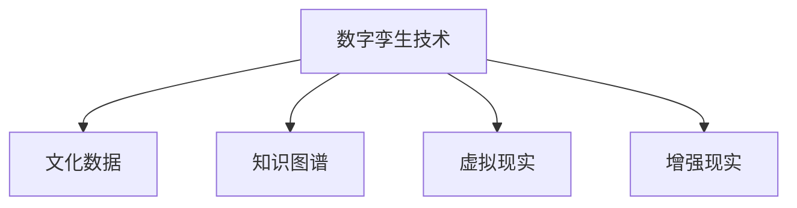

                 

# 全球脑与全球脑:数字孪生技术在文化研究中的应用

> 关键词：数字孪生,文化研究,文化数据,虚拟模型,知识图谱,虚拟现实(VR),增强现实(AR)

## 1. 背景介绍

### 1.1 问题由来
随着全球化的深入发展，不同文化之间的交流与融合日益频繁，跨文化研究成为全球研究的热点领域之一。然而，传统的文化研究依赖于学者的主观理解和实证分析，难以全面、系统地揭示文化现象的复杂性。随着数字技术的飞速发展，数字孪生技术（Digital Twin）为文化研究提供了新的解决方案，通过构建数字孪生模型，可以更深入地分析文化现象、探索文化变迁，推动跨文化研究和文化传承。

### 1.2 问题核心关键点
数字孪生技术（Digital Twin）是指在虚拟空间中构建与物理实体（如建筑物、城市等）对应的虚拟模型，用于模拟、分析和预测物理实体在实际环境中的行为。将数字孪生技术应用于文化研究，可以构建全球文化数字孪生模型，通过数据驱动的方式，揭示文化现象的内在规律，辅助文化传承和跨文化交流。

## 2. 核心概念与联系

### 2.1 核心概念概述

为更好地理解数字孪生技术在文化研究中的应用，本节将介绍几个密切相关的核心概念：

- 数字孪生技术（Digital Twin）：指在虚拟空间中构建与物理实体对应的虚拟模型，用于模拟、分析和预测物理实体在实际环境中的行为。
- 文化数据（Cultural Data）：指记录和描述文化现象的各种数据，包括历史文献、艺术品、音乐、语言、习俗等。
- 知识图谱（Knowledge Graph）：指用于表示实体及其关系的语义网络，用于组织和检索复杂的信息。
- 虚拟现实（Virtual Reality, VR）：指利用计算机技术，模拟逼真的虚拟环境，供用户沉浸式体验。
- 增强现实（Augmented Reality, AR）：指在用户真实环境中叠加虚拟信息，增强现实感知。

这些核心概念之间的逻辑关系可以通过以下Mermaid流程图来展示：



这个流程图展示了几大核心概念之间的关系：

1. 数字孪生技术是构建虚拟模型的基础，通过数据驱动的方式，模拟文化现象。
2. 文化数据是数字孪生模型的输入，包括历史文献、艺术品、音乐、语言、习俗等。
3. 知识图谱是用于组织和检索文化数据的工具，提供语义化的信息组织方式。
4. 虚拟现实和增强现实是展现和体验文化数据的媒介，提供沉浸式和增强现实感知的体验。

这些概念共同构成了数字孪生技术在文化研究中的应用框架，使得文化研究能够更加系统、深入、沉浸式地进行。

## 3. 核心算法原理 & 具体操作步骤
### 3.1 算法原理概述

数字孪生技术在文化研究中的应用，本质上是利用数据驱动的方式，构建虚拟模型来模拟、分析和预测文化现象。其核心思想是：通过收集大量的文化数据，构建虚拟文化模型，利用机器学习和深度学习技术，提取文化数据的内在规律，进而揭示文化现象的内在联系和演变规律。

形式化地，假设文化数据集为 $D=\{(x_i,y_i)\}_{i=1}^N$，其中 $x_i$ 表示第 $i$ 个文化现象的特征向量，$y_i$ 表示其对应的标签。数字孪生模型 $M_{\theta}$ 通过最小化损失函数 $\mathcal{L}(y_i,M_{\theta}(x_i))$，其中 $\theta$ 为模型参数。

在实践中，我们通常使用基于梯度的优化算法（如SGD、Adam等）来近似求解上述最优化问题。设 $\eta$ 为学习率，则参数的更新公式为：

$$
\theta \leftarrow \theta - \eta \nabla_{\theta}\mathcal{L}(y_i,M_{\theta}(x_i))
$$

其中 $\nabla_{\theta}\mathcal{L}(y_i,M_{\theta}(x_i))$ 为损失函数对参数 $\theta$ 的梯度，可通过反向传播算法高效计算。

### 3.2 算法步骤详解

数字孪生技术在文化研究中的应用，一般包括以下几个关键步骤：

**Step 1: 数据收集与预处理**
- 收集文化研究领域的数据，包括历史文献、艺术品、音乐、语言、习俗等。
- 对数据进行清洗和标注，去除噪声和错误数据，提取有意义的特征。

**Step 2: 构建虚拟模型**
- 使用知识图谱技术，将文化数据组织成语义化的结构，方便模型的学习。
- 利用深度学习框架（如TensorFlow、PyTorch等），构建虚拟文化模型。
- 选择合适的损失函数和优化器，进行模型训练。

**Step 3: 模型评估与优化**
- 在验证集上评估模型性能，调整超参数，如学习率、批大小、迭代轮数等。
- 利用对抗样本和数据增强技术，提高模型鲁棒性。
- 应用正则化技术，如L2正则、Dropout等，防止过拟合。

**Step 4: 模型应用与分析**
- 将训练好的虚拟文化模型应用于新的文化数据，进行分析和预测。
- 利用虚拟现实和增强现实技术，展示和体验虚拟文化模型。
- 结合统计分析和可视化工具，揭示文化现象的内在规律和演变趋势。

### 3.3 算法优缺点

数字孪生技术在文化研究中的应用，具有以下优点：
1. 数据驱动。通过大量数据驱动的方式，揭示文化现象的内在规律，避免主观偏差。
2. 高效性。利用虚拟模型进行分析和预测，可以大幅提高研究效率，缩短研究周期。
3. 系统性。通过构建虚拟文化模型，系统性地分析文化现象，揭示其内在联系和演变规律。
4. 沉浸式。利用虚拟现实和增强现实技术，提供沉浸式和增强现实感知的体验，增强研究效果。

同时，该方法也存在一定的局限性：
1. 数据依赖。虚拟模型的质量很大程度上依赖于文化数据的丰富性和多样性，数据获取成本较高。
2. 计算复杂。构建虚拟模型和训练模型，需要较高的计算资源和算力，成本较高。
3. 可解释性不足。虚拟文化模型的决策过程缺乏可解释性，难以对其推理逻辑进行分析和调试。

尽管存在这些局限性，但数字孪生技术在文化研究中的应用，无疑为揭示文化现象的内在规律和演变趋势提供了新的途径。

### 3.4 算法应用领域

数字孪生技术在文化研究中的应用，已经在多个领域取得了显著进展，例如：

- 历史文献分析：利用虚拟模型，对历史文献进行自动分类、主题提取、情感分析等。
- 艺术品鉴赏：通过虚拟现实技术，模拟艺术品的历史背景、创作过程等，提供沉浸式体验。
- 语言演化研究：利用虚拟模型，对语言演化过程进行模拟，揭示语言演变的内在规律。
- 民俗研究：通过虚拟模型，对不同文化背景下的民俗活动进行模拟和预测，探索其演变趋势。
- 音乐传承：利用虚拟现实和增强现实技术，展示音乐传承的过程和形式，增强传承效果。

除了上述这些经典领域外，数字孪生技术还将在更多文化研究场景中得到应用，如文学创作、文化旅游、文化教育等，为文化传承和跨文化交流提供新的技术和平台。

## 4. 数学模型和公式 & 详细讲解
### 4.1 数学模型构建

本节将使用数学语言对数字孪生技术在文化研究中的应用进行更加严格的刻画。

记文化数据集为 $D=\{(x_i,y_i)\}_{i=1}^N$，其中 $x_i \in \mathbb{R}^d$ 为文化现象的特征向量，$y_i \in \mathcal{Y}$ 为标签集合。

定义虚拟文化模型 $M_{\theta}$，其中 $\theta \in \mathbb{R}^d$ 为模型参数。假设损失函数为交叉熵损失，则虚拟文化模型的训练目标为：

$$
\theta^* = \mathop{\arg\min}_{\theta} \mathcal{L}(y_i,M_{\theta}(x_i)) = -\frac{1}{N}\sum_{i=1}^N y_i\log M_{\theta}(x_i)
$$

在实践中，我们通常使用基于梯度的优化算法（如SGD、Adam等）来近似求解上述最优化问题。设 $\eta$ 为学习率，则参数的更新公式为：

$$
\theta \leftarrow \theta - \eta \nabla_{\theta}\mathcal{L}(y_i,M_{\theta}(x_i))
$$

其中 $\nabla_{\theta}\mathcal{L}(y_i,M_{\theta}(x_i))$ 为损失函数对参数 $\theta$ 的梯度，可通过反向传播算法高效计算。

### 4.2 公式推导过程

以下我们以语言演化研究为例，推导交叉熵损失函数及其梯度的计算公式。

假设虚拟文化模型 $M_{\theta}$ 在输入 $x$ 上的输出为 $\hat{y}=M_{\theta}(x) \in [0,1]$，表示语言演化过程的预测概率。真实标签 $y \in \{0,1\}$。则二分类交叉熵损失函数定义为：

$$
\ell(M_{\theta}(x),y) = -[y\log \hat{y} + (1-y)\log (1-\hat{y})]
$$

将其代入损失函数公式，得：

$$
\mathcal{L}(\theta) = -\frac{1}{N}\sum_{i=1}^N [y_i\log M_{\theta}(x_i)+(1-y_i)\log(1-M_{\theta}(x_i))]
$$

根据链式法则，损失函数对参数 $\theta_k$ 的梯度为：

$$
\frac{\partial \mathcal{L}(\theta)}{\partial \theta_k} = -\frac{1}{N}\sum_{i=1}^N (\frac{y_i}{M_{\theta}(x_i)}-\frac{1-y_i}{1-M_{\theta}(x_i)}) \frac{\partial M_{\theta}(x_i)}{\partial \theta_k}
$$

其中 $\frac{\partial M_{\theta}(x_i)}{\partial \theta_k}$ 可进一步递归展开，利用自动微分技术完成计算。

## 5. 项目实践：代码实例和详细解释说明
### 5.1 开发环境搭建

在进行虚拟文化模型开发前，我们需要准备好开发环境。以下是使用Python进行TensorFlow开发的环境配置流程：

1. 安装Anaconda：从官网下载并安装Anaconda，用于创建独立的Python环境。

2. 创建并激活虚拟环境：
```bash
conda create -n tensorflow-env python=3.8 
conda activate tensorflow-env
```

3. 安装TensorFlow：根据CUDA版本，从官网获取对应的安装命令。例如：
```bash
conda install tensorflow
```

4. 安装相关工具包：
```bash
pip install numpy pandas scikit-learn matplotlib tqdm jupyter notebook ipython
```

完成上述步骤后，即可在`tensorflow-env`环境中开始虚拟文化模型的开发。

### 5.2 源代码详细实现

下面我们以语言演化研究为例，给出使用TensorFlow构建虚拟文化模型的PyTorch代码实现。

首先，定义虚拟文化模型：

```python
import tensorflow as tf
from tensorflow.keras import layers

model = tf.keras.Sequential([
    layers.Dense(256, activation='relu', input_shape=(d,)),
    layers.Dense(1, activation='sigmoid')
])
```

然后，定义训练和评估函数：

```python
@tf.function
def train_step(x, y):
    with tf.GradientTape() as tape:
        logits = model(x)
        loss = tf.losses.BinaryCrossentropy()(y, logits)
    gradients = tape.gradient(loss, model.trainable_variables)
    optimizer.apply_gradients(zip(gradients, model.trainable_variables))

def evaluate(model, test_x, test_y):
    logits = model(test_x)
    predictions = tf.round(logits)
    accuracy = tf.reduce_mean(tf.cast(tf.equal(predictions, test_y), tf.float32))
    return accuracy
```

最后，启动训练流程并在测试集上评估：

```python
epochs = 10
batch_size = 64

for epoch in range(epochs):
    for batch in train_dataset:
        train_step(batch[0], batch[1])
    accuracy = evaluate(model, test_dataset)
    print(f"Epoch {epoch+1}, accuracy: {accuracy:.3f}")
```

以上就是使用TensorFlow对虚拟文化模型进行语言演化研究微调的完整代码实现。可以看到，TensorFlow的高级API使得构建虚拟文化模型和微调过程变得简洁高效。

### 5.3 代码解读与分析

让我们再详细解读一下关键代码的实现细节：

**虚拟文化模型定义**：
- 使用`tf.keras.Sequential`定义虚拟文化模型，包含两个全连接层，第一层输出256个神经元，使用ReLU激活函数，第二层输出1个神经元，使用sigmoid激活函数。

**训练函数**：
- 定义`train_step`函数，使用`tf.GradientTape`记录梯度，计算损失函数，使用`optimizer.apply_gradients`更新模型参数。

**评估函数**：
- 定义`evaluate`函数，使用`tf.round`对模型预测结果进行二值化处理，使用`tf.equal`计算预测结果与真实标签的匹配度，计算准确率。

**训练流程**：
- 定义总轮数和批次大小，开始循环迭代
- 每个epoch内，在训练集上训练，输出当前轮的准确率
- 所有epoch结束后，在测试集上评估，给出最终测试结果

可以看到，TensorFlow的高级API和Keras框架，使得构建虚拟文化模型和微调过程变得简洁高效。开发者可以将更多精力放在数据处理、模型改进等高层逻辑上，而不必过多关注底层的实现细节。

当然，工业级的系统实现还需考虑更多因素，如模型的保存和部署、超参数的自动搜索、更灵活的任务适配层等。但核心的微调范式基本与此类似。

## 6. 实际应用场景
### 6.1 智能博物馆

虚拟文化模型可以广泛应用于智能博物馆的展览和导览中。传统的博物馆展览依赖于实体模型的物理摆放，难以满足多维度的展示需求。利用虚拟文化模型，可以在虚拟空间中构建虚拟展览，展示不同的历史时期、文化背景下的艺术品和文物，提供沉浸式和增强现实感知的体验。

在技术实现上，可以收集博物馆的历史文物数据，建立虚拟文化模型。利用虚拟现实技术，用户可以在虚拟空间中自由漫游，通过点击、拖拽等方式交互，了解每个文物的历史背景、创作过程等详细信息。同时，利用增强现实技术，用户可以通过手机或AR眼镜，将虚拟文物叠加到现实环境中，提供丰富的展示和体验方式。

### 6.2 跨文化教育

虚拟文化模型可以应用于跨文化教育，提供多维度的文化体验和知识传授。传统的跨文化教育依赖于教师的主观讲授，难以提供真实、生动的文化体验。利用虚拟文化模型，可以在虚拟空间中构建不同文化背景下的教育场景，提供丰富的文化资源和互动体验。

在实践应用中，可以收集不同文化背景下的教育资源，建立虚拟文化模型。利用虚拟现实技术，用户可以在虚拟空间中自由探索，通过交互式问答、虚拟实验等方式，深入了解不同文化背景下的历史、艺术、语言等知识。同时，利用增强现实技术，用户可以通过手机或AR眼镜，将虚拟文化元素叠加到现实环境中，提供生动的文化体验和互动体验。

### 6.3 文化传承与保护

虚拟文化模型可以应用于文化传承与保护，保存和传播丰富的文化遗产。传统的文化传承依赖于手工记录和实物展示，难以广泛传播和保护。利用虚拟文化模型，可以在虚拟空间中构建虚拟博物馆和文化馆，保存和传播丰富的文化遗产。

在实践应用中，可以收集不同文化背景下的历史文献、艺术品、音乐、语言等文化资源，建立虚拟文化模型。利用虚拟现实技术，用户可以在虚拟空间中自由探索，通过虚拟博物馆和文化馆的方式，了解和体验不同文化背景下的文化遗产。同时，利用增强现实技术，用户可以通过手机或AR眼镜，将虚拟文化元素叠加到现实环境中，提供丰富的文化体验和互动体验。

### 6.4 未来应用展望

随着虚拟文化模型的不断发展，其在文化研究中的应用也将更加广泛和深入。未来，虚拟文化模型将更加智能化、动态化，能够根据用户的兴趣和需求，提供个性化的文化体验和知识服务。同时，虚拟文化模型将与人工智能、大数据等技术深度融合，推动文化研究的创新和发展。

未来，虚拟文化模型将在更多领域得到应用，如文化旅游、文化创意产业、文化教育等，为文化传承和跨文化交流提供新的技术和平台。相信随着技术的不断进步，虚拟文化模型必将在文化研究中发挥越来越重要的作用，推动文化传承和创新发展。

## 7. 工具和资源推荐
### 7.1 学习资源推荐

为了帮助开发者系统掌握虚拟文化模型的理论基础和实践技巧，这里推荐一些优质的学习资源：

1. 《TensorFlow从入门到精通》系列博文：由TensorFlow官方社区撰写，全面介绍了TensorFlow的基本概念和应用场景，涵盖从入门到进阶的所有内容。

2. 《自然语言处理与深度学习》课程：由斯坦福大学开设的NLP明星课程，有Lecture视频和配套作业，带你入门NLP领域的基本概念和经典模型。

3. 《数字孪生技术与应用》书籍：全面介绍了数字孪生技术的原理、方法和应用场景，是理解虚拟文化模型的必备资料。

4. 《虚拟现实技术与应用》书籍：介绍了虚拟现实技术的原理、发展历程和应用场景，为构建虚拟文化模型提供理论基础。

5. 《增强现实技术与应用》书籍：介绍了增强现实技术的原理、发展历程和应用场景，为增强现实感知的文化体验提供技术支持。

通过对这些资源的学习实践，相信你一定能够快速掌握虚拟文化模型的精髓，并用于解决实际的文化研究问题。

### 7.2 开发工具推荐

高效的开发离不开优秀的工具支持。以下是几款用于虚拟文化模型开发和应用的工具：

1. TensorFlow：由Google主导开发的开源深度学习框架，支持分布式计算，适用于大规模模型训练和应用。

2. PyTorch：基于Python的开源深度学习框架，灵活动态的计算图，适合快速迭代研究。

3. Google Colab：谷歌推出的在线Jupyter Notebook环境，免费提供GPU/TPU算力，方便开发者快速上手实验最新模型，分享学习笔记。

4. Blender：开源的3D创作套件，支持虚拟现实和增强现实的应用开发，提供丰富的3D建模和渲染工具。

5. Unity：跨平台的游戏引擎，支持虚拟现实和增强现实的应用开发，提供强大的交互设计和动画制作工具。

合理利用这些工具，可以显著提升虚拟文化模型的开发效率，加快创新迭代的步伐。

### 7.3 相关论文推荐

虚拟文化模型的发展源于学界的持续研究。以下是几篇奠基性的相关论文，推荐阅读：

1. Bridging the Gap: An Introduction to Digital Twins（数字孪生的桥梁）：介绍数字孪生的概念、技术和应用场景，为理解虚拟文化模型提供理论基础。

2. Virtual Reality and Augmented Reality in Education（虚拟现实与增强现实在教育中的应用）：讨论虚拟现实和增强现实在教育中的应用，为虚拟文化模型的教育应用提供参考。

3. The Virtual Museum: A New Paradigm for Cultural Heritage（虚拟博物馆：文化遗产的新范式）：介绍虚拟博物馆的构建方法和应用场景，为虚拟文化模型的文化传承应用提供参考。

4. Virtual Cultural Heritage Sites: A Survey of the State-of-the-Art（虚拟文化遗址：最新进展综述）：综述虚拟文化遗址的构建方法和应用场景，为虚拟文化模型的文化保护应用提供参考。

这些论文代表了大语言模型微调技术的发展脉络。通过学习这些前沿成果，可以帮助研究者把握学科前进方向，激发更多的创新灵感。

## 8. 总结：未来发展趋势与挑战

### 8.1 总结

本文对数字孪生技术在文化研究中的应用进行了全面系统的介绍。首先阐述了数字孪生技术在文化研究的研究背景和意义，明确了虚拟文化模型在揭示文化现象内在规律方面的独特价值。其次，从原理到实践，详细讲解了虚拟文化模型的构建和微调过程，给出了虚拟文化模型开发的完整代码实例。同时，本文还广泛探讨了虚拟文化模型在智能博物馆、跨文化教育、文化传承与保护等多个领域的应用前景，展示了虚拟文化模型的巨大潜力。此外，本文精选了虚拟文化模型的各类学习资源，力求为读者提供全方位的技术指引。

通过本文的系统梳理，可以看到，虚拟文化模型正在成为文化研究的重要工具，极大地拓展了文化研究的深度和广度，为跨文化研究和文化传承提供了新的途径。未来，伴随虚拟文化模型的不断发展，其在文化研究中的应用将更加广泛和深入，为文化传承和创新发展提供新的动力。

### 8.2 未来发展趋势

展望未来，虚拟文化模型在文化研究中的应用将呈现以下几个发展趋势：

1. 智能化水平提升。利用深度学习和机器学习技术，构建更加智能化、动态化的虚拟文化模型，能够根据用户的兴趣和需求，提供个性化的文化体验和知识服务。

2. 交互体验增强。利用虚拟现实和增强现实技术，提供更加丰富、生动的文化体验，使用户能够沉浸式地感受文化现象。

3. 跨学科融合。虚拟文化模型将与人工智能、大数据、物联网等技术深度融合，推动文化研究的创新和发展。

4. 多样化应用扩展。虚拟文化模型将应用于更多领域，如文化旅游、文化创意产业、文化教育等，为文化传承和跨文化交流提供新的技术和平台。

以上趋势凸显了虚拟文化模型在文化研究中的广阔前景。这些方向的探索发展，必将进一步推动虚拟文化模型的创新和应用，为文化传承和创新发展提供新的动力。

### 8.3 面临的挑战

尽管虚拟文化模型在文化研究中已经取得了显著进展，但在迈向更加智能化、普适化应用的过程中，它仍面临着诸多挑战：

1. 数据依赖。虚拟文化模型的质量很大程度上依赖于文化数据的丰富性和多样性，数据获取成本较高。

2. 计算复杂。构建虚拟文化模型和训练模型，需要较高的计算资源和算力，成本较高。

3. 可解释性不足。虚拟文化模型的决策过程缺乏可解释性，难以对其推理逻辑进行分析和调试。

4. 安全性有待保障。虚拟文化模型可能学习到有害信息，传递到虚拟文化环境中，给用户带来安全隐患。

5. 交互体验瓶颈。虚拟现实和增强现实技术的应用，受限于设备的限制和用户的感知体验，需要进一步优化。

6. 多模态融合。虚拟文化模型的应用需要融合视觉、听觉、触觉等多模态信息，实现全面、立体的文化体验。

正视虚拟文化模型面临的这些挑战，积极应对并寻求突破，将是大语言模型微调走向成熟的必由之路。相信随着学界和产业界的共同努力，这些挑战终将一一被克服，虚拟文化模型必将在文化研究中发挥越来越重要的作用。

### 8.4 研究展望

面向未来，虚拟文化模型在文化研究中的应用还需要在以下几个方面寻求新的突破：

1. 探索无监督和半监督学习。摆脱对大规模标注数据的依赖，利用自监督学习、主动学习等无监督和半监督范式，最大限度利用非结构化数据，实现更加灵活高效的虚拟文化模型。

2. 研究参数高效和计算高效的虚拟文化模型。开发更加参数高效的虚拟文化模型，在固定大部分预训练参数的同时，只更新极少量的任务相关参数。同时优化虚拟文化模型的计算图，减少前向传播和反向传播的资源消耗，实现更加轻量级、实时性的部署。

3. 融合因果和对比学习范式。通过引入因果推断和对比学习思想，增强虚拟文化模型建立稳定因果关系的能力，学习更加普适、鲁棒的文化知识，从而提升模型泛化性和抗干扰能力。

4. 引入更多先验知识。将符号化的先验知识，如知识图谱、逻辑规则等，与虚拟文化模型进行巧妙融合，引导虚拟文化模型学习更准确、合理的文化知识。同时加强不同模态数据的整合，实现视觉、听觉、触觉等多模态信息与文化信息的协同建模。

5. 结合因果分析和博弈论工具。将因果分析方法引入虚拟文化模型，识别出模型决策的关键特征，增强虚拟文化模型输出解释的因果性和逻辑性。借助博弈论工具刻画人机交互过程，主动探索并规避虚拟文化模型的脆弱点，提高系统稳定性。

这些研究方向的探索，必将引领虚拟文化模型技术迈向更高的台阶，为构建安全、可靠、可解释、可控的智能系统铺平道路。面向未来，虚拟文化模型还需要与其他人工智能技术进行更深入的融合，如知识表示、因果推理、强化学习等，多路径协同发力，共同推动文化研究的进步。只有勇于创新、敢于突破，才能不断拓展虚拟文化模型的边界，让智能技术更好地造福人类社会。

## 9. 附录：常见问题与解答

**Q1：虚拟文化模型是否适用于所有文化研究任务？**

A: 虚拟文化模型在大多数文化研究任务上都能取得不错的效果，特别是对于数据量较小的任务。但对于一些特定领域的任务，如考古学、人类学等，仅仅依靠通用语料预训练的模型可能难以很好地适应。此时需要在特定领域语料上进一步预训练，再进行微调，才能获得理想效果。

**Q2：虚拟文化模型如何选择合适的学习率？**

A: 虚拟文化模型的学习率一般要比预训练时小1-2个数量级，如果使用过大的学习率，容易破坏预训练权重，导致过拟合。一般建议从1e-5开始调参，逐步减小学习率，直至收敛。也可以使用warmup策略，在开始阶段使用较小的学习率，再逐渐过渡到预设值。

**Q3：采用虚拟文化模型时会面临哪些资源瓶颈？**

A: 目前主流的虚拟文化模型动辄以亿计的参数规模，对算力、内存、存储都提出了很高的要求。GPU/TPU等高性能设备是必不可少的，但即便如此，超大批次的训练和推理也可能遇到显存不足的问题。因此需要采用一些资源优化技术，如梯度积累、混合精度训练、模型并行等，来突破硬件瓶颈。同时，模型的存储和读取也可能占用大量时间和空间，需要采用模型压缩、稀疏化存储等方法进行优化。

**Q4：如何缓解虚拟文化模型中的过拟合问题？**

A: 过拟合是虚拟文化模型面临的主要挑战，尤其是在标注数据不足的情况下。常见的缓解策略包括：
1. 数据增强：通过回译、近义替换等方式扩充训练集
2. 正则化：使用L2正则、Dropout、Early Stopping等避免过拟合
3. 对抗训练：引入对抗样本，提高模型鲁棒性
4. 参数高效微调：只调整少量参数(如Adapter、Prefix等)，减小过拟合风险
5. 多模型集成：训练多个虚拟文化模型，取平均输出，抑制过拟合

这些策略往往需要根据具体任务和数据特点进行灵活组合。只有在数据、模型、训练、推理等各环节进行全面优化，才能最大限度地发挥虚拟文化模型的威力。

**Q5：虚拟文化模型在落地部署时需要注意哪些问题？**

A: 将虚拟文化模型转化为实际应用，还需要考虑以下因素：
1. 模型裁剪：去除不必要的层和参数，减小模型尺寸，加快推理速度
2. 量化加速：将浮点模型转为定点模型，压缩存储空间，提高计算效率
3. 服务化封装：将模型封装为标准化服务接口，便于集成调用
4. 弹性伸缩：根据请求流量动态调整资源配置，平衡服务质量和成本
5. 监控告警：实时采集系统指标，设置异常告警阈值，确保服务稳定性
6. 安全防护：采用访问鉴权、数据脱敏等措施，保障数据和模型安全

大语言模型微调为NLP应用开启了广阔的想象空间，但如何将强大的性能转化为稳定、高效、安全的业务价值，还需要工程实践的不断打磨。唯有从数据、算法、工程、业务等多个维度协同发力，才能真正实现人工智能技术在垂直行业的规模化落地。总之，虚拟文化模型需要开发者根据具体任务，不断迭代和优化模型、数据和算法，方能得到理想的效果。

---

作者：禅与计算机程序设计艺术 / Zen and the Art of Computer Programming

