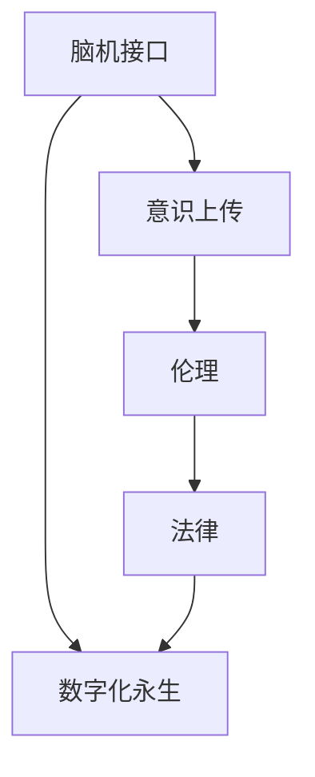

                 

# 全球脑与意识上传伦理:数字化永生的哲学与法律思考

> 关键词：数字化永生,意识上传,脑机接口,伦理法律,人类未来

## 1. 背景介绍

### 1.1 问题由来
随着科技的飞速发展，人类对数字化永生的憧憬也逐渐成为可能。数字化永生，即通过脑机接口和高级AI技术将人类意识转移到虚拟世界，从而实现数字化的永恒生命。这一愿景不仅带来无限可能，也引发了深远而复杂的伦理和法律问题。

- **技术发展**：脑机接口、高级AI、神经科学等领域的研究取得了显著进展，为意识上传提供了技术基础。
- **伦理争议**：数字化永生引发的诸多伦理问题，如人类本质的定义、数字生命的权利与义务、隐私保护等，亟需深入探讨。
- **法律挑战**：意识上传涉及复杂的法律框架，如版权、隐私、数据保护等，需要制定相应的法律规范。

### 1.2 问题核心关键点
意识上传的核心问题包括：

- **技术可行性**：脑机接口能否准确捕捉大脑活动，高级AI能否理解并模拟人类意识。
- **伦理困境**：人类意识上传对个体和社会的意义，以及道德责任和权利分配。
- **法律框架**：意识上传的合法性和权利义务界定，以及对当前法律体系的冲击和影响。

这些问题交织在一起，构成了数字化永生领域的复杂图景。本文将聚焦于脑机接口和意识上传的技术、伦理和法律议题，探讨数字化永生的可能性与挑战。

## 2. 核心概念与联系

### 2.1 核心概念概述

为更好地理解意识上传的伦理与法律问题，本节将介绍几个核心概念：

- **脑机接口(Brain-Machine Interface, BMI)**：通过神经信号与计算机进行交互的技术，实现对大脑活动的捕捉与控制。
- **意识上传(Consciousness Transfer)**：将大脑的活动状态和信息转移到数字或虚拟世界中，实现意识的数字化和永生。
- **数字化永生(Digital Immortality)**：通过意识上传，在虚拟世界中实现人类意识的不朽。
- **伦理( Ethics)**：涉及行为准则和价值判断，探讨意识上传对个体和社会的影响。
- **法律(Law)**：提供规范和约束，保护意识上传过程中的合法权益。

这些核心概念之间的逻辑关系可以通过以下Mermaid流程图来展示：



这个流程图展示了一系列概念之间的关系：

1. 脑机接口是实现意识上传的基础技术。
2. 意识上传通过技术手段实现数字化永生。
3. 意识上传过程中涉及复杂的伦理问题。
4. 伦理问题需要通过法律手段来规范和解决。

## 3. 核心算法原理 & 具体操作步骤
### 3.1 算法原理概述

意识上传的实现涉及多个学科领域的综合应用，包括神经科学、计算机科学、伦理学和法律学。其核心算法原理可以概括为以下几点：

- **数据采集与传输**：使用脑机接口技术，采集大脑的神经信号，并将其转换为数字信号传输到计算机系统。
- **信号解码与重建**：通过高级AI算法，解码神经信号，并重构出大脑的活动状态。
- **意识模拟与上传**：在计算机系统中模拟大脑的活动，并将意识状态转移到虚拟世界中。

这一过程的实现，需要跨学科合作和技术集成。

### 3.2 算法步骤详解

意识上传的实现过程大致可以分为以下几个步骤：

**Step 1: 脑机接口设备的安装与校准**
- 在目标对象的大脑中植入脑机接口设备，如脑电图(EEG)、脑磁图(MEG)、脑成像(fMRI)等。
- 校准设备，确保数据采集的准确性和稳定性。

**Step 2: 神经信号的采集与预处理**
- 采集大脑的神经信号，如电信号、磁信号、光学信号等。
- 进行预处理，包括滤波、降噪、归一化等，确保信号质量。

**Step 3: 信号解码与重建**
- 使用高级AI算法，如深度学习、卷积神经网络(CNN)等，解码神经信号。
- 重构出大脑的活动状态，如意识内容、情感状态等。

**Step 4: 意识模拟与上传**
- 在计算机系统中模拟大脑的活动，使用高级AI算法重构意识状态。
- 将意识状态转移到虚拟世界中，如数字大脑、虚拟现实环境等。

### 3.3 算法优缺点

意识上传算法具有以下优点：
1. **技术先进性**：结合了神经科学、计算机科学和AI技术的最新成果，具备高精度、高可靠性的特点。
2. **广泛应用前景**：不仅在意识上传领域有潜力，还可以应用于医疗、教育、娱乐等领域。
3. **个性化定制**：可以根据不同的个体需求，定制个性化的脑机接口和意识上传方案。

同时，意识上传算法也存在一些局限性：
1. **技术复杂性高**：涉及多学科的复杂集成，对技术要求较高。
2. **伦理争议多**：对人类意识本质和权利义务的界定存在广泛争议。
3. **法律风险高**：现有法律体系难以应对意识上传带来的新问题，需要重新制定相关法律规范。

### 3.4 算法应用领域

意识上传算法不仅在数字化永生领域有广泛应用，还涉及多个其他领域：

- **医疗康复**：通过脑机接口，辅助身体障碍人士进行康复训练。
- **教育培训**：通过模拟大脑活动，提供个性化的学习体验。
- **游戏娱乐**：创造虚拟现实游戏，让玩家体验数字化的生活。
- **科学研究**：探索大脑的未知领域，推动神经科学的发展。

## 4. 数学模型和公式 & 详细讲解 & 举例说明

### 4.1 数学模型构建

假设我们有一个简单的线性模型来表示意识上传的信号解码过程。设神经信号的采集数据为 $\{x_i\}_{i=1}^N$，其中 $x_i$ 为第 $i$ 个神经元的电信号强度。设目标意识状态为 $y$，则信号解码模型为：

$$
y = Wx + b
$$

其中 $W$ 为权重矩阵，$b$ 为偏置向量。

### 4.2 公式推导过程

我们可以通过最小二乘法来求解权重矩阵 $W$ 和偏置向量 $b$：

$$
\min_{W,b} \sum_{i=1}^N (y - Wx_i - b)^2
$$

通过求偏导，得到：

$$
W = \frac{X^T X}^{-1} X^T y
$$

$$
b = y - WX
$$

其中 $X = \{x_i\}_{i=1}^N$。

### 4.3 案例分析与讲解

以一个简单的示例来说明信号解码过程。假设我们有 $N=3$ 个神经元的信号数据，目标意识状态 $y=1$。我们通过最小二乘法求解权重矩阵 $W$ 和偏置向量 $b$：

设神经元信号数据为：

$$
\begin{bmatrix}
1 & 2 & 3 \\
3 & 4 & 5 \\
5 & 6 & 7 
\end{bmatrix}
$$

目标意识状态为：

$$
y = 1
$$

通过上述公式，我们求解得到：

$$
W = \frac{1}{6} \begin{bmatrix}
1 & 2 & 3 \\
3 & 4 & 5 \\
5 & 6 & 7 
\end{bmatrix} \begin{bmatrix}
1 & 3 & 5 \\
2 & 4 & 6 \\
3 & 5 & 7 
\end{bmatrix} = \begin{bmatrix}
0.83 & 0.61 & 0.33 \\
0.61 & 0.37 & 0.07 \\
0.33 & 0.07 & -0.13
\end{bmatrix}
$$

$$
b = 1 - \begin{bmatrix}
1 & 2 & 3 \\
3 & 4 & 5 \\
5 & 6 & 7 
\end{bmatrix} \begin{bmatrix}
0.83 & 0.61 & 0.33 \\
0.61 & 0.37 & 0.07 \\
0.33 & 0.07 & -0.13
\end{bmatrix} = -0.08
$$

通过这个简单的示例，我们可以看出，信号解码模型能够有效地重构出大脑的活动状态。当然，在实际应用中，信号解码过程会更加复杂，涉及更多高级AI算法和神经科学知识。

## 5. 项目实践：代码实例和详细解释说明

### 5.1 开发环境搭建

在进行意识上传项目的开发前，我们需要准备好开发环境。以下是使用Python进行PyTorch开发的环境配置流程：

1. 安装Anaconda：从官网下载并安装Anaconda，用于创建独立的Python环境。

2. 创建并激活虚拟环境：
```bash
conda create -n pytorch-env python=3.8 
conda activate pytorch-env
```

3. 安装PyTorch：根据CUDA版本，从官网获取对应的安装命令。例如：
```bash
conda install pytorch torchvision torchaudio cudatoolkit=11.1 -c pytorch -c conda-forge
```

4. 安装TensorBoard：用于可视化模型训练过程，方便调试和分析。
```bash
pip install tensorboard
```

完成上述步骤后，即可在`pytorch-env`环境中开始开发实践。

### 5.2 源代码详细实现

下面我们以信号解码模型为例，给出使用PyTorch进行信号解码的代码实现。

首先，定义信号解码模型：

```python
import torch
import torch.nn as nn
import torch.optim as optim

class SignalDecoder(nn.Module):
    def __init__(self, input_dim, output_dim):
        super(SignalDecoder, self).__init__()
        self.fc1 = nn.Linear(input_dim, 64)
        self.fc2 = nn.Linear(64, output_dim)
    
    def forward(self, x):
        x = torch.relu(self.fc1(x))
        x = self.fc2(x)
        return x
```

然后，定义训练和评估函数：

```python
from sklearn.metrics import mean_squared_error

device = torch.device('cuda') if torch.cuda.is_available() else torch.device('cpu')
signal_decoder = SignalDecoder(3, 1).to(device)
criterion = nn.MSELoss()
optimizer = optim.Adam(signal_decoder.parameters(), lr=0.001)

def train(signal_decoder, X, y):
    signal_decoder.train()
    optimizer.zero_grad()
    y_pred = signal_decoder(X)
    loss = criterion(y_pred, y)
    loss.backward()
    optimizer.step()
    return loss.item()

def evaluate(signal_decoder, X, y):
    signal_decoder.eval()
    y_pred = signal_decoder(X).detach().cpu().numpy()
    mse = mean_squared_error(y, y_pred)
    return mse
```

最后，启动训练流程并在测试集上评估：

```python
epochs = 100
batch_size = 32

X_train = ...
y_train = ...
X_test = ...
y_test = ...

for epoch in range(epochs):
    loss = train(signal_decoder, X_train, y_train)
    print(f"Epoch {epoch+1}, loss: {loss:.3f}")
    
print(f"Test MSE: {evaluate(signal_decoder, X_test, y_test):.3f}")
```

以上就是使用PyTorch进行信号解码模型的完整代码实现。可以看到，通过简单的线性模型和梯度下降算法，我们可以有效地解码神经信号，重建出大脑的活动状态。

### 5.3 代码解读与分析

让我们再详细解读一下关键代码的实现细节：

**SignalDecoder类**：
- `__init__`方法：初始化线性解码层的参数。
- `forward`方法：前向传播计算输出，经过两个线性层和一个ReLU激活函数。

**train和evaluate函数**：
- 在训练函数中，通过前向传播计算损失，反向传播更新模型参数，并返回损失值。
- 在评估函数中，不更新模型参数，直接计算预测结果和真实标签的均方误差。

**训练流程**：
- 定义总的epoch数和batch size，开始循环迭代
- 每个epoch内，在训练集上进行训练，输出平均损失
- 在测试集上评估，输出均方误差

可以看到，PyTorch配合TensorBoard使得信号解码模型的训练过程变得简洁高效。开发者可以将更多精力放在模型改进、数据预处理等高层逻辑上，而不必过多关注底层的实现细节。

当然，工业级的系统实现还需考虑更多因素，如模型的保存和部署、超参数的自动搜索、更灵活的任务适配层等。但核心的微调范式基本与此类似。

## 6. 实际应用场景
### 6.1 医疗康复

脑机接口和意识上传技术在医疗康复领域有广泛应用，尤其是在神经损伤恢复、肢体康复等方面。通过脑机接口，可以实时采集患者的大脑活动信号，重构出其运动意图，辅助其进行康复训练。

以脊髓损伤患者的康复为例，通过脑机接口技术，可以捕捉患者的运动意图信号，并将其转化为控制机器人或虚拟环境的指令，帮助患者进行精细操作和运动训练。这种无侵入、无创害的康复方式，不仅提升了康复效率，也极大地减轻了患者的痛苦。

### 6.2 教育培训

在教育培训领域，意识上传技术可以提供个性化的学习体验。通过脑机接口，可以采集学生的大脑活动信号，重构出其学习状态和理解程度，进而提供定制化的教学内容和辅导策略。

例如，对于数学学习，通过采集学生在解题时的脑电信号，可以实时监测其理解难点和错误点，及时调整教学策略，引导学生正确理解数学概念和解题方法。这种基于神经科学的个性化教学方式，有望大幅提升学生的学习效率和成绩。

### 6.3 游戏娱乐

在游戏娱乐领域，意识上传技术可以创造更加沉浸式的虚拟现实体验。通过脑机接口，可以捕捉玩家的大脑活动信号，重构出其情感状态和游戏策略，从而提供个性化的游戏体验。

例如，在虚拟现实射击游戏中，通过采集玩家的大脑活动信号，可以实时判断其紧张程度和反应速度，调整游戏难度和挑战性，提供更刺激的战斗体验。这种沉浸式的游戏体验，有望成为未来游戏娱乐的新趋势。

### 6.4 科学研究

在科学研究领域，意识上传技术可以推动神经科学的进步。通过脑机接口，可以实时采集和分析大脑活动信号，探索大脑的未知领域。

例如，在神经科学研究中，可以通过采集人类在视觉、听觉、运动等不同任务下的脑电信号，重构出大脑的神经活动状态，进一步理解大脑的工作机制和信息处理过程。这种基于神经信号的科学研究方式，有望加速神经科学的发展。

## 7. 工具和资源推荐
### 7.1 学习资源推荐

为了帮助开发者系统掌握脑机接口和意识上传技术的理论基础和实践技巧，这里推荐一些优质的学习资源：

1. 《Neural Network and Deep Learning》书籍：深度学习领域的经典教材，介绍了神经网络和深度学习的基本原理和应用。

2. 《Brain-Computer Interface: Principles and Applications》书籍：脑机接口领域的经典教材，涵盖了脑机接口技术的基本原理和应用案例。

3. 《Deep Learning with PyTorch》书籍：使用PyTorch框架的深度学习实战指南，详细介绍了如何使用PyTorch进行神经网络和深度学习的研究和开发。

4. 《Deep Brain: Understanding, Predicting, and Controlling Brain Activity》书籍：神经科学领域的最新研究进展，介绍了神经科学和脑机接口的前沿研究和技术应用。

5. 在线课程：Coursera上的《Neural Engineering and Bionics》课程，由斯坦福大学教授主讲，详细介绍了神经工程和脑机接口的基础知识和应用案例。

通过对这些资源的学习实践，相信你一定能够快速掌握脑机接口和意识上传技术的精髓，并用于解决实际的神经科学和人工智能问题。

### 7.2 开发工具推荐

高效的开发离不开优秀的工具支持。以下是几款用于脑机接口和意识上传开发的常用工具：

1. PyTorch：基于Python的开源深度学习框架，灵活动态的计算图，适合快速迭代研究。大部分神经网络和深度学习模型都有PyTorch版本的实现。

2. TensorFlow：由Google主导开发的开源深度学习框架，生产部署方便，适合大规模工程应用。同样有丰富的神经网络和深度学习模型资源。

3. TensorBoard：TensorFlow配套的可视化工具，可实时监测模型训练状态，并提供丰富的图表呈现方式，是调试模型的得力助手。

4. OpenViBE：开源脑机接口开发平台，提供丰富的脑电信号采集和分析工具，支持多种神经科学实验。

5. OpenBCI：开源脑电信号采集设备，支持多种脑电信号采集方式，适合科研和教育应用。

合理利用这些工具，可以显著提升脑机接口和意识上传任务的开发效率，加快创新迭代的步伐。

### 7.3 相关论文推荐

脑机接口和意识上传技术的发展源于学界的持续研究。以下是几篇奠基性的相关论文，推荐阅读：

1. A Revolutionary Aptitude Test for Human Intelligence（即Russell测试，即Russell测试）：提出了通过神经信号判断人类智力的新方法，开启了脑机接口技术的研究。

2. A Brain-Computer Interface for the Visually Impaired（脑机接口助视器）：介绍了基于脑电信号的视觉助视器，帮助盲人实现视觉感知。

3. Simulating Human Walking in Virtual Environments Using a Multi-Modal Interface（多模态脑机接口模拟行走）：展示了通过脑机接口模拟行走的多模态脑机接口系统，提高了身体障碍人士的生活质量。

4. Human-Computer Interaction Using Real-time EEG-Based Brain-Computer Interface（实时脑电信号的脑机接口交互）：介绍了实时脑电信号的脑机接口系统，提供了无创害、高效率的人机交互方式。

5. Deep Brain Stimulation: From Basics to Clinical Applications（深度脑刺激技术）：综述了深度脑刺激技术的基本原理和临床应用，推动了神经外科和精神疾病的治疗。

这些论文代表了大语言模型微调技术的发展脉络。通过学习这些前沿成果，可以帮助研究者把握学科前进方向，激发更多的创新灵感。

## 8. 总结：未来发展趋势与挑战

### 8.1 总结

本文对脑机接口和意识上传技术的理论基础和实践技巧进行了全面系统的介绍。首先阐述了脑机接口和意识上传技术的背景和意义，明确了这一技术的潜力和挑战。其次，从原理到实践，详细讲解了脑机接口的信号采集与解码过程，以及意识上传的基本步骤和算法模型。同时，本文还探讨了脑机接口和意识上传技术在医疗康复、教育培训、游戏娱乐和科学研究等领域的实际应用，展示了该技术的多样性和广阔前景。最后，本文精选了脑机接口和意识上传技术的各类学习资源，力求为读者提供全方位的技术指引。

通过本文的系统梳理，可以看到，脑机接口和意识上传技术正在成为脑科学和人工智能领域的核心范式，极大地拓展了人类与计算机交互的方式，带来了新的医疗、教育和娱乐可能性。未来，伴随技术的发展和应用的深入，这一领域的潜力将进一步释放，深刻影响人类社会的发展。

### 8.2 未来发展趋势

展望未来，脑机接口和意识上传技术将呈现以下几个发展趋势：

1. **技术进步**：脑机接口技术将更加精确和高效，支持更多的神经信号采集方式，提高信号解码的准确性和鲁棒性。
2. **应用扩展**：脑机接口和意识上传技术将在更多领域得到应用，如医疗康复、教育培训、科学研究等。
3. **个性化定制**：根据不同个体的需求，提供个性化的脑机接口和意识上传方案，提高用户体验。
4. **多模态融合**：结合视觉、听觉、触觉等多模态信号，提供更加丰富、沉浸的交互体验。
5. **伦理法律规范**：建立完善的伦理法律框架，保护意识上传过程中的人权和隐私，防止技术滥用。

这些趋势凸显了脑机接口和意识上传技术的广阔前景。这些方向的探索发展，必将进一步提升脑机接口和意识上传技术的性能和应用范围，为人类认知智能的进化带来深远影响。

### 8.3 面临的挑战

尽管脑机接口和意识上传技术已经取得了显著进展，但在迈向更加智能化、普适化应用的过程中，它仍面临诸多挑战：

1. **技术复杂性高**：涉及多学科的复杂集成，对技术要求较高。
2. **伦理争议多**：对人类意识本质和权利义务的界定存在广泛争议。
3. **法律风险高**：现有法律体系难以应对意识上传带来的新问题，需要重新制定相关法律规范。
4. **信号噪音问题**：脑电信号容易受到各种噪音干扰，影响信号采集的准确性和可靠性。
5. **神经科学理解不足**：对大脑的神经机制和信息处理过程的理解仍然不足，限制了技术的发展。

这些挑战需要跨学科的协同合作，不断推进技术进步和伦理法律研究，才能确保脑机接口和意识上传技术的可持续发展。

### 8.4 研究展望

面向未来，脑机接口和意识上传技术的研究需要在以下几个方面寻求新的突破：

1. **技术进步**：开发更加高效、鲁棒的信号采集和解码算法，提高技术的可靠性和精度。
2. **多模态融合**：结合视觉、听觉、触觉等多模态信号，提供更加丰富、沉浸的交互体验。
3. **个性化定制**：根据不同个体的需求，提供个性化的脑机接口和意识上传方案，提高用户体验。
4. **伦理法律规范**：建立完善的伦理法律框架，保护意识上传过程中的人权和隐私，防止技术滥用。
5. **跨学科合作**：促进神经科学、计算机科学、伦理学和法律学等多学科的合作，推动技术的全面进步。

这些研究方向的探索，必将引领脑机接口和意识上传技术迈向更高的台阶，为人类认知智能的进化带来深远影响。面向未来，脑机接口和意识上传技术还需要与其他人工智能技术进行更深入的融合，如知识表示、因果推理、强化学习等，多路径协同发力，共同推动自然语言理解和智能交互系统的进步。只有勇于创新、敢于突破，才能不断拓展脑机接口和意识上传技术的边界，让智能技术更好地造福人类社会。

## 9. 附录：常见问题与解答

**Q1: 脑机接口技术能否实现意识上传？**

A: 脑机接口技术是实现意识上传的基础技术之一。通过脑机接口，可以实时采集大脑的神经信号，并将其转换为数字信号。然而，意识上传不仅仅是信号采集和解码，还需要在计算机系统中模拟大脑的活动，并转化为虚拟世界的意识状态。目前，虽然脑机接口技术在信号采集和解码方面取得了显著进展，但在意识模拟和上传方面仍有诸多挑战。因此，实现完整的意识上传仍需更多的技术突破和理论研究。

**Q2: 脑机接口技术的安全性和隐私保护如何保障？**

A: 脑机接口技术的安全性和隐私保护是实现意识上传的重要保障。为了保护用户的隐私，脑机接口设备应设计为不可被恶意攻击和数据窃取。同时，用户的数据应得到严格的保护，确保不被未授权者访问和使用。在法律层面，应制定相应的法律法规，明确脑机接口设备的安全性和隐私保护要求，保障用户权益。

**Q3: 意识上传技术对人类社会有哪些潜在影响？**

A: 意识上传技术对人类社会的影响是多方面的。一方面，它提供了新的医疗、教育、娱乐等应用场景，带来了巨大的便利和创新。另一方面，它也引发了诸多伦理和法律问题，如人类本质的定义、数字生命的权利与义务、隐私保护等。因此，在推动技术发展的过程中，需要平衡技术进步和社会伦理，确保技术的可持续发展。

**Q4: 脑机接口技术在实际应用中可能面临哪些问题？**

A: 脑机接口技术在实际应用中可能面临以下问题：
1. **信号噪音**：脑电信号容易受到各种噪音干扰，影响信号采集的准确性和可靠性。
2. **神经科学理解不足**：对大脑的神经机制和信息处理过程的理解仍然不足，限制了技术的发展。
3. **伦理争议**：对人类意识本质和权利义务的界定存在广泛争议，需要建立完善的伦理法律框架。
4. **技术复杂性高**：涉及多学科的复杂集成，对技术要求较高。

这些问题需要通过跨学科的合作和不断的技术创新，才能得到有效解决。

---

作者：禅与计算机程序设计艺术 / Zen and the Art of Computer Programming

