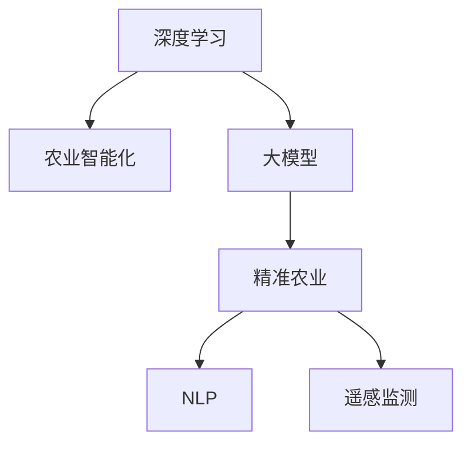

                 

# 全球脑与精准农业:AI辅助的高效农作物种植

## 1. 背景介绍

### 1.1 问题由来
农业作为人类最基本的生产活动之一，对于保障国家粮食安全、促进农村经济发展、提升农民生活水平具有重要意义。然而，传统农业模式普遍存在资源浪费、管理粗放、生产效率低下等问题，对环境和社会造成诸多负面影响。

近年来，随着人工智能技术的飞速发展，AI辅助精准农业应运而生。通过深度学习、计算机视觉、物联网等技术手段，AI辅助精准农业能够在不同层次上对农业生产进行智能化优化，包括土壤监测、病虫害防治、作物生长预测、智能灌溉、农机作业等。其中，基于大模型的AI辅助精准农业系统具有极强的语言理解和生成能力，能够有效实现农业场景的智能化决策和监控。

本文将详细介绍基于大模型的AI辅助精准农业系统的原理与实践，探讨其在全球范围内的应用前景。

### 1.2 问题核心关键点
AI辅助精准农业的核心在于利用人工智能技术对农业生产进行智能化优化，具体体现在以下几个方面：

- **智能化决策**：通过大模型对农业场景的语义理解，自动生成种植方案、病虫害防治策略、灌溉计划等。
- **实时监控**：利用计算机视觉和传感器技术，实时监测作物生长状态、土壤湿度、光照条件等，及时发现异常情况并采取相应措施。
- **自动化作业**：结合无人机、智能农机等设备，自动进行撒药、施肥、除草等作业，提高生产效率。
- **数据管理**：建立综合数据管理系统，收集和分析各类数据，实现农场管理的数字化和智能化。

## 2. 核心概念与联系

### 2.1 核心概念概述

为更好地理解基于大模型的AI辅助精准农业系统，本节将介绍几个密切相关的核心概念：

- **深度学习（Deep Learning）**：一类基于神经网络的学习方法，能够处理复杂非线性关系，广泛应用于图像识别、自然语言处理等领域。
- **农业智能化（Agricultural Intelligentization）**：利用AI技术对农业生产进行智能化管理和优化，提高生产效率和环境可持续性。
- **大模型（Large Model）**：指参数量极大、能够学习丰富语言知识和常识的深度学习模型，如BERT、GPT等。
- **精准农业（Precision Agriculture）**：以数据为基础，利用AI技术优化农业生产，实现资源的高效利用和环境友好型发展。
- **自然语言处理（NLP）**：使计算机能够理解、处理、生成人类语言的技术，是大模型在农业中的应用基础。
- **遥感监测（Remote Sensing）**：利用卫星、无人机等设备对农作物进行远距离监测，获取实时数据。

这些核心概念之间的逻辑关系可以通过以下Mermaid流程图来展示：



这个流程图展示了大模型与农业智能化的关系：深度学习使计算机能够理解人类语言，大模型则学习丰富的语言知识和常识，精准农业和遥感监测提供实时数据和场景信息，共同构成了基于大模型的AI辅助精准农业系统。

## 3. 核心算法原理 & 具体操作步骤
### 3.1 算法原理概述

基于大模型的AI辅助精准农业系统，本质上是一个基于自然语言处理的深度学习任务。其核心思想是：通过大模型对农业场景的语义理解，自动生成智能化决策，从而实现精准农业的目标。

形式化地，假设大模型为 $M_{\theta}$，其中 $\theta$ 为模型参数。给定农业场景的描述 $S$ 和目标任务 $T$，AI辅助精准农业系统的目标是最小化模型预测结果与实际结果之间的差异，即：

$$
\hat{\theta}=\mathop{\arg\min}_{\theta} \mathcal{L}(M_{\theta}, S, T)
$$

其中 $\mathcal{L}$ 为针对任务 $T$ 设计的损失函数，用于衡量模型预测输出与真实结果之间的差异。常见的损失函数包括交叉熵损失、均方误差损失等。

通过梯度下降等优化算法，系统不断更新模型参数 $\theta$，最小化损失函数 $\mathcal{L}$，使得模型输出逼近真实结果。由于 $\theta$ 已经通过预训练获得了较强的语言理解和生成能力，因此即便在农业场景中，也能较快收敛到理想的模型参数 $\hat{\theta}$。

### 3.2 算法步骤详解

基于大模型的AI辅助精准农业系统的一般流程如下：

**Step 1: 数据收集与预处理**
- 收集农业场景的各类数据，包括土壤类型、气候条件、作物生长状态等。
- 通过传感器、无人机等设备获取实时监测数据，如土壤湿度、温度、光照强度等。
- 对数据进行清洗、标注，构建训练集和验证集。

**Step 2: 选择和训练大模型**
- 选择合适的预训练语言模型 $M_{\theta}$ 作为初始化参数，如 BERT、GPT等。
- 在农业领域语料上进行微调，训练模型对农业场景的语义理解能力。

**Step 3: 定义任务与损失函数**
- 根据农业任务需求，定义模型预测目标。如农作物病虫害识别、生长状态预测、灌溉计划生成等。
- 选择合适的损失函数，如交叉熵损失、均方误差损失等。

**Step 4: 执行模型训练与优化**
- 将训练集数据分批次输入模型，前向传播计算损失函数。
- 反向传播计算参数梯度，根据设定的优化算法和学习率更新模型参数。
- 周期性在验证集上评估模型性能，根据性能指标决定是否触发 Early Stopping。
- 重复上述步骤直到满足预设的迭代轮数或 Early Stopping 条件。

**Step 5: 应用与优化**
- 将训练好的模型应用于实际的农业场景，实时生成智能化决策。
- 结合传感器数据和用户反馈，持续优化模型预测结果。

以上是基于大模型的AI辅助精准农业系统的一般流程。在实际应用中，还需要针对具体任务的特点，对系统各个环节进行优化设计，如改进损失函数、引入更多正则化技术、搜索最优的超参数组合等，以进一步提升系统性能。

### 3.3 算法优缺点

基于大模型的AI辅助精准农业系统具有以下优点：
1. 自动化决策。通过大模型对农业场景的语义理解，自动生成智能化决策，减少人为干预。
2. 实时监控。利用传感器和计算机视觉技术，实时监测农业生产状态，及时发现异常情况。
3. 效率提升。结合智能农机等设备，自动完成农作作业，提高生产效率。
4. 数据驱动。结合各类传感器数据，实现数据驱动的农业生产管理，提升资源利用效率。

同时，该系统也存在一定的局限性：
1. 对数据依赖性强。模型的效果很大程度上取决于农业场景数据的质量和数量，获取高质量农业数据需要投入较多时间和成本。
2. 场景限制。大模型的泛化能力在特定农业场景中可能无法发挥至极致，需要针对不同区域和作物进行模型微调。
3. 模型训练复杂。大规模模型的训练需要强大的算力和计算资源，一般需要专业团队进行开发和维护。
4. 模型解释性差。大模型的决策过程通常缺乏可解释性，难以对其推理逻辑进行分析和调试。

尽管存在这些局限性，但就目前而言，基于大模型的AI辅助精准农业系统仍然是农业智能化进程中的重要工具。未来相关研究的重点在于如何进一步降低对农业数据的依赖，提高模型的跨场景迁移能力，同时兼顾可解释性和伦理安全性等因素。

### 3.4 算法应用领域

基于大模型的AI辅助精准农业系统已经在多个领域得到广泛应用，具体如下：

- **农作物病虫害防治**：通过实时监测和数据分析，自动生成病虫害防治方案，减少农药使用量，提升防治效果。
- **作物生长预测**：利用传感器数据和大模型预测作物生长状态，及时调整种植方案，优化资源配置。
- **智能灌溉**：结合土壤湿度数据和气象信息，自动生成灌溉计划，实现水资源的高效利用。
- **农机作业优化**：利用无人机和智能农机，自动完成撒药、施肥、除草等作业，提高作业效率和精度。
- **农场管理**：通过综合数据管理系统，实现农场运营的数字化管理，提升管理水平。

除了上述这些经典应用外，AI辅助精准农业系统还被创新性地应用于农业机器人、农业物联网等领域，为农业生产智能化、信息化提供了新的技术路径。

## 4. 数学模型和公式 & 详细讲解 & 举例说明
### 4.1 数学模型构建

本节将使用数学语言对基于大模型的AI辅助精准农业系统进行更加严格的刻画。

记农业场景描述为 $S$，目标任务为 $T$，预训练语言模型为 $M_{\theta}$，其中 $\theta$ 为模型参数。定义模型 $M_{\theta}$ 在农业场景 $S$ 上的损失函数为 $\ell(M_{\theta}, S, T)$，则在农业场景和任务 $T$ 的组合数据集 $D=\{(S_i, T_i)\}_{i=1}^N$ 上的经验风险为：

$$
\mathcal{L}(\theta) = \frac{1}{N} \sum_{i=1}^N \ell(M_{\theta}(S_i), T_i)
$$

微调的目标是最小化经验风险，即找到最优参数：

$$
\theta^* = \mathop{\arg\min}_{\theta} \mathcal{L}(\theta)
$$

在实践中，我们通常使用基于梯度的优化算法（如SGD、Adam等）来近似求解上述最优化问题。设 $\eta$ 为学习率，$\lambda$ 为正则化系数，则参数的更新公式为：

$$
\theta \leftarrow \theta - \eta \nabla_{\theta}\mathcal{L}(\theta) - \eta\lambda\theta
$$

其中 $\nabla_{\theta}\mathcal{L}(\theta)$ 为损失函数对参数 $\theta$ 的梯度，可通过反向传播算法高效计算。

### 4.2 公式推导过程

以下我们以农作物病虫害识别为例，推导交叉熵损失函数及其梯度的计算公式。

假设模型 $M_{\theta}$ 在农业场景描述 $S$ 上的输出为 $\hat{y}=M_{\theta}(S) \in [0,1]$，表示模型预测作物是否存在病虫害的概率。真实标签 $T \in \{0,1\}$。则二分类交叉熵损失函数定义为：

$$
\ell(M_{\theta}(S),T) = -[T\log \hat{y} + (1-T)\log (1-\hat{y})]
$$

将其代入经验风险公式，得：

$$
\mathcal{L}(\theta) = -\frac{1}{N}\sum_{i=1}^N [T_i\log M_{\theta}(S_i)+(1-T_i)\log(1-M_{\theta}(S_i))]
$$

根据链式法则，损失函数对参数 $\theta_k$ 的梯度为：

$$
\frac{\partial \mathcal{L}(\theta)}{\partial \theta_k} = -\frac{1}{N}\sum_{i=1}^N (\frac{T_i}{M_{\theta}(S_i)}-\frac{1-T_i}{1-M_{\theta}(S_i)}) \frac{\partial M_{\theta}(S_i)}{\partial \theta_k}
$$

其中 $\frac{\partial M_{\theta}(S_i)}{\partial \theta_k}$ 可进一步递归展开，利用自动微分技术完成计算。

在得到损失函数的梯度后，即可带入参数更新公式，完成模型的迭代优化。重复上述过程直至收敛，最终得到适应农业场景的农作物病虫害识别模型。

## 5. 项目实践：代码实例和详细解释说明
### 5.1 开发环境搭建

在进行农业智能化系统开发前，我们需要准备好开发环境。以下是使用Python进行PyTorch开发的环境配置流程：

1. 安装Anaconda：从官网下载并安装Anaconda，用于创建独立的Python环境。

2. 创建并激活虚拟环境：
```bash
conda create -n pytorch-env python=3.8 
conda activate pytorch-env
```

3. 安装PyTorch：根据CUDA版本，从官网获取对应的安装命令。例如：
```bash
conda install pytorch torchvision torchaudio cudatoolkit=11.1 -c pytorch -c conda-forge
```

4. 安装Transformer库：
```bash
pip install transformers
```

5. 安装各类工具包：
```bash
pip install numpy pandas scikit-learn matplotlib tqdm jupyter notebook ipython
```

完成上述步骤后，即可在`pytorch-env`环境中开始农业智能化系统的开发。

### 5.2 源代码详细实现

下面我们以农作物病虫害识别任务为例，给出使用Transformers库对BERT模型进行微调的PyTorch代码实现。

首先，定义农作物病虫害识别任务的数据处理函数：

```python
from transformers import BertTokenizer
from torch.utils.data import Dataset
import torch

class PestDiseaseDataset(Dataset):
    def __init__(self, texts, tags, tokenizer, max_len=128):
        self.texts = texts
        self.tags = tags
        self.tokenizer = tokenizer
        self.max_len = max_len
        
    def __len__(self):
        return len(self.texts)
    
    def __getitem__(self, item):
        text = self.texts[item]
        tags = self.tags[item]
        
        encoding = self.tokenizer(text, return_tensors='pt', max_length=self.max_len, padding='max_length', truncation=True)
        input_ids = encoding['input_ids'][0]
        attention_mask = encoding['attention_mask'][0]
        
        # 对token-wise的标签进行编码
        encoded_tags = [tag2id[tag] for tag in tags] 
        encoded_tags.extend([tag2id['O']] * (self.max_len - len(encoded_tags)))
        labels = torch.tensor(encoded_tags, dtype=torch.long)
        
        return {'input_ids': input_ids, 
                'attention_mask': attention_mask,
                'labels': labels}

# 标签与id的映射
tag2id = {'O': 0, 'Pest': 1, 'Disease': 2}
id2tag = {v: k for k, v in tag2id.items()}

# 创建dataset
tokenizer = BertTokenizer.from_pretrained('bert-base-cased')

train_dataset = PestDiseaseDataset(train_texts, train_tags, tokenizer)
dev_dataset = PestDiseaseDataset(dev_texts, dev_tags, tokenizer)
test_dataset = PestDiseaseDataset(test_texts, test_tags, tokenizer)
```

然后，定义模型和优化器：

```python
from transformers import BertForTokenClassification, AdamW

model = BertForTokenClassification.from_pretrained('bert-base-cased', num_labels=len(tag2id))

optimizer = AdamW(model.parameters(), lr=2e-5)
```

接着，定义训练和评估函数：

```python
from torch.utils.data import DataLoader
from tqdm import tqdm
from sklearn.metrics import classification_report

device = torch.device('cuda') if torch.cuda.is_available() else torch.device('cpu')
model.to(device)

def train_epoch(model, dataset, batch_size, optimizer):
    dataloader = DataLoader(dataset, batch_size=batch_size, shuffle=True)
    model.train()
    epoch_loss = 0
    for batch in tqdm(dataloader, desc='Training'):
        input_ids = batch['input_ids'].to(device)
        attention_mask = batch['attention_mask'].to(device)
        labels = batch['labels'].to(device)
        model.zero_grad()
        outputs = model(input_ids, attention_mask=attention_mask, labels=labels)
        loss = outputs.loss
        epoch_loss += loss.item()
        loss.backward()
        optimizer.step()
    return epoch_loss / len(dataloader)

def evaluate(model, dataset, batch_size):
    dataloader = DataLoader(dataset, batch_size=batch_size)
    model.eval()
    preds, labels = [], []
    with torch.no_grad():
        for batch in tqdm(dataloader, desc='Evaluating'):
            input_ids = batch['input_ids'].to(device)
            attention_mask = batch['attention_mask'].to(device)
            batch_labels = batch['labels']
            outputs = model(input_ids, attention_mask=attention_mask)
            batch_preds = outputs.logits.argmax(dim=2).to('cpu').tolist()
            batch_labels = batch_labels.to('cpu').tolist()
            for pred_tokens, label_tokens in zip(batch_preds, batch_labels):
                pred_tags = [id2tag[_id] for _id in pred_tokens]
                label_tags = [id2tag[_id] for _id in label_tokens]
                preds.append(pred_tags[:len(label_tags)])
                labels.append(label_tags)
                
    print(classification_report(labels, preds))
```

最后，启动训练流程并在测试集上评估：

```python
epochs = 5
batch_size = 16

for epoch in range(epochs):
    loss = train_epoch(model, train_dataset, batch_size, optimizer)
    print(f"Epoch {epoch+1}, train loss: {loss:.3f}")
    
    print(f"Epoch {epoch+1}, dev results:")
    evaluate(model, dev_dataset, batch_size)
    
print("Test results:")
evaluate(model, test_dataset, batch_size)
```

以上就是使用PyTorch对BERT进行农作物病虫害识别任务微调的完整代码实现。可以看到，得益于Transformers库的强大封装，我们可以用相对简洁的代码完成BERT模型的加载和微调。

### 5.3 代码解读与分析

让我们再详细解读一下关键代码的实现细节：

**PestDiseaseDataset类**：
- `__init__`方法：初始化文本、标签、分词器等关键组件。
- `__len__`方法：返回数据集的样本数量。
- `__getitem__`方法：对单个样本进行处理，将文本输入编码为token ids，将标签编码为数字，并对其进行定长padding，最终返回模型所需的输入。

**tag2id和id2tag字典**：
- 定义了标签与数字id之间的映射关系，用于将token-wise的预测结果解码回真实的标签。

**训练和评估函数**：
- 使用PyTorch的DataLoader对数据集进行批次化加载，供模型训练和推理使用。
- 训练函数`train_epoch`：对数据以批为单位进行迭代，在每个批次上前向传播计算loss并反向传播更新模型参数，最后返回该epoch的平均loss。
- 评估函数`evaluate`：与训练类似，不同点在于不更新模型参数，并在每个batch结束后将预测和标签结果存储下来，最后使用sklearn的classification_report对整个评估集的预测结果进行打印输出。

**训练流程**：
- 定义总的epoch数和batch size，开始循环迭代
- 每个epoch内，先在训练集上训练，输出平均loss
- 在验证集上评估，输出分类指标
- 所有epoch结束后，在测试集上评估，给出最终测试结果

可以看到，PyTorch配合Transformers库使得BERT微调的代码实现变得简洁高效。开发者可以将更多精力放在数据处理、模型改进等高层逻辑上，而不必过多关注底层的实现细节。

当然，工业级的系统实现还需考虑更多因素，如模型的保存和部署、超参数的自动搜索、更灵活的任务适配层等。但核心的微调范式基本与此类似。

## 6. 实际应用场景
### 6.1 智能农场管理

基于大模型的AI辅助精准农业系统，可以广泛应用于智能农场管理中。传统的农场管理依赖人工操作，容易出现误差，且效率低下。而使用AI辅助精准农业系统，可以7x24小时不间断运行，实时监测和管理农场生产，提升农场管理的智能化水平。

在技术实现上，可以收集农场内的各类数据，如土壤湿度、温度、光照等，输入到微调后的AI模型中进行分析。模型根据实时数据生成智能化决策，如灌溉计划、施肥方案等，实时调整农场生产。系统还可以结合无人机、智能农机等设备，自动完成撒药、除草等作业，提高农场作业效率和精确度。

### 6.2 智能农机应用

AI辅助精准农业系统还可以应用于智能农机设备中，如智能拖拉机、智能收割机等。通过在农机上集成AI系统，可以实现自动导航、自动作业、自动避障等功能，提升农机设备的智能化水平。

具体而言，可以将农机的传感器数据输入到微调后的AI模型中进行处理，输出作业指令，如速度、方向、作业模式等。系统还可以实时监测农机状态，如油耗、温度、载荷等，及时发现异常情况并采取相应措施，避免设备损坏。同时，系统还可以根据农场生产数据，优化农机作业计划，提高作业效率和资源利用率。

### 6.3 智慧农业平台

基于大模型的AI辅助精准农业系统，可以构建智慧农业平台，实现农场运营的全流程数字化管理。平台集成各种传感器、监控设备、数据分析工具等，通过AI系统实时监测和管理农场生产，提供各类智能化决策支持。

智慧农业平台可以包含如下模块：
- 农场管理：收集农场各类数据，生成农场生产报告和分析报告，支持农场运营决策。
- 农业生产：根据农场生产数据，自动生成农作物病虫害防治、灌溉计划、施肥方案等。
- 智能农机：支持智能农机设备的集成和作业管理，提升农机作业效率和精确度。
- 数据可视化：提供各类数据图表、报告等可视化展示工具，方便农场管理者和决策者获取信息。
- 设备监控：实时监测农机状态，及时发现异常情况并采取相应措施，避免设备损坏。

通过智慧农业平台，可以实现农场生产的全流程数字化管理，提高农场运营的智能化水平和效率。

### 6.4 未来应用展望

随着大模型和AI辅助精准农业技术的不断发展，未来的农业智能化系统将呈现以下几个发展趋势：

1. **多模态融合**：未来的农业智能化系统将不仅仅是文本数据，而是将融合视觉、语音、图像等多种模态数据，实现更为全面和精细的农业场景理解。
2. **智能化决策**：AI辅助精准农业系统将不仅仅是对已有数据的分析，而是能主动学习和预测农业生产中的未知因素，提供更加智能化和个性化的决策支持。
3. **智能化农机**：未来的智能农机将不仅仅是自动化作业，而是能具备更强的自主导航、自主避障、自主决策等能力。
4. **智慧农业平台**：未来的智慧农业平台将不仅仅是农场管理，而是能涵盖全产业链的数字化管理，提供更广泛的智能化应用。
5. **环境友好型**：未来的农业智能化系统将更加注重环境保护，实现资源的高效利用和环境友好型发展。

以上趋势凸显了AI辅助精准农业技术的广阔前景。这些方向的探索发展，必将进一步提升农业生产的智能化水平，为农业生产和环境保护带来新的突破。

## 7. 工具和资源推荐
### 7.1 学习资源推荐

为了帮助开发者系统掌握AI辅助精准农业的理论基础和实践技巧，这里推荐一些优质的学习资源：

1. 《深度学习》系列书籍：深度学习领域经典书籍，涵盖深度学习基础、深度学习模型与应用等内容。
2. 《农业智能化》课程：斯坦福大学开设的农业智能化相关课程，涵盖各类农业智能化技术。
3. 《Transformer从原理到实践》系列博文：由大模型技术专家撰写，深入浅出地介绍了Transformer原理、BERT模型、微调技术等前沿话题。
4. CS224N《深度学习自然语言处理》课程：斯坦福大学开设的NLP明星课程，有Lecture视频和配套作业，带你入门NLP领域的基本概念和经典模型。
5. 《Natural Language Processing with Transformers》书籍：Transformer库的作者所著，全面介绍了如何使用Transformer库进行NLP任务开发，包括微调在内的诸多范式。
6. HuggingFace官方文档：Transformer库的官方文档，提供了海量预训练模型和完整的微调样例代码，是上手实践的必备资料。

通过对这些资源的学习实践，相信你一定能够快速掌握AI辅助精准农业的精髓，并用于解决实际的农业问题。
### 7.2 开发工具推荐

高效的开发离不开优秀的工具支持。以下是几款用于AI辅助精准农业开发的常用工具：

1. PyTorch：基于Python的开源深度学习框架，灵活动态的计算图，适合快速迭代研究。大部分预训练语言模型都有PyTorch版本的实现。
2. TensorFlow：由Google主导开发的开源深度学习框架，生产部署方便，适合大规模工程应用。同样有丰富的预训练语言模型资源。
3. Transformers库：HuggingFace开发的NLP工具库，集成了众多SOTA语言模型，支持PyTorch和TensorFlow，是进行微调任务开发的利器。
4. Weights & Biases：模型训练的实验跟踪工具，可以记录和可视化模型训练过程中的各项指标，方便对比和调优。与主流深度学习框架无缝集成。
5. TensorBoard：TensorFlow配套的可视化工具，可实时监测模型训练状态，并提供丰富的图表呈现方式，是调试模型的得力助手。
6. Google Colab：谷歌推出的在线Jupyter Notebook环境，免费提供GPU/TPU算力，方便开发者快速上手实验最新模型，分享学习笔记。

合理利用这些工具，可以显著提升AI辅助精准农业系统的开发效率，加快创新迭代的步伐。

### 7.3 相关论文推荐

AI辅助精准农业的研究源于学界的持续研究。以下是几篇奠基性的相关论文，推荐阅读：

1. Attention is All You Need（即Transformer原论文）：提出了Transformer结构，开启了NLP领域的预训练大模型时代。
2. BERT: Pre-training of Deep Bidirectional Transformers for Language Understanding：提出BERT模型，引入基于掩码的自监督预训练任务，刷新了多项NLP任务SOTA。
3. Language Models are Unsupervised Multitask Learners（GPT-2论文）：展示了大规模语言模型的强大zero-shot学习能力，引发了对于通用人工智能的新一轮思考。
4. Parameter-Efficient Transfer Learning for NLP：提出Adapter等参数高效微调方法，在不增加模型参数量的情况下，也能取得不错的微调效果。
5. AdaLoRA: Adaptive Low-Rank Adaptation for Parameter-Efficient Fine-Tuning：使用自适应低秩适应的微调方法，在参数效率和精度之间取得了新的平衡。
6. Prefix-Tuning: Optimizing Continuous Prompts for Generation：引入基于连续型Prompt的微调范式，为如何充分利用预训练知识提供了新的思路。

这些论文代表了大模型和AI辅助精准农业技术的发展脉络。通过学习这些前沿成果，可以帮助研究者把握学科前进方向，激发更多的创新灵感。

## 8. 总结：未来发展趋势与挑战
### 8.1 总结

本文对基于大模型的AI辅助精准农业系统的原理与实践进行了全面系统的介绍。首先阐述了AI辅助精准农业的背景和意义，明确了AI辅助精准农业在农业智能化进程中的重要地位。其次，从原理到实践，详细讲解了AI辅助精准农业系统的数学模型和实现流程，给出了基于BERT的农作物病虫害识别任务的完整代码实现。同时，本文还广泛探讨了AI辅助精准农业系统在智能农场管理、智能农机应用、智慧农业平台等场景的应用前景，展示了其广阔的发展潜力。此外，本文精选了相关学习资源和开发工具，力求为读者提供全方位的技术指引。

通过本文的系统梳理，可以看到，基于大模型的AI辅助精准农业系统正在成为农业智能化进程中的重要工具，极大地提升了农业生产的智能化水平，推动了农业生产的转型升级。未来，伴随大模型和AI辅助精准农业技术的持续演进，相信AI辅助精准农业系统将在全球范围内广泛应用，为农业生产带来深远影响。

### 8.2 未来发展趋势

展望未来，AI辅助精准农业系统将呈现以下几个发展趋势：

1. **智能化决策**：未来的AI辅助精准农业系统将不仅仅是对已有数据的分析，而是能主动学习和预测农业生产中的未知因素，提供更加智能化和个性化的决策支持。
2. **多模态融合**：未来的AI辅助精准农业系统将不仅仅是对文本数据的分析，而是将融合视觉、语音、图像等多种模态数据，实现更为全面和精细的农业场景理解。
3. **智能化农机**：未来的智能农机将不仅仅是对农机设备的自动化控制，而是能具备更强的自主导航、自主避障、自主决策等能力。
4. **智慧农业平台**：未来的智慧农业平台将不仅仅是对农场管理的数字化管理，而是能涵盖全产业链的数字化管理，提供更广泛的智能化应用。
5. **环境友好型**：未来的农业智能化系统将更加注重环境保护，实现资源的高效利用和环境友好型发展。

以上趋势凸显了AI辅助精准农业技术的广阔前景。这些方向的探索发展，必将进一步提升农业生产的智能化水平，为农业生产和环境保护带来新的突破。

### 8.3 面临的挑战

尽管AI辅助精准农业系统已经取得了瞩目成就，但在迈向更加智能化、普适化应用的过程中，它仍面临着诸多挑战：

1. **对数据依赖性强**：AI辅助精准农业系统的效果很大程度上取决于农业场景数据的质量和数量，获取高质量农业数据需要投入较多时间和成本。如何进一步降低对农业数据的依赖，提高模型的跨场景迁移能力，是未来需要解决的重要问题。
2. **场景限制**：大模型的泛化能力在特定农业场景中可能无法发挥至极致，需要针对不同区域和作物进行模型微调。如何提高模型的泛化能力和迁移能力，是未来研究的重点。
3. **资源消耗大**：大规模模型的训练和推理需要强大的算力和计算资源，一般需要专业团队进行开发和维护。如何降低资源消耗，优化模型性能，是未来需要解决的实际问题。
4. **模型解释性差**：AI辅助精准农业系统中的大模型通常缺乏可解释性，难以对其推理逻辑进行分析和调试。如何提高模型的可解释性，是未来需要解决的重要问题。
5. **伦理和安全性**：AI辅助精准农业系统中的大模型可能学习到有害信息，影响农业生产的健康和安全。如何从数据和算法层面消除模型偏见，确保系统的伦理和安全性，是未来需要解决的重要问题。

尽管存在这些挑战，但就目前而言，基于大模型的AI辅助精准农业系统仍然是农业智能化进程中的重要工具。未来相关研究的重点在于如何进一步降低对农业数据的依赖，提高模型的泛化能力和迁移能力，同时兼顾可解释性和伦理安全性等因素。

### 8.4 研究展望

面对AI辅助精准农业系统所面临的挑战，未来的研究需要在以下几个方面寻求新的突破：

1. **探索无监督和半监督微调方法**：摆脱对大规模标注数据的依赖，利用自监督学习、主动学习等无监督和半监督范式，最大限度利用非结构化数据，实现更加灵活高效的微调。
2. **研究参数高效和计算高效的微调范式**：开发更加参数高效的微调方法，在固定大部分预训练参数的同时，只更新极少量的任务相关参数。同时优化微调模型的计算图，减少前向传播和反向传播的资源消耗，实现更加轻量级、实时性的部署。
3. **融合因果和对比学习范式**：通过引入因果推断和对比学习思想，增强AI辅助精准农业系统建立稳定因果关系的能力，学习更加普适、鲁棒的语言表征，从而提升模型泛化性和抗干扰能力。
4. **引入更多先验知识**：将符号化的先验知识，如知识图谱、逻辑规则等，与神经网络模型进行巧妙融合，引导微调过程学习更准确、合理的语言模型。同时加强不同模态数据的整合，实现视觉、语音等多模态信息与文本信息的协同建模。
5. **结合因果分析和博弈论工具**：将因果分析方法引入AI辅助精准农业系统，识别出模型决策的关键特征，增强输出解释的因果性和逻辑性。借助博弈论工具刻画人机交互过程，主动探索并规避模型的脆弱点，提高系统稳定性。
6. **纳入伦理道德约束**：在模型训练目标中引入伦理导向的评估指标，过滤和惩罚有偏见、有害的输出倾向。同时加强人工干预和审核，建立模型行为的监管机制，确保输出符合人类价值观和伦理道德。

这些研究方向的探索，必将引领AI辅助精准农业系统迈向更高的台阶，为构建安全、可靠、可解释、可控的智能系统铺平道路。面向未来，AI辅助精准农业系统还需要与其他人工智能技术进行更深入的融合，如知识表示、因果推理、强化学习等，多路径协同发力，共同推动农业智能化技术的发展。只有勇于创新、敢于突破，才能不断拓展农业智能化的边界，让智能技术更好地造福农业生产。

## 9. 附录：常见问题与解答

**Q1：AI辅助精准农业系统是否适用于所有农业场景？**

A: AI辅助精准农业系统在大多数农业场景上都能取得不错的效果，特别是对于数据量较小的任务。但对于一些特定领域的农业场景，如特种作物、精细园艺等，需要针对具体问题进行模型微调和优化。此外，对于农业生产过程中出现的复杂问题和异常情况，AI系统可能无法立即给出完美解决方案，仍需结合人工干预和经验判断。

**Q2：AI辅助精准农业系统的训练和优化有哪些关键步骤？**

A: AI辅助精准农业系统的训练和优化通常包括以下几个关键步骤：
1. 数据收集与预处理：收集农业场景的各类数据，清洗和标注数据，构建训练集和验证集。
2. 选择和训练大模型：选择合适的预训练语言模型，在农业领域语料上进行微调，训练模型对农业场景的语义理解能力。
3. 定义任务与损失函数：根据农业任务需求，定义模型预测目标，选择合适的损失函数。
4. 执行模型训练与优化：将训练集数据分批次输入模型，前向传播计算损失函数，反向传播更新模型参数，通过优化算法最小化损失函数。
5. 应用与优化：将训练好的模型应用于实际的农业场景，实时生成智能化决策，结合传感器数据和用户反馈，持续优化模型预测结果。

**Q3：AI辅助精准农业系统的应用场景有哪些？**

A: AI辅助精准农业系统的应用场景非常广泛，包括但不限于：
1. 农作物病虫害防治：通过实时监测和数据分析，自动生成病虫害防治方案，减少农药使用量，提升防治效果。
2. 作物生长预测：利用传感器数据和大模型预测作物生长状态，及时调整种植方案，优化资源配置。
3. 智能灌溉：结合土壤湿度数据和气象信息，自动生成灌溉计划，实现水资源的高效利用。
4. 智能农机应用：通过在农机上集成AI系统，实现自动导航、自动作业、自动避障等功能，提升农机设备的智能化水平。
5. 智慧农业平台：构建智慧农业平台，实现农场运营的全流程数字化管理，提供各类智能化决策支持。

**Q4：如何优化AI辅助精准农业系统的性能？**

A: 优化AI辅助精准农业系统的性能通常需要以下几个方面的努力：
1. 数据质量：确保农业场景数据的准确性和完备性，减少数据噪声和偏差。
2. 模型选择：选择合适的预训练语言模型，针对特定农业场景进行微调，提高模型的泛化能力。
3. 模型优化：通过调整超参数、正则化技术、数据增强等方法，优化模型的训练过程，提高模型的性能和泛化能力。
4. 应用优化：结合农业场景的具体需求，优化模型的预测目标和损失函数，提高模型的实际应用效果。
5. 持续优化：根据实际应用效果和反馈信息，持续优化模型，提升模型的稳定性和鲁棒性。

**Q5：AI辅助精准农业系统在未来有哪些发展趋势？**

A: AI辅助精准农业系统在未来将呈现以下几个发展趋势：
1. 多模态融合：未来的系统将不仅仅是文本数据，而是将融合视觉、语音、图像等多种模态数据，实现更为全面和精细的农业场景理解。
2. 智能化决策：未来的系统将不仅仅是对已有数据的分析，而是能主动学习和预测农业生产中的未知因素，提供更加智能化和个性化的决策支持。
3. 智能化农机：未来的智能农机将不仅仅是对农机设备的自动化控制，而是能具备更强的自主导航、自主避障、自主决策等能力。
4. 智慧农业平台：未来的智慧农业平台将不仅仅是对农场管理的数字化管理，而是能涵盖全产业链的数字化管理，提供更广泛的智能化应用。
5. 环境友好型：未来的农业智能化系统将更加注重环境保护，实现资源的高效利用和环境友好型发展。

这些趋势凸显了AI辅助精准农业技术的广阔前景。这些方向的探索发展，必将进一步提升农业生产的智能化水平，为农业生产和环境保护带来新的突破。

---

作者：禅与计算机程序设计艺术 / Zen and the Art of Computer Programming

