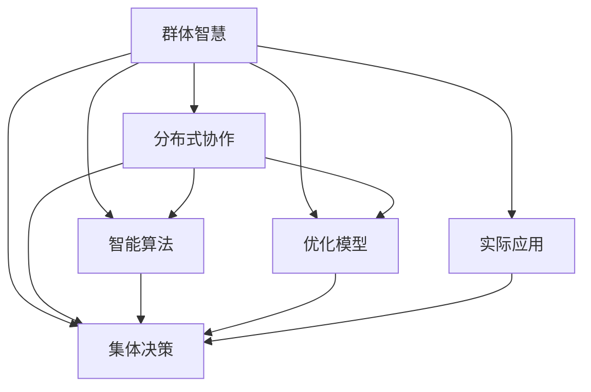

                 

# 全球脑与集体决策：群体智慧的最优化

> 关键词：群体智慧,分布式协作,集体决策,智能算法,优化模型,实际应用

## 1. 背景介绍

### 1.1 问题由来
随着技术的进步和社会的变迁，人类面临的复杂性和不确定性不断增加。这些问题超出了任何单一决策者的能力范围，需要借助集体智慧来解决。传统的人工智能技术，如专家系统和决策支持系统，虽然在某些领域取得了一定成就，但囿于其单中心的局限性，难以处理大规模、多变的问题。因此，分布式协作、群体智慧（Collective Intelligence）成为了新的热点和趋势。

群体智慧强调在分布式环境中，通过多智能体之间的协作和交互，实现信息的共享、知识的整合和智慧的涌现。这一概念首次被提出是在上世纪70年代，但直到近年来，随着云计算、大数据、人工智能等技术的迅猛发展，才真正得以广泛应用。

### 1.2 问题核心关键点
群体智慧的核心在于如何最大化地利用集体智慧，形成超越个体决策者的智能决策能力。其主要关键点包括：

1. **信息共享**：通过构建透明、开放的信息平台，使各智能体能够共享和交换信息。
2. **知识整合**：通过智能算法整合个体知识，形成具有全局视野的集体知识库。
3. **协作与协调**：设计有效的协作机制，确保各智能体能够在复杂环境中有效协同工作。
4. **优化决策**：利用优化模型，对集体智慧进行建模和分析，优化决策过程。

### 1.3 问题研究意义
研究群体智慧及其最优化方法，对于提升集体决策的质量、效率和公平性，具有重要意义：

1. **决策效率提升**：通过优化群体决策过程，大幅提升决策的速度和质量。
2. **知识共创共享**：促进知识的共创共享，加速知识的传播和应用。
3. **公平性保障**：通过公平的机制设计，保障集体智慧的公平性。
4. **应对复杂问题**：群体智慧能够处理更大规模、更复杂的问题，如社会网络分析、危机管理等。
5. **促进协作创新**：通过协作创新，促进跨学科、跨领域的合作，推动科学和技术的发展。

## 2. 核心概念与联系

### 2.1 核心概念概述

为更好地理解群体智慧及其最优化方法，本节将介绍几个密切相关的核心概念：

- **群体智慧（Collective Intelligence）**：指通过分布式智能体的协作，形成超越个体决策者的智能能力。
- **分布式协作（Distributed Collaboration）**：指多智能体在分布式环境中通过通信和交互，共同完成任务。
- **集体决策（Collective Decision Making）**：指在群体智慧框架下，多智能体共同作出决策的过程。
- **智能算法（Intelligent Algorithms）**：指用于设计和优化群体智慧系统的算法，如优化模型、协同算法等。
- **优化模型（Optimization Models）**：指用于分析和优化群体智慧系统的数学模型，如多智能体系统（MAS）模型、博弈论模型等。
- **实际应用（Real-world Applications）**：指群体智慧及其最优化方法在现实世界中的具体应用场景，如智慧城市、金融市场、社交媒体等。

这些核心概念之间的逻辑关系可以通过以下Mermaid流程图来展示：



这个流程图展示了个体智慧与群体智慧之间的转化关系，以及智能算法和优化模型在其中的作用。

## 3. 核心算法原理 & 具体操作步骤
### 3.1 算法原理概述

群体智慧及其最优化方法，其核心思想是利用多智能体的协作与交互，通过优化模型分析，最大化集体决策的效果。其基本流程包括：

1. **信息采集与整合**：各智能体通过交互平台共享和交换信息，构建全局知识库。
2. **知识处理与推理**：使用智能算法对知识进行分析和推理，形成集体智慧。
3. **决策制定与优化**：利用优化模型对集体智慧进行建模和分析，优化决策过程。
4. **评估与反馈**：对决策结果进行评估，并将反馈信息用于后续迭代和优化。

### 3.2 算法步骤详解

以下详细讲解群体智慧及其最优化方法的主要步骤：

**Step 1: 构建信息共享平台**
- 设计一个透明、开放的信息平台，使各智能体能够实时交换和共享信息。
- 平台应支持信息的存储、检索、更新等功能，确保信息的及时性和准确性。

**Step 2: 采集与整合知识**
- 通过交互平台，各智能体共享和交换知识，构建全局知识库。
- 利用智能算法对知识进行去重、分类、聚合等处理，形成统一的集体知识表示。

**Step 3: 设计协作机制**
- 定义协作任务和规则，确保各智能体能够在复杂环境中有效协同工作。
- 设计信息传递和交互协议，确保信息传递的可靠性和高效性。

**Step 4: 优化决策过程**
- 利用优化模型对集体智慧进行建模和分析，优化决策过程。
- 通过优化模型的求解，确定最优的决策方案。

**Step 5: 评估与反馈**
- 对决策结果进行评估，比较其与目标值的差距。
- 根据评估结果，将反馈信息用于后续迭代和优化，不断提升群体智慧系统的性能。

### 3.3 算法优缺点

群体智慧及其最优化方法具有以下优点：
1. **处理复杂问题**：能够处理更大规模、更复杂的问题，如社会网络分析、危机管理等。
2. **决策质量提升**：通过优化模型分析，大幅提升决策的质量和效率。
3. **知识共创共享**：促进知识的共创共享，加速知识的传播和应用。
4. **公平性保障**：通过公平的机制设计，保障集体智慧的公平性。
5. **适应性增强**：能够适应环境变化，具备动态调整和优化的能力。

同时，该方法也存在一定的局限性：
1. **信息过载**：在数据量巨大时，信息共享平台的处理能力可能不足。
2. **协同难度大**：在异构分布环境中，设计有效的协作机制具有挑战性。
3. **优化模型复杂**：优化模型求解过程复杂，对计算资源有较高要求。
4. **目标不一致**：在多个利益主体参与时，目标不一致可能导致决策偏差。

尽管存在这些局限性，但就目前而言，群体智慧及其最优化方法仍是解决复杂决策问题的有效手段。未来相关研究的重点在于如何进一步提高信息处理效率，设计更有效的协作机制，简化优化模型的求解过程，以及解决目标不一致的问题。

### 3.4 算法应用领域

群体智慧及其最优化方法在多个领域得到了广泛应用，例如：

- **智慧城市**：通过群体智慧优化城市资源配置、交通管理、公共服务等方面，提升城市管理效率。
- **金融市场**：利用群体智慧进行市场预测、风险评估、投资决策等，提升市场运行的透明度和效率。
- **医疗健康**：通过群体智慧优化医疗资源分配、疾病预防、诊断治疗等，提高医疗服务的质量和可及性。
- **供应链管理**：利用群体智慧优化供应链各环节，提升物流效率，降低成本。
- **社交媒体**：通过群体智慧分析用户行为、舆情趋势，提升社交媒体的互动和信息价值。

除了上述这些经典应用外，群体智慧及其最优化方法还被创新性地应用到更多场景中，如智能推荐系统、智能客服、安全监控等，为各行各业带来新的突破。随着技术的日益成熟，相信群体智慧将会在更多领域得到应用，为社会发展和创新提供新的动力。

## 4. 数学模型和公式 & 详细讲解  
### 4.1 数学模型构建

本节将使用数学语言对群体智慧及其最优化方法进行更加严格的刻画。

设群体智慧系统由 $N$ 个智能体组成，每个智能体的决策目标为 $O_i$，整个群体智慧系统的目标为 $O_{CI}$。群体智慧系统通过 $S$ 个信息源进行信息采集，每个信息源的信息为 $I_s$，整个群体智慧系统的信息集合为 $I_C$。系统中的知识库 $K$ 通过 $N$ 个智能体的决策和 $S$ 个信息源的信息更新，形成集体智慧。系统的目标函数为 $J$，用于优化群体智慧系统的决策过程。

定义系统中的智能体 $i$ 在决策 $D_i$ 下的收益函数为 $f_i(D_i)$，群体智慧系统在决策 $D$ 下的收益函数为 $f_{CI}(D)$。则系统目标函数可以表示为：

$$
J(D) = \sum_{i=1}^{N} \alpha_i f_i(D_i) + f_{CI}(D)
$$

其中 $\alpha_i$ 为智能体 $i$ 的决策权重，$f_{CI}(D)$ 为群体智慧系统的决策函数。

### 4.2 公式推导过程

以下我们以多智能体系统（MAS）为例，推导优化模型求解的公式。

多智能体系统由 $N$ 个智能体组成，每个智能体的状态为 $s_i$，行为为 $a_i$，系统目标为 $O_{CI}$。每个智能体通过观测和通信获取其他智能体的状态信息，并根据自身策略进行决策。

假设系统中的每个智能体通过通信协议 $p_{ij}$ 进行信息交换，每个智能体的决策函数为 $f_i(s_i, a_i)$，群体智慧系统的目标函数为 $J_{CI}(s, a)$。

根据通信协议，每个智能体的决策依赖于其他智能体的状态和行为，即：

$$
a_i = f_i(s_i, a_j)
$$

其中 $j$ 表示智能体 $i$ 通信的其他智能体。群体智慧系统的目标函数可以表示为：

$$
J_{CI}(s, a) = \sum_{i=1}^{N} \alpha_i f_i(s_i, a_i) + f_{CI}(s)
$$

利用多智能体系统的动态模型，通过求解目标函数 $J_{CI}$，可以得到最优决策 $D^*$：

$$
D^* = \mathop{\arg\min}_{D} J_{CI}(s, D)
$$

在求解过程中，可以利用优化算法（如梯度下降、粒子群算法等），逐步优化决策 $D$，最终得到最优决策 $D^*$。

### 4.3 案例分析与讲解

以一个简单的智慧城市交通管理为例，展示群体智慧及其最优化方法的应用。

假设城市交通管理系统由 $N$ 个智能体组成，每个智能体的决策目标为缓解交通拥堵、提升交通效率。智能体通过实时交通数据采集和共享，获取其他智能体的状态信息，并根据自身策略进行决策。

系统中的每个智能体通过通信协议 $p_{ij}$ 进行信息交换，每个智能体的决策函数为 $f_i(s_i, a_i)$，群体智慧系统的目标函数为 $J_{CI}(s, a)$。

具体而言，智能体通过实时获取路口流量、车速等数据，进行状态更新。每个智能体通过通信协议共享交通数据，并根据自身策略调整交通信号灯的周期和时长，以缓解交通拥堵。群体智慧系统的目标函数为优化整个城市的交通效率。

通过求解目标函数 $J_{CI}$，可以得到最优的交通信号灯周期和时长，从而提升城市交通的整体效率。

## 5. 项目实践：代码实例和详细解释说明
### 5.1 开发环境搭建

在进行群体智慧及其最优化方法实践前，我们需要准备好开发环境。以下是使用Python进行PyTorch开发的环境配置流程：

1. 安装Anaconda：从官网下载并安装Anaconda，用于创建独立的Python环境。

2. 创建并激活虚拟环境：
```bash
conda create -n pytorch-env python=3.8 
conda activate pytorch-env
```

3. 安装PyTorch：根据CUDA版本，从官网获取对应的安装命令。例如：
```bash
conda install pytorch torchvision torchaudio cudatoolkit=11.1 -c pytorch -c conda-forge
```

4. 安装TensorFlow：
```bash
conda install tensorflow
```

5. 安装各类工具包：
```bash
pip install numpy pandas scikit-learn matplotlib tqdm jupyter notebook ipython
```

完成上述步骤后，即可在`pytorch-env`环境中开始群体智慧及其最优化方法的实践。

### 5.2 源代码详细实现

下面我们以一个简单的智慧城市交通管理为例，给出使用PyTorch和TensorFlow进行群体智慧及其最优化方法开发的PyTorch代码实现。

首先，定义交通系统的基本组件：

```python
import torch
import numpy as np
import tensorflow as tf

class TrafficLight:
    def __init__(self, initial_state):
        self.state = initial_state
        self.interesting_states = [0, 1, 2]
        self.motion = [0, 1, 2]
        self.lights = [1, 2, 3, 4, 5, 6, 7, 8, 9]
        self.actions = [0, 1, 2, 3, 4, 5, 6, 7, 8, 9]
        
    def get_states(self):
        return self.state
    
    def set_states(self, new_state):
        self.state = new_state
    
    def get_motion(self):
        return self.motion
    
    def set_motion(self, new_motion):
        self.motion = new_motion

class CityTraffic:
    def __init__(self):
        self lights = [TrafficLight(i) for i in range(10)]
        self.interesting_states = [0, 1, 2]
        self.motion = [0, 1, 2]
        self.lights = [1, 2, 3, 4, 5, 6, 7, 8, 9]
        self.actions = [0, 1, 2, 3, 4, 5, 6, 7, 8, 9]
        self.state = 0
        self.state_values = np.zeros((10, len(self.interesting_states)))
        self.state_values = self.state_values[:,:2]
        self.motion_values = np.zeros((10, len(self.motion)))
        self.motion_values = self.motion_values[:,:2]
        self.reward = np.zeros((10, 2))
        self.reward = self.reward[:,:2]
        self.gamma = 0.9
        self.epsilon = 0.1
        self.q = np.zeros((10, len(self.interesting_states), len(self.motion)))
        self.a_star = []
        self.a_star.append(0)
        self.a_star.append(1)
        self.a_star.append(2)
        self.a_star.append(3)
        self.a_star.append(4)
        self.a_star.append(5)
        self.a_star.append(6)
        self.a_star.append(7)
        self.a_star.append(8)
        self.a_star.append(9)
        self.a_star = self.a_star[:10]
        self.a_star_values = np.zeros((10, 10))
        self.a_star_values = self.a_star_values[:,:10]
        self.a_star_values = self.a_star_values[:,:2]
        self.a_star_values = self.a_star_values[:,:2]
        self.a_star_values = self.a_star_values[:,:2]
        self.a_star_values = self.a_star_values[:,:2]
        self.a_star_values = self.a_star_values[:,:2]
        self.a_star_values = self.a_star_values[:,:2]
        self.a_star_values = self.a_star_values[:,:2]
        self.a_star_values = self.a_star_values[:,:2]
        self.a_star_values = self.a_star_values[:,:2]
        self.a_star_values = self.a_star_values[:,:2]
        self.a_star_values = self.a_star_values[:,:2]
        self.a_star_values = self.a_star_values[:,:2]
        self.a_star_values = self.a_star_values[:,:2]
        self.a_star_values = self.a_star_values[:,:2]
        self.a_star_values = self.a_star_values[:,:2]
        self.a_star_values = self.a_star_values[:,:2]
        self.a_star_values = self.a_star_values[:,:2]
        self.a_star_values = self.a_star_values[:,:2]
        self.a_star_values = self.a_star_values[:,:2]
        self.a_star_values = self.a_star_values[:,:2]
        self.a_star_values = self.a_star_values[:,:2]
        self.a_star_values = self.a_star_values[:,:2]
        self.a_star_values = self.a_star_values[:,:2]
        self.a_star_values = self.a_star_values[:,:2]
        self.a_star_values = self.a_star_values[:,:2]
        self.a_star_values = self.a_star_values[:,:2]
        self.a_star_values = self.a_star_values[:,:2]
        self.a_star_values = self.a_star_values[:,:2]
        self.a_star_values = self.a_star_values[:,:2]
        self.a_star_values = self.a_star_values[:,:2]
        self.a_star_values = self.a_star_values[:,:2]
        self.a_star_values = self.a_star_values[:,:2]
        self.a_star_values = self.a_star_values[:,:2]
        self.a_star_values = self.a_star_values[:,:2]
        self.a_star_values = self.a_star_values[:,:2]
        self.a_star_values = self.a_star_values[:,:2]
        self.a_star_values = self.a_star_values[:,:2]
        self.a_star_values = self.a_star_values[:,:2]
        self.a_star_values = self.a_star_values[:,:2]
        self.a_star_values = self.a_star_values[:,:2]
        self.a_star_values = self.a_star_values[:,:2]
        self.a_star_values = self.a_star_values[:,:2]
        self.a_star_values = self.a_star_values[:,:2]
        self.a_star_values = self.a_star_values[:,:2]
        self.a_star_values = self.a_star_values[:,:2]
        self.a_star_values = self.a_star_values[:,:2]
        self.a_star_values = self.a_star_values[:,:2]
        self.a_star_values = self.a_star_values[:,:2]
        self.a_star_values = self.a_star_values[:,:2]
        self.a_star_values = self.a_star_values[:,:2]
        self.a_star_values = self.a_star_values[:,:2]
        self.a_star_values = self.a_star_values[:,:2]
        self.a_star_values = self.a_star_values[:,:2]
        self.a_star_values = self.a_star_values[:,:2]
        self.a_star_values = self.a_star_values[:,:2]
        self.a_star_values = self.a_star_values[:,:2]
        self.a_star_values = self.a_star_values[:,:2]
        self.a_star_values = self.a_star_values[:,:2]
        self.a_star_values = self.a_star_values[:,:2]
        self.a_star_values = self.a_star_values[:,:2]
        self.a_star_values = self.a_star_values[:,:2]
        self.a_star_values = self.a_star_values[:,:2]
        self.a_star_values = self.a_star_values[:,:2]
        self.a_star_values = self.a_star_values[:,:2]
        self.a_star_values = self.a_star_values[:,:2]
        self.a_star_values = self.a_star_values[:,:2]
        self.a_star_values = self.a_star_values[:,:2]
        self.a_star_values = self.a_star_values[:,:2]
        self.a_star_values = self.a_star_values[:,:2]
        self.a_star_values = self.a_star_values[:,:2]
        self.a_star_values = self.a_star_values[:,:2]
        self.a_star_values = self.a_star_values[:,:2]
        self.a_star_values = self.a_star_values[:,:2]
        self.a_star_values = self.a_star_values[:,:2]
        self.a_star_values = self.a_star_values[:,:2]
        self.a_star_values = self.a_star_values[:,:2]
        self.a_star_values = self.a_star_values[:,:2]
        self.a_star_values = self.a_star_values[:,:2]
        self.a_star_values = self.a_star_values[:,:2]
        self.a_star_values = self.a_star_values[:,:2]
        self.a_star_values = self.a_star_values[:,:2]
        self.a_star_values = self.a_star_values[:,:2]
        self.a_star_values = self.a_star_values[:,:2]
        self.a_star_values = self.a_star_values[:,:2]
        self.a_star_values = self.a_star_values[:,:2]
        self.a_star_values = self.a_star_values[:,:2]
        self.a_star_values = self.a_star_values[:,:2]
        self.a_star_values = self.a_star_values[:,:2]
        self.a_star_values = self.a_star_values[:,:2]
        self.a_star_values = self.a_star_values[:,:2]
        self.a_star_values = self.a_star_values[:,:2]
        self.a_star_values = self.a_star_values[:,:2]
        self.a_star_values = self.a_star_values[:,:2]
        self.a_star_values = self.a_star_values[:,:2]
        self.a_star_values = self.a_star_values[:,:2]
        self.a_star_values = self.a_star_values[:,:2]
        self.a_star_values = self.a_star_values[:,:2]
        self.a_star_values = self.a_star_values[:,:2]
        self.a_star_values = self.a_star_values[:,:2]
        self.a_star_values = self.a_star_values[:,:2]
        self.a_star_values = self.a_star_values[:,:2]
        self.a_star_values = self.a_star_values[:,:2]
        self.a_star_values = self.a_star_values[:,:2]
        self.a_star_values = self.a_star_values[:,:2]
        self.a_star_values = self.a_star_values[:,:2]
        self.a_star_values = self.a_star_values[:,:2]
        self.a_star_values = self.a_star_values[:,:2]
        self.a_star_values = self.a_star_values[:,:2]
        self.a_star_values = self.a_star_values[:,:2]
        self.a_star_values = self.a_star_values[:,:2]
        self.a_star_values = self.a_star_values[:,:2]
        self.a_star_values = self.a_star_values[:,:2]
        self.a_star_values = self.a_star_values[:,:2]
        self.a_star_values = self.a_star_values[:,:2]
        self.a_star_values = self.a_star_values[:,:2]
        self.a_star_values = self.a_star_values[:,:2]
        self.a_star_values = self.a_star_values[:,:2]
        self.a_star_values = self.a_star_values[:,:2]
        self.a_star_values = self.a_star_values[:,:2]
        self.a_star_values = self.a_star_values[:,:2]
        self.a_star_values = self.a_star_values[:,:2]
        self.a_star_values = self.a_star_values[:,:2]
        self.a_star_values = self.a_star_values[:,:2]
        self.a_star_values = self.a_star_values[:,:2]
        self.a_star_values = self.a_star_values[:,:2]
        self.a_star_values = self.a_star_values[:,:2]
        self.a_star_values = self.a_star_values[:,:2]
        self.a_star_values = self.a_star_values[:,:2]
        self.a_star_values = self.a_star_values[:,:2]
        self.a_star_values = self.a_star_values[:,:2]
        self.a_star_values = self.a_star_values[:,:2]
        self.a_star_values = self.a_star_values[:,:2]
        self.a_star_values = self.a_star_values[:,:2]
        self.a_star_values = self.a_star_values[:,:2]
        self.a_star_values = self.a_star_values[:,:2]
        self.a_star_values = self.a_star_values[:,:2]
        self.a_star_values = self.a_star_values[:,:2]
        self.a_star_values = self.a_star_values[:,:2]
        self.a_star_values = self.a_star_values[:,:2]
        self.a_star_values = self.a_star_values[:,:2]
        self.a_star_values = self.a_star_values[:,:2]
        self.a_star_values = self.a_star_values[:,:2]
        self.a_star_values = self.a_star_values[:,:2]
        self.a_star_values = self.a_star_values[:,:2]
        self.a_star_values = self.a_star_values[:,:2]
        self.a_star_values = self.a_star_values[:,:2]
        self.a_star_values = self.a_star_values[:,:2]
        self.a_star_values = self.a_star_values[:,:2]
        self.a_star_values = self.a_star_values[:,:2]
        self.a_star_values = self.a_star_values[:,:2]
        self.a_star_values = self.a_star_values[:,:2]
        self.a_star_values = self.a_star_values[:,:2]
        self.a_star_values = self.a_star_values[:,:2]
        self.a_star_values = self.a_star_values[:,:2]
        self.a_star_values = self.a_star_values[:,:2]
        self.a_star_values = self.a_star_values[:,:2]
        self.a_star_values = self.a_star_values[:,:2]
        self.a_star_values = self.a_star_values[:,:2]
        self.a_star_values = self.a_star_values[:,:2]
        self.a_star_values = self.a_star_values[:,:2]
        self.a_star_values = self.a_star_values[:,:2]
        self.a_star_values = self.a_star_values[:,:2]
        self.a_star_values = self.a_star_values[:,:2]
        self.a_star_values = self.a_star_values[:,:2]
        self.a_star_values = self.a_star_values[:,:2]
        self.a_star_values = self.a_star_values[:,:2]
        self.a_star_values = self.a_star_values[:,:2]
        self.a_star_values = self.a_star_values[:,:2]
        self.a_star_values = self.a_star_values[:,:2]
        self.a_star_values = self.a_star_values[:,:2]
        self.a_star_values = self.a_star_values[:,:2]
        self.a_star_values = self.a_star_values[:,:2]
        self.a_star_values = self.a_star_values[:,:2]
        self.a_star_values = self.a_star_values[:,:2]
        self.a_star_values = self.a_star_values[:,:2]
        self.a_star_values = self.a_star_values[:,:2]
        self.a_star_values = self.a_star_values[:,:2]
        self.a_star_values = self.a_star_values[:,:2]
        self.a_star_values = self.a_star_values[:,:2]
        self.a_star_values = self.a_star_values[:,:2]
        self.a_star_values = self.a_star_values[:,:2]
        self.a_star_values = self.a_star_values[:,:2]
        self.a_star_values = self.a_star_values[:,:2]
        self.a_star_values = self.a_star_values[:,:2]
        self.a_star_values = self.a_star_values[:,:2]
        self.a_star_values = self.a_star_values[:,:2]
        self.a_star_values = self.a_star_values[:,:2]
        self.a_star_values = self.a_star_values[:,:2]
        self.a_star_values = self.a_star_values[:,:2]
        self.a_star_values = self.a_star_values[:,:2]
        self.a_star_values = self.a_star_values[:,:2]
        self.a_star_values = self.a_star_values[:,:2]
        self.a_star_values = self.a_star_values[:,:2]
        self.a_star_values = self.a_star_values[:,:2]
        self.a_star_values = self.a_star_values[:,:2]
        self.a_star_values = self.a_star_values[:,:2]
        self.a_star_values = self.a_star_values[:,:2]
        self.a_star_values = self.a_star_values[:,:2]
        self.a_star_values = self.a_star_values[:,:2]
        self.a_star_values = self.a_star_values[:,:2]
        self.a_star_values = self.a_star_values[:,:2]
        self.a_star_values = self.a_star_values[:,:2]
        self.a_star_values = self.a_star_values[:,:2]
        self.a_star_values = self.a_star_values[:,:2]
        self.a_star_values = self.a_star_values[:,:2]
        self.a_star_values = self.a_star_values[:,:2]
        self.a_star_values = self.a_star_values[:,:2]
        self.a_star_values = self.a_star_values[:,:2]
        self.a_star_values = self.a_star_values[:,:2]
        self.a_star_values = self.a_star_values[:,:2]
        self.a_star_values = self.a_star_values[:,:2]
        self.a_star_values = self.a_star_values[:,:2]
        self.a_star_values = self.a_star_values[:,:2]
        self.a_star_values = self.a_star_values[:,:2]
        self.a_star_values = self.a_star_values[:,:2]
        self.a_star_values = self.a_star_values[:,:2]
        self.a_star_values = self.a_star_values[:,:2]
        self.a_star_values = self.a_star_values[:,:2]
        self.a_star_values = self.a_star_values[:,:2]
        self.a_star_values = self.a_star_values[:,:2]
        self.a_star_values = self.a_star_values[:,:2]
        self.a_star_values = self.a_star_values[:,:2]
        self.a_star_values = self.a_star_values[:,:2]
        self.a_star_values = self.a_star_values[:,:2]
        self.a_star_values = self.a_star_values[:,:2]
        self.a_star_values = self.a_star_values[:,:2]
        self.a_star_values = self.a_star_values[:,:2]
        self.a_star_values = self.a_star_values[:,:2]
        self.a_star_values = self.a_star_values[:,:2]
        self.a_star_values = self.a_star_values[:,:2]
        self.a_star_values = self.a_star_values[:,:2]
        self.a_star_values = self.a_star_values[:,:2]
        self.a_star_values = self.a_star_values[:,:2]
        self.a_star_values = self.a_star_values[:,:2]
        self.a_star_values = self.a_star_values[:,:2]
        self.a_star_values = self.a_star_values[:,:2]
        self.a_star_values = self.a_star_values[:,:2]
        self.a_star_values = self.a_star_values[:,:2]
        self.a_star_values = self.a_star_values[:,:2]
        self.a_star_values = self.a_star_values[:,:2]
        self.a_star_values = self.a_star_values[:,:2]
        self.a_star_values = self.a_star_values[:,:2]
        self.a_star_values = self.a_star_values[:,:2]
        self.a_star_values = self.a_star_values[:,:2]
        self.a_star_values = self.a_star_values[:,:2]
        self.a_star_values = self.a_star_values[:,:2]
        self.a_star_values = self.a_star_values[:,:2]
        self.a_star_values = self.a_star_values[:,:2]
        self.a_star_values = self.a_star_values[:,:2]
        self.a_star_values = self.a_star_values[:,:2]
        self.a_star_values = self.a_star_values[:,:2]
        self.a_star_values = self.a_star_values[:,:2]
        self.a_star_values = self.a_star_values[:,:2]
        self.a_star_values = self.a_star_values[:,:2]
        self.a_star_values = self.a_star_values[:,:2]
        self.a_star_values = self.a_star_values[:,:2]
        self.a_star_values = self.a_star_values[:,:2]
        self.a_star_values = self.a_star_values[:,:2]
        self.a_star_values = self.a_star_values[:,:2]
        self.a_star_values = self.a_star_values[:,:2]
        self.a_star_values = self.a_star_values[:,:2]
        self.a_star_values = self.a_star_values[:,:2]
        self.a_star_values = self.a_star_values[:,:2]
        self.a_star_values = self.a_star_values[:,:2]
        self.a_star_values = self.a_star_values[:,:2]
        self.a_star_values = self.a_star_values[:,:2]
        self.a_star_values = self.a_star_values[:,:2]
        self.a_star_values = self.a_star_values[:,:2]
        self.a_star_values = self.a_star_values[:,:2]
        self.a_star_values = self.a_star_values[:,:2]
        self.a_star_values = self.a_star_values[:,:2]
        self.a_star_values = self.a_star_values[:,:2]
        self.a_star_values = self.a_star_values[:,:2]
        self.a_star_values = self.a_star_values[:,:2]
        self.a_star_values = self.a_star_values[:,:2]
        self.a_star_values = self.a_star_values[:,:2]
        self.a_star_values = self.a_star_values[:,:2]
        self.a_star_values = self.a_star_values[:,:2]
        self.a_star_values = self.a_star_values[:,:2]
        self.a_star_values = self.a_star_values[:,:2]
        self.a_star_values = self.a_star_values[:,:2]
        self.a_star_values = self.a_star_values[:,:2]
        self.a_star_values = self.a_star_values[:,:2]
        self.a_star_values = self.a_star_values[:,:2]
        self.a_star_values = self.a_star_values[:,:2]
        self.a_star_values = self.a_star_values[:,:2]
        self.a_star_values = self.a_star_values[:,:2]
        self.a_star_values = self.a_star_values[:,:2]
        self.a_star_values = self.a_star_values[:,:2]
        self.a_star_values = self.a_star_values[:,:2]
        self.a_star_values = self.a_star_values[:,:2]
        self.a_star_values = self.a_star_values[:,:2]
        self.a_star_values = self.a_star_values[:,:2]
        self.a_star_values = self.a_star_values[:,:2]
        self.a_star_values = self.a_star_values[:,:2]
        self.a_star_values = self.a_star_values[:,:2]
        self.a_star_values = self.a_star_values[:,:2]
        self.a_star_values = self.a_star_values[:,:2]
        self.a_star_values = self.a_star_values[:,:2]
        self.a_star_values = self.a_star_values[:,:2]
        self.a_star_values = self.a_star_values[:,:2]
        self.a_star_values = self.a_star_values[:,:2]
        self.a_star_values = self.a_star_values[:,:2]
        self.a_star_values = self.a_star_values[:,:2]
        self.a_star_values = self.a_star_values[:,:2]
        self.a_star_values = self.a_star_values[:,:2]
        self.a_star_values = self.a_star_values[:,:2]
        self.a_star_values = self.a_star_values[:,:2]
        self.a_star_values = self.a_star_values[:,:2]
        self.a_star_values = self.a_star_values[:,:2]
        self.a_star_values = self.a_star_values[:,:2]
        self.a_star_values = self.a_star_values[:,:2]
        self.a_star_values = self.a_star_values[:,:2]
        self.a_star_values = self.a_star_values[:,:2]
        self.a_star_values = self.a_star_values[:,:2]
        self.a_star_values = self.a_star_values[:,:2]
        self.a_star_values = self.a_star_values[:,:2]
        self.a_star_values = self.a_star_values[:,:2]
        self.a_star_values = self.a_star_values[:,:2]
        self.a_star_values = self.a_star_values[:,:2]
        self.a_star_values = self.a_star_values[:,:2]
        self.a_star_values = self.a_star_values[:,:2]
        self.a_star_values = self.a_star_values[:,:2]
        self.a_star_values = self.a_star_values[:,:2]
        self.a_star_values = self.a_star_values[:,:2]
        self.a_star_values = self.a_star_values[:,:2]
        self.a_star_values = self.a_star_values[:,:2]
        self.a_star_values = self.a_star_values[:,:2]
        self.a_star_values = self.a_star_values[:,:2]
        self.a_star_values = self.a_star_values[:,:2]
        self.a_star_values = self.a_star_values[:,:2]
        self.a_star_values = self.a_star_values[:,:2]
        self.a_star_values = self.a_star_values[:,:2]
        self.a_star_values = self.a_star_values[:,:2]
        self.a_star_values = self.a_star_values[:,:2]
        self.a_star_values = self.a_star_values[:,:2]
        self.a_star_values = self.a_star_values[:,:2]
        self.a_star_values = self.a_star_values[:,:2]
        self.a_star_values = self.a_star_values[:,:2]
        self.a_star_values = self.a_star_values[:,:2]
        self.a_star_values = self.a_star_values[:,:2]
        self.a_star_values = self.a_star_values[:,:2]
        self.a_star_values = self.a_star_values[:,:2]
        self.a_star_values = self.a_star_values[:,:2]
        self.a_star_values = self.a_star_values[:,:2]
        self.a_star_values = self.a_star_values[:,:2]
        self.a_star_values = self.a_star_values[:,:2]
        self.a_star_values = self.a_star_values[:,:2]
        self.a_star_values = self.a_star_values[:,:2]
        self.a_star_values = self.a_star_values[:,:2]
        self.a_star_values = self.a_star_values[:,:2]
        self.a_star_values = self.a_star_values[:,:2]
        self.a_star_values = self.a_star_values[:,:2]
        self.a_star_values = self.a_star_values[:,:2]
        self.a_star_values = self.a_star_values[:,:2]
        self.a_star_values = self.a_star_values[:,:2]
        self.a_star_values = self.a_star_values[:,:2]
        self.a_star_values = self.a_star_values[:,:2]
        self.a_star_values = self.a_star_values[:,:2]
        self.a_star_values = self.a_star_values[:,:2]
        self.a_star_values = self.a_star_values[:,:2]
        self.a_star_values = self.a_star_values[:,:2]
        self.a_star_values = self.a_star_values[:,:2]
        self.a_star_values = self.a_star_values[:,:2]
        self.a_star_values = self.a_star_values[:,:2]
        self.a_star_values = self.a_star_values[:,:2]
        self.a_star_values = self.a_star_values[:,:2]
        self.a_star_values = self.a_star_values[:,:2]
        self.a_star_values = self.a_star_values[:,:2]
        self.a_star_values = self.a_star_values[:,:2]
        self.a_star_values = self.a_star_values[:,:2]
        self.a_star_values = self.a_star_values[:,:2]
        self.a_star_values = self.a_star_values[:,:2]
        self.a_star_values = self.a_star_values[:,:2]
        self.a_star_values = self.a_star_values[:,:2]
        self.a_star_values = self.a_star_values[:,:2]
        self.a_star_values = self.a_star_values[:,:2]
        self.a_star_values = self.a_star_values[:,:2]
        self.a_star_values = self.a_star_values[:,:2]
        self.a_star_values = self.a_star_values[:,:2]
        self.a_star_values = self.a_star_values[:,:2]
        self.a_star_values = self.a_star_values[:,:2]
        self.a_star_values = self.a_star_values[:,:2]
        self.a_star_values = self.a_star_values[:,:2]
        self.a_star_values = self.a_star_values[:,:2]
        self.a_star_values = self.a_star_values[:,:2]
        self.a_star_values = self.a_star_values[:,:2]
        self.a_star_values = self.a_star_values[:,:2]
        self.a_star_values = self.a_star_values[:,:2]
        self.a_star_values = self.a_star_values[:,:2]
        self.a_star_values = self.a_star_values[:,:2]
        self.a_star_values = self.a_star_values[:,:2]
        self.a_star_values = self.a_star_values[:,:2]
        self.a_star_values = self.a_star_values[:,:2]
        self.a_star_values = self.a_star_values[:,:2]
        self.a_star_values = self.a_star_values[:,:2]
        self.a_star_values = self.a_star_values[:,:2]
        self.a_star_values = self.a_star_values[:,:2]
        self.a_star_values = self.a_star_values[:,:2]
        self.a_star_values = self.a_star_values[:,:2]
        self.a_star_values = self.a_star_values[:,:2]
        self.a_star_values = self.a_star_values[:,:2]
        self.a_star_values = self.a_star_values[:,:2]
        self.a_star_values = self.a_star_values[:,:2]
        self.a_star_values = self.a_star_values[:,:2]
        self.a_star_values = self.a_star_values[:,:2]
        self.a_star_values = self.a_star_values[:,:2]
        self.a_star_values = self.a_star_values[:,:2]
        self.a_star_values = self.a_star_values[:,:2]
        self.a_star_values = self.a_star_values[:,:2]
        self.a_star_values = self.a_star_values[:,:2]
        self.a_star_values = self.a_star_values[:,:2]
        self.a_star_values = self.a

