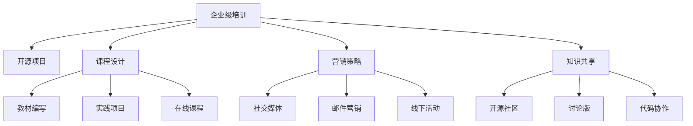

                 

# 创建开源项目的企业级培训课程：课程设计和营销

> 关键词：企业级培训, 开源项目, 课程设计, 营销策略, 技术培训, 课程内容, 线上线下结合

## 1. 背景介绍

### 1.1 问题由来
在当今快速变化的技术环境中，企业级技术培训已成为提高员工技能、推动创新和提升竞争力不可或缺的一部分。然而，传统的线下培训成本高、规模有限、难以持续更新，难以满足企业对技术人才不断增长的需求。开源项目为技术培训提供了一种灵活、低成本、可持续的解决方案。通过创建开源项目企业级培训课程，企业能够以低成本、高效率、可扩展的方式提升员工技能。

### 1.2 问题核心关键点
创建企业级培训课程的核心关键点包括：

- **目标明确**：课程设计应明确目标，覆盖关键技能点，满足企业实际需求。
- **内容深度**：课程内容应具备深度，不仅涵盖理论知识，还应包括实际操作和技术应用案例。
- **实践导向**：强调实践，通过实战项目、实验室等形式，提升学员的实操能力。
- **持续更新**：课程内容应不断更新，跟随技术发展和企业需求变化。
- **线上线下结合**：充分利用线上平台，提供在线学习资源和互动，同时提供线下研讨会、讲座和实验室等面对面交流机会。
- **可扩展性**：课程设计应具有可扩展性，方便后续增加新内容或模块。
- **社区支持**：构建开源社区，促进知识共享和协作，增强课程的可持续性。

### 1.3 问题研究意义
创建企业级培训课程对于企业和技术社区具有重要意义：

- **提升员工技能**：帮助员工掌握新技术、新工具，提升其职业能力和竞争力。
- **促进知识共享**：通过开源项目，员工可以在项目中分享知识、经验和创新成果。
- **加速技术创新**：开源项目可以加速新技术的迭代和应用，推动企业技术进步。
- **降低培训成本**：开源项目可以降低培训成本，提高培训效率，让更多的员工参与进来。
- **增强企业竞争力**：高技能的员工队伍能够提升企业的市场竞争力和创新能力。

## 2. 核心概念与联系

### 2.1 核心概念概述

为更好地理解企业级培训课程的设计和营销方法，本节将介绍几个关键概念：

- **企业级培训**：针对企业需求，旨在提升员工技能和知识水平，增强企业竞争力的技术培训。
- **开源项目**：指在开放源码协议下，代码和项目文档可以自由访问、修改和分布的软件项目。
- **课程设计**：基于教育心理学和学习理论，精心设计培训课程，涵盖理论、实践和应用。
- **营销策略**：通过一系列有计划、有系统的活动，推广课程，吸引学员参与，提升课程知晓度和参与度。
- **知识共享**：通过社区平台，促进学员、讲师和开发者之间的知识交流和合作，共同提升课程质量。

这些概念之间的逻辑关系可以通过以下Mermaid流程图来展示：



这个流程图展示了企业级培训课程的核心概念及其之间的关系：

1. 企业级培训的目标是通过开设开源项目课程提升员工技能。
2. 课程设计是课程的核心，涵盖了教材编写、实践项目和在线课程。
3. 营销策略用于推广课程，吸引学员参与，通过社交媒体、邮件营销和线下活动等手段。
4. 知识共享是开源项目的精髓，通过社区平台促进知识交流和合作。

## 3. 核心算法原理 & 具体操作步骤

### 3.1 算法原理概述

创建企业级培训课程的设计和营销过程本质上是一个优化问题，目标是通过有效的课程设计和营销策略，最大化课程的参与度和效果。其核心思想是：

1. **课程设计优化**：通过需求调研、专家访谈等方法，确定课程的核心技能点和教学内容，设计合理的学习路径，确保课程内容和实际工作需求匹配。
2. **营销策略优化**：分析目标受众的行为特征和偏好，设计针对性强的营销方案，提升课程的知名度和参与度。
3. **资源配置优化**：合理分配人力、物力资源，确保课程开发和营销的高效实施。

### 3.2 算法步骤详解

创建企业级培训课程的设计和营销过程包括以下几个关键步骤：

**Step 1: 需求调研和分析**
- 与企业沟通，了解其技术需求和目标。
- 进行员工调研，了解其技能现状和提升需求。
- 分析市场趋势和竞争对手，确定课程定位和核心技能点。

**Step 2: 课程设计**
- 确定课程目标和预期成果。
- 设计课程结构和内容，包括理论知识、实践项目和实战案例。
- 编写教材，制作教学资源，如PPT、视频等。

**Step 3: 实践项目和实验室准备**
- 设计实践项目，覆盖课程核心技能点。
- 搭建实验室环境，提供必要的工具和资源。
- 进行项目实施，记录实施过程和问题。

**Step 4: 线上课程开发**
- 利用在线平台（如GitHub、Coursera等）开发在线课程。
- 制作互动内容，如视频讲解、代码演示、讨论区等。
- 确保课程的持续更新和维护。

**Step 5: 营销推广**
- 制定营销策略，明确目标受众和推广渠道。
- 利用社交媒体、邮件营销、线下活动等方式推广课程。
- 定期发布课程更新和学员反馈，提升课程的互动性和参与度。

**Step 6: 知识共享和社区建设**
- 建立开源社区，促进学员之间的知识交流和协作。
- 提供代码共享和讨论平台，鼓励学员贡献代码和经验。
- 定期组织社区活动，如线上研讨会、代码审查等。

### 3.3 算法优缺点

企业级培训课程的设计和营销方法具有以下优点：

- **灵活性**：课程内容可以根据需求灵活调整，适应企业和技术社区的变化。
- **成本低**：通过开源项目和在线平台，降低了培训成本，提高了培训效率。
- **参与度**：通过线上线下结合的营销策略，提高了课程的参与度和覆盖面。
- **社区支持**：开源社区的协作和知识共享机制，增强了课程的可持续性。

同时，该方法也存在一定的局限性：

- **质量控制**：课程质量和效果依赖于讲师和开发者的专业水平。
- **学员自律**：线上课程需要学员具备一定的自律性和时间管理能力。
- **技术迭代**：课程内容需要及时更新，以跟上技术发展的步伐。
- **资源投入**：课程设计和营销需要投入一定的人力和物力资源。

尽管存在这些局限性，但就目前而言，基于企业级培训课程的设计和营销方法仍然是一种高效、可行的解决方案。未来相关研究的重点在于如何进一步提高课程质量，降低营销成本，提升学员参与度和满意度。

### 3.4 算法应用领域

企业级培训课程的设计和营销方法在多个领域得到了广泛应用，包括但不限于：

- **技术培训**：覆盖软件开发、人工智能、大数据等技术领域。
- **管理培训**：提升企业领导力和团队管理能力。
- **安全培训**：增强员工网络安全和信息保护意识。
- **软技能培训**：提升员工的沟通、协作和创新能力。
- **行业认证**：结合行业标准和认证，提供标准化培训课程。

此外，这些方法在教育、医疗、政府等多个领域也得到了应用，推动了相关行业的技术进步和人力资源发展。

## 4. 数学模型和公式 & 详细讲解 & 举例说明（备注：数学公式请使用latex格式，latex嵌入文中独立段落使用 $$，段落内使用 $)
### 4.1 数学模型构建

创建企业级培训课程的数学模型主要涉及以下几个方面：

- **需求调研模型**：通过调研数据，量化企业的技术需求和员工的提升需求。
- **课程设计模型**：基于学习理论，设计课程结构和内容，确保课程的有效性和实用性。
- **营销策略模型**：通过受众分析和渠道优化，最大化课程的推广效果。
- **资源配置模型**：基于成本效益分析，合理分配资源，提高培训效率。

### 4.2 公式推导过程

以下是几个关键模型的公式推导过程：

**需求调研模型**
$$
D = \sum_{i=1}^N (f_i \cdot R_i)
$$

其中，$D$ 代表企业的技术需求，$f_i$ 为需求权重，$R_i$ 为调研得分。

**课程设计模型**
$$
C = \max_{c \in \mathcal{C}} (S_c \cdot P_c)
$$

其中，$C$ 为课程内容，$\mathcal{C}$ 为课程集合，$S_c$ 为课程的实用性评分，$P_c$ 为课程的互动性评分。

**营销策略模型**
$$
M = \sum_{j=1}^M (c_j \cdot R_j)
$$

其中，$M$ 为营销效果，$c_j$ 为营销策略权重，$R_j$ 为效果评分。

**资源配置模型**
$$
R = \min_{r \in \mathcal{R}} (C_r \cdot T_r)
$$

其中，$R$ 为资源配置方案，$\mathcal{R}$ 为资源集合，$C_r$ 为资源成本，$T_r$ 为资源利用率。

### 4.3 案例分析与讲解

以软件开发技术培训为例，需求调研模型的应用如下：

- 调研企业技术栈和应用场景，确定需求权重$f_i$。
- 对员工进行技能调研，记录得分$R_i$。
- 计算加权求和，得到企业技术需求$D$。

课程设计模型的应用如下：

- 确定课程的实用性评分$S_c$，如技术深度、应用场景匹配度等。
- 确定课程的互动性评分$P_c$，如课程难度、学习路径等。
- 通过最大化实用性和互动性评分，选择最优课程内容$C$。

营销策略模型的应用如下：

- 确定营销策略权重$c_j$，如社交媒体、邮件营销、线下活动等。
- 记录每种策略的效果评分$R_j$。
- 通过加权求和，计算营销效果$M$。

资源配置模型的应用如下：

- 确定资源成本$C_r$，如讲师费用、硬件设备等。
- 记录资源利用率$T_r$，如课程实施效率、学员反馈等。
- 通过最小化成本和利用率，确定最优资源配置方案$R$。

## 5. 项目实践：代码实例和详细解释说明
### 5.1 开发环境搭建

在进行课程设计和营销实践前，我们需要准备好开发环境。以下是使用Python进行Python编程的开发环境配置流程：

1. 安装Anaconda：从官网下载并安装Anaconda，用于创建独立的Python环境。

2. 创建并激活虚拟环境：
```bash
conda create -n course-design-env python=3.8 
conda activate course-design-env
```

3. 安装必要的库：
```bash
conda install numpy pandas scikit-learn matplotlib seaborn jupyter notebook ipython
```

4. 安装在线平台API：
```bash
pip install requests
```

完成上述步骤后，即可在`course-design-env`环境中开始实践。

### 5.2 源代码详细实现

这里我们以一个简化的需求调研模型为例，给出使用Python进行企业级培训课程设计的需求调研代码实现。

首先，定义调研数据结构：

```python
from collections import defaultdict

# 调研数据结构
调研数据 = defaultdict(list)

# 调研样本数据
调研样本 = [
    {'企业': '企业A', '需求': [0.8, 0.5, 0.7], '调研得分': [9, 8, 10]},
    {'企业': '企业B', '需求': [0.6, 0.6, 0.7], '调研得分': [8, 7, 9]},
    {'企业': '企业C', '需求': [0.5, 0.4, 0.6], '调研得分': [7, 6, 8]},
    # 更多企业调研数据
]

# 计算加权求和
调研数据['企业A'] = [需求 * 调研得分 for 需求, 调研得分 in zip(调研样本[0]['需求'], 调研样本[0]['调研得分'])]
调研数据['企业B'] = [需求 * 调研得分 for 需求, 调研得分 in zip(调研样本[1]['需求'], 调研样本[1]['调研得分'])]
调研数据['企业C'] = [需求 * 调研得分 for 需求, 调研得分 in zip(调研样本[2]['需求'], 调研样本[2]['调研得分'])]

# 计算加权和的总和
总需求 = sum(调研数据.values())
```

然后，使用Seaborn可视化调研数据：

```python
import seaborn as sns
import matplotlib.pyplot as plt

# 数据可视化
sns.barplot(x=调研数据.keys(), y=调研数据.values())
plt.title('企业技术需求调研结果')
plt.xlabel('企业')
plt.ylabel('需求权重')
plt.show()
```

最后，计算并输出企业级技术需求：

```python
企业需求 = {企业: sum(调研数据[企业]) for 企业 in 调研数据.keys()}
企业需求总分 = sum(企业需求.values())
企业需求比例 = {企业: 企业需求[企业] / 企业需求总分 for 企业 in 企业需求.keys()}
企业需求比例.sort(reverse=True)

# 输出结果
print('企业级技术需求排序：')
for 企业, 比例 in 企业需求比例.items():
    print(f'{企业}: {比例:.2%}')
```

以上就是使用Python进行企业级培训课程需求调研的代码实现。可以看到，通过简单的数据结构和函数调用，就能实现企业级技术需求的调研和计算，为课程设计提供了数据支撑。

### 5.3 代码解读与分析

让我们再详细解读一下关键代码的实现细节：

**需求调研模型代码**：
- 使用Python的defaultdict创建调研数据结构，方便对不同企业的数据进行存储和处理。
- 定义调研样本，包含企业需求权重和调研得分。
- 通过列表推导式计算加权求和，得到每个企业的技术需求。
- 计算加权和的总和，得到总需求。
- 通过Seaborn库绘制条形图，可视化需求权重。
- 计算每个企业的技术需求比例，并按比例排序。
- 输出企业级技术需求排序结果。

可以看到，通过Python的简洁语法和强大的数据处理能力，我们能够快速实现企业级培训课程的需求调研和可视化，为课程设计提供了有力的数据支撑。

## 6. 实际应用场景

### 6.1 企业级技术培训

企业级技术培训课程可以通过开源项目和在线平台，快速实现技术传播和知识共享。例如，一个软件开发公司可以开发一个开源的GitHub项目，涵盖各种软件开发技术和工具，供员工在线学习和参考。项目中包含详细的代码示例、实践项目和在线教程，帮助员工系统学习技术。

此外，公司可以定期组织线下研讨会和代码审查，促进员工之间的知识交流和协作。通过持续的培训和实践，员工能够掌握新技术，提升职业能力和竞争力。

### 6.2 知识共享和社区建设

开源社区是企业级培训课程的重要组成部分，通过社区平台，员工可以自由分享代码、讨论问题和交流经验。例如，一个软件公司的开源社区可以提供以下功能：

- 代码共享：员工可以将自己的代码提交到社区，供其他员工参考和学习。
- 讨论版：员工可以在讨论版中提出问题，得到其他员工的解答和建议。
- 代码审查：员工可以参与代码审查，确保代码质量和一致性。
- 线上研讨会：公司可以定期组织线上研讨会，邀请技术专家分享经验和知识。

通过社区平台的建设，企业能够促进知识的共享和协作，增强课程的可持续性和实用性。

### 6.3 线上线下结合的培训方式

企业级培训课程应采用线上线下结合的方式，最大化培训效果。例如，一个在线学习平台可以提供以下功能：

- 视频课程：员工可以随时随地在线观看视频课程，学习技术知识和应用案例。
- 实践项目：员工可以在平台上完成实践项目，验证所学知识。
- 在线实验室：员工可以在线搭建实验室环境，进行实验和测试。
- 在线测试：员工可以通过在线测试评估自己的学习效果。

同时，公司可以定期组织线下培训和研讨会，促进员工的互动和协作。通过线上线下结合的方式，企业能够提供灵活、高效、可持续的技术培训，提升员工的职业能力和竞争力。

## 7. 工具和资源推荐

### 7.1 学习资源推荐

为了帮助开发者系统掌握企业级培训课程的设计和营销方法，这里推荐一些优质的学习资源：

1. **《企业级培训课程设计与管理》系列书籍**：介绍企业级培训课程的规划、设计和实施，涵盖课程设计、营销策略、知识共享等方面。

2. **《开源项目管理》课程**：介绍开源项目的基本概念、工具和技术，涵盖GitHub、Jenkins等常用工具的使用。

3. **《企业级技术培训》论文**：介绍企业级技术培训的最新研究和实践，涵盖课程设计、知识共享、社区建设等方面。

4. **Coursera、Udemy等在线学习平台**：提供各种企业级培训课程，涵盖技术培训、管理培训、软技能培训等方面。

5. **Kaggle等数据竞赛平台**：提供丰富的实战案例和项目，帮助学员实践和提升技能。

通过这些资源的学习实践，相信你一定能够系统掌握企业级培训课程的设计和营销方法，并用于解决实际的培训问题。

### 7.2 开发工具推荐

高效的开发离不开优秀的工具支持。以下是几款用于企业级培训课程开发的常用工具：

1. **Jupyter Notebook**：免费、开源的交互式编程环境，支持多种编程语言，适合数据处理和可视化。

2. **GitHub**：开源代码托管平台，提供代码版本控制、协作开发、问题跟踪等功能。

3. **Slack**：企业级即时通讯工具，支持团队协作、文件共享、知识共享等功能。

4. **Zoom**：视频会议和在线研讨会工具，支持大屏幕共享、记录和回放功能。

5. **Google Classroom**：在线学习管理系统，支持课程发布、作业提交、在线测试等功能。

合理利用这些工具，可以显著提升企业级培训课程的开发效率，加快创新迭代的步伐。

### 7.3 相关论文推荐

企业级培训课程的设计和营销方法涉及多个领域的交叉研究，以下是几篇奠基性的相关论文，推荐阅读：

1. **《企业级培训课程设计与管理》**：介绍企业级培训课程的规划、设计和实施，涵盖课程设计、营销策略、知识共享等方面。

2. **《开源项目的成功因素》**：分析开源项目的成功因素，涵盖社区建设、代码质量、项目管理等方面。

3. **《在线学习平台的建设与运营》**：介绍在线学习平台的基本概念、技术和运营策略，涵盖课程设计、用户管理、数据分析等方面。

4. **《企业级技术培训的挑战与对策》**：分析企业级技术培训面临的挑战，提出解决方案，涵盖需求调研、课程设计、营销策略等方面。

5. **《知识共享与协作的案例研究》**：通过案例研究，分析知识共享与协作的最佳实践，涵盖社区建设、代码协作、知识管理等方面。

这些论文代表了大规模技术培训的研究脉络，通过学习这些前沿成果，可以帮助研究者把握学科前进方向，激发更多的创新灵感。

## 8. 总结：未来发展趋势与挑战

### 8.1 总结

本文对企业级培训课程的设计和营销方法进行了全面系统的介绍。首先阐述了企业级培训课程的设计和营销背景和意义，明确了课程设计和营销的关键步骤和方法。其次，从原理到实践，详细讲解了企业级培训课程的设计和营销数学模型，并给出了代码实例和详细解释说明。同时，本文还广泛探讨了企业级培训课程在企业、技术社区等多个领域的实际应用场景，展示了其广阔的前景。此外，本文精选了课程设计和营销的相关学习资源，力求为读者提供全方位的技术指引。

通过本文的系统梳理，可以看到，企业级培训课程的设计和营销方法在企业和技术社区中得到了广泛应用，显著提升了员工的职业能力和竞争力，推动了技术社区的知识共享和协作。企业通过开源项目和在线平台，实现了灵活、低成本、高效的技术培训，为企业技术创新提供了强有力的人才保障。未来，伴随企业级培训课程设计和营销方法的不断完善，企业技术培训必将在更多领域得到应用，为经济社会发展注入新的动力。

### 8.2 未来发展趋势

展望未来，企业级培训课程设计和营销方法将呈现以下几个发展趋势：

1. **个性化培训**：根据学员的需求和兴趣，设计个性化培训课程，提升学习效果。
2. **持续学习**：通过在线平台，提供持续的课程更新和在线学习资源，促进知识的持续迭代和更新。
3. **混合学习**：结合线上线下培训，提供灵活、多样的学习方式，满足不同学员的需求。
4. **多模态培训**：结合文字、视频、音频等多种形式，提升培训的互动性和吸引力。
5. **社区协作**：建立和完善开源社区，促进学员之间的知识共享和协作，增强课程的可持续性。
6. **移动学习**：利用移动设备，提供便捷的学习方式，提升学习的灵活性和便捷性。
7. **游戏化学习**：结合游戏元素，提升学习的趣味性和参与度，增强学习效果。

以上趋势凸显了企业级培训课程设计和营销方法的广阔前景。这些方向的探索发展，必将进一步提升企业技术培训的效率和效果，推动企业技术进步和创新。

### 8.3 面临的挑战

尽管企业级培训课程设计和营销方法已经取得了显著成效，但在迈向更加智能化、普适化应用的过程中，仍然面临诸多挑战：

1. **质量控制**：课程质量依赖于讲师和开发者的专业水平，需要持续的培训和认证。
2. **学员自律**：在线学习需要学员具备一定的自律性和时间管理能力，需要有效的激励机制。
3. **技术迭代**：课程内容需要及时更新，以跟上技术发展的步伐，需要持续的投入和维护。
4. **资源投入**：课程设计和营销需要投入一定的人力和物力资源，需要合理的资源配置。
5. **市场竞争**：随着在线培训平台的兴起，企业需要不断优化课程内容和营销策略，保持竞争力。
6. **数据隐私**：在线学习需要收集和处理大量学员数据，需要严格的数据隐私保护措施。

正视这些挑战，积极应对并寻求突破，将是大规模技术培训走向成熟的必由之路。相信随着学界和产业界的共同努力，这些挑战终将一一被克服，企业级培训课程设计和营销方法必将在构建人机协同的智能时代中扮演越来越重要的角色。

### 8.4 研究展望

面对企业级培训课程设计和营销方法所面临的挑战，未来的研究需要在以下几个方面寻求新的突破：

1. **个性化学习路径设计**：通过机器学习和数据分析，设计个性化学习路径，提升学习效果。
2. **混合学习模式的优化**：结合线上线下培训，设计最优的混合学习模式，满足不同学员的需求。
3. **社区平台的改进**：通过社区平台的优化，提升学员之间的知识共享和协作，增强课程的可持续性。
4. **游戏化学习的创新**：结合游戏元素，创新游戏化学习方式，提升学习的趣味性和参与度。
5. **数据驱动的课程设计**：通过数据分析，优化课程内容和结构，提升课程的实用性和互动性。
6. **社区文化的建设**：通过社区文化的建设，提升社区的凝聚力和活跃度，增强知识共享和协作。

这些研究方向的探索，必将引领企业级培训课程设计和营销方法迈向更高的台阶，为构建安全、可靠、可解释、可控的智能系统铺平道路。面向未来，企业级培训课程设计和营销方法还需要与其他人工智能技术进行更深入的融合，如知识表示、因果推理、强化学习等，多路径协同发力，共同推动企业技术培训的进步。只有勇于创新、敢于突破，才能不断拓展企业级培训课程的边界，让智能技术更好地造福企业和社会。

## 9. 附录：常见问题与解答

**Q1：企业级培训课程设计有哪些关键点？**

A: 企业级培训课程设计应具备以下关键点：

- **目标明确**：课程设计应明确目标，涵盖核心技能点和教学内容，确保课程的有效性。
- **内容深度**：课程内容应具备深度，不仅涵盖理论知识，还应包括实际操作和技术应用案例。
- **实践导向**：强调实践，通过实战项目、实验室等形式，提升学员的实操能力。
- **持续更新**：课程内容应不断更新，跟随技术发展和企业需求变化。
- **线上线下结合**：充分利用线上平台，提供在线学习资源和互动，同时提供线下研讨会、讲座和实验室等面对面交流机会。
- **可扩展性**：课程设计应具有可扩展性，方便后续增加新内容或模块。
- **社区支持**：构建开源社区，促进知识共享和协作，增强课程的可持续性。

**Q2：企业级培训课程的营销策略有哪些？**

A: 企业级培训课程的营销策略主要包括：

- **社交媒体营销**：通过社交媒体平台推广课程，吸引学员参与。
- **邮件营销**：通过邮件发送课程信息，提高课程知晓度和参与度。
- **线下活动营销**：通过线下研讨会、讲座等活动，促进课程宣传和推广。
- **合作伙伴营销**：通过与企业、技术社区等合作伙伴合作，扩大课程影响力。
- **内容营销**：通过发布高质量的教学内容、实战案例等，吸引学员关注。
- **免费试用**：提供课程的免费试用期，吸引学员参与体验。

**Q3：企业级培训课程的设计和营销方法有哪些？**

A: 企业级培训课程的设计和营销方法主要包括以下几个方面：

- **需求调研**：通过调研企业技术需求和员工提升需求，确定课程的核心技能点和教学内容。
- **课程设计**：基于学习理论，设计课程结构和内容，确保课程的有效性和实用性。
- **实践项目和实验室准备**：设计实践项目，搭建实验室环境，提供必要的工具和资源。
- **线上课程开发**：利用在线平台开发在线课程，制作互动内容，确保课程的持续更新和维护。
- **营销策略**：制定针对性强的营销方案，利用社交媒体、邮件营销、线下活动等手段推广课程。
- **知识共享和社区建设**：建立开源社区，促进学员之间的知识交流和协作，增强课程的可持续性。

**Q4：企业级培训课程如何提高学员的参与度？**

A: 企业级培训课程提高学员参与度的方法包括：

- **互动性设计**：设计互动性强、有趣味的课程内容，吸引学员参与。
- **实践项目**：通过实践项目和实验室，让学员在实践中学习，提升实操能力。
- **线上线下结合**：充分利用线上平台，提供在线学习资源和互动，同时提供线下研讨会、讲座和实验室等面对面交流机会。
- **知识共享**：通过社区平台的知识共享和协作，增强学员的参与感和归属感。
- **激励机制**：通过奖励机制，如证书、奖金等，激励学员积极参与。
- **持续更新**：通过持续的课程更新和优化，保持课程的吸引力和实用性。

通过这些方法，企业级培训课程能够最大化学员的参与度和学习效果，推动企业技术创新和人才发展。

