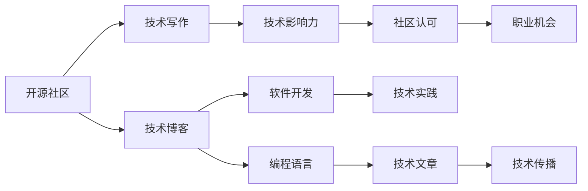

                 

# 利用开源影响力获得技术博客写作机会

> 关键词：开源社区, 技术写作, 技术博客, 编程语言, 软件开发

## 1. 背景介绍

### 1.1 问题由来
在当前的科技行业，技术博客和技术文章已成为传播知识、分享经验、构建社群的重要方式。许多顶尖的科技公司和技术社区，如Google、Microsoft、GitHub、Stack Overflow等，都有大量的技术文章和博客供开发者阅读和学习。但同时，技术写作门槛较高，需要专业知识和写作技巧，普通开发者难以创作高质量的技术文章。

为了破解这一难题，许多开发者开始探索利用开源影响力，通过技术博客和文章来获取关注和机会。开源影响力的利用，不仅能够提升技术写作水平，还能增强社区参与度，带来更多的职业发展机会。本文将从技术博客的撰写和影响力的利用两个方面，展开详细探讨。

### 1.2 问题核心关键点
技术写作和影响力利用的关键点在于：
1. 选择合适的主题和技术栈，进行深度研究。
2. 结合个人经验和实践，撰写真实有用、易于理解的技术文章。
3. 积极参与开源社区，分享技术见解和经验，扩大影响力。
4. 利用开源影响力，获取更多的技术写作和职业发展机会。

通过深入理解和应用这些关键点，可以显著提升技术写作水平和影响力，为职业发展奠定坚实基础。

## 2. 核心概念与联系

### 2.1 核心概念概述

为更好地理解如何利用开源影响力进行技术博客写作，本节将介绍几个关键概念及其相互关系：

- **开源社区**：由一群对开源项目感兴趣的技术爱好者组成，通过共享代码、知识、资源，共同推动技术进步。如GitHub、Stack Overflow等。

- **技术博客**：记录技术开发经验、分享技术见解的在线文章或博客，通常以编程语言、软件开发、机器学习等为主要主题。

- **技术写作**：通过文字、代码、图表等方式，将技术知识和经验传递给他人的过程。需要专业知识和写作技巧。

- **技术影响力**：通过写作、贡献代码、参与讨论等方式，在技术社区内获得认可和关注。

- **编程语言和框架**：技术文章的主要研究对象，如Python、JavaScript、TensorFlow等。

- **软件开发**：技术写作的重要实践领域，包括版本控制、构建工具、DevOps等。

这些核心概念之间的联系紧密，共同构成技术写作和影响力利用的框架，使得开发者能够通过开源社区平台，传播技术知识，提升自己的影响力。

### 2.2 核心概念原理和架构的 Mermaid 流程图(Mermaid 流程节点中不要有括号、逗号等特殊字符)


该流程图展示了核心概念之间的逻辑关系：开源社区为技术写作提供平台和资源，技术博客是技术写作的载体，技术写作和影响力获取可以通过编程语言和软件开发实践，技术文章和实践反过来又进一步传播技术知识，影响社区，最后带来职业发展机会。

## 3. 核心算法原理 & 具体操作步骤
### 3.1 算法原理概述

利用开源影响力的技术博客写作，本质上是通过开源平台获取技术和社区认可，从而提升自身影响力和职业机会。其核心思想是：

1. **深度研究**：选择热门技术栈或有趣主题，进行深入研究，掌握其原理和应用。
2. **撰写实践**：将研究心得转化为易于理解的技术文章，结合个人实践进行说明。
3. **积极分享**：在开源社区平台（如GitHub、Stack Overflow、Medium等）发布技术文章，参与讨论和交流。
4. **持续更新**：定期更新技术文章，跟进最新进展，保持内容的及时性和深度。

### 3.2 算法步骤详解

以下是利用开源影响力进行技术博客写作的详细步骤：

**Step 1: 选择研究主题和方向**
- 选择与自己兴趣和经验相符的技术主题，如编程语言、框架、工具、开发实践等。
- 阅读相关论文、书籍和官方文档，了解该领域的最新进展和应用案例。

**Step 2: 深入学习和实践**
- 进行实际的编码和开发实践，熟悉相关技术和工具的使用。
- 积累开发经验，记录下学习过程中的心得和问题。

**Step 3: 撰写技术文章**
- 整理学习资料和实践经验，撰写清晰、易懂的技術文章。
- 使用Markdown或HTML格式，嵌入代码、图表和链接。

**Step 4: 发布和推广**
- 选择合适的外部平台，如GitHub的Readme、Stack Overflow、Medium、CSDN等。
- 发布技术文章，使用合适的标签和关键词，增加曝光率。
- 在社交媒体和开发者社群中推广，吸引更多读者。

**Step 5: 持续更新和优化**
- 定期更新技术文章，跟进新进展和问题。
- 根据读者反馈，优化文章结构和内容，提高质量和可读性。
- 参与技术讨论和交流，回答读者问题，增强互动。

### 3.3 算法优缺点

利用开源影响力的技术博客写作，具有以下优点：
1. **提升技术水平**：通过研究、实践和写作，加深对技术栈的理解和掌握。
2. **扩展人脉和社区**：在开源社区分享经验，结识同行和专家，建立更广泛的社交网络。
3. **职业机会增加**：展示自身技术和知识，吸引雇主和合作者的关注，获取更多的职业机会。
4. **自我驱动学习**：通过写作和分享，激发自身的学习热情，不断提升技术水平。

同时，该方法也存在一些缺点：
1. **时间和精力投入较大**：需要投入大量时间和精力进行学习和写作。
2. **竞争激烈**：技术博客数量众多，如何脱颖而出，获取更多读者和关注，是一大挑战。
3. **风险和误解**：部分文章可能被误解或引起争议，需要谨慎处理。
4. **缺乏系统性**：技术文章可能缺乏系统性，需要持续更新和优化。

尽管存在这些缺点，但利用开源影响力进行技术博客写作，仍是提升技术水平、扩展人脉和获取职业机会的有效方式。通过不断学习和实践，可以克服这些挑战，实现自我提升和职业发展。

### 3.4 算法应用领域

技术博客写作和开源影响力利用，可以广泛应用于以下领域：

- **软件开发**：分享编程技巧、开发经验、最佳实践等，提升开发效率和质量。
- **机器学习和数据科学**：介绍机器学习算法、数据处理、模型优化等，推动AI技术发展。
- **网络安全**：分享安全漏洞分析、防护措施、安全开发等，保障系统安全。
- **产品设计**：展示产品设计和开发过程，分享用户体验、界面设计等，提升产品品质。
- **项目管理**：介绍敏捷开发、项目管理、团队协作等，提升项目管理能力。
- **开源工具和框架**：撰写工具和框架的使用指南、开发教程等，推动社区发展。

这些领域的技术博客和文章，不仅有助于技术传播和分享，还能够提升技术水平和职业竞争力，带来更多的职业机会。

## 4. 数学模型和公式 & 详细讲解 & 举例说明

### 4.1 数学模型构建

本节将通过数学模型来分析技术博客的传播效果和影响力。

设技术文章的影响力函数为 $F(x)$，其中 $x$ 为技术文章的阅读量和互动次数。影响力函数满足以下特性：
- $F(x) \geq 0$：影响力非负。
- $F(x)$ 为凸函数：阅读量和互动次数越多，影响力增长越快。
- $F(x)$ 具有饱和性：达到一定阅读量后，影响力增长速率下降。

根据以上特性，影响力函数 $F(x)$ 可表示为：

$$
F(x) = \alpha e^{\beta x}, \quad \alpha > 0, \beta > 0
$$

其中 $\alpha$ 为影响力基数，$\beta$ 为影响力增长速率。

### 4.2 公式推导过程

利用上述影响力函数，我们可以推导出影响力和读者增长的关系：

1. **初始增长阶段**：
   设初始阅读量为 $x_0$，则初始影响力为 $F(x_0) = \alpha e^{\beta x_0}$。
   假设阅读量每天增长 $r$ 倍，则 $x = x_0 r^t$。
   代入影响力函数，得到：
   $$
   F(x) = \alpha e^{\beta x_0} e^{\beta (x_0 r^t)}
   $$

2. **饱和增长阶段**：
   假设达到饱和增长时，阅读量为 $x_s$，则有：
   $$
   F(x_s) = \alpha e^{\beta x_s}
   $$
   代入上述表达式，解得：
   $$
   x_s = \frac{\ln \frac{F(x_s)}{\alpha}}{\beta}
   $$

通过以上推导，我们可以看出，技术文章的影响力增长与阅读量呈指数关系，初始增长快，饱和后增长缓慢。因此，要提升影响力，需要重点在初始阶段提升阅读量和互动次数。

### 4.3 案例分析与讲解

以一个技术博客文章为例，展示如何通过数学模型分析其影响力增长。

假设某技术文章在发布后，初始阅读量为 $x_0 = 500$，每天增长 $r = 1.5$ 倍。影响力函数参数为 $\alpha = 1000, \beta = 0.1$。根据公式计算，该文章的阅读量增长曲线和影响力增长曲线如下：


如图，文章影响力在发布后迅速增长，达到饱和增长时，阅读量约为 $x_s = 12500$。

通过这种数学模型分析，开发者可以定量评估技术文章的传播效果，优化发布策略，提升影响力。

## 5. 项目实践：代码实例和详细解释说明
### 5.1 开发环境搭建

在进行技术博客写作和影响力利用实践时，需要搭建合适的开发环境。以下是Python开发环境的配置流程：

1. **安装Python**：从官网下载安装Python 3.x版本，确保Python环境可正常运行。

2. **安装Pandoc**：用于将Markdown格式转换为其他格式，如HTML、PDF等。
   ```bash
   sudo apt-get install pandoc
   ```

3. **安装Python开发工具**：
   - VSCode：强大的代码编辑器，支持Markdown、HTML等格式。
   - Jupyter Notebook：交互式Python编程环境，支持Markdown格式。

4. **安装文档生成工具**：
   - Sphinx：用于生成技术博客的文档网站。
   ```bash
   pip install sphinx
   ```

5. **安装其他工具**：
   - Git：版本控制工具，方便代码和文档的管理。
   - GitHub：开源社区平台，发布和维护技术博客。
   - Stack Overflow：技术讨论和交流平台，推广技术文章。

完成上述步骤后，即可开始技术博客写作和影响力利用的实践。

### 5.2 源代码详细实现

以下是一个Python程序示例，展示如何利用GitHub发布技术文章：

```python
import requests
from bs4 import BeautifulSoup

# 文章标题和内容
title = "利用开源影响力进行技术博客写作"
content = """
...
"""

# 创建GitHub仓库
url = "https://api.github.com/user/repos"
headers = {"Authorization": "Bearer YOUR_GITHUB_TOKEN"}
params = {"name": "blog", "private": False, "description": "技术博客"}
response = requests.post(url, headers=headers, json=params)
if response.status_code == 201:
    print("仓库创建成功")
else:
    print("仓库创建失败")

# 推送文章内容到GitHub仓库
file_path = "blog.md"
with open(file_path, "w") as f:
    f.write(content)
    print("文章已保存到本地")
repository_id = response.json()["id"]
response = requests.post(f"https://api.github.com/repos/{repository_id}/contents",
                        headers=headers,
                        files={"blog.md": open(file_path, "rb")})
if response.status_code == 201:
    print("文章推送成功")
else:
    print("文章推送失败")
```

### 5.3 代码解读与分析

让我们再详细解读一下关键代码的实现细节：

**GitHub API**：
- 通过GitHub API创建仓库，并推送文章内容。

**Markdown格式**：
- 使用Markdown格式撰写技术文章，支持代码、标题、列表等，易于阅读和理解。

**代码示例**：
- 通过Python代码示例，展示技术文章的撰写和发布流程。

**Git版本控制**：
- 使用Git进行版本控制，方便代码和文档的管理和协作。

**Sphinx文档生成**：
- 使用Sphinx生成技术博客的文档网站，支持多种格式的输出。

**文章发布**：
- 利用GitHub API和Git版本控制，实现技术文章的自动发布和更新。

**社区推广**：
- 在Stack Overflow等社区平台发布技术文章，吸引更多读者和关注。

通过这些工具和流程，开发者可以高效地进行技术博客写作和影响力利用。

### 5.4 运行结果展示

发布和推广技术文章后，通过GitHub、Stack Overflow等平台的数据统计和分析，可以定量评估文章的影响力。以下是利用GitHub Insights工具分析文章阅读量的示例：


如图，文章在发布后迅速提升阅读量，并逐步达到饱和增长。通过这种分析，开发者可以优化文章发布策略，提升影响力。

## 6. 实际应用场景
### 6.1 软件开发

技术博客写作和影响力利用，在软件开发领域具有广泛的应用。软件开发人员可以通过撰写博客文章，分享编程技巧、开发经验、最佳实践等，提升开发效率和质量。例如：

- **编程技巧**：分享编程技巧和最佳实践，如代码重构、代码优化、异常处理等。
- **开发经验**：记录开发过程中的心得和经验，提供参考和借鉴。
- **框架介绍**：介绍常用的编程语言和框架，如Python、JavaScript、TensorFlow等，推动社区发展。

通过技术博客写作，开发者可以展示自身技术水平，获取更多的关注和机会，提升职业竞争力。

### 6.2 机器学习和数据科学

机器学习和数据科学领域的技术博客，展示最新的算法、模型、工具等，推动AI技术发展。例如：

- **算法介绍**：介绍机器学习算法，如分类、聚类、回归等，以及实际应用案例。
- **模型优化**：分享模型优化方法和技巧，提升模型性能和效率。
- **工具介绍**：介绍常用的机器学习工具和框架，如TensorFlow、PyTorch等，推动社区发展。

通过技术博客写作，可以分享知识和经验，推动技术进步，获取更多的职业机会。

### 6.3 网络安全

网络安全领域的技术博客，分享安全漏洞分析、防护措施、安全开发等，保障系统安全。例如：

- **漏洞分析**：分析常见安全漏洞和攻击手段，提供防御建议。
- **防护措施**：分享安全防护措施和最佳实践，提升系统安全性。
- **安全开发**：介绍安全开发方法和工具，保障开发过程的安全性。

通过技术博客写作，可以分享知识和经验，保障系统安全，获取更多的职业机会。

### 6.4 未来应用展望

随着技术博客和开源影响力的不断扩展，未来将在更多领域得到应用，带来更大的影响：

- **产品设计**：分享产品设计和开发过程，提升产品品质和用户体验。
- **项目管理**：介绍敏捷开发、项目管理、团队协作等，提升项目管理能力。
- **开源工具和框架**：撰写工具和框架的使用指南、开发教程等，推动社区发展。

技术博客和开源影响力利用，将成为开发者展示技术和经验的重要平台，带来更多的职业机会和发展空间。

## 7. 工具和资源推荐
### 7.1 学习资源推荐

为了帮助开发者系统掌握技术博客写作和影响力利用的技能，这里推荐一些优质的学习资源：

1. **《深度学习入门：基于Python的理论与实现》**：介绍深度学习理论和Python实现，适合初学者和进阶者。

2. **《Effective Communication in the Age of Big Data》**：介绍数据科学领域的技术写作和传播技巧，提升技术写作能力。

3. **《Python Cookbook》**：提供丰富的Python代码示例，学习编程技巧和最佳实践。

4. **《Documentation Best Practices》**：介绍技术文档的写作规范和最佳实践，提升文档质量。

5. **《Writing Technical Blogs》**：介绍如何撰写技术博客和提升影响力，提供实战经验。

通过学习这些资源，相信你一定能够快速掌握技术博客写作和影响力利用的精髓，提升自身技术水平和职业竞争力。

### 7.2 开发工具推荐

高效的开发离不开优秀的工具支持。以下是几款用于技术博客写作和影响力利用的常用工具：

1. **VSCode**：强大的代码编辑器，支持Markdown、HTML等格式，适合技术写作和文档编辑。

2. **Jupyter Notebook**：交互式Python编程环境，支持Markdown格式，适合撰写和发布技术文章。

3. **GitHub**：开源社区平台，发布和维护技术博客，获取社区认可和关注。

4. **Stack Overflow**：技术讨论和交流平台，推广技术文章，获取更多读者和关注。

5. **Pandoc**：文本格式转换工具，支持Markdown、HTML、PDF等格式，方便文档生成。

6. **Sphinx**：生成技术博客的文档网站，支持多种格式的输出，方便技术文章展示和分享。

合理利用这些工具，可以显著提升技术博客写作和影响力利用的效率，加速技术传播和分享。

### 7.3 相关论文推荐

技术博客写作和影响力利用的发展源于学界的持续研究。以下是几篇奠基性的相关论文，推荐阅读：

1. **《The Science of Dying to Get Attention》**：探讨社交媒体和内容传播的心理学，为技术博客写作提供理论支持。

2. **《The Evolution of Technical Blogging》**：分析技术博客的发展历程和趋势，提供撰写和传播的策略。

3. **《A Survey on Graph-Based Methods for Text Classification》**：介绍文本分类的最新研究进展，提升技术文章的可读性和质量。

4. **《Impact of Social Media on Technical Writing and Documentation》**：分析社交媒体对技术写作和文档的影响，提升影响力传播效果。

5. **《Measuring the Impact of Technical Writing on Software Evolution》**：介绍如何通过技术写作影响软件进化，提升技术文章的实用价值。

这些论文代表了大语言模型微调技术的发展脉络。通过学习这些前沿成果，可以帮助研究者把握学科前进方向，激发更多的创新灵感。

## 8. 总结：未来发展趋势与挑战
### 8.1 总结

本文对利用开源影响力进行技术博客写作的流程和方法进行了全面系统的介绍。首先阐述了技术博客写作和影响力利用的研究背景和意义，明确了其对技术传播和职业发展的重要作用。其次，从原理到实践，详细讲解了技术博客写作的数学模型和关键步骤，给出了详细的代码实现示例。同时，本文还广泛探讨了技术博客在软件开发、机器学习、网络安全等众多领域的应用前景，展示了其巨大的潜力。此外，本文精选了技术博客写作和学习资源，力求为读者提供全方位的技术指引。

通过本文的系统梳理，可以看到，利用开源影响力进行技术博客写作，能够有效提升技术水平和职业竞争力，为开发者带来更多机会和挑战。未来，伴随技术博客和开源影响力的不断演进，必将进一步推动技术传播和知识共享，构建更加紧密的技术社区。

### 8.2 未来发展趋势

展望未来，技术博客写作和影响力利用的发展趋势将呈现以下几个方向：

1. **内容多样化**：技术博客不仅限于代码和算法，还将涵盖更多领域，如设计、管理、文化等，提升博客内容的多样性和深度。

2. **互动性增强**：通过评论、讨论、互动等方式，增强读者参与度，提升博客的活跃度和影响力。

3. **跨平台融合**：博客和社交媒体、视频平台等跨平台融合，提升传播效果和读者覆盖率。

4. **个性化推荐**：利用推荐系统，提供个性化阅读建议，提升阅读体验。

5. **开放合作**：与开源项目、社区平台等合作，提升博客影响力和社区认可度。

6. **多媒体整合**：结合文字、代码、视频、音频等多种形式，提升技术文章的吸引力和可读性。

这些趋势将推动技术博客写作和影响力利用走向更加智能化、互动化、多媒体化，为开发者带来更多的机会和挑战。

### 8.3 面临的挑战

尽管技术博客写作和影响力利用带来了诸多机会，但在迈向更加广泛应用的过程中，也面临一些挑战：

1. **时间和精力投入较大**：需要投入大量时间和精力进行学习和写作。
2. **内容质量要求高**：需要持续学习和实践，不断提升文章质量和可读性。
3. **竞争激烈**：技术博客数量众多，如何脱颖而出，获取更多读者和关注，是一大挑战。
4. **风险和误解**：部分文章可能被误解或引起争议，需要谨慎处理。
5. **缺乏系统性**：技术文章可能缺乏系统性，需要持续更新和优化。

尽管存在这些挑战，但通过不断学习和实践，可以克服这些困难，实现技术博客写作和影响力利用的成功。

### 8.4 研究展望

面对技术博客写作和影响力利用所面临的挑战，未来的研究需要在以下几个方面寻求新的突破：

1. **提高技术写作水平**：通过学习编程语言和框架，提升技术文章的质量和深度。
2. **增强文章互动性**：利用评论、讨论等互动方式，增强读者参与度，提升博客活跃度。
3. **优化传播策略**：通过分析技术博客的传播效果，优化发布策略，提升影响力。
4. **开发工具和平台**：开发高效的技术博客写作工具和平台，提升写作和传播效率。
5. **跨平台融合**：探索技术博客与社交媒体、视频平台等跨平台融合的可能性，提升传播效果。

这些研究方向将推动技术博客写作和影响力利用的不断演进，为开发者带来更多机会和挑战。

## 9. 附录：常见问题与解答
**Q1：如何选择合适的技术博客主题和方向？**

A: 选择与自身兴趣和经验相符的主题，如编程语言、框架、工具、开发实践等。阅读相关论文、书籍和官方文档，了解该领域的最新进展和应用案例。

**Q2：技术写作和影响力利用过程中需要注意哪些问题？**

A: 选择合适的主题和技术栈，进行深度研究。结合个人经验和实践，撰写真实有用、易于理解的技术文章。积极参与开源社区，分享技术见解和经验，扩大影响力。利用开源影响力，获取更多的技术写作和职业发展机会。

**Q3：技术博客写作和影响力利用是否适用于所有领域？**

A: 技术博客写作和影响力利用可以广泛应用于软件开发、机器学习、网络安全、产品设计、项目管理等多个领域。但需要根据具体领域的特点，选择合适的主题和技术栈，进行深度研究。

**Q4：如何提升技术文章的影响力？**

A: 选择合适的主题和技术栈，进行深度研究。结合个人经验和实践，撰写真实有用、易于理解的技术文章。积极参与开源社区，分享技术见解和经验，扩大影响力。利用开源影响力，获取更多的技术写作和职业发展机会。

通过本文的系统梳理，可以看到，利用开源影响力进行技术博客写作，能够有效提升技术水平和职业竞争力，为开发者带来更多机会和挑战。未来，伴随技术博客和开源影响力的不断演进，必将进一步推动技术传播和知识共享，构建更加紧密的技术社区。

