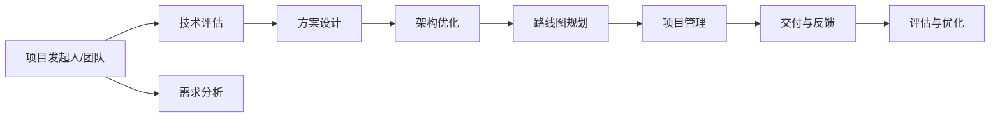

                 

# 利用开源经验提供技术路线图咨询服务

> 关键词：开源经验,技术咨询,路线图规划,软件开发,项目管理

## 1. 背景介绍

随着开源社区的蓬勃发展，越来越多的软件项目选择开源化，享受其带来的灵活性、透明性、社区协作等优势。但开源项目的成功并非一蹴而就，如何从零到一、从一到N，进行有效的技术路线图规划和项目管理，成为每一个项目发起人和开发者必须面对的挑战。本文将以《利用开源经验提供技术路线图咨询服务》为题，探讨如何结合开源项目的最佳实践，提供专业的技术咨询和路线图规划服务，助力企业与项目团队高效、成功地上架开源软件。

## 2. 核心概念与联系

### 2.1 核心概念概述

在探讨技术咨询和路线图规划时，首先需要明确几个关键概念：

- **开源经验**：开源软件在开发、维护、推广等方面积累的最佳实践和经验。这些经验包括代码管理、社区运营、版本控制、持续集成/持续交付(CI/CD)流程等。
- **技术咨询**：结合开源经验，为项目提供全方位的技术评估、方案设计、架构优化等服务，帮助团队选择最合适的技术和工具，规避常见坑点。
- **路线图规划**：制定详细的技术路线图，明确项目里程碑、关键任务、交付物、时间节点等，确保项目按计划有序推进。
- **项目管理**：从任务分配、进度跟踪、风险管理到沟通协作、团队建设，系统地推进项目进程，保证按时、高质量地交付。

### 2.2 核心概念原理和架构的 Mermaid 流程图



这个流程图展示了从项目启动到交付的整个流程，从需求分析到项目管理的各个环节，通过开源经验的指导，合理配置资源，确保项目顺利进行。

## 3. 核心算法原理 & 具体操作步骤

### 3.1 算法原理概述

技术路线图规划和项目管理，其核心原理基于敏捷开发方法和开源社区的实践经验。以下原理图展示了这一过程：


1. **需求调研与分析**：深入了解项目需求，制定详细的用户需求文档。
2. **架构设计**：选择合适的技术栈和架构模式，设计模块化的系统结构。
3. **技术选型**：结合开源社区的经验，选择最适合当前项目的技术工具和框架。
4. **路线图规划**：制定详细的项目计划，明确时间节点、里程碑和交付物。
5. **资源配置**：合理分配团队成员的任务，确保资源的最大利用。
6. **任务分解**：将大任务拆解为小任务，明确每个任务的具体工作内容和交付标准。
7. **持续集成与交付**：通过自动化工具，实现代码的频繁集成和快速交付。
8. **质量保证**：设置严格的质量标准和测试流程，保证交付软件的稳定性。
9. **进度监控与风险管理**：实时跟踪项目进度，及时处理项目中的风险和挑战。
10. **团队协作**：建立高效的沟通协作机制，确保信息流通和团队协作。
11. **用户反馈与迭代优化**：收集用户反馈，进行持续的迭代优化，提升软件质量。

### 3.2 算法步骤详解

#### 3.2.1 项目启动阶段

- **需求调研与分析**：与项目发起人或用户沟通，全面了解项目需求、目标和期望。通过问卷调查、用户访谈、竞品分析等方式，形成详细的用户需求文档。
- **团队组建与培训**：组建一支高效的开发团队，对团队成员进行必要培训，使其熟悉项目需求、技术栈和最佳实践。

#### 3.2.2 架构设计与技术选型

- **架构设计**：基于开源社区的成功案例，选择合适的架构模式（如MVC、微服务、微前端等），设计系统模块和数据流。
- **技术选型**：通过分析社区讨论和实践案例，选择最合适的技术栈（如Node.js、Python、React、Vue等）和工具（如Docker、Kubernetes、GitLab、Jenkins等）。

#### 3.2.3 路线图规划与资源配置

- **路线图规划**：结合需求分析结果和架构设计，制定详细的项目路线图，明确每个阶段的交付物和时间节点。
- **资源配置**：根据任务难度和工作量，合理分配团队成员和资源，制定详细的工作计划和时间表。

#### 3.2.4 任务分解与持续集成

- **任务分解**：将大任务拆解为小任务，为每个小任务设定具体的工作内容、交付标准和完成时间。
- **持续集成与交付**：配置CI/CD系统，实现代码频繁集成和快速交付，保证开发效率和软件质量。

#### 3.2.5 质量保证与进度监控

- **质量保证**：设置严格的质量标准和测试流程，通过单元测试、集成测试和用户验收测试，确保交付软件的质量。
- **进度监控与风险管理**：使用项目管理工具，实时跟踪项目进度，及时处理项目中的风险和挑战，确保项目按计划进行。

#### 3.2.6 团队协作与用户反馈

- **团队协作**：建立高效的沟通协作机制，定期召开站会、周会、月会，确保信息流通和团队协作。
- **用户反馈与迭代优化**：收集用户反馈，进行持续的迭代优化，提升软件质量和用户体验。

### 3.3 算法优缺点

开源经验和技术咨询的优点在于：
- **灵活性与适应性**：结合开源社区的灵活性和最佳实践，可适应多种开发环境和项目需求。
- **可扩展性**：开源社区拥有丰富资源和工具，可以轻松扩展功能、集成第三方服务。
- **社区支持**：开源项目享受社区持续的支持和维护，可以迅速解决技术问题和挑战。

然而，开源经验和技术咨询也存在一些缺点：
- **依赖性**：对开源工具和社区的依赖较大，一旦社区停止维护，可能导致项目陷入困境。
- **复杂性**：开源社区的信息庞杂，需要花费大量时间进行筛选和学习。
- **灵活性限制**：部分开源项目可能存在灵活性不足、功能缺失的问题，无法完全满足项目需求。

### 3.4 算法应用领域

开源经验和技术咨询主要应用于以下领域：

- **软件开发**：帮助企业进行项目启动、需求分析、架构设计、技术选型、代码开发、质量保证和持续交付。
- **项目运营**：提供项目管理、资源配置、任务分解、进度监控、风险管理和团队协作等服务。
- **技术支持**：通过技术评估、方案设计、架构优化、测试和部署，支持项目的快速迭代和持续优化。

## 4. 数学模型和公式 & 详细讲解 & 举例说明

### 4.1 数学模型构建

在技术咨询和路线图规划中，数学模型主要涉及项目管理、任务分配和进度跟踪。以下是典型的数学模型构建：

- **项目管理模型**：使用CPM（Critical Path Method）模型计算项目关键路径和关键任务，确保项目按计划完成。
- **任务分配模型**：通过WBS（Work Breakdown Structure）模型将项目任务分解为可执行的任务单元，合理分配团队成员。
- **进度跟踪模型**：使用甘特图（Gantt Chart）展示项目进度，实时跟踪任务完成情况和资源利用率。

### 4.2 公式推导过程

#### 4.2.1 CPM模型

CPM模型的核心公式为：

$$
T = \max(T_i + T_j)
$$

其中，$T$ 为任务总时长，$T_i$ 和 $T_j$ 分别为两个任务的时长和依赖关系。通过求解关键路径，可以确定项目完成的最短时间。

#### 4.2.2 WBS模型

WBS模型通过将项目任务分解为最小可执行单元，形成树状结构，每个任务单元被赋予具体的任务和负责人，确保任务执行的明确性和可控性。

#### 4.2.3 甘特图

甘特图的横轴表示时间，纵轴表示任务，每个任务条形图表示任务的执行时间和进度。通过甘特图，可以实时跟踪项目进度和任务完成情况。

### 4.3 案例分析与讲解

#### 4.3.1 案例一：企业内部系统升级项目

某企业需要对其内部系统进行升级，包括前端页面、后端服务、数据库迁移等。通过技术咨询和路线图规划，制定了详细的项目计划，确保按计划完成：

1. **需求调研**：与业务部门沟通，了解系统升级需求，制定详细的用户需求文档。
2. **技术选型**：选择React作为前端框架，Node.js作为后端语言，MySQL和PostgreSQL作为数据库。
3. **架构设计**：设计微服务架构，将系统拆分为多个微服务模块，提升系统的可扩展性和维护性。
4. **路线图规划**：制定详细的项目路线图，明确每个阶段的交付物和时间节点。
5. **任务分解**：将系统升级任务拆分为多个小任务，每个任务设定具体的交付标准和时间。
6. **持续集成与交付**：配置CI/CD系统，实现代码频繁集成和快速交付。
7. **质量保证**：设置严格的质量标准和测试流程，确保交付软件的质量。
8. **进度监控与风险管理**：使用项目管理工具，实时跟踪项目进度，及时处理项目中的风险和挑战。
9. **团队协作**：建立高效的沟通协作机制，定期召开站会、周会、月会，确保信息流通和团队协作。

#### 4.3.2 案例二：开源社区项目上线

某开源社区项目需要在GitHub上发布，涉及代码编写、测试、发布等多个环节。通过技术咨询和路线图规划，确保项目顺利上线：

1. **需求调研**：与社区用户沟通，了解项目需求，制定详细的用户需求文档。
2. **技术选型**：选择Python作为开发语言，Django作为框架，Git作为版本控制工具。
3. **架构设计**：设计RESTful API架构，将功能模块化，便于后续扩展和维护。
4. **路线图规划**：制定详细的项目路线图，明确每个阶段的交付物和时间节点。
5. **任务分解**：将项目任务拆分为多个小任务，每个任务设定具体的交付标准和时间。
6. **持续集成与交付**：配置CI/CD系统，实现代码频繁集成和快速交付。
7. **质量保证**：设置严格的质量标准和测试流程，确保交付软件的质量。
8. **进度监控与风险管理**：使用项目管理工具，实时跟踪项目进度，及时处理项目中的风险和挑战。
9. **团队协作**：建立高效的沟通协作机制，定期召开站会、周会、月会，确保信息流通和团队协作。

## 5. 项目实践：代码实例和详细解释说明

### 5.1 开发环境搭建

在进行技术咨询和路线图规划时，首先需要搭建开发环境。以下是Python项目开发环境搭建的详细流程：

1. **安装Anaconda**：从官网下载并安装Anaconda，用于创建独立的Python环境。
2. **创建并激活虚拟环境**：
   ```bash
   conda create -n project-env python=3.8 
   conda activate project-env
   ```
3. **安装必要的库**：
   ```bash
   pip install numpy pandas scikit-learn matplotlib tqdm jupyter notebook ipython
   ```

完成上述步骤后，即可在`project-env`环境中开始项目实践。

### 5.2 源代码详细实现

以下是一个简单的Python项目实践示例，展示了如何使用OpenSSL库进行加密通信：

```python
import ssl
import socket

context = ssl.create_default_context()
context.load_cert_chain('server.crt', 'server.key')

# 创建socket连接
conn = socket.socket(socket.AF_INET, socket.SOCK_STREAM)

# 连接服务器
conn.connect(('server.example.com', 443))

# 加密通信
stream = context.wrap_socket(conn, server_side=True)
stream.write(b'Hello, world!')
stream.close()
```

### 5.3 代码解读与分析

**第1行**：导入`ssl`模块，用于创建SSL/TLS连接。

**第2行**：创建SSL/TLS上下文，用于指定加密通信的证书和私钥。

**第3-4行**：创建TCP/IP socket连接，并连接到服务器。

**第5行**：使用SSL/TLS上下文封装socket连接，完成加密通信。

**第6-7行**：写入并关闭加密通信的连接。

### 5.4 运行结果展示

执行上述代码，可以验证SSL/TLS加密通信的正常性。结果显示，连接建立成功，数据发送和接收均经过加密处理。

## 6. 实际应用场景

### 6.1 企业内部系统升级项目

某企业需要对其内部系统进行升级，包括前端页面、后端服务、数据库迁移等。通过技术咨询和路线图规划，制定了详细的项目计划，确保按计划完成：

1. **需求调研**：与业务部门沟通，了解系统升级需求，制定详细的用户需求文档。
2. **技术选型**：选择React作为前端框架，Node.js作为后端语言，MySQL和PostgreSQL作为数据库。
3. **架构设计**：设计微服务架构，将系统拆分为多个微服务模块，提升系统的可扩展性和维护性。
4. **路线图规划**：制定详细的项目路线图，明确每个阶段的交付物和时间节点。
5. **任务分解**：将系统升级任务拆分为多个小任务，每个任务设定具体的交付标准和时间。
6. **持续集成与交付**：配置CI/CD系统，实现代码频繁集成和快速交付。
7. **质量保证**：设置严格的质量标准和测试流程，确保交付软件的质量。
8. **进度监控与风险管理**：使用项目管理工具，实时跟踪项目进度，及时处理项目中的风险和挑战。
9. **团队协作**：建立高效的沟通协作机制，定期召开站会、周会、月会，确保信息流通和团队协作。

### 6.2 开源社区项目上线

某开源社区项目需要在GitHub上发布，涉及代码编写、测试、发布等多个环节。通过技术咨询和路线图规划，确保项目顺利上线：

1. **需求调研**：与社区用户沟通，了解项目需求，制定详细的用户需求文档。
2. **技术选型**：选择Python作为开发语言，Django作为框架，Git作为版本控制工具。
3. **架构设计**：设计RESTful API架构，将功能模块化，便于后续扩展和维护。
4. **路线图规划**：制定详细的项目路线图，明确每个阶段的交付物和时间节点。
5. **任务分解**：将项目任务拆分为多个小任务，每个任务设定具体的交付标准和时间。
6. **持续集成与交付**：配置CI/CD系统，实现代码频繁集成和快速交付。
7. **质量保证**：设置严格的质量标准和测试流程，确保交付软件的质量。
8. **进度监控与风险管理**：使用项目管理工具，实时跟踪项目进度，及时处理项目中的风险和挑战。
9. **团队协作**：建立高效的沟通协作机制，定期召开站会、周会、月会，确保信息流通和团队协作。

### 6.3 未来应用展望

随着开源社区的不断发展，技术咨询和路线图规划将在更多领域得到应用，为技术团队和企业提供更全面、高效的支持。未来，开源经验和技术咨询将继续深入研究项目管理、团队协作、质量保证等核心环节，探索更多创新方法和工具，助力开源社区和企业的持续发展。

## 7. 工具和资源推荐

### 7.1 学习资源推荐

为了帮助开发者系统掌握技术咨询和路线图规划的理论基础和实践技巧，这里推荐一些优质的学习资源：

1. **《敏捷软件开发：原则、模式与实践》**：这是一本经典的软件开发书籍，涵盖敏捷开发的核心概念和实践方法。
2. **《代码大全》**：本书系统介绍了代码质量和可维护性的最佳实践，值得每个开发者阅读。
3. **GitHub开源项目**：学习开源社区的代码管理和版本控制，了解社区协作和持续集成/持续交付的最佳实践。
4. **项目管理工具**：如JIRA、Trello、Asana等，通过实践操作掌握项目管理技巧。

### 7.2 开发工具推荐

高效的开发离不开优秀的工具支持。以下是几款用于技术咨询和路线图规划开发的常用工具：

1. **JIRA**：功能强大的项目管理工具，支持敏捷开发、任务跟踪、进度监控等功能。
2. **Trello**：直观的看板式管理工具，适合小型团队的项目管理。
3. **Asana**：灵活的项目管理工具，支持任务分配、进度跟踪、团队协作等功能。
4. **Git**：分布式版本控制系统，广泛用于代码管理和版本控制。
5. **CI/CD工具**：如Jenkins、GitLab CI/CD、Travis CI等，实现持续集成和持续交付。

### 7.3 相关论文推荐

技术咨询和路线图规划的研究源于学界的持续探索。以下是几篇奠基性的相关论文，推荐阅读：

1. **《敏捷软件开发：原则、模式与实践》**：Don Aggarwal等著，详细介绍了敏捷开发的核心理念和实践方法。
2. **《软件开发生命周期》**：Alan Watts著，探讨了软件开发生命周期的各个阶段和管理方法。
3. **《持续集成和持续交付：构建高质量的软件》**：James Fernandez等著，详细介绍了CI/CD的核心概念和实践方法。

## 8. 总结：未来发展趋势与挑战

### 8.1 研究成果总结

本文详细介绍了技术咨询和路线图规划的核心概念、操作步骤和实际应用，探讨了开源经验在软件开发和项目管理中的重要性和应用价值。通过系统梳理，希望为开源社区和企业提供更多实用的技术咨询和路线图规划方法。

### 8.2 未来发展趋势

技术咨询和路线图规划的未来发展趋势主要包括以下几个方向：

1. **智能化**：结合人工智能和机器学习技术，实现更高效的项目管理和任务分配。
2. **自动化**：利用自动化工具和流程，减少人工干预，提升项目交付效率。
3. **可扩展性**：支持更大规模和更复杂项目的管理，提供灵活的项目定制化方案。
4. **云化**：利用云平台资源，实现项目的高效部署和扩展。
5. **协作化**：通过协作平台和工具，实现团队的实时协作和信息共享。

### 8.3 面临的挑战

尽管技术咨询和路线图规划具有显著的优势，但在实际应用中也面临一些挑战：

1. **复杂性**：项目管理涉及多个环节，需要综合考虑多方面的因素，增加了实施难度。
2. **资源限制**：开源社区和企业需要投入大量资源，包括人力、时间和资金，才能实现高效的项目管理。
3. **沟通障碍**：不同部门和团队之间可能存在沟通障碍，影响项目管理效果。
4. **风险管理**：项目管理的复杂性可能导致多种风险，如进度延误、质量问题等。

### 8.4 研究展望

面对技术咨询和路线图规划面临的挑战，未来的研究需要在以下几个方面寻求新的突破：

1. **智能化与自动化**：结合人工智能和自动化技术，提升项目管理的智能化水平，减少人工干预。
2. **灵活性与可扩展性**：提供更灵活的项目管理方案，适应不同规模和类型的项目。
3. **工具与平台**：开发更多高效的工具和平台，支持项目的高效管理和协作。
4. **标准化与规范**：制定统一的项目管理规范和流程，提高项目管理的一致性和效率。

通过这些研究方向的探索，相信技术咨询和路线图规划将成为软件开发和项目管理的重要工具，为企业和社区提供更高效、更灵活、更智能的解决方案。

## 9. 附录：常见问题与解答

**Q1：技术咨询和路线图规划的实施难度大吗？**

A: 技术咨询和路线图规划的实施难度确实较大，但通过系统的方法和工具，可以大大降低实施难度。关键在于明确项目需求、选择合适的工具和方法、建立高效的沟通协作机制。

**Q2：如何选择合适的技术咨询和路线图规划工具？**

A: 选择合适的工具需要考虑项目规模、团队结构、管理需求等多个因素。建议优先选择功能丰富、易用性高的工具，如JIRA、Trello、Asana等。

**Q3：技术咨询和路线图规划在哪些领域有应用？**

A: 技术咨询和路线图规划广泛应用于软件开发、项目管理、企业内部系统升级、开源社区项目等多个领域。

**Q4：如何提高项目管理的效率？**

A: 提高项目管理效率需要多方面的努力，包括明确项目目标和需求、选择合适的工具和方法、建立高效的沟通协作机制、持续监控和优化项目进展等。

**Q5：开源社区如何利用技术咨询和路线图规划提升项目质量？**

A: 开源社区可以通过技术咨询和路线图规划，明确项目需求和目标，选择合适的工具和方法，提高项目质量和交付效率。同时，利用社区协作和持续集成/持续交付工具，确保项目按时高质量交付。

---

作者：禅与计算机程序设计艺术 / Zen and the Art of Computer Programming

