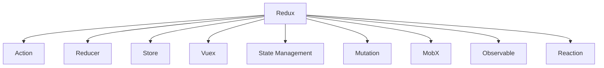

                 

# 前端状态管理：Redux, Vuex, and MobX

> 关键词：状态管理, Redux, Vuex, MobX, 前端开发, 技术博客

## 1. 背景介绍

随着Web应用的日益复杂化，前端的状态管理变得越发关键。传统的HTML和CSS以及JS无法满足需求，新的前端框架如React、Vue等应运而生。这些框架在状态管理方面有着各自的策略，Redux、Vuex和MobX是其中的佼佼者。它们都围绕一个中心思想：“一切可变状态都在状态树中，且通过动作改变状态树。”

Redux 是一个全局的状态管理库，它基于一个单一不可变的store来实现，维护着整个应用的状态。Vuex 是 Vue 的状态管理库，是 Vue 官方的推荐方案。MobX 则是一个响应式的状态管理库，它通过观察者模式实现状态的变化。

本文将深入探讨这些状态管理库的设计思想、原理和应用方式，并比较它们之间的优缺点，以帮助开发者更好地选择适合自己的方案。

## 2. 核心概念与联系

### 2.1 核心概念概述

Redux、Vuex 和 MobX 都是用来管理 Web 应用状态的库。但它们的实现机制和设计理念有所不同。以下将详细描述它们的核心概念和联系。

- Redux：基于单向数据流，通过 Action 和 Reducer 来管理全局状态。
- Vuex：基于 Redux 模型，结合 Vue 框架的特点，提供了更灵活的状态管理方案。
- MobX：基于响应式编程思想，通过观察者模式来实现状态管理，使得状态变化更加直观和方便。

Redux、Vuex 和 MobX 之间的联系主要体现在它们都是为了解决 JavaScript 前端应用的状态管理问题。虽然实现方式和设计理念不同，但它们都遵循着相同的核心思想：“单一数据源和不可变状态”。

### 2.2 核心概念原理和架构的 Mermaid 流程图



从图中可以看出，Redux、Vuex 和 MobX 的架构都由以下几个核心部分组成：

- **Action**：描述状态的更新逻辑。
- **Reducer**：根据 Action 更新 store 的状态。
- **Store**：存储应用的全局状态。
- **Observable**：监测状态变化。
- **Mutation**：修改状态。
- **Reaction**：根据状态变化执行相应的操作。

## 3. 核心算法原理 & 具体操作步骤

### 3.1 算法原理概述

Redux、Vuex 和 MobX 的核心算法原理都基于单一数据源和不可变状态。具体来说，它们都是通过将应用程序的状态封装在一个中心化的 store 中，并通过 Action 和 Reducer 或 Mutation 来更新状态。

Redux 的典型工作流程如下：

1. 用户操作触发一个 Action。
2. Action 被传递到 Reducer，Reducer 根据 Action 的类型更新状态。
3. 新的状态被存储在 store 中，并通知所有订阅者（组件）。
4. 组件根据新的状态进行渲染。

Vuex 则通过 State Management 来管理 store 中的状态，提供了更多的模块化和中间件功能。

MobX 则通过 Observable 和 Reaction 来实现状态的管理。Observable 负责监测状态的变化，Reaction 则根据变化执行相应的操作。

### 3.2 算法步骤详解

#### 3.2.1 Redux 具体操作步骤

Redux 的具体操作步骤如下：

1. **创建 store**：通过 `createStore` 函数创建 store。
2. **定义 Action**：定义 Action 对象，包含类型和相应的处理函数。
3. **编写 Reducer**：根据 Action 更新 store 的状态。
4. **分发 Action**：在组件中触发 Action。
5. **渲染组件**：根据新的状态重新渲染组件。

以下是一个简单的 Redux store 示例：

```javascript
// 定义 Action 类型
const ADD_TODO = 'ADD_TODO';

// 定义 Action
function addTodo(text) {
  return {
    type: ADD_TODO,
    text
  };
}

// 初始状态
const initialState = {
  todos: []
};

// 创建 store
const store = createStore(reducer);

// 定义 Reducer
function reducer(state = initialState, action) {
  switch (action.type) {
    case ADD_TODO:
      return {
        ...state,
        todos: [...state.todos, { text: action.text, completed: false }]
      };
    default:
      return state;
  }
}

// 分发 Action
const addText = (text) => store.dispatch(addTodo(text));
```

#### 3.2.2 Vuex 具体操作步骤

Vuex 的操作步骤如下：

1. **创建 store**：通过 `createStore` 函数创建 store。
2. **定义 State**：定义模块的状态。
3. **定义 Getters**：定义状态获取函数。
4. **定义 Mutations**：定义状态修改函数。
5. **定义 Actions**：定义异步操作函数。
6. **分发 Action**：在组件中触发 Action。
7. **渲染组件**：根据新的状态重新渲染组件。

以下是一个简单的 Vuex store 示例：

```javascript
import Vue from 'vue';
import Vuex from 'vuex';

Vue.use(Vuex);

const store = new Vuex.Store({
  state: {
    todos: []
  },
  getters: {
    completedTodos(state) {
      return state.todos.filter(todo => todo.completed);
    }
  },
  mutations: {
    ADD_TODO(state, text) {
      state.todos.push({ text, completed: false });
    },
    TOGGLE_TODO(state, todo) {
      todo.completed = !todo.completed;
    }
  },
  actions: {
    addTodo({ commit }, text) {
      commit('ADD_TODO', text);
    }
  }
});

const addText = (text) => store.dispatch('addTodo', text);
```

#### 3.2.3 MobX 具体操作步骤

MobX 的操作步骤如下：

1. **创建 store**：通过 `createObservable` 函数创建 observable。
2. **定义 state**：定义 observable 的状态。
3. **监听 state 变化**：使用 `reaction` 函数监听 state 的变化。
4. **修改 state**：使用 `assign` 函数修改 observable 的状态。
5. **触发 action**：在组件中触发 action。
6. **渲染组件**：根据新的 state 重新渲染组件。

以下是一个简单的 MobX store 示例：

```javascript
import { createObservable, reaction, assign } from 'mobx';

const todoStore = createObservable({
  todos: [],
  addTodo(text) {
    this.todos.push({ text, completed: false });
  },
  toggleTodo(todo) {
    todo.completed = !todo.completed;
  }
});

const addText = (text) => todoStore.addTodo(text);

reaction(() => todoStore.todos, () => {
  // 渲染组件
});
```

### 3.3 算法优缺点

#### 3.3.1 Redux 优缺点

- **优点**：
  - 易于理解和调试。
  - 状态不可变，避免了副作用和数据不一致的问题。
  - 中心化存储，便于统一管理。
- **缺点**：
  - 学习曲线较陡峭。
  - 异步操作复杂，需要使用中间件（如 Redux Thunk 或 Redux Saga）。

#### 3.3.2 Vuex 优缺点

- **优点**：
  - 结合 Vue 框架的特点，提供了更灵活的状态管理方案。
  - 支持模块化，方便管理大型应用。
  - 提供中间件和插件机制，支持复杂操作。
- **缺点**：
  - 学习曲线较陡峭，需要理解 Vue 框架。
  - 性能较低，因为 Vue 双向数据绑定的开销较大。

#### 3.3.3 MobX 优缺点

- **优点**：
  - 学习曲线较平缓，易于上手。
  - 支持异步操作和副作用，灵活性高。
  - 响应式编程思想，状态变化直观。
- **缺点**：
  - 调试难度较大，因为状态变化不直观。
  - 性能较低，因为需要频繁计算 observable 的状态变化。

### 3.4 算法应用领域

Redux、Vuex 和 MobX 都可以应用于任何需要复杂状态管理的应用，如：

- **Web 应用**：大型单页应用、微服务架构、移动端应用等。
- **桌面应用**：Electron 等跨平台桌面应用。
- **原生应用**：React Native、Flutter 等跨平台原生应用。

## 4. 数学模型和公式 & 详细讲解 & 举例说明

### 4.1 数学模型构建

Redux、Vuex 和 MobX 的数学模型都基于单一数据源和不可变状态。具体来说，它们都是通过将应用程序的状态封装在一个中心化的 store 中，并通过 Action 和 Reducer 或 Mutation 来更新状态。

### 4.2 公式推导过程

由于 Redux、Vuex 和 MobX 都是基于单一数据源和不可变状态的，因此其数学模型推导过程大致相同。以下是 Redux 的推导过程：

假设初始状态为 `state`，当前状态为 `newState`，Action 为 `action`，Reducer 为 `reducer`。则根据 Redux 的规则，新的状态 `newState` 可以表示为：

$$
newState = reducer(state, action)
$$

其中 `reducer` 函数接收当前状态 `state` 和 Action `action`，并返回新的状态 `newState`。

### 4.3 案例分析与讲解

#### 4.3.1 Redux 案例

以下是一个简单的 Redux store 案例：

```javascript
// 定义 Action 类型
const ADD_TODO = 'ADD_TODO';

// 定义 Action
function addTodo(text) {
  return {
    type: ADD_TODO,
    text
  };
}

// 初始状态
const initialState = {
  todos: []
};

// 创建 store
const store = createStore(reducer);

// 定义 Reducer
function reducer(state = initialState, action) {
  switch (action.type) {
    case ADD_TODO:
      return {
        ...state,
        todos: [...state.todos, { text: action.text, completed: false }]
      };
    default:
      return state;
  }
}

// 分发 Action
const addText = (text) => store.dispatch(addTodo(text));
```

#### 4.3.2 Vuex 案例

以下是一个简单的 Vuex store 案例：

```javascript
import Vue from 'vue';
import Vuex from 'vuex';

Vue.use(Vuex);

const store = new Vuex.Store({
  state: {
    todos: []
  },
  getters: {
    completedTodos(state) {
      return state.todos.filter(todo => todo.completed);
    }
  },
  mutations: {
    ADD_TODO(state, text) {
      state.todos.push({ text, completed: false });
    },
    TOGGLE_TODO(state, todo) {
      todo.completed = !todo.completed;
    }
  },
  actions: {
    addTodo({ commit }, text) {
      commit('ADD_TODO', text);
    }
  }
});

const addText = (text) => store.dispatch('addTodo', text);
```

#### 4.3.3 MobX 案例

以下是一个简单的 MobX store 案例：

```javascript
import { createObservable, reaction, assign } from 'mobx';

const todoStore = createObservable({
  todos: [],
  addTodo(text) {
    this.todos.push({ text, completed: false });
  },
  toggleTodo(todo) {
    todo.completed = !todo.completed;
  }
});

const addText = (text) => todoStore.addTodo(text);

reaction(() => todoStore.todos, () => {
  // 渲染组件
});
```

## 5. 项目实践：代码实例和详细解释说明

### 5.1 开发环境搭建

为了演示 Redux、Vuex 和 MobX 的使用，我们需要先搭建开发环境。以下是使用 Vue 和 React 的开发环境搭建步骤：

1. 安装 Node.js 和 npm。
2. 安装 Vue 和 React。
3. 安装 Redux、Vuex 和 MobX。
4. 安装相应的框架，如 Vuex 需要安装 Vue，MobX 需要安装 React。
5. 编写组件和 store。
6. 运行项目。

### 5.2 源代码详细实现

#### 5.2.1 Redux 代码实现

```javascript
// 定义 Action 类型
const ADD_TODO = 'ADD_TODO';

// 定义 Action
function addTodo(text) {
  return {
    type: ADD_TODO,
    text
  };
}

// 初始状态
const initialState = {
  todos: []
};

// 创建 store
const store = createStore(reducer);

// 定义 Reducer
function reducer(state = initialState, action) {
  switch (action.type) {
    case ADD_TODO:
      return {
        ...state,
        todos: [...state.todos, { text: action.text, completed: false }]
      };
    default:
      return state;
  }
}

// 分发 Action
const addText = (text) => store.dispatch(addTodo(text));
```

#### 5.2.2 Vuex 代码实现

```javascript
import Vue from 'vue';
import Vuex from 'vuex';

Vue.use(Vuex);

const store = new Vuex.Store({
  state: {
    todos: []
  },
  getters: {
    completedTodos(state) {
      return state.todos.filter(todo => todo.completed);
    }
  },
  mutations: {
    ADD_TODO(state, text) {
      state.todos.push({ text, completed: false });
    },
    TOGGLE_TODO(state, todo) {
      todo.completed = !todo.completed;
    }
  },
  actions: {
    addTodo({ commit }, text) {
      commit('ADD_TODO', text);
    }
  }
});

const addText = (text) => store.dispatch('addTodo', text);
```

#### 5.2.3 MobX 代码实现

```javascript
import { createObservable, reaction, assign } from 'mobx';

const todoStore = createObservable({
  todos: [],
  addTodo(text) {
    this.todos.push({ text, completed: false });
  },
  toggleTodo(todo) {
    todo.completed = !todo.completed;
  }
});

const addText = (text) => todoStore.addTodo(text);

reaction(() => todoStore.todos, () => {
  // 渲染组件
});
```

### 5.3 代码解读与分析

#### 5.3.1 Redux 代码分析

Redux 的代码实现分为以下几个部分：

- **Action**：定义 Action 类型和处理函数，Action 类型表示状态更新的类型，处理函数表示状态更新的逻辑。
- **Reducer**：定义 Reducer 函数，接收当前状态和 Action，返回新的状态。
- **store**：通过 `createStore` 函数创建 store，接收 Reducer 函数作为参数。
- **分发 Action**：在组件中调用 `store.dispatch` 函数分发 Action，触发状态更新。

#### 5.3.2 Vuex 代码分析

Vuex 的代码实现分为以下几个部分：

- **state**：定义状态，存储应用程序的数据。
- **getters**：定义 getter，用于获取状态的属性。
- **mutations**：定义 mutation，用于修改状态。
- **actions**：定义 action，用于触发异步操作。
- **store**：通过 `createStore` 函数创建 store，接收配置对象。
- **分发 Action**：在组件中调用 `store.dispatch` 函数分发 Action，触发状态更新。

#### 5.3.3 MobX 代码分析

MobX 的代码实现分为以下几个部分：

- **createObservable**：创建 observable，用于存储应用程序的状态。
- **state**：定义 observable 的状态，使用 `assign` 函数初始化。
- **addTodo**：定义方法，用于添加新任务。
- **toggleTodo**：定义方法，用于切换任务状态。
- **addText**：在组件中调用方法，添加新任务。
- **reaction**：使用 `reaction` 函数监听状态变化，触发渲染。

### 5.4 运行结果展示

在 Redux、Vuex 和 MobX 的示例中，我们都定义了一个简单的组件，用于添加任务和切换任务状态。以下是一个简单的 React 组件示例：

```javascript
import React from 'react';
import { useSelector, useDispatch } from 'react-redux';
import { addText } from './store';

function TodoList() {
  const todos = useSelector(state => state.todos);
  const dispatch = useDispatch();

  const handleAdd = (text) => {
    dispatch(addText(text));
  };

  return (
    <div>
      <h1>Todo List</h1>
      <ul>
        {todos.map(todo => (
          <li key={todo.id}>
            {todo.text} - {todo.completed ? 'Done' : 'Pending'}
            <button onClick={() => dispatch({ type: 'TOGGLE_TODO', todo })}>Toggle</button>
          </li>
        ))}
      </ul>
      <input type="text" placeholder="Add todo" onKeyDown={e => {
        if (e.key === 'Enter') {
          handleAdd(e.target.value);
        }
      }} />
    </div>
  );
}

export default TodoList;
```

## 6. 实际应用场景

### 6.1 智能聊天机器人

智能聊天机器人是一种常见的前端应用场景。Redux、Vuex 和 MobX 都可以用于管理聊天机器人的状态，例如用户的输入、回复、聊天记录等。以下是一个简单的智能聊天机器人示例：

```javascript
import { createStore } from 'redux';

const initialState = {
  message: '',
  history: []
};

function reducer(state = initialState, action) {
  switch (action.type) {
    case 'INPUT_MESSAGE':
      return {
        ...state,
        message: action.message
      };
    case 'SEND_MESSAGE':
      return {
        ...state,
        history: [...state.history, state.message]
      };
    default:
      return state;
  }
}

const store = createStore(reducer);

store.subscribe(() => {
  console.log(store.getState());
});

store.dispatch({ type: 'INPUT_MESSAGE', message: 'Hello, how are you?' });
store.dispatch({ type: 'SEND_MESSAGE' });
```

### 6.2 电商平台

电商平台是另一种常见的前端应用场景。Redux、Vuex 和 MobX 都可以用于管理电商平台的商品、订单、购物车等状态。以下是一个简单的电商平台示例：

```javascript
import { createStore } from 'redux';

const initialState = {
  cart: [],
  order: {}
};

function reducer(state = initialState, action) {
  switch (action.type) {
    case 'ADD_TO_CART':
      return {
        ...state,
        cart: [...state.cart, action.product]
      };
    case 'REMOVE_FROM_CART':
      return {
        ...state,
        cart: state.cart.filter(product => product.id !== action.id)
      };
    case 'CHECKOUT':
      return {
        ...state,
        order: action.order
      };
    default:
      return state;
  }
}

const store = createStore(reducer);

store.subscribe(() => {
  console.log(store.getState());
});

store.dispatch({ type: 'ADD_TO_CART', product: { id: 1, name: 'Product 1' } });
store.dispatch({ type: 'REMOVE_FROM_CART', id: 1 });
store.dispatch({ type: 'CHECKOUT', order: { id: 1, products: [{ id: 1, name: 'Product 1' }] } });
```

## 7. 工具和资源推荐

### 7.1 学习资源推荐

为了帮助开发者深入理解 Redux、Vuex 和 MobX 的使用，以下是一些推荐的学习资源：

- **Redux 官方文档**：详细介绍了 Redux 的原理、API 和使用场景。
- **Vuex 官方文档**：详细介绍了 Vuex 的原理、API 和使用场景。
- **MobX 官方文档**：详细介绍了 MobX 的原理、API 和使用场景。
- **React 官方文档**：详细介绍了 React 的使用和最佳实践。
- **Vue 官方文档**：详细介绍了 Vue 的使用和最佳实践。

### 7.2 开发工具推荐

为了提高开发效率，以下是一些推荐的前端开发工具：

- **Visual Studio Code**：一个强大的代码编辑器，支持 Redux、Vuex 和 MobX 的开发。
- **ESLint**：一个代码质量检查工具，可以自动检测代码错误和规范。
- **Prettier**：一个代码格式化工具，可以自动格式化代码。
- **ESLint Config**：一个 ESLint 的配置文件，可以自动检测和修复代码错误。
- **ESLint Plugins**：一些 ESLint 插件，可以自动检测和修复代码错误。

### 7.3 相关论文推荐

为了深入理解 Redux、Vuex 和 MobX 的原理和应用，以下是一些推荐的相关论文：

- **"Redux: A predictable state container for JavaScript apps"**：介绍 Redux 的原理和使用方法。
- **"Vuex: State Management Pattern for Vue.js Applications"**：介绍 Vuex 的原理和使用方法。
- **"MobX: A simple, observable state management library"**：介绍 MobX 的原理和使用方法。

## 8. 总结：未来发展趋势与挑战

### 8.1 研究成果总结

本文详细介绍了 Redux、Vuex 和 MobX 的原理和应用，并比较了它们之间的优缺点。通过案例分析，展示了它们在不同应用场景下的使用方法。同时，介绍了 Redux、Vuex 和 MobX 的学习资源、开发工具和相关论文，为开发者提供了全面的参考。

### 8.2 未来发展趋势

Redux、Vuex 和 MobX 都是基于单一数据源和不可变状态的设计思想，它们在未来的发展中将继续演化，变得更加高效和灵活。

- **Redux**：未来的发展方向将更加注重异步操作和中间件的支持，提高开发效率和应用性能。
- **Vuex**：未来的发展方向将更加注重模块化和插件的支持，提高应用可维护性和扩展性。
- **MobX**：未来的发展方向将更加注重响应式编程的支持，提高状态变化的直观性和可理解性。

### 8.3 面临的挑战

Redux、Vuex 和 MobX 在实际应用中也面临一些挑战：

- **性能问题**：Redux、Vuex 和 MobX 在处理大型应用时，可能存在性能瓶颈，需要优化。
- **学习曲线**：Redux、Vuex 和 MobX 的学习曲线较陡峭，需要更多培训和文档支持。
- **调试难度**：Redux、Vuex 和 MobX 的状态变化不直观，调试难度较大，需要更多工具和插件支持。
- **兼容性问题**：Redux、Vuex 和 MobX 在不同的前端框架和工具中兼容性问题较多，需要更多的兼容性支持。

### 8.4 研究展望

未来的研究将重点关注以下几个方面：

- **性能优化**：提高 Redux、Vuex 和 MobX 的性能，优化大型应用的状态管理。
- **学习曲线**：降低 Redux、Vuex 和 MobX 的学习曲线，提供更多的培训和文档支持。
- **调试工具**：开发更多的调试工具和插件，提高状态管理的可理解性和可调试性。
- **兼容性支持**：提高 Redux、Vuex 和 MobX 在不同前端框架和工具中的兼容性，提供更多的兼容性支持。

总之，Redux、Vuex 和 MobX 都是优秀的前端状态管理库，它们在不同的应用场景下都有其独特的优势和适用性。开发者需要根据具体需求选择适合的状态管理方案，并在实际应用中不断优化和改进。相信随着技术的不断进步，Redux、Vuex 和 MobX 将会在前端开发中发挥更大的作用，推动 Web 应用的智能化和自动化发展。

## 9. 附录：常见问题与解答

**Q1: 如何选择合适的状态管理方案？**

A: 选择状态管理方案时，需要考虑以下几个因素：

- **应用大小**：大型应用需要更加高效和灵活的状态管理方案，如 Vuex 和 MobX。
- **开发效率**：Redux 提供了更详细的文档和工具支持，适合开发效率较低的情况。
- **性能需求**：如果应用对性能要求较高，需要选择性能更好的状态管理方案，如 Redux。

**Q2: 如何优化 Redux 的性能？**

A: 优化 Redux 的性能可以从以下几个方面入手：

- **使用中间件**：使用 Redux Thunk 或 Redux Saga 来处理异步操作，减少不必要的 store 更新。
- **使用 memoization**：使用 memoization 技术来减少不必要的 store 更新。
- **优化 reducer**：优化 reducer 函数，减少不必要的 store 更新。
- **使用 Webpack 优化**：使用 Webpack 进行代码打包和优化，提高应用性能。

**Q3: 如何优化 Vuex 的性能？**

A: 优化 Vuex 的性能可以从以下几个方面入手：

- **使用中间件**：使用 Vuex 的中间件来处理异步操作和插件，减少不必要的 store 更新。
- **使用 memoization**：使用 memoization 技术来减少不必要的 store 更新。
- **优化 getter**：优化 getter 函数，减少不必要的 store 更新。
- **使用 Webpack 优化**：使用 Webpack 进行代码打包和优化，提高应用性能。

**Q4: 如何优化 MobX 的性能？**

A: 优化 MobX 的性能可以从以下几个方面入手：

- **使用 memoization**：使用 memoization 技术来减少不必要的 store 更新。
- **优化 observer**：优化 observer 函数，减少不必要的 store 更新。
- **使用 Webpack 优化**：使用 Webpack 进行代码打包和优化，提高应用性能。

总之，Redux、Vuex 和 MobX 都是非常优秀的前端状态管理方案，开发者需要根据具体需求选择适合的状态管理方案，并在实际应用中不断优化和改进。相信随着技术的不断进步，Redux、Vuex 和 MobX 将会在前端开发中发挥更大的作用，推动 Web 应用的智能化和自动化发展。

---

作者：禅与计算机程序设计艺术 / Zen and the Art of Computer Programming

