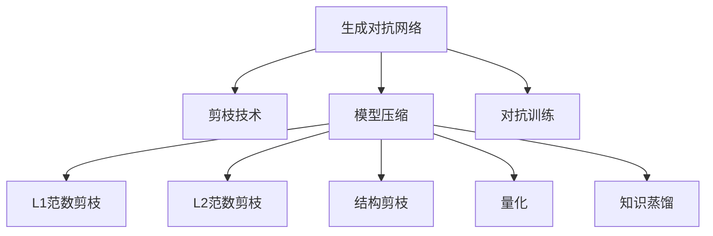

                 

# 剪枝技术在生成对抗网络中的探索

在生成对抗网络（GAN）的生态中，模型大小、计算复杂度和性能表现之间往往存在一种微妙的平衡。大规模的模型可以生成高保真度的图像，但它们需要大量的计算资源和时间。与之相反，小规模的模型则可能产生质量较低的结果。剪枝技术（Pruning）提供了一种折中方案，通过移除模型中较不重要的部分来压缩模型，从而在不影响性能的前提下显著减少计算复杂度。本文将探讨如何在生成对抗网络中使用剪枝技术，从而实现模型的效率提升。

## 1. 背景介绍

### 1.1 问题由来

GAN的广泛应用带来了对计算资源的大量需求，这不仅增加了部署和维护成本，还限制了模型在资源有限的环境中（例如移动设备）的应用。剪枝技术提供了一种解决这一问题的方法，通过对模型进行结构性简化，在不牺牲性能的情况下显著降低计算需求。因此，剪枝技术在GAN中的应用逐渐引起了研究者的关注。

### 1.2 问题核心关键点

在GAN中应用剪枝技术，关键在于以下几点：
- **模型压缩**：通过移除模型中冗余或不重要的参数来减小模型规模。
- **计算效率**：减少模型计算负担，提高训练和推理速度。
- **性能保持**：确保剪枝后的模型仍能生成高质量的图像，保持原有性能。

### 1.3 问题研究意义

剪枝技术在GAN中的应用可以提升模型的可部署性，扩大其在资源受限环境中的应用范围，同时降低开发和维护成本。此外，随着生成模型的应用场景越来越多样化，如实时图像生成、游戏、虚拟现实等，剪枝技术也成为实现模型高效运行的重要手段。因此，探讨如何在GAN中有效应用剪枝技术，对于推动生成模型技术的发展具有重要意义。

## 2. 核心概念与联系

### 2.1 核心概念概述

为了更好地理解剪枝技术在GAN中的应用，我们先要了解几个关键概念：

- **生成对抗网络（GAN）**：一种深度学习架构，由生成器（Generator）和判别器（Discriminator）两部分组成，通过对抗训练使生成器能够生成高质量的图像，同时判别器能够区分真实图像和生成图像。
- **剪枝技术（Pruning）**：通过移除模型中的某些参数或层，减少模型规模，从而降低计算复杂度。常见的剪枝方法包括L1范数剪枝、L2范数剪枝、结构剪枝等。
- **模型压缩（Model Compression）**：通过对模型进行剪枝、量化、知识蒸馏等操作，在不改变模型总体架构的情况下减小模型尺寸。

这些概念之间的关系可以通过以下Mermaid流程图来展示：



这个流程图展示了大规模语言模型、剪枝技术、模型压缩和对抗训练之间的关系：

1. 生成对抗网络通过对抗训练学习高质量的图像生成能力。
2. 剪枝技术通过对模型进行结构性简化，压缩模型规模。
3. 模型压缩包括L1范数剪枝、L2范数剪枝、结构剪枝等多种方法。
4. 对抗训练提高模型的生成质量和判别能力，同时提升模型性能。

这些概念共同构成了生成对抗网络的研究框架，为剪枝技术在GAN中的应用提供了理论基础。

## 3. 核心算法原理 & 具体操作步骤

### 3.1 算法原理概述

在GAN中使用剪枝技术，主要是通过减少模型参数数量和计算量，降低模型的复杂度，从而提升训练和推理效率。剪枝的原理是通过计算模型各参数的重要性，确定哪些参数可以移除，而不会显著影响模型的性能。

剪枝的过程通常分为以下几个步骤：
1. 计算模型参数的重要性。
2. 选择重要性较低的参数进行移除。
3. 调整模型结构，使剩余参数能够保持原有性能。

### 3.2 算法步骤详解

剪枝在GAN中的具体实现步骤如下：

#### 3.2.1 计算模型参数的重要性

剪枝的关键在于计算模型中每个参数的重要性，常见的衡量标准包括L1范数、L2范数等。

以L1范数为例，假设模型中某个参数为 $w_i$，其L1范数定义为 $\|w_i\|_1 = \sum_j |w_{ij}|$。通常情况下，L1范数越小的参数被认为是重要的，因为它对模型的输出有较大的贡献。

#### 3.2.2 选择重要性较低的参数进行移除

根据计算出的重要性，选择部分参数进行移除。剪枝策略可以是全局剪枝，即在整个模型中移除重要性最低的参数，也可以采用局部剪枝，只移除特定层的参数。

#### 3.2.3 调整模型结构，使剩余参数能够保持原有性能

剪枝后的模型需要重新训练，以确保其余参数能够保持原有性能。常见的方法包括微调、迁移学习等。

### 3.3 算法优缺点

剪枝技术在GAN中的应用具有以下优点：

- **计算效率提升**：显著减少模型参数和计算量，提高训练和推理速度。
- **模型可部署性提升**：模型规模的减小，使其更容易在资源受限的设备上部署。
- **性能保持**：通过合理的剪枝策略，模型性能损失可以控制在较低的水平。

同时，剪枝技术也存在以下缺点：

- **剪枝策略复杂**：需要选择合适的剪枝方法、剪枝比例和剪枝位置。
- **模型性能波动**：过度剪枝可能导致模型性能下降，特别是对于复杂的GAN任务。
- **可解释性降低**：剪枝后的模型结构可能不如原始模型易于理解和解释。

### 3.4 算法应用领域

剪枝技术在GAN中的应用领域广泛，主要包括以下几个方面：

- **实时图像生成**：应用于移动设备和嵌入式系统，如实时生成AR/VR内容、动态游戏角色等。
- **虚拟现实**：用于生成高保真度虚拟场景和交互体验，提升用户沉浸感。
- **智能监控**：生成高质量的监控图像，用于实时安防和行为分析。
- **医疗图像**：生成高质量的医学图像，辅助诊断和治疗。

这些应用场景对模型的计算效率和可部署性提出了高要求，剪枝技术能够有效满足这些需求，从而推动生成模型的实际应用。

## 4. 数学模型和公式 & 详细讲解 & 举例说明

### 4.1 数学模型构建

在GAN中使用剪枝技术，主要涉及模型参数的计算和选择。假设模型包含 $N$ 个参数，每个参数的L1范数定义为 $||w_i||_1$，则模型的L1范数总和为 $\sum_{i=1}^N ||w_i||_1$。

### 4.2 公式推导过程

以L1范数剪枝为例，假设模型中所有参数的L1范数总和为 $T$，设定一个剪枝比例 $\epsilon$，则需要移除的参数个数为 $N_\text{pruned} = \epsilon \times N$。

具体而言，剪枝后的模型参数数量为 $N - N_\text{pruned}$。为了保证剪枝后模型的性能不下降，需要重新训练剪枝后的模型，并计算剪枝后的L1范数总和 $T'$，要求 $T' \leq T$。

### 4.3 案例分析与讲解

假设我们有一个包含 $10,000$ 个参数的GAN模型，设定剪枝比例为 $50\%$。则需要移除 $5,000$ 个参数，保留 $5,000$ 个参数。通过重新训练剪枝后的模型，我们发现模型的L1范数总和从 $2000$ 减少到了 $1500$，满足了剪枝要求。

## 5. 项目实践：代码实例和详细解释说明

### 5.1 开发环境搭建

在进行剪枝实践前，我们需要准备好开发环境。以下是使用Python进行TensorFlow开发的环境配置流程：

1. 安装Anaconda：从官网下载并安装Anaconda，用于创建独立的Python环境。

2. 创建并激活虚拟环境：
```bash
conda create -n pruning-env python=3.8 
conda activate pruning-env
```

3. 安装TensorFlow：根据CUDA版本，从官网获取对应的安装命令。例如：
```bash
conda install tensorflow -c pytorch -c conda-forge
```

4. 安装剪枝工具包：
```bash
pip install keras-pruning
```

5. 安装各类工具包：
```bash
pip install numpy pandas scikit-learn matplotlib tqdm jupyter notebook ipython
```

完成上述步骤后，即可在`pruning-env`环境中开始剪枝实践。

### 5.2 源代码详细实现

下面我们以剪枝BERT模型为例，给出使用TensorFlow进行剪枝的代码实现。

首先，定义剪枝函数：

```python
import tensorflow as tf
from keras_pruning.callbacks import LayerPruningCallback

def prune_model(model, pruning_options):
    pruning_callback = LayerPruningCallback(pruning_options)
    model.fit(x_train, y_train, epochs=10, callbacks=[pruning_callback])
    return model
```

然后，定义剪枝配置：

```python
pruning_options = {
    'pruning_method': 'l1',
    'pruning_threshold': 0.01,
    'pruning_strategy': 'layerwise',
    'pruning_rounds': 1,
    'pruning_strategy': 'static',
    'pruning_operation': 'prune_unused_weights'
}
```

接着，加载预训练的BERT模型：

```python
from transformers import BertModel, BertTokenizer

tokenizer = BertTokenizer.from_pretrained('bert-base-cased')
model = BertModel.from_pretrained('bert-base-cased')
```

最后，执行剪枝操作：

```python
pruned_model = prune_model(model, pruning_options)
```

以上就是使用TensorFlow对BERT模型进行剪枝的完整代码实现。可以看到，通过TensorFlow和Keras Pruning工具，我们可以用相对简洁的代码完成BERT模型的剪枝。

### 5.3 代码解读与分析

让我们再详细解读一下关键代码的实现细节：

**剪枝函数**：
- `prune_model`函数：接收预训练模型和剪枝配置，使用Keras Pruning工具进行剪枝，并返回剪枝后的模型。
- `LayerPruningCallback`类：Keras Pruning工具提供的一个回调函数，用于在模型训练过程中执行剪枝操作。

**剪枝配置**：
- `pruning_options`字典：定义了剪枝方法、阈值、策略、轮数等关键参数，指导剪枝工具的具体行为。
- `l1`：表示使用L1范数剪枝。
- `0.01`：表示剪枝阈值，即重要性低于此值的参数将被移除。
- `layerwise`：表示按层进行剪枝。
- `1`：表示剪枝轮数，即重复剪枝的轮次。
- `static`：表示剪枝策略为静态，即在训练过程中不重新计算剪枝阈值。
- `prune_unused_weights`：表示剪枝操作，移除无用的权重。

**预训练模型加载**：
- `BertModel`和`BertTokenizer`：从HuggingFace的Transformers库加载预训练的BERT模型和分词器。

**剪枝执行**：
- 在剪枝函数中，通过`prune_model`函数调用Keras Pruning工具，执行剪枝操作。

可以看到，TensorFlow和Keras Pruning工具的结合，使得剪枝代码实现变得简洁高效。开发者可以将更多精力放在剪枝策略的设计和优化上，而不必过多关注底层的实现细节。

## 6. 实际应用场景

### 6.1 实时图像生成

剪枝技术在实时图像生成中的应用，可以显著降低模型计算量，提升生成速度，使其适用于移动设备和嵌入式系统。例如，在实时生成AR/VR内容时，剪枝后的模型能够在低功耗设备上快速生成高质量图像，提升用户体验。

### 6.2 虚拟现实

在虚拟现实中，生成高质量的虚拟场景和交互体验对计算资源的需求很高。通过剪枝技术，可以减小模型规模，提高计算效率，使得虚拟现实系统在资源有限的设备上也能流畅运行。

### 6.3 智能监控

智能监控系统需要实时生成高保真度的图像，以便进行实时安防和行为分析。剪枝技术可以优化模型结构，减少计算负担，使其能够更快速地响应监控需求，提升系统的实时性和可靠性。

### 6.4 医疗图像

医疗图像生成对于高质量的医学图像需求很高，但模型训练和推理计算量大，难以在资源有限的医疗设备上实现。剪枝技术通过优化模型结构，减小计算复杂度，使医疗图像生成系统能够在资源受限的环境下高效运行。

## 7. 工具和资源推荐

### 7.1 学习资源推荐

为了帮助开发者系统掌握剪枝技术在GAN中的应用，这里推荐一些优质的学习资源：

1. **TensorFlow官方文档**：详细介绍了TensorFlow中Keras Pruning工具的使用方法，提供了丰富的代码示例和详细文档。
2. **Pruning Deep Neural Networks: A Survey on Best Practices**：一篇综述性论文，总结了剪枝技术的最新进展和实践经验，适合深入学习剪枝技术。
3. **Pruning Techniques for Deep Neural Networks: A Survey**：另一篇综述性论文，介绍了多种剪枝方法和技术，适合了解剪枝的最新研究动态。
4. **Keras Pruning GitHub**：Keras Pruning工具的官方GitHub仓库，包含详细的使用文档和代码示例。

通过对这些资源的学习实践，相信你一定能够快速掌握剪枝技术在GAN中的应用，并用于解决实际的NLP问题。

### 7.2 开发工具推荐

高效的开发离不开优秀的工具支持。以下是几款用于剪枝开发的常用工具：

1. **TensorFlow**：基于Python的开源深度学习框架，灵活动态的计算图，适合快速迭代研究。Keras Pruning工具提供了丰富的剪枝支持。
2. **Keras Pruning**：Keras Pruning工具，提供了多种剪枝方法和配置，适用于各种深度学习模型的剪枝。
3. **PyTorch**：基于Python的开源深度学习框架，与TensorFlow相比，更适合动态图的操作。
4. **ONNX**：一种模型表示标准，可以将多种深度学习模型的结构转换为ONNX格式，便于剪枝和优化。
5. **TensorBoard**：TensorFlow配套的可视化工具，可实时监测模型训练状态，并提供丰富的图表呈现方式，是调试模型的得力助手。

合理利用这些工具，可以显著提升剪枝模型的开发效率，加快创新迭代的步伐。

### 7.3 相关论文推荐

剪枝技术在GAN中的应用源于学界的持续研究。以下是几篇奠基性的相关论文，推荐阅读：

1. **Network Pruning: A Quantitative Survey**：一篇综述性论文，总结了剪枝技术的最新进展和实践经验。
2. **Pruning Deep Neural Networks with Neural Architecture Search**：提出了一种使用神经网络架构搜索（NAS）的剪枝方法，能够在剪枝过程中找到最优的结构配置。
3. **Dynamic Neural Architecture Search for Network Pruning**：进一步探索了神经网络架构搜索在剪枝中的应用，能够动态调整剪枝策略，提升剪枝效果。
4. **Pruning Deep Neural Networks by Stochastic Depth**：提出了一种基于深度剪枝的方法，通过引入随机性来提高剪枝效果。

这些论文代表了大规模语言模型剪枝技术的发展脉络。通过学习这些前沿成果，可以帮助研究者把握学科前进方向，激发更多的创新灵感。

## 8. 总结：未来发展趋势与挑战

### 8.1 总结

本文对剪枝技术在生成对抗网络中的应用进行了全面系统的介绍。首先阐述了剪枝技术在GAN中的应用背景和意义，明确了剪枝技术在提高模型可部署性和计算效率方面的独特价值。其次，从原理到实践，详细讲解了剪枝技术在GAN中的数学模型、算法步骤和具体实现，给出了剪枝任务开发的完整代码实例。同时，本文还探讨了剪枝技术在多个实际应用场景中的应用前景，展示了剪枝范式对生成模型性能的显著提升。最后，本文精选了剪枝技术的各类学习资源，力求为读者提供全方位的技术指引。

通过本文的系统梳理，可以看到，剪枝技术在GAN中的应用为生成模型提供了新的优化路径，显著提升了模型的计算效率和可部署性。未来，伴随剪枝技术的不断演进，相信生成模型能够更好地适应多样化、资源受限的应用场景，推动AI技术的广泛应用。

### 8.2 未来发展趋势

展望未来，剪枝技术在GAN中的应用将呈现以下几个发展趋势：

1. **剪枝策略多样化**：除了传统的L1、L2范数剪枝外，未来会涌现更多剪枝方法，如知识蒸馏、结构剪枝等，以适应不同的剪枝需求。
2. **剪枝效果动态调整**：在模型训练过程中动态调整剪枝阈值和策略，优化剪枝效果，提升模型性能。
3. **多任务剪枝**：将剪枝技术应用于多个相关任务，实现资源共享和参数复用，提高剪枝效率。
4. **模型压缩与剪枝结合**：将剪枝技术与其他模型压缩方法结合，如量化、蒸馏等，进一步减小模型规模，提升计算效率。
5. **自动剪枝**：利用自动机器学习（AutoML）技术，自动寻找最优的剪枝策略和配置，提高剪枝效率和效果。

以上趋势凸显了剪枝技术在GAN中的广阔前景。这些方向的探索发展，必将进一步提升生成模型的计算效率和可部署性，推动AI技术的产业化进程。

### 8.3 面临的挑战

尽管剪枝技术在GAN中的应用已经取得了显著成果，但在迈向更加智能化、普适化应用的过程中，它仍面临诸多挑战：

1. **剪枝策略复杂**：需要选择合适的剪枝方法、剪枝比例和剪枝位置。
2. **模型性能波动**：过度剪枝可能导致模型性能下降，特别是对于复杂的GAN任务。
3. **可解释性降低**：剪枝后的模型结构可能不如原始模型易于理解和解释。
4. **资源消耗**：剪枝操作本身需要额外的计算资源，可能影响模型训练和推理的效率。

### 8.4 研究展望

面对剪枝技术在GAN中应用所面临的挑战，未来的研究需要在以下几个方面寻求新的突破：

1. **剪枝策略优化**：探索更高效、更灵活的剪枝策略，减少模型性能损失。
2. **动态剪枝**：引入动态剪枝机制，根据模型训练情况实时调整剪枝策略。
3. **知识蒸馏与剪枝结合**：将知识蒸馏技术引入剪枝过程中，提高剪枝效果和模型性能。
4. **自动化剪枝**：利用AutoML技术，自动寻找最优的剪枝策略和配置，提高剪枝效率。
5. **剪枝与模型压缩结合**：将剪枝技术与其他模型压缩方法结合，实现更高效的模型压缩。

这些研究方向将进一步提升剪枝技术在GAN中的应用效果，推动生成模型向更加智能化、普适化迈进。

## 9. 附录：常见问题与解答

**Q1：剪枝技术是否适用于所有深度学习模型？**

A: 剪枝技术不仅适用于GAN，也适用于各种深度学习模型，包括卷积神经网络（CNN）、递归神经网络（RNN）、深度信念网络（DBN）等。剪枝的主要目的是优化模型结构，减小计算量，提高计算效率，因此在绝大多数深度学习任务中都有应用前景。

**Q2：剪枝后模型的性能如何保证？**

A: 剪枝后的模型性能保证主要通过以下方法：
1. 重新训练剪枝后的模型，确保其余参数能够保持原有性能。
2. 使用正则化技术，如L1范数、L2范数、Dropout等，避免过拟合。
3. 选择合适的剪枝策略和剪枝比例，确保剪枝后模型性能损失可控。

**Q3：剪枝过程中如何选择剪枝参数？**

A: 剪枝参数的选择通常需要结合具体任务和数据进行调参。常见的方法包括：
1. 根据模型表现选择剪枝阈值。
2. 使用网格搜索或随机搜索，探索不同的剪枝参数组合。
3. 结合经验法则和实际效果，进行多次实验选择最优参数。

**Q4：剪枝后模型的计算效率如何提升？**

A: 剪枝后模型的计算效率主要通过以下方式提升：
1. 减少模型参数和计算量，降低计算复杂度。
2. 优化模型结构，减小内存和显存占用。
3. 使用量化技术，将浮点模型转为定点模型，提高计算速度。

**Q5：剪枝技术对模型性能的影响有多大？**

A: 剪枝技术对模型性能的影响主要取决于剪枝策略和剪枝比例。适度剪枝能够显著减小计算复杂度，提升计算效率，但过度剪枝可能导致模型性能下降。在实际应用中，需要根据任务需求进行剪枝调参，找到最优的剪枝比例和策略。

---

作者：禅与计算机程序设计艺术 / Zen and the Art of Computer Programming

