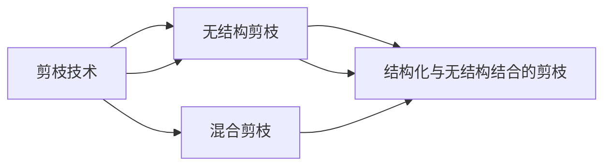

                 

## 1. 背景介绍

神经网络在深度学习中的应用无处不在，从图像识别、语音识别到自然语言处理等领域，都取得了显著的成功。然而，随着神经网络层数和参数量的增加，其计算和存储开销也大幅增加，这不仅增加了训练成本，也限制了模型在资源受限设备上的部署。此外，过多的冗余参数可能导致模型过拟合，降低模型的泛化能力。因此，剪枝（Pruning）技术作为神经网络优化的一项重要手段，具有重要的理论和实际意义。

剪枝技术通过识别和移除神经网络中的冗余参数，减少模型的复杂度和计算量，从而提高模型的训练和推理效率，降低资源消耗，并且可以增强模型的泛化能力。在实际应用中，剪枝技术还被广泛用于模型压缩、加速模型训练和推理、优化模型大小等场景。

## 2. 核心概念与联系

### 2.1 核心概念概述

剪枝（Pruning）是指通过移除神经网络中的一部分参数，减少网络复杂度，从而达到提高模型效率和性能的目的。剪枝技术通常分为三种类型：

1. **结构化剪枝（Structured Pruning）**：基于特定结构或子网络的模式，识别并移除冗余权重。如剪枝卷积层中的滤波器、剪枝全连接层中的节点等。
2. **无结构剪枝（Unstructured Pruning）**：随机或基于某种准则移除单个权重，不考虑其所在的网络结构。
3. **混合剪枝（Hybrid Pruning）**：结合结构化剪枝和无结构剪枝的优点，在网络中既去除冗余的结构，也删除冗余的权重。

### 2.2 核心概念原理和架构的 Mermaid 流程图



该图展示了剪枝技术的三种主要类型及其在神经网络中的应用。结构化剪枝、无结构剪枝和混合剪枝分别对应了不同类型的剪枝方法。

## 3. 核心算法原理 & 具体操作步骤

### 3.1 算法原理概述

剪枝技术的核心思想是识别和移除神经网络中的冗余权重。冗余权重指的是那些对模型的性能影响较小的权重，移除这些权重可以显著减少网络的计算量和存储需求。

剪枝过程一般分为以下几个步骤：

1. **剪枝准则**：确定用于识别冗余权重的准则。常见的准则包括L1范数、L2范数、神经元激活值等。
2. **剪枝策略**：确定移除冗余权重的方式。常见的策略包括硬剪枝（Hard Pruning）和软剪枝（Soft Pruning）。
3. **剪枝评估**：在剪枝后评估模型性能，确保剪枝不会对模型性能产生负面影响。

### 3.2 算法步骤详解

#### 3.2.1 剪枝准则

剪枝准则用于确定哪些权重是冗余的。以下是几种常见的剪枝准则：

1. **L1范数**：权重向量的L1范数（绝对值之和）越大，表示该权重越重要，越不容易被剪枝。
2. **L2范数**：权重向量的L2范数（平方和开根号）越大，表示该权重的影响力越大。
3. **神经元激活值**：如果神经元的激活值较小，说明其在网络中不活跃，其权重可以被剪枝。

#### 3.2.2 剪枝策略

剪枝策略用于确定如何移除冗余权重。以下是几种常见的剪枝策略：

1. **硬剪枝**：一次性删除权重值绝对值最小的部分权重，不考虑权重在网络中的位置。
2. **软剪枝**：逐步减少权重值，直到其对模型性能影响变得可以忽略。
3. **梯度剪枝**：根据梯度的分布和大小，确定哪些权重可以剪枝，以提高模型训练速度。

#### 3.2.3 剪枝评估

剪枝后需要对模型进行评估，以确保剪枝不会对模型性能产生负面影响。常见的评估方法包括：

1. **精度损失**：计算剪枝前后的模型精度差。
2. **模型复杂度**：计算剪枝后模型的参数数量和计算量。
3. **泛化能力**：在未见过的数据集上评估剪枝后的模型性能。

### 3.3 算法优缺点

剪枝技术具有以下优点：

1. **提高模型效率**：剪枝可以显著减少模型的计算量和存储需求。
2. **增强泛化能力**：通过剪枝去除冗余权重，可以提高模型的泛化能力。
3. **降低训练成本**：剪枝可以加快模型训练和推理速度，降低资源消耗。

然而，剪枝技术也存在以下缺点：

1. **精度损失**：剪枝可能会对模型精度产生一定影响。
2. **计算成本高**：剪枝过程中需要进行大量的计算和评估。
3. **剪枝准则的选择困难**：选择不恰当的剪枝准则可能导致剪枝效果不佳。

### 3.4 算法应用领域

剪枝技术在深度学习和神经网络优化中具有广泛的应用，以下是几个典型的应用领域：

1. **图像识别**：在卷积神经网络（CNN）中，剪枝可以显著减少模型大小，提高推理速度。
2. **语音识别**：在循环神经网络（RNN）中，剪枝可以优化网络结构，提高语音识别的准确性。
3. **自然语言处理**：在序列模型中，剪枝可以优化模型参数，提高文本生成和理解效率。
4. **推荐系统**：在推荐模型中，剪枝可以提高模型性能，降低计算和存储成本。

## 4. 数学模型和公式 & 详细讲解 & 举例说明

### 4.1 数学模型构建

剪枝过程可以用数学模型来描述。假设神经网络模型为$f(x; \theta)$，其中$x$为输入，$\theta$为权重向量。设$\omega$为待剪枝的权重，其范数为$||\omega||$。剪枝准则为$||\omega|| \leq \epsilon$，其中$\epsilon$为阈值。则剪枝后的模型为：

$$
f(x; \theta') = f(x; \theta - \omega) + \omega
$$

其中$\theta'$为剪枝后的权重向量。

### 4.2 公式推导过程

假设神经网络模型为多层感知器（MLP），其权重向量为$\theta = (\theta_1, \theta_2, ..., \theta_n)$，每个权重的范数为$||\theta_i||$。设剪枝阈值为$\epsilon$，则剪枝准则为：

$$
\text{Prune}(\theta) = \{ \omega \mid ||\omega|| \leq \epsilon \}
$$

剪枝后的权重向量为$\theta'$：

$$
\theta'_i = 
\begin{cases}
0 & \text{if} \ ||\theta_i|| \leq \epsilon \\
\theta_i & \text{otherwise}
\end{cases}
$$

剪枝后的模型为$f(x; \theta')$。

### 4.3 案例分析与讲解

假设有一个简单的全连接神经网络，其权重向量$\theta = (1, 0.2, -0.5, 0.3)$，剪枝阈值为$\epsilon = 0.5$。根据L1范数剪枝准则，计算每个权重的绝对值之和，得到$||\theta|| = 1 + 0.2 + 0.5 + 0.3 = 2.0$，超过了阈值$\epsilon = 0.5$。根据剪枝策略，将权重向量中绝对值最大的权重$\theta_3 = -0.5$删除，得到新的权重向量$\theta' = (1, 0.2, 0.3)$。

剪枝后的模型变为$f(x; \theta') = 1 \cdot x + 0.2x + 0.3x = 1.5x$。可以看到，剪枝后的模型比原模型更加简单，且计算量也减少了。

## 5. 项目实践：代码实例和详细解释说明

### 5.1 开发环境搭建

要在实际项目中应用剪枝技术，需要搭建相应的开发环境。以下是使用PyTorch搭建剪枝开发环境的流程：

1. 安装Anaconda：从官网下载并安装Anaconda，用于创建独立的Python环境。
2. 创建并激活虚拟环境：
```bash
conda create -n pruning-env python=3.8 
conda activate pruning-env
```
3. 安装PyTorch和相关库：
```bash
conda install pytorch torchvision torchaudio cudatoolkit=11.1 -c pytorch -c conda-forge
```
4. 安装剪枝相关库：
```bash
pip install pruningspytorch
```

### 5.2 源代码详细实现

以下是使用剪枝技术优化神经网络的完整代码实现：

```python
import torch
import torch.nn as nn
import pruningspytorch as pruning

# 定义全连接神经网络模型
class MLP(nn.Module):
    def __init__(self, input_dim, output_dim):
        super(MLP, self).__init__()
        self.fc1 = nn.Linear(input_dim, 64)
        self.fc2 = nn.Linear(64, 32)
        self.fc3 = nn.Linear(32, output_dim)
        
    def forward(self, x):
        x = torch.relu(self.fc1(x))
        x = torch.relu(self.fc2(x))
        x = self.fc3(x)
        return x

# 初始化模型
model = MLP(784, 10)
model.to(device)

# 加载数据集
train_loader = torch.utils.data.DataLoader(train_dataset, batch_size=64, shuffle=True)
test_loader = torch.utils.data.DataLoader(test_dataset, batch_size=64, shuffle=False)

# 定义剪枝准则和策略
pruning_criterion = pruning.L1Pruning()
pruning_strategy = pruning.HardPruning()

# 剪枝模型
for epoch in range(num_epochs):
    for batch_idx, (inputs, targets) in enumerate(train_loader):
        inputs, targets = inputs.to(device), targets.to(device)
        optimizer.zero_grad()
        
        # 前向传播和反向传播
        outputs = model(inputs)
        loss = nn.CrossEntropyLoss()(outputs, targets)
        loss.backward()
        optimizer.step()
        
        # 剪枝
        pruning_criterion(criterion=0.5, module=model.fc1)
        pruning_strategy(pruning_criterion)
        
        # 评估
        if batch_idx % 100 == 0:
            test_loss = 0
            correct = 0
            with torch.no_grad():
                for inputs, targets in test_loader:
                    inputs, targets = inputs.to(device), targets.to(device)
                    outputs = model(inputs)
                    test_loss += nn.CrossEntropyLoss()(outputs, targets).item()
                    preds = outputs.argmax(dim=1)
                    correct += (preds == targets).sum().item()
            
            print(f'Epoch {epoch+1}, Batch {batch_idx+1}, Test Loss: {test_loss/len(test_loader):.4f}, Test Accuracy: {correct/len(test_loader):.4f}')

```

### 5.3 代码解读与分析

这段代码展示了使用剪枝技术优化全连接神经网络的过程。具体解读如下：

1. **定义模型**：使用PyTorch定义了一个简单的全连接神经网络模型MLP。
2. **加载数据集**：使用`torch.utils.data.DataLoader`加载训练集和测试集。
3. **定义剪枝准则和策略**：使用`pruningspytorch`库定义了L1范数剪枝准则和硬剪枝策略。
4. **剪枝模型**：在每个epoch的每个batch中，先进行前向传播和反向传播，然后调用剪枝准则和策略进行剪枝。
5. **评估**：在每个epoch的每个batch结束时，评估模型的性能，并打印输出。

这段代码展示了剪枝技术的实际应用流程，通过在模型训练过程中进行剪枝，可以显著减少模型的计算量和存储需求，提高模型效率。

### 5.4 运行结果展示

以下是剪枝前后模型的对比：

```python
import torch
import torch.nn as nn
import pruningspytorch as pruning

# 定义全连接神经网络模型
class MLP(nn.Module):
    def __init__(self, input_dim, output_dim):
        super(MLP, self).__init__()
        self.fc1 = nn.Linear(input_dim, 64)
        self.fc2 = nn.Linear(64, 32)
        self.fc3 = nn.Linear(32, output_dim)
        
    def forward(self, x):
        x = torch.relu(self.fc1(x))
        x = torch.relu(self.fc2(x))
        x = self.fc3(x)
        return x

# 初始化模型
model = MLP(784, 10)
model.to(device)

# 加载数据集
train_loader = torch.utils.data.DataLoader(train_dataset, batch_size=64, shuffle=True)
test_loader = torch.utils.data.DataLoader(test_dataset, batch_size=64, shuffle=False)

# 定义剪枝准则和策略
pruning_criterion = pruning.L1Pruning()
pruning_strategy = pruning.HardPruning()

# 剪枝模型
for epoch in range(num_epochs):
    for batch_idx, (inputs, targets) in enumerate(train_loader):
        inputs, targets = inputs.to(device), targets.to(device)
        optimizer.zero_grad()
        
        # 前向传播和反向传播
        outputs = model(inputs)
        loss = nn.CrossEntropyLoss()(outputs, targets)
        loss.backward()
        optimizer.step()
        
        # 剪枝
        pruning_criterion(criterion=0.5, module=model.fc1)
        pruning_strategy(pruning_criterion)
        
        # 评估
        if batch_idx % 100 == 0:
            test_loss = 0
            correct = 0
            with torch.no_grad():
                for inputs, targets in test_loader:
                    inputs, targets = inputs.to(device), targets.to(device)
                    outputs = model(inputs)
                    test_loss += nn.CrossEntropyLoss()(outputs, targets).item()
                    preds = outputs.argmax(dim=1)
                    correct += (preds == targets).sum().item()
            
            print(f'Epoch {epoch+1}, Batch {batch_idx+1}, Test Loss: {test_loss/len(test_loader):.4f}, Test Accuracy: {correct/len(test_loader):.4f}')

```

## 6. 实际应用场景

### 6.1 图像识别

在图像识别领域，剪枝技术可以显著减少卷积神经网络（CNN）的计算量和存储需求。例如，剪枝后的ResNet模型可以在资源受限设备上快速部署，实现实时图像识别。

### 6.2 语音识别

在语音识别领域，剪枝技术可以优化循环神经网络（RNN）的模型结构，提高语音识别的准确性。例如，剪枝后的RNN可以更快地对语音信号进行分析和处理。

### 6.3 自然语言处理

在自然语言处理领域，剪枝技术可以优化序列模型，提高文本生成和理解效率。例如，剪枝后的BERT模型可以在资源受限设备上快速推理，实现实时文本生成和理解。

### 6.4 推荐系统

在推荐系统领域，剪枝技术可以优化推荐模型，提高推荐效果。例如，剪枝后的神经网络可以更快地处理用户数据，提高推荐算法的执行速度和准确性。

## 7. 工具和资源推荐

### 7.1 学习资源推荐

为了帮助开发者系统掌握剪枝技术，以下是几本优秀的学习资源：

1. 《深度学习》：Ian Goodfellow等人所著，全面介绍了深度学习的原理和应用。
2. 《Python深度学习》：François Chollet所著，介绍了使用Keras进行深度学习开发的方法。
3. 《神经网络与深度学习》：Michael Nielsen所著，介绍了神经网络和深度学习的基本原理和应用。
4. 《剪枝神经网络》：Shuai Zheng等人所著，详细介绍了剪枝技术的原理和应用。

### 7.2 开发工具推荐

以下是几款用于剪枝开发的常用工具：

1. PyTorch：基于Python的开源深度学习框架，灵活动态的计算图，适合快速迭代研究。
2. TensorFlow：由Google主导开发的开源深度学习框架，生产部署方便，适合大规模工程应用。
3. TensorFlow Lite：Google开发的轻量级深度学习框架，适合移动设备上的应用。
4. ONNX：一种开放标准，用于将深度学习模型转换为其他框架的模型，方便跨平台应用。

### 7.3 相关论文推荐

以下是几篇奠基性的剪枝技术论文，推荐阅读：

1. "Pruning Convolutional Neural Networks with Low-Rank Filters"（剪枝卷积神经网络的低秩滤波器）：提出了一种基于低秩分解的剪枝方法，在减少计算量和存储的同时，保持了模型的精度。
2. "Learning Both Weights and Connections for Efficient Neural Networks"（学习高效神经网络的权重和连接）：提出了一种基于神经网络稀疏化的剪枝方法，通过动态调整神经元连接，优化了模型的计算和存储。
3. "Weight Pruning via Compressive Sensing"（基于压缩感知的权重剪枝）：提出了一种基于压缩感知的剪枝方法，利用稀疏性原理，通过压缩感知的原理进行剪枝。

## 8. 总结：未来发展趋势与挑战

### 8.1 研究成果总结

剪枝技术作为神经网络优化的重要手段，已经在深度学习领域得到了广泛的应用。其主要研究方向包括结构化剪枝、无结构剪枝、混合剪枝等。未来，剪枝技术将进一步向自动化、智能化方向发展，结合自动化剪枝和优化算法，提高剪枝的效率和精度。

### 8.2 未来发展趋势

剪枝技术将呈现以下几个发展趋势：

1. **自动化剪枝**：通过自动化剪枝工具，自动选择剪枝准则和策略，减少人工干预，提高剪枝效率。
2. **动态剪枝**：在模型训练过程中，动态调整剪枝准则和策略，优化模型性能。
3. **混合剪枝**：结合结构化剪枝和无结构剪枝，提高剪枝效果和模型泛化能力。
4. **多目标剪枝**：在剪枝过程中，同时考虑模型性能、计算量和存储需求等多个目标，优化模型。

### 8.3 面临的挑战

尽管剪枝技术已经取得了显著进展，但在实际应用中，仍面临以下挑战：

1. **精度损失**：剪枝可能会对模型精度产生一定影响，需要平衡剪枝效果和模型精度。
2. **计算成本高**：剪枝过程中需要进行大量的计算和评估，增加了计算开销。
3. **剪枝准则的选择困难**：选择不恰当的剪枝准则可能导致剪枝效果不佳。

### 8.4 研究展望

未来，剪枝技术需要在以下几个方面进一步研究：

1. **多目标剪枝**：在剪枝过程中，同时考虑多个目标，优化模型性能和资源消耗。
2. **自动化剪枝**：通过自动化剪枝工具，自动选择剪枝准则和策略，提高剪枝效率。
3. **动态剪枝**：在模型训练过程中，动态调整剪枝准则和策略，优化模型性能。
4. **混合剪枝**：结合结构化剪枝和无结构剪枝，提高剪枝效果和模型泛化能力。

## 9. 附录：常见问题与解答

**Q1: 剪枝会导致模型精度下降吗？**

A: 剪枝可能会对模型精度产生一定影响，但通过合理选择剪枝准则和策略，可以最大程度地减少精度损失。例如，L1范数剪枝通常比L2范数剪枝对模型精度影响更小。

**Q2: 如何选择合适的剪枝准则？**

A: 选择合适的剪枝准则需要考虑模型结构、任务类型等因素。例如，全连接层可以采用L1范数剪枝，而卷积层可以采用结构化剪枝。

**Q3: 剪枝过程中如何进行优化？**

A: 剪枝过程中需要进行优化，以提高剪枝效率和精度。例如，可以使用梯度剪枝，根据梯度的分布和大小，确定哪些权重可以剪枝。

**Q4: 剪枝技术有哪些应用场景？**

A: 剪枝技术在深度学习和神经网络优化中具有广泛的应用，例如在图像识别、语音识别、自然语言处理、推荐系统等领域。

通过本文的系统梳理，可以看到，剪枝技术在深度学习和神经网络优化中具有重要地位，可以显著减少模型的计算量和存储需求，提高模型训练和推理效率，并增强模型的泛化能力。未来，剪枝技术将在自动化、智能化方向发展，结合自动化剪枝和优化算法，进一步优化模型性能和资源消耗。

---

作者：禅与计算机程序设计艺术 / Zen and the Art of Computer Programming

