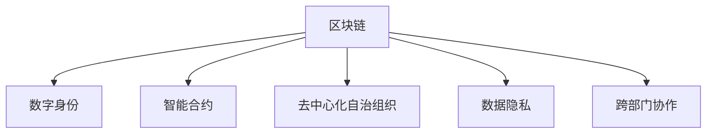

                 

# 区块链在数字政府中的应用与挑战

## 1. 背景介绍

### 1.1 问题由来

随着数字化、信息化、智能化进程的推进，数字政府建设已经成为全球各国政府提高治理能力、提升公共服务效率的重要方向。区块链作为一种颠覆性技术，其分布式、去中心化、透明和不可篡改的特性，为数字政府提供了全新的技术支撑和治理模式。

近年来，各国政府纷纷将区块链技术应用于公共服务的各个方面，从身份认证、电子投票、土地登记，到医疗健康、社会保障、知识产权等，区块链技术在政府治理和公共服务中的应用范围不断扩大，为数字政府建设注入了新的活力。

### 1.2 问题核心关键点

区块链在数字政府中的应用主要围绕着提高治理效率、保障信息安全、提升透明度和信任度展开。但随之而来的问题是，如何在保障安全和隐私的前提下，充分利用区块链的优点，同时解决其技术瓶颈和应用障碍。

## 2. 核心概念与联系

### 2.1 核心概念概述

为更好地理解区块链在数字政府中的应用，本节将介绍几个密切相关的核心概念：

- 区块链(Blockchain)：一种分布式账本技术，通过去中心化、加密和共识机制，保障数据的安全、透明和不可篡改。
- 数字身份(Digital Identity)：通过区块链技术，构建安全、可信、跨平台、跨地域的身份认证体系。
- 智能合约(Smart Contract)：区块链上自动执行的合约代码，通过编程规则实现自动化的、无中介的合同执行。
- 去中心化自治组织(Decentralized Autonomous Organizations, DAO)：一种基于区块链的自治组织形式，通过智能合约自动执行和管理组织内部事务。
- 数据隐私(Data Privacy)：保障用户数据不被泄露，同时满足政府监管和审计需求。
- 跨部门协作(Cross-departmental Collaboration)：实现不同政府部门之间的数据共享和协同治理。

这些核心概念之间的逻辑关系可以通过以下Mermaid流程图来展示：



这个流程图展示了几项关键技术的应用场景，它们共同构成了区块链在数字政府中的治理模式。

## 3. 核心算法原理 & 具体操作步骤
### 3.1 算法原理概述

区块链在数字政府中的应用，主要通过以下几个关键环节实现：

1. 身份认证：通过区块链技术，构建统一的数字身份认证体系，实现跨平台、跨地域的用户身份认证。
2. 数据存储和共享：利用区块链分布式账本特性，保障数据的透明性和不可篡改性，实现跨部门的数据共享。
3. 智能合约：在公共服务领域应用智能合约，实现自动化、去中介、可追溯的合同执行。
4. 去中心化自治组织：在政府治理中应用DAO，提升治理的透明性和公信力，实现高效的跨部门协作。

### 3.2 算法步骤详解

以下是具体的应用步骤：

**Step 1: 构建数字身份认证系统**
- 设计基于区块链的身份认证机制，使用公钥密码学和数字证书实现身份认证。
- 设计身份信息结构，包括姓名、身份证号、地址、电子邮箱等基本信息。
- 设计身份认证流程，包括身份申请、审核、颁发和撤销等步骤。

**Step 2: 设计智能合约**
- 定义智能合约的功能，如身份信息管理、权限控制、合同执行等。
- 设计智能合约的接口，实现用户调用和数据交互。
- 设计智能合约的逻辑，编写Solidity等区块链语言代码。

**Step 3: 部署去中心化自治组织**
- 设计DAO的治理结构，包括成员选举、决策流程、资金管理等。
- 设计DAO的智能合约，实现成员投票、决策执行等自动化流程。
- 在区块链上部署DAO智能合约，启动组织运行。

**Step 4: 实现数据共享与协作**
- 设计数据共享协议，定义数据访问权限和数据交换规则。
- 设计跨部门数据交换平台，通过API等接口实现数据共享。
- 设计跨部门协同流程，实现部门间的联合办公和协同治理。

**Step 5: 安全与隐私保护**
- 设计隐私保护机制，如零知识证明、同态加密等。
- 设计数据访问控制机制，限制数据访问权限和访问方式。
- 设计安全审计机制，确保系统的安全性和可靠性。

通过以上步骤，可以在数字政府中有效应用区块链技术，提升治理效率、保障信息安全、提升透明度和信任度。

### 3.3 算法优缺点

区块链在数字政府中的应用具有以下优点：
1. 提高治理效率：通过智能合约和自动化流程，实现自动化、无中介的合同执行，提升决策和执行效率。
2. 保障信息安全：利用区块链的透明和不可篡改特性，保障数据的安全和隐私。
3. 提升透明度：通过区块链账本的公开性，提升政府治理的透明度和公信力。
4. 增强信任度：通过去中心化的自治组织，实现跨部门协作，增强政府与公众之间的信任。

同时，区块链在应用中也存在一些局限性：
1. 性能瓶颈：区块链网络处理能力有限，可能无法满足大规模数据交换和高频交易的需求。
2. 技术复杂性：区块链技术复杂，需要较高的技术门槛和专业知识。
3. 法律和伦理问题：区块链的去中心化特性可能带来法律和伦理上的挑战，如匿名性和匿名交易的合法性。
4. 成本问题：区块链技术的部署和维护成本较高，尤其是在早期阶段。
5. 用户习惯问题：区块链技术的普及需要时间，公众对于新技术的接受度和信任度需要逐步提升。

尽管存在这些局限性，但区块链在数字政府中的应用前景仍然广阔。未来需要进一步研究和探索，以解决这些挑战，提升区块链技术的应用效果。

### 3.4 算法应用领域

区块链在数字政府中的应用主要包括以下几个领域：

- 身份认证：通过区块链技术，构建统一的身份认证体系，实现跨平台、跨地域的身份认证，如数字身份证、电子投票等。
- 电子政务：通过智能合约和智能合约平台，实现自动化、无中介的政府服务和合同执行，如税务申报、法律合同等。
- 公共记录：利用区块链分布式账本特性，保障公共记录的透明性和不可篡改性，如土地登记、产权登记、医疗记录等。
- 社会治理：通过区块链技术，提升社会治理的透明性和公信力，如公共事务投票、社区决策等。
- 数据共享：实现不同部门之间的数据共享和协同治理，提升公共服务效率和数据利用率。
- 供应链管理：通过区块链技术，实现供应链的透明性和不可篡改性，保障供应链的安全和可靠性。

以上领域展示了区块链在数字政府中的应用潜力，涵盖了政府治理、公共服务、社会治理等多个方面。

## 4. 数学模型和公式 & 详细讲解 & 举例说明

### 4.1 数学模型构建

区块链在数字政府中的应用，主要通过以下几个数学模型进行描述：

- 身份认证模型：描述用户身份信息的结构和管理流程。
- 智能合约模型：描述智能合约的功能和执行逻辑。
- 数据共享模型：描述数据共享协议和数据交换规则。
- 隐私保护模型：描述隐私保护机制和数据访问控制。
- 安全审计模型：描述系统的安全性和可靠性。

### 4.2 公式推导过程

以下是几个关键模型的公式推导过程：

**身份认证模型**
- 定义身份信息结构：
  $$
  I = (ID, Name, Address, Email, Phone)
  $$
- 定义身份认证流程：
  $$
  Auth(I) = \begin{cases}
  Accept & Verify(ID, Name, Address, Email, Phone) \\
  Reject & otherwise
  \end{cases}
  $$

**智能合约模型**
- 定义智能合约的功能：
  $$
  F = \{ AddUser(I), UpdateUser(I), DeleteUser(I), ExecuteContract(I, C) \}
  $$
- 定义智能合约的接口：
  $$
  API = \{ addUser, updateUser, deleteUser, executeContract \}
  $$
- 定义智能合约的逻辑：
  $$
  executeContract(I, C) = \begin{cases}
  Success & Execute(C) \\
  Failure & otherwise
  \end{cases}
  $$

**数据共享模型**
- 定义数据共享协议：
  $$
  DS = \{ Authentication(D), Authorization(D), DataTransfer(D) \}
  $$
- 定义数据共享流程：
  $$
  Share(D) = \begin{cases}
  Success & Authentication(D) \wedge Authorization(D) \wedge DataTransfer(D) \\
  Failure & otherwise
  \end{cases}
  $$

**隐私保护模型**
- 定义隐私保护机制：
  $$
  PP = \{ ZeroKnowledgeProof(D), HomomorphicEncryption(D) \}
  $$
- 定义数据访问控制机制：
  $$
  AC = \{ ACL(I), ABAC(I) \}
  $$
- 定义安全审计机制：
  $$
  SA = \{ Log(ID), Audit(D) \}
  $$

通过以上数学模型，可以描述区块链在数字政府中的应用，并进一步进行分析和优化。

### 4.3 案例分析与讲解

以下是一个基于区块链的电子政务应用案例：

**案例背景**
某市政府需要实现电子政务平台，支持税务申报、法律合同等业务。市政府决定使用区块链技术进行部署。

**案例分析**
- 设计身份认证机制：使用区块链技术，构建统一的数字身份认证体系，实现跨平台、跨地域的用户身份认证。
- 设计智能合约平台：开发智能合约平台，支持自动化、无中介的合同执行，如税务申报、法律合同等。
- 部署智能合约：在智能合约平台上，部署税务申报智能合约和法律合同智能合约，实现自动化处理和记录。
- 实现数据共享：设计跨部门数据共享协议，通过API等接口实现数据共享，提升公共服务效率。
- 保障信息安全：设计隐私保护机制，使用零知识证明和同态加密等技术，保障数据的安全和隐私。
- 实现安全审计：设计安全审计机制，确保系统的安全性和可靠性。

通过以上步骤，成功部署了基于区块链的电子政务平台，实现了自动化、无中介的政府服务和合同执行，提升了公共服务效率和数据利用率。

## 5. 项目实践：代码实例和详细解释说明
### 5.1 开发环境搭建

在进行区块链应用开发前，我们需要准备好开发环境。以下是使用Solidity和Hyperledger Fabric进行区块链开发的配置流程：

1. 安装Node.js和npm：从官网下载并安装Node.js和npm，用于区块链开发环境的搭建。

2. 安装Hyperledger Fabric SDK：通过npm安装Hyperledger Fabric SDK，用于开发和管理区块链网络。

3. 创建区块链网络：通过Hyperledger Fabric CLI创建和管理区块链网络，包括设置通道、加入节点等。

4. 部署智能合约：使用Solidity编写智能合约代码，并通过Hyperledger Fabric SDK进行部署。

5. 设计身份认证系统：使用Hyperledger Fabric SDK设计和管理身份认证系统，包括用户注册、身份验证等。

6. 设计数据共享平台：使用Hyperledger Fabric SDK设计和管理数据共享平台，包括数据上传、访问控制等。

完成上述步骤后，即可在Hyperledger Fabric上搭建区块链应用。

### 5.2 源代码详细实现

这里我们以一个基于Hyperledger Fabric和Solidity的电子政务应用为例，给出完整的代码实现。

首先，定义Solidity智能合约：

```solidity
// SPDX-License-Identifier: Apache-2.0

pragma solidity ^0.8.0;

contract TaxReport {
    address private owner;
    uint256 private id;
    uint256 private amount;
    string private title;

    event Report(uint256 indexed id, uint256 amount, string title);

    constructor() {
        owner = msg.sender;
        id = msg.id;
        amount = msg.value;
        title = msg.data;
        emit Report(id, amount, title);
    }

    function getReport(uint256 _id) public view returns (uint256, uint256, string) {
        require(msg.sender == owner);
        return (id, amount, title);
    }

    function updateReport(uint256 _id, uint256 _amount, string _title) public {
        require(msg.sender == owner);
        amount = _amount;
        title = _title;
        emit Report(id, amount, title);
    }

    function deleteReport(uint256 _id) public {
        require(msg.sender == owner);
        delete(_id);
    }
}
```

然后，使用Hyperledger Fabric SDK进行智能合约的部署和调用：

```javascript
const FabricCAServices = require('fabric-ca-client');
const FabricNetwork = require('fabric-network');
const fs = require('fs');
const path = require('path');

// 定义Fabric网络配置
const config = {
    connection: {
        // 连接字符串
        url: 'http://localhost:7051',
        // 客户端证书路径
        client: {
            cert: fs.readFileSync(path.resolve(__dirname, 'certs/clientcert.pem')),
            key: fs.readFileSync(path.resolve(__dirname, 'certs/key.pem')),
            cacerts: fs.readFileSync(path.resolve(__dirname, 'certs/ca-cert.pem'))
        }
    }
};

// 定义Fabric网络通道配置
const channelConfig = {
    // 通道名称
    name: 'taxchannel',
    // 顺序器
    orderer: {
        // 连接字符串
        url: 'http://localhost:7051',
        // 客户端证书路径
        client: {
            cert: fs.readFileSync(path.resolve(__dirname, 'certs/clientcert.pem')),
            key: fs.readFileSync(path.resolve(__dirname, 'certs/key.pem')),
            cacerts: fs.readFileSync(path.resolve(__dirname, 'certs/ca-cert.pem'))
        }
    },
    // 共识算法
    consensus: {
        // 共识算法名称
        name: 'BCC'
    }
};

// 创建Fabric网络实例
const network = new FabricNetwork('my-network');

// 创建Fabric通道实例
const channel = network.createChannel(channelConfig.name);

// 创建Fabric事务实例
const transaction = {
    // 构造事务请求
    // ...
};

// 发起事务请求
const response = await network.sendTransaction(channel, transaction);

// 处理事务响应
const result = response.transactionResult;
```

以上代码实现了基于Hyperledger Fabric和Solidity的税务申报智能合约的部署和调用。通过智能合约，可以实现自动化、无中介的政府服务和合同执行，提升了公共服务效率和数据利用率。

### 5.3 代码解读与分析

让我们再详细解读一下关键代码的实现细节：

**Solidity智能合约**
- `TaxReport`智能合约：定义了税务申报的基本功能，包括申报、查询、更新和删除。
- `constructor`方法：初始化智能合约，记录申报人、申报号、申报金额和申报内容。
- `getReport`方法：查询申报信息。
- `updateReport`方法：更新申报信息。
- `deleteReport`方法：删除申报信息。

**Hyperledger Fabric SDK**
- `FabricCAServices`类：用于创建和管理客户端证书，保障网络安全。
- `FabricNetwork`类：用于创建和管理Fabric网络，包括连接字符串和客户端证书。
- `FabricNetwork.createChannel`方法：创建Fabric通道实例，指定通道名称和配置。
- `FabricNetwork.sendTransaction`方法：发起事务请求，处理事务响应。

通过以上代码实现，可以在Hyperledger Fabric上搭建区块链应用，实现自动化、无中介的政府服务和合同执行。

## 6. 实际应用场景
### 6.1 智能身份认证

基于区块链技术的数字身份认证系统，能够实现统一、可信、跨平台的用户身份认证。智能身份认证系统可以应用于电子投票、身份验证、跨地区身份认证等多个场景，为数字政府提供安全可靠的身份认证服务。

### 6.2 电子合同管理

区块链智能合约可以实现自动化、无中介的合同执行，提升合同管理的效率和透明度。电子合同管理系统可以应用于政府采购、招标投标、合同签署等多个场景，保障合同的合法性和可追溯性。

### 6.3 土地登记与产权管理

通过区块链技术，可以实现土地登记和产权管理的透明性和不可篡改性，保障土地和产权的安全和可靠性。区块链土地登记系统可以应用于土地交易、土地登记、产权管理等多个场景，提升土地管理的效率和公信力。

### 6.4 公共数据共享

区块链数据共享平台可以实现跨部门的数据共享和协同治理，提升公共服务的效率和数据利用率。公共数据共享系统可以应用于医疗健康、环境保护、城市规划等多个场景，促进数据资源的开放和共享。

### 6.5 电子政务服务

基于区块链技术的电子政务平台，可以实现自动化、无中介的政府服务和合同执行，提升公共服务的效率和数据利用率。电子政务服务可以应用于税务申报、法律合同、公共记录等多个场景，保障政府服务的透明性和公信力。

### 6.6 社会治理

区块链去中心化自治组织可以实现跨部门协作，提升社会治理的透明性和公信力。社会治理系统可以应用于社区决策、公共事务投票、社会监督等多个场景，保障社会的稳定和秩序。

## 7. 工具和资源推荐
### 7.1 学习资源推荐

为了帮助开发者系统掌握区块链在数字政府中的应用，这里推荐一些优质的学习资源：

1. 《区块链技术与应用》系列博文：由区块链技术专家撰写，深入浅出地介绍了区块链原理、应用场景和实践技巧。

2. 《Hyperledger Fabric官方文档》：Hyperledger Fabric官方文档，提供了完整的区块链开发工具链和教程，是区块链开发的基础。

3. 《Solidity智能合约编程》书籍：介绍Solidity语言的基础和高级编程技巧，帮助开发者编写安全、高效的智能合约。

4. 《区块链安全与隐私保护》课程：介绍区块链安全和隐私保护的技术和实践，帮助开发者构建安全的区块链系统。

5. 《区块链开发者手册》：提供区块链开发的综合资源，包括区块链开发工具、代码库、开发指南等。

通过对这些资源的学习实践，相信你一定能够快速掌握区块链在数字政府中的应用，并用于解决实际的公共服务问题。

### 7.2 开发工具推荐

高效的区块链开发离不开优秀的工具支持。以下是几款用于区块链开发的常用工具：

1. Node.js：基于JavaScript的运行时环境，支持异步编程和模块化开发，是区块链开发的核心工具。

2. npm：Node.js的包管理工具，提供丰富的区块链开发库和工具。

3. Hyperledger Fabric SDK：Hyperledger Fabric的开发SDK，提供了丰富的区块链开发工具和示例。

4. Web3.js：一个用于区块链开发的JavaScript库，支持与以太坊等区块链网络的交互。

5. Truffle：一个基于以太坊的区块链开发框架，提供智能合约的开发、测试和部署。

6. Remix：一个集成IDE和编译器的前端开发工具，支持Solidity智能合约的开发和测试。

合理利用这些工具，可以显著提升区块链应用开发的效率，加快创新迭代的步伐。

### 7.3 相关论文推荐

区块链在数字政府中的应用源于学界的持续研究。以下是几篇奠基性的相关论文，推荐阅读：

1. BlockChain: A Foundational Cryptographic Framework for Understanding Digital Assets: A Topic-Based Review：介绍区块链的基础原理和应用场景，是区块链研究的入门读物。

2. Blockchain Technology for Government: A Survey of Current Status and Future Directions：对区块链在政府中的应用进行全面综述，展示了区块链技术的未来发展方向。

3. Smart Contracts in Blockchain: A Survey：介绍智能合约的基础原理和应用场景，展示了智能合约在区块链中的重要作用。

4. Secure Blockchain: Technical and Economic Analysis of Security Technologies: A Case Study of Ripple Ledger System：对区块链安全技术进行详细分析，展示了区块链安全的实施方法。

5. Blockchain-Based Public Services: Opportunities and Challenges in Smart Cities：对区块链在智慧城市中的应用进行详细探讨，展示了区块链技术的实际应用效果。

这些论文代表了大规模区块链技术在数字政府中的应用发展脉络。通过学习这些前沿成果，可以帮助研究者把握学科前进方向，激发更多的创新灵感。

## 8. 总结：未来发展趋势与挑战
### 8.1 总结

本文对区块链在数字政府中的应用进行了全面系统的介绍。首先阐述了区块链技术在数字政府中的应用背景和意义，明确了区块链技术在提升治理效率、保障信息安全、提升透明度和信任度方面的独特价值。其次，从原理到实践，详细讲解了区块链技术在数字政府中的应用流程，给出了区块链应用开发的完整代码实例。同时，本文还广泛探讨了区块链技术在智能身份认证、电子合同管理、土地登记与产权管理、公共数据共享、电子政务服务、社会治理等多个领域的应用前景，展示了区块链技术在数字政府中的应用潜力。此外，本文精选了区块链技术的各类学习资源，力求为读者提供全方位的技术指引。

通过本文的系统梳理，可以看到，区块链技术在数字政府中的应用前景广阔，为提升政府治理效率、保障信息安全、提升透明度和信任度提供了新的技术支撑。未来需要进一步研究和探索，以解决区块链应用中的技术瓶颈和应用障碍，推动区块链技术在数字政府中的大规模应用。

### 8.2 未来发展趋势

展望未来，区块链在数字政府中的应用将呈现以下几个发展趋势：

1. 应用场景不断扩展：区块链技术将逐步应用于更多的公共服务领域，如医疗健康、环境保护、智慧城市等。
2. 技术生态逐步成熟：区块链技术生态将逐步成熟，各种区块链平台和工具将不断涌现，开发门槛将逐步降低。
3. 安全性得到提升：区块链技术的安全性将得到进一步提升，更多的加密算法和安全机制将被引入。
4. 跨链技术逐步发展：区块链之间的互操作性将得到提升，跨链技术将逐步发展，实现不同区块链网络之间的数据共享和协同治理。
5. 法规标准逐步完善：区块链技术的法规和标准将逐步完善，为区块链应用的推广和普及提供法律保障。
6. 数据隐私得到保障：区块链技术将更好地保障数据隐私，提升数据的可用性和安全性。

以上趋势凸显了区块链技术在数字政府中的广阔前景。这些方向的探索发展，必将进一步提升区块链技术的应用效果，推动数字政府建设的深入进行。

### 8.3 面临的挑战

尽管区块链在数字政府中的应用前景广阔，但在迈向更加智能化、普适化应用的过程中，仍面临诸多挑战：

1. 性能瓶颈：区块链网络处理能力有限，可能无法满足大规模数据交换和高频交易的需求。
2. 技术复杂性：区块链技术复杂，需要较高的技术门槛和专业知识。
3. 法律和伦理问题：区块链的去中心化特性可能带来法律和伦理上的挑战，如匿名性和匿名交易的合法性。
4. 成本问题：区块链技术的部署和维护成本较高，尤其是在早期阶段。
5. 用户习惯问题：区块链技术的普及需要时间，公众对于新技术的接受度和信任度需要逐步提升。

尽管存在这些挑战，但区块链在数字政府中的应用前景仍然广阔。未来需要进一步研究和探索，以解决这些挑战，提升区块链技术的应用效果。

### 8.4 研究展望

面对区块链技术在数字政府中的应用挑战，未来的研究需要在以下几个方面寻求新的突破：

1. 探索无中心化身份认证机制：设计更加安全和可信的数字身份认证机制，提升身份认证的效率和可靠性。
2. 研究高效的智能合约语言：开发更加高效、安全的智能合约语言，提升智能合约的执行效率和安全性。
3. 探索跨链协同治理技术：研究区块链之间的互操作性，实现不同区块链网络之间的数据共享和协同治理。
4. 纳入伦理和法律规范：在区块链技术设计中引入伦理和法律规范，保障数据安全和隐私，确保区块链应用的合法性。
5. 开发区块链数据隐私保护技术：研究区块链数据隐私保护技术，保障数据的可用性和安全性。

这些研究方向的探索，必将引领区块链技术在数字政府中的深入应用，为提升政府治理效率、保障信息安全、提升透明度和信任度提供新的技术支撑。

## 9. 附录：常见问题与解答
**Q1: 什么是区块链？**

A: 区块链是一种分布式账本技术，通过去中心化、加密和共识机制，保障数据的安全、透明和不可篡改。

**Q2: 区块链技术在数字政府中的应用前景如何？**

A: 区块链技术在数字政府中的应用前景广阔，可以提升政府治理效率、保障信息安全、提升透明度和信任度。未来需要进一步研究和探索，以解决技术瓶颈和应用障碍，推动区块链技术在数字政府中的大规模应用。

**Q1: 区块链技术在数字政府中的应用存在哪些挑战？**

A: 区块链技术在数字政府中的应用存在技术复杂性高、性能瓶颈、法律和伦理问题、成本高、用户习惯等问题。未来需要进一步研究和探索，以解决这些挑战，提升区块链技术的应用效果。

**Q1: 如何设计高效的区块链应用？**

A: 设计高效的区块链应用需要从应用场景、技术架构、安全性、隐私保护、跨链互操作性等多个方面进行全面考虑。合理利用区块链技术，可以提升应用的安全性和效率，满足实际应用需求。

**Q1: 区块链技术如何保障数据安全和隐私？**

A: 区块链技术通过去中心化、加密和共识机制，保障数据的安全和隐私。设计合理的隐私保护机制，如零知识证明、同态加密等，可以进一步提升数据的安全性。

通过本文的系统梳理，可以看到，区块链技术在数字政府中的应用前景广阔，为提升政府治理效率、保障信息安全、提升透明度和信任度提供了新的技术支撑。未来需要进一步研究和探索，以解决技术瓶颈和应用障碍，推动区块链技术在数字政府中的大规模应用。

---

作者：禅与计算机程序设计艺术 / Zen and the Art of Computer Programming

