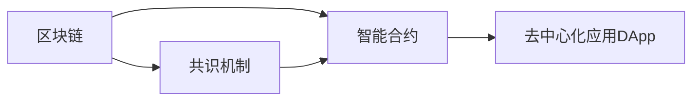

                 

# 区块链技术：去中心化应用开发

## 1. 背景介绍

区块链技术（Blockchain Technology）自2008年出现以来，已在金融、供应链、医疗、版权等多个领域展现出了其独特的优势和潜力。去中心化应用（Decentralized Application, DApp）作为区块链的核心应用形式，通过智能合约等机制，实现了无需中介的自动执行和信任构建。本文将深入探讨区块链技术，特别是去中心化应用的开发，通过构建合乎逻辑的结构，带领读者走进这一令人激动的新世界。

## 2. 核心概念与联系

### 2.1 核心概念概述

区块链技术的核心原理是“去中心化”与“不可篡改”，它通过分布式网络中多个节点共同维护的数据账本，使得数据记录透明且安全。去中心化应用DApp则是利用这种底层技术，为开发者提供了一种无需信任第三方机构、能自主运营的区块链应用解决方案。

核心概念包括：
- **区块链**：通过分布式账本，实现数据的透明和不可篡改。
- **智能合约**：自动化执行的合约，能够通过区块链技术实现无需中介的自动执行。
- **共识机制**：节点间就数据更新达成一致的协议，如PoW、PoS、DPoS等。
- **去中心化应用DApp**：一种基于区块链技术的分布式应用，以智能合约为底层。

这些概念之间的逻辑关系可以通过以下Mermaid流程图来展示：



这个流程图展示了大语言模型的核心概念及其之间的关系：

1. 区块链通过分布式账本实现数据的透明和不可篡改。
2. 智能合约是区块链上的自动化执行程序，保障了去中心化应用的安全性。
3. 共识机制保证了节点间的同步更新和数据一致性。
4. 去中心化应用DApp建立在区块链之上，利用智能合约实现无需中介的自动执行。

这些概念共同构成了区块链技术的应用框架，使其能够在各种场景下发挥独特的优势。通过理解这些核心概念，我们可以更好地把握区块链技术的本质和工作原理。

## 3. 核心算法原理 & 具体操作步骤

### 3.1 算法原理概述

DApp的开发主要基于智能合约技术，而智能合约是通过区块链上的代码实现自动执行的合约。DApp开发的核心步骤如下：

1. **需求分析与设计**：明确应用目标、功能、数据结构和用户交互方式。
2. **智能合约编写**：基于Solidity、以太坊虚拟机（EVM）等语言编写智能合约代码。
3. **智能合约部署**：将智能合约部署到区块链网络中，并进行测试。
4. **DApp前端开发**：构建前端用户界面，提供与智能合约交互的用户体验。
5. **应用部署**：将DApp部署到区块链网络，并进行后续维护。

### 3.2 算法步骤详解

#### 步骤一：需求分析与设计

需求分析是DApp开发的基础，主要涉及以下几个方面：

1. **功能需求**：明确应用需要实现的具体功能，如交易、投票、身份认证等。
2. **数据结构设计**：定义应用的数据模型和关系，包括用户、资产、事务等实体。
3. **用户交互设计**：设计用户界面和交互方式，保证易用性和友好性。
4. **安全需求**：评估应用的安全风险，设计相应的安全措施，如访问控制、数据加密等。

需求分析后，设计出应用的架构和技术栈，确定使用的区块链平台和编程语言。

#### 步骤二：智能合约编写

智能合约是DApp的核心，其编写步骤如下：

1. **编写代码**：使用Solidity、Truffle、Web3.js等工具编写智能合约代码。智能合约应包含以下核心功能：
   - 合约初始化：创建智能合约实例。
   - 用户账户管理：创建和删除用户账户。
   - 资产管理：记录和转移资产。
   - 事务处理：记录交易事件。
   - 安全性控制：如访问权限控制、异常处理等。
   
2. **测试与调试**：在本地区块链网络中测试智能合约，模拟用户行为，调试发现的问题。

#### 步骤三：智能合约部署

智能合约部署是将智能合约代码部署到区块链网络的过程。具体步骤如下：

1. **搭建环境**：在本地或云端搭建区块链网络环境，如以太坊测试网。
2. **编译合约**：使用Solidity编译器编译智能合约代码，生成字节码。
3. **部署合约**：将字节码部署到区块链网络，创建智能合约实例。
4. **测试与调试**：在测试网络中测试智能合约，确保其正常工作。

#### 步骤四：DApp前端开发

DApp前端开发主要涉及以下几个方面：

1. **界面设计**：使用React、Vue.js等前端框架设计用户界面。
2. **交互开发**：编写用户交互逻辑，实现与智能合约的通信。
3. **界面优化**：优化界面性能，提高用户体验。

#### 步骤五：应用部署

应用部署是将DApp部署到区块链网络的过程。具体步骤如下：

1. **搭建服务器**：在云端或本地搭建服务器环境。
2. **配置服务**：配置服务器网络、安全等参数。
3. **部署应用**：将DApp部署到服务器，提供访问接口。
4. **测试与优化**：在生产环境中测试DApp，优化性能，确保稳定性。

### 3.3 算法优缺点

基于区块链技术的DApp具有以下优点：

1. **安全性高**：智能合约代码可公开验证，减少了欺诈和错误发生的可能性。
2. **去中心化**：无需中介机构，降低了成本和信任风险。
3. **透明性**：所有交易记录公开透明，便于审计。
4. **不可篡改性**：区块链上的数据不可篡改，保证了数据的完整性和真实性。

同时，DApp也存在以下缺点：

1. **性能瓶颈**：当前区块链网络的吞吐量较低，难以支撑大规模应用。
2. **技术门槛高**：智能合约和区块链开发复杂，需要专业技能。
3. **隐私保护**：部分智能合约的公开性可能泄露用户隐私。
4. **可扩展性差**：现有区块链网络的扩展性较弱，难以适应大量用户和数据。

## 4. 数学模型和公式 & 详细讲解 & 举例说明

### 4.1 数学模型构建

DApp开发中，智能合约的编写和测试涉及多个数学模型和算法。以下以以太坊智能合约为例，介绍其核心数学模型。

以太坊智能合约使用Solidity语言编写，核心数学模型包括：

1. **加法与减法**：用于记录资产的增加和减少。
2. **乘法与除法**：用于计算利率、费用等。
3. **比较运算**：用于判断用户权限、资产数量等。
4. **哈希函数**：用于数据加密和校验。

以太坊智能合约中的数学模型构建，主要包括以下几个方面：

1. **变量定义**：定义合约中的变量，包括整数、浮点数、数组等。
2. **数学运算**：使用加、减、乘、除、取余等基本数学运算符。
3. **逻辑运算**：使用与、或、非、比较等逻辑运算符。
4. **哈希函数**：使用Keccak-256哈希函数对数据进行加密和校验。

### 4.2 公式推导过程

以太坊智能合约中的数学模型推导过程如下：

1. **整数加法**：设$a$和$b$为两个整数，则$a+b$的结果为另一个整数。
   $$
   a+b = \text{int}(a+int(b))
   $$

2. **浮点数乘法**：设$a$和$b$为两个浮点数，则$a*b$的结果为另一个浮点数。
   $$
   a*b = \text{float}(a*int(b))
   $$

3. **逻辑与运算**：设$a$和$b$为两个布尔值，则$a \land b$的结果为布尔值。
   $$
   a \land b = (a=1) && (b=1)
   $$

4. **哈希函数**：设$x$为任意长度的二进制数据，则$h(x)$为256位的哈希值。
   $$
   h(x) = Keccak-256(x)
   $$

这些公式推导过程展示了以太坊智能合约的核心数学模型，为开发和测试提供了基础。

### 4.3 案例分析与讲解

以一个简单的以太坊智能合约为例，进行详细分析：

```solidity
pragma solidity ^0.8.0;

contract AssetManager {
    address public owner;
    mapping(address => uint256) public balance;
    mapping(address => bool) public isContract;
    
    constructor() public {
        owner = msg.sender;
        isContract[msg.sender] = true;
    }
    
    event Transfer(uint256 amount, address from, address to);
    
    function approve(uint256 amount, address receiver) public {
        if (isContract(receiver)) {
            uint256 senderBalance = balance[msg.sender];
            require(senderBalance >= amount);
            balance[msg.sender] -= amount;
            balance[receiver] += amount;
            emit Transfer(amount, msg.sender, receiver);
        }
    }
    
    function transfer(uint256 amount, address receiver) public {
        require(isContract(receiver));
        require(balance[msg.sender] >= amount);
        balance[msg.sender] -= amount;
        balance[receiver] += amount;
        emit Transfer(amount, msg.sender, receiver);
    }
}
```

这个智能合约实现了资产管理功能，包括资产的批准和转移。在合约中，定义了所有者、余额和是否为合约等数据结构，并实现了批准和转移功能。

1. **构造函数**：初始化合约，将发送者作为所有者，并标记为合约。
2. **批准函数**：判断发送者是否有足够的余额，并将余额转移给接收者。
3. **转移函数**：判断接收者是否为合约，并转移余额。

通过这个案例，我们可以清晰地看到DApp中智能合约的基本结构，理解其核心功能与实现。

## 5. 项目实践：代码实例和详细解释说明

### 5.1 开发环境搭建

开发DApp前，需要搭建相应的开发环境，包括：

1. **安装Solidity编译器**：从官网下载安装Solidity，并配置到环境变量中。
2. **安装Truffle框架**：通过npm安装Truffle，并配置项目。
3. **搭建本地区块链网络**：使用Ganache或Infura搭建本地测试网，并连接到Truffle。
4. **配置开发工具**：使用Visual Studio Code、Git等工具进行项目管理。

### 5.2 源代码详细实现

以下是一个简单的以太坊智能合约代码，实现资产的创建和转移功能：

```solidity
pragma solidity ^0.8.0;

contract AssetManager {
    uint256 public totalSupply;
    mapping(uint256 => uint256) public balanceOf;
    mapping(uint256 => address) public ownerOf;
    
    event Created(uint256 indexed tokenId, address indexed creator);
    event Transferred(uint256 indexed tokenId, address indexed from, address indexed to);
    
    constructor(uint256 _supply) public {
        totalSupply = _supply;
        for (uint256 i = 1; i <= _supply; i++) {
            balanceOf[i] = 1;
            ownerOf[i] = msg.sender;
        }
        emit Created(0, msg.sender);
    }
    
    function mint(uint256 _to) public {
        require(msg.sender == ownerOf(0));
        balanceOf[_to] += 1;
        ownerOf[1] = msg.sender;
        emit Transferred(1, 0, _to);
    }
    
    function transfer(uint256 _to) public {
        require(msg.sender == ownerOf(balanceOf(msg.sender)));
        balanceOf[_to] += 1;
        ownerOf[balanceOf(msg.sender)] = msg.sender;
        emit Transferred(balanceOf(msg.sender), msg.sender, _to);
    }
}
```

这个智能合约实现了资产的创建和转移功能，具体步骤如下：

1. **构造函数**：创建资产，初始化总供给量和余额。
2. **创建函数**：向指定地址分配资产，并进行转账记录。
3. **转移函数**：将资产从当前地址转移至指定地址，并进行转账记录。

### 5.3 代码解读与分析

这个智能合约的核心代码包括：

1. **变量定义**：定义了资产总供给量、余额和所有者等数据结构。
2. **事件定义**：定义了资产创建和转移的事件，用于记录操作日志。
3. **构造函数**：创建资产，并将初始资产分配给所有者。
4. **创建函数**：将资产分配给指定地址，并进行转账记录。
5. **转移函数**：将资产从当前地址转移至指定地址，并进行转账记录。

## 6. 实际应用场景

### 6.1 金融交易

区块链在金融交易领域具有广泛的应用前景。例如，智能合约可以实现自动化交易和结算，降低交易成本和风险。通过区块链，可以实现无需中介机构的自动执行，提高了交易的透明度和安全性。

具体应用场景包括：

1. **自动交易**：根据预设条件自动进行交易，如股票、期权等。
2. **结算与清算**：自动进行交易结算和清算，提高效率和安全性。
3. **资产管理**：记录和管理各类资产，如股票、债券等。

### 6.2 供应链管理

区块链在供应链管理中的应用，可以实现供应链各环节的透明化和自动化管理。

具体应用场景包括：

1. **物流跟踪**：实时跟踪物流信息，提高配送效率。
2. **产品追溯**：追溯产品的来源和流向，保障产品质量。
3. **合同管理**：自动化管理供应链合同，确保各方的利益。

### 6.3 版权保护

区块链在版权保护中的应用，可以实现版权的自动注册和保护。

具体应用场景包括：

1. **版权注册**：自动注册版权信息，保护创作者权益。
2. **版权交易**：自动管理版权的转让和授权，保障版权利益。
3. **版权监控**：监控版权的使用情况，防止侵权行为。

### 6.4 未来应用展望

随着区块链技术的不断发展，其在未来将展现出更加广阔的应用前景：

1. **去中心化金融DeFi**：通过智能合约实现自动化交易和金融服务，降低中介成本，提高效率。
2. **医疗健康**：记录和管理患者数据，实现数据的透明和安全共享。
3. **公共服务**：记录和管理公共服务信息，保障数据的安全和透明。
4. **政府治理**：记录和管理政府事务，提高透明度和效率。

## 7. 工具和资源推荐

### 7.1 学习资源推荐

1. **以太坊官方文档**：提供详细的以太坊和智能合约开发指南。
2. **Solidity官方文档**：提供Solidity语言的详细文档和示例。
3. **Truffle官方文档**：提供Truffle框架的详细文档和教程。
4. **CryptoZombies**：通过游戏化的方式学习Solidity和智能合约开发。

### 7.2 开发工具推荐

1. **Visual Studio Code**：轻量级的代码编辑器，支持Solidity开发和调试。
2. **Remix IDE**：基于浏览器的智能合约开发环境，支持Solidity编译和测试。
3. **MetaMask**：以太坊的浏览器插件，支持智能合约的交互和测试。

### 7.3 相关论文推荐

1. **Ethereum Yellow Paper**：以太坊的官方技术白皮书，详细介绍了以太坊的技术原理和应用场景。
2. **Blockchain by Example**：通过实际案例讲解区块链技术的核心概念和应用。
3. **Smart Contract Security**：讲解智能合约的安全问题和防护措施。

## 8. 总结：未来发展趋势与挑战

### 8.1 总结

本文详细介绍了基于区块链技术的去中心化应用DApp的开发，从需求分析到智能合约编写，再到应用部署，全面展示了DApp的开发流程和技术要点。通过深入探讨区块链技术和智能合约的核心原理，我们了解了DApp的应用场景和优势，为后续开发提供了理论基础和实践指南。

### 8.2 未来发展趋势

未来，DApp的发展趋势如下：

1. **扩展性增强**：区块链网络的扩展性将成为热点，如Sharding、Layer 2等技术将提升区块链的性能。
2. **跨链技术**：区块链间的互联互通将成为焦点，如Polkadot、Cosmos等跨链平台将实现链与链之间的交互。
3. **共识机制优化**：新的共识机制将提升区块链网络的安全性和效率。
4. **智能合约优化**：优化智能合约的性能和安全，降低开发成本。
5. **去中心化应用生态**：构建更为完善的去中心化应用生态系统，吸引更多的开发者和用户。

### 8.3 面临的挑战

尽管DApp具有许多优点，但未来仍需面对以下挑战：

1. **性能瓶颈**：区块链网络的吞吐量较低，难以支撑大规模应用。
2. **技术门槛高**：智能合约和区块链开发复杂，需要专业技能。
3. **隐私保护**：部分智能合约的公开性可能泄露用户隐私。
4. **可扩展性差**：现有区块链网络的扩展性较弱，难以适应大量用户和数据。
5. **安全问题**：智能合约的安全漏洞可能导致严重的经济损失。

### 8.4 研究展望

为应对这些挑战，未来的研究方向包括：

1. **扩展性研究**：研究区块链扩展性技术，提升区块链的性能。
2. **隐私保护**：研究隐私保护技术，保障用户数据的安全。
3. **安全验证**：研究智能合约的安全验证技术，提高智能合约的安全性。
4. **跨链互操作**：研究跨链互操作技术，实现链与链之间的通信。

未来，区块链技术将在更多领域得到应用，为全球经济和社会带来深远影响。DApp作为区块链的核心应用形式，将在智能化和自动化领域发挥重要作用。

## 9. 附录：常见问题与解答

**Q1：DApp和智能合约有什么区别？**

A: DApp是一种基于区块链技术的应用形式，通过智能合约实现无需中介的自动执行。智能合约则是DApp的核心，是实现自动执行的代码。

**Q2：如何保证DApp的安全性？**

A: DApp的安全性主要通过智能合约的代码审计、代码优化、测试和部署等环节来保障。使用Solidity等语言编写智能合约，并进行代码审计和安全测试，可以有效降低安全风险。

**Q3：DApp开发需要哪些技术？**

A: DApp开发需要具备区块链技术、智能合约编程、前端开发等多项技术。具体技术栈包括Solidity、Truffle、React、Vue.js等。

**Q4：如何优化DApp的性能？**

A: 优化DApp的性能主要从以下几个方面入手：
1. 优化智能合约代码，减少计算量和存储空间。
2. 优化数据结构，减少数据读写操作。
3. 使用链上和链下存储相结合的方式，提高性能。
4. 使用Layer 2等技术提升区块链网络的性能。

**Q5：如何部署DApp？**

A: DApp的部署主要通过智能合约的部署和前端应用的搭建来实现。在Truffle环境中，通过truffle compile、truffle migrate等命令，将智能合约部署到区块链网络，并将前端应用部署到服务器。

通过本文的系统梳理，我们可以更全面地理解DApp的开发流程和核心技术，把握区块链技术的未来发展趋势，为后续开发提供有力的理论支持和实践指导。随着区块链技术的不断成熟，DApp将在更多领域展现出其独特的优势和潜力，为人类社会带来深远的影响。

