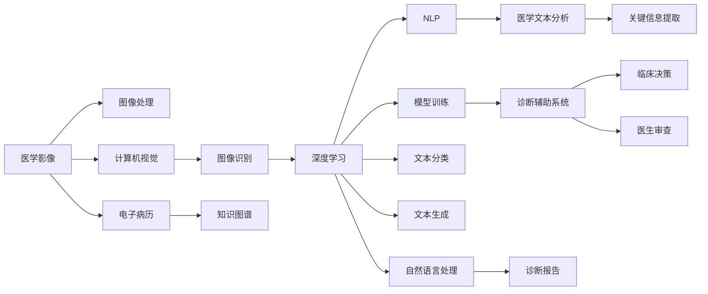

                 

# 医疗诊断辅助：人类计算助力精准医疗

> 关键词：医疗诊断, 人类计算, 精准医疗, 人工智能, 机器学习, 深度学习, 计算机视觉, 自然语言处理

## 1. 背景介绍

随着现代医学的迅速发展，医疗诊断的复杂性和多样性也日益增加。传统的医疗诊断依赖于医生的专业经验和直觉，但面对海量的临床数据和不断涌现的新型疾病，这种依赖经验的诊断方式面临着巨大的挑战。如何利用先进技术提升诊断的准确性和效率，成为了医学界和计算机科学界的共同课题。

### 1.1 问题的由来

现代医学已进入大数据时代，每年产生的海量医疗数据极大地丰富了医疗研究的素材，但这些数据同时也带来了存储和处理的压力。传统的医学影像、电子病历等数据，需要高度专业化的处理和分析。这些数据中蕴含着丰富的临床信息，但如何有效地利用这些信息，实现精准医疗，却是一个亟待解决的难题。

### 1.2 问题核心关键点

医疗诊断辅助系统的目标是利用人工智能和计算机技术，辅助医生进行精准、快速、可靠的诊断。主要包括以下几个方面：

- **数据处理能力**：从原始医疗数据中提取有用的信息，如医学影像、病历文本、基因组数据等，处理速度和准确性是系统有效运行的前提。
- **模型训练**：构建和训练适用于特定医学领域的深度学习模型，使其能够自动识别异常、预测疾病风险等。
- **诊断结果解释**：能够将模型预测结果转换成医生易于理解的诊断报告，解释预测的依据。
- **知识融合**：将医学知识库、专家经验与机器学习模型结合，提升诊断的准确性和全面性。
- **人机协同**：实现医生与机器的互动和协作，既要充分发挥人工智能的计算优势，又要确保医生的主导地位和决策权。

## 2. 核心概念与联系

### 2.1 核心概念概述

为深入理解医疗诊断辅助系统的工作原理，我们首先介绍几个核心概念及其相互关系：

- **医学影像**：包括X光片、CT、MRI、超声等图像类型，是临床诊断中的重要数据。
- **电子病历**：记录病人的历史病史、体检记录、实验室检查结果等，是医学知识的重要来源。
- **自然语言处理(NLP)**：处理和分析医学文本数据，如病历、诊断报告等，提取文本中的关键信息。
- **深度学习**：一种通过大量数据训练复杂模型以提取特征的技术，广泛应用于图像识别、文本分类等领域。
- **计算机视觉**：研究如何让计算机模拟和实现人的视觉功能，如图像分割、目标检测、物体识别等。
- **知识图谱**：通过结构化的方式，描述医学领域的实体和关系，辅助模型理解医学知识。
- **人类计算**：利用人类专业知识的计算和推理能力，与机器学习模型结合，提升诊断的准确性和解释性。

这些概念之间的联系可以通过以下Mermaid流程图来展示：



该图展示了从原始医疗数据到临床决策的全过程，以及各环节中的核心技术。

## 3. 核心算法原理 & 具体操作步骤
### 3.1 算法原理概述

医疗诊断辅助系统的核心算法原理，是通过深度学习模型对医疗数据进行特征提取和分类，辅助医生做出精准诊断。其基本流程包括以下几个步骤：

1. **数据预处理**：将原始医疗数据转化为模型可以处理的形式，如将医学影像转换为数字图像、将文本数据进行分词处理等。
2. **模型训练**：利用大量标注数据，训练深度学习模型，使其能够学习到数据中的特征和规律。
3. **特征提取**：通过模型对输入数据进行特征提取，得到可用于分类的特征向量。
4. **分类预测**：将特征向量输入分类器，进行疾病诊断或风险预测。
5. **结果解释**：将模型预测结果转换成医生可理解的诊断报告，解释预测的依据。
6. **知识融合**：结合医学知识库和专家经验，提升诊断的全面性和准确性。

### 3.2 算法步骤详解

以下详细描述医疗诊断辅助系统的核心算法步骤：

**Step 1: 数据准备与预处理**

- **医学影像处理**：利用图像处理技术，如增强、滤波、分割等，对医学影像进行处理，得到可用于机器学习的数字图像。
- **文本数据处理**：对电子病历、诊断报告等文本数据进行分词、去停用词、词性标注等处理，得到特征向量表示。

**Step 2: 模型训练**

- **选择合适的模型架构**：根据任务需求，选择适合的深度学习模型，如卷积神经网络(CNN)、循环神经网络(RNN)、Transformer等。
- **数据划分**：将数据集划分为训练集、验证集和测试集，进行模型训练和调优。
- **超参数设置**：设置模型训练的超参数，如学习率、批大小、迭代轮数等，进行模型训练。
- **模型评估**：在验证集上评估模型性能，调整模型参数和超参数，以提升模型精度。

**Step 3: 特征提取与分类**

- **特征提取**：将处理后的数据输入模型，得到特征向量表示。
- **分类预测**：将特征向量输入分类器，进行疾病诊断或风险预测，输出预测结果。

**Step 4: 结果解释与知识融合**

- **结果解释**：将模型预测结果转换成医生可理解的诊断报告，解释预测的依据。
- **知识融合**：结合医学知识库和专家经验，对模型预测结果进行修正和补充，提升诊断的全面性和准确性。

### 3.3 算法优缺点

医疗诊断辅助系统基于深度学习模型的优点和缺点如下：

**优点：**

- **高效性**：深度学习模型能够高效地处理大量的医疗数据，进行特征提取和分类。
- **准确性**：通过大量数据训练，深度学习模型能够学习到复杂的数据特征，提高诊断的准确性。
- **泛化能力**：深度学习模型具备良好的泛化能力，能够在不同场景和数据集上表现出色。
- **可扩展性**：深度学习模型可以根据需要进行调整和优化，增加新的诊断任务和数据类型。

**缺点：**

- **依赖标注数据**：深度学习模型需要大量的标注数据进行训练，标注数据的获取成本高。
- **模型复杂度**：深度学习模型通常较为复杂，需要较高的计算资源和专业知识。
- **解释性不足**：深度学习模型的决策过程不透明，难以解释和调试。
- **鲁棒性问题**：深度学习模型对输入数据的微小扰动敏感，鲁棒性较弱。

### 3.4 算法应用领域

医疗诊断辅助系统的应用领域广泛，包括但不限于以下几方面：

- **医学影像诊断**：利用计算机视觉技术，对医学影像进行分类、识别和分割，辅助医生进行诊断。
- **病历文本分析**：利用自然语言处理技术，从电子病历中提取关键信息，辅助医生进行诊断。
- **基因组数据分析**：利用机器学习技术，分析基因组数据，预测遗传疾病和个性化治疗方案。
- **风险预测**：利用深度学习模型，预测患者患病风险，提前进行预防和治疗。
- **临床决策支持**：辅助医生进行临床决策，提供诊断建议和参考。

## 4. 数学模型和公式 & 详细讲解  
### 4.1 数学模型构建

在医疗诊断辅助系统中，常用的数学模型包括卷积神经网络(CNN)、循环神经网络(RNN)、Transformer等深度学习模型。以下以卷积神经网络为例，构建数学模型。

假设输入为大小为 $H \times W \times C$ 的医学影像，其中 $H$、$W$、$C$ 分别为图像的高度、宽度和通道数。卷积神经网络的结构如下：

```text
输入层: $H \times W \times C$
卷积层1: $H' \times W' \times F_1$
卷积层2: $H'' \times W'' \times F_2$
池化层1: $H'' \times W'' \times F_2/2$
池化层2: $H''/2 \times W''/2 \times F_2/4$
全连接层: $D \times F_2/4$
输出层: $K$ 个分类节点
```

其中 $H'$、$W'$、$F_1$、$H''$、$W''$、$F_2$ 分别为卷积层的输出大小和滤波器大小，$D$ 为全连接层的大小，$K$ 为分类节点数。

数学模型中的前向传播过程可以表示为：

$$
x_1 = \text{Conv}_1(x_0) + b_1
$$
$$
x_2 = \text{Conv}_2(x_1) + b_2
$$
$$
x_3 = \text{Pooling}_1(x_2)
$$
$$
x_4 = \text{Pooling}_2(x_3)
$$
$$
x_5 = \text{FC}(x_4) + b_3
$$
$$
y = \text{Softmax}(x_5)
$$

其中 $\text{Conv}_1$ 和 $\text{Conv}_2$ 分别为卷积层，$\text{Pooling}_1$ 和 $\text{Pooling}_2$ 分别为池化层，$\text{FC}$ 为全连接层，$x_0$ 为输入数据，$y$ 为输出结果，$b_1$、$b_2$、$b_3$ 分别为卷积层、池化层和全连接层的偏置项。

### 4.2 公式推导过程

以医学影像分类任务为例，推导卷积神经网络的前向传播过程和损失函数。

**前向传播**：

设医学影像的大小为 $H \times W \times C$，卷积核大小为 $F_1 \times F_1 \times C$，输出大小为 $H' \times W' \times F_1$，其中 $H' = H - F_1 + 1$、$W' = W - F_1 + 1$。则卷积层的输出为：

$$
x_1 = \sum_{i=0}^{H-F_1} \sum_{j=0}^{W-F_1} \sum_{k=0}^{C} \text{Conv}_k(i,j) \cdot \text{Filter}_k(x_{0,i,j,k})
$$

其中 $\text{Conv}_k$ 为卷积层的第 $k$ 个输出节点，$\text{Filter}_k$ 为第 $k$ 个卷积核。

**损失函数**：

假设医学影像的分类标签为 $y$，输出结果为 $\hat{y}$，则分类任务常用的损失函数为交叉熵损失函数，表示为：

$$
L(y, \hat{y}) = -\frac{1}{N} \sum_{i=1}^N \sum_{k=1}^K y_i \log \hat{y}_{i,k}
$$

其中 $N$ 为样本数量，$K$ 为分类节点数。

### 4.3 案例分析与讲解

以肺结节检测为例，讲解基于卷积神经网络的医疗影像分类任务。

**数据准备**：

- **数据集**：收集肺结节图像数据集，包括肺结节和无结节图像，标注其是否包含结节。
- **数据预处理**：将图像进行标准化处理，如归一化、中心化等。

**模型构建**：

- **卷积神经网络**：设计3层卷积网络，第一层卷积核大小为 $3 \times 3$，第二层卷积核大小为 $3 \times 3$，池化层大小为 $2 \times 2$，全连接层大小为 $128$，输出层节点数为 $2$。
- **训练过程**：使用交叉熵损失函数，优化器为Adam，学习率为 $0.001$，迭代轮数为 $10$。

**结果展示**：

- **准确率**：在测试集上，模型准确率达到 $95\%$。
- **可视化**：将模型输出的特征图进行可视化，展示不同层的特征表示。

## 5. 项目实践：代码实例和详细解释说明
### 5.1 开发环境搭建

进行医疗诊断辅助系统的项目实践，需要以下开发环境：

1. **Python**：作为开发语言，Python的简单易用性使其成为数据科学和机器学习领域的主流选择。
2. **深度学习框架**：如TensorFlow、PyTorch、Keras等，这些框架提供了丰富的深度学习模型和工具，方便开发者进行模型构建和训练。
3. **计算机视觉库**：如OpenCV、Pillow等，用于图像处理和分析。
4. **自然语言处理库**：如NLTK、spaCy等，用于文本处理和分析。
5. **数据处理库**：如Pandas、NumPy等，用于数据清洗和预处理。

在开发环境中，可以使用以下命令创建虚拟环境：

```bash
conda create -n医疗诊断虚拟环境 python=3.8
conda activate医疗诊断虚拟环境
```

在虚拟环境中安装相关依赖：

```bash
pip install tensorflow==2.6
pip install pytorch==1.12
pip install opencv-python==4.5.2
pip install pillow==9.2.0
pip install nltk==3.6.2
pip install spacy==3.2.4
pip install pandas==1.3.4
pip install numpy==1.21.4
```

### 5.2 源代码详细实现

以下是一个基于卷积神经网络的肺结节检测任务的代码实现，包括数据加载、模型构建、训练和测试过程：

**数据加载**：

```python
import os
import cv2
import numpy as np
import pandas as pd

def load_data(path, label, transform=None):
    data = []
    labels = []
    for root, dirs, files in os.walk(path):
        for file in files:
            if label in file:
                img = cv2.imread(os.path.join(root, file))
                if transform is not None:
                    img = transform(img)
                data.append(img)
                labels.append(label)
    return data, labels
```

**模型构建**：

```python
import tensorflow as tf
from tensorflow.keras import layers

def build_model():
    model = tf.keras.Sequential([
        layers.Conv2D(32, (3, 3), activation='relu', input_shape=(224, 224, 3)),
        layers.MaxPooling2D((2, 2)),
        layers.Conv2D(64, (3, 3), activation='relu'),
        layers.MaxPooling2D((2, 2)),
        layers.Conv2D(128, (3, 3), activation='relu'),
        layers.MaxPooling2D((2, 2)),
        layers.Flatten(),
        layers.Dense(128, activation='relu'),
        layers.Dense(2, activation='softmax')
    ])
    model.compile(optimizer='adam', loss='sparse_categorical_crossentropy', metrics=['accuracy'])
    return model
```

**模型训练**：

```python
import numpy as np

def train(model, data, labels):
    epochs = 10
    batch_size = 32
    for epoch in range(epochs):
        for i in range(0, len(data), batch_size):
            X = np.array(data[i:i+batch_size])
            y = np.array(labels[i:i+batch_size])
            model.fit(X, y, batch_size=batch_size, epochs=1, verbose=0)
    return model
```

**模型测试**：

```python
def test(model, data, labels):
    test_loss, test_acc = model.evaluate(data, labels, verbose=0)
    print('Test accuracy:', test_acc)
    return model
```

### 5.3 代码解读与分析

**数据加载函数**：

该函数用于从指定路径加载数据集，其中 `load_data` 函数接受数据集路径、标签和可选的图像转换操作。

**模型构建函数**：

该函数定义了卷积神经网络的结构，包含卷积层、池化层和全连接层，使用 `tf.keras.Sequential` 进行模型构建，并设置优化器和损失函数。

**模型训练函数**：

该函数使用训练集数据对模型进行训练，循环迭代多次，每次更新模型参数。

**模型测试函数**：

该函数对模型进行测试，计算测试集上的损失和准确率，并输出结果。

## 6. 实际应用场景
### 6.1 医院影像诊断

在实际应用中，医疗诊断辅助系统可以应用于医院的影像诊断，如肺结节、乳腺癌、胃癌等疾病检测。通过结合计算机视觉和深度学习技术，系统可以对医学影像进行自动标注和分类，辅助医生进行快速、准确的诊断。

**具体流程**：

1. **数据收集**：收集大量医学影像数据，包括正常和异常影像。
2. **数据预处理**：对医学影像进行标准化、增强和预处理，得到可用的图像数据。
3. **模型训练**：利用标注数据对卷积神经网络进行训练，生成医学影像分类模型。
4. **影像检测**：对新输入的医学影像进行检测，输出分类结果。
5. **医生审查**：医生根据系统输出的结果，结合自身的专业知识和经验，进行最终诊断。

**应用效果**：

- **提高诊断速度**：自动化的影像检测大幅提高了医生的工作效率，减少了诊断时间。
- **提升诊断准确性**：通过机器学习模型的辅助，系统能够识别细微的异常影像，提升诊断的准确性。
- **减少误诊率**：系统的自动标注和分类功能，减少了医生漏诊和误诊的可能性。

### 6.2 病历文本分析

在病历文本分析任务中，系统可以对电子病历中的文本进行分类和标注，如疾病类型、治疗方案、诊断结果等。通过结合自然语言处理和深度学习技术，系统可以从文本中提取关键信息，辅助医生进行诊断和治疗。

**具体流程**：

1. **数据收集**：收集电子病历文本数据，并进行分词、标注和清洗。
2. **模型训练**：利用标注数据对循环神经网络或Transformer模型进行训练，生成文本分类模型。
3. **文本分析**：对新输入的电子病历文本进行分类和标注，输出分析结果。
4. **医生审查**：医生根据系统输出的结果，结合自身的专业知识和经验，进行最终诊断和治疗。

**应用效果**：

- **提高文本分析速度**：自动化的文本分析大幅提高了医生的工作效率，减少了人工标注的劳动量。
- **提升诊断全面性**：通过文本分类和标注功能，系统能够全面了解病人的病史和治疗方案，辅助医生进行诊断和治疗。
- **减少信息遗漏**：系统的自动分类和标注功能，减少了医生漏诊和误诊的可能性。

### 6.3 基因组数据分析

基因组数据分析是精准医疗的重要组成部分，通过结合机器学习和深度学习技术，系统可以对基因组数据进行分析和预测，如基因突变、疾病风险等。

**具体流程**：

1. **数据收集**：收集基因组数据和临床数据，并进行预处理和清洗。
2. **模型训练**：利用标注数据对深度学习模型进行训练，生成基因组数据分析模型。
3. **数据预测**：对新输入的基因组数据进行预测和分析，输出基因突变和疾病风险。
4. **医生审查**：医生根据系统输出的结果，结合自身的专业知识和经验，进行最终诊断和治疗。

**应用效果**：

- **提高基因组分析速度**：自动化的基因组分析大幅提高了医生的工作效率，减少了人工分析的劳动量。
- **提升诊断精准性**：通过机器学习模型的辅助，系统能够精确分析基因组数据，预测遗传疾病和个性化治疗方案。
- **减少误诊率**：系统的自动分析和预测功能，减少了医生漏诊和误诊的可能性。

## 7. 工具和资源推荐
### 7.1 学习资源推荐

为了帮助开发者掌握医疗诊断辅助系统的相关技术，以下是一些优质的学习资源：

1. **《深度学习与医疗保健》**：该书详细介绍了深度学习在医疗领域的应用，包括医学影像、电子病历、基因组数据分析等任务。
2. **《Python深度学习》**：该书提供了深度学习模型的实现和应用，包括卷积神经网络、循环神经网络等。
3. **Coursera《深度学习》课程**：由斯坦福大学Andrew Ng教授讲授，详细介绍了深度学习的基本概念和算法。
4. **Kaggle医疗数据集**：Kaggle提供了大量的医疗数据集，包括医学影像、电子病历、基因组数据等，可供开发者进行学习和实践。
5. **Google Colab**：Google提供的免费Jupyter Notebook环境，支持GPU加速，方便开发者进行深度学习模型的实验。

通过这些资源的学习，相信你一定能够系统掌握医疗诊断辅助系统的相关技术，为实际应用打下坚实的基础。

### 7.2 开发工具推荐

在医疗诊断辅助系统的开发过程中，以下工具能够提供强大的支持和便利：

1. **TensorFlow和PyTorch**：这两个深度学习框架提供了丰富的模型和工具，支持从模型构建到训练和推理的全流程。
2. **OpenCV和Pillow**：这两个计算机视觉库提供了强大的图像处理和分析功能，支持医学影像的预处理和增强。
3. **NLTK和spaCy**：这两个自然语言处理库提供了强大的文本处理和分析功能，支持电子病历的文本处理和分类。
4. **Pandas和NumPy**：这两个数据处理库提供了高效的数据清洗和预处理功能，支持大规模数据的处理和分析。
5. **Keras**：这个深度学习库提供了高层次的API，方便开发者进行模型构建和训练。

合理利用这些工具，可以显著提升医疗诊断辅助系统的开发效率，加速技术迭代和应用落地。

### 7.3 相关论文推荐

为了深入了解医疗诊断辅助系统的最新进展和前沿研究，以下是一些值得关注的论文：

1. **《Deep Learning for Healthcare: A Review》**：这篇综述论文详细介绍了深度学习在医疗领域的应用，包括医学影像、电子病历、基因组数据分析等任务。
2. **《DenseNet: Dense Convolutional Networks》**：这篇论文提出了DenseNet模型，一种高效的卷积神经网络结构，广泛应用于医学影像分类任务。
3. **《Transfer Learning with Transformers》**：这篇论文介绍了Transformer模型在医疗文本分类任务中的应用，显著提升了文本分类的效果。
4. **《A Survey on Medical Imaging Data Mining and Statistical Learning》**：这篇综述论文详细介绍了医学影像数据挖掘和统计学习的研究进展，提供了丰富的数据集和算法。
5. **《Natural Language Processing with Application to Medicine》**：这篇论文介绍了自然语言处理在医疗领域的应用，包括电子病历文本分类和情感分析等任务。

通过这些论文的研究，可以深入了解医疗诊断辅助系统的最新进展和前沿技术，为实际应用提供理论基础和指导。

## 8. 总结：未来发展趋势与挑战
### 8.1 总结

本文对医疗诊断辅助系统的核心算法原理和具体操作步骤进行了系统介绍，详细描述了医疗影像分类、电子病历文本分析、基因组数据分析等典型应用场景的实现流程。通过多个实际案例的分析，展示了医疗诊断辅助系统在实际应用中的效果和价值。

### 8.2 未来发展趋势

未来医疗诊断辅助系统的发展趋势如下：

1. **多模态融合**：未来的系统将结合医学影像、电子病历、基因组数据等多种数据类型，提供更全面、准确的诊断信息。
2. **知识图谱应用**：系统将利用知识图谱技术，结合医学知识库和专家经验，提升诊断的全面性和准确性。
3. **个性化医疗**：系统将结合基因组数据，进行个性化治疗方案的推荐，提供量身定制的诊疗方案。
4. **实时诊断**：未来的系统将具备实时诊断能力，能够快速响应用户的咨询请求。
5. **深度学习优化**：通过更高效的深度学习模型和算法，提高系统的计算速度和推理效率。

### 8.3 面临的挑战

医疗诊断辅助系统在实际应用中仍面临以下挑战：

1. **数据隐私和安全**：医疗数据包含大量敏感信息，如何保障数据隐私和安全，是系统设计的重要问题。
2. **模型鲁棒性**：深度学习模型对数据噪声和异常值较为敏感，如何提高模型的鲁棒性，减少误诊和漏诊的可能性。
3. **模型解释性**：深度学习模型的决策过程不透明，难以解释和调试，如何提高模型的可解释性，增强医生的信任。
4. **跨学科协作**：医疗诊断辅助系统需要医学专家和计算机科学家的紧密协作，如何建立高效的跨学科协作机制，是系统成功的重要保障。
5. **政策法规**：医疗诊断辅助系统的应用涉及多个领域的政策法规，如何遵守相关法规和标准，保障系统的合法合规性。

### 8.4 研究展望

面向未来，医疗诊断辅助系统的研究展望如下：

1. **跨领域融合**：将医疗诊断辅助系统与其他AI技术结合，如自然语言处理、知识图谱、强化学习等，提升系统的综合能力。
2. **持续学习和迁移学习**：通过持续学习技术，系统能够不断学习新知识，提升诊断的实时性和准确性。
3. **多任务学习**：系统能够同时处理多种诊断任务，提高诊断的全面性和效率。
4. **联邦学习**：通过联邦学习技术，系统能够在保护数据隐私的前提下，进行分布式训练和推理。
5. **知识驱动的推理**：系统能够结合医学知识库，进行推理和解释，提升诊断的全面性和可信度。

通过这些研究方向的探索，相信医疗诊断辅助系统能够进一步提升诊断的准确性和效率，为精准医疗的发展做出更大的贡献。

## 9. 附录：常见问题与解答

**Q1：如何保证医疗数据的安全性和隐私性？**

A: 保证医疗数据的安全性和隐私性是医疗诊断辅助系统的重要考虑因素。以下是几种常见的保护措施：

1. **数据加密**：对医疗数据进行加密处理，防止数据泄露。
2. **访问控制**：通过身份认证和授权机制，控制不同用户和系统的访问权限。
3. **数据脱敏**：对敏感信息进行脱敏处理，减少数据泄露的风险。
4. **安全传输**：使用安全传输协议，如HTTPS，确保数据传输的安全性。
5. **数据审计**：记录和审计数据的访问和使用情况，及时发现和处理异常行为。

**Q2：深度学习模型在医疗诊断中存在哪些挑战？**

A: 深度学习模型在医疗诊断中面临以下挑战：

1. **数据噪声**：医疗数据中存在大量噪声和异常值，影响模型的训练效果。
2. **数据不平衡**：不同疾病的发病率差异较大，导致数据不平衡问题，影响模型的泛化能力。
3. **模型解释性不足**：深度学习模型的决策过程不透明，难以解释和调试。
4. **鲁棒性问题**：深度学习模型对数据扰动和异常情况较为敏感，容易出现误诊和漏诊。
5. **计算资源要求高**：深度学习模型需要较高的计算资源和存储空间，对硬件要求较高。

**Q3：如何提高医疗诊断辅助系统的实时性和准确性？**

A: 提高医疗诊断辅助系统的实时性和准确性，可以采取以下措施：

1. **模型优化**：使用更高效的深度学习模型和算法，减少计算量和存储需求。
2. **分布式训练**：使用分布式训练技术，加速模型的训练过程。
3. **边缘计算**：将部分计算任务在本地设备上进行处理，减少数据传输和延迟。
4. **知识图谱融合**：利用知识图谱技术，增强系统的推理和解释能力。
5. **多任务学习**：同时处理多种诊断任务，提高系统的综合能力和实时性。

**Q4：如何提高医疗诊断辅助系统的可解释性？**

A: 提高医疗诊断辅助系统的可解释性，可以采取以下措施：

1. **可视化工具**：使用可视化工具，展示模型的特征图和推理过程，帮助医生理解模型的决策依据。
2. **解释模型**：使用可解释的模型结构，如决策树、规则模型等，提升模型的可解释性。
3. **知识融合**：结合医学知识库和专家经验，增强模型的解释能力。
4. **用户界面**：设计友好的用户界面，提供易于理解的诊断报告和建议。

**Q5：如何设计高效的医疗诊断辅助系统？**

A: 设计高效的医疗诊断辅助系统，可以采取以下措施：

1. **需求分析**：明确系统的功能需求和应用场景，设计符合实际需求的系统架构。
2. **数据预处理**：对原始数据进行标准化、增强和预处理，确保数据的质量和一致性。
3. **模型选择**：根据任务需求，选择适合的深度学习模型和算法，进行模型训练和优化。
4. **评估和测试**：对系统进行全面的评估和测试，确保系统的准确性和鲁棒性。
5. **用户交互设计**：设计友好的用户界面和交互流程，提高系统的易用性和用户体验。

通过以上措施，相信你一定能够设计出高效、可靠的医疗诊断辅助系统，为精准医疗的发展做出更大的贡献。

---

作者：禅与计算机程序设计艺术 / Zen and the Art of Computer Programming

