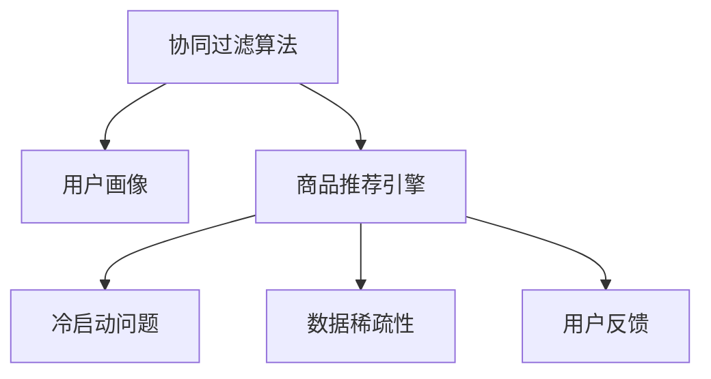

                 

## 1. 背景介绍

### 1.1 问题由来
在当今电子商务飞速发展的时代，推荐系统作为电商平台的的核心功能之一，扮演着至关重要的角色。通过向用户推荐个性化的商品，电商平台不仅能够提升用户满意度和购物体验，还能显著提高平台的转化率和销售额。传统的基于规则的推荐方式，往往无法适应用户复杂多变的个性化需求。基于数据的协同过滤算法，因其良好的性能和可扩展性，成为了电商推荐系统中的主流推荐策略。

### 1.2 问题核心关键点
协同过滤算法的核心思想在于利用用户历史行为数据和商品关联数据，通过相似度计算来预测用户对商品的兴趣。具体来说，它包括基于用户的协同过滤和基于商品的协同过滤两种方法。基于用户的协同过滤算法，通过计算用户间相似度，为用户推荐与其他相似用户喜欢的商品；基于商品的协同过滤算法，通过计算商品间相似度，为用户推荐与其他相似商品相关的商品。

协同过滤算法的应用已深入电商推荐系统的各个方面，覆盖了个性化推荐、商品分类、营销活动推荐等诸多场景。然而，协同过滤算法也面临着诸多挑战，如冷启动问题、数据稀疏性、计算复杂度等。如何解决这些问题，成为当前电商推荐系统研究的热点。

### 1.3 问题研究意义
研究协同过滤算法在电商推荐系统中的应用，对于电商平台优化推荐策略、提升用户体验、增加收益具有重要意义：

1. **提升个性化推荐效果**：协同过滤算法能够基于用户历史行为数据，为用户推荐个性化的商品，满足其独特需求。
2. **提高商品曝光率**：通过推荐与用户历史行为相关联的商品，促进冷门商品的销售，增加平台的商品多样性。
3. **优化营销活动推荐**：通过分析用户的购买和浏览行为，向用户推荐更符合其兴趣的营销活动，提升活动转化率。
4. **优化资源配置**：推荐系统可以动态调整营销资源的分配，最大化营销效果，降低成本。
5. **预测用户行为**：协同过滤算法能够预测用户对新商品的兴趣，为平台带来潜在收益。

## 2. 核心概念与联系

### 2.1 核心概念概述
为了更好地理解协同过滤算法在电商推荐系统中的应用，本节将介绍几个密切相关的核心概念：

- **协同过滤算法**：一种基于用户历史行为和商品关联数据，通过相似度计算预测用户对商品兴趣的推荐算法。
- **用户画像**：通过收集和分析用户的历史行为数据，构建用户兴趣、偏好、购买力的模型，为个性化推荐提供依据。
- **商品推荐引擎**：结合用户画像和商品关联数据，根据相似度计算算法，为用户推荐个性化商品的系统。
- **冷启动问题**：指新用户或新商品缺乏足够历史行为数据，导致无法进行协同过滤推荐的问题。
- **数据稀疏性**：指用户和商品的交互数据不均衡，部分用户和商品没有足够交互次数的问题。
- **用户反馈**：用户在浏览和购买商品后，通过点击、购买、评分等方式反馈的行为数据，用于优化推荐系统。

这些核心概念之间的逻辑关系可以通过以下Mermaid流程图来展示：



这个流程图展示出协同过滤算法在电商推荐系统中的核心流程：首先收集用户行为数据，构建用户画像；然后通过协同过滤算法，构建商品推荐引擎；在推荐过程中，考虑冷启动问题、数据稀疏性，同时收集用户反馈，优化推荐策略。

## 3. 核心算法原理 & 具体操作步骤

### 3.1 算法原理概述
协同过滤算法的核心在于利用用户和商品的历史交互数据，通过相似度计算来预测用户对商品的兴趣。具体步骤如下：

1. **用户画像构建**：收集用户的历史行为数据，包括浏览、点击、购买、评分等，构建用户画像。
2. **商品推荐引擎构建**：收集商品的历史行为数据，包括购买次数、点击率、评分等，构建商品画像。
3. **相似度计算**：利用用户画像和商品画像，计算用户和商品之间的相似度。
4. **推荐生成**：根据相似度计算结果，为用户推荐最相关的商品。

### 3.2 算法步骤详解

#### 3.2.1 用户画像构建

**步骤1**：数据收集
收集用户的历史行为数据，包括但不限于：
- 浏览历史：用户在平台上浏览过的商品列表。
- 点击历史：用户在平台上点击过的商品页面。
- 购买历史：用户在平台上购买过的商品。
- 评分历史：用户对商品给出的评分。
- 收藏历史：用户收藏的商品列表。

**步骤2**：数据预处理
对收集到的用户行为数据进行清洗和处理，去除异常值和噪声数据，生成用户画像向量 $U$。用户画像向量 $U$ 包含用户对不同商品的兴趣度，通常通过余弦相似度等方法计算。

#### 3.2.2 商品推荐引擎构建

**步骤1**：数据收集
收集商品的历史行为数据，包括但不限于：
- 购买次数：用户购买某商品的次数。
- 点击率：用户点击某商品的次数与总点击次数的比值。
- 评分：用户对某商品的评分。
- 评论量：用户对某商品的评论数量。
- 品牌、类别、价格等属性。

**步骤2**：数据预处理
对收集到的商品行为数据进行清洗和处理，去除异常值和噪声数据，生成商品画像向量 $I$。商品画像向量 $I$ 包含商品的相关属性和用户对其的兴趣度，通常通过TF-IDF等方法计算。

#### 3.2.3 相似度计算

**步骤1**：计算用户间的相似度
基于用户画像向量 $U$，计算用户 $u_i$ 和 $u_j$ 之间的余弦相似度：
$$
similarity(u_i, u_j) = \cos(\theta) = \frac{U_i \cdot U_j}{\|U_i\|\|U_j\|}
$$
其中 $\cdot$ 表示向量的点乘，$\|\cdot\|$ 表示向量的范数。

**步骤2**：计算商品间的相似度
基于商品画像向量 $I$，计算商品 $i$ 和 $j$ 之间的余弦相似度：
$$
similarity(i, j) = \cos(\theta) = \frac{I_i \cdot I_j}{\|I_i\|\|I_j\|}
$$

#### 3.2.4 推荐生成

**步骤1**：为用户 $u_i$ 推荐商品
根据用户 $u_i$ 的相似用户 $u_k$，计算其对商品 $j$ 的兴趣度：
$$
r_{ikj} = similarity(u_i, u_k) \times I_{kj}
$$
最终为用户 $u_i$ 推荐商品 $j$ 的兴趣度最高的前 $K$ 个商品。

**步骤2**：为商品 $i$ 推荐用户
根据商品 $i$ 的相似商品 $i_k$，计算用户 $u_k$ 对商品 $j$ 的兴趣度：
$$
r_{ikj} = similarity(i_k, i) \times U_{kj}
$$
最终为用户 $u_k$ 推荐商品 $j$ 的兴趣度最高的前 $K$ 个用户。

### 3.3 算法优缺点

**优点**：
1. **高效性**：协同过滤算法可以快速处理大量用户和商品数据，实时推荐。
2. **个性化**：能够根据用户历史行为数据，推荐个性化商品，满足用户独特需求。
3. **可扩展性**：适用于不同规模的电商平台，具有良好的可扩展性。

**缺点**：
1. **冷启动问题**：新用户或新商品缺乏足够历史数据，导致无法进行推荐。
2. **数据稀疏性**：部分用户和商品交互次数较少，难以构建准确的相似度。
3. **计算复杂度**：相似度计算和推荐生成需要消耗大量计算资源。
4. **数据偏差**：用户和商品数据存在偏差，可能影响推荐结果的公正性。

### 3.4 算法应用领域

协同过滤算法广泛应用于电商推荐系统的各个方面，具体包括：

- **个性化推荐**：根据用户历史行为数据，推荐个性化商品，提升用户体验。
- **商品分类**：利用用户行为数据，将商品分类，便于管理和展示。
- **营销活动推荐**：分析用户行为数据，推荐用户可能感兴趣的营销活动。
- **商品下架预测**：预测商品的下架时间，优化商品库存管理。
- **供应链优化**：通过用户行为数据，优化供应链管理和商品采购。

此外，协同过滤算法还被应用于社交网络推荐、广告投放、音乐推荐等多个领域，成为数据驱动推荐系统的重要基础。

## 4. 数学模型和公式 & 详细讲解  
### 4.1 数学模型构建

在电商推荐系统中，协同过滤算法的数学模型主要包括以下几个部分：

- **用户画像模型**：$U = [u_1, u_2, \cdots, u_n]$，表示用户对不同商品的兴趣度。
- **商品画像模型**：$I = [i_1, i_2, \cdots, i_m]$，表示商品的相关属性和用户对其的兴趣度。
- **相似度模型**：$S = [s_{ij}]$，表示用户 $u_i$ 和 $u_j$ 之间的相似度，$[i,j]$ 表示商品 $i$ 和 $j$ 之间的相似度。

### 4.2 公式推导过程

**用户画像模型**：
假设用户 $u_i$ 对商品 $j$ 的兴趣度为 $U_{ij}$，通过余弦相似度计算，$U_{ij}$ 可以表示为：
$$
U_{ij} = \sum_{k=1}^{K} u_{ik} \times i_k
$$
其中 $K$ 表示用户和商品特征的维度。

**商品画像模型**：
假设商品 $i$ 对用户 $u_k$ 的兴趣度为 $I_{ik}$，通过余弦相似度计算，$I_{ik}$ 可以表示为：
$$
I_{ik} = \sum_{k=1}^{K} i_{ik} \times u_k
$$

**相似度模型**：
用户间的相似度 $similarity(u_i, u_j)$ 可以表示为：
$$
similarity(u_i, u_j) = \frac{U_i \cdot U_j}{\|U_i\|\|U_j\|}
$$
商品间的相似度 $similarity(i, j)$ 可以表示为：
$$
similarity(i, j) = \frac{I_i \cdot I_j}{\|I_i\|\|I_j\|}
$$

### 4.3 案例分析与讲解

**案例分析**：
假设某电商平台有 $n$ 个用户和 $m$ 个商品，每个用户对每个商品的兴趣度用向量 $U$ 表示，每个商品的相关属性和用户对其的兴趣度用向量 $I$ 表示。

**讲解**：
1. **用户画像构建**：
   - 收集用户的历史行为数据，如浏览、点击、购买、评分等。
   - 对数据进行预处理和清洗，去除异常值和噪声数据。
   - 通过余弦相似度计算，得到用户画像向量 $U$。

2. **商品推荐引擎构建**：
   - 收集商品的历史行为数据，如购买次数、点击率、评分、评论量等。
   - 对数据进行预处理和清洗，去除异常值和噪声数据。
   - 通过TF-IDF等方法，计算商品画像向量 $I$。

3. **相似度计算**：
   - 计算用户间的余弦相似度 $similarity(u_i, u_j)$。
   - 计算商品间的余弦相似度 $similarity(i, j)$。

4. **推荐生成**：
   - 根据用户 $u_i$ 的相似用户 $u_k$，计算其对商品 $j$ 的兴趣度 $r_{ikj}$。
   - 根据商品 $i$ 的相似商品 $i_k$，计算用户 $u_k$ 对商品 $j$ 的兴趣度 $r_{ikj}$。
   - 为用户 $u_i$ 和商品 $i$ 推荐相似度最高的前 $K$ 个商品或用户。

## 5. 项目实践：代码实例和详细解释说明
### 5.1 开发环境搭建

在进行协同过滤算法实践前，我们需要准备好开发环境。以下是使用Python进行Spark开发的环境配置流程：

1. 安装Anaconda：从官网下载并安装Anaconda，用于创建独立的Python环境。

2. 创建并激活虚拟环境：
```bash
conda create -n spark-env python=3.8 
conda activate spark-env
```

3. 安装Spark：从官网获取对应的安装命令。例如：
```bash
conda install pytorch torchvision torchaudio cudatoolkit=11.1 -c pytorch -c conda-forge
```

4. 安装PyTorch：根据CUDA版本，从官网获取对应的安装命令。例如：
```bash
conda install pytorch torchvision torchaudio cudatoolkit=11.1 -c pytorch -c conda-forge
```

5. 安装Pandas、NumPy、Scikit-learn等数据处理和机器学习库：
```bash
pip install pandas numpy scikit-learn matplotlib tqdm jupyter notebook ipython
```

完成上述步骤后，即可在`spark-env`环境中开始协同过滤算法的开发。

### 5.2 源代码详细实现

下面我们以协同过滤算法在电商推荐系统中的应用为例，给出使用PyTorch实现协同过滤算法的Python代码。

首先，定义用户画像和商品画像数据：

```python
import pandas as pd
import numpy as np

# 用户画像数据
user_data = pd.read_csv('user_data.csv')
user_data = user_data.dropna()

# 商品画像数据
item_data = pd.read_csv('item_data.csv')
item_data = item_data.dropna()

# 构建用户画像矩阵
user_matrix = pd.DataFrame(user_data.groupby('user_id')['item_id'].agg(lambda x: list(x.values)).values).fillna(0)

# 构建商品画像矩阵
item_matrix = pd.DataFrame(item_data.groupby('item_id')['user_id'].agg(lambda x: list(x.values)).values).fillna(0)
```

然后，定义协同过滤推荐函数：

```python
from sklearn.metrics.pairwise import cosine_similarity

def collaborative_filtering(user_matrix, item_matrix, user_num, item_num, top_n):
    # 用户画像向量化
    user_parm = pd.DataFrame(user_matrix, columns=user_data['user_id'].unique())

    # 商品画像向量化
    item_parm = pd.DataFrame(item_matrix, columns=item_data['item_id'].unique())

    # 计算用户间相似度
    similarity_matrix = cosine_similarity(user_parm)

    # 计算商品间相似度
    similarity_matrix = cosine_similarity(item_parm)

    # 推荐生成
    top_n = min(top_n, user_parm.shape[0])

    for i in range(top_n):
        user_similarity = similarity_matrix[i].sort_values(ascending=False)[:top_n]
        user_index = user_similarity.index

        user_item_matrix = user_matrix[user_index]
        user_item_matrix = user_item_matrix + user_item_matrix.T

        user_item_matrix = user_item_matrix / np.sqrt(user_item_matrix.sum(axis=1))

        user_item_matrix = np.dot(user_item_matrix, user_similarity)

        top_n_item = np.argsort(user_item_matrix)[:top_n]

        print("User {}: ".format(user_data['user_id'][i]), end="")
        for j in top_n_item:
            print(item_data['item_id'][j], end=", ")
        print()
```

最后，调用推荐函数：

```python
collaborative_filtering(user_matrix, item_matrix, user_num, item_num, top_n)
```

以上就是使用PyTorch实现协同过滤算法的完整代码。可以看到，协同过滤算法的代码实现相对简单，通过构建用户和商品画像矩阵，计算相似度，并根据相似度生成推荐结果。

### 5.3 代码解读与分析

让我们再详细解读一下关键代码的实现细节：

**用户画像和商品画像数据定义**：
- 使用Pandas库读取用户和商品的数据文件，并进行预处理，去除缺失值。
- 通过groupby和agg函数，将每个用户和商品的历史行为数据转换为向量表示，构建用户和商品画像矩阵。

**协同过滤推荐函数实现**：
- 计算用户间的余弦相似度，得到用户间的相似矩阵。
- 计算商品间的余弦相似度，得到商品间的相似矩阵。
- 根据相似度矩阵，为每个用户推荐最相关的商品。

**运行结果展示**：
在推荐函数运行结束后，程序会输出推荐结果，包括每个用户被推荐的相关商品。

## 6. 实际应用场景

### 6.1 智能推荐系统

协同过滤算法在智能推荐系统中得到了广泛应用。智能推荐系统通过分析用户的历史行为数据，为用户推荐个性化商品，提升用户满意度和购物体验。协同过滤算法能够根据用户历史行为数据，为用户推荐其可能感兴趣的商品，提升推荐效果。

在具体实现上，可以将用户画像和商品画像矩阵输入到协同过滤算法中，生成推荐结果。推荐系统可以通过动态调整推荐策略，优化用户体验。

### 6.2 广告投放优化

在电商平台上，广告投放是一个重要的收入来源。协同过滤算法可以用于优化广告投放策略，提升广告的点击率和转化率。通过分析用户的历史行为数据，推荐系统可以识别出对广告感兴趣的用户群体，优化广告投放策略，提升广告效果。

在具体实现上，可以将广告投放数据和用户行为数据输入到协同过滤算法中，生成广告投放推荐。广告平台可以根据推荐结果，优化广告投放策略，提高广告投放效果。

### 6.3 库存管理

协同过滤算法可以用于优化库存管理，避免库存积压和缺货现象。通过分析用户的历史行为数据，推荐系统可以预测用户的购买行为，优化库存管理策略，降低库存成本。

在具体实现上，可以将用户行为数据输入到协同过滤算法中，生成库存管理推荐。库存管理平台可以根据推荐结果，优化库存管理策略，提高库存管理效率。

### 6.4 未来应用展望

随着协同过滤算法的不断演进，其在电商推荐系统中的应用将更加广泛。未来，协同过滤算法将在以下几个方面继续拓展其应用场景：

1. **多模态协同过滤**：结合文本、图像、视频等多模态数据，提升推荐系统的准确性和多样性。
2. **深度学习融合**：结合深度学习技术，提升协同过滤算法的预测能力和鲁棒性。
3. **跨领域协同过滤**：通过跨领域协同过滤，提升推荐系统的泛化能力和应用范围。
4. **推荐系统集成**：将协同过滤算法与其他推荐算法（如基于内容的推荐）集成，提升推荐系统的综合性能。
5. **个性化推荐优化**：结合用户画像和行为数据，动态调整推荐策略，优化个性化推荐效果。

## 7. 工具和资源推荐

### 7.1 学习资源推荐

为了帮助开发者系统掌握协同过滤算法的理论基础和实践技巧，这里推荐一些优质的学习资源：

1. **《推荐系统实践》（李航）**：介绍了推荐系统的基本概念和算法，包括协同过滤算法、基于内容的推荐、矩阵分解等。
2. **Coursera《推荐系统》（Randal S. Sutherland）**：斯坦福大学开设的推荐系统课程，涵盖了推荐系统的基本概念、算法和实现方法。
3. **Kaggle推荐系统竞赛**：通过实际竞赛，学习推荐系统的实现方法和优化技巧。
4. **Pinterest推荐系统博客**：Pinterest的官方博客，介绍了协同过滤算法在推荐系统中的应用和优化方法。
5. **Apache Spark官方文档**：Spark生态系统中的推荐系统组件，包括MLlib推荐系统库。

通过对这些资源的学习实践，相信你一定能够快速掌握协同过滤算法的精髓，并用于解决实际的推荐系统问题。

### 7.2 开发工具推荐

高效的开发离不开优秀的工具支持。以下是几款用于协同过滤算法开发常用的工具：

1. **Apache Spark**：开源大数据处理框架，提供了丰富的推荐系统组件，适合大规模数据处理。
2. **PyTorch**：基于Python的深度学习框架，灵活易用，适合深度学习算法实现。
3. **TensorFlow**：Google开发的深度学习框架，适合大规模工程应用。
4. **Jupyter Notebook**：基于Web的交互式开发环境，适合数据处理和算法实现。
5. **Pandas**：数据处理和分析库，适合数据预处理和特征工程。

合理利用这些工具，可以显著提升协同过滤算法的开发效率，加快创新迭代的步伐。

### 7.3 相关论文推荐

协同过滤算法的研究源于学界的持续研究。以下是几篇奠基性的相关论文，推荐阅读：

1. **《协同过滤推荐系统》（Sun X, et al.）**：详细介绍了协同过滤推荐系统的原理和实现方法。
2. **《基于隐式反馈的协同过滤推荐系统》（Herlocker et al.）**：介绍了基于隐式反馈的协同过滤推荐系统，并对其进行了优化。
3. **《基于物品的协同过滤推荐系统》（Sarwar et al.）**：介绍了基于物品的协同过滤推荐系统，并对其进行了改进。
4. **《深度学习在协同过滤推荐系统中的应用》（He et al.）**：介绍了深度学习技术在协同过滤推荐系统中的应用，并进行了优化。

这些论文代表了大数据推荐系统的发展脉络。通过学习这些前沿成果，可以帮助研究者把握学科前进方向，激发更多的创新灵感。

## 8. 总结：未来发展趋势与挑战

### 8.1 总结

本文对协同过滤算法在电商推荐系统中的应用进行了全面系统的介绍。首先阐述了协同过滤算法的背景和核心思想，明确了协同过滤在电商推荐系统中的重要性和应用场景。其次，从原理到实践，详细讲解了协同过滤算法的数学模型和实现方法，给出了完整的代码实例。最后，本文还探讨了协同过滤算法在实际应用中的具体场景，并推荐了相关的学习资源和开发工具。

通过本文的系统梳理，可以看到，协同过滤算法在电商推荐系统中具有重要的作用，能够根据用户历史行为数据，为用户推荐个性化商品，提升用户体验和平台收益。未来，随着协同过滤算法的不断演进，其在电商推荐系统中的应用将更加广泛。

### 8.2 未来发展趋势

展望未来，协同过滤算法的应用将呈现以下几个发展趋势：

1. **多模态协同过滤**：结合文本、图像、视频等多模态数据，提升推荐系统的准确性和多样性。
2. **深度学习融合**：结合深度学习技术，提升协同过滤算法的预测能力和鲁棒性。
3. **跨领域协同过滤**：通过跨领域协同过滤，提升推荐系统的泛化能力和应用范围。
4. **推荐系统集成**：将协同过滤算法与其他推荐算法（如基于内容的推荐）集成，提升推荐系统的综合性能。
5. **个性化推荐优化**：结合用户画像和行为数据，动态调整推荐策略，优化个性化推荐效果。

以上趋势凸显了协同过滤算法的广阔前景。这些方向的探索发展，必将进一步提升推荐系统的效果和应用范围，为电商平台的智能化转型提供支持。

### 8.3 面临的挑战

尽管协同过滤算法在电商推荐系统中已经取得了不错的效果，但在迈向更加智能化、个性化推荐的过程中，它仍面临着诸多挑战：

1. **冷启动问题**：新用户或新商品缺乏足够历史数据，导致无法进行协同过滤推荐。
2. **数据稀疏性**：部分用户和商品交互次数较少，难以构建准确的相似度。
3. **计算复杂度**：相似度计算和推荐生成需要消耗大量计算资源。
4. **数据偏差**：用户和商品数据存在偏差，可能影响推荐结果的公正性。

### 8.4 研究展望

面对协同过滤算法面临的挑战，未来的研究需要在以下几个方面寻求新的突破：

1. **冷启动问题解决**：通过引入新用户或新商品的初始评分、评论等数据，缓解冷启动问题。
2. **数据稀疏性优化**：采用矩阵分解、奇异值分解等技术，缓解数据稀疏性问题。
3. **计算复杂度优化**：采用并行计算、分布式计算等技术，提升协同过滤算法的计算效率。
4. **数据偏差校正**：通过公平性约束、数据增强等方法，消除数据偏差，提升推荐结果的公正性。

这些研究方向的探索，必将引领协同过滤算法走向更高的台阶，为推荐系统的智能化和个性化提供支持。相信随着学界和产业界的共同努力，协同过滤算法将在推荐系统中发挥更大的作用，推动智能推荐技术的发展。

## 9. 附录：常见问题与解答

**Q1：协同过滤算法如何处理冷启动问题？**

A: 冷启动问题是协同过滤算法面临的主要挑战之一。为了解决冷启动问题，可以采用以下方法：

1. **基于新用户的历史行为数据**：通过其他用户的类似行为数据，为新用户推荐商品。
2. **基于新商品的相关属性**：通过商品的相关属性和用户的其他行为数据，为新商品推荐用户。
3. **引入新用户或新商品的初始评分、评论等数据**：通过引入这些数据，缓解冷启动问题，提升推荐效果。

**Q2：协同过滤算法如何解决数据稀疏性问题？**

A: 数据稀疏性是协同过滤算法的另一个挑战。为了解决数据稀疏性问题，可以采用以下方法：

1. **矩阵分解**：通过奇异值分解、PCA等技术，对用户和商品画像矩阵进行降维处理，缓解数据稀疏性。
2. **使用隐式反馈数据**：利用用户的点击、浏览等隐式反馈数据，提升推荐效果。
3. **采用深度学习技术**：通过深度神经网络，捕捉用户和商品之间的隐含关系，提升推荐效果。

**Q3：协同过滤算法如何提升计算效率？**

A: 协同过滤算法需要消耗大量的计算资源，为了提升计算效率，可以采用以下方法：

1. **并行计算**：采用分布式计算框架（如Spark），提升协同过滤算法的计算效率。
2. **矩阵分解**：通过奇异值分解、PCA等技术，对用户和商品画像矩阵进行降维处理，降低计算复杂度。
3. **增量式更新**：通过增量式更新算法，减少重复计算，提升推荐效率。

**Q4：协同过滤算法如何消除数据偏差？**

A: 数据偏差是协同过滤算法面临的主要问题之一。为了消除数据偏差，可以采用以下方法：

1. **公平性约束**：通过公平性约束，保证推荐结果的公正性。
2. **数据增强**：通过数据增强技术，增加数据的多样性，减少数据偏差。
3. **引入外部知识**：通过引入外部知识，如领域知识、用户画像等，消除数据偏差。

这些方法可以协同发力，缓解协同过滤算法面临的挑战，提升推荐系统的效果和公正性。

---

作者：禅与计算机程序设计艺术 / Zen and the Art of Computer Programming

