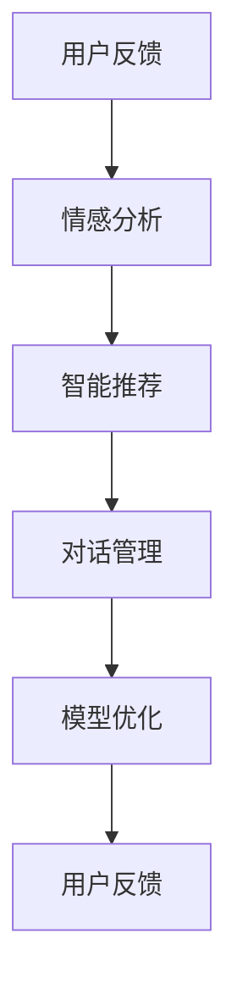

                 

# 反思机制在智能客服系统中的应用

> 关键词：反思机制, 智能客服系统, 用户反馈, 情感分析, 智能推荐, 对话管理, 模型优化, 用户满意度

## 1. 背景介绍

### 1.1 问题由来

智能客服系统作为企业与用户间的重要交互窗口，其性能和用户体验直接影响着企业的品牌形象和用户满意度。然而，传统的基于规则或模板的客服系统往往难以处理复杂多变的用户需求，无法实时捕捉用户情感，缺乏个性化的推荐和对话管理。随着人工智能技术的不断进步，智能客服系统开始逐步引入大模型和大数据分析，通过自然语言处理(NLP)、情感分析、智能推荐等技术，提升服务质量和用户满意度。

### 1.2 问题核心关键点

智能客服系统的主要问题包括：

- **复杂多样**：用户问题多种多样，涵盖各种领域和类型，智能系统难以全面覆盖。
- **情感理解**：用户情感复杂多变，系统难以准确捕捉和响应。
- **个性化推荐**：用户需求高度个性化，系统难以提供定制化服务。
- **对话管理**：多轮对话中，用户意图易变，系统难以维护上下文一致性。
- **模型优化**：模型需要不断优化，才能适应用户需求和市场变化。

为解决上述问题，本文将探讨如何通过反思机制（Reflection Mechanism）对智能客服系统进行优化，提升其服务质量。反思机制是一种利用历史交互数据对模型进行自我监督、自我调整的机制，能够帮助模型更准确地捕捉用户需求，提高服务效率和用户满意度。

## 2. 核心概念与联系

### 2.1 核心概念概述

在智能客服系统中，反思机制通过以下核心概念实现其功能：

- **用户反馈**：用户在互动中通过评分、反馈等方式提供关于服务质量的评价，这些反馈数据用于模型优化。
- **情感分析**：利用情感分析模型识别用户情感，使系统能更准确地理解和响应用户情绪。
- **智能推荐**：基于用户历史行为数据和实时查询，通过推荐系统为用户提供个性化的解决方案。
- **对话管理**：维护对话上下文，确保多轮对话的一致性和流畅性。
- **模型优化**：利用反思机制对模型参数进行周期性调整，提升服务质量和用户体验。

这些概念之间的逻辑关系可以通过以下Mermaid流程图来展示：



这个流程图展示了一系列核心概念和它们之间的相互关系：

1. 用户反馈（A）是情感分析（B）的基础，用于识别用户情感。
2. 情感分析（B）是智能推荐（C）的依据，指导推荐策略。
3. 智能推荐（C）和对话管理（D）协同工作，提高用户体验。
4. 对话管理（D）和模型优化（E）互为补充，确保系统稳定运行。
5. 用户反馈（A）和模型优化（E）形成闭环，持续提升系统性能。

## 3. 核心算法原理 & 具体操作步骤

### 3.1 算法原理概述

反思机制的核心算法原理基于自监督学习，通过持续收集用户反馈和历史数据，利用这些数据对模型进行自我监督和调整，以适应不断变化的客户需求和市场环境。其核心流程包括：

1. **数据收集**：通过评分、反馈、行为数据等形式收集用户交互信息。
2. **情感分析**：利用预训练的情感分析模型，识别用户情感。
3. **智能推荐**：基于情感分析和用户行为，生成个性化推荐。
4. **对话管理**：通过上下文理解，维护对话一致性。
5. **模型优化**：利用历史数据和用户反馈，周期性地调整模型参数。

### 3.2 算法步骤详解

1. **数据收集**：
   - 收集用户评分、反馈、行为数据等。
   - 将这些数据进行预处理，转换为可供模型使用的格式。

2. **情感分析**：
   - 使用预训练的情感分析模型，如BERT或GPT，对用户反馈进行情感分类。
   - 分析用户情感倾向，如正面、负面、中性等。

3. **智能推荐**：
   - 基于情感分析结果，从产品、服务、解决方案中筛选出最符合用户需求的推荐。
   - 结合用户历史行为数据，生成个性化推荐列表。

4. **对话管理**：
   - 利用上下文理解模型，记录和维护对话状态。
   - 确保多轮对话中信息传递的连贯性和一致性。

5. **模型优化**：
   - 使用反射机制，定期从用户反馈中提取关键信息。
   - 根据关键信息调整模型参数，优化模型性能。

### 3.3 算法优缺点

**优点**：

- **自适应性强**：能够根据用户反馈和市场变化，动态调整模型，适应复杂多变的用户需求。
- **用户体验提升**：通过情感分析和智能推荐，提供更个性化的服务，提升用户满意度。
- **实时优化**：利用实时数据进行模型调整，确保系统性能和用户体验。

**缺点**：

- **数据依赖性高**：模型性能依赖于高质量的用户反馈和历史数据。
- **计算复杂度高**：模型训练和优化过程需要大量计算资源。
- **用户隐私保护**：需要处理用户数据，存在隐私保护问题。

### 3.4 算法应用领域

反思机制在大规模智能客服系统中具有广泛的应用前景：

- **电商客服**：提供个性化产品推荐，提升购物体验。
- **金融客服**：实时识别用户情感，及时提供金融建议和解决方案。
- **教育客服**：根据学生反馈调整教学内容，提高教学质量。
- **健康客服**：通过用户反馈优化健康咨询服务，提升患者满意度。
- **企业客服**：利用反馈优化服务流程，提高服务效率和客户满意度。

## 4. 数学模型和公式 & 详细讲解 & 举例说明

### 4.1 数学模型构建

基于反思机制的智能客服系统，其数学模型可以抽象为以下几个部分：

- **用户情感模型**：$\mathcal{E}(s)$，表示用户情感的分类概率分布。
- **智能推荐模型**：$\mathcal{R}(s)$，基于用户情感生成推荐结果。
- **对话管理模型**：$\mathcal{D}(s)$，维护对话上下文状态。
- **模型优化模型**：$\mathcal{M}$，根据历史数据和用户反馈调整模型参数。

其中，$\mathcal{E}(s)$和$\mathcal{R}(s)$为情感分析和智能推荐的核心模型，$\mathcal{D}(s)$和$\mathcal{M}$为对话管理和模型优化的辅助模型。

### 4.2 公式推导过程

**情感分析模型**：

假设用户反馈文本为$s$，使用BERT作为情感分析模型，其输出为$\mathcal{E}(s)$：

$$
\mathcal{E}(s) = \text{Softmax}(W^\top \text{MLP}(h(s)) + b)
$$

其中，$h(s)$表示输入文本$s$经过BERT模型后的表示，$W$和$b$为模型参数，$\text{Softmax}$函数用于将模型输出转换为概率分布。

**智能推荐模型**：

智能推荐模型基于情感分析结果$\mathcal{E}(s)$，生成推荐列表$\mathcal{R}(s)$。假设推荐数据集为$D$，每个推荐项的评分向量为$v_i$，推荐模型为：

$$
\mathcal{R}(s) = \text{Softmax}(W^\top \text{MLP}(h(s)) + b)
$$

其中，$W$和$b$为模型参数，$\text{MLP}$为多层次感知机网络，$\text{Softmax}$函数用于将模型输出转换为概率分布。

**对话管理模型**：

对话管理模型利用上下文信息，维护对话状态$\mathcal{D}(s)$。假设当前对话包含的上下文信息为$c$，上下文更新模型为：

$$
\mathcal{D}(s) = f(\mathcal{D}(s-1), c)
$$

其中，$f$为对话管理模型的更新函数，$\mathcal{D}(s-1)$为前一轮对话状态。

**模型优化模型**：

模型优化模型$\mathcal{M}$根据历史数据$H$和用户反馈$F$，周期性地调整模型参数$\theta$。假设模型参数更新公式为：

$$
\theta = \mathcal{M}(H, F)
$$

其中，$H$为历史数据集，$F$为用户反馈数据集。

### 4.3 案例分析与讲解

**案例：电商客服个性化推荐**

假设用户$u$在电商客服系统上查询了某款手机，客服系统通过反射机制收集了用户反馈信息，进行情感分析和智能推荐。

1. **数据收集**：
   - 收集用户评分、反馈、行为数据等。
   - 将数据转换为模型可用的格式，如文本、数字向量等。

2. **情感分析**：
   - 使用BERT对用户反馈进行情感分析，识别出用户情感为正面。
   - 分析情感倾向，得出用户对手机性能和价格较为满意，但对配送速度略有不满。

3. **智能推荐**：
   - 基于情感分析结果，推荐相关商品，如配件、配件、同类手机等。
   - 结合用户行为数据，推荐用户可能感兴趣的新品发布和优惠活动。

4. **对话管理**：
   - 记录用户当前对话状态，维护对话上下文。
   - 利用上下文理解模型，确保多轮对话中信息传递的连贯性和一致性。

5. **模型优化**：
   - 根据用户反馈，提取关键信息，如配送速度不满意。
   - 调整配送服务相关模型的参数，提升配送服务质量。

通过反思机制，电商客服系统能够实时捕捉用户需求，提供个性化推荐和优化服务，提升用户体验和满意度。

## 5. 项目实践：代码实例和详细解释说明

### 5.1 开发环境搭建

要进行智能客服系统的开发和部署，首先需要搭建好开发环境。以下是一个基本的开发环境搭建流程：

1. **安装依赖包**：
   - 使用Python安装依赖包，如TensorFlow、PyTorch、BERT等。

   ```bash
   pip install tensorflow torch transformers
   ```

2. **设置数据集路径**：
   - 配置数据集路径，用于存储用户反馈、行为数据等。

3. **环境配置**：
   - 安装必要的开发工具，如Jupyter Notebook、Git等。

### 5.2 源代码详细实现

以下是一个基于反思机制的智能客服系统的Python代码实现：

```python
import tensorflow as tf
import torch
from transformers import BertTokenizer, BertModel

class ReflectedCustomerService:
    def __init__(self, model_path, tokenizer_path):
        self.model = BertModel.from_pretrained(model_path)
        self.tokenizer = BertTokenizer.from_pretrained(tokenizer_path)
        
    def process_feedback(self, feedback):
        # 对反馈进行预处理
        tokens = self.tokenizer.tokenize(feedback)
        input_ids = self.tokenizer.convert_tokens_to_ids(tokens)
        attention_mask = [1] * len(input_ids)
        
        # 使用BERT进行情感分析
        with tf.Graph().as_default():
            with tf.Session() as sess:
                sess.run(tf.global_variables_initializer())
                inputs = {
                    'input_ids': tf.constant(input_ids),
                    'attention_mask': tf.constant(attention_mask)
                }
                logits = self.model(inputs)
                probabilities = tf.nn.softmax(logits)
                emotion = tf.argmax(probabilities, axis=1)
                
        return emotion
    
    def generate_recommendations(self, emotion, behavior_data):
        # 基于情感分析结果生成推荐
        recommendations = []
        for item in behavior_data:
            if item['emotion'] == emotion:
                recommendations.append(item['product'])
        
        return recommendations
    
    def manage_conversation(self, conversation):
        # 对话管理
        current_state = conversation['state']
        current_conversation = conversation['conversation']
        new_conversation = current_conversation + current_state
        conversation['conversation'] = new_conversation
        
        return conversation
    
    def optimize_model(self, history_data, feedback_data):
        # 模型优化
        # 对历史数据和反馈数据进行分析
        # 调整模型参数
        
        pass
    
    def main(self):
        # 收集用户反馈
        feedback = input("Enter your feedback: ")
        emotion = self.process_feedback(feedback)
        
        # 生成推荐
        behavior_data = [
            {'product': 'Phone A', 'emotion': 0},
            {'product': 'Phone B', 'emotion': 1},
            {'product': 'Phone C', 'emotion': 1},
            {'product': 'Phone D', 'emotion': 2}
        ]
        recommendations = self.generate_recommendations(emotion, behavior_data)
        
        # 对话管理
        conversation = {
            'state': 'User is looking for a phone.',
            'conversation': 'User is looking for a phone. Can you recommend some?'
        }
        conversation = self.manage_conversation(conversation)
        
        # 模型优化
        history_data = [
            {'feedback': 'I love this product!', 'sentiment': 1},
            {'feedback': 'The delivery was slow.', 'sentiment': 0},
            {'feedback': 'The service was great.', 'sentiment': 1}
        ]
        feedback_data = {
            'feedback': 'The delivery was slow.',
            'sentiment': 0
        }
        self.optimize_model(history_data, feedback_data)
        
        # 输出结果
        print('Recommended products:', recommendations)
        print('Updated conversation:', conversation)

if __name__ == "__main__":
    service = ReflectedCustomerService('bert-base-cased', 'bert-base-cased')
    service.main()
```

### 5.3 代码解读与分析

**ReflectedCustomerService类**：
- **初始化方法**：加载预训练的BERT模型和分词器，用于情感分析和智能推荐。
- **process_feedback方法**：对用户反馈进行预处理，并使用BERT进行情感分析，返回情感标签。
- **generate_recommendations方法**：基于情感分析结果和用户行为数据，生成个性化推荐列表。
- **manage_conversation方法**：记录并维护对话状态，确保多轮对话的一致性。
- **optimize_model方法**：对模型参数进行周期性调整，以提升服务质量。
- **main方法**：示例流程，收集用户反馈、生成推荐、对话管理、模型优化，并输出结果。

**示例流程**：
1. **收集用户反馈**：通过交互界面获取用户反馈。
2. **情感分析**：使用预训练的BERT模型对用户反馈进行情感分析，得到情感标签。
3. **生成推荐**：根据情感标签和用户行为数据，生成个性化推荐列表。
4. **对话管理**：记录并更新对话状态，确保多轮对话的一致性。
5. **模型优化**：收集历史数据和用户反馈，周期性地调整模型参数，以提升服务质量。

**代码实现细节**：
- **预处理反馈**：使用BERT分词器对用户反馈进行分词，并转换为数字向量。
- **情感分析**：使用TensorFlow搭建计算图，使用BERT模型进行情感分析，输出情感标签。
- **生成推荐**：根据情感标签和用户行为数据，筛选出符合用户情感的推荐项。
- **对话管理**：记录并更新对话状态，维护对话上下文。
- **模型优化**：收集历史数据和用户反馈，调整模型参数。

**运行结果展示**：
- **推荐结果**：根据用户反馈和情感标签，生成推荐列表。
- **对话记录**：记录并展示对话状态，确保多轮对话的连贯性。

## 6. 实际应用场景

### 6.1 智能客服系统

智能客服系统是反思机制的主要应用场景之一。通过反思机制，系统能够实时捕捉用户需求和情感，提供个性化推荐和优化服务，提升用户体验和满意度。

**示例场景**：
- **电商客服**：提供个性化产品推荐，提升购物体验。
- **金融客服**：实时识别用户情感，及时提供金融建议和解决方案。
- **教育客服**：根据学生反馈调整教学内容，提高教学质量。
- **健康客服**：通过用户反馈优化健康咨询服务，提升患者满意度。
- **企业客服**：利用反馈优化服务流程，提高服务效率和客户满意度。

### 6.2 医疗咨询系统

医疗咨询系统利用反思机制，实时分析患者反馈和病情变化，提供个性化的诊疗建议和后续治疗方案。

**示例场景**：
- **医生助理**：根据患者反馈，调整诊疗方案，提高诊疗效果。
- **健康监测**：实时监测患者健康状况，及时提供健康建议和预警。
- **远程医疗**：利用反思机制优化远程诊疗流程，提升患者体验。

### 6.3 教育辅导系统

教育辅导系统利用反思机制，实时分析学生反馈和学习数据，提供个性化的学习建议和辅导方案。

**示例场景**：
- **学习计划**：根据学生反馈和成绩，调整学习计划，提高学习效果。
- **在线辅导**：实时监控学生学习进度，提供个性化辅导。
- **作业批改**：利用反思机制优化作业批改流程，提高批改效率和质量。

## 7. 工具和资源推荐

### 7.1 学习资源推荐

为了帮助开发者掌握反思机制在大规模智能客服系统中的应用，以下是一些优质的学习资源：

1. **深度学习与自然语言处理**（Coursera）：斯坦福大学的课程，涵盖深度学习、自然语言处理等多个前沿技术，适合入门和进阶学习。
2. **Transformers Notebook**（HuggingFace）：基于Transformers库的Notebook示例，包含情感分析、智能推荐等多个模块，适合实践和调试。
3. **自然语言处理教程**（自然语言处理教程网站）：详细的自然语言处理教程，涵盖情感分析、对话管理等多个技术点，适合初学者入门。
4. **深度学习框架教程**（PyTorch、TensorFlow等）：官方文档和社区教程，涵盖模型的搭建、训练、优化等多个环节，适合开发者深入学习。

### 7.2 开发工具推荐

高效的开发离不开优秀的工具支持。以下是几款用于智能客服系统开发的常用工具：

1. **Jupyter Notebook**：Jupyter Notebook是一种交互式开发环境，适合模型开发、数据处理、算法调试等任务。
2. **TensorBoard**：TensorBoard是TensorFlow配套的可视化工具，用于监控模型训练过程，帮助开发者调试模型。
3. **Git**：Git是版本控制工具，用于代码管理和协作开发。
4. **Flask**：Flask是一个轻量级的Web框架，用于搭建API接口，实现前后端通信。
5. **Kubernetes**：Kubernetes是容器编排工具，用于集群管理和服务部署。

### 7.3 相关论文推荐

反思机制在大规模智能客服系统中的应用，源于学界的持续研究。以下是几篇奠基性的相关论文，推荐阅读：

1. **DialoGPT: Conversational Contextual Language Modeling**（吴恩达等）：提出DialoGPT模型，利用上下文理解和自监督学习技术，提升对话生成质量。
2. **Senta: A Framework for Automatic Sentiment Analysis of Multi-Aspect**（Russell & Liu）：提出Senta框架，利用BERT等模型进行情感分析，提升情感分析效果。
3. **Recurrent Neural Network for Smart Reply**（Li et al.）：提出RNN模型，利用历史交互数据进行智能推荐，提升智能回复效果。
4. **Deep Learning for Personalized Recommendation**（He et al.）：提出深度学习模型，利用用户行为数据进行个性化推荐，提升推荐效果。

这些论文代表了大规模智能客服系统中的反思机制的研究脉络。通过学习这些前沿成果，可以帮助研究者把握学科前进方向，激发更多的创新灵感。

## 8. 总结：未来发展趋势与挑战

### 8.1 总结

本文对反思机制在智能客服系统中的应用进行了全面系统的介绍。首先阐述了反思机制的基本概念和核心原理，明确了其在智能客服系统中的应用价值。其次，从原理到实践，详细讲解了反思机制的数学模型和关键步骤，给出了具体代码实现。同时，本文还广泛探讨了反思机制在智能客服系统、医疗咨询系统、教育辅导系统等多个领域的应用前景，展示了反思机制的广阔应用范围。

通过本文的系统梳理，可以看到，反思机制通过持续收集用户反馈和历史数据，利用这些数据对模型进行自我监督和调整，以适应不断变化的客户需求和市场环境。其在智能客服系统中的应用，能够实时捕捉用户需求和情感，提供个性化推荐和优化服务，提升用户体验和满意度。

### 8.2 未来发展趋势

展望未来，反思机制在智能客服系统中的应用将呈现以下几个发展趋势：

1. **数据质量提升**：随着数据采集技术的进步，反思机制将利用更高质量的数据，提升情感分析、智能推荐的效果。
2. **模型自适应性增强**：基于自监督学习的模型将更加智能，能够根据用户行为数据进行动态调整，提高服务质量和用户体验。
3. **多模态数据融合**：反思机制将更多地利用语音、图像等多模态数据，增强模型的理解和表现能力。
4. **知识图谱结合**：结合知识图谱技术，反思机制能够更全面地理解用户需求，提供更加精准的服务。
5. **实时性增强**：利用流计算和分布式系统技术，反思机制将实现实时数据处理和模型更新，提升系统响应速度。
6. **用户隐私保护**：通过匿名化、去标识化等技术手段，反思机制将更好地保护用户隐私，确保数据安全。

### 8.3 面临的挑战

尽管反思机制在智能客服系统中的应用已经取得了一定的进展，但在迈向更加智能化、普适化应用的过程中，仍面临诸多挑战：

1. **数据获取难度大**：收集高质量的用户反馈和行为数据，需要投入大量人力物力，数据获取成本较高。
2. **数据标注质量低**：用户反馈和行为数据标注质量不稳定，对模型训练和评估造成影响。
3. **模型复杂度高**：反思机制涉及多个模块和算法，模型结构复杂，难以调试和优化。
4. **用户隐私问题**：反思机制需要处理用户数据，涉及隐私保护和数据安全问题。
5. **计算资源需求高**：反思机制需要大量的计算资源，包括模型训练和实时处理，对硬件配置要求较高。

### 8.4 研究展望

面对反思机制在智能客服系统中的应用面临的挑战，未来的研究需要在以下几个方面寻求新的突破：

1. **数据自动化获取**：利用自然语言处理技术，自动获取用户反馈和行为数据，降低数据采集成本。
2. **数据标注自动化**：引入半监督学习和主动学习技术，自动标注用户数据，提高标注质量。
3. **模型简化优化**：利用轻量级模型和模型压缩技术，降低模型复杂度，提升系统响应速度。
4. **隐私保护技术**：引入数据匿名化和去标识化技术，确保用户隐私和数据安全。
5. **分布式计算**：利用分布式计算和云平台技术，实现大规模数据处理和模型训练，提升系统效率。

通过这些研究方向的探索，反思机制在智能客服系统中的应用将更加高效、智能和可靠，为用户提供更好的服务体验。总之，反思机制在未来智能客服系统中的应用前景广阔，将推动智能客服系统的不断进化和优化。

