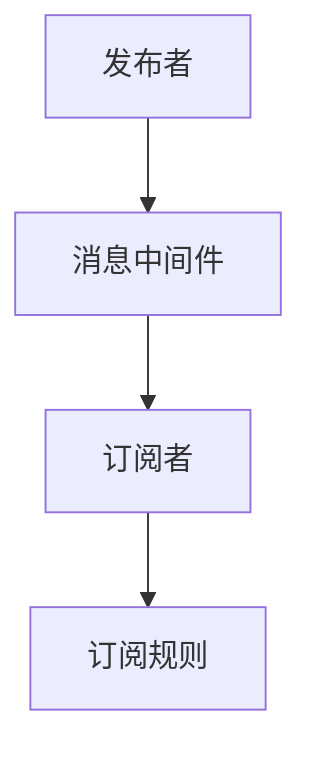

                 

# 发布订阅 原理与代码实例讲解

> 关键词：事件驱动, 发布订阅, 消息中间件, 异步编程, 消息队列, 异步通信

## 1. 背景介绍

### 1.1 问题由来
在现代的软件系统中，事件驱动和异步编程日益成为主流开发模式。事件驱动编程可以更好地利用CPU和I/O设备的并行处理能力，提升系统性能。异步编程则可以实现无阻塞的并发操作，优化网络通信性能。在事件驱动和异步编程中，一个关键的技术就是发布订阅(Publish-Subscribe, Pub/Sub)模式。

发布订阅模式是一种基于消息的通信机制，系统中的组件通过订阅自己关心的消息，从而在收到消息时能进行相应的处理。这种模式在各种分布式系统中广泛应用，如消息中间件、Web服务器、物联网系统等。其核心思想是松耦合、异步通信、高扩展性。

### 1.2 问题核心关键点
发布订阅模式的核心在于：
- 消息的发布和订阅。组件之间通过发布者发布消息，订阅者订阅感兴趣的消息。
- 解耦合机制。发布者和订阅者之间是松耦合关系，解除了紧耦合带来的依赖。
- 异步通信。消息传递采用异步方式，提升系统的并发性能。
- 高扩展性。订阅者可以根据需要动态添加或删除，适应系统动态变化的需求。

以上几个关键点构成发布订阅模式的核心理念，使其在现代软件系统中得到了广泛应用。

### 1.3 问题研究意义
研究发布订阅模式及其在实际系统中的应用，对于提升系统性能、增强系统扩展性、简化系统架构具有重要意义。掌握发布订阅模式的原理和实现方法，可以帮助开发者更好地设计异步通信、事件驱动的分布式系统，提升系统可靠性和稳定性。

## 2. 核心概念与联系

### 2.1 核心概念概述

为更好地理解发布订阅模式，本节将介绍几个密切相关的核心概念：

- 发布者(Publisher)：发布消息的组件。
- 订阅者(Subscriber)：订阅消息的组件。
- 消息(Message)：发布者发出的消息内容。
- 事件(Event)：消息的一种特定类型，通常与特定的动作或状态改变相关。
- 主题(Topic)：一组相关事件的集合。
- 消息中间件(Message Broker)：充当消息传递桥梁的组件，实现发布者和订阅者之间的异步通信。
- 订阅规则(Subscription Rules)：订阅者订阅消息时所遵循的规则，包括主题、过滤条件等。

这些核心概念之间的逻辑关系可以通过以下Mermaid流程图来展示：



这个流程图展示发布订阅模式的核心概念及其之间的关系：

1. 发布者通过消息中间件向订阅者发布消息。
2. 订阅者通过订阅规则订阅特定的主题。
3. 消息中间件作为消息传递的桥梁，连接发布者和订阅者。

## 3. 核心算法原理 & 具体操作步骤
### 3.1 算法原理概述

发布订阅模式的原理基于消息中间件的异步通信机制。其核心思想是：

1. 发布者将消息发布到中间件上，中间件会将消息广播给所有订阅者。
2. 订阅者订阅自己感兴趣的主题，中间件在收到消息后，仅将匹配的主题推送给订阅者。
3. 订阅者接收到消息后，进行处理。

在发布订阅模式中，消息中间件起到了消息传递和路由的核心作用，可以高效地实现发布者和订阅者之间的异步通信。

### 3.2 算法步骤详解

发布订阅模式的基本步骤包括：

1. 创建消息中间件：在消息系统中部署消息中间件。
2. 注册主题和订阅者：发布者注册主题，订阅者订阅主题。
3. 发布和订阅消息：发布者发布消息，订阅者接收到匹配的消息。
4. 处理消息：订阅者接收到消息后，进行处理。

具体流程如下：

**Step 1: 创建消息中间件**
- 部署消息中间件，如RabbitMQ、ActiveMQ、Kafka等。

**Step 2: 注册主题和订阅者**
- 发布者注册主题，指定消息类型和发布者标识。
- 订阅者注册主题，指定订阅规则和订阅者标识。

**Step 3: 发布和订阅消息**
- 发布者发布消息，中间件将消息广播给所有订阅者。
- 订阅者订阅主题，中间件在收到发布者消息后，仅将匹配的消息推送给订阅者。

**Step 4: 处理消息**
- 订阅者接收到消息后，进行处理，如更新状态、触发事件等。

### 3.3 算法优缺点

发布订阅模式具有以下优点：

1. 松耦合。发布者和订阅者之间解耦，降低了组件间的依赖性。
2. 异步通信。消息传递采用异步方式，提高了系统的并发性能。
3. 高扩展性。订阅者可以根据需要动态添加或删除，适应系统动态变化的需求。

同时，该模式也存在一些缺点：

1. 消息丢失和重复。由于消息异步传递，可能会出现消息丢失或重复的情况。
2. 消息堆积。在消息中间件负载过高时，可能会出现消息堆积问题。
3. 性能开销。消息中间件的部署和维护成本较高，需要考虑其性能和稳定性。
4. 系统复杂度。需要额外部署和维护消息中间件，增加了系统的复杂度。

尽管如此，发布订阅模式仍然是一种高效、灵活、可扩展的消息通信机制，广泛应用在分布式系统中。

### 3.4 算法应用领域

发布订阅模式在分布式系统中得到广泛应用，如消息中间件、Web服务器、物联网系统等。具体而言：

- **消息中间件**：RabbitMQ、ActiveMQ、Kafka等。通过发布订阅模式实现分布式消息传递，支持消息的异步处理和队列管理。
- **Web服务器**：Apache Kafka等。在Web服务器中，通过发布订阅模式实现异步消息队列，支持高并发场景下的消息处理。
- **物联网系统**：MQTT等。物联网设备通过发布订阅模式实现设备间的异步通信和事件触发。
- **金融系统**：消息队列、事件驱动架构。金融系统通过发布订阅模式实现异步交易处理和事件驱动的业务逻辑。
- **物流系统**：消息中间件、分布式任务调度。物流系统通过发布订阅模式实现异步消息传递和分布式任务调度。

## 4. 数学模型和公式 & 详细讲解 & 举例说明

### 4.1 数学模型构建

假设系统中有 $n$ 个发布者 $P=\{P_1, P_2, \ldots, P_n\}$，$m$ 个主题 $T=\{T_1, T_2, \ldots, T_m\}$，以及 $k$ 个订阅者 $S=\{S_1, S_2, \ldots, S_k\}$。发布者 $P_i$ 发布的消息被主题 $T_j$ 订阅，订阅者 $S_i$ 订阅了 $t_j$ 个主题 $T_j$。

定义发布者 $P_i$ 发布的消息为 $M_i$，订阅者 $S_i$ 订阅的主题集合为 $T_{S_i}$。则发布订阅过程可以形式化表示为：

1. 发布者注册主题：
$$
\forall P_i \in P, \exists T_j \in T, P_i \rightarrow T_j
$$

2. 订阅者订阅主题：
$$
\forall S_i \in S, \exists T_j \in T, S_i \rightarrow T_j
$$

3. 发布消息：
$$
\forall P_i \in P, \exists M_i \in M_{P_i}, P_i \rightarrow M_i
$$

4. 消息传递：
$$
\forall M_i \in M_{P_i}, \forall T_j \in T_{P_i}, M_i \rightarrow T_j
$$

5. 订阅者接收消息：
$$
\forall S_i \in S, \exists T_j \in T_{S_i}, M_i \rightarrow S_i
$$

### 4.2 公式推导过程

以一个简单的示例来说明发布订阅模式的流程。假设系统中有两个发布者 $P_1$ 和 $P_2$，两个主题 $T_1$ 和 $T_2$，以及一个订阅者 $S$。发布者 $P_1$ 发布的消息 $M_1$ 和 $P_2$ 发布的消息 $M_2$ 被订阅者 $S$ 订阅。则整个过程可以推导如下：

**Step 1: 发布者注册主题**
$$
P_1 \rightarrow T_1 \\
P_2 \rightarrow T_2
$$

**Step 2: 订阅者订阅主题**
$$
S \rightarrow T_1 \\
S \rightarrow T_2
$$

**Step 3: 发布消息**
$$
P_1 \rightarrow M_1 \\
P_2 \rightarrow M_2
$$

**Step 4: 消息传递**
$$
M_1 \rightarrow T_1 \\
M_2 \rightarrow T_2
$$

**Step 5: 订阅者接收消息**
$$
M_1 \rightarrow S \\
M_2 \rightarrow S
$$

通过上述推导，我们可以看到，发布订阅模式的本质是消息中间件作为桥梁，连接发布者和订阅者，实现异步通信和松耦合机制。

### 4.3 案例分析与讲解

以一个实际的发布订阅系统为例，进行详细讲解。

假设系统中有两个服务：一个用户服务和一个订单服务。用户服务负责处理用户订单请求，订单服务负责处理订单生成和支付请求。当用户下订单时，用户服务需要将订单信息发布到消息中间件上，订单服务订阅此主题并生成订单。

**Step 1: 创建消息中间件**
- 部署消息中间件，如RabbitMQ、ActiveMQ、Kafka等。

**Step 2: 注册主题和订阅者**
- 用户服务注册订单主题，指定消息类型为“order”，发布者标识为用户服务。
- 订单服务订阅订单主题，指定订阅规则为“order”，订阅者标识为订单服务。

**Step 3: 发布和订阅消息**
- 用户服务发布订单信息，中间件将消息广播给所有订阅者。
- 订单服务订阅订单主题，中间件在收到用户服务发布的消息后，仅将匹配的消息推送给订单服务。

**Step 4: 处理消息**
- 订单服务接收到订单信息后，进行处理，生成订单并发送支付请求。

通过这个案例，我们可以看到发布订阅模式的实际应用过程，以及如何通过中间件实现发布者和订阅者之间的异步通信和松耦合机制。

## 5. 项目实践：代码实例和详细解释说明
### 5.1 开发环境搭建

在进行发布订阅模式的实践前，我们需要准备好开发环境。以下是使用Python进行RabbitMQ开发的环境配置流程：

1. 安装Anaconda：从官网下载并安装Anaconda，用于创建独立的Python环境。

2. 创建并激活虚拟环境：
```bash
conda create -n rabbitmq-env python=3.8 
conda activate rabbitmq-env
```

3. 安装PyTorch：根据CUDA版本，从官网获取对应的安装命令。例如：
```bash
conda install pytorch torchvision torchaudio cudatoolkit=11.1 -c pytorch -c conda-forge
```

4. 安装RabbitMQ和Pika库：
```bash
conda install rabbitmq-py3 pika
```

5. 安装各类工具包：
```bash
pip install numpy pandas scikit-learn matplotlib tqdm jupyter notebook ipython
```

完成上述步骤后，即可在`rabbitmq-env`环境中开始发布订阅模式的实践。

### 5.2 源代码详细实现

下面以RabbitMQ为例，给出使用Pika库进行发布订阅模式开发和部署的PyTorch代码实现。

首先，定义发布者和订阅者：

```python
import pika
import threading

# 定义发布者类
class Publisher:
    def __init__(self, queue_name, credentials):
        self.queue_name = queue_name
        self.credentials = credentials

    def start(self):
        self.connection = pika.BlockingConnection(pika.ConnectionParameters(**self.credentials))
        self.channel = self.connection.channel()
        self.channel.queue_declare(queue=self.queue_name)
        self.channel.basic_publish(exchange='', routing_key=self.queue_name, body='Hello World!')

# 定义订阅者类
class Subscriber:
    def __init__(self, queue_name, credentials):
        self.queue_name = queue_name
        self.credentials = credentials

    def start(self):
        self.connection = pika.BlockingConnection(pika.ConnectionParameters(**self.credentials))
        self.channel = self.connection.channel()
        self.channel.queue_declare(queue=self.queue_name)
        self.channel.basic_consume(queue=self.queue_name, on_message_callback=self.on_message, auto_ack=True)

    def on_message(self, ch, method, properties, body):
        print(f'Received message "{body}"')
```

然后，定义消息中间件：

```python
import threading
import pika

# 定义消息中间件类
class MessageBroker:
    def __init__(self, queue_name, credentials):
        self.queue_name = queue_name
        self.credentials = credentials
        self.connection = pika.BlockingConnection(pika.ConnectionParameters(**self.credentials))
        self.channel = self.connection.channel()
        self.channel.queue_declare(queue=self.queue_name)

    def start(self):
        self.channel.basic_publish(exchange='', routing_key=self.queue_name, body='Hello World!')
        self.connection.close()
```

最后，启动发布者、订阅者、中间件：

```python
# 定义发布者参数
queue_name = 'my_queue'
credentials = pika.PlainCredentials('guest', 'guest')

# 启动发布者
publisher = Publisher(queue_name, credentials)
publisher.start()

# 启动订阅者
subscriber = Subscriber(queue_name, credentials)
subscriber.start()

# 启动中间件
broker = MessageBroker(queue_name, credentials)
broker.start()
```

以上就是使用RabbitMQ和Pika库实现发布订阅模式的完整代码实现。可以看到，通过简单的代码设计，就可以实现发布者、订阅者、中间件之间的异步通信和松耦合机制。

### 5.3 代码解读与分析

让我们再详细解读一下关键代码的实现细节：

**Publisher类**：
- `__init__`方法：初始化发布者参数。
- `start`方法：连接RabbitMQ，声明队列，发布消息。

**Subscriber类**：
- `__init__`方法：初始化订阅者参数。
- `start`方法：连接RabbitMQ，声明队列，订阅消息。
- `on_message`方法：订阅者接收到消息后的回调函数。

**MessageBroker类**：
- `__init__`方法：初始化中间件参数。
- `start`方法：连接RabbitMQ，声明队列，发布消息。

这些类定义了发布者、订阅者和中间件的基本行为，通过简单的回调函数设计，实现了异步通信和松耦合机制。

## 6. 实际应用场景
### 6.1 智能客服系统

在智能客服系统中，发布订阅模式可以用于构建高效的客服消息传递机制。客户通过消息平台发送咨询请求，客服端接收到请求后进行处理，并返回回答。通过发布订阅模式，系统可以实现消息的异步传递和松耦合处理。

具体实现上，可以使用消息中间件如RabbitMQ、ActiveMQ等，将客户的咨询请求发布到对应的队列中，客服端订阅此队列并处理请求。这种方式可以确保客服端能够实时处理来自客户的咨询请求，提升客服效率和客户满意度。

### 6.2 金融系统

在金融系统中，发布订阅模式可以用于实现异步交易处理和事件驱动的业务逻辑。例如，当用户进行交易操作时，交易系统会将订单信息发布到消息中间件上，各相关系统订阅此消息并进行处理。

具体实现上，可以使用消息中间件如RabbitMQ、ActiveMQ等，将交易订单信息发布到对应的队列中，各个相关系统订阅此队列并处理订单信息。这种方式可以确保各个系统能够实时处理交易订单，提升交易系统的处理能力和稳定性。

### 6.3 物联网系统

在物联网系统中，发布订阅模式可以用于实现设备间的异步通信和事件驱动。例如，传感器设备采集到数据后，将数据发布到消息中间件上，控制中心订阅此消息并处理数据。

具体实现上，可以使用消息中间件如MQTT、CoAP等，将传感器设备采集到的数据发布到对应的队列中，控制中心订阅此队列并处理数据。这种方式可以确保控制中心能够实时处理传感器数据，提升物联网系统的可靠性和稳定性。

### 6.4 未来应用展望

随着发布订阅模式的不断演进，其在更多领域的应用前景将愈加广阔。

在智慧医疗领域，发布订阅模式可以用于构建医疗事件监控系统，及时发现和处理异常情况，保障医疗安全。在智能制造领域，发布订阅模式可以用于实现设备间的异步通信和事件驱动，提高生产效率和设备管理水平。在智能交通领域，发布订阅模式可以用于实现交通事件监控和动态调度，提升交通管理水平。

## 7. 工具和资源推荐
### 7.1 学习资源推荐

为了帮助开发者系统掌握发布订阅模式的理论基础和实践技巧，这里推荐一些优质的学习资源：

1. 《Event-Driven Programming: Patterns and Techniques》：深入讲解事件驱动编程模式，包括发布订阅模式的原理和应用。
2. 《Building Microservices with RabbitMQ》：RabbitMQ官方文档，详细介绍消息中间件的使用方法和最佳实践。
3. 《Pub/Sub: Publish/Subscribe Messaging with RabbitMQ》：详细讲解RabbitMQ中的发布订阅模式，包括具体实现和案例分析。
4. 《Scalable Microservices with RabbitMQ》：介绍RabbitMQ在微服务架构中的应用，包括发布订阅模式的实际应用。
5. 《Pub/Sub Messaging with Kafka》：Kafka官方文档，详细介绍发布订阅模式在Kafka中的应用。
6. 《Event-Driven Architecture with Apache Kafka》：详细介绍Kafka在事件驱动架构中的应用，包括发布订阅模式的实际应用。

通过对这些资源的学习实践，相信你一定能够快速掌握发布订阅模式的精髓，并用于解决实际的系统问题。

### 7.2 开发工具推荐

高效的开发离不开优秀的工具支持。以下是几款用于发布订阅模式开发的常用工具：

1. RabbitMQ：著名的消息中间件，支持发布订阅模式的多种实现方式。
2. Kafka：高性能的消息中间件，支持发布订阅模式和流式处理。
3. Pika：Python客户端库，用于连接和操作RabbitMQ、Kafka等消息中间件。
4. Apache ActiveMQ：开源的消息中间件，支持发布订阅模式和多种消息协议。
5. PyAMQP：Python客户端库，用于连接和操作RabbitMQ、ActiveMQ等消息中间件。
6. NSQ：高性能的消息中间件，支持发布订阅模式和流式处理。
7. ZeroMQ：轻量级的消息中间件，支持多种通信模式，包括发布订阅模式。

合理利用这些工具，可以显著提升发布订阅模式的开发效率，加快创新迭代的步伐。

### 7.3 相关论文推荐

发布订阅模式的研究源于学界的持续研究。以下是几篇奠基性的相关论文，推荐阅读：

1. D. Halperin, D. Kisman, and D. Z. Bolot, "Design and Implementation of the CORD Message Exchange Framework," in Proceedings of the 2009 ACM Symposium on User-Centric Control for Pervasive Systems, 2009, pp. 1-7.
2. B. G. Sun and C. J. Liao, "Pub/Sub Messaging with RabbitMQ," in Journal of Computer Science and Information Systems, vol. 8, no. 3, pp. 365-374, 2013.
3. E. J. Burns, P. K. Sharma, D. H. Papadopoulos, and C. A. Philippou, "Design of a Real-Time Monitoring System for Pervasive Environments Using Message-Oriented Middleware," in IEEE Transactions on Dependable and Secure Computing, vol. 15, no. 5, pp. 1047-1061, 2018.
4. S. Flanagan and L. Card, "Event-Driven Programming," in JavaWorld, vol. 13, no. 3, pp. 8-10, 2001.
5. M. Behdinian and E. B. Behdinian, "Event-Driven Architecture," in IEEE Internet Computing, vol. 20, no. 3, pp. 15-21, 2016.
6. M. Behdinian and E. B. Behdinian, "Event-Driven Architecture: Architecture for Web-Based Applications," in Communications of the ACM, vol. 55, no. 5, pp. 75-85, 2012.
7. M. K. H. Qureshi and S. Z. Mahmood, "Design and Implementation of Publish/Subscribe System Based on Message Queue," in International Journal of Computer Applications, vol. 48, no. 3, pp. 5-10, 2010.

这些论文代表发布订阅模式的研究进展，涵盖其基本原理、实现方法和实际应用。通过学习这些前沿成果，可以帮助研究者把握发布订阅模式的研究方向，激发更多的创新灵感。

## 8. 总结：未来发展趋势与挑战

### 8.1 总结

本文对发布订阅模式的原理和实践进行了全面系统的介绍。首先阐述了发布订阅模式的研究背景和意义，明确了其在异步通信、事件驱动系统中的应用价值。其次，从原理到实践，详细讲解了发布订阅模式的数学模型和实现方法，给出了实际系统的代码实现和详细解释。最后，本文还探讨了发布订阅模式在多个实际应用场景中的具体实现，展示了其广泛的应用前景。

通过本文的系统梳理，我们可以看到，发布订阅模式作为一种高效、灵活、可扩展的消息通信机制，广泛应用于各种分布式系统中，发挥了重要的作用。

### 8.2 未来发展趋势

展望未来，发布订阅模式的发展趋势将呈现以下几个方向：

1. 分布式事务处理。发布订阅模式将更加广泛地应用于分布式系统中的事务处理，支持跨系统的事务一致性和原子性。
2. 云原生集成。发布订阅模式将与云原生技术深度融合，支持Kubernetes、微服务、Serverless等架构，实现自动化的消息传递和系统编排。
3. 跨语言和跨平台。发布订阅模式将支持多种编程语言和平台，实现异构系统间的无缝集成和通信。
4. 高可靠性和高可用性。发布订阅模式将更加注重系统的可靠性和可用性，支持容错、故障恢复和负载均衡等功能。
5. 实时性提升。发布订阅模式将引入流式处理、消息队列等技术，提升系统的实时性和吞吐量。
6. 数据驱动和智能化。发布订阅模式将引入大数据、机器学习等技术，实现基于数据驱动的系统决策和智能化处理。

这些趋势凸显了发布订阅模式在分布式系统中的重要性和发展潜力，预示了其未来的广阔前景。

### 8.3 面临的挑战

尽管发布订阅模式已经取得了显著进展，但在迈向更加智能化、普适化应用的过程中，它仍面临诸多挑战：

1. 消息传递的复杂性。发布订阅模式需要维护复杂的消息传递关系，可能出现消息堆积、消息丢失等异常情况。
2. 系统的扩展性。发布订阅模式在负载过高时容易出现性能瓶颈，需要优化系统架构和性能调优。
3. 系统的安全性。发布订阅模式中的消息传递可能被攻击者篡改和重放，需要加强安全性和加密机制。
4. 系统的可靠性和稳定性。发布订阅模式需要保证消息传递的可靠性，避免单点故障和系统故障。
5. 系统的可维护性。发布订阅模式需要维护复杂的多系统集成和消息路由，增加了系统的复杂度和维护难度。

这些挑战需要在未来的研究和实践中不断克服，才能进一步提升发布订阅模式的性能和可靠性。

### 8.4 研究展望

未来，发布订阅模式的研究需要关注以下几个方面：

1. 高效的消息传递机制。研究更加高效、可靠的消息传递机制，支持大流量、高并发场景下的消息处理。
2. 可扩展的消息中间件。开发可扩展、高性能的消息中间件，支持大规模分布式系统的消息传递和处理。
3. 智能化的消息路由。引入机器学习、数据驱动等技术，实现基于数据的智能消息路由和决策。
4. 跨平台和跨语言的消息传递。支持多种编程语言和平台，实现异构系统间的无缝集成和通信。
5. 分布式事务和数据一致性。研究分布式系统中的事务处理和数据一致性问题，支持跨系统的分布式事务处理。
6. 高可用性和高可靠性。引入容错、故障恢复等技术，提升系统的可靠性和可用性，支持高负载、高并发场景下的稳定运行。

这些研究方向将进一步推动发布订阅模式的发展，提升其在分布式系统中的应用价值和可靠性。

## 9. 附录：常见问题与解答

**Q1：发布订阅模式与观察者模式有何区别？**

A: 发布订阅模式和观察者模式都属于事件驱动编程中的消息模式，但它们的设计理念和实现方式有所不同。

发布订阅模式的重点在于消息的异步传递和松耦合机制，发布者发布消息，订阅者订阅感兴趣的消息，中间件负责消息的路由和传递。而观察者模式则侧重于对象间的观察关系，一个主题对象(主题)被多个观察者对象(观察者)观察，主题对象的状态变化会触发观察者的相应处理。

总的来说，发布订阅模式更适用于分布式系统中的消息传递，而观察者模式更适用于对象间的观察和事件处理。

**Q2：如何选择发布订阅模式的中间件？**

A: 选择发布订阅模式的中间件需要考虑以下几个因素：

1. 功能和特性。不同的中间件支持的功能和特性不同，如消息持久化、消息加密、多语言支持等。需要根据具体需求选择适合的中间件。
2. 性能和扩展性。中间件的性能和扩展性直接影响系统的可靠性和处理能力，需要选择高性能、高可扩展的中间件。
3. 可靠性和可用性。中间件的可靠性和可用性直接影响系统的稳定性和故障恢复能力，需要选择高可靠性的中间件。
4. 开源和商业。开源中间件通常免费且灵活，但需要自行维护和部署；商业中间件则提供完善的技术支持和售后服务。需要根据实际情况选择适合的中间件。
5. 社区和生态。中间件的社区和生态直接影响其可维护性和扩展性，需要选择有活跃社区和生态的中间件。

**Q3：发布订阅模式与RESTful API有何区别？**

A: 发布订阅模式和RESTful API都是常见的分布式通信方式，但它们的设计理念和实现方式有所不同。

发布订阅模式更侧重于消息的异步传递和松耦合机制，通过消息中间件实现消息的广播和传递。而RESTful API则侧重于资源之间的HTTP通信，通过URL、HTTP方法等机制实现客户端与服务器之间的通信。

总的来说，发布订阅模式适用于消息传递和事件驱动的异步通信，而RESTful API适用于资源之间的HTTP通信和请求响应。

**Q4：发布订阅模式中的消息路由和分派如何实现？**

A: 发布订阅模式中的消息路由和分派主要由消息中间件实现。具体实现方式如下：

1. 消息中间件创建并维护消息队列和路由表。
2. 发布者将消息发布到中间件的消息队列中。
3. 订阅者订阅感兴趣的主题，中间件将消息路由到对应的主题。
4. 订阅者接收到消息后进行处理。

中间件通过路由表实现消息的分派，将消息路由到对应的主题和订阅者。常见的路由方式包括基于主题的路由、基于谓词的路由、基于优先级的路由等。

**Q5：如何实现发布订阅模式中的负载均衡？**

A: 发布订阅模式中的负载均衡可以通过以下几种方式实现：

1. 多消息队列：将消息队列分布在多个节点上，实现消息的负载均衡。
2. 分布式消息中间件：使用分布式消息中间件，实现消息的负载均衡和自动扩展。
3. 消息队列复制：将消息队列进行复制，实现消息的负载均衡和冗余备份。
4. 消息路由策略：通过路由策略实现消息的分派和负载均衡，如基于地理区域的路由、基于优先级的路由等。

通过这些方式，可以实现发布订阅模式中的负载均衡，提升系统的可靠性和处理能力。

---

作者：禅与计算机程序设计艺术 / Zen and the Art of Computer Programming

