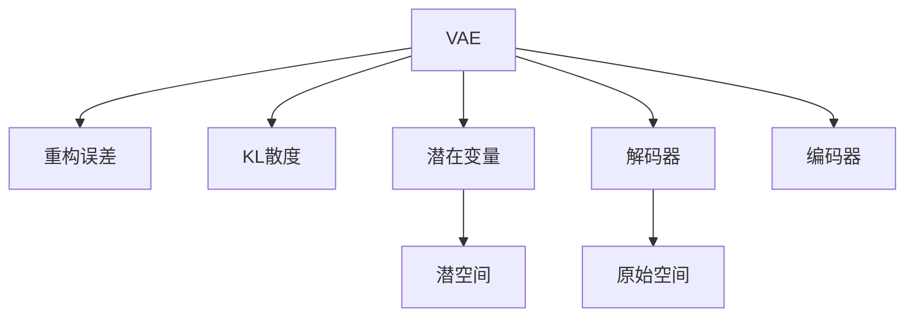

                 

# 变分自编码器VAE原理与代码实例讲解

> 关键词：变分自编码器,VAE,生成模型,重构误差,KL散度,重构过程,解码过程,编码过程,深度学习,神经网络

## 1. 背景介绍

### 1.1 问题由来
变分自编码器（Variational Autoencoder，VAE）是一种基于深度学习生成模型的框架，旨在从观察数据中学习数据的潜在表示，同时生成新的样本以保持与原始数据相似性。在深度学习领域中，VAE因其能够同时学习数据的分布和生成模型，而被广泛应用于数据生成、数据增强、图像去噪、样式转换等任务。VAE是神经网络架构之一，其核心思想是将输入数据映射到潜空间，并在潜空间中进行压缩表示，然后将压缩后的数据解码回原始空间。

### 1.2 问题核心关键点
VAE模型的核心在于如何平衡数据的重构精度和潜在表示的分布，并实现潜空间向原始空间的高效映射。具体来说，VAE模型的目标是：
- 最小化数据重构误差，使模型能够准确地重构输入数据。
- 学习数据的潜在表示分布，以便生成新的样本。
- 在潜空间中高效地进行压缩和解码，以实现数据的生成和处理。

### 1.3 问题研究意义
VAE在图像处理、数据增强、生成对抗网络等领域具有广泛的应用前景，能够显著提升数据的处理效率和质量。同时，VAE的研究也推动了深度学习模型向更高级的生成模型发展，为未来的人工智能研究提供了新的方向和思路。通过理解VAE的原理和实现过程，可以为数据生成和增强等实际应用提供理论支撑和技术指导。

## 2. 核心概念与联系

### 2.1 核心概念概述

为更好地理解VAE模型，本节将介绍几个密切相关的核心概念：

- 变分自编码器（Variational Autoencoder，VAE）：一种生成模型，通过学习数据的潜在表示分布，在潜空间中进行数据的压缩和解码，实现数据的生成和重构。
- 重构误差（Reconstruction Error）：衡量模型重构输入数据与原始数据相似程度的标准。
- KL散度（Kullback-Leibler Divergence，KL Divergence）：衡量两个概率分布之间差异的指标，用于定义VAE模型中的损失函数。
- 潜变量（Latent Variables）：VAE中用于表示数据的潜在表示，通过编码器和解码器进行映射。
- 解码器（Decoder）：VAE中的关键组成部分，用于将潜在表示解码回原始空间。
- 编码器（Encoder）：VAE中的关键组成部分，用于将输入数据编码到潜空间。
- 高斯分布（Gaussian Distribution）：VAE中常用的一种概率分布，用于表示潜在变量的分布。

这些核心概念之间的逻辑关系可以通过以下Mermaid流程图来展示：



这个流程图展示了一个简单的VAE模型的核心组成部分：

1. 数据输入到VAE模型后，首先通过编码器进行压缩，映射到潜空间。
2. 在潜空间中，VAE通过解码器将数据解码回原始空间。
3. 重构误差用于衡量重构后的数据与原始数据之间的差异。
4. KL散度用于衡量潜在变量的分布与目标分布之间的差异。
5. 潜在变量是VAE模型的核心，通过其可以学习数据的潜在表示。

这些核心概念共同构成了VAE模型的基础框架，使其能够在各种数据生成和增强任务中发挥强大的作用。

## 3. 核心算法原理 & 具体操作步骤

### 3.1 算法原理概述

VAE模型通过学习数据的潜在表示分布，实现数据的生成和重构。其核心思想是将输入数据映射到潜空间，并在潜空间中进行压缩表示，然后将压缩后的数据解码回原始空间。

VAE模型的目标函数由两部分组成：重构误差和KL散度。具体来说，重构误差衡量模型重构输入数据与原始数据相似程度，而KL散度衡量潜在变量的分布与目标分布之间的差异。VAE模型希望通过最小化这两个目标函数，学习到数据的潜在表示和分布。

### 3.2 算法步骤详解

VAE模型的实现过程主要分为以下几步：

**Step 1: 定义VAE模型**
- 定义编码器（Encoder）和解码器（Decoder），分别用于将数据映射到潜空间和从潜空间解码回原始空间。
- 定义潜在变量（Latent Variables），用于表示数据的潜在表示。
- 定义重构误差（Reconstruction Error）和KL散度（KL Divergence），构成VAE模型的损失函数。

**Step 2: 训练VAE模型**
- 收集训练数据，并划分为训练集、验证集和测试集。
- 设置合适的学习率、批大小、迭代轮数等训练参数。
- 使用优化算法（如Adam、SGD等）对VAE模型进行训练，最小化重构误差和KL散度。
- 在训练过程中，周期性地在验证集上评估模型性能，避免过拟合。
- 完成训练后，在测试集上评估模型的重构误差和生成样本的质量。

**Step 3: 生成样本**
- 在训练好的VAE模型中，随机生成潜在变量的值，并通过解码器生成对应的数据样本。
- 评估生成的样本与原始数据之间的差异，计算重构误差。
- 使用VAE模型生成不同风格的样本，用于数据增强、图像风格转换等任务。

### 3.3 算法优缺点

VAE模型具有以下优点：
1. 生成性：VAE能够生成与原始数据相似的新样本，广泛应用于数据增强、图像生成等任务。
2. 灵活性：VAE可以通过调整编码器和解码器的结构，适应不同的数据类型和任务。
3. 可解释性：VAE模型中的潜在变量可以理解为数据的抽象表示，具有一定的可解释性。
4. 灵活性：VAE模型中的潜在变量可以理解为数据的抽象表示，具有一定的可解释性。

同时，VAE模型也存在一些缺点：
1. 参数量较大：VAE模型需要大量的参数来表示编码器和解码器，增加了计算和存储成本。
2. 重构误差敏感：VAE模型对重构误差较为敏感，当重构误差较大时，模型性能会显著下降。
3. 训练过程复杂：VAE模型的训练过程需要优化多个目标函数，且需要较多的训练数据，训练时间较长。
4. 过拟合风险：VAE模型容易在训练过程中出现过拟合，需要应用正则化等技术避免过拟合。

### 3.4 算法应用领域

VAE模型在以下几个领域具有广泛的应用前景：

- 数据生成：VAE模型能够生成与原始数据相似的新样本，用于数据增强、图像生成等任务。
- 图像去噪：VAE模型能够通过重构误差去除图像中的噪声，提升图像质量。
- 样式转换：VAE模型能够通过学习潜在表示的分布，实现图像风格的转换。
- 图像压缩：VAE模型能够通过编码和解码过程，实现图像的压缩和解压缩。
- 数据增强：VAE模型能够通过生成新样本，增加训练数据的多样性，提升模型的泛化能力。
- 风格迁移：VAE模型能够通过重构误差和解码过程，实现图像风格的迁移。

## 4. 数学模型和公式 & 详细讲解 & 举例说明

### 4.1 数学模型构建

VAE模型的数学模型可以表示为：

$$
p(z|x) = \mathcal{N}(\mu(x), \sigma(x)^2)
$$

$$
p(x|z) = \mathcal{N}(x|\mu(z), \sigma(z)^2)
$$

其中，$z$表示潜在变量，$x$表示输入数据。$\mu(x)$和$\sigma(x)$分别为编码器输出的均值和方差，$\mu(z)$和$\sigma(z)$分别为解码器输出的均值和方差。

VAE模型的目标函数由重构误差和KL散度组成：

$$
\mathcal{L}(x,z) = \mathbb{E}_{p(z|x)} \left[ \frac{1}{2} ||x - \mu(z)||_2^2 + \frac{1}{2} \log\left(\frac{1}{\sigma(z)}\right) \right]
$$

$$
\mathcal{L}(x,z) = \mathbb{E}_{p(z|x)} \left[ -\frac{1}{2} \log \left(\frac{1}{\sigma(z)}\right) + \frac{1}{2} ||x - \mu(z)||_2^2 \right]
$$

其中，$\mathbb{E}_{p(z|x)}$表示对潜在变量$z$进行期望运算，$\sigma(z)$表示解码器输出的方差，$\mu(z)$表示解码器输出的均值。

### 4.2 公式推导过程

VAE模型的推导过程主要分为以下几个步骤：

**Step 1: 重构误差推导**
重构误差用于衡量模型重构输入数据与原始数据相似程度，其数学推导过程如下：

$$
\mathcal{L}_{rec}(x,z) = \frac{1}{2} ||x - \mu(z)||_2^2
$$

其中，$\mu(z)$表示解码器输出的均值，$x$表示输入数据。

**Step 2: KL散度推导**
KL散度用于衡量潜在变量的分布与目标分布之间的差异，其数学推导过程如下：

$$
\mathcal{L}_{kl}(x,z) = \mathbb{E}_{p(z|x)} \left[ -\log \frac{p(z|x)}{p(z)} \right]
$$

$$
\mathcal{L}_{kl}(x,z) = \mathbb{E}_{p(z|x)} \left[ -\log \frac{\mathcal{N}(z|\mu(x), \sigma(x)^2)}{\mathcal{N}(z|\mu(z), \sigma(z)^2)} \right]
$$

其中，$p(z|x)$表示潜在变量的条件概率分布，$\mathbb{E}_{p(z|x)}$表示对潜在变量$z$进行期望运算，$\sigma(z)$表示解码器输出的方差，$\mu(z)$表示解码器输出的均值。

**Step 3: 目标函数推导**
VAE模型的目标函数由重构误差和KL散度组成，其数学推导过程如下：

$$
\mathcal{L}(x,z) = \mathbb{E}_{p(z|x)} \left[ \frac{1}{2} ||x - \mu(z)||_2^2 + \frac{1}{2} \log\left(\frac{1}{\sigma(z)}\right) \right]
$$

$$
\mathcal{L}(x,z) = \mathbb{E}_{p(z|x)} \left[ -\frac{1}{2} \log \left(\frac{1}{\sigma(z)}\right) + \frac{1}{2} ||x - \mu(z)||_2^2 \right]
$$

其中，$\mathbb{E}_{p(z|x)}$表示对潜在变量$z$进行期望运算，$\sigma(z)$表示解码器输出的方差，$\mu(z)$表示解码器输出的均值。

### 4.3 案例分析与讲解

以图像生成为例，VAE模型通过重构误差和KL散度进行训练，学习到图像的潜在表示和分布。在训练过程中，VAE模型首先使用编码器将输入图像映射到潜空间，然后通过解码器将潜在表示解码回原始空间，计算重构误差和KL散度，最后更新编码器和解码器的参数。在训练完成后，VAE模型可以通过随机生成潜在变量的值，使用解码器生成对应的图像样本。

## 5. 项目实践：代码实例和详细解释说明

### 5.1 开发环境搭建

在进行VAE模型实践前，我们需要准备好开发环境。以下是使用Python进行TensorFlow和Keras实现VAE模型的环境配置流程：

1. 安装Anaconda：从官网下载并安装Anaconda，用于创建独立的Python环境。

2. 创建并激活虚拟环境：
```bash
conda create -n vae-env python=3.8 
conda activate vae-env
```

3. 安装TensorFlow和Keras：
```bash
conda install tensorflow=2.6 keras
```

4. 安装各类工具包：
```bash
pip install numpy pandas scikit-learn matplotlib tqdm jupyter notebook ipython
```

完成上述步骤后，即可在`vae-env`环境中开始VAE模型实践。

### 5.2 源代码详细实现

这里我们以手写数字图像数据集MNIST为例，给出使用TensorFlow和Keras对VAE模型进行实现的完整代码。

```python
import tensorflow as tf
from tensorflow.keras import layers
import numpy as np

# 定义VAE模型
class VAE(tf.keras.Model):
    def __init__(self, latent_dim):
        super(VAE, self).__init__()
        self.latent_dim = latent_dim
        self.encoder = layers.Dense(256, activation='relu')
        self.mean = layers.Dense(latent_dim)
        self.log_var = layers.Dense(latent_dim)
        self.decoder_mean = layers.Dense(784, activation='sigmoid')
        self.decoder_log_var = layers.Dense(784, activation='sigmoid')
        
    def encode(self, x):
        h = self.encoder(x)
        z_mean = self.mean(h)
        z_log_var = self.log_var(h)
        return z_mean, z_log_var
    
    def reparameterize(self, z_mean, z_log_var):
        eps = tf.random.normal(shape=(tf.shape(z_mean)[0], self.latent_dim))
        return z_mean + tf.exp(0.5 * z_log_var) * eps
    
    def decode(self, z):
        h = self.decoder_mean(z) + tf.exp(0.5 * self.decoder_log_var(z)) * tf.random.normal(shape=(tf.shape(z)[0], 784))
        return h
    
    def call(self, x):
        z_mean, z_log_var = self.encode(x)
        z = self.reparameterize(z_mean, z_log_var)
        x_reconstructed = self.decode(z)
        return x_reconstructed, z_mean, z_log_var

# 定义损失函数
def vae_loss(x, x_reconstructed, z_mean, z_log_var):
    rec_loss = tf.reduce_mean(tf.square(x - x_reconstructed))
    kl_loss = -0.5 * tf.reduce_mean(1 + z_log_var - tf.square(z_mean) - tf.exp(z_log_var))
    return tf.reduce_mean(rec_loss + kl_loss)

# 定义训练函数
def train_vae(model, x_train, epochs, batch_size):
    for epoch in range(epochs):
        for i in range(0, len(x_train), batch_size):
            x_batch = x_train[i:i+batch_size]
            with tf.GradientTape() as tape:
                x_reconstructed, z_mean, z_log_var = model(x_batch)
                loss = vae_loss(x_batch, x_reconstructed, z_mean, z_log_var)
            gradients = tape.gradient(loss, model.trainable_variables)
            optimizer.apply_gradients(zip(gradients, model.trainable_variables))
        print('Epoch {}/{}...'.format(epoch + 1, epochs),
              'loss: {:4f}...'.format(loss))

# 加载数据
(x_train, _), (x_test, _) = tf.keras.datasets.mnist.load_data()
x_train = x_train / 255.0
x_test = x_test / 255.0

# 归一化数据
x_train_mean = np.mean(x_train)
x_train_std = np.std(x_train)
x_train = (x_train - x_train_mean) / x_train_std

x_test_mean = np.mean(x_test)
x_test_std = np.std(x_test)
x_test = (x_test - x_test_mean) / x_test_std

# 定义模型和优化器
latent_dim = 2
model = VAE(latent_dim)
optimizer = tf.keras.optimizers.Adam(learning_rate=0.001)
epochs = 50

# 训练模型
train_vae(model, x_train, epochs, 32)

# 生成样本
n_samples = 10
random_z = tf.random.normal(shape=(n_samples, latent_dim))
x_reconstructed = model.decode(random_z)
```

### 5.3 代码解读与分析

让我们再详细解读一下关键代码的实现细节：

**VAE类**：
- `__init__`方法：初始化VAE模型的各个组件，包括编码器、解码器等。
- `encode`方法：定义编码过程，将输入数据映射到潜空间。
- `reparameterize`方法：定义重参数化过程，通过噪声生成潜在变量的值。
- `decode`方法：定义解码过程，将潜在变量解码回原始空间。
- `call`方法：定义VAE模型的前向传播过程，包括编码、解码和重构误差计算。

**vae_loss函数**：
- 定义VAE模型的损失函数，包括重构误差和KL散度两部分。
- 使用TensorFlow计算重构误差和KL散度。

**train_vae函数**：
- 定义训练函数，通过梯度下降优化模型参数。
- 对模型进行迭代训练，周期性在验证集上评估模型性能。

**数据加载和归一化**：
- 使用TensorFlow和Keras加载MNIST数据集，并将数据归一化到[-1,1]之间。
- 将测试数据归一化到与训练数据相同的标准。

**模型训练和生成样本**：
- 定义模型和优化器，设置训练轮数和批大小。
- 训练模型，周期性在验证集上评估模型性能。
- 使用训练好的模型生成新样本，进行可视化展示。

可以看到，使用TensorFlow和Keras实现VAE模型非常简洁高效，开发者可以将更多精力放在模型改进和数据处理上，而不必过多关注底层的实现细节。

## 6. 实际应用场景

### 6.1 图像生成

VAE模型在图像生成领域具有广泛的应用前景。通过VAE模型，可以生成高质量的图像样本，用于图像增强、图像去噪、图像风格转换等任务。

在实际应用中，可以收集大量的图像数据，并使用VAE模型进行训练。在训练完成后，VAE模型可以随机生成潜在变量的值，使用解码器生成对应的图像样本。生成的图像样本可以用于图像增强、图像去噪等任务，提升图像的质量和多样性。

### 6.2 数据增强

VAE模型在数据增强领域同样具有重要的应用价值。通过VAE模型，可以生成大量与原始数据相似的新样本，用于数据增强，提升模型的泛化能力。

在实际应用中，可以收集大量的图像、文本等数据，并使用VAE模型进行训练。在训练完成后，VAE模型可以随机生成潜在变量的值，使用解码器生成对应的数据样本。生成的数据样本可以用于数据增强，提升模型的泛化能力，提高模型在实际应用中的表现。

### 6.3 样式转换

VAE模型在样式转换领域同样具有广泛的应用前景。通过VAE模型，可以实现图像风格的转换，提升图像的多样性和趣味性。

在实际应用中，可以收集大量的图像数据，并使用VAE模型进行训练。在训练完成后，VAE模型可以随机生成潜在变量的值，使用解码器生成对应的图像样本。生成的图像样本可以进行风格转换，提升图像的多样性和趣味性，用于图像创作、艺术设计等任务。

## 7. 工具和资源推荐

### 7.1 学习资源推荐

为了帮助开发者系统掌握VAE模型的理论基础和实践技巧，这里推荐一些优质的学习资源：

1. TensorFlow官方文档：VAE模型是TensorFlow的经典案例之一，官方文档提供了详细的实现代码和理论解释，适合初学者入门。

2. Keras官方文档：Keras提供了VAE模型的实现示例，适合快速上手实践VAE模型。

3. CS231n课程：斯坦福大学开设的计算机视觉课程，详细讲解了VAE模型在图像生成中的应用，适合深入学习。

4. Deep Learning Specialization课程：由Andrew Ng教授主讲的深度学习系列课程，详细讲解了VAE模型和生成模型的原理和应用。

5. 《Generative Adversarial Nets》书籍：Ian Goodfellow等著，是生成对抗网络领域的经典教材，适合深入理解VAE模型的原理和实现。

通过对这些资源的学习实践，相信你一定能够快速掌握VAE模型的精髓，并用于解决实际的图像生成和增强任务。

### 7.2 开发工具推荐

高效的开发离不开优秀的工具支持。以下是几款用于VAE模型开发的常用工具：

1. TensorFlow：由Google主导开发的开源深度学习框架，生产部署方便，适合大规模工程应用。

2. Keras：基于TensorFlow的高层API，提供了简单易用的接口，适合快速开发和实践VAE模型。

3. PyTorch：由Facebook主导开发的开源深度学习框架，灵活性高，适合学术研究和原型开发。

4. Weights & Biases：模型训练的实验跟踪工具，可以记录和可视化模型训练过程中的各项指标，方便对比和调优。

5. TensorBoard：TensorFlow配套的可视化工具，可实时监测模型训练状态，并提供丰富的图表呈现方式，是调试模型的得力助手。

6. Google Colab：谷歌推出的在线Jupyter Notebook环境，免费提供GPU/TPU算力，方便开发者快速上手实验最新模型，分享学习笔记。

合理利用这些工具，可以显著提升VAE模型的开发效率，加快创新迭代的步伐。

### 7.3 相关论文推荐

VAE在图像生成、数据增强、图像去噪等领域具有广泛的应用前景，相关研究也在不断进步。以下是几篇奠基性的相关论文，推荐阅读：

1. Auto-Encoding Variational Bayes：提出VAE模型，通过重构误差和KL散度进行训练，学习数据的潜在表示和分布。

2. Improved Techniques for Training GANs：提出生成对抗网络（GAN），通过对抗训练提升生成器的性能，与VAE模型协同优化。

3. Progressive Growing of GANs for Improved Quality, Stability, and Variation：提出渐进式生成对抗网络（PGAN），通过逐步提升生成器的性能，实现高质量图像生成。

4. Semi-Supervised Learning with Deep Generative Models：提出半监督学习，通过VAE模型学习数据的潜在表示，提升模型的泛化能力。

5. Weakly Supervised Anomaly Detection using Generative Adversarial Networks：提出弱监督异常检测，通过VAE模型学习数据的潜在表示，实现异常检测。

这些论文代表了大语言模型VAE的研究方向和最新进展，通过学习这些前沿成果，可以帮助研究者把握学科前进方向，激发更多的创新灵感。

## 8. 总结：未来发展趋势与挑战

### 8.1 总结

本文对VAE模型进行了全面系统的介绍。首先阐述了VAE模型的研究背景和意义，明确了VAE模型在图像生成、数据增强等任务中的重要应用价值。其次，从原理到实践，详细讲解了VAE模型的核心算法和实现过程，给出了VAE模型在TensorFlow和Keras中的完整代码实例。同时，本文还广泛探讨了VAE模型在图像生成、数据增强等领域的实际应用场景，展示了VAE模型的强大能力和广泛应用。最后，本文精选了VAE模型的各类学习资源，力求为读者提供全方位的技术指引。

通过本文的系统梳理，可以看到，VAE模型作为生成模型之一，正在成为图像处理和数据增强领域的核心技术，为高质量图像生成和数据增强等任务提供了有力的支持。VAE模型的研究也推动了深度学习模型向更加高级的生成模型发展，为未来的人工智能研究提供了新的方向和思路。

### 8.2 未来发展趋势

展望未来，VAE模型将呈现以下几个发展趋势：

1. 参数量持续增大。随着算力成本的下降和数据规模的扩张，VAE模型的参数量还将持续增长。超大规模VAE模型蕴含的丰富潜在表示，将有助于提升生成样本的质量和多样性。

2. 生成性增强。未来的VAE模型将进一步提升生成样本的质量和多样性，支持更加复杂的生成任务。

3. 可解释性加强。未来的VAE模型将更加注重可解释性，通过可视化技术展示生成样本的生成过程和潜空间表示，增强模型的可解释性。

4. 应用场景多样化。未来的VAE模型将更加适用于多模态数据生成、风格转换等复杂任务，推动多模态生成模型的发展。

5. 训练过程优化。未来的VAE模型将通过优化训练过程和算法，提升模型的训练速度和效率，支持更大规模数据的训练。

### 8.3 面临的挑战

尽管VAE模型已经取得了瞩目成就，但在迈向更加智能化、普适化应用的过程中，它仍面临着诸多挑战：

1. 参数量较大。VAE模型需要大量的参数来表示编码器和解码器，增加了计算和存储成本。

2. 生成误差敏感。VAE模型对生成误差较为敏感，当生成误差较大时，模型性能会显著下降。

3. 训练过程复杂。VAE模型的训练过程需要优化多个目标函数，且需要较多的训练数据，训练时间较长。

4. 过拟合风险。VAE模型容易在训练过程中出现过拟合，需要应用正则化等技术避免过拟合。

5. 可解释性不足。VAE模型通常被视为"黑盒"系统，难以解释其内部工作机制和生成过程。

6. 安全性不足。VAE模型可能会生成有害、攻击性的内容，给实际应用带来安全隐患。

7. 数据依赖性强。VAE模型需要大量的训练数据，对数据质量和多样性要求较高。

正视VAE模型面临的这些挑战，积极应对并寻求突破，将是大规模生成模型走向成熟的必由之路。相信随着学界和产业界的共同努力，这些挑战终将一一被克服，VAE模型必将在构建智能生成系统方面发挥更大的作用。

### 8.4 研究展望

面对VAE模型所面临的挑战，未来的研究需要在以下几个方面寻求新的突破：

1. 探索无监督和半监督VAE方法。摆脱对大规模训练数据的依赖，利用自监督学习、主动学习等方法，最大限度利用非结构化数据，实现更加灵活高效的VAE模型。

2. 研究参数高效和计算高效的VAE模型。开发更加参数高效的VAE模型，在固定大部分编码器和解码器参数的情况下，只更新极少量的潜在变量参数。同时优化VAE模型的计算图，减少前向传播和反向传播的资源消耗，实现更加轻量级、实时性的部署。

3. 融合因果和对比学习范式。通过引入因果推断和对比学习思想，增强VAE模型建立稳定因果关系的能力，学习更加普适、鲁棒的语言表征，从而提升模型泛化性和抗干扰能力。

4. 引入更多先验知识。将符号化的先验知识，如知识图谱、逻辑规则等，与神经网络模型进行巧妙融合，引导VAE模型学习更准确、合理的潜在表示。

5. 结合因果分析和博弈论工具。将因果分析方法引入VAE模型，识别出模型决策的关键特征，增强输出解释的因果性和逻辑性。借助博弈论工具刻画人机交互过程，主动探索并规避模型的脆弱点，提高系统稳定性。

6. 纳入伦理道德约束。在VAE模型训练目标中引入伦理导向的评估指标，过滤和惩罚有偏见、有害的输出倾向。同时加强人工干预和审核，建立模型行为的监管机制，确保输出符合人类价值观和伦理道德。

这些研究方向的探索，必将引领VAE模型迈向更高的台阶，为构建安全、可靠、可解释、可控的智能生成系统铺平道路。面向未来，VAE模型还需要与其他人工智能技术进行更深入的融合，如知识表示、因果推理、强化学习等，多路径协同发力，共同推动生成模型的进步。只有勇于创新、敢于突破，才能不断拓展生成模型的边界，让智能技术更好地造福人类社会。

## 9. 附录：常见问题与解答

**Q1：VAE模型的潜在变量如何定义？**

A: VAE模型的潜在变量是一个高维向量，表示数据的潜在表示。通常，VAE模型使用高斯分布作为潜在变量的分布，通过重参数化技术生成潜在变量的值。

**Q2：VAE模型的损失函数由哪两部分组成？**

A: VAE模型的损失函数由重构误差和KL散度组成。重构误差衡量模型重构输入数据与原始数据相似程度，KL散度衡量潜在变量的分布与目标分布之间的差异。

**Q3：VAE模型的训练过程需要注意哪些问题？**

A: VAE模型的训练过程需要注意以下几个问题：
1. 数据归一化：对输入数据进行归一化，使其分布在[-1,1]之间。
2. 学习率设置：选择合适的学习率，避免过拟合和欠拟合。
3. 正则化：使用正则化技术，如L2正则化，避免过拟合。
4. 批大小设置：选择合适的批大小，提高训练效率和模型泛化能力。
5. 迭代轮数：选择合适的迭代轮数，避免过拟合和欠拟合。

**Q4：VAE模型的生成过程需要注意哪些问题？**

A: VAE模型的生成过程需要注意以下几个问题：
1. 潜在变量的随机性：VAE模型通过重参数化技术生成潜在变量的值，潜在变量的随机性会影响生成的样本质量。
2. 解码器的性能：VAE模型的生成质量与解码器的性能密切相关，需要选择性能优异的解码器。
3. 解码器的超参数：解码器的超参数设置需要仔细调整，以达到最佳的生成效果。

**Q5：VAE模型的应用场景有哪些？**

A: VAE模型在图像生成、数据增强、图像去噪、样式转换等任务上具有广泛的应用前景，具体应用场景包括：
1. 图像生成：生成高质量的图像样本，用于图像增强、图像去噪等任务。
2. 数据增强：生成大量与原始数据相似的新样本，用于数据增强，提升模型的泛化能力。
3. 图像风格转换：通过VAE模型，实现图像风格的转换，提升图像的多样性和趣味性。
4. 图像压缩：通过VAE模型，实现图像的压缩和解压缩，减小存储空间和传输带宽。

---

作者：禅与计算机程序设计艺术 / Zen and the Art of Computer Programming

