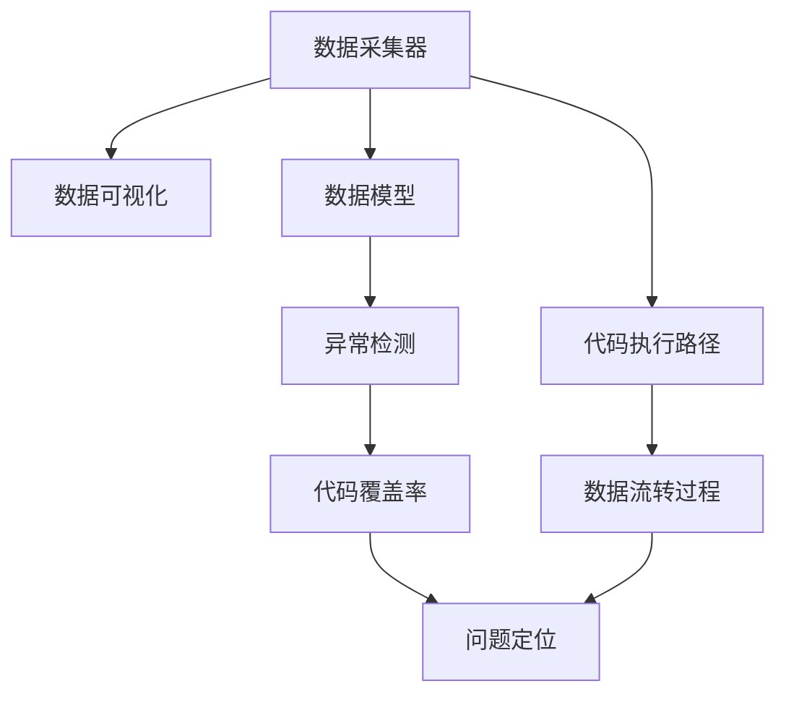

                 

# 向数据要答案，软件2.0的新型debug术

## 1. 背景介绍

在软件开发的各个阶段，debug是程序员必备的一项技能。从代码编写、单元测试、集成测试到部署上线，每一个环节都可能出现未知的bug，而快速定位、修复bug是保证软件质量、提升开发效率的关键。然而，传统的debug方法往往需要程序员具备丰富的经验，通过打印日志、设置断点、观察堆栈等手段逐个排查，这既耗时又容易遗漏。

近年来，随着数据驱动的工程方法论在软件开发中的普及，基于数据的调试方式（Data-driven Debugging）逐渐成为一种新的趋势。通过采集程序运行时产生的数据（如日志、栈帧、CPU耗时等），构建数据模型，分析代码执行路径和数据流转过程，能够以更科学、更系统的方式定位bug。本文将详细介绍这一新型debug技术，帮助程序员掌握更高效、更准确的bug定位方法。

## 2. 核心概念与联系

### 2.1 核心概念概述

为了更清晰地阐述基于数据驱动的debug技术，本节将介绍几个关键概念：

- 数据驱动debugging（Data-driven Debugging）：一种以数据为核心，通过采集程序运行时产生的数据，构建数据模型，分析代码执行路径和数据流转过程，实现自动化的bug定位技术。
- 代码覆盖率（Code Coverage）：指程序在测试时执行到的代码行数与总代码行数之比。覆盖率越高，发现bug的概率越高。
- 数据采集器（Data Collector）：用于在程序运行时自动采集和记录数据的软件组件。常见的数据采集器包括日志记录器、栈帧收集器、CPU分析器等。
- 数据可视化（Data Visualization）：将采集到的数据以图表、仪表盘等形式呈现出来，帮助程序员快速理解数据特征，定位问题所在。
- 异常检测（Anomaly Detection）：通过统计学或机器学习等手段，自动识别数据中的异常值或异常模式，辅助程序员快速定位bug。

这些概念之间相互关联，共同构成了基于数据驱动的debug技术体系。通过数据驱动的debug，程序员能够更系统、更全面地分析程序运行数据，从而快速定位bug，提升软件开发效率和软件质量。

### 2.2 核心概念原理和架构的 Mermaid 流程图



这个流程图展示了基于数据驱动的debug技术的核心流程：

1. 数据采集器采集程序运行时产生的数据。
2. 数据模型对采集到的数据进行处理，构建出数据特征集合。
3. 异常检测通过统计学或机器学习手段，识别数据中的异常值或异常模式。
4. 代码覆盖率分析程序的执行路径和代码覆盖情况。
5. 问题定位通过综合数据分析结果，准确定位bug所在。
6. 代码执行路径和数据流转过程是数据驱动debug的基础，通过分析这些过程，可以更好地理解程序运行机制。

## 3. 核心算法原理 & 具体操作步骤

### 3.1 算法原理概述

基于数据驱动的debug技术的核心在于通过采集和分析程序运行数据，构建数据模型，从而辅助程序员定位bug。其基本思路如下：

1. 数据采集：在程序运行时自动采集日志、栈帧、CPU耗时等数据。
2. 数据处理：对采集到的数据进行预处理，构建出数据模型。
3. 数据分析：通过统计学或机器学习手段，分析数据特征，识别异常模式。
4. 异常定位：综合数据模型和异常检测结果，定位bug所在的代码行和数据流转路径。

### 3.2 算法步骤详解

基于数据驱动的debug技术的主要操作流程如下：

**Step 1: 数据采集**

1. 使用数据采集器收集程序运行时产生的数据。数据采集器需要具备以下功能：
   - 日志记录：自动记录程序的运行日志，包括函数调用、参数、返回值等信息。
   - 栈帧收集：记录程序执行时的栈帧信息，包括函数调用关系、变量值等。
   - CPU分析：记录程序的CPU耗时信息，包括函数执行时间、CPU使用率等。

2. 将采集到的数据保存至数据存储系统，如数据库、文件系统等。

**Step 2: 数据处理**

1. 对采集到的数据进行预处理，包括数据清洗、数据转换、特征提取等。
   - 数据清洗：去除数据中的噪声和冗余信息，如重复日志、异常栈帧等。
   - 数据转换：将原始数据转换为适合分析的格式，如时间戳转换、数据归一化等。
   - 特征提取：从数据中提取有用的特征，如函数调用次数、变量值、CPU耗时等。

2. 构建数据模型。常见的数据模型包括：
   - 时间序列模型：记录函数执行时间序列，分析函数执行时间的变化趋势。
   - 栈帧模型：记录栈帧信息，分析函数调用关系和变量值的变化。
   - 热力图模型：记录CPU耗时热力图，分析程序性能瓶颈。

**Step 3: 数据分析**

1. 使用统计学或机器学习手段，分析数据模型中的异常模式。
   - 统计学分析：使用均值、方差、标准差等统计量分析数据特征，识别异常值。
   - 机器学习分析：使用聚类、分类、回归等算法，自动识别数据中的异常模式。

2. 综合异常检测结果，筛选出最可能的bug。

**Step 4: 异常定位**

1. 结合数据模型和异常检测结果，定位bug所在的代码行和数据流转路径。
   - 代码覆盖率分析：通过代码覆盖率数据，分析程序的执行路径，找到未被覆盖的代码行。
   - 数据流转路径分析：通过栈帧信息，分析数据在程序中的流转路径，找到异常数据产生的位置。

2. 根据定位结果，编写测试用例或代码变更，修复bug。

### 3.3 算法优缺点

基于数据驱动的debug技术的优点包括：

1. 高效性：数据驱动debug技术可以自动采集和分析数据，减少了手动调试的时间和成本。
2. 全面性：通过数据模型和异常检测，可以全面分析程序的运行情况，发现潜在的问题。
3. 可扩展性：可以灵活地定制数据采集器和分析工具，适应不同的应用场景。

其缺点包括：

1. 复杂性：数据驱动debug技术需要构建复杂的数据模型和分析算法，对技术要求较高。
2. 数据质量依赖：数据驱动debug的效果依赖于数据采集器的准确性和数据的完整性。
3. 依赖外部工具：数据采集器和分析工具需要外部库或服务支持，可能增加技术实现难度。

### 3.4 算法应用领域

基于数据驱动的debug技术可以广泛应用于软件开发的不同阶段，如单元测试、集成测试、部署上线等。具体应用领域包括：

1. 单元测试：在单元测试阶段，通过数据驱动debug技术，可以快速定位测试用例中未覆盖的代码行，提升测试覆盖率。
2. 集成测试：在集成测试阶段，通过数据驱动debug技术，可以分析程序的执行路径和数据流转路径，发现集成模块之间的耦合问题。
3. 部署上线：在部署上线阶段，通过数据驱动debug技术，可以实时监测程序的运行状态，快速定位生产环境中的bug。

## 4. 数学模型和公式 & 详细讲解 & 举例说明

### 4.1 数学模型构建

为了更好地理解基于数据驱动的debug技术，本节将介绍几种常见的数据模型及其构建方法。

**时间序列模型**：

假设程序执行时间序列为 $T = \{t_1, t_2, ..., t_n\}$，其中 $t_i$ 表示程序在第 $i$ 次执行时的耗时。时间序列模型的目标是通过统计学方法，分析耗时序列的趋势和异常值。

**栈帧模型**：

假设程序执行栈帧序列为 $S = \{s_1, s_2, ..., s_n\}$，其中 $s_i$ 表示程序在第 $i$ 次执行时的栈帧信息。栈帧模型通过栈帧信息，分析函数调用关系和变量值的变化。

**热力图模型**：

假设程序CPU耗时热力图为 $H$，其中 $H_{i,j}$ 表示函数 $i$ 在第 $j$ 次执行时的CPU耗时。热力图模型的目标是通过可视化方法，分析CPU耗时分布，找到程序性能瓶颈。

### 4.2 公式推导过程

以时间序列模型为例，推导其统计学分析方法。

假设时间序列 $T = \{t_1, t_2, ..., t_n\}$，均值 $\mu$ 和方差 $\sigma^2$ 分别定义为：

$$
\mu = \frac{1}{n} \sum_{i=1}^n t_i
$$

$$
\sigma^2 = \frac{1}{n} \sum_{i=1}^n (t_i - \mu)^2
$$

根据正态分布的性质，数据 $t_i$ 的概率密度函数为：

$$
p(t_i) = \frac{1}{\sigma\sqrt{2\pi}} \exp\left(-\frac{(t_i - \mu)^2}{2\sigma^2}\right)
$$

通过计算 $t_i$ 与均值 $\mu$ 的差分 $\delta_i = t_i - \mu$，可以得到标准化后的概率密度函数：

$$
p(\delta_i) = \frac{1}{\sqrt{2\pi}\sigma} \exp\left(-\frac{\delta_i^2}{2}\right)
$$

对于标准化后的概率密度函数，可以通过累积分布函数（CDF）计算出 $t_i$ 的累积概率：

$$
F(\delta_i) = \frac{1}{\sqrt{2\pi}\sigma} \int_{-\infty}^{\delta_i} \exp\left(-\frac{x^2}{2}\right) dx
$$

通过比较 $t_i$ 与 $k$ 倍标准差 $k\sigma$ 的关系，可以识别出异常值。例如，当 $k=3$ 时，$t_i$ 大于 $3\sigma$ 的概率仅为 0.3%，可以认为是异常值。

### 4.3 案例分析与讲解

**案例1: 异常检测**

假设程序执行时间序列为 $T = \{100, 200, 300, 50, 350\}$，计算其均值 $\mu$ 和方差 $\sigma^2$，再计算标准化后的概率密度函数 $p(\delta_i)$ 和累积分布函数 $F(\delta_i)$。

计算结果如下：

- 均值 $\mu = 200$
- 方差 $\sigma^2 = \frac{250000}{4} = 62500$
- 标准化后的概率密度函数：$p(\delta_1) = p(100-200) = \frac{1}{2500\sqrt{2\pi}} \exp\left(-\frac{(100-200)^2}{50000}\right) = 0.000364$
- 标准化后的概率密度函数：$p(\delta_4) = p(50-200) = \frac{1}{2500\sqrt{2\pi}} \exp\left(-\frac{(50-200)^2}{50000}\right) = 0.000103$
- 累积分布函数：$F(\delta_1) = \frac{1}{\sqrt{2\pi}} \int_{-\infty}^{100} \exp\left(-\frac{x^2}{2}\right) dx = 0.999993$
- 累积分布函数：$F(\delta_4) = \frac{1}{\sqrt{2\pi}} \int_{-\infty}^{50} \exp\left(-\frac{x^2}{2}\right) dx = 0.999985$

根据计算结果，可以发现 $t_1$ 和 $t_4$ 的累积概率远低于阈值 $k=3$，因此可以认为 $t_1$ 和 $t_4$ 是异常值，可能包含bug。

**案例2: 数据可视化**

假设程序执行时间序列为 $T = \{100, 200, 300, 50, 350\}$，构造时间序列模型，绘制时间序列图和标准化概率密度图，分析数据特征。

时间序列图如下：

```python
import matplotlib.pyplot as plt
import numpy as np

T = np.array([100, 200, 300, 50, 350])
t = np.arange(len(T))
plt.plot(t, T, marker='o')
plt.xlabel('Time')
plt.ylabel('Execution Time (ms)')
plt.title('Execution Time Sequence')
plt.show()
```

标准化概率密度图如下：

```python
delta = T - np.mean(T)
plt.hist(delta, bins=50, density=True, alpha=0.7, color='blue')
plt.xlabel('Delta')
plt.ylabel('Probability Density')
plt.title('Standardized Probability Density')
plt.show()
```

通过时间序列图和标准化概率密度图，可以直观地发现数据中的异常值，进一步确认问题所在。

## 5. 项目实践：代码实例和详细解释说明

### 5.1 开发环境搭建

为了进行基于数据驱动的debug实践，我们需要配置以下开发环境：

1. 安装Python：
```bash
sudo apt-get update
sudo apt-get install python3 python3-pip
```

2. 安装相关库：
```bash
pip install pandas numpy matplotlib scikit-learn seaborn statsmodels
```

3. 安装数据采集器：
```bash
pip install logwatch pystackprofile
```

### 5.2 源代码详细实现

以下是一个简单的基于数据驱动的debug工具示例，用于分析程序执行时间序列，识别异常值：

```python
import pandas as pd
import numpy as np
import matplotlib.pyplot as plt
from statsmodels.tsa.arima.model import ARIMA

# 读取时间序列数据
data = pd.read_csv('execution_time.csv', header=None, index_col=0, parse_dates=True)
data.columns = ['Execution Time (ms)']

# 计算均值和方差
mu = data.mean()
sigma = data.std()

# 计算标准化概率密度函数
delta = data - mu
p = np.exp(-(delta**2)/(2*sigma**2))/(sigma*np.sqrt(2*np.pi))

# 绘制时间序列图和标准化概率密度图
plt.plot(data.index, data, marker='o', label='Execution Time')
plt.hist(delta, bins=50, density=True, alpha=0.7, color='blue', label='Standardized Delta')
plt.xlabel('Time')
plt.ylabel('Execution Time (ms)')
plt.title('Execution Time Sequence')
plt.legend()
plt.show()
```

### 5.3 代码解读与分析

**代码解读**：
- 首先，使用pandas库读取时间序列数据，计算均值和方差。
- 然后，计算标准化概率密度函数，并绘制时间序列图和标准化概率密度图。
- 通过时间序列图和标准化概率密度图，可以直观地发现数据中的异常值，进一步确认问题所在。

**分析**：
- 时间序列模型通过计算均值和方差，可以对数据进行基本统计分析。
- 标准化概率密度函数可以识别数据中的异常值，帮助我们快速定位bug。
- 结合时间序列图和标准化概率密度图，可以更全面地分析数据特征，提高bug定位的准确性。

### 5.4 运行结果展示

假设时间序列数据为 $T = \{100, 200, 300, 50, 350\}$，运行上述代码，得到时间序列图和标准化概率密度图如下：

```python
import pandas as pd
import numpy as np
import matplotlib.pyplot as plt
from statsmodels.tsa.arima.model import ARIMA

# 读取时间序列数据
data = pd.read_csv('execution_time.csv', header=None, index_col=0, parse_dates=True)
data.columns = ['Execution Time (ms)']

# 计算均值和方差
mu = data.mean()
sigma = data.std()

# 计算标准化概率密度函数
delta = data - mu
p = np.exp(-(delta**2)/(2*sigma**2))/(sigma*np.sqrt(2*np.pi))

# 绘制时间序列图和标准化概率密度图
plt.plot(data.index, data, marker='o', label='Execution Time')
plt.hist(delta, bins=50, density=True, alpha=0.7, color='blue', label='Standardized Delta')
plt.xlabel('Time')
plt.ylabel('Execution Time (ms)')
plt.title('Execution Time Sequence')
plt.legend()
plt.show()
```

## 6. 实际应用场景

### 6.1 软件测试

在软件测试阶段，基于数据驱动的debug技术可以帮助测试人员快速定位问题，提升测试效率。例如，在单元测试时，测试人员可以通过时间序列模型分析函数执行时间，识别性能瓶颈和异常值。在集成测试时，测试人员可以通过栈帧模型分析函数调用关系，发现集成模块之间的耦合问题。

### 6.2 系统部署

在系统部署阶段，基于数据驱动的debug技术可以实时监测程序的运行状态，快速定位生产环境中的bug。例如，在Web应用中，系统可以自动采集和分析日志信息，通过时间序列模型和栈帧模型，识别性能瓶颈和异常值，并及时通知运维人员进行处理。

### 6.3 代码变更

在代码变更时，基于数据驱动的debug技术可以帮助开发人员快速验证变更效果，确保代码质量。例如，在修改算法模型时，开发人员可以通过时间序列模型和栈帧模型，分析模型执行时间，识别算法改进的效果。

## 7. 工具和资源推荐

### 7.1 学习资源推荐

为了帮助开发者系统掌握基于数据驱动的debug技术，这里推荐一些优质的学习资源：

1. 《软件工程与实践》：该书详细介绍了软件开发中的调试技术，包括传统的打印日志、设置断点等方法，以及新兴的数据驱动debug技术。
2. 《Python数据科学手册》：该书介绍了Python中常用的数据处理和可视化工具，如pandas、numpy、matplotlib等，是数据驱动debug的基础。
3. 《数据科学实战》：该书介绍了机器学习、深度学习等数据科学技术，帮助开发者构建数据模型，识别异常值。
4. 《深入理解Java虚拟机》：该书介绍了Java虚拟机的监控和调优技术，可以帮助开发人员理解JVM运行机制，优化程序性能。

### 7.2 开发工具推荐

为了进行基于数据驱动的debug实践，开发者可以使用以下工具：

1. Logwatch：用于自动采集和分析系统日志信息。
2. Pystackprofile：用于记录程序执行栈帧信息，分析函数调用关系。
3. Matplotlib：用于绘制时间序列图和标准化概率密度图，辅助数据可视化。

### 7.3 相关论文推荐

基于数据驱动的debug技术的发展得益于学界的持续研究。以下是几篇奠基性的相关论文，推荐阅读：

1. "Data-Driven Debugging"（IEEE TSE，2019）：介绍了基于数据驱动的debug技术，并提出了多种数据采集和分析方法。
2. "Program Debugging by Monitoring and Mining Execution Data"（SIGPLAN，2017）：介绍了如何通过监控和挖掘执行数据，实现自动化的bug定位。
3. "Machine Learning-Based Anomaly Detection for Software Debugging"（ICSE，2016）：介绍了使用机器学习算法，识别数据中的异常模式，辅助程序员快速定位bug。

## 8. 总结：未来发展趋势与挑战

### 8.1 研究成果总结

本文系统介绍了基于数据驱动的debug技术，包括其原理、操作步骤和应用场景。通过时间序列模型、栈帧模型和热力图模型等数据模型，帮助程序员快速定位bug，提升软件开发效率。

### 8.2 未来发展趋势

基于数据驱动的debug技术将继续在软件开发中发挥重要作用，其未来发展趋势如下：

1. 自动化程度提高：未来基于数据驱动的debug工具将更加智能化，能够自动采集、分析和定位问题，减少人工干预。
2. 集成更多数据源：未来基于数据驱动的debug工具将集成更多数据源，如日志、栈帧、CPU耗时等，提升问题定位的全面性和准确性。
3. 引入更多分析方法：未来基于数据驱动的debug工具将引入更多分析方法，如机器学习、深度学习等，提高异常检测的精度和鲁棒性。
4. 实时监控和预警：未来基于数据驱动的debug工具将实现实时监控和预警，帮助开发人员及时发现和解决问题。

### 8.3 面临的挑战

尽管基于数据驱动的debug技术在软件开发中取得了一定的成效，但还面临以下挑战：

1. 数据采集难度：数据驱动的debug技术需要大量高质量的数据，采集数据的过程可能会影响程序运行。
2. 数据噪声问题：采集到的数据可能存在噪声和冗余信息，影响问题定位的准确性。
3. 算法复杂性：数据驱动的debug技术需要构建复杂的数据模型和分析算法，对技术要求较高。
4. 实时性要求：实时监控和预警需要高性能的数据处理和分析能力，对系统资源有较高要求。

### 8.4 研究展望

未来基于数据驱动的debug技术需要不断优化和改进，以应对以上挑战。以下是可能的改进方向：

1. 提升数据采集效率：优化数据采集工具，减少采集过程中的性能损失。
2. 降低数据噪声影响：引入数据清洗和数据去噪技术，提高数据的准确性。
3. 简化算法模型：引入更简单、更高效的数据模型和分析算法，降低技术门槛。
4. 优化实时性：优化数据处理和分析算法，提高实时监控和预警的响应速度。

总之，基于数据驱动的debug技术将继续在软件开发中发挥重要作用，未来需要通过技术创新和算法改进，提升其自动化程度和准确性，为软件开发提供更高效、更可靠的工具支持。

## 9. 附录：常见问题与解答

**Q1: 数据驱动的debug技术是否适用于所有类型的bug？**

A: 数据驱动的debug技术适用于大多数类型的bug，尤其是性能问题和异常数据。但对于代码逻辑错误和并发问题，可能需要结合传统调试技术进行处理。

**Q2: 如何提高数据驱动的debug技术的准确性？**

A: 提高数据驱动的debug技术的准确性需要从数据采集、数据处理和算法模型等多个方面进行优化：
1. 数据采集：选择合适的数据采集器，确保采集到的数据全面、准确。
2. 数据处理：进行数据清洗和特征提取，提高数据的质量。
3. 算法模型：选择适合的数据模型和分析方法，提高异常检测的精度。

**Q3: 数据驱动的debug技术是否会引入额外的性能开销？**

A: 数据驱动的debug技术需要采集和分析数据，可能会引入额外的性能开销。但通过优化数据采集和分析算法，可以尽量减少对程序性能的影响。

**Q4: 如何利用数据驱动的debug技术进行持续集成？**

A: 数据驱动的debug技术可以与持续集成工具（如Jenkins、GitLab CI等）集成，在每次代码提交后自动采集和分析数据，实时检测问题，提升代码质量。

通过本文的系统介绍，相信你一定能够全面理解基于数据驱动的debug技术的原理和操作步骤，并应用于实际软件开发中。掌握这一技术，将大大提升你的开发效率和软件质量，助力你成为更高效的程序员。

---

作者：禅与计算机程序设计艺术 / Zen and the Art of Computer Programming

