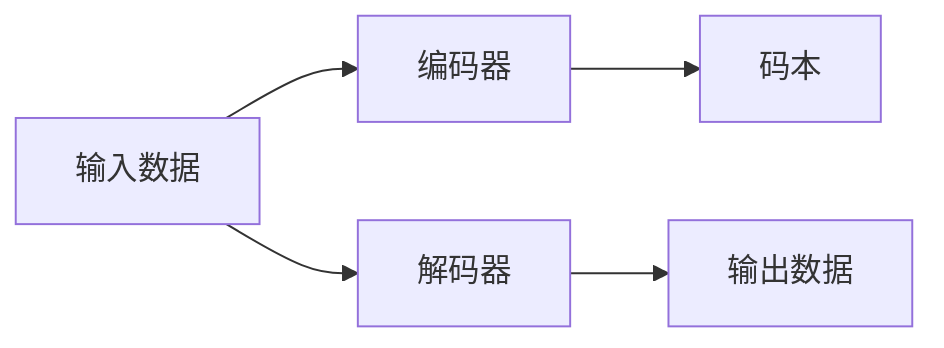

                 

# 向量量化：AI模型压缩的前沿技术

## 1. 背景介绍

在人工智能领域，特别是深度学习模型中，模型的大小和计算资源消耗是影响其部署和应用的关键因素。由于模型参数的爆炸性增长，当前的深度学习模型面临着巨大的存储空间和计算复杂度问题，这不仅增加了模型部署和训练的难度，也限制了其在资源受限的环境下的应用。

为了解决这个问题，模型压缩技术应运而生。模型压缩技术旨在减小模型大小，同时尽量保持模型的精度和性能。其中，向量量化是模型压缩领域的一种前沿技术，通过对模型中的权重向量进行编码，达到减少模型参数数量和计算复杂度的目的。

向量量化已经在图像处理、自然语言处理、音频处理等多个领域得到了广泛应用，尤其是在图像和音频等高维数据处理中，其效果显著。在深度学习中，向量量化通常用于量化模型的权重矩阵，将其从浮点数矩阵转化为离散化的整数矩阵，从而大大减小了模型的存储空间和计算开销。

## 2. 核心概念与联系

### 2.1 核心概念概述

向量量化（Vector Quantization, VQ）是一种将连续空间的数据映射到离散空间中的技术。其基本思想是将连续的向量（如权重向量）通过一个编码器映射到一个有限的离散集合（即码本）中，并将每个向量表示为其对应的最近的离散向量的索引。这样，模型的存储空间和计算开销被显著减小，同时模型的精度损失也控制在可接受的范围内。

向量量化主要分为两个步骤：
1. 编码器（Encoder）：将连续向量映射到离散码本中。
2. 解码器（Decoder）：将离散码本映射回连续向量。

### 2.2 核心概念原理和架构的 Mermaid 流程图



在上述流程图中，输入数据首先经过编码器B，将连续的向量映射到离散的码本C中。然后，解码器D将离散的码本映射回连续的输出数据E。通过这种映射关系，模型中的连续权重向量被离散化，从而实现模型压缩。

### 2.3 核心概念的数学原理

向量量化通常使用K-means算法来确定码本。K-means算法是一种聚类算法，其基本思想是将数据点分为K个簇，每个簇的中心即为该簇的均值。在深度学习中，K-means算法用于寻找一个最优的码本，使得量化后的向量与原始向量之间的距离最小。

设原始向量为$x \in \mathbb{R}^n$，码本为$B=\{b_1, b_2, ..., b_K\}$，其中$b_k$为码本中的第$k$个离散向量。则向量$x$的量化过程可以表示为：

$$
\hat{x} = \arg\min_k \| x - b_k \|^2
$$

其中$\|\cdot\|^2$表示向量的欧几里得距离平方。

## 3. 核心算法原理 & 具体操作步骤

### 3.1 算法原理概述

向量量化算法的核心在于找到一个最优的码本$B$，使得量化后的向量$\hat{x}$与原始向量$x$之间的距离最小。这一过程通常通过K-means算法来实现。

K-means算法的基本流程如下：
1. 随机初始化K个码本$b_1, b_2, ..., b_K$。
2. 对于每个数据点$x$，计算其与每个码本的距离，并选取距离最近的码本作为其量化结果。
3. 更新每个码本，使其成为当前数据点的均值。
4. 重复步骤2和3，直至码本不再变化或达到预设的迭代次数。

### 3.2 算法步骤详解

向量量化算法的详细步骤包括：
1. 码本初始化：随机初始化K个码本。
2. 量化：对于每个数据点$x$，计算其与每个码本的欧几里得距离，选择距离最近的码本作为其量化结果。
3. 码本更新：更新每个码本，使其成为当前数据点的均值。
4. 迭代：重复2和3，直至码本不再变化或达到预设的迭代次数。

### 3.3 算法优缺点

向量量化算法的优点包括：
1. 显著减小模型参数量。通过将连续向量离散化，大大减小了模型的大小和计算开销。
2. 提高计算效率。离散化后的向量可以使用整数进行运算，从而提高计算速度。
3. 保持模型精度。通过选择一个足够好的码本，可以保持模型精度损失在可接受的范围内。

向量量化算法的缺点包括：
1. 码本选择困难。码本的选择对最终的量化效果有重要影响，如何选择最优码本是一个难点。
2. 计算复杂度高。码本更新和量化过程需要大量的计算资源，特别是在高维数据处理中。
3. 精度损失。由于离散化，量化后的向量会引入一定的精度损失。

### 3.4 算法应用领域

向量量化技术在深度学习中广泛应用于模型压缩和加速训练。其应用领域包括但不限于：

- 图像处理：在卷积神经网络（CNN）中，将卷积核的权重向量进行量化，可以显著减小模型的存储空间和计算复杂度。
- 自然语言处理：在循环神经网络（RNN）中，将嵌入层的权重向量进行量化，可以减少模型的内存占用。
- 音频处理：在卷积神经网络中，将卷积核的权重向量进行量化，可以减小模型的存储空间和计算开销。

## 4. 数学模型和公式 & 详细讲解 & 举例说明

### 4.1 数学模型构建

向量量化算法的基本数学模型可以表示为：
$$
\hat{x} = \arg\min_k \| x - b_k \|^2
$$

其中$x$为原始连续向量，$b_k$为码本中的第$k$个离散向量。

### 4.2 公式推导过程

向量量化算法的核心在于找到一个最优的码本$B$，使得量化后的向量$\hat{x}$与原始向量$x$之间的距离最小。这一过程可以通过K-means算法来实现。

设码本$B=\{b_1, b_2, ..., b_K\}$，则对于每个数据点$x$，其量化结果$\hat{x}$可以表示为：
$$
\hat{x} = \arg\min_k \| x - b_k \|^2
$$

式中$\|\cdot\|^2$表示欧几里得距离平方。

### 4.3 案例分析与讲解

假设有一个$n=100$维的原始向量$x$，我们要将其量化到$K=10$个离散向量$B$中。我们随机初始化$K=10$个码本$b_1, b_2, ..., b_{10}$，然后对每个数据点$x$，计算其与每个码本的欧几里得距离，选择距离最近的码本作为其量化结果。最后，更新每个码本，使其成为当前数据点的均值，重复上述过程直至码本不再变化。

## 5. 项目实践：代码实例和详细解释说明

### 5.1 开发环境搭建

要进行向量量化算法的实践，需要安装一些必要的Python库，包括TensorFlow、Keras等。可以使用以下命令进行安装：

```bash
pip install tensorflow keras
```

### 5.2 源代码详细实现

下面是一个使用TensorFlow实现向量量化算法的示例代码：

```python
import tensorflow as tf

# 初始化码本
codebook = tf.Variable(tf.random.normal([10, 100]))

# 定义量化函数
def quantize(x):
    distances = tf.reduce_sum(tf.square(x - codebook), axis=1)
    quantized_indices = tf.argmin(distances, axis=0)
    quantized = tf.gather(codebook, quantized_indices, axis=0)
    return quantized

# 训练模型
@tf.function
def train_step(x):
    with tf.GradientTape() as tape:
        quantized = quantize(x)
        loss = tf.reduce_mean(tf.square(x - quantized))
    grads = tape.gradient(loss, codebook)
    codebook.assign_sub(grads, use_locking=True)
    return loss

# 训练循环
for i in range(1000):
    x_train = tf.random.normal([100, 100])
    loss = train_step(x_train)
    print(f"Epoch {i+1}, loss: {loss:.4f}")
```

### 5.3 代码解读与分析

上述代码实现了K-means算法的核心步骤。首先，我们使用TensorFlow的变量来初始化码本。然后，定义了一个量化函数，该函数计算每个数据点与每个码本的欧几里得距离，选择距离最近的码本作为其量化结果。在训练循环中，我们使用梯度下降算法更新码本，最小化量化误差。

## 6. 实际应用场景

向量量化技术在深度学习中的应用非常广泛，特别是在模型压缩和加速训练方面。以下是几个典型的应用场景：

### 6.1 图像处理

在卷积神经网络中，卷积核的权重向量通常非常大。通过向量量化技术，可以将卷积核的权重向量进行离散化，从而显著减小模型的存储空间和计算复杂度。例如，使用向量量化技术可以将ImageNet上的ResNet模型的大小从几百MB减小到几十MB，同时保持模型的精度损失在可接受的范围内。

### 6.2 自然语言处理

在循环神经网络中，嵌入层的权重向量同样很大。通过向量量化技术，可以将嵌入层的权重向量进行离散化，减少模型的内存占用。例如，使用向量量化技术可以将LSTM模型的大小从几百MB减小到几十MB，同时保持模型的精度损失在可接受的范围内。

### 6.3 音频处理

在卷积神经网络中，卷积核的权重向量同样很大。通过向量量化技术，可以将卷积核的权重向量进行离散化，从而减小模型的存储空间和计算开销。例如，使用向量量化技术可以将音频处理中的卷积神经网络模型的大小从几百MB减小到几十MB，同时保持模型的精度损失在可接受的范围内。

## 7. 工具和资源推荐

### 7.1 学习资源推荐

为了帮助开发者系统掌握向量量化算法的理论基础和实践技巧，这里推荐一些优质的学习资源：

1. 《深度学习中的向量量化》系列博文：由大模型技术专家撰写，深入浅出地介绍了向量量化原理、算法及应用。
2 CS231n《深度学习中的计算机视觉》课程：斯坦福大学开设的计算机视觉明星课程，涵盖了向量量化算法在图像处理中的应用。
3 《TensorFlow高级教程》书籍：TensorFlow官方出版的高级教程，详细介绍了TensorFlow在深度学习中的应用，包括向量量化算法。
4 Keras官方文档：Keras官方文档，提供了丰富的向量量化算法样例代码，是上手实践的必备资料。

通过对这些资源的学习实践，相信你一定能够快速掌握向量量化算法的精髓，并用于解决实际的深度学习问题。

### 7.2 开发工具推荐

高效的开发离不开优秀的工具支持。以下是几款用于深度学习中向量量化算法的常用工具：

1. TensorFlow：基于Python的开源深度学习框架，适合大规模工程应用。
2 Keras：基于TensorFlow的高级API，易于使用，适合快速原型开发。
3 K-means算法库：用于K-means算法的Python实现，适合量化码本的计算。
4 PyTorch：基于Python的开源深度学习框架，灵活度较高，适合快速迭代研究。

合理利用这些工具，可以显著提升深度学习中向量量化算法的开发效率，加快创新迭代的步伐。

### 7.3 相关论文推荐

向量量化技术的发展源于学界的持续研究。以下是几篇奠基性的相关论文，推荐阅读：

1. "Practical Recommendations for Training and Deploying Deep Learning Models on CPU and GPU"：提出了深度学习模型压缩的多种方法，包括向量量化技术。
2 "Generalized Divide-and-Conquer Model Quantization"：提出了一种基于分治策略的量化方法，适用于多种深度学习模型。
3 "Learned Quantization for Image and Video Compression"：提出了一种基于神经网络的自适应量化方法，适用于图像和视频压缩。
4 "Low-bit Width Convolutional Neural Networks"：提出了一种基于低比特宽卷积核的量化方法，适用于卷积神经网络。

这些论文代表了大模型压缩技术的发展脉络。通过学习这些前沿成果，可以帮助研究者把握学科前进方向，激发更多的创新灵感。

## 8. 总结：未来发展趋势与挑战

### 8.1 研究成果总结

本文对向量量化算法的原理和实践进行了全面系统的介绍。首先阐述了向量量化算法的背景和意义，明确了其在小模型压缩和加速训练中的独特价值。其次，从原理到实践，详细讲解了向量量化算法的数学原理和关键步骤，给出了向量量化任务开发的完整代码实例。同时，本文还广泛探讨了向量量化算法在图像处理、自然语言处理、音频处理等多个领域的应用前景，展示了向量量化算法的广泛应用。

通过本文的系统梳理，可以看到，向量量化算法在深度学习模型压缩中具有重要的应用价值。其在减小模型存储空间和计算开销的同时，保持了模型的精度，为深度学习模型的工程化部署提供了有力的支持。未来，伴随深度学习模型的持续演进，向量量化技术必将得到更广泛的应用，为深度学习技术的产业化进程提供新的动力。

### 8.2 未来发展趋势

展望未来，向量量化技术将呈现以下几个发展趋势：

1. 模型参数更少。随着深度学习模型的不断发展，模型的参数量将进一步增长。向量量化技术将在模型压缩方面发挥更大的作用，帮助模型在更少的参数下保持较高的精度。
2. 计算效率更高。未来的向量量化技术将通过优化算法和硬件，进一步提高计算效率，实现更快速、更高效的模型训练和推理。
3. 应用领域更广。除了深度学习领域，向量量化技术将逐步扩展到其他领域，如物联网、边缘计算等，成为更多领域数据压缩和传输的重要工具。
4. 与其他技术融合。向量量化技术将与量化感知训练、知识蒸馏等技术进一步融合，形成更加全面、高效的量化方案。
5. 跨领域应用更多。向量量化技术将从图像、音频等特定领域，扩展到文本、自然语言处理等领域，实现更广泛的跨领域应用。

这些趋势凸显了向量量化技术的广阔前景。这些方向的探索发展，必将进一步提升深度学习模型的性能和应用范围，为深度学习技术的产业化进程提供新的动力。

### 8.3 面临的挑战

尽管向量量化技术已经在深度学习中取得了显著成效，但在迈向更加智能化、普适化应用的过程中，仍面临诸多挑战：

1. 精度损失问题。向量量化技术在减小模型参数的同时，可能会引入一定的精度损失。如何通过优化算法和硬件，减小精度损失，成为一大难题。
2. 硬件支持不足。尽管向量量化技术在深度学习中得到了广泛应用，但其对硬件的要求较高，如何通过优化算法和硬件，实现更快速、更高效的模型训练和推理，仍需更多的努力。
3. 数据量不足。向量量化技术通常需要大量的训练数据，如何通过优化算法和数据生成技术，减小对训练数据的需求，仍是一个挑战。
4. 应用场景复杂。向量量化技术在实际应用中，需要考虑模型的多样性、数据的复杂性、应用的场景等因素，如何优化算法，提升适用性，成为一大挑战。

### 8.4 研究展望

面对向量量化技术所面临的这些挑战，未来的研究需要在以下几个方面寻求新的突破：

1. 优化算法。进一步优化量化算法，减小模型精度损失，提高计算效率。
2. 优化硬件。通过优化硬件和算法，实现更快速、更高效的模型训练和推理。
3. 数据生成。通过数据生成技术，减小对训练数据的需求。
4. 模型多样化。针对不同的应用场景和模型结构，设计更加多样化的向量量化方案。

这些研究方向的探索，必将引领向量量化技术迈向更高的台阶，为深度学习模型的工程化部署提供新的动力。总之，向量量化技术需要在算法、硬件、数据等多个维度进行全面优化，才能真正实现深度学习模型的高效压缩和加速。

## 9. 附录：常见问题与解答

**Q1：向量量化技术是否适用于所有深度学习模型？**

A: 向量量化技术在深度学习中得到了广泛应用，但并非所有深度学习模型都适合量化。通常，卷积神经网络（CNN）、循环神经网络（RNN）等模型适合量化，而全连接网络等模型量化后可能会损失较多的精度。

**Q2：如何选择合适的码本大小？**

A: 码本大小的选择对最终的量化效果有重要影响。码本过小会导致量化误差较大，码本过大则会增大计算开销。通常，可以根据实际应用场景和模型结构，选择适当的码本大小。

**Q3：向量量化技术的精度损失是否可以接受？**

A: 向量量化技术的精度损失通常是可以接受的。通过优化算法和硬件，可以减小量化误差，提升模型的性能。在实际应用中，需要根据具体需求，权衡精度损失和模型压缩的效果。

**Q4：向量量化技术是否适用于模型压缩之外的场景？**

A: 向量量化技术不仅适用于模型压缩，还可以用于数据压缩、图像处理、音频处理等领域。例如，在音频处理中，可以使用向量量化技术压缩音频数据，减小存储空间和计算开销。

通过本文的系统梳理，可以看到，向量量化技术在深度学习模型压缩中具有重要的应用价值。其在减小模型存储空间和计算开销的同时，保持了模型的精度，为深度学习模型的工程化部署提供了有力的支持。未来，伴随深度学习模型的持续演进，向量量化技术必将得到更广泛的应用，为深度学习技术的产业化进程提供新的动力。

---

作者：禅与计算机程序设计艺术 / Zen and the Art of Computer Programming

