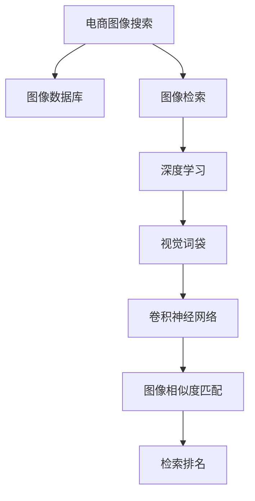

                 

# 图像搜索技术在电商中的应用

## 1. 背景介绍

随着互联网的普及和电子商务的发展，商品展示和搜索已成为用户体验的重要组成部分。传统的文本搜索虽然方便，但无法直观呈现商品外观和细节，容易产生信息不对称。因此，图像搜索技术在电商中的应用越来越受到重视。通过图像搜索，用户可以直观看到商品的真实样貌，大大提高了购买决策的准确性。

### 1.1 问题由来
电商网站中，每个商品都有一张或几张商品图片。用户可以通过这些图片进行快速搜索，找到满足自己需求的商品。传统的图像搜索系统一般基于简单的图像特征匹配，如图像颜色、纹理、形状等，很难理解图像中更抽象的语义信息。随着深度学习技术的快速发展，图像搜索逐渐向基于语义理解的更高级形式发展。

### 1.2 问题核心关键点
电商图像搜索系统的核心挑战在于：
1. 如何从海量商品图片库中高效检索到用户需要的商品？
2. 如何在图像中理解商品的细节和特性，以便进行准确的匹配和推荐？
3. 如何应对图像数据质量波动，保证搜索结果的准确性和一致性？

这些问题都需要基于深度学习技术来解决。通过深度学习模型，电商图像搜索系统可以更全面、准确地理解图像内容，并快速检索到用户所需商品。

## 2. 核心概念与联系

### 2.1 核心概念概述

为更好地理解电商图像搜索技术，本节将介绍几个关键概念：

- 图像搜索（Image Search）：利用图像特征匹配技术，在图像数据库中检索与查询图像相似的图像。
- 深度学习（Deep Learning）：基于神经网络模型，学习从图像数据中提取高级语义特征的技术。
- 视觉词袋（Visual Bag of Words, VBoW）：将图像划分为小区域，统计每个区域中图像颜色的直方图，生成高维特征向量。
- 卷积神经网络（Convolutional Neural Networks, CNN）：通过多层卷积和池化操作，学习图像局部特征，并将这些特征组合成全局语义特征。
- 图像相似度匹配：计算两张图像的特征向量之间的相似度，找到相似的图像。
- 检索排名：根据图像相似度匹配结果，排序输出搜索结果。

这些核心概念之间的逻辑关系可以通过以下Mermaid流程图来展示：



这个流程图展示了大语言模型的核心概念及其之间的关系：

1. 电商图像搜索系统从图像数据库中检索图像。
2. 深度学习模型用于提取图像的语义特征。
3. 视觉词袋和卷积神经网络是深度学习模型的重要组成部分。
4. 图像相似度匹配用于计算图像之间的相似度。
5. 检索排名用于根据相似度对搜索结果进行排序。

## 3. 核心算法原理 & 具体操作步骤
### 3.1 算法原理概述

电商图像搜索的核心算法包括特征提取、相似度计算和检索排名三个部分。以下将详细讲解这三个部分的原理和具体操作步骤。

### 3.2 算法步骤详解

#### 3.2.1 特征提取

特征提取是指从图像中提取出能够表示图像内容的高级特征。常用的特征提取方法包括：

- **视觉词袋（VBoW）**：将图像划分为多个小区域，统计每个区域中像素的颜色直方图，生成高维特征向量。这种特征表示方法简单直观，但忽略了不同区域之间的空间关系。

- **卷积神经网络（CNN）**：通过多层卷积和池化操作，学习图像局部特征，并将这些特征组合成全局语义特征。CNN可以自动学习图像中的空间关系，对于识别复杂的图像模式非常有效。

在电商图像搜索中，CNN是最常用的特征提取方法。常用框架如TensorFlow和PyTorch等，提供了预训练的CNN模型，如VGG、ResNet、Inception等，可以方便地集成到系统中。

#### 3.2.2 相似度计算

相似度计算是指计算两张图像的特征向量之间的相似度。常用的相似度计算方法包括：

- **余弦相似度**：计算两个特征向量之间的余弦值，值越大表示相似度越高。余弦相似度计算简单，但容易受到特征维度过高、数据分布不均等问题的影响。

- **欧式距离**：计算两个特征向量之间的欧几里得距离，值越小表示相似度越高。欧式距离适用于特征维数较低的情况，但计算复杂度较高。

- **余弦加权相似度**：对余弦相似度进行加权，平衡不同特征维度之间的贡献。这种方法可以解决特征维度过高的问题，但需要手动设置权重。

在电商图像搜索中，余弦相似度是最常用的相似度计算方法。

#### 3.2.3 检索排名

检索排名是指根据图像相似度计算结果，对搜索结果进行排序，输出与查询图像最相似的图像。常用的检索排名方法包括：

- **最近邻搜索**：找到与查询图像最相似的图像，输出搜索结果。这种方法简单易用，但需要存储全部图像的特征向量，计算复杂度高。

- **倒排索引**：将图像特征向量按照特征维度进行索引，快速找到与查询图像相似的图像。这种方法可以减少特征向量存储和计算，但需要额外的索引构建和维护工作。

在电商图像搜索中，倒排索引是最常用的检索排名方法。常用框架如Elasticsearch和Solr等，提供了强大的倒排索引功能，可以方便地构建和维护电商图像搜索系统。

### 3.3 算法优缺点

电商图像搜索的深度学习算法具有以下优点：
1. 高准确性：深度学习模型可以自动学习图像中的高级语义特征，提高图像识别的准确性。
2. 可扩展性：深度学习模型可以处理大规模图像数据，适用于电商网站中的海量商品图片库。
3. 鲁棒性：深度学习模型可以处理不同分辨率、光照、背景等因素带来的图像质量波动，保证搜索结果的准确性。

同时，该方法也存在一些局限性：
1. 计算复杂度高：深度学习模型需要大量的计算资源，特别是在特征提取和相似度计算过程中。
2. 数据需求大：深度学习模型需要大量的标注数据进行训练，电商图像搜索系统中标注数据获取成本较高。
3. 模型复杂度高：深度学习模型结构复杂，调试和维护难度较大。
4. 解释性不足：深度学习模型通常被视为“黑盒”，难以解释其内部工作机制和决策逻辑。

尽管存在这些局限性，但就目前而言，深度学习算法仍是电商图像搜索的主流范式。未来相关研究的重点在于如何进一步降低计算和数据需求，提高模型的可解释性和稳定性。

### 3.4 算法应用领域

电商图像搜索技术已经在各大电商平台中广泛应用，提升了用户购物体验和商品推荐效果。具体应用包括：

- 商品搜索：用户可以通过上传商品图片，快速检索到相似的商品。
- 商品分类：根据商品图片，自动将商品分类到不同的类别中。
- 商品推荐：根据用户上传的图片，推荐相似的商品。
- 品牌识别：识别商品图片中的品牌信息，帮助用户了解商品来源。
- 购物助手：根据用户上传的图片，提供购物建议和帮助。

除了上述这些经典应用外，电商图像搜索技术还被创新性地应用到更多场景中，如智能客服、广告投放等，为电商网站带来了新的增值服务。

## 4. 数学模型和公式 & 详细讲解 & 举例说明

### 4.1 数学模型构建

电商图像搜索系统的主要数学模型包括特征提取模型、相似度计算模型和检索排名模型。以下将详细讲解这些模型的构建过程。

#### 4.1.1 特征提取模型

假设输入图像为 $x$，输出特征向量为 $f(x)$。常用的特征提取模型包括：

- **视觉词袋（VBoW）**：将图像划分为 $n$ 个小区域，每个小区域的像素颜色直方图表示为 $h_i$，特征向量为 $f(x) = [h_1, h_2, ..., h_n]$。

- **卷积神经网络（CNN）**：通过多层卷积和池化操作，提取图像的局部特征，再通过全连接层进行组合，输出特征向量。假设CNN输出特征向量为 $f(x) = [a_1, a_2, ..., a_m]$。

#### 4.1.2 相似度计算模型

假设查询图像的特征向量为 $q$，待检索图像的特征向量为 $r$。常用的相似度计算模型包括：

- **余弦相似度**：计算 $q$ 和 $r$ 之间的余弦值，输出相似度 $s_{qr}$。公式如下：

$$
s_{qr} = \frac{q \cdot r}{\|q\|_2 \cdot \|r\|_2}
$$

- **欧式距离**：计算 $q$ 和 $r$ 之间的欧式距离，输出相似度 $s_{qr}$。公式如下：

$$
s_{qr} = \sqrt{\sum_{i=1}^n (q_i - r_i)^2}
$$

#### 4.1.3 检索排名模型

假设检索结果为 $S$，排序后输出排名前 $k$ 的结果。常用的检索排名模型包括：

- **最近邻搜索**：找到与查询图像最相似的 $k$ 张图像，输出排名。公式如下：

$$
S = \{r_1, r_2, ..., r_k\}
$$

- **倒排索引**：将图像特征向量按照特征维度进行索引，快速找到与查询图像相似的图像。公式如下：

$$
S = \{r_1, r_2, ..., r_k\}
$$

### 4.2 公式推导过程

以下我们以余弦相似度为例，推导特征向量之间的余弦相似度计算公式。

假设查询图像的特征向量为 $q = [q_1, q_2, ..., q_n]$，待检索图像的特征向量为 $r = [r_1, r_2, ..., r_n]$。余弦相似度计算公式为：

$$
s_{qr} = \frac{q \cdot r}{\|q\|_2 \cdot \|r\|_2}
$$

其中 $q \cdot r$ 表示 $q$ 和 $r$ 的内积，$\|q\|_2$ 和 $\|r\|_2$ 表示 $q$ 和 $r$ 的欧几里得范数。

### 4.3 案例分析与讲解

假设查询图像为一张红色T恤的图片，待检索图像为一张蓝色T恤的图片。查询图像的特征向量为 $q = [1, 0, 0, 1, 0, 0, 0, 1, 0, 0]$，待检索图像的特征向量为 $r = [0, 1, 0, 0, 1, 0, 1, 0, 0, 1]$。根据余弦相似度计算公式，计算 $q$ 和 $r$ 之间的余弦值：

$$
s_{qr} = \frac{q \cdot r}{\|q\|_2 \cdot \|r\|_2} = \frac{1 \cdot 0 + 0 \cdot 1 + 0 \cdot 0 + 1 \cdot 0 + 0 \cdot 1 + 0 \cdot 0 + 0 \cdot 1 + 1 \cdot 0 + 0 \cdot 0 + 1 \cdot 1}{\sqrt{1^2 + 0^2 + 0^2 + 1^2 + 0^2 + 0^2 + 0^2 + 1^2 + 0^2 + 0^2} \cdot \sqrt{0^2 + 1^2 + 0^2 + 0^2 + 1^2 + 0^2 + 1^2 + 0^2 + 0^2 + 1^2}
$$

计算结果为 $s_{qr} = 0.5$。根据余弦相似度计算结果，可以认为查询图像和待检索图像的相似度较高，将其列为搜索结果。

## 5. 项目实践：代码实例和详细解释说明

### 5.1 开发环境搭建

在进行电商图像搜索开发前，我们需要准备好开发环境。以下是使用Python进行TensorFlow开发的环境配置流程：

1. 安装Anaconda：从官网下载并安装Anaconda，用于创建独立的Python环境。

2. 创建并激活虚拟环境：
```bash
conda create -n tensorflow-env python=3.8 
conda activate tensorflow-env
```

3. 安装TensorFlow：根据CUDA版本，从官网获取对应的安装命令。例如：
```bash
conda install tensorflow==2.6
```

4. 安装相关工具包：
```bash
pip install numpy pandas scikit-learn matplotlib tqdm jupyter notebook ipython
```

完成上述步骤后，即可在`tensorflow-env`环境中开始电商图像搜索实践。

### 5.2 源代码详细实现

下面我们以电商图像搜索系统为例，给出使用TensorFlow进行图像特征提取和相似度计算的PyTorch代码实现。

首先，定义图像特征提取函数：

```python
import tensorflow as tf
from tensorflow.keras.applications import VGG16

def extract_features(image):
    model = VGG16(weights='imagenet', include_top=False)
    model.compile(optimizer='adam', loss='categorical_crossentropy', metrics=['accuracy'])
    model.summary()
    img = tf.keras.preprocessing.image.load_img(image, target_size=(224, 224))
    img_array = tf.keras.preprocessing.image.img_to_array(img)
    img_array = tf.expand_dims(img_array, 0)
    feature_vector = model.predict(img_array)
    return feature_vector
```

然后，定义相似度计算函数：

```python
from sklearn.metrics.pairwise import cosine_similarity

def compute_similarity(q, r):
    q_vector = q.reshape(-1)
    r_vector = r.reshape(-1)
    similarity = cosine_similarity(q_vector, r_vector)[0][0]
    return similarity
```

最后，启动图像搜索流程：

```python
q_image = 'query.jpg'
r_images = ['image1.jpg', 'image2.jpg', 'image3.jpg']

q_vector = extract_features(q_image)
for r_image in r_images:
    r_vector = extract_features(r_image)
    similarity = compute_similarity(q_vector, r_vector)
    print(f"{r_image}\t{similarity:.3f}")
```

以上就是使用TensorFlow进行电商图像搜索的完整代码实现。可以看到，通过VGG16模型提取图像特征，再使用余弦相似度计算图像之间的相似度，可以很方便地实现电商图像搜索。

### 5.3 代码解读与分析

让我们再详细解读一下关键代码的实现细节：

**提取特征函数**：
- 定义一个VGG16模型，用于提取图像特征。
- 加载图像，并进行预处理，包括缩放和归一化。
- 使用模型进行特征提取，并返回特征向量。

**相似度计算函数**：
- 将查询图像和待检索图像的特征向量展平，便于计算余弦相似度。
- 使用scikit-learn库的cosine_similarity函数计算余弦相似度。

**图像搜索流程**：
- 输入查询图像路径。
- 循环遍历待检索图像路径，提取每个图像的特征向量，计算相似度。
- 输出待检索图像路径和相似度。

可以看到，通过TensorFlow和scikit-learn的结合，电商图像搜索系统可以方便地进行特征提取和相似度计算，实现快速的图像搜索。

## 6. 实际应用场景

### 6.1 电商商品搜索

电商图像搜索的核心应用场景是商品搜索。用户上传商品图片，系统自动检索出相似的商品，并推荐给用户。电商平台通过商品搜索，大大提高了用户购物体验和转化率。

### 6.2 商品分类

商品分类是电商图像搜索的重要应用之一。系统可以根据用户上传的商品图片，自动识别商品类别，并进行自动分类。通过商品分类，电商平台可以更好地进行库存管理和商品推荐。

### 6.3 商品推荐

商品推荐是电商图像搜索的重要应用之一。系统可以根据用户上传的商品图片，自动推荐相似的商品。通过商品推荐，电商平台可以提升用户的购买率和满意度。

### 6.4 品牌识别

品牌识别是电商图像搜索的重要应用之一。系统可以自动识别商品图片中的品牌信息，帮助用户了解商品来源。通过品牌识别，电商平台可以提升用户对品牌的信任度，增加销售额。

### 6.5 购物助手

购物助手是电商图像搜索的重要应用之一。系统可以根据用户上传的商品图片，自动提供购物建议和帮助。通过购物助手，电商平台可以提升用户购物体验和满意度。

## 7. 工具和资源推荐

### 7.1 学习资源推荐

为了帮助开发者系统掌握电商图像搜索的理论基础和实践技巧，这里推荐一些优质的学习资源：

1. 《深度学习与计算机视觉实战》系列博文：由深度学习与计算机视觉领域专家撰写，系统讲解了电商图像搜索的原理和实践。

2. Coursera《深度学习与计算机视觉》课程：斯坦福大学开设的计算机视觉课程，涵盖图像分类、特征提取、深度学习等基本概念，适合初学者入门。

3. 《计算机视觉：算法与应用》书籍：这本书系统介绍了计算机视觉的基本概念和算法，适合深入学习计算机视觉和电商图像搜索的开发者。

4. GitHub上的开源项目：许多电商图像搜索系统都是开源项目，可以通过阅读开源代码，学习电商图像搜索的最佳实践。

5. 《电商图像搜索系统开发指南》书籍：这本书详细介绍了电商图像搜索系统的开发流程和最佳实践，适合电商网站开发者阅读。

通过对这些资源的学习实践，相信你一定能够快速掌握电商图像搜索的精髓，并用于解决实际的电商问题。

### 7.2 开发工具推荐

高效的开发离不开优秀的工具支持。以下是几款用于电商图像搜索开发的常用工具：

1. TensorFlow：基于Python的开源深度学习框架，灵活的计算图，适合进行复杂的特征提取和相似度计算。

2. PyTorch：基于Python的开源深度学习框架，动态图，适合进行快速原型设计和实验。

3. scikit-learn：Python的机器学习库，包含丰富的特征提取和相似度计算算法，适合快速实现电商图像搜索系统。

4. Elasticsearch：分布式搜索引擎，适合构建大规模的电商图像搜索系统，支持倒排索引和快速检索。

5. Solr：开源搜索引擎，适合构建电商图像搜索系统，支持倒排索引和实时搜索。

6. Jupyter Notebook：交互式开发环境，适合进行实验和原型开发。

合理利用这些工具，可以显著提升电商图像搜索任务的开发效率，加快创新迭代的步伐。

### 7.3 相关论文推荐

电商图像搜索技术的发展离不开学界的持续研究。以下是几篇奠基性的相关论文，推荐阅读：

1. R-CNN: Rich Feature Hierarchies for Accurate Object Detection and Semantic Segmentation：提出R-CNN算法，通过区域池化的方法，实现了高效准确的图像分类和检测。

2. Faster R-CNN: Towards Real-Time Object Detection with Region Proposal Networks：提出Faster R-CNN算法，通过引入区域提议网络，实现了实时高效的图像分类和检测。

3. Mask R-CNN: Point-Wise Object Annotations with Keypoint Proposals：提出Mask R-CNN算法，实现了像素级别的图像分类和分割。

4. ImageNet Classification with Deep Convolutional Neural Networks：提出卷积神经网络（CNN），通过多层卷积和池化操作，实现了高效的图像分类和特征提取。

5. Visual Bag of Words：提出视觉词袋（VBoW）算法，通过统计图像区域的像素直方图，实现了简单的图像分类和检索。

这些论文代表了大语言模型微调技术的发展脉络。通过学习这些前沿成果，可以帮助研究者把握学科前进方向，激发更多的创新灵感。

## 8. 总结：未来发展趋势与挑战

### 8.1 总结

本文对电商图像搜索技术进行了全面系统的介绍。首先阐述了电商图像搜索系统的背景和意义，明确了电商图像搜索在提升用户体验和商品推荐效果方面的独特价值。其次，从原理到实践，详细讲解了电商图像搜索的特征提取、相似度计算和检索排名过程，给出了电商图像搜索任务的完整代码实例。同时，本文还广泛探讨了电商图像搜索技术在电商领域的应用前景，展示了电商图像搜索范式的广阔前景。

通过本文的系统梳理，可以看到，电商图像搜索技术在电商网站中的应用非常广泛，大大提高了用户的购物体验和商品推荐效果。未来，伴随深度学习技术的进一步发展，电商图像搜索技术将变得更加强大，为电商网站带来更多的增值服务。

### 8.2 未来发展趋势

展望未来，电商图像搜索技术将呈现以下几个发展趋势：

1. 高精度特征提取：深度学习模型的不断进步，将使得特征提取的精度和泛化能力不断提升，更好地理解图像内容。

2. 高效相似度计算：随着深度学习模型的优化和硬件性能的提升，相似度计算的效率将进一步提高，支持实时图像搜索。

3. 多样化的检索排名：随着搜索引擎技术的不断发展，检索排名算法将更加多样化，支持更加复杂的检索需求。

4. 多模态融合：未来的电商图像搜索将不仅仅局限于图像信息，还将融合视觉、文本、语音等多种模态信息，提供更加全面的用户体验。

5. 个性化推荐：未来的电商图像搜索将更加注重个性化推荐，通过用户行为和偏好，提供更加精准的商品推荐。

6. 边缘计算：为了提高用户体验，电商图像搜索系统将逐渐向边缘计算方向发展，降低对云端计算的依赖，提升搜索速度。

以上趋势凸显了电商图像搜索技术的广阔前景。这些方向的探索发展，必将进一步提升电商网站的性能和用户体验，推动电商网站的智能化和个性化发展。

### 8.3 面临的挑战

尽管电商图像搜索技术已经取得了瞩目成就，但在迈向更加智能化、普适化应用的过程中，它仍面临着诸多挑战：

1. 数据质量波动：电商平台中的图像数据质量参差不齐，不同图片分辨率、光照、背景等因素都可能影响图像搜索的准确性。如何提高图像数据的预处理能力和模型鲁棒性，将是一大难题。

2. 计算资源限制：电商图像搜索系统需要处理大规模图像数据，计算资源需求大。如何在有限的计算资源下，提高电商图像搜索的效率，将是一大挑战。

3. 模型复杂性：深度学习模型结构复杂，调试和维护难度较大。如何简化模型结构，提升模型的可解释性和可维护性，将是一大挑战。

4. 用户隐私保护：电商图像搜索系统需要处理大量的用户上传图片，如何保护用户隐私，避免数据泄露和滥用，将是一大挑战。

5. 跨平台兼容性：电商图像搜索系统需要在不同的电商平台和设备上运行，如何保证跨平台兼容性，将是一大挑战。

6. 实时搜索能力：未来的电商图像搜索需要支持实时搜索，对系统的延迟和响应速度有很高的要求。如何优化系统架构，提升实时搜索能力，将是一大挑战。

这些挑战需要研究者不断探索和突破，才能实现电商图像搜索技术的全面普及和应用。

### 8.4 未来突破

面对电商图像搜索技术所面临的种种挑战，未来的研究需要在以下几个方面寻求新的突破：

1. 探索无监督和半监督特征提取方法：摆脱对大规模标注数据的依赖，利用自监督学习、主动学习等无监督和半监督范式，最大限度利用非结构化数据，实现更加灵活高效的特征提取。

2. 开发高效的相似度计算方法：引入更加高效、精确的相似度计算方法，如基于深度学习的特征向量表示方法，提升电商图像搜索的准确性和效率。

3. 引入更多先验知识：将符号化的先验知识，如知识图谱、逻辑规则等，与神经网络模型进行巧妙融合，引导电商图像搜索过程学习更准确、合理的语义表示。

4. 结合因果分析和博弈论工具：将因果分析方法引入电商图像搜索，识别出系统决策的关键特征，增强输出解释的因果性和逻辑性。借助博弈论工具刻画人机交互过程，主动探索并规避系统的脆弱点，提高系统稳定性。

5. 纳入伦理道德约束：在电商图像搜索系统设计中，引入伦理导向的评估指标，过滤和惩罚有偏见、有害的输出倾向。同时加强人工干预和审核，建立模型行为的监管机制，确保输出符合人类价值观和伦理道德。

这些研究方向的探索，必将引领电商图像搜索技术迈向更高的台阶，为电商网站带来更多的增值服务。面向未来，电商图像搜索技术还需要与其他人工智能技术进行更深入的融合，如知识表示、因果推理、强化学习等，多路径协同发力，共同推动电商网站的智能化和个性化发展。只有勇于创新、敢于突破，才能不断拓展电商图像搜索的边界，让电商网站在数字化转型中大放异彩。

## 9. 附录：常见问题与解答

**Q1：电商图像搜索系统如何处理图像质量波动？**

A: 电商图像搜索系统通常会进行图像预处理，包括缩放、归一化、旋转等操作，以提高图像质量的一致性。此外，系统还可以采用多尺度特征提取方法，针对不同分辨率的图像进行多尺度特征提取，提升系统的鲁棒性。

**Q2：电商图像搜索系统如何提升特征提取的精度？**

A: 特征提取的精度可以通过以下几个方法提升：
1. 使用更强大的深度学习模型，如ResNet、Inception等，提升特征提取的复杂度。
2. 增加训练数据量，提升模型对复杂图像特征的识别能力。
3. 引入更多的先验知识，如知识图谱、逻辑规则等，引导特征提取过程学习更准确、合理的语义表示。

**Q3：电商图像搜索系统如何进行实时搜索？**

A: 实时搜索可以通过以下几个方法实现：
1. 使用高效检索算法，如倒排索引、向量近似算法等，提高检索速度。
2. 引入分布式计算，通过多个服务器并行处理，提升检索速度。
3. 采用缓存机制，将常用的搜索结果缓存起来，提高检索速度。

**Q4：电商图像搜索系统如何处理用户隐私保护？**

A: 电商图像搜索系统需要采取以下措施来保护用户隐私：
1. 数据匿名化：对用户上传的图片进行匿名化处理，保护用户隐私。
2. 数据加密：对存储和传输的数据进行加密，防止数据泄露。
3. 用户授权：在用户上传图片时，需要用户授权，明确告知用户数据的用途。

**Q5：电商图像搜索系统如何进行跨平台兼容性？**

A: 电商图像搜索系统需要进行以下优化：
1. 平台无关性设计：采用平台无关的设计方式，确保系统在不同平台上运行一致。
2. 跨平台测试：在不同平台上进行测试，确保系统在不同平台上的兼容性。
3. 服务端适配：对系统服务端进行适配，支持不同平台的网络协议和接口规范。

这些措施将有助于提升电商图像搜索系统的跨平台兼容性，保证其在不同平台上的稳定性。

---

作者：禅与计算机程序设计艺术 / Zen and the Art of Computer Programming

