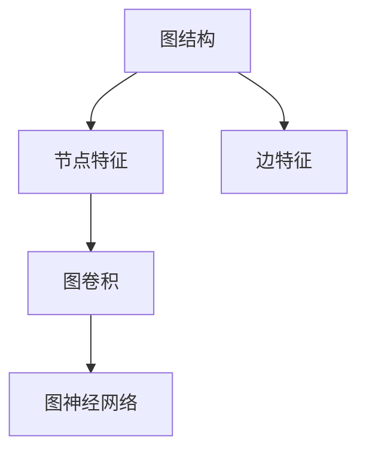

                 

## 1. 背景介绍

图神经网络（Graph Neural Network, GNN）是一种新型的神经网络模型，专门用于处理图结构化数据。在数据科学和机器学习领域，传统的神经网络通常只能处理线性或平面结构的数据，如图像、文本、时间序列等。然而，许多现实世界中的数据都是非线性的、图结构的，如社交网络、蛋白质分子、知识图谱等。为了应对这类结构化数据，图神经网络应运而生，成为近年来学术界和工业界的热门研究主题。

### 1.1 问题由来

在当今数字化时代，结构化数据无处不在。社交网络、电商平台、物流系统等，都包含了复杂的关系网络结构。对于这类数据，传统的机器学习模型往往无法有效建模和分析。例如，在社交网络中，每个节点（用户）不仅仅是一个孤立的数据点，而是与其他节点存在各种关系，如好友关系、关注关系等。图神经网络通过将数据结构化的方式进行建模，能够更好地理解和利用这些复杂关系，从而提升数据处理和分析的准确性和效率。

### 1.2 问题核心关键点

图神经网络的核心思想是将传统的神经网络结构扩展到图结构上。它能够利用节点和边的关系信息，对图数据进行有效的编码和推理。图神经网络的核心组件包括节点特征表示、边特征表示、图聚合运算、多层图卷积等。通过这些组件，图神经网络能够在保持节点局部信息的同时，融合全局信息，实现更强大的表示和推理能力。

图神经网络的主要应用领域包括社交网络分析、知识图谱挖掘、推荐系统、医疗数据分析等。在实际应用中，图神经网络可以处理大量复杂图数据，并从其中提取出有用的信息，应用于数据挖掘、图像识别、自然语言处理等任务。

## 2. 核心概念与联系

### 2.1 核心概念概述

为更好地理解图神经网络，本节将介绍几个密切相关的核心概念：

- 图结构：由节点和边组成的数据结构，用来描述现实世界中的各种关系和依赖。
- 节点特征：节点对应的属性信息，如社交网络中的用户信息、知识图谱中的实体属性等。
- 边特征：节点之间的关系信息，如社交网络中的好友关系、知识图谱中的实体关联等。
- 图卷积：将节点特征进行聚合，结合边特征，进行新的特征表示。
- 图神经网络：由多个图卷积层组成的深度学习模型，能够对图结构数据进行有效的编码和推理。

这些核心概念之间的逻辑关系可以通过以下Mermaid流程图来展示：



这个流程图展示了图结构中的节点特征和边特征，通过图卷积进行聚合，最终输入到图神经网络进行编码和推理。

## 3. 核心算法原理 & 具体操作步骤

### 3.1 算法原理概述

图神经网络的核心算法原理是通过图卷积运算，将节点特征进行聚合，结合边特征，进行新的特征表示。在每一层图卷积中，节点特征通过接收来自邻居节点的特征信息，进行加权求和，得到新的特征表示。这样一层一层地进行图卷积运算，最终得到整个图的高级表示。

### 3.2 算法步骤详解

图神经网络的训练通常分为以下几个步骤：

**Step 1: 准备数据集**

图神经网络的训练需要大量的图数据，包括节点特征、边特征和关系信息。通常情况下，可以从公开数据集（如ZDNet、PPI等）或自己构建数据集中获取数据。

**Step 2: 设计图卷积层**

图卷积层是图神经网络的核心组件，用来对节点特征进行聚合，结合边特征，进行新的特征表示。设计图卷积层的关键在于选择合适的聚合方式，如均值聚合、加权聚合等。

**Step 3: 搭建图神经网络**

在得到图卷积层之后，可以将其堆叠起来，构建多层图神经网络。每层图卷积的输出作为下一层的输入，经过多次迭代，最终得到整个图的高级表示。

**Step 4: 训练和测试**

在构建好图神经网络之后，需要对其进行训练和测试。训练通常使用交叉熵损失函数，优化器通常使用Adam、SGD等。测试通常使用准确率、召回率等指标评估模型的性能。

### 3.3 算法优缺点

图神经网络相比传统的神经网络，具有以下优点：

1. 能够处理非线性结构数据：传统的神经网络只能处理线性或平面结构的数据，而图神经网络能够处理复杂的关系结构。
2. 能够融合全局信息：图神经网络通过图卷积运算，能够融合全局信息，提高模型的表示能力。
3. 能够处理多模态数据：图神经网络可以处理不同类型的节点特征和边特征，支持多模态数据的融合。

同时，图神经网络也存在一些缺点：

1. 训练复杂度高：图神经网络需要大量的计算资源，训练复杂度高。
2. 数据预处理难度大：图神经网络需要处理复杂的关系结构，数据预处理难度较大。
3. 模型过于复杂：图神经网络通常需要多层堆叠，模型过于复杂，难以解释。

尽管存在这些缺点，但图神经网络在处理图结构数据方面具有强大的表现力，被广泛应用于社交网络分析、知识图谱挖掘、推荐系统等领域。

### 3.4 算法应用领域

图神经网络已经在多个领域得到应用，包括但不限于以下几个方面：

- 社交网络分析：对社交网络中的用户关系进行分析，挖掘社会网络结构特征。
- 知识图谱挖掘：从知识图谱中提取实体之间的关系，进行知识推理。
- 推荐系统：基于用户画像和物品关系，为用户推荐个性化的物品。
- 医疗数据分析：利用医疗数据的关系结构，进行疾病诊断和治疗方案推荐。
- 交通网络分析：对交通网络中的车辆、道路、信号灯等节点进行建模，进行交通流预测和优化。

除了这些应用场景，图神经网络还被广泛应用于自然语言处理、图像识别、金融分析等领域，展现了其在处理结构化数据方面的强大能力。

## 4. 数学模型和公式 & 详细讲解 & 举例说明

### 4.1 数学模型构建

图神经网络的数学模型可以表示为：

$$
\mathcal{G}=(\mathcal{V},\mathcal{E},\mathcal{F})
$$

其中，$\mathcal{V}$ 表示节点集合，$\mathcal{E}$ 表示边集合，$\mathcal{F}$ 表示节点特征集合。每个节点 $v_i \in \mathcal{V}$ 有对应的节点特征 $x_i \in \mathcal{F}$，边 $e_{ij} \in \mathcal{E}$ 连接节点 $v_i$ 和 $v_j$，并有一个对应的边特征 $h_{ij} \in \mathcal{F}$。

### 4.2 公式推导过程

以节点为中心的Graph Convolutional Network（GCN）为例，其数学公式可以表示为：

$$
x_{i+1}^{k} = \sum_{j \in \mathcal{N}(i)} \frac{1}{\sqrt{\mathrm{deg}(j)}} x_{j}^{k-1} h_{ij}
$$

其中，$x_i^k$ 表示第 $k$ 层的节点特征，$\mathcal{N}(i)$ 表示节点 $i$ 的邻居节点集合，$\mathrm{deg}(j)$ 表示节点 $j$ 的度数。公式的含义是通过接收来自邻居节点的特征信息，进行加权求和，得到新的特征表示。

### 4.3 案例分析与讲解

以社交网络分析为例，我们可以利用GCN模型对社交网络中的用户关系进行分析，挖掘社会网络结构特征。假设社交网络中有 $N$ 个用户，每个用户 $v_i$ 有 $k$ 个邻居节点，节点特征为 $\{x_i^0\}_{i=1}^N$，边特征为 $\{h_{ij}\}_{(i,j)\in \mathcal{E}}$。

在GCN模型中，第一层节点特征为 $x_i^1 = \sum_{j \in \mathcal{N}(i)} \frac{1}{\sqrt{\mathrm{deg}(j)}} x_{j}^{0} h_{ij}$，第二层节点特征为 $x_i^2 = \sum_{j \in \mathcal{N}(i)} \frac{1}{\sqrt{\mathrm{deg}(j)}} x_{j}^{1} h_{ij}$，以此类推。最终得到 $N$ 个用户的高级表示，用于社交网络中的各种任务，如社区发现、推荐系统等。

## 5. 项目实践：代码实例和详细解释说明

### 5.1 开发环境搭建

在进行图神经网络实践前，我们需要准备好开发环境。以下是使用Python进行PyTorch开发的环境配置流程：

1. 安装Anaconda：从官网下载并安装Anaconda，用于创建独立的Python环境。

2. 创建并激活虚拟环境：
```bash
conda create -n pytorch-env python=3.8 
conda activate pytorch-env
```

3. 安装PyTorch：根据CUDA版本，从官网获取对应的安装命令。例如：
```bash
conda install pytorch torchvision torchaudio cudatoolkit=11.1 -c pytorch -c conda-forge
```

4. 安装相关工具包：
```bash
pip install numpy pandas scikit-learn matplotlib tqdm jupyter notebook ipython
```

完成上述步骤后，即可在`pytorch-env`环境中开始图神经网络的实践。

### 5.2 源代码详细实现

这里我们以GCN模型为例，给出使用PyTorch进行社交网络分析的代码实现。

首先，定义社交网络的数据处理函数：

```python
import torch
import torch.nn as nn
import torch.nn.functional as F
from torch_geometric.data import Data

class GCNModel(nn.Module):
    def __init__(self, input_dim, hidden_dim, num_layers, drop_p=0.6):
        super(GCNModel, self).__init__()
        self.num_layers = num_layers
        self.drop_p = drop_p
        
        self.layers = nn.ModuleList()
        self.layers.append(nn.Linear(input_dim, hidden_dim))
        for _ in range(num_layers-1):
            self.layers.append(nn.Linear(hidden_dim, hidden_dim))
        
    def forward(self, x, adj):
        h = x
        for layer in self.layers:
            h = F.relu(h)
            h = nn.functional.dropout(h, self.drop_p, training=self.training)
            h = h @ adj @ layer.weight
            h = layer(h)
        
        return h
```

然后，定义优化器和损失函数：

```python
optimizer = torch.optim.Adam(model.parameters(), lr=0.01)
criterion = nn.CrossEntropyLoss()
```

接着，定义训练和评估函数：

```python
def train_epoch(model, dataset, optimizer):
    model.train()
    for data in dataset:
        x, adj, y = data
        optimizer.zero_grad()
        y_hat = model(x, adj)
        loss = criterion(y_hat, y)
        loss.backward()
        optimizer.step()
        
def evaluate(model, dataset):
    model.eval()
    y_pred, y_true = [], []
    for data in dataset:
        x, adj, y = data
        y_hat = model(x, adj)
        y_pred.append(y_hat.argmax(1))
        y_true.append(y)
        
    y_pred = torch.cat(y_pred, 0)
    y_true = torch.cat(y_true, 0)
    acc = (y_pred == y_true).float().mean()
    print(f"Accuracy: {acc:.4f}")
```

最后，启动训练流程并在测试集上评估：

```python
epochs = 10
batch_size = 64

for epoch in range(epochs):
    train_epoch(model, train_dataset, optimizer)
    
    print(f"Epoch {epoch+1}, train loss: {loss:.4f}")
    evaluate(model, dev_dataset)
    
print("Test results:")
evaluate(model, test_dataset)
```

以上就是使用PyTorch进行GCN模型社交网络分析的完整代码实现。可以看到，得益于PyTorch的强大封装，我们可以用相对简洁的代码完成GCN模型的训练和评估。

### 5.3 代码解读与分析

让我们再详细解读一下关键代码的实现细节：

**GCNModel类**：
- `__init__`方法：初始化模型参数，包括隐藏层数、节点特征维度、dropout率等。
- `forward`方法：定义模型前向传播的逻辑。首先对输入的节点特征进行线性变换，然后进行图卷积运算，最后经过若干层神经网络。

**优化器和损失函数**：
- 使用Adam优化器，设置学习率为0.01。
- 使用交叉熵损失函数，评估模型在社交网络中的分类精度。

**训练和评估函数**：
- 使用PyTorch的DataLoader对数据集进行批次化加载，供模型训练和推理使用。
- 训练函数`train_epoch`：对数据以批为单位进行迭代，在每个批次上前向传播计算损失函数，并反向传播更新模型参数。
- 评估函数`evaluate`：与训练类似，不同点在于不更新模型参数，并在每个batch结束后将预测和标签结果存储下来，最后使用准确率指标评估模型性能。

**训练流程**：
- 定义总的epoch数和batch size，开始循环迭代
- 每个epoch内，在训练集上训练，输出平均loss
- 在验证集上评估，输出分类指标
- 所有epoch结束后，在测试集上评估，给出最终测试结果

可以看到，PyTorch配合GNN库使得GCN模型的训练代码实现变得简洁高效。开发者可以将更多精力放在数据处理、模型改进等高层逻辑上，而不必过多关注底层的实现细节。

当然，工业级的系统实现还需考虑更多因素，如模型的保存和部署、超参数的自动搜索、更灵活的任务适配层等。但核心的图神经网络微调范式基本与此类似。

## 6. 实际应用场景

### 6.1 社交网络分析

GCN模型已经在社交网络分析中得到了广泛的应用。社交网络是一个复杂的关系网络，包含着众多的节点和边。GCN模型能够有效地利用节点特征和边特征，对社交网络进行建模和分析。

在技术实现上，可以收集社交网络中的用户行为数据，将用户关系构建为图数据，将用户行为作为节点特征，使用GCN模型对社交网络进行建模和分析。GCN模型能够挖掘出社交网络中的社区结构、影响力传播等规律，从而为社交网络分析提供有价值的信息。

### 6.2 知识图谱挖掘

知识图谱是一种用于表示实体、关系、属性的三元组结构化数据。GCN模型能够对知识图谱中的实体和关系进行建模，挖掘出实体之间的关系和属性信息，进行知识推理和信息抽取。

在技术实现上，可以构建知识图谱的图结构，将实体作为节点，关系作为边，使用GCN模型对知识图谱进行建模。GCN模型能够学习到实体之间的关系和属性信息，从而进行知识推理和信息抽取，用于问答系统、推荐系统等领域。

### 6.3 推荐系统

推荐系统是推荐用户可能感兴趣物品的系统。GCN模型能够对用户和物品之间的关系进行建模，挖掘出用户和物品的特征信息，进行推荐预测。

在技术实现上，可以构建用户-物品关系的图结构，将用户和物品作为节点，关系作为边，使用GCN模型对推荐系统进行建模。GCN模型能够学习到用户和物品的特征信息，从而进行推荐预测，用于商品推荐、音乐推荐等领域。

### 6.4 未来应用展望

随着GCN模型和图神经网络方法的不断发展，其在实际应用中的表现将更加广泛和深入。

未来，GCN模型和图神经网络将被广泛应用于智能城市治理、智慧医疗、智能物流等领域。在智能城市治理中，GCN模型能够对交通网络进行建模，进行交通流预测和优化，提升城市治理效率。在智慧医疗中，GCN模型能够对医疗数据进行建模，进行疾病诊断和治疗方案推荐，提升医疗服务质量。在智能物流中，GCN模型能够对物流网络进行建模，进行物流路径优化和配送规划，提升物流效率。

此外，在金融分析、自然语言处理、图像识别等领域，GCN模型和图神经网络也将继续发挥重要作用。未来，GCN模型和图神经网络将在更多领域得到应用，为现实世界中的复杂结构化数据提供高效、准确的建模和分析手段。

## 7. 工具和资源推荐

### 7.1 学习资源推荐

为了帮助开发者系统掌握图神经网络的理论基础和实践技巧，这里推荐一些优质的学习资源：

1. 《Graph Neural Networks: A Review of Methods and Applications》系列博文：由图神经网络领域专家撰写，全面介绍图神经网络的理论基础、经典模型和应用案例。

2. 斯坦福大学CS224P《深度学习与表示学习》课程：斯坦福大学开设的图神经网络课程，涵盖图神经网络的基本概念和经典模型，提供Lecture视频和配套作业。

3. 《Deep Learning with Graphs》书籍：由图神经网络领域的先驱者和权威专家撰写，全面介绍图神经网络的基本概念、算法原理和实际应用。

4. Geometric Deep Learning与Graph Neural Networks（GNNs）系列书籍：由图神经网络领域的研究者和从业者撰写，涵盖图神经网络的算法原理、应用案例和前沿技术。

5. 《Graph Neural Networks: Recent Developments and Applications》期刊：图神经网络领域的顶级期刊，提供最新的图神经网络研究进展和应用案例，适合深入研究。

通过对这些资源的学习实践，相信你一定能够快速掌握图神经网络的理论基础和实践技巧，并用于解决实际的图结构化数据问题。

### 7.2 开发工具推荐

高效的开发离不开优秀的工具支持。以下是几款用于图神经网络开发的常用工具：

1. PyTorch：基于Python的开源深度学习框架，灵活动态的计算图，适合快速迭代研究。大部分图神经网络模型都有PyTorch版本的实现。

2. TensorFlow：由Google主导开发的开源深度学习框架，生产部署方便，适合大规模工程应用。同样有丰富的图神经网络资源。

3. NetworkX：用于构建和操作图结构的Python库，支持图数据的存储、处理和分析。

4. DGL：由人工智能驱动的数据科学与工程研究院（AI^3）开发的图神经网络库，支持PyTorch和TensorFlow，提供丰富的图神经网络模型和算法。

5. Snorkel：用于自动化标注和图结构数据学习的工具，能够自动标注数据，生成图结构数据，进行图神经网络模型的训练和推理。

合理利用这些工具，可以显著提升图神经网络开发的效率，加快创新迭代的步伐。

### 7.3 相关论文推荐

图神经网络在学术界和工业界的发展离不开持续的研究和探索。以下是几篇奠基性的相关论文，推荐阅读：

1. Graph Convolutional Networks：提出GCN模型，开创了图神经网络的研究范式。

2. Deep Graph Neural Networks：提出基于深度神经网络的图卷积运算，进一步提升图神经网络的表示能力。

3. Multi-layer Graph Attention Networks：提出多层图注意力网络，能够处理不同类型的图数据，提升图神经网络的泛化能力。

4. Graph Isomorphism Network：提出基于神经网络的图同构检测方法，解决图结构数据的相似性问题。

5. Neural Message Passing for Quantum Chemistry：提出基于图神经网络的量子化学计算方法，将图神经网络应用于复杂的物理问题求解。

这些论文代表了大图神经网络的研究发展脉络。通过学习这些前沿成果，可以帮助研究者把握学科前进方向，激发更多的创新灵感。

## 8. 总结：未来发展趋势与挑战

### 8.1 总结

本文对基于图结构的数据处理，特别是图神经网络进行了全面系统的介绍。首先阐述了图神经网络的产生背景和研究意义，明确了图神经网络在处理结构化数据方面的独特价值。其次，从原理到实践，详细讲解了图神经网络的数学模型和算法实现，给出了图神经网络任务开发的完整代码实例。同时，本文还广泛探讨了图神经网络在社交网络分析、知识图谱挖掘、推荐系统等实际应用中的表现，展示了图神经网络的广泛应用前景。

通过本文的系统梳理，可以看到，图神经网络在处理结构化数据方面具有强大的表现力，被广泛应用于社交网络分析、知识图谱挖掘、推荐系统等领域。未来，伴随图神经网络技术的不断发展，图神经网络必将在更多领域得到应用，为现实世界中的复杂结构化数据提供高效、准确的建模和分析手段。

### 8.2 未来发展趋势

展望未来，图神经网络技术将呈现以下几个发展趋势：

1. 模型规模持续增大：随着算力成本的下降和数据规模的扩张，图神经网络的参数量还将持续增长。超大规模图神经网络能够更好地处理复杂的结构化数据，提高模型的表示能力。

2. 模型架构更加多样：除了传统的图卷积网络（GCN），未来将涌现更多先进的图神经网络模型，如图注意力网络（GAT）、图神经网络变分自编码器（GraphVAE）等。这些模型能够更好地处理不同类型的图数据，提升模型的泛化能力。

3. 多模态融合更加深入：图神经网络能够处理多种模态的数据，如文本、图像、音频等。未来，多模态图神经网络能够更好地融合不同类型的信息，提升模型的综合表现力。

4. 联邦学习与分布式训练：图神经网络通常需要大量的计算资源，分布式训练能够显著提高训练效率。联邦学习通过分布式训练，保护数据隐私，提高模型的鲁棒性和泛化能力。

5. 实时图神经网络：图神经网络通常需要大规模的训练数据，实时图神经网络能够在在线数据流中实时进行训练和推理，提高模型的时效性和适应性。

6. 自监督学习与半监督学习：图神经网络通常需要大量的标注数据，自监督学习与半监督学习能够利用未标注数据进行模型训练，提升模型的泛化能力和鲁棒性。

以上趋势凸显了图神经网络技术的广阔前景。这些方向的探索发展，必将进一步提升图神经网络的处理能力和应用范围，为智能系统的智能化和普适化提供更多技术支持。

### 8.3 面临的挑战

尽管图神经网络技术已经取得了瞩目成就，但在迈向更加智能化、普适化应用的过程中，它仍面临着诸多挑战：

1. 数据预处理复杂：图神经网络通常需要处理复杂的关系结构，数据预处理难度较大。需要构建合适的图结构，选择合适的节点和边特征。

2. 训练复杂度高：图神经网络需要大量的计算资源，训练复杂度高。需要优化模型的计算图，提高训练效率。

3. 模型过于复杂：图神经网络通常需要多层堆叠，模型过于复杂，难以解释。需要开发更加简洁高效的图神经网络模型。

4. 鲁棒性不足：图神经网络面临对抗攻击时，鲁棒性不足。需要开发更加鲁棒、安全的图神经网络模型。

5. 参数共享问题：图神经网络中的节点特征通常共享，难以捕捉节点之间的异质性。需要开发更加灵活的图神经网络模型。

尽管存在这些挑战，但图神经网络在处理结构化数据方面的强大表现力，使得其在众多领域得到广泛应用。未来，通过进一步研究优化图神经网络技术，克服这些挑战，图神经网络必将在更多领域发挥重要作用。

### 8.4 研究展望

面对图神经网络面临的种种挑战，未来的研究需要在以下几个方面寻求新的突破：

1. 探索更加高效的图卷积算法：优化图卷积算法的计算复杂度，提高图神经网络的训练效率。

2. 引入更多先验知识：将符号化的先验知识，如知识图谱、逻辑规则等，与神经网络模型进行巧妙融合，引导图神经网络模型学习更准确、合理的图结构表示。

3. 引入更多模态信息：图神经网络能够处理多种模态的数据，如文本、图像、音频等。未来，多模态图神经网络能够更好地融合不同类型的信息，提升模型的综合表现力。

4. 引入更多结构化数据：图神经网络能够处理结构化数据，未来能够更好地处理结构化数据，提升模型的泛化能力和鲁棒性。

5. 引入更多分布式训练算法：图神经网络通常需要大量的计算资源，分布式训练能够显著提高训练效率。未来需要开发更加高效、安全的分布式训练算法。

6. 引入更多鲁棒性技术：图神经网络面临对抗攻击时，鲁棒性不足。未来需要开发更加鲁棒、安全的图神经网络模型。

这些研究方向的探索，必将引领图神经网络技术迈向更高的台阶，为智能系统的智能化和普适化提供更多技术支持。面向未来，图神经网络需要与其他人工智能技术进行更深入的融合，如知识表示、因果推理、强化学习等，多路径协同发力，共同推动图神经网络的进步。只有勇于创新、敢于突破，才能不断拓展图神经网络技术的边界，让智能技术更好地造福人类社会。

## 9. 附录：常见问题与解答

**Q1：图神经网络是否适用于所有结构化数据？**

A: 图神经网络通常适用于具有明确关系结构的数据，如社交网络、知识图谱、交通网络等。对于非结构化数据，如图像、文本等，通常需要将其转换为图结构数据，才能应用图神经网络进行处理。

**Q2：如何选择合适的图结构？**

A: 选择合适的图结构是图神经网络的关键步骤。首先需要明确数据中包含的关系类型，如社交网络中的好友关系、知识图谱中的实体关联等。然后根据这些关系，构建合适的图结构，选择合适的节点和边特征。

**Q3：图神经网络中的dropout和边采样策略如何影响模型的泛化能力？**

A: 在图神经网络中，dropout和边采样策略是常用的正则化技术，能够提高模型的泛化能力。dropout能够减少节点之间的依赖关系，避免过拟合。边采样策略能够降低模型的计算复杂度，提高训练效率。

**Q4：图神经网络中的层次结构如何影响模型的表示能力？**

A: 图神经网络中的层次结构对模型的表示能力有重要影响。通常来说，层次结构越深，模型的表示能力越强，但训练复杂度也越高。在实际应用中，需要根据数据的特点，选择合适的层次结构，平衡模型的表示能力和训练效率。

**Q5：图神经网络中的先验知识如何提升模型的泛化能力？**

A: 图神经网络中的先验知识能够提升模型的泛化能力。通过将符号化的先验知识，如知识图谱、逻辑规则等，与神经网络模型进行融合，能够引导模型学习更准确、合理的图结构表示。这有助于提高模型的泛化能力和鲁棒性，减少对抗攻击的风险。

这些常见问题及其解答，有助于开发者更好地理解图神经网络技术，并在实际应用中取得理想的效果。

---

作者：禅与计算机程序设计艺术 / Zen and the Art of Computer Programming

