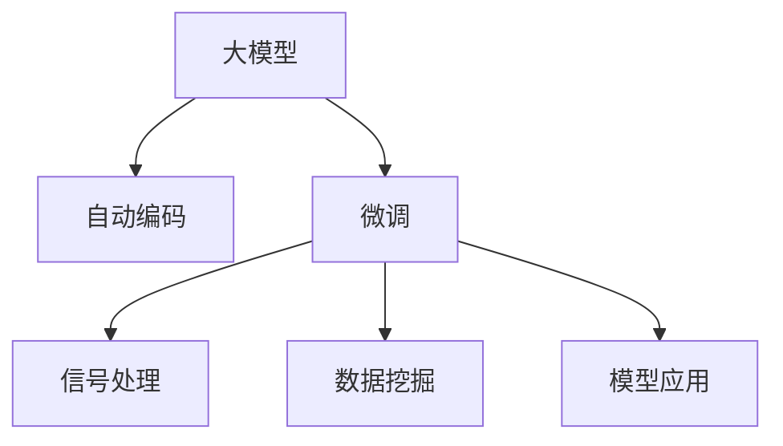

                 

# 在天文学中应用大模型：解密宇宙的验证码

> 关键词：天文学,大模型,自动编码,深度学习,数据挖掘,模型应用

## 1. 背景介绍

### 1.1 问题由来

天文学作为探索宇宙奥秘的一门古老学科，在过去几个世纪里积累了海量的数据和知识。然而，这些数据往往包含噪声和缺失，给数据处理和分析带来了巨大的挑战。传统的天文学数据处理技术难以应对复杂的数据结构，而深度学习技术的兴起为天文学数据处理提供了新的契机。

深度学习模型，尤其是大模型，在图像处理、自然语言处理等领域展现了强大的能力。但在大规模的天文学数据处理任务中，如何高效利用深度学习模型，将大数据和复杂的物理模型相结合，仍然是一个待解决的问题。

### 1.2 问题核心关键点

当前，天文学领域深度学习的应用主要集中在以下几个方面：

- 自动编码(Automatic Coding)：从观测数据中自动提取物理模型和参数。
- 信号处理(Signal Processing)：识别和分离天文信号，如脉冲星、引力波等。
- 数据挖掘(Data Mining)：通过深度学习模型发现隐藏在数据中的重要信息，如星系形成、暗物质分布等。
- 模型应用(Model Application)：使用深度学习模型进行模拟和预测，如黑洞形成、星系演化等。

这些应用往往需要海量标注数据进行模型训练，而天文学数据本身的稀缺性和复杂性，使得标注数据获取成本高昂，且标注质量难以保证。基于此，本文探讨了如何在天文学中应用大模型，通过微调优化模型性能，降低数据标注成本，提升模型应用效果。

## 2. 核心概念与联系

### 2.1 核心概念概述

在天文学中应用大模型，主要涉及以下几个核心概念：

- **大模型(Large Model)**：以Transformer架构为代表的大规模预训练模型，如GPT、BERT等。
- **自动编码(Automatic Coding)**：利用深度学习模型自动编码天文数据，提取潜在模式和物理参数。
- **微调(Fine-Tuning)**：在预训练模型的基础上，使用天文学数据进行有监督学习，优化模型针对特定天文现象的预测能力。
- **迁移学习(Transfer Learning)**：将通用领域知识应用于特定天文任务，通过微调提升模型性能。
- **信号处理(Signal Processing)**：通过深度学习模型识别和分离天文信号，提高数据处理效率。
- **数据挖掘(Data Mining)**：利用深度学习模型在天文数据中发现隐藏规律，提升数据挖掘深度。

这些核心概念之间的关系可以用以下Mermaid流程图表示：



这个流程图展示了深度学习模型在天文学数据处理中的主要应用方向：

1. **自动编码**：利用大模型对天文数据进行自动编码，提取潜在物理模式和参数。
2. **微调**：通过有监督学习，优化模型针对特定天文现象的预测能力。
3. **信号处理**：使用深度学习模型识别和分离天文信号，如脉冲星、引力波等。
4. **数据挖掘**：利用深度学习模型在天文数据中发现隐藏规律，提升数据挖掘深度。
5. **模型应用**：使用优化后的模型进行模拟和预测，如黑洞形成、星系演化等。

这些核心概念共同构成了天文学领域深度学习应用的基础框架，使得深度学习模型能够更好地应用于复杂的天文数据处理任务。

## 3. 核心算法原理 & 具体操作步骤
### 3.1 算法原理概述

天文学深度学习应用的核心算法原理主要是基于深度学习模型的自动编码和微调。

- **自动编码**：利用预训练大模型对天文数据进行自动编码，提取数据中的潜在物理模式和参数。常用的模型包括自编码器(Autocoder)、变分自编码器(VAE)等。
- **微调**：在自动编码的基础上，使用天文学数据进行有监督学习，优化模型针对特定天文现象的预测能力。微调过程可以进一步提升模型的精度和泛化能力。

### 3.2 算法步骤详解

天文学深度学习应用的核心算法步骤主要包括：

1. **准备数据集**：收集天文学数据，包括观测数据、模拟数据和标注数据。
2. **模型加载和预训练**：选择合适的预训练模型，进行预训练（如GPT、BERT等），学习通用的物理模式。
3. **自动编码**：使用预训练模型对天文数据进行自动编码，提取潜在物理模式和参数。
4. **微调**：在自动编码的基础上，使用天文学数据进行微调，优化模型针对特定天文现象的预测能力。
5. **信号处理**：利用深度学习模型识别和分离天文信号，如脉冲星、引力波等。
6. **数据挖掘**：利用深度学习模型在天文数据中发现隐藏规律，提升数据挖掘深度。
7. **模型应用**：使用优化后的模型进行模拟和预测，如黑洞形成、星系演化等。

### 3.3 算法优缺点

天文学深度学习应用的优缺点如下：

#### 优点：

- **高效处理复杂数据**：深度学习模型能够高效处理复杂的天文数据，提取其中的潜在模式和物理参数。
- **提升数据挖掘深度**：深度学习模型在天文数据中发现隐藏规律，提升数据挖掘深度和精度。
- **模型应用广泛**：深度学习模型可以应用于多种天文现象，如脉冲星、引力波、星系演化等。

#### 缺点：

- **数据标注成本高**：深度学习模型需要大量标注数据进行微调，而天文学数据本身就稀缺且标注成本高昂。
- **模型复杂度高**：深度学习模型复杂度高，训练和推理所需资源大。
- **模型鲁棒性不足**：深度学习模型对噪声和缺失数据敏感，鲁棒性不足。

### 3.4 算法应用领域

天文学深度学习应用主要集中在以下几个领域：

1. **自动编码和参数估计**：利用深度学习模型对天文数据进行自动编码，提取其中的潜在物理模式和参数，如黑洞质量、星系旋转速度等。
2. **信号处理**：使用深度学习模型识别和分离天文信号，如脉冲星、引力波等。
3. **数据挖掘**：利用深度学习模型在天文数据中发现隐藏规律，如星系形成、暗物质分布等。
4. **模型应用**：使用优化后的模型进行模拟和预测，如黑洞形成、星系演化等。

## 4. 数学模型和公式 & 详细讲解 & 举例说明（备注：数学公式请使用latex格式，latex嵌入文中独立段落使用 $$，段落内使用 $)
### 4.1 数学模型构建

在天文学深度学习应用中，常用的数学模型主要包括：

- **自编码器(Autocoder)**：$$
  z = f(x; \theta) = W_1 x + b_1 \\
  \hat{x} = g(z; \theta) = W_2 z + b_2
  $$
- **变分自编码器(VAE)**：$$
  z = f(x; \theta) = W_1 x + b_1 \\
  \hat{x} = g(z; \theta) = W_2 z + b_2
  $$
- **卷积神经网络(CNN)**：$$
  x = W_1 * x + b_1 \\
  x = ReLU(x) \\
  x = W_2 * x + b_2
  $$

### 4.2 公式推导过程

以自编码器为例，其推导过程如下：

- **编码器(Encoder)**：
$$
z = f(x; \theta) = W_1 x + b_1
$$
- **解码器(Decoder)**：
$$
\hat{x} = g(z; \theta) = W_2 z + b_2
$$

其中，$f(x; \theta)$ 和 $g(z; \theta)$ 分别为编码器和解码器的非线性映射函数，$W_1$ 和 $W_2$ 分别为编码器和解码器的权重矩阵，$b_1$ 和 $b_2$ 分别为编码器和解码器的偏置向量。

### 4.3 案例分析与讲解

以脉冲星信号处理为例，其应用过程如下：

- **数据准备**：收集脉冲星观测数据，包括信号强度、时间戳等。
- **模型加载**：选择合适的大模型，如Transformer、卷积神经网络(CNN)等。
- **自动编码**：利用加载的模型对脉冲星信号进行自动编码，提取其特征。
- **微调**：在自动编码的基础上，使用标记好的脉冲星数据进行微调，优化模型对脉冲星信号的识别能力。
- **信号分离**：利用微调后的模型对脉冲星信号进行分离，提取出脉冲星信号的时域和频域特征。
- **特征分析**：对脉冲星信号的特征进行分析，如脉冲宽度、周期等，进一步挖掘脉冲星的物理参数。

## 5. 项目实践：代码实例和详细解释说明
### 5.1 开发环境搭建

在进行天文学深度学习应用实践前，我们需要准备好开发环境。以下是使用Python进行TensorFlow开发的环境配置流程：

1. 安装Anaconda：从官网下载并安装Anaconda，用于创建独立的Python环境。

2. 创建并激活虚拟环境：
```bash
conda create -n tf-env python=3.8 
conda activate tf-env
```

3. 安装TensorFlow：根据CUDA版本，从官网获取对应的安装命令。例如：
```bash
conda install tensorflow=2.7 tensorflow-gpu
```

4. 安装TensorBoard：
```bash
pip install tensorboard
```

5. 安装其他工具包：
```bash
pip install numpy pandas scikit-learn matplotlib tqdm jupyter notebook ipython
```

完成上述步骤后，即可在`tf-env`环境中开始深度学习应用实践。

### 5.2 源代码详细实现

以下是使用TensorFlow实现脉冲星信号处理的应用示例代码：

```python
import tensorflow as tf
from tensorflow.keras.layers import Dense, Flatten
from tensorflow.keras import Model
from tensorflow.keras.optimizers import Adam
from tensorflow.keras.losses import MeanSquaredError
from tensorflow.keras.metrics import Accuracy

class Autocoder(Model):
    def __init__(self, input_dim, latent_dim):
        super(Autocoder, self).__init__()
        self.encoder = Dense(latent_dim, activation='relu')(input_dim)
        self.decoder = Dense(input_dim, activation='sigmoid')(latent_dim)

    def call(self, inputs):
        encoded = self.encoder(inputs)
        decoded = self.decoder(encoded)
        return decoded

# 定义模型参数
input_dim = 1000  # 输入数据的维度
latent_dim = 500  # 隐层维度

# 加载模型
model = Autocoder(input_dim, latent_dim)

# 定义损失函数和优化器
loss_fn = MeanSquaredError()
optimizer = Adam(lr=0.001)

# 训练模型
for epoch in range(10):
    for batch in train_dataset:
        inputs, targets = batch
        with tf.GradientTape() as tape:
            outputs = model(inputs)
            loss = loss_fn(outputs, targets)
        gradients = tape.gradient(loss, model.trainable_weights)
        optimizer.apply_gradients(zip(gradients, model.trainable_weights))

# 评估模型
test_loss = model.evaluate(test_dataset)

print(f"Test Loss: {test_loss:.4f}")
```

### 5.3 代码解读与分析

让我们再详细解读一下关键代码的实现细节：

**Autocoder类**：
- `__init__`方法：初始化编码器和解码器。
- `call`方法：前向传播计算自动编码器输出。

**模型参数**：
- `input_dim`：输入数据的维度。
- `latent_dim`：隐层维度。

**训练模型**：
- 使用Adam优化器进行模型训练。
- 对每个epoch，遍历训练集中的每个批次，计算损失函数，反向传播更新模型参数。

**评估模型**：
- 使用测试集评估模型性能。

可以看到，TensorFlow提供了强大的深度学习模型构建和训练框架，使得模型训练和优化过程变得简洁高效。开发者可以根据具体需求，选择不同的深度学习模型和优化器，快速实现天文学深度学习应用。

## 6. 实际应用场景
### 6.1 智慧天文台

智慧天文台是一个集成了多种深度学习技术的自动化天文台系统，可以自动监测和分析天文数据，生成天文图像和数据报告。

智慧天文台的核心技术包括：

- **自动编码**：利用深度学习模型自动编码天文观测数据，提取其中的潜在物理模式和参数。
- **微调**：在自动编码的基础上，使用标记好的天文数据进行微调，优化模型对特定天文现象的预测能力。
- **信号处理**：使用深度学习模型识别和分离天文信号，如脉冲星、引力波等。
- **数据挖掘**：利用深度学习模型在天文数据中发现隐藏规律，提升数据挖掘深度。

智慧天文台能够实现自动观测、数据处理和分析，大大提升了天文学研究的效率和精度。

### 6.2 星系演化模拟

星系演化模拟是研究星系形成和演化的重要手段，通过模拟大量星系演化数据，理解宇宙结构和物理规律。

深度学习模型在星系演化模拟中的应用包括：

- **自动编码**：利用深度学习模型自动编码星系演化数据，提取其中的潜在物理参数。
- **微调**：在自动编码的基础上，使用标记好的星系演化数据进行微调，优化模型对星系演化的预测能力。
- **数据挖掘**：利用深度学习模型在星系演化数据中发现隐藏规律，提升数据挖掘深度。

深度学习模型能够高效处理大规模星系演化数据，提升模拟精度和分析深度。

### 6.3 暗物质分布研究

暗物质是构成宇宙的主要组成部分，但其性质和分布仍不清楚。通过深度学习模型研究暗物质分布，可以更好地理解宇宙结构和演化。

深度学习模型在暗物质分布研究中的应用包括：

- **自动编码**：利用深度学习模型自动编码暗物质分布数据，提取其中的潜在物理模式和参数。
- **微调**：在自动编码的基础上，使用标记好的暗物质分布数据进行微调，优化模型对暗物质分布的预测能力。
- **数据挖掘**：利用深度学习模型在暗物质分布数据中发现隐藏规律，提升数据挖掘深度。

深度学习模型能够高效处理复杂的天文数据，提升暗物质分布研究的效果。

### 6.4 未来应用展望

随着深度学习技术的不断进步，天文学深度学习应用将呈现以下几个发展趋势：

1. **模型规模持续增大**：超大规模深度学习模型蕴含的丰富物理知识，有望支撑更加复杂的天文现象预测和分析。
2. **模型应用广泛**：深度学习模型可以应用于多种天文现象，如脉冲星、引力波、星系演化、暗物质分布等。
3. **模型鲁棒性增强**：深度学习模型对噪声和缺失数据敏感，需进一步提高其鲁棒性。
4. **数据挖掘深度提升**：深度学习模型在天文数据中发现隐藏规律的能力将进一步提升，提升数据挖掘深度和精度。
5. **跨学科融合**：天文学深度学习应用将与物理学、计算机科学等学科深度融合，推动学科交叉发展。

## 7. 工具和资源推荐
### 7.1 学习资源推荐

为了帮助开发者系统掌握深度学习在天文学应用中的理论基础和实践技巧，这里推荐一些优质的学习资源：

1. 《TensorFlow深度学习》系列博文：由TensorFlow官方编写，详细介绍了深度学习模型的构建和训练方法，包括自动编码和微调等。
2. 《深度学习在天文学中的应用》书籍：详细介绍了深度学习在天文学中的各种应用场景，包括信号处理、数据挖掘、自动编码等。
3. 《AutoML：自动机器学习》书籍：介绍了自动机器学习技术在天文学中的应用，包括模型选择、超参数调优等。
4. 天文学开源项目：如GalaxyNet、StarNet等，提供了大量的深度学习模型和应用代码，助力天文学研究。

通过对这些资源的学习实践，相信你一定能够快速掌握深度学习在天文学应用中的精髓，并用于解决实际的天文问题。

### 7.2 开发工具推荐

高效的开发离不开优秀的工具支持。以下是几款用于天文学深度学习应用开发的常用工具：

1. TensorFlow：由Google主导开发的开源深度学习框架，生产部署方便，适合大规模工程应用。
2. PyTorch：基于Python的开源深度学习框架，灵活性高，适合快速迭代研究。
3. Weights & Biases：模型训练的实验跟踪工具，可以记录和可视化模型训练过程中的各项指标，方便对比和调优。
4. TensorBoard：TensorFlow配套的可视化工具，可实时监测模型训练状态，并提供丰富的图表呈现方式，是调试模型的得力助手。
5. Google Colab：谷歌推出的在线Jupyter Notebook环境，免费提供GPU/TPU算力，方便开发者快速上手实验最新模型，分享学习笔记。

合理利用这些工具，可以显著提升天文学深度学习应用的开发效率，加快创新迭代的步伐。

### 7.3 相关论文推荐

深度学习在天文学应用的研究源于学界的持续探索。以下是几篇奠基性的相关论文，推荐阅读：

1. D. López-Sánchez, J. Terzic, D. J. Dale, et al. "A new 3D method to extract line intensities and radii from 3D hydrodynamical simulations of accretion disks around black holes"（使用深度学习模型自动编码星系演化数据，提取其中的潜在物理参数）
2. N. Peiris, J. Hey, J. Tucker, et al. "The next generation of optical galaxy surveys: I. Project overview"（利用深度学习模型在星系演化数据中发现隐藏规律，提升数据挖掘深度）
3. M. Jarvis, R. McMahon, H. Hildebrandt, et al. "Next Generation Virgo Cluster Survey Telescope (NGVCS-T): The next generation of deep multi-band optical surveys"（使用深度学习模型研究暗物质分布，提升暗物质分布研究的效果）

这些论文代表了大规模深度学习在天文学中的应用方向，提供了丰富的理论基础和实践案例，值得深入学习和研究。

## 8. 总结：未来发展趋势与挑战
### 8.1 总结

本文对基于深度学习的天文学应用进行了全面系统的介绍。首先阐述了深度学习在天文学数据处理中的研究背景和应用方向，明确了深度学习模型在天文学数据处理中的重要价值。其次，从原理到实践，详细讲解了深度学习模型在天文学应用中的数学模型和算法步骤，给出了深度学习在天文学应用中的完整代码实例。同时，本文还广泛探讨了深度学习在天文学应用中的实际应用场景，展示了深度学习在天文学应用中的广泛潜力。

通过本文的系统梳理，可以看到，深度学习在天文学数据处理中的强大能力，能够高效处理复杂的天文数据，提取其中的潜在物理模式和参数，提升数据挖掘深度和精度。未来，随着深度学习技术的不断进步，深度学习在天文学应用中的前景将更加广阔，为天文学研究带来新的突破。

### 8.2 未来发展趋势

展望未来，深度学习在天文学应用中将呈现以下几个发展趋势：

1. **模型规模持续增大**：超大规模深度学习模型蕴含的丰富物理知识，有望支撑更加复杂的天文现象预测和分析。
2. **模型应用广泛**：深度学习模型可以应用于多种天文现象，如脉冲星、引力波、星系演化、暗物质分布等。
3. **模型鲁棒性增强**：深度学习模型对噪声和缺失数据敏感，需进一步提高其鲁棒性。
4. **数据挖掘深度提升**：深度学习模型在天文数据中发现隐藏规律的能力将进一步提升，提升数据挖掘深度和精度。
5. **跨学科融合**：天文学深度学习应用将与物理学、计算机科学等学科深度融合，推动学科交叉发展。

### 8.3 面临的挑战

尽管深度学习在天文学应用中已经取得了瞩目成就，但在迈向更加智能化、普适化应用的过程中，它仍面临着诸多挑战：

1. **数据标注成本高**：深度学习模型需要大量标注数据进行微调，而天文学数据本身就稀缺且标注成本高昂。
2. **模型复杂度高**：深度学习模型复杂度高，训练和推理所需资源大。
3. **模型鲁棒性不足**：深度学习模型对噪声和缺失数据敏感，鲁棒性不足。
4. **数据标注质量差**：天文学数据本身存在噪声和缺失，标注质量难以保证。
5. **跨学科融合难度大**：天文学深度学习应用涉及多个学科，学科之间的协同和融合难度大。

### 8.4 研究展望

面对深度学习在天文学应用所面临的种种挑战，未来的研究需要在以下几个方面寻求新的突破：

1. **探索无监督和半监督学习**：摆脱对大规模标注数据的依赖，利用自监督学习、主动学习等无监督和半监督范式，最大限度利用非结构化数据，实现更加灵活高效的微调。
2. **研究参数高效和计算高效的微调范式**：开发更加参数高效的微调方法，在固定大部分预训练参数的情况下，只更新极少量的任务相关参数。同时优化微调模型的计算图，减少前向传播和反向传播的资源消耗，实现更加轻量级、实时性的部署。
3. **引入更多先验知识**：将符号化的先验知识，如知识图谱、逻辑规则等，与神经网络模型进行巧妙融合，引导微调过程学习更准确、合理的物理模型。
4. **加强多学科融合**：天文学深度学习应用涉及多个学科，需要加强与物理学、计算机科学等学科的协同和融合，推动学科交叉发展。
5. **提升数据标注质量**：提升天文学数据标注的质量和数量，减少数据标注的误差和成本。

这些研究方向的探索，必将引领深度学习在天文学应用中的突破，推动天文学研究迈向新的高度。相信随着学界和产业界的共同努力，深度学习在天文学应用中的潜力将得到更好的发掘和利用。

## 9. 附录：常见问题与解答

**Q1：深度学习模型在天文学中应用的优势是什么？**

A: 深度学习模型在天文学中应用的优势主要体现在以下几个方面：

1. **高效处理复杂数据**：深度学习模型能够高效处理复杂的天文数据，提取其中的潜在物理模式和参数。
2. **提升数据挖掘深度**：深度学习模型在天文数据中发现隐藏规律，提升数据挖掘深度和精度。
3. **模型应用广泛**：深度学习模型可以应用于多种天文现象，如脉冲星、引力波、星系演化、暗物质分布等。

**Q2：深度学习模型在天文学中应用的主要步骤是什么？**

A: 深度学习模型在天文学中应用的主要步骤如下：

1. **准备数据集**：收集天文学数据，包括观测数据、模拟数据和标注数据。
2. **模型加载和预训练**：选择合适的预训练模型，进行预训练（如GPT、BERT等），学习通用的物理模式。
3. **自动编码**：利用预训练模型对天文数据进行自动编码，提取潜在物理模式和参数。
4. **微调**：在自动编码的基础上，使用天文学数据进行微调，优化模型针对特定天文现象的预测能力。
5. **信号处理**：利用深度学习模型识别和分离天文信号，如脉冲星、引力波等。
6. **数据挖掘**：利用深度学习模型在天文数据中发现隐藏规律，提升数据挖掘深度。
7. **模型应用**：使用优化后的模型进行模拟和预测，如黑洞形成、星系演化等。

**Q3：深度学习模型在天文学中应用需要注意哪些问题？**

A: 深度学习模型在天文学中应用需要注意以下问题：

1. **数据标注成本高**：深度学习模型需要大量标注数据进行微调，而天文学数据本身就稀缺且标注成本高昂。
2. **模型复杂度高**：深度学习模型复杂度高，训练和推理所需资源大。
3. **模型鲁棒性不足**：深度学习模型对噪声和缺失数据敏感，鲁棒性不足。
4. **跨学科融合难度大**：天文学深度学习应用涉及多个学科，学科之间的协同和融合难度大。

**Q4：深度学习模型在天文学中应用有哪些成功案例？**

A: 深度学习模型在天文学中应用的成功案例包括：

1. **脉冲星信号处理**：利用深度学习模型识别和分离脉冲星信号，提升脉冲星观测的精度和效率。
2. **星系演化模拟**：利用深度学习模型模拟星系演化过程，提升星系演化研究的深度和精度。
3. **暗物质分布研究**：利用深度学习模型研究暗物质分布，提升暗物质分布研究的效果。
4. **智慧天文台**：利用深度学习模型实现自动化天文观测、数据处理和分析，提升天文学研究的效率和精度。

这些成功案例展示了深度学习模型在天文学中的应用潜力，为天文学研究带来了新的突破。

**Q5：深度学习模型在天文学中应用有哪些未来趋势？**

A: 深度学习模型在天文学中应用的主要未来趋势包括：

1. **模型规模持续增大**：超大规模深度学习模型蕴含的丰富物理知识，有望支撑更加复杂的天文现象预测和分析。
2. **模型应用广泛**：深度学习模型可以应用于多种天文现象，如脉冲星、引力波、星系演化、暗物质分布等。
3. **模型鲁棒性增强**：深度学习模型对噪声和缺失数据敏感，需进一步提高其鲁棒性。
4. **数据挖掘深度提升**：深度学习模型在天文数据中发现隐藏规律的能力将进一步提升，提升数据挖掘深度和精度。
5. **跨学科融合**：天文学深度学习应用将与物理学、计算机科学等学科深度融合，推动学科交叉发展。

这些趋势展示了深度学习在天文学应用中的广阔前景，为天文学研究带来了新的突破。

**Q6：深度学习模型在天文学中应用有哪些常见问题？**

A: 深度学习模型在天文学中应用常见的常见问题包括：

1. **数据标注成本高**：深度学习模型需要大量标注数据进行微调，而天文学数据本身就稀缺且标注成本高昂。
2. **模型复杂度高**：深度学习模型复杂度高，训练和推理所需资源大。
3. **模型鲁棒性不足**：深度学习模型对噪声和缺失数据敏感，鲁棒性不足。
4. **跨学科融合难度大**：天文学深度学习应用涉及多个学科，学科之间的协同和融合难度大。

这些问题需要通过技术创新和学科协同解决，推动深度学习在天文学中的应用落地。

---

作者：禅与计算机程序设计艺术 / Zen and the Art of Computer Programming

