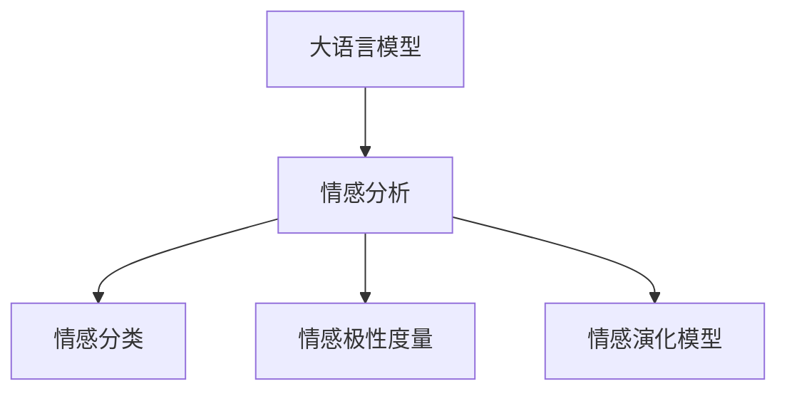

                 

## 1. 背景介绍

### 1.1 问题由来

人类情感复杂而多变，是心理分析研究的重要领域。传统的心理分析方法依赖于经验丰富的心理咨询师，需要大量的手动分析和数据积累。近年来，随着人工智能技术的飞速发展，大语言模型（LLM）在理解和分析人类情感方面展现出了巨大潜力。

大语言模型通过自回归（如GPT）或自编码（如BERT）架构，在庞大的无标签文本语料上进行预训练，学习到丰富的语言知识和上下文理解能力。在应用领域，LLM已经展示出了在情感分析、语言生成、文本摘要等方面的优异表现。

### 1.2 问题核心关键点

应用大语言模型进行心理分析，核心在于利用其强大的自然语言处理能力，自动抽取和理解文本数据中的情感信息。具体来说，可以通过以下步骤：

1. **情感分类**：将文本情感分类为正面、负面或中性。
2. **情感极性度量**：量化文本的情感强度和情绪波动。
3. **情感识别与跟踪**：识别文本中的特定情绪（如愤怒、恐惧、焦虑等），并跟踪其变化趋势。
4. **情感对话**：基于对话数据，自动生成情感支持或干预对话。
5. **情感演化模型**：构建基于时间序列的情感演化模型，预测未来情感状态。

通过这些技术，可以显著提升心理分析的效率和准确性，为心理咨询、情感干预等领域带来革命性的变革。

### 1.3 问题研究意义

将大语言模型应用于心理分析，具有以下重要意义：

1. **提升效率**：自动化的情感分析能够显著降低心理咨询师的负担，提高工作效率。
2. **增强准确性**：基于深度学习的情感分析方法通常能够发现人类难以察觉的细微情感变化。
3. **降低成本**：相较于手动分析，自动化的情感分析成本更低，可以应用于大规模数据集。
4. **支持个性化**：通过情感分析，可以为个体提供量身定制的心理健康支持。
5. **推动普及**：自动化技术的应用可以使心理分析更加普及，覆盖更多人群，特别是医疗资源稀缺的地区。

## 2. 核心概念与联系

### 2.1 核心概念概述

为更好地理解基于大语言模型的心理分析方法，本节将介绍几个关键概念：

- **大语言模型（LLM）**：通过自回归或自编码架构，在大规模无标签文本语料上进行预训练，学习语言和上下文表示的语言模型。
- **情感分析（Sentiment Analysis）**：通过自然语言处理技术，识别和提取文本中的情感信息，对文本情感进行分类和极性度量。
- **情感分类（Sentiment Classification）**：将文本分为正面、负面或中性情感类别。
- **情感极性度量（Sentiment Intensity Measurement）**：量化文本的情感强度和情绪波动。
- **情感演化模型（Sentiment Evolution Model）**：通过时间序列分析，预测未来情感状态的变化趋势。

这些核心概念之间存在紧密的联系，共同构成了应用大语言模型进行心理分析的理论基础。

### 2.2 核心概念原理和架构的 Mermaid 流程图



这个流程图展示了从大语言模型到情感分析的流程：大语言模型通过预训练学习语言表示，然后通过情感分析技术，进一步对情感进行分类、极性度量和演化建模。

## 3. 核心算法原理 & 具体操作步骤

### 3.1 算法原理概述

基于大语言模型的心理分析，通常采用监督学习的方法，通过标注情感数据的训练集，训练模型对文本情感进行分类、极性度量和演化建模。具体算法流程如下：

1. **数据准备**：收集和标注包含情感信息的数据集，分为训练集、验证集和测试集。
2. **模型构建**：选择合适的预训练模型（如BERT、GPT等），并添加情感分类、极性度量和演化建模等任务适配层。
3. **参数微调**：使用监督学习算法（如交叉熵损失、均方误差等），在标注数据上微调模型参数，提升情感分析性能。
4. **结果评估**：在测试集上评估模型性能，使用准确率、召回率、F1值等指标进行量化。
5. **应用部署**：将训练好的模型集成到实际应用中，如心理咨询系统、情感支持应用等。

### 3.2 算法步骤详解

下面详细介绍每个步骤的详细操作：

#### 3.2.1 数据准备

数据准备是情感分析的第一步，涉及数据的收集、清洗和标注。以下是主要步骤：

1. **数据收集**：
   - **公开数据集**：利用公开的情感数据集，如IMDB电影评论数据集、Twitter情感数据集等。
   - **自定义数据集**：收集特定场景下的情感数据，如心理咨询会话、社交媒体评论等。

2. **数据清洗**：
   - **去除噪声**：移除无关信息，如特殊字符、标点符号等。
   - **标准化格式**：统一文本格式，如将所有文本转换为小写，去除停用词等。
   - **分词处理**：利用分词工具将文本分割成词语或子词，便于模型处理。

3. **数据标注**：
   - **情感分类**：为每个文本标记情感类别（如正面、负面、中性）。
   - **情感极性度量**：量化每个文本的情感强度和情绪波动。
   - **情感演化模型**：构建文本序列，标注每个时间点的情感状态。

#### 3.2.2 模型构建

选择合适的预训练模型和任务适配层是情感分析的关键：

1. **预训练模型**：
   - **BERT**：适用于文本分类和极性度量任务。
   - **GPT**：适用于文本生成和对话任务。
   - **RoBERTa**：适用于文本分类和演化建模任务。

2. **任务适配层**：
   - **情感分类**：在顶层添加线性分类器和交叉熵损失函数。
   - **情感极性度量**：使用语言模型解码器输出概率分布，以负对数似然为损失函数。
   - **情感演化模型**：引入时间序列数据，利用循环神经网络（RNN）或长短期记忆网络（LSTM）进行建模。

#### 3.2.3 参数微调

参数微调是提升模型性能的关键步骤：

1. **选择优化器**：常用的优化器包括AdamW、SGD等，设置学习率、批大小、迭代轮数等超参数。
2. **损失函数**：根据任务类型选择合适的损失函数，如交叉熵损失、均方误差等。
3. **正则化技术**：引入L2正则、Dropout、Early Stopping等技术，防止过拟合。
4. **迭代训练**：在标注数据上迭代训练模型，直至收敛。
5. **模型评估**：在验证集上评估模型性能，调整超参数。

#### 3.2.4 结果评估

模型评估是检验情感分析效果的重要步骤：

1. **准确率（Accuracy）**：评估模型分类情感的正确率。
2. **召回率（Recall）**：评估模型对正面或负面情感的识别能力。
3. **F1值**：综合考虑准确率和召回率，评估模型的整体性能。

#### 3.2.5 应用部署

应用部署是将训练好的模型集成到实际应用中的关键步骤：

1. **API接口**：将模型封装为API接口，便于系统调用。
2. **系统集成**：将API接口集成到心理咨询系统、情感支持应用中。
3. **用户交互**：设计用户友好的界面，引导用户输入文本，获取情感分析结果。

### 3.3 算法优缺点

基于大语言模型的心理分析方法具有以下优点：

1. **效率高**：自动化的情感分析可以显著降低心理咨询师的负担，提高工作效率。
2. **精度高**：基于深度学习的情感分析方法通常能够发现细微情感变化。
3. **可扩展**：适用于大规模数据集，可以轻松应对海量文本数据。

同时，该方法也存在一些缺点：

1. **数据依赖**：情感分析的准确性依赖于标注数据的质量和数量。
2. **过拟合风险**：在标注数据不足的情况下，模型容易过拟合。
3. **泛化能力**：不同领域、不同场景的数据集可能导致模型泛化能力不足。
4. **解释性不足**：自动化的情感分析缺乏可解释性，难以理解其内部工作机制。

尽管存在这些局限性，但基于大语言模型的心理分析方法在效率和精度方面仍具有显著优势，是大规模情感分析的理想选择。

### 3.4 算法应用领域

大语言模型在心理分析中的应用领域广泛，包括但不限于：

1. **心理咨询**：自动情感分析可以辅助心理咨询师快速识别患者的情感状态，提供个性化心理支持。
2. **情感干预**：通过情感演化模型，预测患者的情感变化趋势，提前干预，防止心理问题的恶化。
3. **社交媒体情感分析**：分析社交媒体上的用户情感，识别负面言论，进行情感引导。
4. **医疗健康**：监测患者情感变化，辅助医生进行心理健康诊断和治疗。
5. **客户服务**：分析客户情感，提升客户满意度，改善服务质量。

## 4. 数学模型和公式 & 详细讲解 & 举例说明

### 4.1 数学模型构建

在情感分析中，通常采用监督学习的方法，构建情感分类模型。以下是一个基本的情感分类模型：

设模型输入为文本 $x$，输出为情感类别 $y \in \{正面, 负面, 中性\}$，模型参数为 $\theta$，则情感分类模型的目标是最小化损失函数 $\mathcal{L}(\theta)$，使得模型输出的概率分布与真实标签 $y$ 尽可能接近。常用的损失函数为交叉熵损失：

$$
\mathcal{L}(\theta) = -\frac{1}{N}\sum_{i=1}^N y_i \log P_\theta(y_i|x_i)
$$

其中 $P_\theta(y_i|x_i)$ 为模型在输入 $x_i$ 下预测情感类别 $y_i$ 的概率分布，通常使用softmax函数进行归一化：

$$
P_\theta(y_i|x_i) = \frac{\exp(z_{y_i}(x_i))}{\sum_{j=1}^K \exp(z_j(x_i))}
$$

其中 $z_j(x_i) = W_j^\top \tanh(A_jx_i + b_j)$ 为模型的线性变换和激活函数。

### 4.2 公式推导过程

以情感分类为例，推导交叉熵损失函数及其梯度计算公式。

设模型输入为文本 $x_i$，输出为情感类别 $y_i \in \{正面, 负面, 中性\}$，模型参数为 $\theta$。则情感分类模型的输出概率为：

$$
P_\theta(y_i|x_i) = \frac{\exp(z_{y_i}(x_i))}{\sum_{j=1}^K \exp(z_j(x_i))}
$$

其中 $z_j(x_i) = W_j^\top \tanh(A_jx_i + b_j)$。

交叉熵损失函数为：

$$
\mathcal{L}(\theta) = -\frac{1}{N}\sum_{i=1}^N y_i \log P_\theta(y_i|x_i)
$$

对于单个样本 $(x_i, y_i)$，交叉熵损失为：

$$
\mathcal{L}(\theta; x_i, y_i) = -y_i \log P_\theta(y_i|x_i)
$$

根据链式法则，损失函数对模型参数 $\theta$ 的梯度为：

$$
\frac{\partial \mathcal{L}(\theta)}{\partial \theta} = -\frac{1}{N}\sum_{i=1}^N \frac{\partial \mathcal{L}(\theta; x_i, y_i)}{\partial \theta}
$$

对于单个样本 $(x_i, y_i)$，梯度为：

$$
\frac{\partial \mathcal{L}(\theta; x_i, y_i)}{\partial \theta} = -y_i \frac{\partial \log P_\theta(y_i|x_i)}{\partial \theta} = -y_i \frac{P_{\theta}(\neg y_i|x_i)}{P_{\theta}(y_i|x_i)}
$$

### 4.3 案例分析与讲解

以BERT模型为例，分析其在大规模情感分析中的表现。BERT模型使用Transformer结构，在大规模无标签文本数据上进行预训练，学习到丰富的语言知识。通过在顶部添加情感分类器，可以利用预训练的上下文表示，提高情感分类的准确性。

在情感分类任务中，BERT模型通常使用线性分类器作为情感分类器。模型的输出层为一个全连接层，参数为 $W \in \mathbb{R}^{K \times D}$，$b \in \mathbb{R}^K$，其中 $K$ 为情感类别数，$D$ 为BERT模型的隐藏层维度。模型的损失函数为交叉熵损失：

$$
\mathcal{L}(\theta) = -\frac{1}{N}\sum_{i=1}^N y_i \log \frac{\exp(z_y(x_i))}{\sum_{j=1}^K \exp(z_j(x_i))}
$$

其中 $z_j(x_i) = W_j^\top [CLS]$ 为BERT模型的最后一层输出，$[CLS]$ 为BERT模型的CLS token的表示。

## 5. 项目实践：代码实例和详细解释说明

### 5.1 开发环境搭建

在进行情感分析项目实践前，需要准备好开发环境。以下是使用Python进行PyTorch开发的环境配置流程：

1. 安装Anaconda：从官网下载并安装Anaconda，用于创建独立的Python环境。

2. 创建并激活虚拟环境：
```bash
conda create -n pytorch-env python=3.8 
conda activate pytorch-env
```

3. 安装PyTorch：根据CUDA版本，从官网获取对应的安装命令。例如：
```bash
conda install pytorch torchvision torchaudio cudatoolkit=11.1 -c pytorch -c conda-forge
```

4. 安装Transformers库：
```bash
pip install transformers
```

5. 安装各类工具包：
```bash
pip install numpy pandas scikit-learn matplotlib tqdm jupyter notebook ipython
```

完成上述步骤后，即可在`pytorch-env`环境中开始情感分析实践。

### 5.2 源代码详细实现

下面以情感分类任务为例，给出使用Transformers库对BERT模型进行情感分类的PyTorch代码实现。

首先，定义情感分类任务的数据处理函数：

```python
from transformers import BertTokenizer
from torch.utils.data import Dataset
import torch

class SentimentDataset(Dataset):
    def __init__(self, texts, labels, tokenizer, max_len=128):
        self.texts = texts
        self.labels = labels
        self.tokenizer = tokenizer
        self.max_len = max_len
        
    def __len__(self):
        return len(self.texts)
    
    def __getitem__(self, item):
        text = self.texts[item]
        label = self.labels[item]
        
        encoding = self.tokenizer(text, return_tensors='pt', max_length=self.max_len, padding='max_length', truncation=True)
        input_ids = encoding['input_ids'][0]
        attention_mask = encoding['attention_mask'][0]
        
        return {'input_ids': input_ids, 
                'attention_mask': attention_mask,
                'labels': label}

# 标签与id的映射
label2id = {'正面': 1, '负面': 0, '中性': 2}
id2label = {v: k for k, v in label2id.items()}

# 创建dataset
tokenizer = BertTokenizer.from_pretrained('bert-base-uncased')

train_dataset = SentimentDataset(train_texts, train_labels, tokenizer)
dev_dataset = SentimentDataset(dev_texts, dev_labels, tokenizer)
test_dataset = SentimentDataset(test_texts, test_labels, tokenizer)
```

然后，定义模型和优化器：

```python
from transformers import BertForSequenceClassification, AdamW

model = BertForSequenceClassification.from_pretrained('bert-base-uncased', num_labels=3)

optimizer = AdamW(model.parameters(), lr=2e-5)
```

接着，定义训练和评估函数：

```python
from torch.utils.data import DataLoader
from tqdm import tqdm
from sklearn.metrics import classification_report

device = torch.device('cuda') if torch.cuda.is_available() else torch.device('cpu')
model.to(device)

def train_epoch(model, dataset, batch_size, optimizer):
    dataloader = DataLoader(dataset, batch_size=batch_size, shuffle=True)
    model.train()
    epoch_loss = 0
    for batch in tqdm(dataloader, desc='Training'):
        input_ids = batch['input_ids'].to(device)
        attention_mask = batch['attention_mask'].to(device)
        labels = batch['labels'].to(device)
        model.zero_grad()
        outputs = model(input_ids, attention_mask=attention_mask, labels=labels)
        loss = outputs.loss
        epoch_loss += loss.item()
        loss.backward()
        optimizer.step()
    return epoch_loss / len(dataloader)

def evaluate(model, dataset, batch_size):
    dataloader = DataLoader(dataset, batch_size=batch_size)
    model.eval()
    preds, labels = [], []
    with torch.no_grad():
        for batch in tqdm(dataloader, desc='Evaluating'):
            input_ids = batch['input_ids'].to(device)
            attention_mask = batch['attention_mask'].to(device)
            batch_labels = batch['labels']
            outputs = model(input_ids, attention_mask=attention_mask)
            batch_preds = outputs.logits.argmax(dim=2).to('cpu').tolist()
            batch_labels = batch_labels.to('cpu').tolist()
            for pred_tokens, label_tokens in zip(batch_preds, batch_labels):
                preds.append(pred_tokens[:len(label_tokens)])
                labels.append(label_tokens)
                
    print(classification_report(labels, preds))
```

最后，启动训练流程并在测试集上评估：

```python
epochs = 5
batch_size = 16

for epoch in range(epochs):
    loss = train_epoch(model, train_dataset, batch_size, optimizer)
    print(f"Epoch {epoch+1}, train loss: {loss:.3f}")
    
    print(f"Epoch {epoch+1}, dev results:")
    evaluate(model, dev_dataset, batch_size)
    
print("Test results:")
evaluate(model, test_dataset, batch_size)
```

以上就是使用PyTorch对BERT进行情感分类任务开发的完整代码实现。可以看到，得益于Transformers库的强大封装，我们可以用相对简洁的代码完成BERT模型的加载和微调。

### 5.3 代码解读与分析

让我们再详细解读一下关键代码的实现细节：

**SentimentDataset类**：
- `__init__`方法：初始化文本、标签、分词器等关键组件。
- `__len__`方法：返回数据集的样本数量。
- `__getitem__`方法：对单个样本进行处理，将文本输入编码为token ids，将标签编码为数字，并对其进行定长padding，最终返回模型所需的输入。

**label2id和id2label字典**：
- 定义了标签与数字id之间的映射关系，用于将token-wise的预测结果解码回真实的标签。

**训练和评估函数**：
- 使用PyTorch的DataLoader对数据集进行批次化加载，供模型训练和推理使用。
- 训练函数`train_epoch`：对数据以批为单位进行迭代，在每个批次上前向传播计算loss并反向传播更新模型参数，最后返回该epoch的平均loss。
- 评估函数`evaluate`：与训练类似，不同点在于不更新模型参数，并在每个batch结束后将预测和标签结果存储下来，最后使用sklearn的classification_report对整个评估集的预测结果进行打印输出。

**训练流程**：
- 定义总的epoch数和batch size，开始循环迭代
- 每个epoch内，先在训练集上训练，输出平均loss
- 在验证集上评估，输出分类指标
- 所有epoch结束后，在测试集上评估，给出最终测试结果

可以看到，PyTorch配合Transformers库使得BERT微调的代码实现变得简洁高效。开发者可以将更多精力放在数据处理、模型改进等高层逻辑上，而不必过多关注底层的实现细节。

当然，工业级的系统实现还需考虑更多因素，如模型的保存和部署、超参数的自动搜索、更灵活的任务适配层等。但核心的微调范式基本与此类似。

## 6. 实际应用场景

### 6.1 智能心理咨询系统

智能心理咨询系统可以广泛应用基于大语言模型的情感分析技术。传统心理咨询依赖心理咨询师进行面对面的情感交流，效率低下，资源浪费。而使用情感分析技术，可以快速自动识别用户的情感状态，并提供初步的情感支持。

在技术实现上，可以收集用户输入的文本，使用情感分析模型识别情感类别和情感强度，进而生成相应的情感支持回答。对于复杂情感问题，可以将情感分析结果反馈给心理咨询师，辅助其进行更细致的分析和干预。

### 6.2 情感引导和干预

情感引导和干预是情感分析在心理健康领域的重要应用。通过情感演化模型，可以预测用户的情感变化趋势，及时进行干预，防止心理问题的恶化。

在技术实现上，可以利用情感演化模型对用户的情感状态进行实时监控，一旦发现情绪波动较大，立即触发情感引导干预机制。如通过语音、文字等方式，提供情感支持、引导放松、建议就医等干预措施。

### 6.3 社交媒体情感分析

社交媒体情感分析可以识别和分析用户在社交媒体上的情感状态，帮助企业或政府了解公众情绪，进行舆情监测和引导。

在技术实现上，可以抓取社交媒体上的用户评论、帖子等文本数据，使用情感分析模型识别情感状态，统计情感极性，生成情感分析报告。对于负面言论，及时进行干预和引导，避免情绪的扩散和恶化。

### 6.4 医疗健康情感监测

医疗健康情感监测可以帮助医生了解患者的情绪状态，辅助诊断和治疗。

在技术实现上，可以收集患者的医疗记录、诊断报告、心理测评等文本数据，使用情感分析模型识别情感状态。对于情绪波动较大的患者，及时进行心理干预和支持，提高治疗效果。

## 7. 工具和资源推荐

### 7.1 学习资源推荐

为了帮助开发者系统掌握基于大语言模型的心理分析技术，这里推荐一些优质的学习资源：

1. 《Transformer from Zero to All》系列博文：由大语言模型技术专家撰写，深入浅出地介绍了Transformer原理、BERT模型、情感分析技术等前沿话题。

2. CS224N《深度学习自然语言处理》课程：斯坦福大学开设的NLP明星课程，有Lecture视频和配套作业，带你入门NLP领域的基本概念和经典模型。

3. 《Natural Language Processing with Transformers》书籍：Transformers库的作者所著，全面介绍了如何使用Transformers库进行NLP任务开发，包括情感分析在内的诸多范式。

4. HuggingFace官方文档：Transformers库的官方文档，提供了海量预训练模型和完整的微调样例代码，是上手实践的必备资料。

5. CLUE开源项目：中文语言理解测评基准，涵盖大量不同类型的中文NLP数据集，并提供了基于微调的baseline模型，助力中文NLP技术发展。

通过对这些资源的学习实践，相信你一定能够快速掌握基于大语言模型的心理分析技术，并用于解决实际的情感问题。

### 7.2 开发工具推荐

高效的开发离不开优秀的工具支持。以下是几款用于基于大语言模型的心理分析开发的常用工具：

1. PyTorch：基于Python的开源深度学习框架，灵活动态的计算图，适合快速迭代研究。大部分预训练语言模型都有PyTorch版本的实现。

2. TensorFlow：由Google主导开发的开源深度学习框架，生产部署方便，适合大规模工程应用。同样有丰富的预训练语言模型资源。

3. Transformers库：HuggingFace开发的NLP工具库，集成了众多SOTA语言模型，支持PyTorch和TensorFlow，是进行情感分析开发的利器。

4. Weights & Biases：模型训练的实验跟踪工具，可以记录和可视化模型训练过程中的各项指标，方便对比和调优。与主流深度学习框架无缝集成。

5. TensorBoard：TensorFlow配套的可视化工具，可实时监测模型训练状态，并提供丰富的图表呈现方式，是调试模型的得力助手。

6. Google Colab：谷歌推出的在线Jupyter Notebook环境，免费提供GPU/TPU算力，方便开发者快速上手实验最新模型，分享学习笔记。

合理利用这些工具，可以显著提升基于大语言模型的心理分析任务的开发效率，加快创新迭代的步伐。

### 7.3 相关论文推荐

大语言模型在心理分析中的应用源于学界的持续研究。以下是几篇奠基性的相关论文，推荐阅读：

1. Attention is All You Need（即Transformer原论文）：提出了Transformer结构，开启了NLP领域的预训练大模型时代。

2. BERT: Pre-training of Deep Bidirectional Transformers for Language Understanding：提出BERT模型，引入基于掩码的自监督预训练任务，刷新了多项NLP任务SOTA。

3. Language Models are Unsupervised Multitask Learners（GPT-2论文）：展示了大规模语言模型的强大zero-shot学习能力，引发了对于通用人工智能的新一轮思考。

4. Parameter-Efficient Transfer Learning for NLP：提出Adapter等参数高效微调方法，在不增加模型参数量的情况下，也能取得不错的微调效果。

5. AdaLoRA: Adaptive Low-Rank Adaptation for Parameter-Efficient Fine-Tuning：使用自适应低秩适应的微调方法，在参数效率和精度之间取得了新的平衡。

6. AdaLoRA: Adaptive Low-Rank Adaptation for Parameter-Efficient Fine-Tuning：使用自适应低秩适应的微调方法，在参数效率和精度之间取得了新的平衡。

这些论文代表了大语言模型心理分析技术的发展脉络。通过学习这些前沿成果，可以帮助研究者把握学科前进方向，激发更多的创新灵感。

## 8. 总结：未来发展趋势与挑战

### 8.1 研究成果总结

本文对基于大语言模型的心理分析方法进行了全面系统的介绍。首先阐述了大语言模型和情感分析的研究背景和意义，明确了情感分析在心理咨询、情感引导、舆情监测等领域的重要价值。其次，从原理到实践，详细讲解了情感分析的数学原理和关键步骤，给出了情感分析任务开发的完整代码实例。同时，本文还广泛探讨了情感分析方法在智能心理咨询、情感引导、舆情监测等多个领域的应用前景，展示了情感分析技术的巨大潜力。

通过本文的系统梳理，可以看到，基于大语言模型的情感分析方法正在成为心理分析的重要范式，极大地提升了情感分析的效率和准确性，为心理咨询、情感引导等领域带来了革命性的变革。未来，伴随大语言模型的不断演进和情感分析技术的持续优化，这一领域将迎来更多的创新和突破。

### 8.2 未来发展趋势

展望未来，基于大语言模型的情感分析技术将呈现以下几个发展趋势：

1. **数据规模增大**：随着数据的不断积累，情感分析的训练数据集将越来越大，模型表现将更加稳健。
2. **模型规模增大**：超大规模语言模型将进一步应用于情感分析，提升模型的准确性和泛化能力。
3. **多模态融合**：结合文本、语音、图像等多模态信息，提升情感分析的全面性和深度。
4. **跨领域迁移**：通过迁移学习，模型可以应用于不同领域和场景，提高情感分析的通用性。
5. **实时处理**：引入流式处理技术，实现情感分析的实时化，提升用户体验。
6. **多任务学习**：通过多任务学习，情感分析模型可以同时完成情感分类、情感极性度量、情感演化建模等多个任务。

以上趋势凸显了大语言模型情感分析技术的广阔前景。这些方向的探索发展，将进一步提升情感分析的效率和准确性，推动其在大规模应用中的普及和深化。

### 8.3 面临的挑战

尽管大语言模型情感分析技术已经取得了瞩目成就，但在迈向更加智能化、普适化应用的过程中，它仍面临着诸多挑战：

1. **标注成本瓶颈**：高质量的标注数据是情感分析准确性的基础，但标注成本较高。如何降低标注成本，提高标注效率，仍然是一个重要课题。
2. **过拟合风险**：在标注数据不足的情况下，模型容易过拟合。如何避免过拟合，提升模型的泛化能力，还需要更多理论和实践的积累。
3. **伦理与隐私**：情感分析涉及用户隐私和伦理问题，如何保护用户隐私，防止数据滥用，是情感分析技术应用的重要考量。
4. **可解释性不足**：情感分析模型的决策过程通常缺乏可解释性，难以理解其内部工作机制。如何赋予模型更强的可解释性，是未来研究的重要方向。
5. **跨文化适用性**：情感分析在不同文化背景下的适用性可能存在差异，如何建立跨文化的情感理解模型，是情感分析技术国际化的关键。

尽管存在这些挑战，但基于大语言模型的情感分析方法在效率和精度方面仍具有显著优势，是大规模情感分析的理想选择。

### 8.4 研究展望

未来，情感分析技术的发展方向需要从以下几个方面寻求新的突破：

1. **无监督和半监督学习**：探索无监督和半监督学习范式，最大化利用非结构化数据，提高情感分析的普适性。
2. **参数高效和计算高效**：开发更加参数高效和计算高效的情感分析方法，提高情感分析的实时性和资源利用效率。
3. **多模态融合与跨领域迁移**：结合多模态信息，提升情感分析的全面性和深度；通过迁移学习，增强模型的跨领域适用性。
4. **因果分析和博弈论**：引入因果分析和博弈论思想，增强情感分析的决策合理性和预测准确性。
5. **伦理与安全**：在情感分析模型中引入伦理导向的评估指标，保护用户隐私和数据安全，建立情感分析技术的伦理框架。

这些研究方向将推动情感分析技术向更加智能化、普适化、伦理化方向发展，为构建智能化的心理分析系统提供坚实的技术基础。

## 9. 附录：常见问题与解答

**Q1：如何提升基于大语言模型的情感分析准确性？**

A: 提升情感分析准确性可以从以下几个方面入手：
1. **数据集扩充**：收集更多高质量的标注数据，增加训练样本的多样性。
2. **多任务学习**：结合情感分类、情感极性度量和情感演化建模等多任务学习，提升模型的全面性和准确性。
3. **数据增强**：通过回译、近义词替换等方式，扩充训练集，提高模型的泛化能力。
4. **模型优化**：采用更先进的模型结构，如BERT、RoBERTa等，提升模型的表达能力。
5. **超参数调优**：通过网格搜索、随机搜索等方法，优化模型的超参数，提升模型性能。

**Q2：如何在情感分析中实现实时处理？**

A: 实现情感分析的实时处理，可以采用以下技术：
1. **流式处理**：利用流式处理技术，实现情感分析的实时化，适用于需要即时反馈的应用场景。
2. **异步更新**：采用异步更新机制，提高模型更新效率，保证实时性。
3. **模型压缩**：通过模型压缩技术，减小模型尺寸，提升处理速度。
4. **分布式计算**：利用分布式计算技术，提升模型的并发处理能力，实现实时处理。

**Q3：如何在情感分析中保护用户隐私？**

A: 在情感分析中保护用户隐私，可以采用以下技术：
1. **数据匿名化**：对用户数据进行匿名化处理，保护用户隐私。
2. **差分隐私**：引入差分隐私技术，限制模型对个体数据的敏感度。
3. **联邦学习**：采用联邦学习技术，在本地设备上进行模型训练，保护数据隐私。
4. **访问控制**：通过访问控制机制，限制模型对数据的访问权限，保护用户隐私。

**Q4：情感分析在不同文化背景下的适用性如何？**

A: 情感分析在不同文化背景下的适用性存在一定差异。不同文化背景下的情感表达方式、情感强度等可能存在差异，需要进行文化适应性调整。具体措施包括：
1. **文化适应性模型**：构建适用于特定文化背景的情感分析模型。
2. **多语言支持**：支持多种语言，提高情感分析的跨文化适用性。
3. **用户反馈**：引入用户反馈机制，不断调整和优化模型，提升其跨文化适用性。

---

作者：禅与计算机程序设计艺术 / Zen and the Art of Computer Programming

